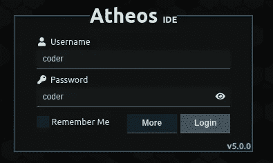

# Cyber 2022 的来临[第 16 天]安全编码| SQLi 的国王，颂歌者歌唱|简单的写作

> 原文：<https://infosecwriteups.com/advent-of-cyber-2022-day-16-secure-coding-sqlis-the-king-the-carolers-sing-simple-write-up-1de37365eb94?source=collection_archive---------3----------------------->

## 任务 21 答案—网络 2022 的来临[第 16 天]安全编码| SQLi 的《国王，颂歌者歌唱》—由 Karthikeyan Nagaraj 撰写


通过添加您的机器 IP-[http://<Machine-IP>. p . thm labs . com/](http://10-10-207-106.p.thmlabs.com/)打开链接


凭据:



# 任务 21【第 16 天】**安全编码** SQLi 的国王，颂歌者歌唱

## 1.Flag1 的值是多少？

> *我们可以合理地假设网站期望发送一个整数*`*id*`
> 
> **为了避免注入，我们可以将用户在 id 参数中输入的任何内容转换为整数。所以为此，我们将使用* `*intval()*` *功能。**
> 
> *这个函数将获取一个字符串，并尝试将其转换成一个整数。如果在字符串上没有找到有效的整数，它将返回 0，这也是一个整数让我们打开 `*search-toys.php*` *并改变参数**

```
*Change the $_GET['id'] to intval($_GET['id']) Everywhere on the elf.php File*
```

******

*运行检查*

**

```
*Ans: THM{McCode, Elf McCode}*
```

## *2.Flag2 的值是多少？*

> **首先，我们将修改初始查询，用一个带问号的占位符(* `*?*` *)替换任何参数。**
> 
> *这将告诉数据库我们想要运行一个以两个参数作为输入的查询。然后查询将被传递给 `*mysqli_prepare()*` *函数，而不是我们通常的* `*mysqli_query()*` *。**
> 
> *`*mysqli_prepare()*` *不会运行查询，但会指示数据库使用给定的语法准备查询。该函数将返回一个准备好的语句。**

****

> *MySQL 需要知道我们之前定义的每个占位符的值。所以我们可以使用 `*mysqli_stmt_bind_param()*` *函数给每个占位符附加变量。**
> 
> **该函数需要您发送 2 个函数参数！！**
> 
> **第一个参数应该是对准备好的语句的引用，变量将绑定到该语句。**
> 
> **第二个参数是一个字符串，由每个要绑定的占位符的一个字母组成，其中字母表示每个变量的数据类型。因为我们要传递两个字符串，所以我们将* `*"ss"*` *放在第二个参数中，其中每个“s”代表一个字符串类型的变量。您也可以使用字母“I”表示整数，或“d”表示浮点数**

**

*最终代码如下所示*

```
*$q = "%".$_GET['q']."%";
$query="select * from toys where name like ? or description like ?";
$stmt = mysqli_prepare($db, $query);
mysqli_stmt_bind_param($stmt, 'ss', $q, $q);
mysqli_stmt_execute($stmt);
$toys_rs=mysqli_stmt_get_result($stmt);*
```

**

```
*Ans: THM{KodeNRoll}*
```

## *3.Flag3 的价值是什么？*

*我们也必须改变 toys.php 的参数*

*更改以下参数$ _ GET[' id ']；*

**

*to intval($ _ GET[' id '])；在**处处都有**的 toys.php 文件*

****

```
*Ans: THM{Are we secure yet?}*
```

## *4.Flag4 的价值是什么？*

*添加带有问号(`?`)占位符的用户名和密码参数，其余参数与我们在第 2 个问题中所做的相同，我们将用户名和密码参数添加到 mysqli_stmt_bind_param 方法并执行它！！*

**

*把上面的代码修改成下面的代码！！*

```
*<?php
require_once("connection.php");
session_start();

if(isset($_POST['username']) && isset($_POST['password'])){
 $username=$_POST['username'];
 $password=$_POST['password'];
 $query="select * from users where username=? and password=?";
 $stmt = mysqli_prepare($db, $query);
 mysqli_stmt_bind_param($stmt, 'ss', $username, $password);
 mysqli_stmt_execute($stmt);

 $users_rs=mysqli_stmt_get_result($stmt);*
```

*现在快跑。！*

**

```
*Ans: THM{SQLi_who???}*
```

*感谢您的阅读！！*

*黑客快乐~*

```
*Author: Karthikeyan Nagaraj ~ Cyberw1ng*
```

*查询:*

*THM，TryHackMe，TryHackMe 2022 年网络时代的到来，TryHackMe 2022 年网络时代的到来第 4 天第 16 课，道德黑客，写，走过，TryHackMe 2022 年网络时代的到来第 16 天答案*

## *来自 Infosec 的报道:Infosec 每天都有很多内容，很难跟上。[加入我们的每周简讯](https://weekly.infosecwriteups.com/)以 5 篇文章、4 个线程、3 个视频、2 个 GitHub Repos 和工具以及 1 个工作提醒的形式免费获取所有最新的 Infosec 趋势！*