# 不同类型的恶意软件和其他攻击

> 原文：<https://infosecwriteups.com/analyzing-malware-and-other-attacks-57567fd7f77b?source=collection_archive---------1----------------------->

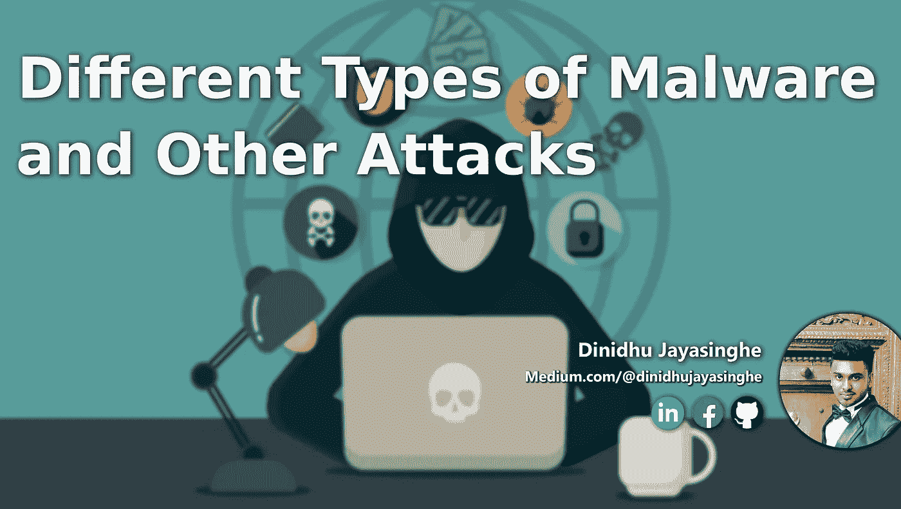

朋友们好，我是迪尼杜·贾亚辛格，这是我的第四篇文章。在这篇文章中，我将谈论
👉恶意软件(病毒、木马、蠕虫、广告软件、宏病毒等)
👉密码攻击
👉物理攻击
👉对抗性人工智能
👉供应链攻击
👉基于云的攻击与本地攻击
👉密码攻击(勒索软件)
我认为这对你了解这些攻击很有用。

# 妥协的指标(国际奥委会)

*   观察到的表明(高度可信)计算机入侵的工件。
*   一些潜在的妥协迹象
    👉平常**出站**网络流量
    👉DNS 请求异常
    👉不匹配**端口-应用**流量
    👉**特权用户账户**活动异常
*   异常出站网络流量可能会上传或删除我们网络中的数据。
*   当攻击者试图使用 DNS 端口 53 发起攻击或以某种方式进一步利用我们的网络时，可能会出现 DNS 请求异常。实际识别起来有点困难。

# 广告软件

*   一些软件使用的广告，可能是一些弹出广告或浏览器自动登录商业网站的结果。(不安全的种子用于进入电脑或不受信任的软件)
*   其实就是劫持网页浏览器或者操作系统。
    📌️ **劫持**:给操作系统或网络浏览器添加额外的代码，制作弹出广告，自动浏览登录类似的商业网站。

# 攻击套件

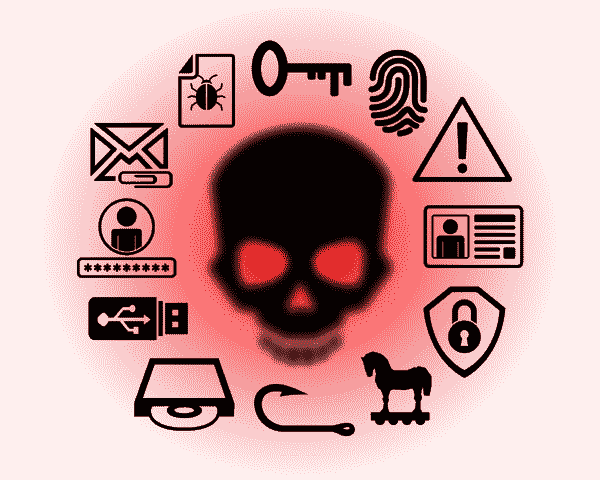

*   用于利用各种提供的传播和负载机制生成恶意软件(或犯罪软件工具)。
*   它有一个传播和负载机制的列表。我们可以在没有更多计算机知识的情况下，通过使用上述机制来创建恶意软件。

# 下载者

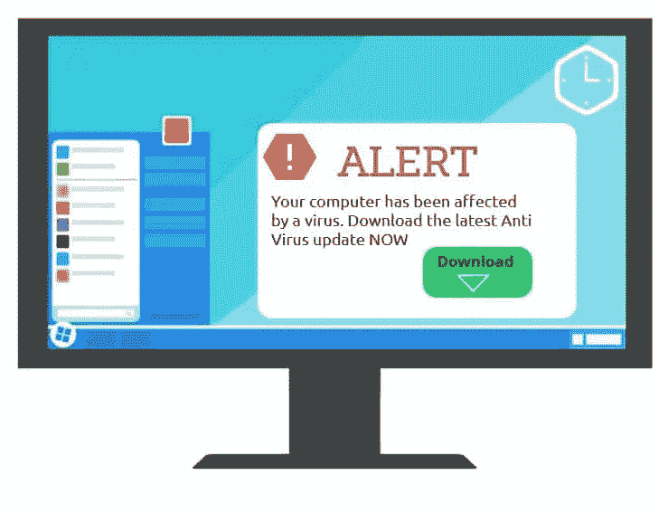

*   执行一些微小的代码它就可以下载黑客的有效载荷作为系统的内部人员，我们称之为下载器。
*   当攻击系统时，对攻击者来说可能很困难，因为系统有**杀毒软件、防火墙、入侵检测&预防软件**。所以攻击者交付了一大段代码而没有被检测到。然后使用下载器下载这个有效载荷。
*   首先，攻击者插入这个下载器，然后导入一个大型恶意软件包。

# 下载驱动

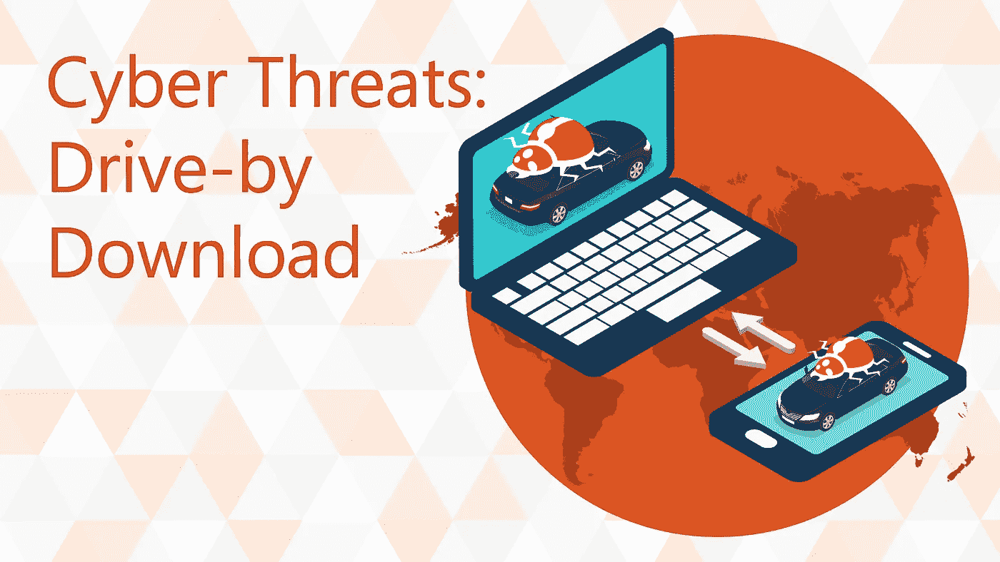

*   攻击在被访问的网站上使用代码，利用浏览器漏洞攻击客户端系统。

# 利用

*   利用漏洞的单一代码或命令序列。有时它是有用的代码，因为它可以用来检查系统的安全强度。

# 病毒

*   需要用户交互才能安装和复制的恶意代码。

## **前 7 大病毒**

1.[震网病毒](https://en.m.wikipedia.org/wiki/Stuxnet)
2。 [Conficker (2009)](https://en.wikipedia.org/wiki/Conficker)
3。 [MyDoom (2004)](https://en.wikipedia.org/wiki/Mydoom)
4。[索比格夫(2003)](https://en.wikipedia.org/wiki/Sobig)
5。[伊洛维尤(2000)](https://en.wikipedia.org/wiki/ILOVEYOU)
6。[【2001】](https://en.wikipedia.org/wiki/Code_Red_(computer_worm))
7。[斯拉姆(2003)](https://en.wikipedia.org/wiki/SQL_Slammer)

## **病毒生命周期**

📌️Actually，病毒有四个循环阶段。

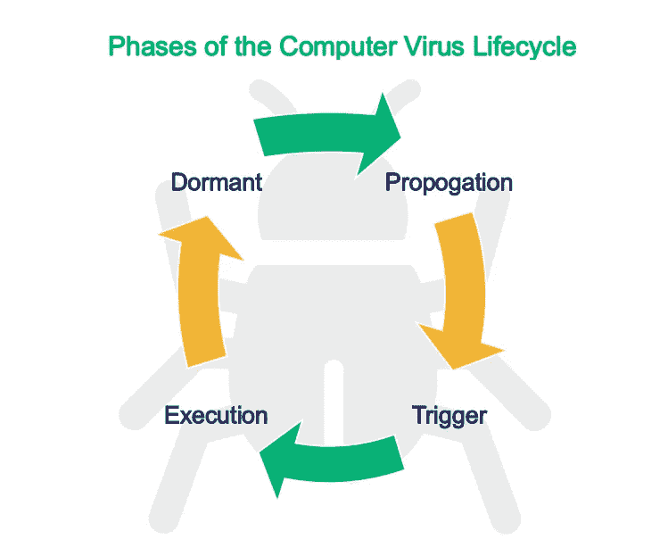

1.  **休眠阶段**
    👉病毒是闲置的，不做任何事情。
    👉这种病毒在这个阶段很难被发现。
    👉但是每一种病毒都没有这个阶段，那么那种病毒一直活跃着。
2.  **传播阶段**传播阶段
    👉把一个副本放入其他程序本身或者从攻击者的帮助下。
    👉当复制到另一个程序中时，病毒会改变其结构**(基于模式的结构)**。它有助于避免方向。因为一些检测机制是基于基于模式的签名的。
3.  **触发阶段**
    👉病毒被激活以执行其预期的功能。
4.  **执行阶段**
    👉释放有效载荷。

# 加密恶意软件(勒索软件)

*   恐吓或欺骗用户采取某种行动的恶意应用程序。
*   实际上，它加密用户的所有文件，并要求付费来解密这些文件。(通常向创建者支付移除该勒索软件解密文件的费用)
*   勒索病毒对个人伤害很大，但对个人这样的组织伤害不大。因为组织不允许访问某些数据，他们总是使用加密机制。
*   所以勒索软件的一个例子就是 **WannaCry 攻击(Wcrypt)**
    👉这是一个特定的恶意软件(勒索软件),字面上持有用户的电脑和他们的数据进行勒索。
    👉这种病毒迅速传播到 150 多个国家，仅一天之内就感染了 20 万台电脑。
    👉通过微软**“enter nablue”**漏洞传播。
    👉用**MS17–010 修补。**

# 特洛伊木马

*   一种计算机程序，看似具有有用的功能，但也具有隐藏的、潜在的恶意功能，可以规避安全机制。有时通过利用调用特洛伊木马程序的系统实体的合法授权。**恶意软件可以是 RAT(远程访问工具)**

## **常用远程访问工具(RAT)**

📌️生物网络项目
📌️网络总线
📌️ Sub7
📌️背孔
📌️ BO2k(后节流孔 2k)
📌️野兽
📌️迷失之门

*   基本上， **RAT** 可以做上传和下载文件，可以看网络摄像头，可以打开音频，可以像键盘记录器一样工作。

# 宏病毒

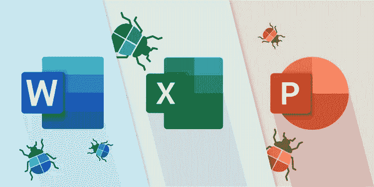

*   使用**宏或脚本代码**的病毒类型，通常嵌入在文档中，当查看或编辑文档时触发，运行并复制自身到其他此类文档中。
*   病毒总是附着在**上。exe** 文件，然后就可以用那个文件执行了。但是这种病毒附着在文档上。
*   恶意开发者开发宏病毒比开发附着于**的普通病毒获益更多。exe** 文件。因为**。exe** 在 Windows 平台上。但是当一个病毒附在一个文件上时，它可以很容易地传播到更多的平台上，并且可以做同样的坏事。
*   不允许每个电子邮件提供商发送**。exe** 文件。但是他们接受了这些文件。那么这种病毒很容易通过电子邮件传播。
*   每次我们都不处理**。exe** 文件。但是我们用文件来做。那么，当我们查看或编辑带有病毒的文档时，这些宏病毒就会造成危害。并且文档具有**读、写、执行权限**。这可能是这种病毒的优势。

# 沃尔姆斯

*   蠕虫是自我复制的程序，通常是独立的，可以在没有用户交互的情况下执行和传播。
*   蠕虫有一系列传播机制，众所周知的是利用目标的漏洞。
*   蠕虫有快速繁殖的方法。**罢兵传播的恶意软件叫做** [**代号**](https://en.wikipedia.org/wiki/Code_Red_(computer_worm)) **。**一些恶意软件兼有病毒和蠕虫的特性。

## **两种主要类型的蠕虫**

1.  **网络服务蠕虫**
    👉利用网络漏洞传播和感染他人。
2.  **群发邮件蠕虫**
    👉利用电子邮件系统传播和感染他人。

# 潜在有害程序(PUP)

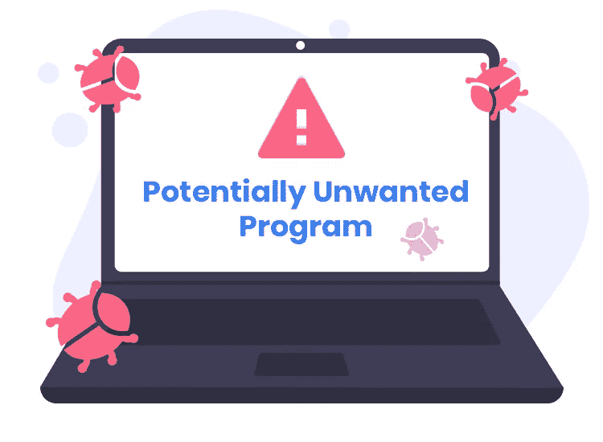

*   通常作为其他程序(广告软件、间谍软件)的一部分下载的应用程序。

# 无文件病毒

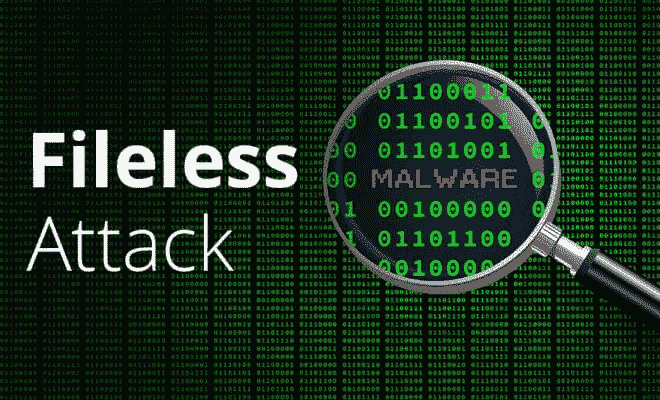

*   在内存中运行的恶意软件。
    👉不存储在文件中，也不安装在受害者的机器上。
    👉通常通过 PowerShell 或 WMI 连接到 Windows PC。
    👉2017 年 Ponemon Institute 研究估计**检测到的攻击中有 77%** 是无文件病毒。
    👉无文件病毒很难检测。

## 常见的无文件病毒/恶意软件工具

📌️ **无文件/攻击框架示例。**
👉帝国
👉Power splot(这是一个 PowerShell 漏洞利用框架)
👉Metasploit
👉CobalStrike

*   支持无文件恶意软件创建和 PowerShell **后利用**框架。
    📌️ **Post-exploit:** 意思是一旦它连接到您的系统，它可能会允许后门，可能会修改注册表，可能会上传&下载文件，或者可能会做任何事情，以允许攻击者在您的系统上获得持久性，然后转向并开始尝试通过您的网络工作。

# 僵尸网络

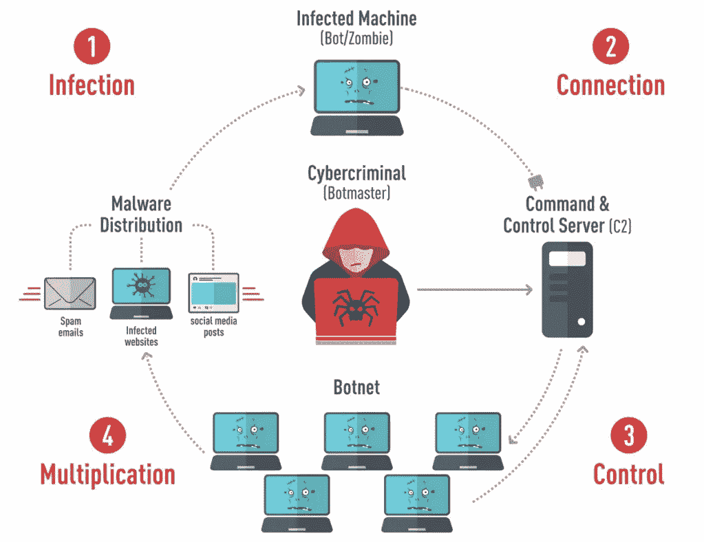

*   恶意代码感染大量主机，目的是对特定目标发动大规模攻击。
*   攻击者可能位于世界上的任何地方。
*   由**机器人大师**控制的大量船只。
    📌️ **僵尸主控机:**谁创建了僵尸网络程序来打开 rootkit 或获得远程访问被恶意软件感染的机器。
*   控制一个或多个命令和控制(C & C)服务器。
*   C & C 服务器可以控制数千个僵尸程序进行大规模 DDoS 攻击。

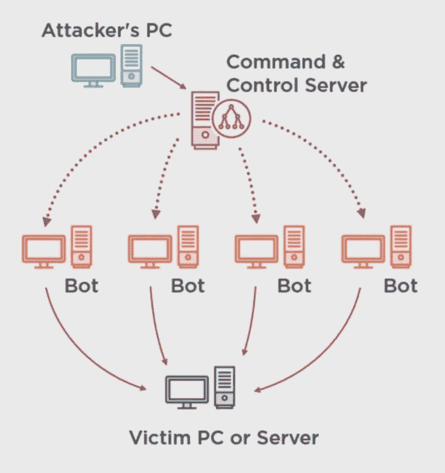

# 泛洪者(DoS 客户端)

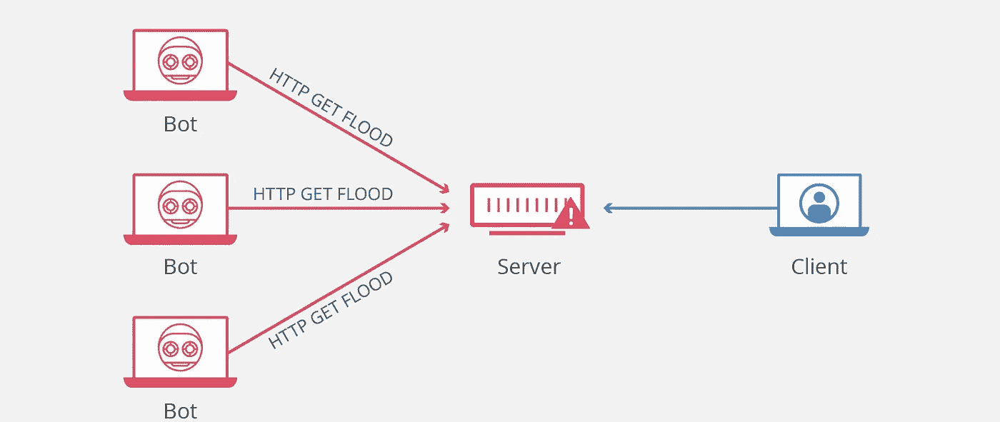

*   用于生成大量数据，通过 DoS 攻击来攻击联网的计算机系统。
*   **简单的 DoS 攻击**
    👉安装 DoS 泛洪器。
    👉给出目标 IP 地址的目的地。
    👉请求泛洪者向目标生成大量特定类型的数据包。
*   我们也可以使用泛洪创造一些网络流量。

# 逻辑炸弹

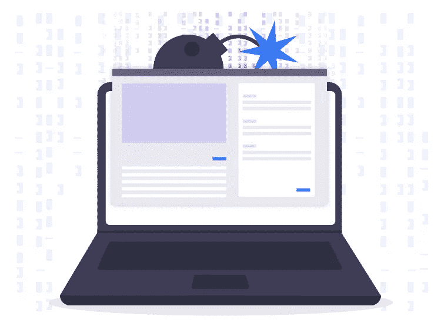

*   一段时间后触发的恶意代码-基于某些特定日期的活动。
*   很难被发现。
    👉在某些情况下，我们备份我们的数据，但认为在休眠阶段备份中的逻辑炸弹，然后我们无法检测到它。

# 间谍软件

*   一种软件，通过扫描系统文件中的敏感信息来监控击键、屏幕数据和网络流量，从而从计算机收集信息并将其传输到另一个系统。

# 键盘记录器

*   一旦安装在主机上，恶意应用程序就可以捕获所有击键。
    👉用户名和密码
    👉敏感信息
    👉电子邮件/聊天/即时消息
*   捕获的文件可以上传到远程位置，也可以存储在本地供以后检索。

**📌️一些网上银行系统提供虚拟键盘，以避免键盘记录器。**

# Rootkits

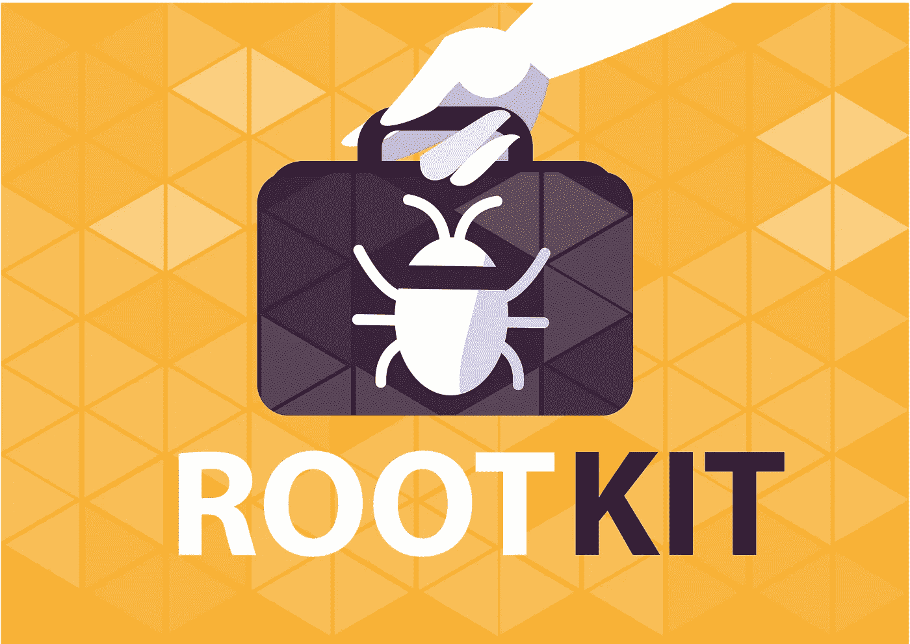

*   攻击者闯入计算机系统并获得**根级访问**后使用的恶意代码。Rootkit 允许攻击者远程持续访问内核子系统。当攻击者破坏了系统，然后安装 rootkits 以获得对内核的持续访问。Rootkits 是**很难从系统中检测到**。
*   Rootkits 很难摆脱
    👉在操作系统之前加载。
    👉可以禁用防病毒和反恶意软件。

# 后门(活板门)

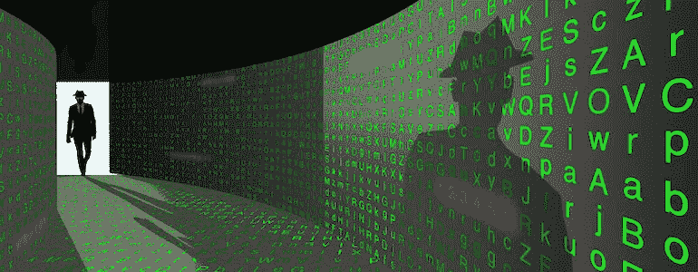

*   使用后门对系统进行未经授权的访问，而不通过系统的身份验证方法。**(绕过认证机制)**

# 喷雾

*   将大量用户名输入到一个通过密码循环的程序中。
*   暴力攻击类型，可用于字典攻击或泄露密码的数据库。

## 缓解方法

**📌️** 可以通过使用双因素认证(2FA)来缓解。

# 暴力攻击

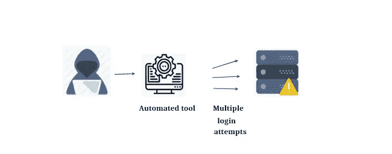

*   尝试每一种可能的密码组合的系统方法。
    👉耗时
    👉资源密集型

## 缓解方法

**📌️** 大多数账户在多次尝试输入密码后都会被发现。
📌️ 密码的长度增加了破解密码的时间。

# 字典攻击

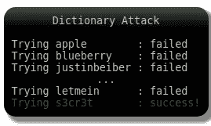

*   使用已知单词尝试和检测密码。
    👉使用预定义的一组可能单词的字典中的单词。
    👉比暴力更快，因为只使用可能成功的单词。

## 常用工具

**📌️** 布鲁图
t22】📌️ 该隐和亚伯
📌️ 破解
t28】📌️air crack-ng
t31】📌️ 开膛手约翰
t34】📌️air odump-ng
t37】📌️loftcrack
t40】📌️ 元项目
元项目**📌️** 眼科

## 混合方法

*   Hybrid 是一种强力攻击，它结合了字典攻击和之前的单词变体。然后导致普通的暴力攻击。
    👉在恢复到普通暴力攻击之前使用。

# 彩虹桌

*   预计算表来反转**加密哈希**。
    👉减少暴力破解密码的时间。
    👉增加存储彩虹表所需的存储量。
    👉每个哈希类型(MD5、SHA 1 等)都需要彩虹表

## 缓解方法

**📌️** 可以使用**“密码加盐”**
来缓解👉向哈希算法中添加随机数据。这样即使两个用户有相同的密码，每个用户的散列也是**唯一的。
👉盐值越大，安全性越高。**

# 已知明文/密文

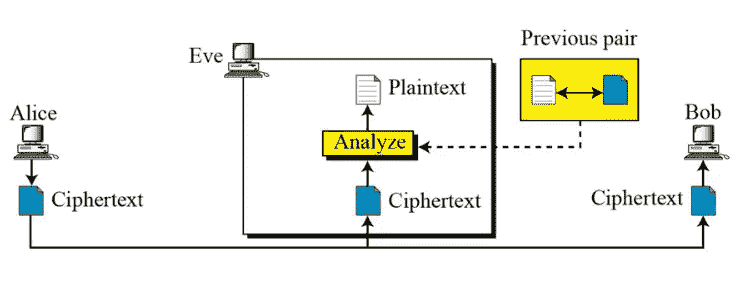

*   访问明文和加密输出(密文)
    👉该攻击可用于揭示更多信息，例如用于加密后续消息的密钥或代码簿。

**📌️高级加密标准(AES)密码不易受到这种类型的攻击。**

# 生日袭击

*   对哈希冲突的加密现象起作用的暴力攻击。
    👉如果有足够的时间，两个独立的源可以产生相同的哈希值。**(出现率因哈希算法而异。)**

# 降级攻击

*   这种攻击迫使系统协商降低通信质量。
    👉允许攻击者强制使用较低级、较不安全的通信方法。
    👉通常允许与传统系统进行通信。
    👉常用于**中间人(MiTM)** 攻击。

# 身体攻击

## 恶意的普遍攻击

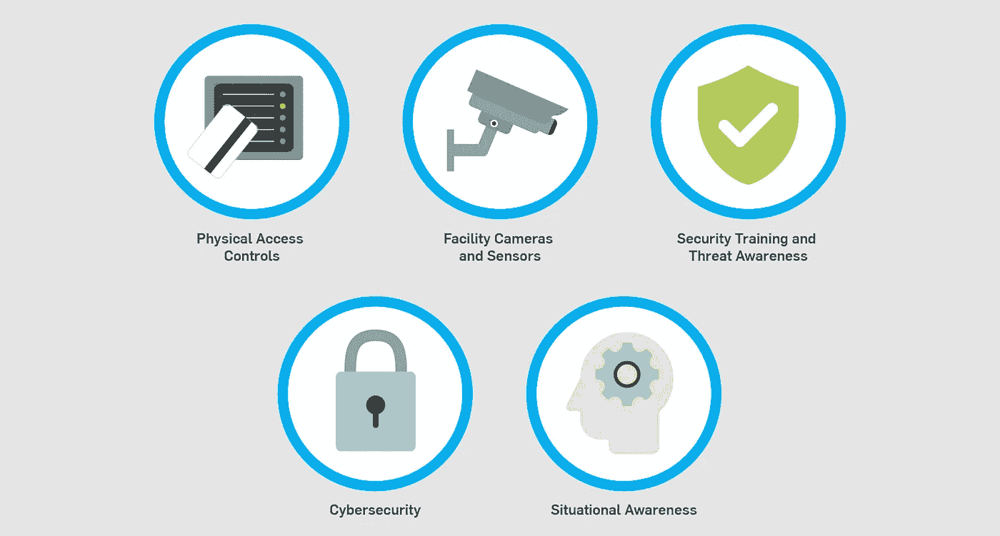

*   这种攻击表面的系统，不管它在哪里，但它是普遍适用的。
*   因此，从物理安全的角度来看，我们应该注意像大门、锁、门这样的东西。

## 通用串行总线(USB)

*   那是一个攻击媒介。攻击者和黑客可以通过多种方式通过 USB 驱动器访问系统。所以我们可能有真正的恶意闪存盘。

## 恶意闪存驱动器

*   这是最简单的方法之一，拿一个受感染的 u 盘，抓一把放在停车场或公司里比较显眼的地方。有人选择它并将其插入他们的计算机，它可能是也可能不是任何恶意的东西。它可能是一个空的驱动器，或者它有一些文件。**但重点是它在幕后启动了 RAT。** **(RAT —远程访问木马)**

## 卡片克隆

*   我们可以克隆 RFID 卡，NFC 卡，甚至信用卡。

## 撇取浮沫

*   有一些略读技巧
    👉用于收银台扫描磁条的读卡器。
    👉复制读卡器滑过 ATM 读卡器并下载磁条信息。

# 对抗性人工智能

## 机器学习的污染训练数据

*   通过提供欺骗性输入来欺骗模型的技术。

## 机器学习算法的安全性

**📌️** 威胁建模
t20】📌️ 攻击模拟
攻击模拟**📌️** 对抗模拟
**📌️** 长期运行算法

# 供应链攻击

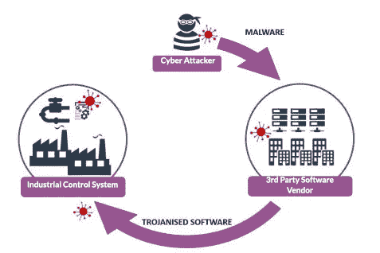

*   通过瞄准供应网络中不太安全的元素来攻击组织。**(很像水坑攻击)**
    👉高级持续威胁。
    👉锁定供应链网络下游的受害者。

**例题**
**📌️** POS 恶意软件(**销售点** ) /受感染的 u 盘
**📌️** 恶意软件(或硬件)在到达目标公司之前安装在计算机设备或网络设备上。

## 供应链攻击示例。

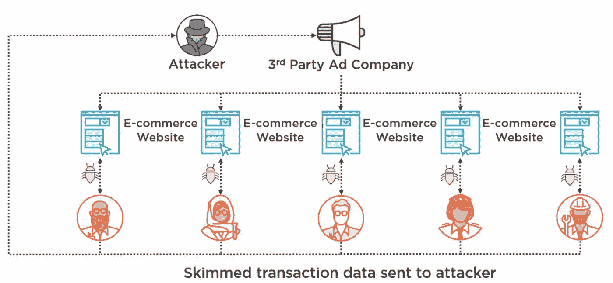

**📌️** 有一家电子商务网站公司利用第三方广告公司来弹出广告。当攻击者危害该第三方广告公司并向该公司的服务器注入一些恶意软件时。现在，在那些电子商务网站上工作的客户中，谁的信用卡信息和订单信息会受到恶意软件的影响。

# 基于云的攻击与内部攻击

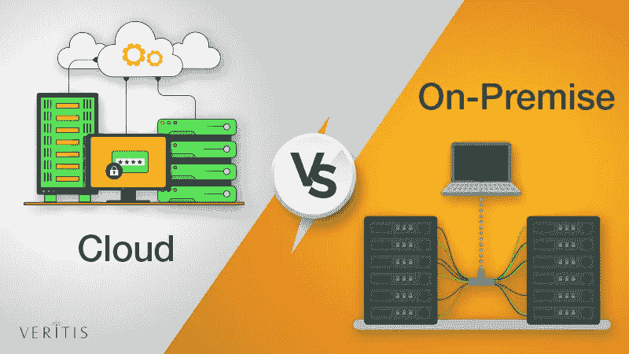

*   安全的有效性取决于许多因素
    👉公司/数据中心的类型
    👉行业(法规、合规性)
*   基础设施更新
    👉如果我们在**云**中，真的不必担心基础架构更新。
*   **云提供商安全**
    👉大型安全人员
    👉广泛行业的深厚专业知识
    👉24 × 7 监控
    👉投诉和监管专业知识

我想现在你对不同的恶意软件和不同的攻击有了一个概念。有我写的博客。如果你对这些话题感兴趣，你可以通过超链接阅读。

✅ [**比较不同类型的社会工程技术**](https://dinidhujayasinghe.medium.com/comparing-different-types-of-social-engineering-techniques-477336207f70) **✅**[**cold box:easy【vulnhub】预排**](https://dinidhujayasinghe.medium.com/colddbox-easy-vulnhub-walkthrough-cac3680e03c2) **✅**[**基本五旬节:1 预排| Vulnhub**](https://dinidhujayasinghe.medium.com/basic-pentesting-1-walkthrough-vulnhub-4dac91b416ff)

我希望你喜欢它，并且从我的文章中有所收获。谢谢大家。让我们来看看另一篇文章。下次见，再见🙌祝你黑客生涯愉快😈😈。

@