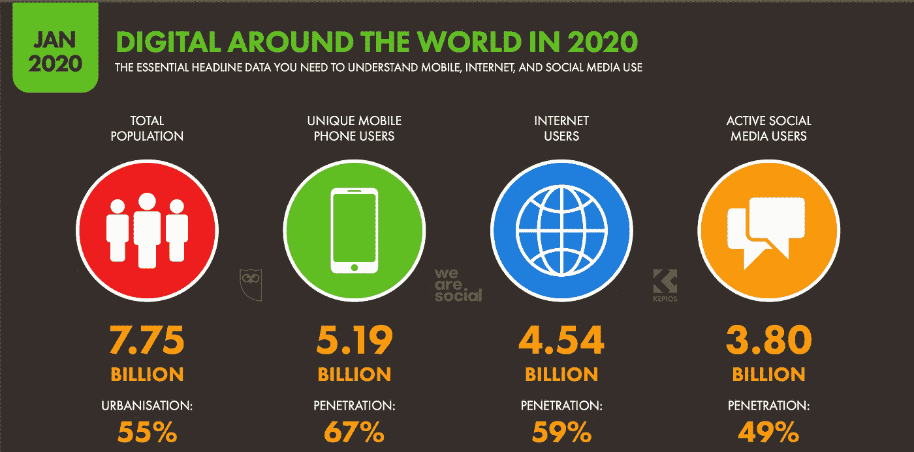
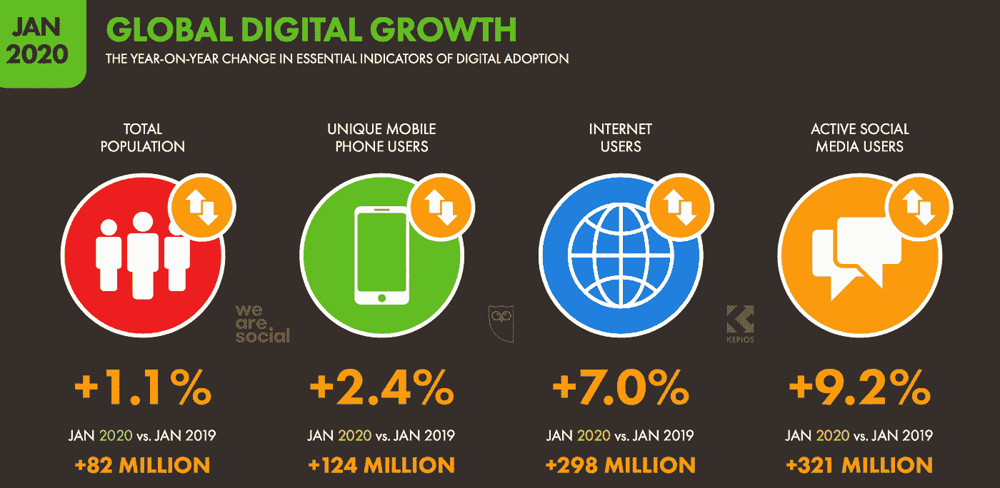
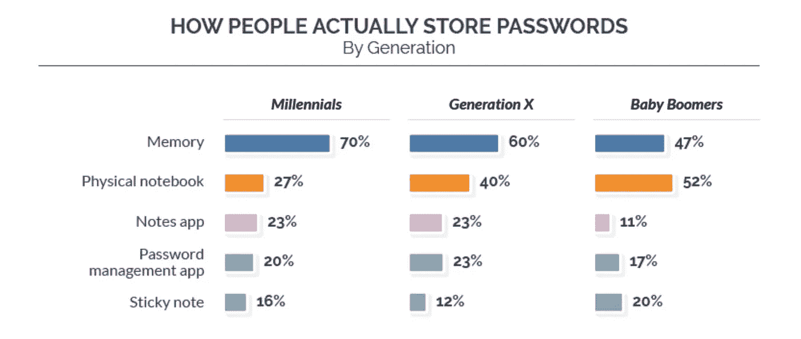
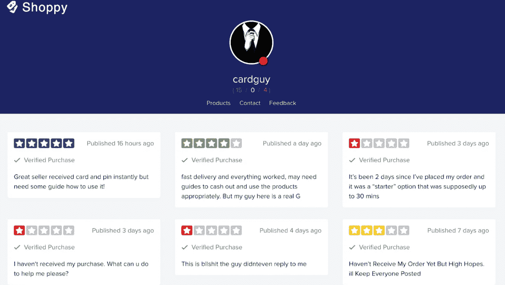
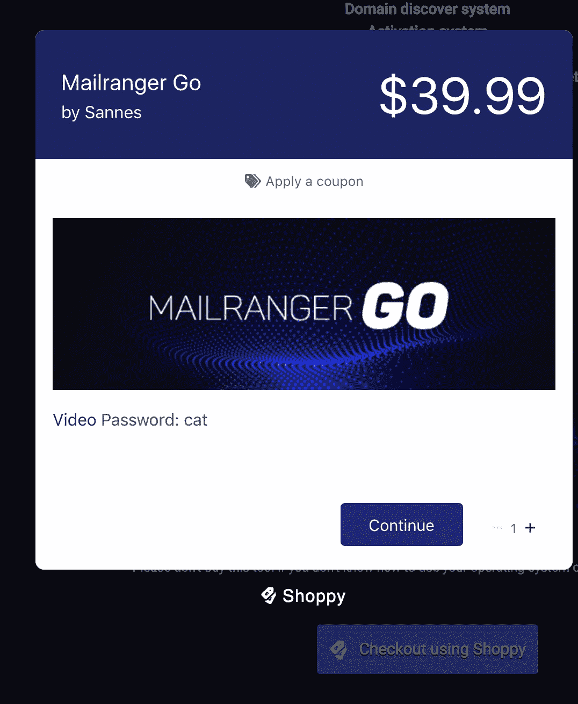
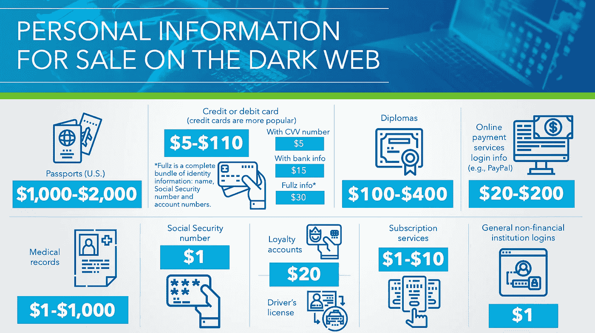

# 自动接管账户的剖析

> 原文：<https://infosecwriteups.com/anatomy-of-automated-account-takeovers-92584125d161?source=collection_archive---------0----------------------->

**气候培育 ATOs 概述**

生活在一个数据隐私反乌托邦的时代，拥有一个在线存在伴随着“被 pwned”的直接机会成本。在一个由合法和非法参与者推动的数据黑市中，网络犯罪分子不仅在他们之间进行交易，还与大公司就被盗数据进行交易，保险公司作为市场中的一员非正式地助长了 T4 的勒索软件攻击。

事实上，数据泄露的数量以及数据泄露的平均成本[会延续](https://www.marketwatch.com/story/data-breaches-soared-by-17-in-2019-but-theres-some-good-news-too-2020-01-29)。不得不[自我监管](https://g8fip1kplyr33r3krz5b97d1-wpengine.netdna-ssl.com/wp-content/uploads/2019/12/4dec-Falling-behind_StratCom_COE.pdf)在不断扩大的网络安全领域，[隐私解释](https://youtu.be/L6Hzm2HTWJo?t=100)和[意识](https://www.hackread.com/paypal-bug-bounty-report-expose-account-takeover-vulnerabilities/)的模糊导致技术领导者[选择](https://www.inkwoodresearch.com/reports/global-biometrics-market/)生物识别作为主要认证方法，而[淘汰](https://www.researchandmarkets.com/reports/4841334/biometrics-technologies-market-to-2027-global)传统的基于密码的用户登录，[尽管](https://www.paysafe.com/fileadmin/content/pdf/LostInTransaction_2019_Whitepaper.pdf)公众[对使用](https://www.usenix.org/system/files/soups2019-reese.pdf)[密码](https://www.logisticsit.com/articles/2019/12/04/uk-shoppers-shun-fingerprint-scanners-and-facial-recognition-in-favour-of-traditional-passwords,-new-fis-report-reveals)感到满意。误解在于这样一个事实，通过选择生物认证而不是密码，用户获得了用户体验(UX)和安全(T19)的完美结合。然而，生物识别支持的认证方法并不总是表现为[万无一失](https://www.youtube.com/watch?v=tJw2Kf1khlA)或[用户友好](https://www.youtube.com/watch?v=ugD-YxDuSX8&t=371s)。

鉴于上述情况，公众对科技企业的信任度已经下降，这随后[反映到](https://www.accenture.com/_acnmedia/PDF-93/Accenture-Trust-in-Business-Infographic-2019.pdf)这些企业[的财务上](https://www.pingidentity.com/content/dam/ping-6-2-assets/Assets/Misc/en/3464-consumersurvey-execsummary.pdf)。这种情况是由新的动态挑战造成的，如隐私法律法规的采用带来的[数据访问权限利用](https://youtu.be/i5tY2C-tkhg?t=265)。

**ATO 的官方定义**

“当欺诈者或计算机犯罪分子伪装成真正的客户，获得对帐户的控制，然后进行未经授权的交易时，帐户被接管就可能发生。任何帐户都可能被犯罪分子接管，包括银行、信用卡、电子邮件和其他服务提供商。网上银行账户通常会被网络钓鱼、间谍软件或恶意软件诈骗所接管。这是一种网络犯罪或计算机犯罪。” [— ActionFraud](https://www.actionfraud.police.uk/a-z-of-fraud/account-takeover) 伦敦金融城警方提供的一项服务。

**说明当前账户接管规模的关键数字**

“在电子商务企业报告的全部 96%的欺诈攻击中，帐户盗用被列为三大欺诈类型之一。” [— MRC 2019 全球欺诈调查](https://merchantriskcouncil.org/resource-center/surveys/2019/2019-mrc-global-fraud-survey-results)

“89%的金融机构高管表示，账户盗用欺诈是其数字渠道损失的最常见原因” [—艾特集团](https://www.onespan.com/resource-center/digital-channel-fraud-mitigation-evolving-to-mobile-first?ad=blog-text)

“去年，账户被盗造成了 40 亿美元的损失，比前一年(51 亿美元)略有下降，但与近年来的数据相比，却大幅上升。”[标枪战略&研究](https://www.javelinstrategy.com/press-release/consumers-increasingly-shoulder-burden-sophisticated-fraud-schemes-according-2019)

“绝大多数被侵入的帐户都处于休眠状态…其中 65%的帐户属于 90 多天未登录的用户，80%的帐户属于 30 多天未登录的用户。”— [数据查看器](http://go.datavisor.com/rs/567-BUS-347/images/DataVisor%20Fraud%20Index%20Report%20Q2%202019.pdf)

“29%的违规涉及使用窃取的凭据。”[—2019 年威瑞森数据泄露事件报告](https://enterprise.verizon.com/resources/reports/2019-data-breach-investigations-report.pdf)

**凭证填充在自动 ATO 攻击中的作用**

犯罪分子通过发生在低姿态网站的数据泄露收集数十亿登录凭证。通过凭据填充，他们可以利用人们重复使用相同密码和用户名组合的趋势，即使是在知名度较高的网站上。密码的重复使用增加了用户的凭证已经存在于已经被破坏的'[组合列表](https://spycloud.com/our-perspective-on-the-collection-combo-lists/)'中的可能性(例如，“集合#1-#5”)。有了供犯罪分子使用的免费服务，如[人搜索](https://medium.com/@Peter_UXer/osint-how-to-find-information-on-anyone-5029a3c7fd56)来收集用户凭证，以及利用组合列表来自动进行凭证填充攻击的工具，犯罪分子可以简化数据泄露，从而以更高的成功率进行账户接管(ATO)。

> *“从 2018 年 1 月到 2019 年 6 月，超过 610 亿次凭据填充尝试”——Akamai，* [*互联网状态*](https://www.akamai.com/us/en/multimedia/documents/state-of-the-internet/soti-security-media-under-assault-report-2019.pdf?mkt_tok=eyJpIjoiTldJeE5HWmtaamxpWlRObCIsInQiOiJWSEtYa01cL0tBWXhNU3dLM1hPS2E1a29kaFJERFM0SnVpM2FUMXAzVHI4b3Y3dXFLXC91cUtSVElTTmxwTWlCVThqSEJFQ2Zpbm5YYlhuTjlPNWtiaFVVWVdwbVN4UW5qY2RockdlNTJoZDVJNWpPZ1ZFQ2FlZ3NsQWNTTnFMTUVMIn0%3D)

简而言之，再加上用户倾向于在各种平台上使用相同的密码，无论是高调还是低调，许多网站接受电子邮件地址/电话号码作为有效/替代用户名，这进一步简化了犯罪分子的攻击:一个用户名和一组可重复的密码用于属于受害者的所有帐户。

构成威胁的两种主要类型的凭据填充攻击是协调一致的[大规模](https://www.idtheftcenter.org/wp-content/uploads/2020/01/01.28.2020_ITRC_2019-End-of-Year-Data-Breach-Report_FINAL_Highres-Appendix.pdf)基于复杂技术的自动威胁攻击和有针对性的攻击。虽然针对前一种类型的攻击，普通用户可以采取预防性的[措施](https://techcrunch.com/2019/05/20/google-data-two-factor-security/)，但是对于缺乏网络安全意识的不太懂技术的用户来说，要避免成为后一种类型攻击的受害者，他们所能做的非常有限。尽管大规模[自动化](https://owasp.org/www-community/attacks/Credential_stuffing)威胁攻击通常可以通过用户对其帐户启用双因素身份验证(2FA)来避免，但这并不像通常认为的那样被用户广泛采用。即使是存储高度敏感数据的[电子邮件帐户](https://krebsonsecurity.com/2013/06/the-value-of-a-hacked-email-account/)等服务，也可以集成到各种其他第三方平台/服务，因此用户不必使用 2FA。根据报告，在超过[15 亿](https://blog.gsmart.in/how-many-gmail-account-users-in-the-world/)活跃 Gmail 用户中， [90%](https://www.theverge.com/2018/1/23/16922500/gmail-users-two-factor-authentication-google) 没有启用 2FA。尽管根据[调查](https://duo.com/blog/the-2019-state-of-the-auth-report-has-2fa-hit-mainstream-yet)金融机构(FIs)账户被认为是最重要的用户安全账户类型，但 FIs 仍然通过不在账户访问时强制使用 2FA 来促进凭证填充攻击。

由于在 UX 和安全性之间保持安全平衡的持续困境，公司选择将 2FA 作为推荐选项，而不是作为强制实践强加给用户。然而，不从一开始就实施 2FA 会导致[额外的](https://www.usenix.org/system/files/soups2019-reese.pdf)认证层(即静态和[动态](https://blog.alloy.co/answering-my-own-authentication-questions-prove-that-theyre-useless-386191e4f62f)基于知识的问题和[更多](https://www.helpnetsecurity.com/2019/05/21/preventing-google-account-takeovers/)，因此[在后面的步骤中中止](http://damonmccoy.com/papers/loginchallenges.pdf)用户体验。然而，所有上述认证控制都可能被罪犯绕过，这将在本系列的后面部分进行讨论。

**网络犯罪作为一种产业——现状**

网络犯罪行业虽然是非法的，但仍然按照维持任何业务运营的基本原则运作，即获得并保持正投资回报(ROI)。于是，随着被称为客户端池的目标群体的不断增长，加上互联网用户的[缺乏](https://www.loginradius.com/blog/2018/05/infographic-poor-password-hygiene-letting-cybercriminals-clean/)密码卫生[意识](https://security.googleblog.com/2019/05/new-research-how-effective-is-basic.html)，网络犯罪行业提供了许多可利用的机会，这将引导犯罪分子将成功攻击的成本降至最低。事实上，这造成了犯罪分子技术传播者和企业家与网络安全行业之间的技术竞争，犯罪分子采用新兴技术并开发用于攻击的[高级自动化](https://www.youtube.com/watch?v=KTfrbvxKQwo)和绕过安全措施的新方法/战术[，而实施和调整针对网络犯罪的安全措施的](https://www.hbs.net/blog/december-2016/bypassing-security-controls-cyber-crime)[成本](https://cybersecurityventures.com/cybersecurity-market-report/)则持续存在。

[https://www . enzoic . com/8-ways-to-reduce-credential-stuffing/](https://www.enzoic.com/8-ways-to-mitigate-credential-stuffing/)

**目标人群的增长对犯罪策略的影响**

在不断增长的 77.5 亿人口中，自 2014 年以来，互联网用户数量从 24 亿增加到 45.4 亿。请记住，在这 45.4 亿人中，37.6 亿人使用移动和网络支付方式购买产品和服务，凭据填充攻击为犯罪分子提供了有利可图的选择，如相关数据所示。仅在 2019 年第一季度， [281 起数据泄露](https://www.idtheftcenter.org/wp-content/uploads/2019/04/2019-March-Data-Breach-Package.pdf)暴露了超过[45.3 亿条记录](https://www.itgovernance.co.uk/blog/list-of-data-breaches-and-cyber-attack-in-march-2019)，而据报道，每天有 100 万用户名和密码泄露或被盗。

[https://datareportal . com/reports/digital-2020-global-digital-overview](https://datareportal.com/reports/digital-2020-global-digital-overview)

互联网用户的不同人口统计群体表现出特定于其人口统计群体的在线行为模式，因此呈现出不同的漏洞，供犯罪分子利用[通过基于其关键弱点和相关财务](https://hbr.org/2014/03/choosing-the-right-customer)[统计](https://www.creditdonkey.com/average-checking-account-balance.html)的客户端池细分来识别目标客户端，不仅优化了犯罪分子的凭证填充攻击的 ROI(投入的精力和时间获得最高收益)。值得注意的是，基于年龄的客户群细分描述了攻击者对[千禧一代](https://www.ftc.gov/system/files/attachments/blog_posts/Not%20what%20you%20think%3A%20Millennials%20and%20fraud/millennials_spotlight_oct2019_0.pdf)和[年长者](https://www.cnbc.com/2019/02/13/older-americans-lose-almost-3-billion-a-year-to-scams.html)行为模式的偏好。

> *“罪犯一年从美国老年人身上偷走 370 亿美元”——*[*彭博*](https://www.bloomberg.com/news/features/2018-05-03/america-s-elderly-are-losing-37-billion-a-year-to-fraud)

如上所述，在深入研究攻击技术之前，深入了解目标人群或客户群的不同部分的一般行为模式是非常宝贵的。根据报告，一个标准用户平均有 90 个需要密码的账户，重复使用相同的密码 4-6 次。当需要更新时，68%的用户只稍微修改他们以前的密码，此外，大多数用户仍然依靠他们的记忆来记住他们的密码。另一方面，使用[密码管理器](https://security.stackexchange.com/questions/199025/mitigating-the-problem-of-single-point-of-failure-introduced-by-password-manager)来保护账户凭证也确实存在某些[漏洞](https://www.youtube.com/watch?v=jvll_odUaxY)，产生了[单点危害](https://security.stackexchange.com/questions/199025/mitigating-the-problem-of-single-point-of-failure-introduced-by-password-manager)。

[https://www . security . org/resources/online-password-strategies/](https://www.security.org/resources/online-password-strategies/)

犯罪分子主要通过被称为“坏机器人”的工具来使用自动化进行凭据填充，从而避免了手动工作，手动工作需要使用规避的秘密方法来规避组织用来保护资产的预防性和检测性控制的创新迭代。机器人是在线运行的软件程序，用于执行重复的任务。虽然[占](https://www.imperva.com/resources/resource-library/reports/bad-bot-report-2019-the-bot-arms-race-continues-report-ty?lang=EN&asset_id=2447)网站总流量的 20.4%，但其中只有 21.1%被归类为复杂类型，也称为多功能一体(AIO)应用。犯罪分子使用的著名工具有“[SNIPR](https://snipr.gg/)”(20 美元)、 [STORM](https://www.netacea.com/blog/storm-cracker-tool) 、 [MailRanger](https://www.youtube.com/watch?v=TGEF9ed3TZo) 、 [SentryMBA](https://www.youtube.com/watch?v=AKUFCzyEf6Q) 。尽管黑客之间的市场竞争促使其他黑客对现有工具进行逆向工程以优化缺陷并将破解或盗版版本重新投放到市场。我们应该记住，即使是合法的工具也被犯罪分子用作“访问检查器”，如 [OpenBullet](https://github.com/openbullet/openbullet) 。此类工具以其强大的[支持社区](https://forum.openbullet.dev/)而闻名，使用上传的配置文件编程生成有序的 [API 调用](https://www.akamai.com/us/en/multimedia/documents/state-of-the-internet/soti-security-financial-services-hostile-takeover-attempts-report-2020.pdf)和/或使用脚本语言(例如 PhantomJS、trifleJS 和[其他](https://2k16.balccon.org/slides/Automated_Web_Attacks_Using.pdf))自动浏览过程，使用浏览器仿真库(Puppeteer、Selenium 等)或仅使用工具(例如 browser automation studio)。

**创新的刑事采纳**

尽管社区对传统的、手动的和费力的攻击技术提供了大量的支持，这些攻击技术在网络论坛上以[的价格范围](https://www.deathbycaptcha.com/user/order)提供，这些论坛托管在[防弹](https://www.trendmicro.no/media/wp/wp-criminal-hideouts-for-lease-en.pdf) [服务器](https://www.youtube.com/watch?v=ep2gHQgjYTs&feature=emb_title)上，这些服务器具有被关闭的弹性，随着社区对当代的、具有检测弹性的[即时消息](https://wow.intsights.com/rs/071-ZWD-900/images/Messaging%20Applications%20The%20New%20Dark%20Web.pdf)群组(即[【黑暗工作】](https://research.checkpoint.com/2018/telegram-cyber-crimes-channel-choice/))甚至合法的[自由职业者](https://community.upwork.com/t5/Freelancers/I-think-the-job-i-m-doing-is-illegal/td-p/281166/page/2)和在罪犯之间臭名昭著的合作和信息共享的补充下，最新自动化技术的采用已经取代了上述繁重的人工任务，同时增加了进一步的复杂层次，利用人工智能增强系统将坏机器人提升到超过 T21 自动化水平。

坏机器人是高度复杂的自动化机器人，设计为在静止隐形模式下运行，并通过其内置的欺骗和规避功能模仿行为，这有助于[超越](https://www.hbs.net/blog/december-2016/bypassing-security-controls-cyber-crime)检测和预防性安全控制。通过使用旋转 VPN、安全 [VPS](https://monovm.com/blog/what-is-the-difference-between-vps-and-rdp-account/) 、 [RDP](http://hackersenigma.com/organizations-leave-backdoors-open-to-cheap-remote-desktop-protocol-attacks/) 服务器或[住宅](https://www.privateproxyreviews.com/best-instagram-proxies/)、安全和其他干净的[代理](https://www.reddit.com/r/darknet/comments/7vpptf/socks5/)，可以以 [5 英里](https://www.fraudbeat.com/carders-monitor-fraud-analysts/)的精度模拟目标受害者的位置。此外，不良机器人借助[数字掩码](https://www.technadu.com/digital-browser-identities-richlogs-dark-web/77309/)逃避反欺诈控制措施，该数字掩码不仅包含受害者的独特行为(例如，点击触摸屏频率)和浏览模式(例如，屏幕时间或用户感兴趣的字段)，还包含受害者使用[分身](https://securelist.com/digital-doppelgangers/90378/)的设备指纹(例如，设备 ID、操作系统版本)。

开发上述对策以规避机器人检测控制，如谷歌的 [reCaptcha](https://arxiv.org/pdf/1903.01003.pdf) 和其他曾经需要人工参与的传统控制，验证了这种高级机器人对凭据填充攻击的优势性质。即使是机器人最大化登录尝试次数、触发锁定挑战/条件或产生导致帐户锁定的可疑活动的情况，也可能为犯罪分子带来收入流。一旦账户被锁定，后台收到通知，犯罪分子就可以立即发起第二层和第三层 ATO 攻击。通常，在第二层攻击(例如滥用恢复选项)失败后，第三层攻击立即开始，将受害者的帐户详细信息发送到一个伪[支持中心](https://www.youtube.com/watch?v=le71yVPh4uk)(将在另一篇文章中更深入地讨论)，以伪“警告”帐户被锁定的受害者。这是为了护送受害者远程访问他/她的帐户，解锁帐户，甚至分享在电子邮件或短信中收到的详细信息，以根据[请求](https://twocents.lifehacker.com/beware-a-new-scam-that-asks-for-your-bank-pin-on-the-ph-1838909542)重置他们的密码，因此导致 ATO。事实上，尽管遇到重重障碍，罪犯们还是设法扭转了局面。

**犯罪利用警惕疲劳**

据估计，超过一半的全球公司既没有[准备好](https://www.fireeye.com/offers/rpt-cyber-trendscape.html)也没有[准备好](https://www.hiscox.com/documents/2019-Hiscox-Cyber-Readiness-Report.pdf)处理大规模网络攻击，缺乏高技能的网络安全人员[更不用说网络安全领导](https://www.globenewswire.com/news-release/2019/05/09/1821287/0/en/Cybersecurity-Skills-Shortage-Worsening-for-Third-Year-In-A-Row-Sounding-the-Alarm-for-Business-Leaders.html)[了](https://www.helpnetsecurity.com/2019/10/01/fortune-500-ciso/)；因此，为非法网络犯罪行业创造了条件，让市场中的合法参与者得以蓬勃发展。

根据互联网流量，坏机器人可以被视为数字世界的永久居民，距离成为官方主导的数字公民仅一步之遥。虽然为了避免检测，坏机器人被开发为在凭证填充攻击期间通过复制任何好的红队操作保持隐身模式，但被赋予人工智能自动化能力使它们具备了讲故事的艺术[正如最近在自动化入侵和攻击模拟(](https://youtu.be/s19na5Iob6A?t=1405) [BAS](https://www.youtube.com/watch?v=xPNopwxLooM) ) [解决方案](https://www.esecurityplanet.com/products/top-breach-and-attack-simulation-bas-vendors.html)中观察到的那样。

由于[讲故事](https://blog.redteam.pl/2020/01/deceiving-blue-teams-anti-forensic.html?m=1)造成的欺骗，坏机器人的活动可能被视为“白噪音”，并被标记为 50%的已报告警报中的误报警报、非优先警报或来自压倒性 [25K](https://bricata.com/blog/how-many-daily-cybersecurity-alerts/) 日常事件的[范围内的](https://youtu.be/2iSYmqIL2vk?t=1202)事件，这些事件平均可持续[几天](http://go.datavisor.com/rs/567-BUS-347/images/DataVisor%20Digital%20Fraud%20Trends%20Report%20-%202020%20Q1.pdf)由[安全分析师](https://www.criticalstart.com/wp-content/uploads/CS_MDR_Survey_Report.pdf)确定。考虑到分析师平均每天收到 20 个警报，每个警报持续 20 分钟进行调查，以及他们每年接受 20 小时的[有限](https://www.criticalstart.com/new-research-from-criticalstart-finds-that-8-out-of-10-security-analysts-report-annual-security-operations-center-turnover-is-reaching-10-to-more-than-50/)培训，分析师浪费一半以上的时间[寻找无关紧要或根本不是问题的问题](https://www.enterprisemanagement.com/research/asset.php/3441/InfoBrief:-A-Day-in-the-Life-of-a-Cyber-Security-Pro)是不可避免的。类似于多米诺骨牌效应，资源的浪费损害了关键绩效指标，最终让罪犯受益。

> *“每天有 5 万个唯一的 IP 地址进行凭据填充尝试”——*[*auth 0*](https://auth0.com/blog/auth0-reveals-50000-credential-stuffing-attempts/?utm_source=facebook&utm_medium=sc&utm_campaign=jtpr_credstu&fbclid=IwAR2dv6NSkAo-OKwEFSckTq8NBDrOc9db18qssWaQhEzXfLTZ1CT5zgsXbmU)
> 
> *“使用 14 天的数据，我们观察到 21，962，978 次登录尝试；其中，33% (7，379，074)代表登录失败。”—* [*赤麦*](https://www.akamai.com/us/en/multimedia/documents/state-of-the-internet/soti-security-financial-services-attack-economy-report-2019.pdf)

**在 ATO 上兑现**

狡猾地[模仿受害者的足迹和他们帐户中的模式，同时避免在成功的凭据填充攻击中调用安全和欺诈保护措施，犯罪分子积累了重要的帐户信息，他们可以选择以不同的方式为 ATO 消费这些信息。他们可能是帐户的唯一所有者，通过更改受害者的凭据来阻止其他罪犯的访问；因此锁定了受害者的账户。尽管如此，通过保留凭据，犯罪分子可能会潜伏为帐户的](https://wow.intsights.com/rs/071-ZWD-900/images/Digital-Browser-Identities.pdf)[临时](http://go.datavisor.com/rs/567-BUS-347/images/DataVisor%20Fraud%20Index%20Report%20Q2%202019.pdf)共有人，同时通过 [DSR 漏洞](https://www.youtube.com/watch?v=i5tY2C-tkhg)(后来可以出售)熟悉受害者，为打击准备可靠的[借口](https://www.youtube.com/watch?v=JFAuHEOc77M)。换句话说，在嵌套期结束时，一旦账户足够“成熟”,获得了账户所有者的授权和验证，可以采取高风险行动，犯罪分子就会利用这些信息，提高受害者的信用卡限额或扩大他们的信用额度，获得无担保贷款，进行[电汇和 ACH 支付](https://www.thebalance.com/ach-vs-wire-transfer-3886077)。然而，伴随着账户共同所有权的嵌套期而来的是被敌对犯罪分子锁定的风险，因此也是失去 ATO 以及所投入的时间和资源的风险。最后但并非最不重要的是利用 ATO 作为不同目的的[骡子账户](https://www.theguardian.com/business/2019/feb/13/banks-close-thousands-of-money-mule-accounts-mps-told)，例如[资金投放](https://www.bankinfosecurity.com/money-mule-schemes-how-to-protect-customers-a-1899)作为重定向/跳票账户，使账户持有人获得高达 20%的佣金。如果[金钱骡子](https://rusi.org/sites/default/files/20181129_from_money_mules_to_chain-hopping_web.pdf)由金钱牧人[管理以吸引更多的掉落，佣金费用会改变。当然，在某些情况下，也可以选择持有账户作为赎金，或者出售账户凭证(又名“日志”)以及受害者的完整收集信息(又名](https://securityintelligence.com/who-are-knowing-money-mules/) [fullz](https://www.pcworld.com/article/3075539/all-about-your-fullz-and-how-hackers-turn-your-personal-data-into-dollars.html) )。

> “银行用户名和密码没有 fullz 重要，原因如下。有了银行用户名和密码，你不能做太多事情，但是有了 fullz 记录，你可以创建新的银行用户名和密码，与你正在使用的 IP/浏览器代理相匹配。所以，把 fullz 想象成诈骗的万能钥匙……有了这些信息，你可以进行每笔 10，000 美元或以上的转账，开立全新的 15，000 美元或以上的信用卡，开立新的银行账户以进行快速内部转账，以及更多……"—[*网络犯罪*](https://cdn.armor.com/app/uploads/2018/10/2019-Q3-Report-BlackMarket-SinglePages-1.pdf) *解释*

**ATO 定价和销售**

在将 ATO 货币化之前，犯罪分子会对帐户特征进行深入的[评估](https://qz.com/460482/heres-what-your-stolen-identity-goes-for-on-the-internets-black-market/)，即帐户余额、受害者的年龄、已确认的付款、受害者的财务历史(如信用评分)和其他综合交易信息，以确定帐户的整体价值。随着[预测](https://www.youtube.com/watch?v=k06RZJMKFuc) [算法](https://www.youtube.com/watch?v=7lpCWxlRFAw)(例如[刑事 FICO](https://calhoun.nps.edu/bitstream/handle/10945/50496/16Sep_Tonelli_Michelle.pdf?sequence=1&isAllowed=y) )和[社会信用](https://www.forbes.com/sites/nizangpackin/2019/12/13/social-credit-much-more-than-your-traditional-financial-credit-score-data/#7789388d5a82)算法的开发和采用，这些元素的广度是巨大的和不可估量的，因此使得账户定价[变得复杂](https://learn.smile.io/blog/clv-to-cac-ratio-calculating-and-understanding-the-magic-metric)和棘手。因为帐户凭证打包有同样复杂的价格[数字复制品](https://www.kaspersky.com/about/press-releases/2019_meet-genesis-the-underground-e-shop-with-tens-of-thousands-of-digital-doppelgangers)和与给定帐户凭证相关联的所需代理。因此，考虑到账户类型的多样性([忠诚度和奖励](https://securityintelligence.com/why-fraudsters-are-flying-high-on-airline-loyalty-programs/)、 [OTT](https://resources.irdeto.com/white-papers-e-books-reports/irdeto-global-consumer-piracy-threat-2018) 、数字无形资产、金融账户等)及其特质，犯罪分子精心计算账户的标价至关重要。

出售凭证可以通过多种方式进行。一种通常需要委托的第三方托管服务(如 T2 的中间人服务)，与经纪人进行交易，后者按需提供凭证或作为 T4 的订阅服务。于是，经纪人定期向他的犯罪同伴订户提供更新的凭证组合列表，收取定期费用。将第三方托管作为中介，不仅确保了罪犯之间资金转移的安全性，还确保了所提供凭证的功能性。此外，他们还提供额外的服务，如整理从[勒索软件窃取者](https://krebsonsecurity.com/2019/12/ransomware-gangs-now-outing-victim-businesses-that-dont-pay-up/)转储的信息，以获取相关凭据，并在与经纪人交易之前验证数据的质量。

此外，像 [Telegram](https://www.youtube.com/watch?v=oHXxZ6Ysdyg) 这样的平台，以及专门的“账户店”[市场](https://www.deeponionweb.com/blackpass-market/)，有专业的客户服务提供质量保证，并收取要价 10-15%的[佣金](https://go.recordedfuture.com/hubfs/reports/cta-2019-0425.pdf)，为犯罪分子提供便利。另一种选择是通过数字无形店面销售，即 [Shoppy](https://shoppy.gg/@Nightm4r3) 、 [Selly](https://flash.selly.store/) 、 [Deer.io](https://www.secureworldexpo.com/industry-news/like-an-etsy-for-hackers-with-payments-like-paypal) ，最低月成本为[11](https://krebsonsecurity.com/wp-content/uploads/2020/03/deerio-antichat-en.pdf)美元。一些店面平台甚至可以直接嵌入非常明显的表面网络论坛(例如 RaidForums、 [Ogusers](https://krebsonsecurity.com/2019/05/account-hijacking-forum-ogusers-hacked/) 、Cracked)，使用非常容易使用的支付网关和集成的加密钱包，使用[隐私币](https://cointelegraph.com/news/privacy-coins-in-2019-true-financial-freedom-or-a-criminals-delight)(例如 [Monero](https://www.comparitech.com/crypto/anonymous-cryptocurrency-monerto-zcash/) )、BTC 或其他支付处理器(例如 [PayPal](https://www.paypal-community.com/t5/Buying-with-PayPal/PayPal-condoning-criminal-activity/td-p/103874) 和[其他](https://medium.com/@nscrutables/paypal-is-handling-stalkerware-blood-money-dc75acfad12c))。

> *“许多通过凭据填充泄露的帐户售价低至 3.25 美元。这些账户附有一份保证书:如果凭证一旦售出就不能使用，可以免费更换”“*[*Akamai*](https://www.akamai.com/us/en/multimedia/documents/state-of-the-internet/soti-security-credential-stuffing-attacks-and-economies-report-2019.pdf)*，2019*

**兑现**

为了提取存入犯罪分子存款账户的资金，犯罪分子需要了解旨在打击洗钱和其他相关威胁的区域性和国际性法律、法规和操作措施。例如，随着[爱国者法案](https://en.wikipedia.org/wiki/Patriot_Act,_Title_III)的出台，反洗钱/ [KYC](https://www.cov.com/~/media/files/corporate/publications/2006/09/747.pdf) 法规的合规性已经从机构扩展到消费金融服务的普通公民。它充当事实上的[反作用的](https://medium.com/mycrypto/be-careful-with-your-kyc-documents-978ab532f2be)措施，因为个人 KYC 数据可以被交易，并且在[违规](https://decrypt.co/4629/darknet-hacker-provides-evidence-binance-hack-kyc-fake)的情况下[被用于身份盗窃](https://cryptoheroes.ch/psa-do-not-give-out-your-kyc-information-recklessly/)。尽管 KYC/反洗钱法规已经存在，但在美国本土发生的袭击给了政府实施《爱国者法案》的借口。资助恐怖主义是政府追踪资金流向世界各地的根本原因。

尽管如此细致，如果犯罪分子遵循静态限制(即避免 10，000 美元以上的交易)，他们仍然有可能被发出可疑活动报告( [SAR](https://en.wikipedia.org/wiki/Suspicious_activity_report) )，以质疑提现流程。犯罪分子，尤其是有组织的网络团伙，拥有资源和对[支付基础设施](https://www.youtube.com/watch?v=q0qWZg-aPvshttps://www.youtube.com/watch?v=q0qWZg-aPvs)有敏锐理解力的专家来设计一个警惕的[兑现策略](https://www.quora.com/How-do-drug-vendors-on-the-dark-net-cash-out-their-bitcoin)以避免任何[可能篡改取款的障碍](https://rusi.org/sites/default/files/20181129_from_money_mules_to_chain-hopping_web.pdf)。

**源讯公司的补充服务**

在阐述了凭据填充和兑现的端到端过程后，值得注意的是，要涵盖补充网络犯罪业务的不良机器人的额外功能，尤其是当收集的帐户被“烧毁”时，促使犯罪分子转向“B 计划”。由于手动重新打开账户并重新加载内容非常耗时，犯罪分子需要提前做好准备，以便在不引起任何安全问题的情况下迅速转向“B 计划”。

在开立新账户之前，除了伪造的[硬](https://www.comparitech.com/blog/vpn-privacy/passports-on-the-dark-web-how-much-is-yours-worth/)和[软](https://www.flashpoint-intel.com/blog/refund-fraud-fake-receipts/)文档之外，犯罪分子还需要拥有合成的[身份](https://fedpaymentsimprovement.org/wp-content/uploads/frs-synthetic-identity-payments-fraud-white-paper-july-2019.pdf)(又名[弗兰肯斯坦](https://www.cnbc.com/2020/01/16/criminals-using-frankenstein-identities-to-steal-from-banks.html)id 和[幽灵档案)](https://www.flashpoint-intel.com/blog/synthetic-identity-theft-a-gateway-to-business-fraud/%E2%80%9Chttps://www.flashpoint-intel.com/blog/cybercrime/ghosts-in-the-credit-system-machine/)以及由原始数据组合支持的数字双胞胎，以满足 KYC 和/或身份证明过程，从而建立伪账户的合法性。尽管如此，成功创建账户只是犯罪分子的初级阶段，因为随后他们需要启动“老化”账户的过程。“老化”账户是指通过通常创建虚假的交易和活动来创建活跃账户的成熟感，同时模仿人类行为模式以避免被标记为潜在的欺诈。这种准备通常需要相对复杂的自动化技术，因为在某些情况下，犯罪分子将需要创建其他提供商的账户，甚至为了获得新的 [VCC](https://prtship.com/threads/vcc-virtual-credit-card-is-one-way-of-verification.433274/) (虚拟信用卡)或 [neobanks](https://yellcreative.com/what-is-a-neobank/) 中的账户，仅仅是为了账户确认和验证的目的。值得一提的是，存在大量的[补充](https://cdn.armor.com/app/uploads/2019/11/2019-Q3-Report-BlackMarket-SinglePages-1.pdf)、[补充](https://www.facebook.com/excellentseller/)服务(代理、账户和服务器)以及[协助者](https://obamawhitehouse.archives.gov/administration/eop/nsc/transnational-crime/threat)提供特殊服务来帮助罪犯，特别是创建[合成业务](https://www.flashpoint-intel.com/blog/synthetic-identity-theft-a-gateway-to-business-fraud/)账户以建立存在(即网站、支付形式和[邮件投递](https://www.mailguard.com.au/blog/parcel-delivery-email-scam-spoofs-aramex-claims-delivery-was-unsucessful))。

> 据称破解了贝宝账户的黑客说，虽然他被禁止了“好几次”，但他能够在“五分钟”内用一个临时电子邮件地址和一个新用户名启动他的店面——[*卢克·温基*](https://onezero.medium.com/inside-discords-thriving-black-market-for-stolen-credit-cards-and-gift-cards-323be0256586)

在一个不断增长的不良机器人行业中，不良机器人的运营规模超越了 ATOs 和对这些帐户的有效性检查，扩展到提供按需服务、销售支持、事后审查改进服务和许多其他类型的广告欺诈(到 2021 年预计规模为[290 亿美元](https://www.mmaglobal.com/files/casestudies/cheq_the_economic_cost_of_bad_actors_on_the_internet.pdf))。此外，坏机器人中心为不同平台中的帐户设置、管理和控制提供了一个坚实的代理基础，用于大规模[诈骗](https://datadome.co/bot-management-protection/top-5-bot-threats-for-the-online-retail-industry/)，如[倒票](https://www.abc.net.au/triplej/programs/hack/ticketbot-inventor-ken-lowson-explains-scalping/9055238)和[抄袭](https://youtu.be/1KIHfThXnQ0?t=419)，同时创建了一个针对关闭的屏障。

大量采用凭据填充技术的不良机器人服务的主要行业有[旅游](https://www.youtube.com/watch?v=qi0A6l5vGQA)、零售、娱乐行业和社交媒体。在[社交媒体](https://documents.trendmicro.com/assets/white_papers/wp-fake-news-machine-how-propagandists-abuse-the-internet.pdf)进行犯罪货币化，犯罪分子力求[妥协](https://www.wired.com/2016/06/meet-ourmine-security-group-hacking-ceos-celebs/)高调账号[合法化](https://gallery.mailchimp.com/38d952150b2418f55e0a6a3b0/files/12aa8b66-1e33-47e1-9ef7-4b578265f2dd/THE_ECONOMIC_COST_OF_BAD_ACTORS_Influencers.pdf)[影响者](https://gallery.mailchimp.com/38d952150b2418f55e0a6a3b0/files/12aa8b66-1e33-47e1-9ef7-4b578265f2dd/THE_ECONOMIC_COST_OF_BAD_ACTORS_Influencers.pdf)[官员](https://www.haaretz.com/israel-news/israeli-defense-minister-s-twitter-account-hacked-feed-features-palestinian-flag-1.8636793)和[名人](https://www.youtube.com/watch?v=lFbLV9_vLdw)并以为[领导人](https://www.cnbc.com/2019/08/30/how-to-use-twitter-to-get-investing-tips-from-wall-streets-wisest.html)通过 [wetware](https://www.tandfonline.com/doi/abs/10.1080/19393550802623214?needAccess=true&journalCode=uiss20) 剥削来抬高[加密货币](https://www.buzzfeednews.com/article/ryanmac/cryptocurrency-scammers-are-running-wild-on-telegram)的价格；放大[抽取并转储](https://www.reddit.com/r/CryptoCurrency/comments/8ew5gb/major_crypto_influencers_caught_planning_massive/)股票计划、[认知思维黑客](https://pdfs.semanticscholar.org/dbd0/a63f954103875124dbecfa4074d89412fb55.pdf)、[信任交易骗局](https://medium.com/mycrypto/crypto-trust-trading-scams-are-running-rampant-on-youtube-9f575210879b)、推广[跟风](https://medium.com/mycrypto/discovering-fake-trezor-metamask-and-mycrypto-android-apks-596168761f54)、[假冒](https://www.approov.io/blog/theres-a-fake-app-for-that.html)应用或[精心制作](https://github.com/elceef/dnstwist)钓鱼[链接](https://info.phishlabs.com/blog/threat-announcement-phishing-sites-detected-on-emoji-domains) [启用](https://blogs.akamai.com/sitr/2019/05/16shop-commercial-phishing-kit-has-a-hidden-backdoor.html)批量 ATO。

在公共消费的按需服务行业中观察到了犯罪分子的机器人的辅助收入流。随着公众寻求通过对他们的[社交](https://en.wikipedia.org/wiki/Sockpuppet_%28Internet%29)、[冒名顶替](https://www.buzzfeednews.com/article/charliewarzel/twitter-allowed-cryptocurrency-scammers-to-hijack-verified#.vgE68xO78)、[电子人](https://www.politico.eu/article/inside-donald-trumps-cyborg-twitter-army-hillary-clinton-cyborgs-bots/)、[双重转换](https://www.accessnow.org/doubleswitch-attack/)账户以及影响者账户(估计花费[13 亿美元](https://www.cnbc.com/2019/07/24/fake-followers-in-influencer-marketing-will-cost-1point3-billion-in-2019.html))进行社交[验证(包括社交验证和确认](https://www.socialmediatoday.com/content/social-verification-vs-social-validation))来增强真实性，对[不可检测](https://www.politico.eu/wp-content/uploads/2019/12/4dec-Falling-behind_StratCom_COE.pdf)有毒用户生成内容(【T16 这些由帐户控制中心发起的活动(即利用物理设备和设备模拟器的 [troll farms](https://www.vox.com/2018/10/19/17990946/twitter-russian-trolls-bots-election-tampering) 和 [click farms](https://www.youtube.com/watch?v=nmXACRrzLMA) )描述了使用不良机器人作为服务的普遍性。最后但并非最不重要的是，值得一提的是，这种产品的存在从在线扩展到了公共场所，例如[自动售货机](https://twitter.com/Alexey__Kovalev/status/871842008771567618)出售 Instagram 和 Vkontakte 赞和关注者(每 100 个赞 50 卢布/0.9 美元)。

> “脸书一直在向公众隐瞒其虚假账户问题的严重程度，这一问题可能超过其网络的 50%。”——[*平原报*](https://www.plainsite.org/realitycheck/fb.pdf)
> 
> *“花 300 欧元，我们买了 3530 条评论，25750 个赞，20000 次浏览，5100 个关注者”——*[*北约*](https://g8fip1kplyr33r3krz5b97d1-wpengine.netdna-ssl.com/wp-content/uploads/2019/12/4dec-Falling-behind_StratCom_COE.pdf)

**交叉账户 ATOs**

企业越来越多地采用[授权](https://hueniverse.com/introducing-sign-in-with-twitter-oauth-style-connect-b906c65913bb)认证服务(例如“使用 Twitter 登录”)，为用户提供更顺畅的认证体验，而没有注册障碍，这也为凭据填充提供了便利，因此有利于犯罪分子。记住用户链接不同平台账户的倾向(例如，跨平台登录)，一旦犯罪分子获得一个链接账户的 ATO，通过受损账户交叉 ATO 剩余账户就变得简单了。随着使用不同连接方法、[辅助应用程序](https://hackersonlineclub.com/instagram-users-hacked-usernames-and-passwords-exposed/)和[通过第三方可信公司(例如，采用不同客户数据保护方法的金融科技公司，缺乏银行必须遵守的严格标准和法规)开放银行业务](https://www.cifas.org.uk/insight/fraud-risk-focus-blog/what-financial-services-providers-watch-for-era-open-banking)的[持续](https://news.crunchbase.com/news/why-is-every-startup-a-bank-these-days/)采用“所有账户在一个地方”[聚合器](https://krebsonsecurity.com/2019/08/the-risk-of-weak-online-banking-passwords/)，这种现象带来了更大的威胁，从而扩大了犯罪分子的攻击[面](https://documents.trendmicro.com/assets/white_papers/wp-PSD2-The-Risks-of-Open-Banking.pdfhttps://documents.trendmicro.com/assets/white_papers/wp-PSD2-The-Risks-of-Open-Banking.pdf)。因此，为犯罪分子提供了一个开放的平台来进行复杂的第二层凭据填充攻击，例如，通过主 [superapp](https://medium.com/@kentanagamine/rise-of-the-super-app-mobile-first-product-ideas-from-china-ad482c3dd025) 中的受损帐户，这有助于访问集成的第三方服务应用程序(例如应用程序内[网络应用程序和迷你程序](https://qpsoftware.net/blog/wechat-app-vs-wechat-mini-program))。

游戏、社交和集成第三方服务的[通信应用](https://a16z.com/2019/09/06/china-is-cashing-in-on-group-chats/)等[日常平台](https://www.youtube.com/watch?v=nj2kcN7e6p0)的日益流行，促使犯罪分子寻求新的攻击技术。考虑到“一切商务”[收入多样化](https://www.youtube.com/watch?v=78pLIj4xeVs)公司领导的战略依赖于[数字渠道的扩散](http://www.miles33.com/news/blog/5774/the-proliferation-of-digital-channels-what-are-you-doing-about-it.html)，新的商业机会没有彻底考虑用户数字参与的便利性[采用](https://www.pymnts.com/news/retail/2020/omnichannel-no-longer-option-retail/)尚未统一的[全渠道实时认证](https://www.niceactimize.com/Lists/WhitePapers/auth_survey_wp_R3.pdf)方法所有他们的跨渠道登录，为犯罪分子提供了一个持续的有利可图的途径。

值得一提的是，持续的[研究](https://www.cs.cornell.edu/~rahul/papers/ppsm.pdf)创造了更智能的凭据填充攻击，其中一项是凭据调整攻击，使用[深度学习](https://www.youtube.com/watch?v=k2P_pHQDlp0)技术，在不到 1000 次猜测中，ATOs 的成功率为 16%。

**结论和建议**

在讨论了蓬勃发展的网络犯罪行业中自动 ATO 攻击的端到端过程，以及攻击对企业和公众的影响后，我们应该考虑以下措施来解决该问题。

*   将用户身份验证[体验](https://www.youtube.com/watch?v=PJMAgNM6q6A)定制为一个连续的过程，并使用适合目的的身份验证因素来对抗 ATO 攻击，这一点至关重要。因此，为了[在整个用户旅程中为](https://www.youtube.com/watch?v=94IhxpuJIyU)客户提供终极的[无摩擦](https://www.youtube.com/watch?v=8gUNPMDWZRo)体验，我们应该理解不同结构的[优缺点](https://imgur.com/gallery/T7k0bEh)，以及如何在一个连续的、自适应的和循环的认证过程中组合 [3 种类型的](https://www.globalknowledge.com/us-en/resources/resource-library/articles/the-three-types-of-multi-factor-authentication-mfa/)。优化外交部结构需要重点优先考虑 UX，同时尽量减少安全风险；采用适合各自业务流程和要求的结构。因此，必须避免其他类似业务的类似 MFA 流程，避免强制使用现有或常见(如生物认证)MFA 解决方案和基于默认/假设的认证方法。因为它们不仅造成成本无效，而且导致更高的[放弃](https://dl.acm.org/doi/10.1145/3308558.3313481)率，用户[努力](https://2018.swisscyberstorm.com/wp-content/uploads/2018/11/The-Anatomy-of-Account-Takeover.pdf)通过认证挑战。记住 MFA 方法的[陷阱](https://medium.com/@surendirans7777/2fa-bypass-techniques-32ec135fb7fe)，当根据业务需求和用户概况谨慎地[调整](https://medium.com/@surendirans7777/2fa-bypass-techniques-32ec135fb7fe)时，它提供了针对机器人和手动攻击的屏障；使得机器人在尝试采用认证结构时迷失方向，并对攻击者提出了耗时的挑战。然而，考虑到一些人采用的复杂的检测规避技术，人们不能说这是对自动和有针对性的 ATO 攻击的万无一失的阻碍。这使得我们必须采取积极主动的方法(例如[任务驱动的](https://medium.com/@jshlbrd/structured-task-driven-threat-hunting-e8941cbeaa49)威胁追踪),并在 UI/UX 开发人员、软件工程师和测试人员之间建立协作；这将弥补前述网络安全技能短缺的次要结果。此外，我们需要采用欺骗技术，例如使用以前使用的用户凭证作为[蜜罐](http://www.ise.bgu.ac.il/faculty/kobi/Papers/shabtai.pdf)和分发[蜜罐身份](https://royalholloway.ac.uk/media/9136/davidwardleisg.pdf)，而不是高度依赖非人类会话阻碍解决方案、锁定策略和验证码类型的控制，这些都是徒劳的努力，而且还会产生错误的安全感，适得其反。在[锁定策略](https://owasp.org/www-community/controls/Blocking_Brute_Force_Attacks)的效力中可以观察到这种控制的有害性质，在[几次](https://security.stackexchange.com/questions/487/why-do-sites-implement-locking-after-three-failed-password-attempts)登录尝试后，用户被锁定其帐户。提示用户去自助解锁程序不仅给 SecOp 分析师增加了多余的负担，转移了他们处理关键问题(警报疲劳难题)的注意力，增加了企业的人员开销，还吓退了用户并助长了犯罪。
*   从根本上来说，偏袒有争议的[“假设违反”](https://www.csoonline.com/article/3389679/assume-breach-is-for-losers-these-steps-will-stop-data-breaches.html)心态和[当，而不是如果](https://www.helpnetsecurity.com/2017/08/24/assume-breach-world/)的态度来避免网络攻击可能会掩盖对我们来说至关重要的保护重点。或者，我们应该通过[数据驱动的](https://www.knowbe4.com/hubfs/UsingThreatIntelligencetoBuildDataDrivenDefense.pdf?hsCtaTracking=5c6d55c0-589d-45c9-a13f-2c4f4d931e3c%7C49532d74-4c1f-4981-9f68-3fcac6b834ff)审查我们现有部署的点解决方案来认识到潜在的差距和威胁，以有效地减少这些差距和威胁，同时避免仅仅以[直觉](https://datahero.com/blog/2017/07/31/data-driven-decision-making-skills/)为导向的决策。为了设计可信的攻击模型和我们风险态势的现实视图，采用针对特定业务目标定制的[高价值威胁数据](http://www.packetdude.com/2016/03/rsa-talk-iocs-are-dead-long-live-iocs.html)和[情报](https://www.youtube.com/watch?v=Ll4DwFqsacQ)驱动的决策至关重要。结合集中投资的方法来实施跨[安全层](http://www.packetdude.com/2016/03/rsa-talk-defense-in-depth-is-dead-long.html)的增强互连，我们将获得对优先考虑什么和[为什么](https://fedvte.usalearning.gov/courses/RCA/course/videos/pdf/FIM_D03_S03_T02_STEP.pdf)的定制理解，从而解决威胁的根本原因。
*   正如文章中所讨论的，自动 ATO 攻击的最关键催化剂之一是用户在不同平台帐户上重复密码的倾向。为了给予他们适当的网络安全意识，技术公司对公众负有责任，以避免他们发表的声明、调查和研究报告中的偏见。“多重身份认证阻止了 99.9%的账户黑客攻击”等不可信和欺骗性的声明已经削弱了公众的信任，因为这些风险已经暴露出来。同样，鼓励使用密码管理器，而没有意识到使用密码管理器的利弊，会损害公众的信心。因此，让公众了解使用足够[复杂](https://www.troyhunt.com/banks-arbitrary-password-restrictions-and-why-they-dont-matter/)和[独特](https://blog.xposedornot.com/nist-password-guidelines/)的密码(例如避免[行走密码](https://ocd-tech.com/2018/06/07/are-you-password-walking/?__cf_chl_captcha_tk__=52e277d14d7280ac047ddb4f26badf4b025d5c53-1588183832-0-AdySSeBAKZ3EMAPtcL9apOju605U_w6Hu3o1hr6KSpF0rJrY-_mA6CXHO493EtPhuqrumaBLa-80_5KQErSlvye5acYt8SjMBXuvnktFmbxLLzRUu_rvNdQuWZMlXB-GV5V0yOzoKetCbyNeOi8gPmkqon90HwtXUD6Ok_iTIG_Lkp5VI3CeHBwFSyyKvLOoOeYIEssrgMtPN4nf-9kmD7SF-Afukpu9ZlPGhIYpBUOJbca-Qi6mhJ8RUz7n7-1CasRZPDwoDC6ml1_64Qi6isd1_51kYbEqWisH5YSgJI_WM6lcEmp3cJP8GY3SlqdqJtrFgSzXaW4mEhk_KASHIYkZrWHL-VjNQuXyrS5qSa4hmTko_n9S7pmeMxC8LgV3_rQEogH_GwIK2EjKbWZz2u9rz4WaGaRg2XUvSvLlaYpSOCqke9_kZB4n_nVc1eGpNDRM4SXcSqshUhgVz_-pV_Uw0Se4HaTsyMoFoS-BNYtvCrxEjyXDuBrdXDjbmQ7gDZH1jntjgNoYH8650FbgFnU_6SHsIQeWudUJuMXVE1B5))而不是密码管理器来保护他们的高价值账户的意识，以及使用查找[服务](https://imgur.com/gallery/9SPTpte)来监控他们账户的违规状态的意识是至关重要的。另一方面，科技公司应该采用密码要求政策的标准来提高公众意识。

**免责声明:**请注意，本文表达的观点和意见仅是我个人的，不代表我的雇主的观点或意见。