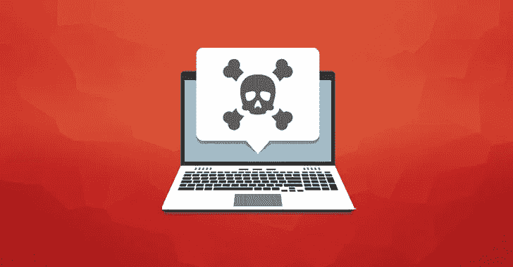
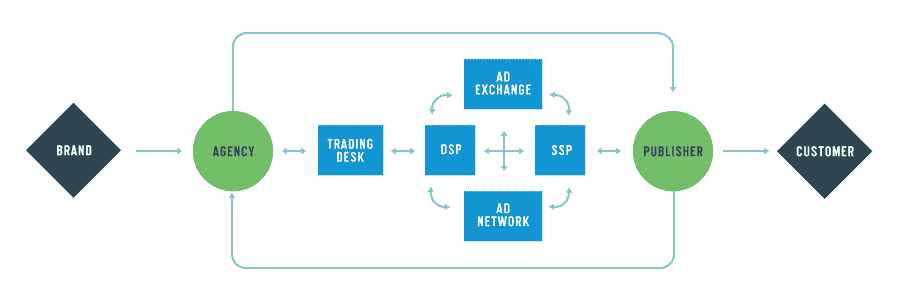
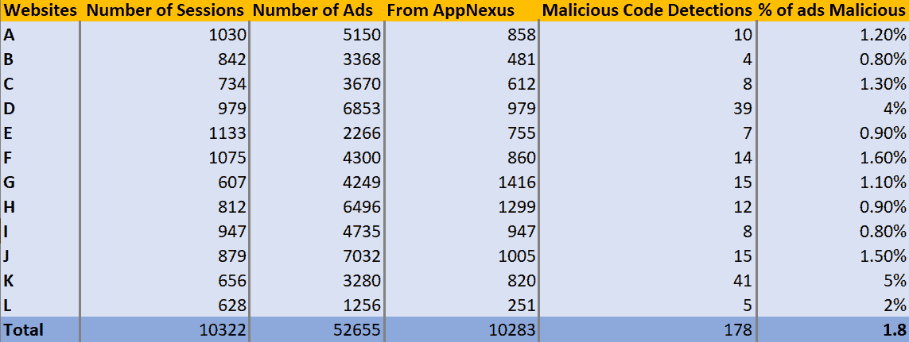

# 美国电话电报公司的广告交易所充斥着窃取数据的恶意软件

> 原文：<https://infosecwriteups.com/at-ts-ad-exchange-is-overrun-with-data-stealing-malware-c9a3f5cbde0a?source=collection_archive---------0----------------------->

## **Xandr/AppNexus 在各大网站上发布受感染的广告**

***Xandr/AppNexus 正在各大网站投放被感染的广告***

ome 预测，AT T 崭露头角的广告平台 Xandr——前身为 AppNexus——将最终超越谷歌和脸书，成为数字广告的下一个巨头。这应该让我们所有人感到恐惧:在 2014 年 65%的需求方库存被曝光为欺诈性库存的两年后，AppNexus 陷入了一场网络攻击，其供应方合作伙伴充斥着带有勒索软件和其他令人讨厌的可交付内容的虚假广告。但是四年后，在被世界上最大的电信公司之一收购后，它肯定吸取了教训——对吗？根据我的研究，不是这样的:AppNexus 仍然是一种数字 Mos Eisley，通过恶意重定向在其合作伙伴网站上提供受感染的广告。

*AppNexus 于 2018 年被 AT & T 以* [*约 16 亿美元*](https://www.adweek.com/digital/what-atts-acquisition-of-appnexus-means/) 收购

作为背景资料，我在一个月前发表了一篇关于“ **IcePick-3PC** 或“ **eGobbler** ”在 Weather.com 重新出现的文章。这种众所周知的间谍软件将移动用户重定向到一个恶意网站，在那里他们的数据被抓取，要么在黑暗的网络上出售，要么为即将到来的网络攻击做准备。这是令人讨厌的东西，虽然天气频道部分负责播放广告，但它的上游合作伙伴——在这种情况下，Xandr/AppNexus——更有责任向下发送广告。所以在继续之前，让我澄清一下 AppNexus 实际上是做什么的。

# 什么是 AppNexus？

程序化或个性化广告是一项复杂的技术。它不仅需要后端基础设施来识别网站的访问者，还需要一个实时市场来为用户匹配目标明确的广告。这就是 AppNexus 的用武之地:虽然该公司提供多种服务，但它主要以其交易所而闻名，广告网络排队购买网站位置，出版商排队填补他们的广告位。

*广告交流如何运作，承蒙* [*积分广告学*](https://integralads.com/)

将如此多的广告合作伙伴聚集在一个地方是一个令人印象深刻的壮举，它有助于降低广告成本，同时增加出版商的收入。但是这种方法也有一个严重的缺点:要一次渗透进数以千计的出版物，黑客或恶意代理所要做的就是找到一个足够大的交易所，它不会费心去检查自己的广告是否有恶意代码。而且——虽然 AppNexus 声称使用了名为“夏洛克”的恶意软件检测系统[——但它在过去四年里并没有做得很好，今天也没有做得很好。](https://www.adperium.com/misc/AppNexus_standards.pdf)

**冰锥-3PC 生活**

IcePick-3PC 广告软件在最初被发现两年后继续在 Alexa 500 网站上传播。它是这样工作的:当一个访问者加载一个网站时，该网站向它的广告合作伙伴发出一个呼叫，这些广告合作伙伴传递一个看似合法的广告，实际上却载有恶意代码，将用户重定向到一个虚假的网站。

在那里，恶意软件对用户进行各种“检查”,以确定他们拥有什么样的设备，他们的操作系统，电池电量和位置。最后，它打开一个远程对等连接来窃取用户的 IP 地址并存储起来以备后用。下面的屏幕截图显示了我在 IcePick-3PC 会话期间收到的数据包，责任止于 AppNexus:

到现在为止，IcePick-3PC 应该是每个人都应该关注的旧闻了。这个星球上每一家像样的广告技术公司都应该立即发现并消灭它。如果从源头上消除它，它很快就会消失——但显然，这不会发生。因此，恶意软件广泛传播，影响出版商、广告代理，最重要的是影响最终用户。

**测试:AppNexus 恶意软件比率**

在我的上一篇文章中，我提到了 IcePick-3PC 在 Weather.com 上每 1000 个会话中加载近 1 个。对于这篇文章，我很想知道有多少恶意广告具体来自 AppNexus，包括 IcePick-3PC 和类似的广告软件(我将在未来的文章中讨论)。我将扫描仪设置在三台不同的机器上运行，从 12 个不同的网站收集数据。

最终，我分析了大约 10000 个 web 会话，发现【AppNexus 每 100 个广告中有近 2 个被恶意代码感染。

这几乎是其他广告网络平均广告率的两倍，其他广告网络的平均广告率从 0.5%到 1%，[取决于来源](https://www.csoonline.com/article/3373647/what-is-malvertising-and-how-you-can-protect-against-it.html)。考虑到普通网络用户每天会看到近 5000 条广告，平均广告率已经高得令人无法接受。除非有所改变，否则互联网用户每周会接触到 175 到 300 个被感染的广告。

如果 AppNexus 可以借鉴的话，事情并没有好转:近年来金融盗窃受害者的数量[攀升](https://www.fool.com/the-ascent/research/identity-theft-credit-card-fraud-statistics/)有什么奇怪的吗？

# AdTech 的失败

要杀死恶意广告的怪物，你必须砍掉它的头。在这种情况下，头是 Xandr 和它在 AT&T 的霸主。一些巨大的事情正在他们的眼皮底下发生，而他们没有做任何事情来阻止它。也许他们只是需要在正确的方向上得到推动——如果是这样，这就是这篇文章旨在为他们提供的，因为这种情况正在发生的事实表明，用户和出版商必须为广告生态系统的系统性失败买单。

据推测，虚假广告霸占了广告位，给出版商带来的收入很少。但这还不是最糟糕的:最糟糕的是它们会危及访问者的财务信息、身份和个人安全，而这些正是 AdTech 的收入来源。几年前，我开始和数百万其他用户一起使用 AdBlock 扩展，这给依靠广告生存的出版商带来了一场危机。如果该行业想要解决用户信任危机，并保持程序化广告的长期可行性，他们必须从对库存质量负责开始，并从源头上消除恶意软件。

*关注* [*Infosec 报道*](https://medium.com/bugbountywriteup) *获取更多此类精彩报道。*

 [## 信息安全报道

### 收集了世界上最好的黑客的文章，主题从 bug 奖金和 CTF 到 vulnhub…

medium.com](https://medium.com/bugbountywriteup)