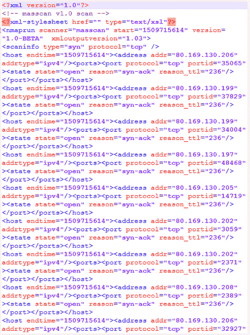
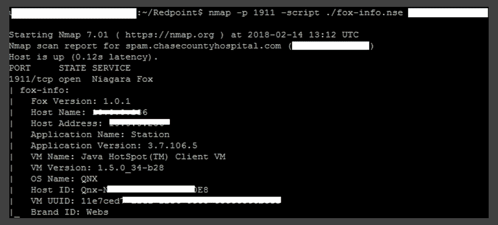
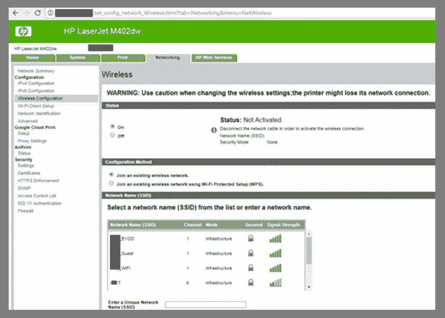
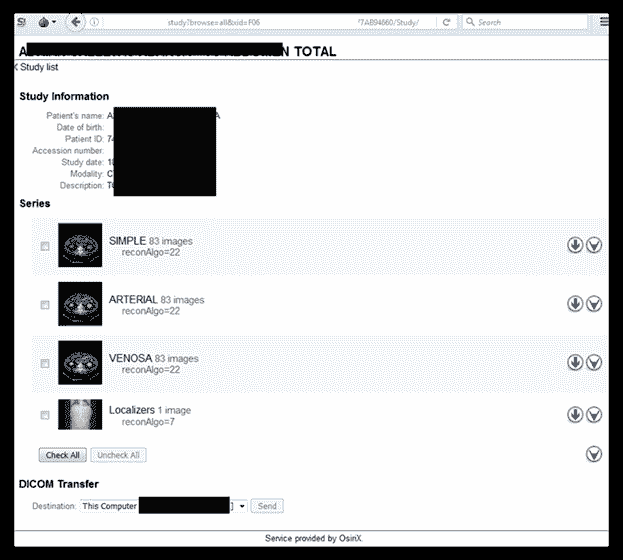
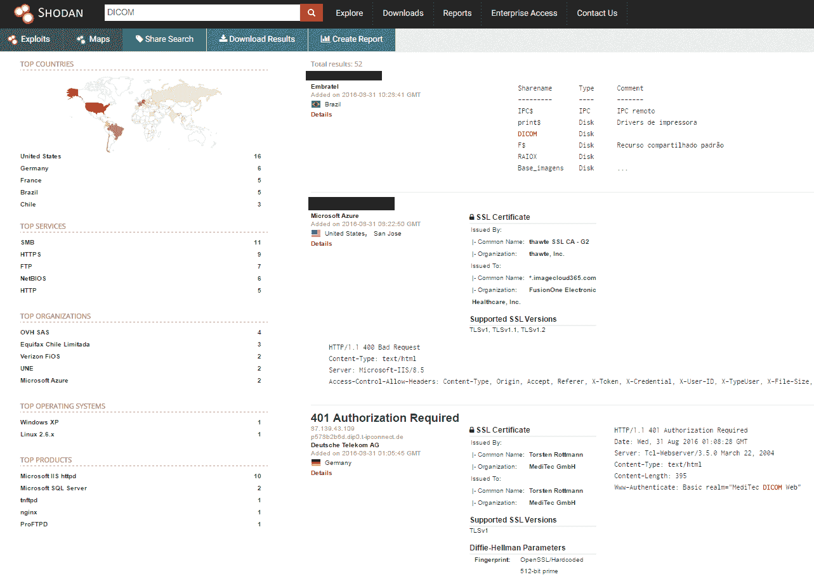
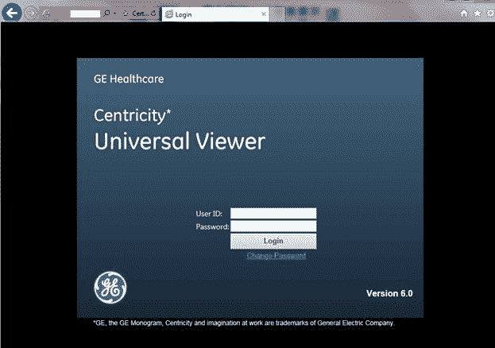
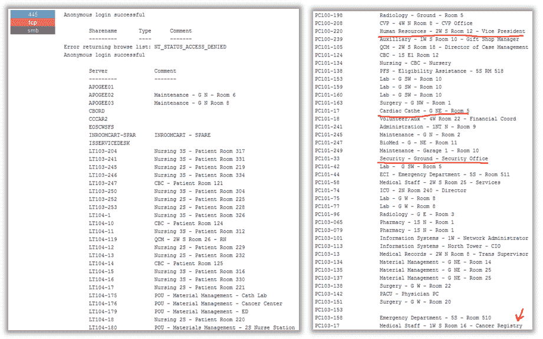

# 使用开源智能监控攻击面

> 原文：<https://infosecwriteups.com/attack-surface-monitoring-using-open-source-intelligence-90415e863e93?source=collection_archive---------2----------------------->

文章介绍了开源情报方法在攻击面分析和监控中的实际应用案例。该案例基于医疗保健组织的边界，旨在介绍医疗保健行业的威胁形势以及收集网络边界上的入口点和资产信息的方法。本文中的技术和工具不受组织类型的限制，可以应用于不同的网络资产，以在渗透测试和红队行动的第一阶段准备初始信息。

# 试图找到所有打开的门

在我以前的出版物(“[未知攻击:检测和评级](https://medium.com/@makrushin/unknown-attacks-detect-and-rate-5ab5dff63dc)”、“[定向攻击的现象](https://medium.com/@makrushin/the-phenomena-of-targeted-attacks-c71807a8b7f6)”)中，我描述了定向攻击的关键阶段(所谓的‘杀伤链’)。第一阶段被称为“侦察”阶段，在攻击者到达受害者的第一台计算机之前，必须提前很长时间进行。在此阶段收集的数据总量和质量决定了成功的程度，也是最重要的攻击的最终成本。

人们可以使用不同的攻击手段来攻击位于网络外围的易受攻击的服务(例如，让受害者在安全系统的日志中找到您和您的攻击)。同时，人们可以依靠鱼叉式网络钓鱼技术来访问公司周边的一个工作站。这两种情况都是为了达到目的。然而，它们实现的总体价格将完全不同。

智能阶段是定义战术、技术和程序(以下简称为 TTP)所需的关键要素，这些将是实现目标所需的主要要素。然而，在目前的大多数情况下，智能阶段的关键任务如下:找到尽可能多的潜在切入点以达到目标，并评估所发现的载体的总体实现成本。为了使攻击者的工作更加困难并降低他们情报工作的质量，需要了解他们在当前阶段将要使用的 TTP 列表。

公司网络的入口点数量决定了恶意分子可利用的攻击媒介的数量。人们可以将入口点正式分为以下几组:

*   位于网络外围并可访问互联网的信息系统(服务器、工作站、特殊设备的管理控制面板等)。
*   员工在边界内外使用的移动设备。
*   员工使用的云平台和服务的账户(包括个人账户)。

最后一项要求攻击者和受害者进行一些直接的交互(例如，通过向受害者发送钓鱼链接)，这大大增加了被识别的机会。因此，在某些情况下，攻击者更喜欢使用可用的入口点，这些入口点位于外围，很容易被利用。

网络边界是一个随着现代技术的快速发展和云服务的广泛实施而逐渐消失的术语。诸如“自带设备”(BYOD)这样的概念允许员工携带自己的设备来访问所有业务流程，以及许多云服务只是消除了外围设备之类的东西。几乎不可能控制在公司网络和外部世界之间发送的数据。同时，这种情况使得攻击者的工作变得更加容易，给了他们更多的方法来访问您的网络。

在大公司的情况下，外围通常充满了被遗忘的(或隐藏的)服务，这些服务没有被使用，而管理员从未为它们应用过补丁。我想让您在贵公司的企业网络中找到这样的服务。我们将用我最喜欢的医疗机构作为最好的例子来展示攻击媒介的多样性。之后，您可以轻松地使用获得的知识来分析和检查您控制下的企业网络的边界。

# 扫描、标记和重复…

显然，要了解位于公司网络边界内的事物列表，需要获得属于所选公司的 IP 地址的详细列表。这种列表可能包括第三方(服务提供商、分包商等)的 IP 地址。攻击者可以很容易地将它们添加到他们的列表中，而您必须不惜任何代价避免这样做。IP 地址列表可以添加到端口扫描工具中。不使用 nmap，我推荐 mass can[【1】](https://makrushin.com/attack-surface-osint/#_ftn1)或者 ZMap，这样会显著减少整体扫描时间。

例如，要评估医疗企业网络中可用的入口点列表，可以从 RIPE 获取包含所需名称和关键字的 IP 范围:

之后，可以启动端口扫描器，并在接下来的几天内获得结果(图 1)。

*图 1 一份质量扫描报告的片段*

当使用 ZMap 进行端口扫描时，可以稍后使用 ZTag 为每个发现的服务添加所需的标记。标签将根据收集的横幅基础分配。

就医疗机构而言，所有服务将分为以下几组(图 2)。

*图 2 医疗基础设施周边的顶级服务*

人们可以很容易地在无数的网络应用和邮件服务中找到许多有趣的应用:建筑管理系统[3]；打印机(没有任何密码的管理面板)；NAS 存储(甚至特殊的 PACS 服务器)；智能水壶等设备。通过使用每个发现的服务，攻击者可以为他们的活动创建新的向量，以评估其实现的复杂性(即价格)(图 3、4、5)。

*图 3 这是一个从使用 Niagara Fox 协议的设备获取信息的示例*

*图 4 这是一个打印机控制面板，显示了可用无线网络的列表*

*图 5 这是一个有漏洞的医疗门户的例子，向我们展示了医疗信息*

# 没有交互的 OSINT

另一种非常流行的无需与周边环境进行任何直接交互就能获取周边信息的方法是使用 Shodan 和其他类似系统的日志，这些机器人能够代表攻击者完成所有工作。

从上面的日志中可以看出，所有可用的服务器都是公共的，尽管它们可能包含有关目标公司活动的特定信息，以及其他重要和敏感的数据。比如我们拿医疗公司来说，他们的网络周边通常由 DICOM 设备和 PASC 服务器(图片存档和通信系统)组成。所有这些设备都是基于 DICOM(医学数字成像和通信)的医疗系统。DICOM 是一种众所周知的医学标准，用于创建、存储、传输和可视化患者的医学图像和文档(根据维基百科)。DICOM 由以下组件组成:

*   DICOM 客户端:能够连接到 DICOM 发送信息的医疗设备
*   DICOM 服务器:一套硬件和软件解决方案，用于接收和存储来自客户端的信息(包括 PACS 服务器，作为其一种)
*   DICOM 工作站和 DICOM 打印机:一套用于处理、可视化和打印医学图像的软件和硬件工具

大多数这种系统的主要区别特征之一是存在用于通过网络控制设备的网络接口。这种接口可能包含漏洞，攻击者很容易利用这些漏洞来访问重要的进程和敏感信息。人们需要非常关注这类系统，以了解它们是否会被攻击者用作入口。

用户可以向 Shodan 引擎发送一个非常简单的查询来查找 DICOM 设备:DICOM 端口:104(图 6)。

*图 6 DICOM 服务器列表*

还可以搜索特殊的诊断 DICOM 工作站，即 PACS 系统，用于处理、诊断和创建数据的可视化表示。举个例子，可以对 Censys 搜索引擎使用以下查询:pacs 和 autonomous_system.organization:(医院或诊所或医疗或保健)(图 7)。

*图 7 诊断站登录面板*

通过对 Shodan 使用一组标准查询来获得端口 445 (SMB)上可用资源的列表，攻击者有时可以获得内部资源(服务器和工作站)的名称。这样的名称可以用来识别感兴趣的目标列表，并避免使用无用的资源(图 8)。

*图 8 公司局域网资源名称信息*

# 为社会工程收集信息

正如我上面提到的，进入公司网络边界的最有效的方法之一是使用各种各样的社会工程工具。例如，可以发送网络钓鱼链接和附件，引导员工找到特殊的网络钓鱼资源。

要实现这样的场景，攻击者需要收集一些关于受害者的信息，以增加其中一个工作人员跟踪链接或下载附件的机会。目前，世界各地最大的公司的安全服务正试图与他们的员工合作，通知他们关于网络钓鱼，这对攻击者来说不是最好的事情。如今，攻击者不仅需要仔细检查受害者的过滤器，在他们的信中添加一些有用的信息，还需要激发受害者执行所需操作的动机，而不会引起哪怕是轻微的怀疑。

广泛的社交网络以及大多数用户的开放方式，使得攻击者能够通过在原始消息中添加一些“有用的负载”来获取所需的信息:可以是一封信或一种通信方式等等。

这个任务确实很有创造性，取决于具体的情况。最好的例子是基于最流行的社交网络的 API 的资源，以获得关于帐户的最重要的信息(图 9)。

*图 9 这是一个基于社交网络 API 的 OSINT 网络服务的例子*

例如，使用从 LinkedIn 提取的数据，攻击者可以识别公司的关键员工列表，使用他们的姓名和联系人(地址)实施鱼叉式网络钓鱼攻击。通过使用这些信息，人们可以很容易地在脸书和其他网络上找到这些员工的个人资料。提到的服务还可以收集一些统计数据，例如关于他们曾经住过的酒店的信息(通过使用他们的位置和登记)。之后，攻击者可以很容易地发送一封关于度假村费用的信，这些费用必须支付，并添加一张 PDF 格式的发票。利润！

# 侦察作为一种艺术形式

关于提取受害者信息的话题层出不穷，有资料[4]只告诉我们基于公开信息来源的情报。这就是为什么我决定用这篇文章来告诉你关于公司网络周边的技术信息的收集，这些信息包含(在许多情况下)所谓的开放的门，这些门可以连续打开许多年，而网络的所有者根本不知道它们。

此外，试图通过外部资源进入公司网络的攻击者不需要与真实的人进行交互(正如在社交工程的情况下发生的那样)，因此他们需要克服一个障碍:各种 IDS/IPS、WAF 和其他旨在检测边界上各种活动的系统。以防安装了它们。

# 结论

介绍了开源情报方法在攻击面分析和监控中的实际应用案例。该案例基于医疗保健组织的边界，旨在介绍医疗保健行业的威胁形势以及收集网络边界上的入口点和资产信息的方法。本文中的技术和工具不受组织类型的限制，可以应用于不同的网络资产，以便在渗透测试和红队行动的第一阶段准备初始信息。

## 感谢

感谢 Alexander Barabanov、Dmitry Zheregelya 和 Igor Korkin 的校对、编辑和建设性反馈。

# 🔈 🔈Infosec Writeups 正在组织其首次虚拟会议和网络活动。如果你对信息安全感兴趣，这是最酷的地方，有 16 个令人难以置信的演讲者和 10 多个小时充满力量的讨论会议。[查看更多详情并在此注册。](https://iwcon.live/)

[T3【https://iwcon.live/】T5](https://iwcon.live/)