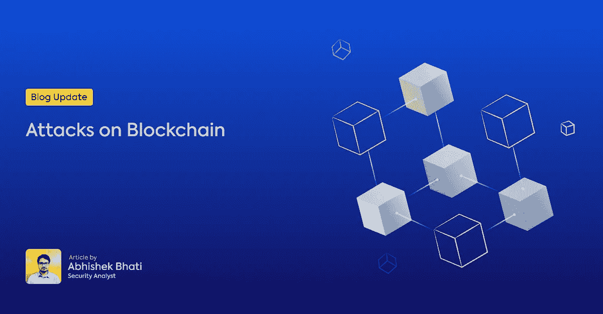

# 对区块链的攻击

> 原文：<https://infosecwriteups.com/attacks-on-blockchain-84fac903b20a?source=collection_archive---------2----------------------->

WEB3 是科技城的新流行语，而区块链是推动互联网海洋中这一巨大转变的核心技术。网络安全和区块链通常以互补的方式工作，两者相互依赖。基于区块链的系统本质上比传统系统更安全，因为与传统的客户端-服务器架构相比，它们在分布式架构上工作。然而，区块链在网络安全方面也有自己的问题，他们有一些独特的攻击媒介。这些攻击媒介可能来自应用层，也可能来自核心区块链层。在这篇博客中，我们将尝试探索一些可能对核心区块链设计的关键攻击。这可能是由于设计缺陷甚至一些不可预见的情况造成的，因此修复的相关性和级别也取决于漏洞的类型。

虽然这些攻击中的大多数可能看起来是理论上的或难以利用，但它们中的许多在过去已经被成功利用，并造成了大量的物理损害。事不宜迟，让我们来看看一些主要的攻击。

# 对区块链的攻击:

## 51%的攻击:

当特定的挖掘者或一组挖掘者获得整个区块链网络的超过 50%的处理能力时，51%的攻击发生，这有助于他们在共识算法方面获得多数。这种攻击媒介主要与工作证明算法相关，但它也可以作为测试案例扩展到其他共识算法，其中存在单个参与方在网络中获得足够影响力以不适当地修改链状态的风险。这可能会导致多种损害，包括重写链数据、添加新块和双重开销。下图显示了这种攻击是如何发生的。

在上面的可视化表示中，红色节点由攻击者控制，他们可以通过在获得多数共识后添加新块来更改链的副本。

遭受了 51%攻击的一些主要链是比特币黄金区块链(2018 年 5 月，价值约 1800 万美元的 388，000 BTG 在多个交易所被盗)、比特币 Satoshi 的愿景(2021 年 8 月，他们遭受了 51%的攻击，此后硬币价值损失了 5%)和以太坊经典区块链。[租用哈希功率](https://forkast.news/hash-power-51-attack-rent-huge-vulnerability-proof-of-work-blockchain/)也能导致 51%的攻击。在这种方法中，攻击者可以租用服务器上的计算能力，以比其他参与者更快的速度计算哈希，并获得共识。在这方面，矿池也是一个有趣的方面，因为它们有时也会超出共识要求。2014 年 7 月，采矿池 ghash.io 在短时间内获得了超过 50%的处理能力，之后它承诺自愿降低其电力。

## Eclipse 攻击:

[Eclipse attack](https://cointelegraph.com/explained/what-is-an-eclipse-attack) 出现在区块链，这里的架构在对等体之间划分工作负载和分配任务。例如，如果一个链中有一个节点只有八个传出连接，并且在任何给定时刻最多可以支持 128 个线程，则每个节点只能查看与其连接的节点。如果攻击者攻击一个特定的节点，并且[获得了与之相连的八个节点](https://www.gemini.com/cryptopedia/eclipse-attacks-defense-bitcoin#section-how-are-cryptocurrency-eclipse-attacks-executed)的控制权，那么受害者节点的链的视图可以被改变。这可能导致各种各样的损害，包括通过欺骗受害者没有发生特定的交易而双重花费硬币，以及对第二层协议的攻击。攻击者可以让受害者相信某个支付通道在关闭时是打开的，诱骗受害者发起交易。下图演示了遭受 Eclipse 攻击的节点。

在上面的可视化表示中，红色节点由攻击者控制，他们可以通过将受害者节点连接到攻击者控制的节点来更改受害者节点链的副本。

## 西比尔攻击:

维基百科将 sybil 攻击定义为"*对计算机网络服务的一种攻击，其中攻击者通过创建大量假名身份来破坏服务的声誉系统，并使用它们来获得不成比例的巨大影响力。*“如果网络不保存节点的计数，那么攻击者就可以将受害节点完全隔离于网络之外。对区块链的 sybil 攻击也类似，攻击者试图用他们控制的节点淹没网络，这样受害者只连接到攻击者控制的节点。这可能导致各种各样的损害，其中攻击者可以阻止真正的块被添加到链中，攻击者可以将他们自己的块添加到链中，或者他们可以在节点之间引起混乱，阻碍区块链网络的一般功能。

在上面的视觉表示中，红色节点由攻击者控制，它们淹没网络，使受害者只连接到一个恶意节点。

## 时间劫持攻击:

时间劫持攻击也是 Sybil 攻击的延伸。每个节点维护一个基于其对等节点的中间时间的时间计数器，如果中间时间与系统时间相差某个值，则该节点恢复到系统时间。攻击者可以用报告不准确时间戳的节点淹没网络，这可能导致网络变慢或变快，从而导致不同步。

## 自私的采矿攻击:

当攻击者能够秘密地挖掘块并创建比其他节点处理的公共链更长的链的副本时，就会发生这种攻击。攻击者挖掘一些块，并不将它们广播到整个网络。他们继续挖掘，然后一旦在链的长度方面充分领先于网络，就发布一个私有分叉。由于网络将转移到最常用的链(也称为最长链规则)，攻击者的链将成为公认的链。在自私挖掘攻击的帮助下，攻击者可以在公共网络上发布一些事务，然后在秘密挖掘的块的帮助下反转它们。

## 芬尼攻击:

芬尼攻击可以被定义为自私挖掘攻击的延伸。攻击者秘密地挖掘一个块，并将未确认的交易发送到另一个节点，可能发送到一个商家节点。如果商家节点接受交易，那么攻击者可以在短时间内进一步向链中添加新的块，逆转该交易并引发双重消费攻击。芬尼攻击的攻击窗口相当小，但如果交易的价值足够大，这可能会造成很大的损失。

## 种族攻击:

在竞争攻击中，攻击者不预先挖掘交易，而是简单地广播两个不同的交易，其中一个发送给商家，另一个发送给网络。如果攻击者成功地给商家节点造成了他们收到的交易是第一笔的假象，那么他们就接受了，攻击者就可以向整个网络广播一个完全不同的交易。

除了这些核心的区块链级攻击之外，还有许多其他攻击也可能发生在应用程序实现级别。其中最臭名昭著的一次是 2016 年 6 月发生的 DAO 攻击，导致约 7000 万美元的盗窃。攻击者向一家公司的众筹活动捐款，并要求退出。但是，为取款实现了一个递归函数，该函数不检查当前交易的结算状态。对于金钱，以太坊链进入了一个硬分叉，旧链继续作为以太坊经典。这严重损害了连锁店的声誉，连锁店的自主权也受到质疑。

**防止这些攻击发生的一些一般措施:**

*   应该确保链代码和一致性算法中没有逻辑不一致。
*   应该以足够的复杂性和谨慎性选择交易对手，并且应该定期审查交易。
*   如果检测到任何可疑活动，网络应该保持足够的警惕，以立即隔离不良行为者节点。
*   当每个新节点加入网络时，应该为网络部署适当的审查过程。
*   速率限制算法应该出现在所有相关的过程中，以便在攻击发生时限制损害和防止攻击。
*   2FA 应该出现在所有相关的认证点，并且应该确保所有的认证级错误应该尽可能地在应用程序级被修复
*   大多数时候，由于可伸缩性问题，黑名单和白名单的方法不起作用。因此，更好的方法应该是使攻击的执行成本足够高，并增加系统的复杂性以具有足够的弹性，并使成功利用变得极其困难。

多种其他错误和[漏洞](https://wesecureapp.com/blog/how-do-cryptocurrencies-affect-cybersecurity/)存在于不同种类的区块链网络中，其中最常见和最令人担忧的是智能合约级别，但它们是另一个话题。

# 关于作者

阿布舍克·巴蒂

小安全分析师