# 寻找 WEB 应用程序中访问控制漏洞的速成班:第 1 部分

> 原文：<https://infosecwriteups.com/begineers-crash-course-for-finding-access-control-vulnerabilities-in-the-web-apps-part-1-5b61cf4396c4?source=collection_archive---------0----------------------->

这篇博文将帮助 PENTESTERS 和 BUG 赏金猎人完全熟悉这些漏洞，并在 WEB 应用中找到它们。

web 应用程序中的访问控制漏洞应该在 web 应用程序测试或漏洞悬赏中得到重视，因为它们非常普遍。从 bug bounty 的角度来看，这些很容易找到，不需要很强的技术知识，也很有回报。

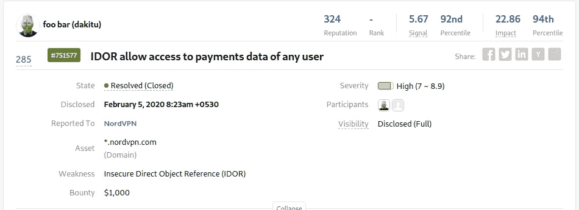

> **什么是门禁**

访问控制实施策略，使用户不能超出其预期权限。

访问控制指的是控制对 web 资源的访问的更一般的方式，包括基于诸如一天中的时间、HTTP 客户端浏览器的 IP 地址、HTTP 客户端浏览器的域、HTTP 客户端可以支持的加密类型、当天用户已经认证的次数、拥有任何数量类型的硬件/软件令牌或者可以容易提取或计算的任何其他派生变量的限制。

访问控制是对谁(或什么)可以执行尝试的操作或访问他们请求的资源的约束的应用。在 web 应用程序的上下文中，访问控制依赖于身份验证和会话管理。

**有三种类型的访问控制**

**自主访问控制**

**强制访问控制**

**基于角色的访问控制**

> **自主访问控制**

自主访问控制(DAC)是一种基于用户身份和/或特定组成员身份来限制信息访问的方法。访问决策通常基于根据用户在认证时出示的凭证(用户名、密码、硬件/软件令牌等)授予用户的授权。).在大多数典型的 DAC 模型中，信息或任何资源的所有者都可以随意更改其权限(即名称)。DAC 的缺点是管理员不能集中管理存储在 web 服务器上的文件/信息的权限。DAC 访问控制模型通常表现出以下一个或多个属性。

*   数据所有者可以将信息的所有权转让给其他用户
*   数据所有者可以决定授予其他用户的访问类型(读、写、复制等。)
*   访问同一资源或对象的重复授权失败会生成警报和/或限制用户的访问
*   需要应用于 HTTP 客户端的特殊附加软件或插件软件，以防止用户不加区分地复制(“剪切和粘贴”信息)
*   无权访问信息的用户应该无法确定信息的特征(文件大小、文件名、目录路径等)。)
*   对信息的访问是基于对基于用户标识符和组成员资格的访问控制列表的授权来确定的。

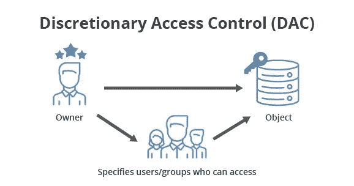

> **强制访问控制**

强制访问控制(MAC)确保组织安全策略的实施不依赖于 web 应用程序用户的自愿遵从。MAC 通过在信息上分配敏感标签并将其与用户操作的敏感级别进行比较来保护信息。一般来说，MAC 访问控制机制比 DAC 更安全，但在性能和用户便利性方面有所折衷。MAC 机制为所有信息分配一个安全级别，为每个用户分配一个安全许可，并确保所有用户只能访问他们有许可的数据。MAC 通常适用于极其安全的系统，包括多级安全军事应用或关键任务数据应用。MAC 访问控制模型通常表现出以下一个或多个属性。

*   只有管理员，而不是数据所有者，才能更改资源的安全标签。
*   所有数据都被分配了反映其相对敏感性、机密性和保护价值的安全级别。
*   所有用户都可以阅读比他们被授予的级别低的级别(“秘密”用户可以阅读非机密文档)。
*   所有用户都可以写入更高的分类(“秘密”用户可以将信息发布到绝密资源)。
*   所有用户只能对相同分类的对象进行读/写访问(“秘密”用户只能对秘密文档进行读/写)。
*   根据资源上的标签和用户凭据(由策略驱动)，基于一天中的时间授权或限制对对象的访问。
*   基于 HTTP 客户端的安全特征(例如，SSL 位长度、版本信息、始发 IP 地址或域等)来授权或限制对对象的访问。)

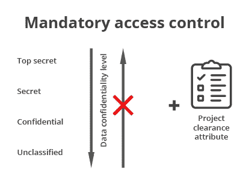

强制访问控制

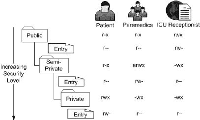

> **基于角色的访问控制**

在基于角色的访问控制(RBAC)中，访问决策基于个人在组织或用户群中的角色和职责。定义角色的过程通常基于对组织的基本目标和结构的分析，并且通常与安全策略相关联。例如，在医疗机构中，用户的不同角色可以包括诸如医生、护士、服务员、护士、病人等。显然，这些成员需要不同的访问级别来执行他们的功能，而且 web 事务的类型及其允许的上下文也有很大的不同，这取决于安全策略和任何相关的法规(HIPAA、Gramm-Leach-Bliley 等)。).

RBAC 访问控制框架应该为 web 应用程序安全管理员提供确定谁可以在什么时候、从哪里、以什么顺序以及在某些情况下在什么关系环境下执行什么操作的能力。[http://csrc.nist.gov/rbac/](http://csrc.nist.gov/rbac/)为 RBAC 的实施提供了大量资源。以下方面展示了访问控制模型的 RBAC 属性。

*   角色是根据组织结构分配的，重点是组织安全策略
*   角色由管理员根据组织或用户群中的相对关系来分配。例如，一个经理可以对他的员工进行某些授权交易。管理员在其特定职责领域(备份、帐户创建等)内拥有某些授权事务。)
*   每个角色都被指定了一个配置文件，其中包括所有授权的命令、事务和允许的信息访问。
*   根据最小特权原则授予角色权限。
*   角色的确定要考虑到职责的分离，这样开发人员的角色就不会与 QA 测试人员的角色重叠。
*   根据特定的关系触发器(帮助台队列、安全警报、新项目启动等)静态和动态地激活角色。)
*   只能使用严格的签准和程序来转移或委派角色。
*   角色由安全管理员或项目负责人集中管理。

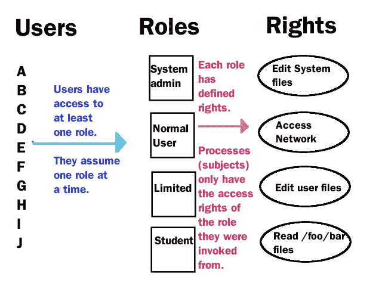

基于角色的访问控制

以上 web 应用中的这三种访问控制类型构成了访问控制安全模型。

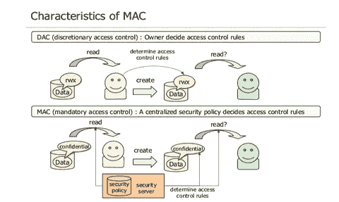

B罗肯门禁

每当访问控制安全模型被违反时，我们就有访问控制漏洞。

在规模逐渐扩大的应用程序中，破坏访问控制通常是一个问题。开发人员不是从一开始就刻意设计控制访问的方案，而是随着时间的推移添加这些方案。

在访问控制不集中的情况下，这通常会导致难以完全理解的非常复杂的方案。反过来，一个复杂的方案会导致错误和漏洞。

破坏访问控制的潜在影响在很大程度上取决于攻击者可以获得什么样的信息或功能。这可以是任何看似无用的信息，也可以是整个系统被接管。

访问控制漏洞位于 [**OWASP TOP 10**](https://owasp.org/www-project-top-ten/) 的第五位

# 垂直权限提升

如果用户可以访问他们无权访问的功能，那么这就是垂直权限提升。例如，如果一个非管理用户实际上可以访问管理页面，在那里他们可以删除用户帐户，那么这就是垂直权限提升。

这里，不同用户组具有不同类型的权限。例如，应用程序的管理员组成员(也称为管理员)比应用程序的普通用户拥有更多的功能。

绕过这一点将导致权限提升，这意味着对 web 应用程序的更多控制。

这是一个非常严重的访问控制错误，因为这不仅危及管理员用户帐户，而且还会完全控制 web 应用程序。

# 水平访问控制

水平访问控制是一种机制，它将对资源的访问权限限制在那些被明确允许访问这些资源的用户。

通过水平访问控制，不同的用户可以访问同一类型资源的子集。例如，一个银行应用程序将允许用户从他们自己的帐户查看交易和付款，但不允许任何其他用户的帐户。

绕过这意味着获得访问另一个帐户，但该帐户也有同样的权限作为您的帐户。这给 web 应用用户带来的威胁比 web 应用本身更大。

# 上下文相关的访问控制

依赖于上下文的访问控制根据应用程序的状态或用户与应用程序的交互来限制对功能和资源的访问。

上下文相关的访问控制防止用户以错误的顺序执行操作。例如，一个零售网站可能会阻止用户在付款后修改购物车的内容。

# 强制浏览

攻击者可以使用[强力](https://owasp.org/www-community/attacks/Brute_force_attack)技术在域目录中搜索未链接的内容，例如临时目录和文件，以及旧的备份和配置文件。这些资源可能存储有关 web 应用程序和操作系统的敏感信息，如源代码、凭证、内部网络寻址等，因此被视为入侵者的宝贵资源。

当应用程序索引目录和页面基于数字生成或可预测值时，或者使用通用文件和目录名称的自动化工具时，这种攻击是手动执行的。

这种攻击也称为可预测资源位置、文件枚举、目录枚举和资源枚举。

您可以使用以下工具

*   目录搜索

 [## maurosoria/dirsearch

### 当前版本:v0.3.9 (2019.11.26) dirsearch 是一个简单的命令行工具，旨在暴力破解目录和…

github.com](https://github.com/maurosoria/dirsearch) 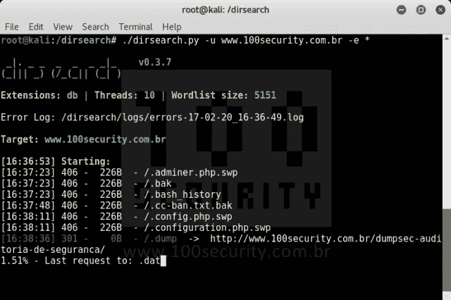

目录模糊使用目录搜索

*   恐怖分子

 [## KajanM/DirBuster

### 这个项目是原始 DirBuster 项目的一个分支。原来的 DirBuster 项目是不活跃的。然而，OWASP…

github.com](https://github.com/KajanM/DirBuster) 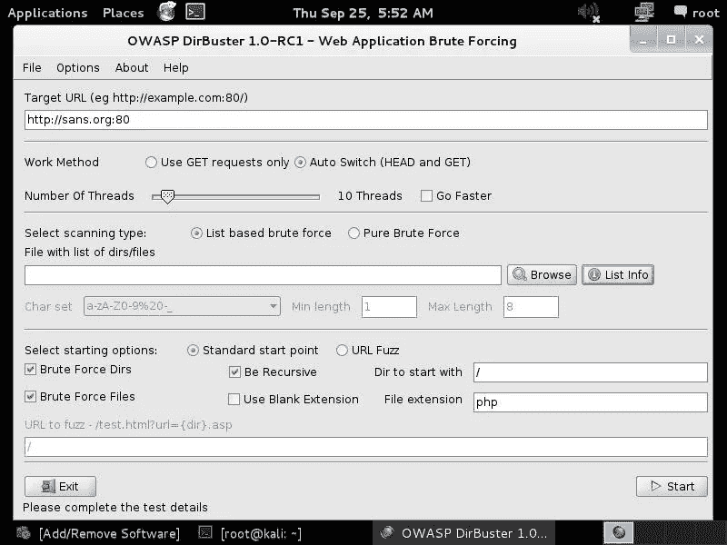

目录模糊使用 dirbuster

*   dirb

 [## DIRB

### DIRB 是一个网页内容扫描器。它查找现有的(和/或隐藏的)Web 对象。它的基本工作原理是启动一个…

tools.kali.org](https://tools.kali.org/web-applications/dirb) 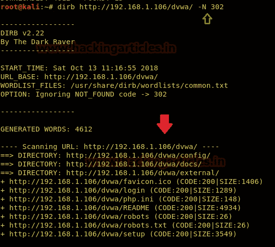

目录模糊使用 dirb

*   gobuster

 [## OJ/gobuster

### 用 Go - OJ/gobuster 编写的目录/文件、DNS 和 VHost 破坏工具

github.com](https://github.com/OJ/gobuster) 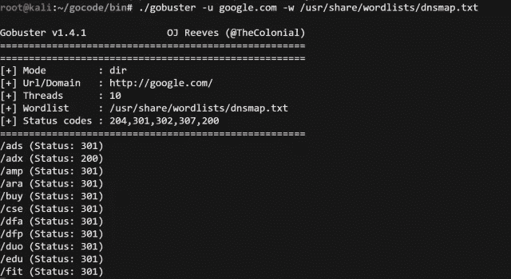

使用 gobuster 的目录模糊

> **伊多尔**

IDOR 代表不安全的直接对象引用，是一种普遍的访问控制漏洞。当用户提供的输入未经验证并且提供了对所请求对象的直接访问时，就会发生这种情况。

在 web 应用程序中，每当用户生成、发送或接收来自服务器的请求时，都会有一些 HTTP 参数，如“id”、“uid”、“pid”等，这些参数具有一些唯一的值，这些值是用户已经分配的。攻击者可以在 cookies、标头或 wifi 数据包捕获中看到此类参数值。通过这种方式，攻击者可能能够篡改这些值，这种篡改可能会导致 IDOR。

展示可以使用 IDOR 操作的不可信数据的一些示例:

*   www.xyz.com/myaccount/uid=12
*   【www.xyz.com/myaccount/uid=14 
*   [www.xyz.com/myaccount/uid=15](http://www.xyz.com/myaccount/uid=15)
*   [www.xyz.com/myaccount/uid=19](http://www.xyz.com/myaccount/uid=19)

这里我们可以看到 URL 中的 uid(参见

现在，假设我们的帐户是一个 uid = 12 的帐户，如果我们将 uid 更改为 14，那么 web app 将访问 uid 为 14 的帐户(其他人的帐户)。

**方法论**

**攻击者广泛使用 Burp Suite 工具**来执行此类攻击。以下是正在遵循的步骤:

*   **捕获请求:**首先，攻击者会决定一个他想要对其执行 IDOR 攻击的目标网站。然后将该网站添加到范围中，并抓取该网站以获取其中包含特定参数的所有 URL。
*   **过滤参数请求:**在第一步之后，我们将使用参数过滤器过滤我们捕获的请求。攻击者将只选择他们可以执行攻击的参数或注入点。
*   **将请求转发给中继器:**现在，如果攻击者找到一些可以执行 IDOR 的注入点，他们会将请求转发给中继器。易受攻击的 URL 可能是这样的:[【www.xyz.com/myaccount/uid=19】*。这里的“UID”似乎很脆弱。*](http://www.xyz.com/myaccount/uid=19.)
*   ***篡改参数:**现在由于攻击者有了易受攻击的注入点，他们现在将尝试借助社会工程或注入点中编写的模式来执行 IDOR 攻击。示例:攻击者可能将 uid 从 19 更改为 20，这将打开另一个被分配了 id 号 20 的用户的帐户。*

**

*【https://youtu.be/3K1-a7dnA60 *

*您也可以使用像 autorize 这样的 burp 扩展来查找 IDOR，这是一种自动化的方法。*

* [## 自动调整

### Autorize 是一个扩展，旨在帮助渗透测试人员检测授权漏洞，这是…

portswigger.net](https://portswigger.net/bappstore/f9bbac8c4acf4aefa4d7dc92a991af2f) 

> **测试被破坏的访问控制**

几乎所有站点都有一些访问控制要求。因此，应该清楚地记录访问控制策略。此外，设计文档应该记录实施该策略的方法。如果这个文档不存在，那么站点很可能是易受攻击的。

应该检查实现访问控制策略的代码。这样的代码应该是结构良好的、模块化的，并且很可能是集中的。应执行详细的代码审查，以验证访问控制实施的正确性。此外，渗透测试对于确定访问控制方案中是否存在问题非常有用。

了解你的网站是如何管理的。您想要了解如何对网页进行更改，在哪里进行测试，以及如何将更改传输到生产服务器。如果管理员可以远程进行更改，您会想知道这些通信通道是如何受到保护的。仔细检查每个界面，确保只有经过授权的管理员才可以访问。此外，如果可以通过界面访问不同类型或分组的数据，也要确保只有经过授权的数据才能被访问。如果此类接口使用外部命令，请检查此类命令的使用，以确保它们不会受到任何命令注入缺陷的影响。

现在，我们将在 web 应用程序安全学院挑战赛中找到被破坏的访问控制。

 [## 网络安全学院:PortSwigger 提供的免费在线培训

### 推动您的职业生涯灵活学习向专家学习网络安全学院是一个免费的在线培训中心，面向…

portswigger.net](https://portswigger.net/web-security) 

我们有许多 web 应用程序来测试访问控制漏洞不同方面

测试凭证包括

`username:wiener`

`password:peter`

有时，我们还会获得管理员凭据。

在最基本的情况下，当应用程序没有对敏感功能实施任何保护时，就会出现强制浏览。例如，管理功能可以从管理员的欢迎页面链接，但不能从用户的欢迎页面链接。但是，用户可以通过直接浏览相关的管理 URL 来访问管理功能。

例如，网站可能在以下 URL 托管敏感功能:

`[https://insecure-website.com/admin](https://insecure-website.com/admin)`

事实上，任何用户都可以访问该功能，而不仅仅是那些在其用户界面中拥有该功能链接的管理用户。在某些情况下，管理 URL 可能会在其他位置公开，例如`robots.txt`文件:

`[https://insecure-website.com/robots.txt](https://insecure-website.com/robots.txt)`

即使 URL 没有在任何地方公开，攻击者也可以使用词汇表[暴力破解](https://portswigger.net/web-security/authentication/password-based)敏感功能的位置。

现在，当我们遇到 web 应用程序 pentest 时，第一件事就是通过模糊化目录来获取所有端点。

总是在网站上寻找 robots.txt 文件，如果它存在，它包含那些网站不希望搜索引擎抓取的端点，因此它可能包含一些敏感和未受保护的端点。

在这里，如果我们检查我们网站的 robots.txt 文件，我们会看到

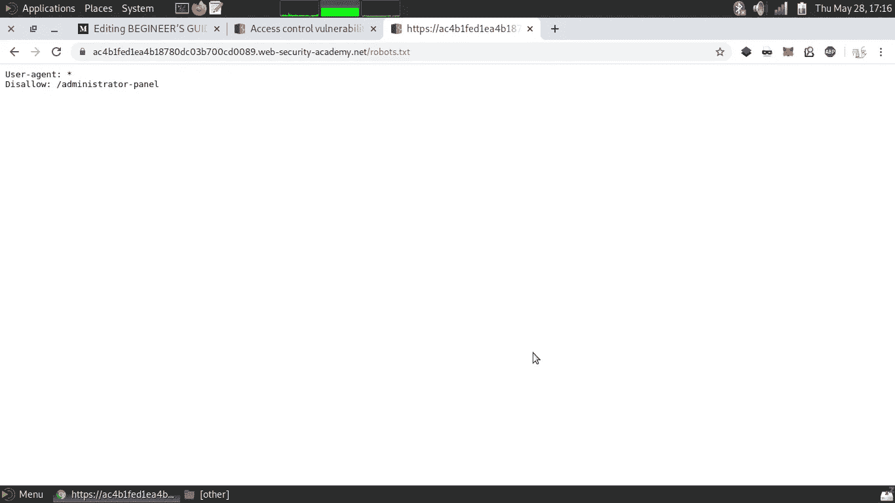

所以我们得到了/administrator-panel 端点让我们检查这个端点

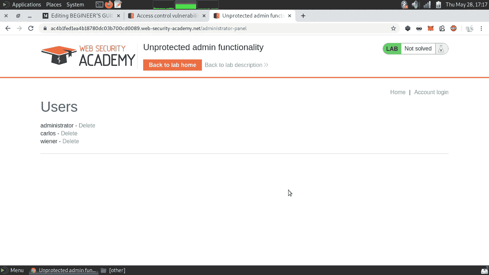

OMG！！我们可以使用管理员功能。

发生这种情况是因为端点上没有身份验证。网站假定访问此端点的人必须是管理员。

现在，我们甚至无需以普通用户身份登录就获得了管理权限，这意味着任何人都可以访问该端点并获得管理功能。

开发人员的这种错误非常普遍，敏感信息经常通过普通用户不应访问的端点泄漏。

如果我们谈论这种 bug 的 bug bounty 观点，那么很容易发现我们需要做的就是使用博客中已经提到的工具来模糊网络目录。

这里有一些关于这个问题的错误报告

 [## Twitter 在 HackerOne 上披露:信息暴露通过...

### 摘要:**研究人员发现了几个 vcache * * us w2 . snappy TV . com 网站的目录列表。一个目录…

hackerone.com](https://hackerone.com/reports/438299)  [## 在 HackerOne 上披露的 ownCloud:信息暴露通过...

### BEGIN PGP 签名消息-哈希:SHA512 咨询 ID: SYSS-2015-062 产品:ownCloud 制造商:ownCloud Inc…

hackerone.com](https://hackerone.com/reports/110655)  [## 在 HackerOne 上披露的最大数量:通过以下方式披露信息...

### 你好！描述:通过启用目录列表进行信息披露。作为概念证明的链接…

hackerone.com](https://hackerone.com/reports/150905)  [## 在 HackerOne 上披露的 Nextcloud:通过...

### 嗨，安全团队，Url:https://apps.nextcloud.com/static/assets/·多克:site:next cloud . com inttitle:index . of Hello，我是…

hackerone.com](https://hackerone.com/reports/403909)  [## OLX 在 HackerOne 上披露了:所有资源的目录列表...

### 通过查看“olx.com.eg”的 css，我发现 src 这个标志链接到了一个外部网站…

hackerone.com](https://hackerone.com/reports/175760) 

有时敏感端点会在网站的源代码或 js 文件中泄漏。

在网络目录模糊后或在 robots.txt 中，我们可能没有得到这些端点

因此，我们总是建议检查 web 应用程序中页面的源代码，因为有时检查源代码也能提供非常有趣的信息。

这是另一个网络应用

现在让我们检查应用程序的源代码

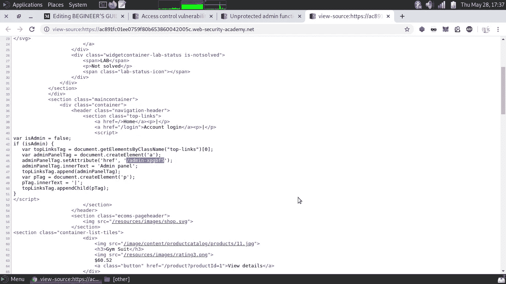

这里我们可以看到 javascript 中使用了一个端点'/admin-xpgbf5 '。

让我们访问这个端点

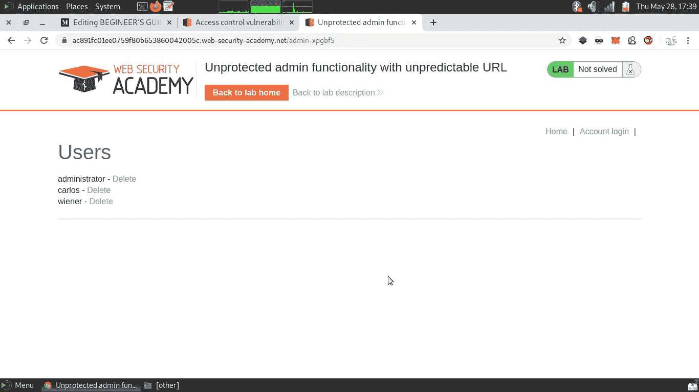

我们可以访问管理功能了太好了！！

这里不仅是敏感的管理功能的信息被泄露，而且它是不受保护的，所以任何人都可以访问它。

javascript 始终是敏感信息的宝库，因此建议您经常查看 web 应用程序的 JavaScript 代码

现在，我们可以获得任何 javascript 文件中使用的 url 或路径，例如

 [## nahamsec/JSParser

### 使用 Tornado 和 JSBeautifier 从 JavaScript 文件解析相对 URL 的 python 2.7 脚本。对轻松有用…

github.com](https://github.com/nahamsec/JSParser)  [## jobertabma/相对 url 提取器

### 在侦察(recon)过程中，快速浏览一个文件中的所有相关端点通常很有帮助…

github.com](https://github.com/jobertabma/relative-url-extractor) 

这是给昆虫赏金猎人的毒品

 [## HackerOne 上披露的新遗迹:存储在 JavaScript 中的 Swiftype 密钥...

### 嗨，我正在浏览新遗迹网站。我发现一个敏感数据，包括公开书写的认证密钥…

hackerone.com](https://hackerone.com/reports/427373)  [## 如何寻找 JS 文件漏洞取乐牟利？

### 嘿，伙计们，我已经有一段时间没有打虫子了。这些天来，我有机会再次专注于狩猎，我…

medium.com](https://medium.com/@Skylinearafat/how-to-look-for-js-files-vulnerability-for-fun-and-profit-78bfdfbd6731)  [## 黑客报告的问题:通过 JS 和位置的 CSRF 令牌泄漏。路径名操作(#31045) …

### 标题:CSRF-令牌泄漏请求伪造弱点:跨站点请求伪造(CSRF)严重性:中等(6.3)链接…

gitlab.com](https://gitlab.com/gitlab-org/gitlab-foss/-/issues/31045)  [## Retire.js

### web 上和 node.js 应用程序中有大量的 JavaScript 库可供使用。这大大简化了…

retirejs.github.io](https://retirejs.github.io/retire.js/)  [## 笔测试人员和 bug 赏金猎人的客户端 JavaScript 静态分析

### JavaScript 已经成为现代 web 浏览器中最普遍的技术之一。使用…构建的应用程序

blog.appsecco.com](https://blog.appsecco.com/static-analysis-of-client-side-javascript-for-pen-testers-and-bug-bounty-hunters-f1cb1a5d5288)  [## Bug Bounty —提示/技巧/ JS (JavaScript 文件)

### 这一切都始于八月份，当时我就一个问题联系了 Gerben Javado，是的，这是一个基本问题…

medium.co](https://medium.com/bugbountywriteup/bug-bounty-tips-tricks-js-javascript-files-bdde412ea49d) 

改变参数值会给 web 应用程序带来毁灭性的结果..

为了找到这些错误，打嗝套件或其他类似的代理工具是你最好的朋友，相信我！。

一些应用程序在登录时确定用户的访问权限或角色，然后将这些信息存储在用户可控制的位置，例如隐藏字段、cookie 或预设的查询字符串参数。应用程序根据提交的值做出后续的访问控制决策。例如:

`https://insecure-website.com/login/home.jsp?admin=true
https://insecure-website.com/login/home.jsp?role=1`

这种方法从根本上来说是不安全的，因为用户可以简单地修改该值并获得对他们未被授权的功能的访问，例如管理功能。

因此，正如我们常说的，模糊参数值总是有助于发现 web 应用程序中的错误。

 [## 模糊网络应用

### 毫不费力地自动寻找 XSS 和 SQLi

medium.com](https://medium.com/swlh/fuzzing-web-applications-e786ca4c4bb6)  [## 让它坠毁！模糊网络应用

### 公司梦想构建运行无误的应用程序，并给予用户做任何他们想做的事情的自由…

www.onelogin.com](https://www.onelogin.com/blog/fuzzing-web-applications) 

https://youtu.be/_70aJMjBT34

这是我们的网络应用程序

给我们的测试证书是`wiener:peter`

登录后，你做你的网页模糊

现在假设在你做了你的 web 目录模糊化之后，你得到了端点'/admin '或者你在 javascript，源代码或者 robots.txt 中得到这个端点。

所以你试着去参观它。

它是受保护的，网站会以某种方式检查我们是普通用户还是管理员。这里只允许管理员使用该功能。

因此，让我们尝试重新访问该页面，并在 burp suite 中查看请求

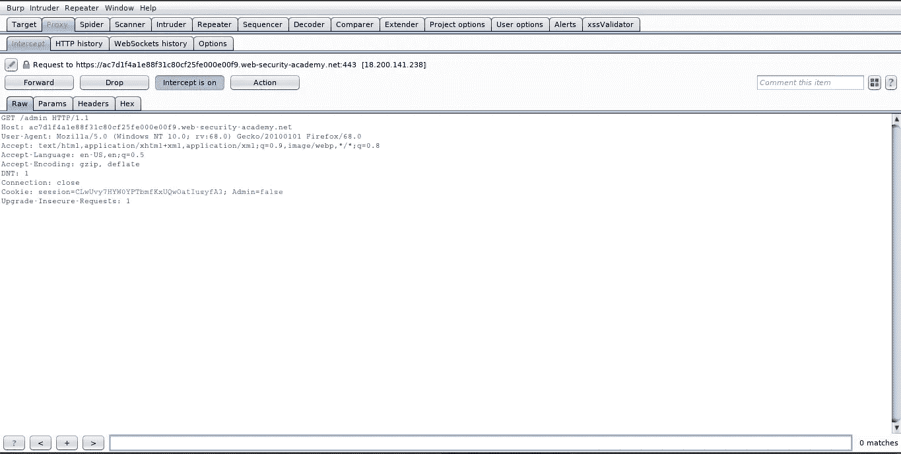

看看有趣的参数“Admin ”,我们可以看到它的值是假的。

现在看到这个之后，我的猜测是，web 应用程序正在根据这个参数检查访问这个管理功能的身份验证。

现在，为了找到参数篡改问题，我们总是需要好奇，如果我们把这个参数的值改为其他值，会发生什么，会给我们带来什么样的反应。

所以出于好奇，让我们用“假”来反驳，或者用“真”的反义词来反驳，这会给我们许可吗？？。

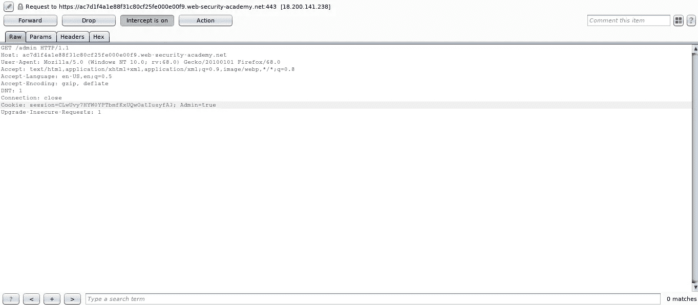

因此，我将参数 Admin 的值更改为“true ”,让我们看看响应。

我转发了请求

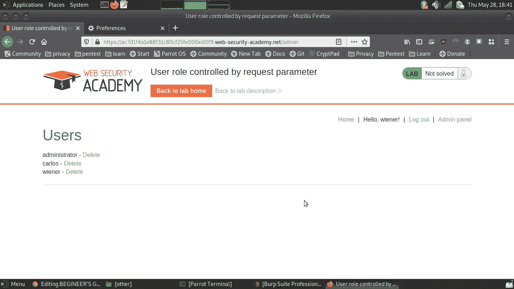

哇，我们可以访问该功能，所以我们的猜测是正确的，web 应用程序正在使用该参数检查身份验证。

有时参数值是数字而不是字符串，所以在模糊化时，我们需要将数字值改为另一个数字值。

考虑这个 web 应用程序

让我们访问“/admin”功能

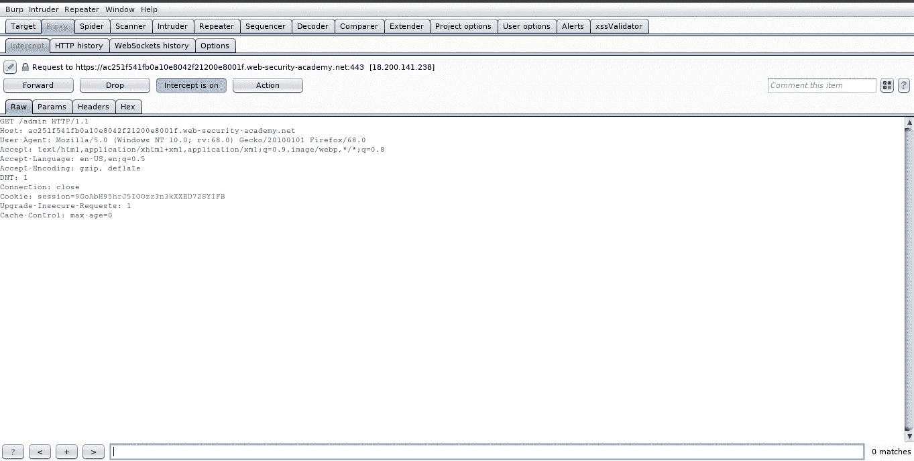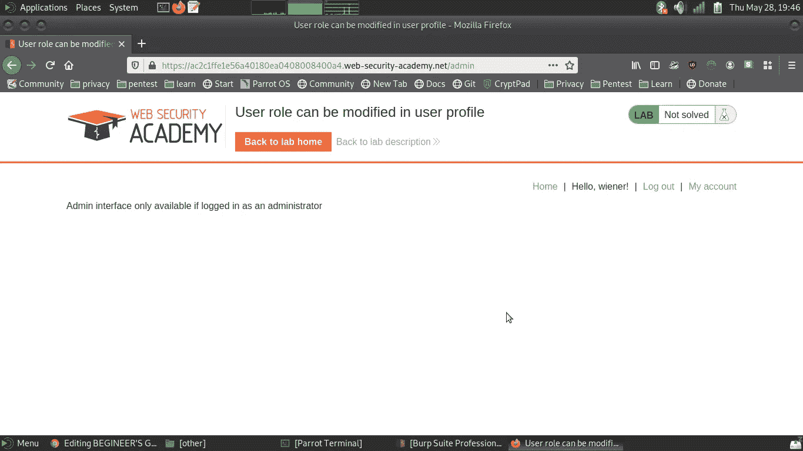

好了，没有参数，让我们探索更多的网站

我们进入“我的客户”端点

让我们尝试更改电子邮件，并在打嗝时捕捉请求

我们在 post 请求中看到了 json 参数。

现在有时会有隐藏的参数，我们在请求中看不到，但它们确实存在，通过给它们赋值来发送它们，我们可以改变应用程序的状态。

现在找到这些隐藏的参数只是一点猜测工作，我们可以使用像

 [## s0md3v/Arjun

### HTTP 参数发现套件 Web 应用程序使用参数(或查询)来接受用户输入，如下…

github.com](https://github.com/s0md3v/Arjun) 

我们被给予网站的指示

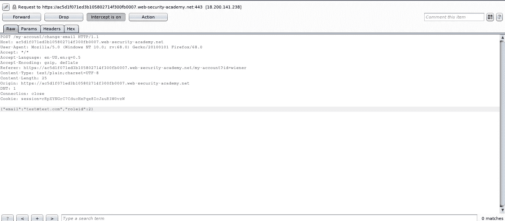

所以让我们发送请求

现在发送请求后

我们获得了另一个功能，如“管理面板”让我们访问它

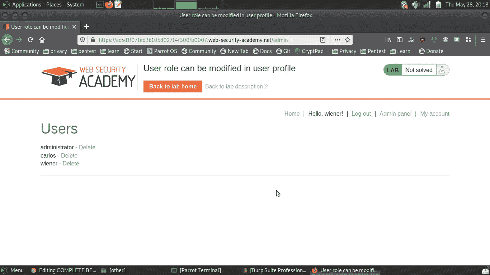

胜利！！！！！！！！！！

“roleid”参数是一个隐藏参数，对于普通用户和管理员，它可能被设置为某个值，而对于管理员，它被设置为 2。通过改变我们的隐藏参数' roleid '值为 2，我们能够欺骗 web 应用程序认为我们是管理员，所以网站给我们权力。

现在我知道博客太长了，所以我把它分成几部分

这里是第二部分，这一旅程的延续

[https://medium . com/@ cyber defecters/begineers-crash-course-for-finding-access-control-vulnerabilities-in-the-web-apps-part-2-ce 38 eafb 81 a](https://medium.com/@cyberdefecers/begineers-crash-course-for-finding-access-control-vulnerabilities-in-the-web-apps-part-2-ce38eabfb81a)*