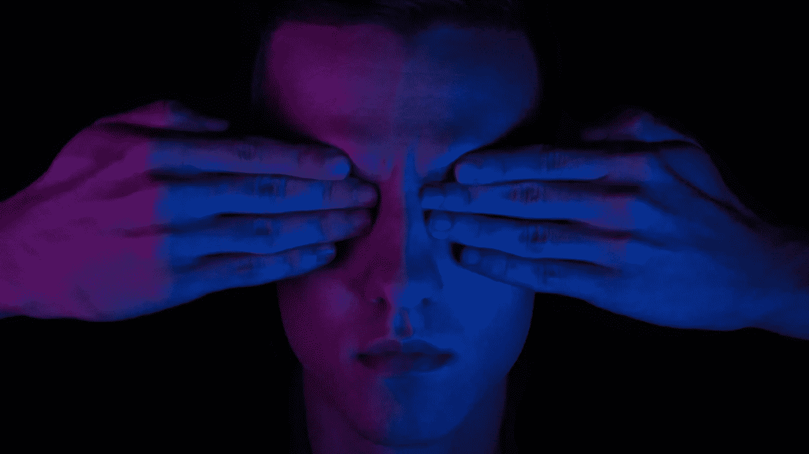

# 初学者 CTF 指南:寻找图像中隐藏的数据

> 原文：<https://infosecwriteups.com/beginners-ctf-guide-finding-hidden-data-in-images-e3be9e34ae0d?source=collection_archive---------0----------------------->

命令和工具，帮助您在参与捕获标志事件时找到图像中的隐藏数据。



由 [Unsplash](https://unsplash.com/s/photos/hidden?utm_source=unsplash&utm_medium=referral&utm_content=creditCopyText) 上的 [Taras Chernus](https://unsplash.com/@chernus_tr?utm_source=unsplash&utm_medium=referral&utm_content=creditCopyText) 拍摄的照片

Jeopardy-style capture the flag 活动围绕参与者必须解决的挑战来取回“旗帜”。该标志是一个隐藏的字符串，必须提供才能获得积分。您解决的挑战越多，获得的旗帜就越多，获得的积分也就越多。得分最高的参与者或团队赢得比赛。

挑战包括几种黑客技术，如网络利用、逆向工程、密码学和隐写术。这些技巧必须应用到解决正确答案的挑战中。

在本文中，我们将着重于寻找图像中隐藏的数据，并介绍可以用来帮助您找到标志的命令和工具。

> 注意:这是对一些有用的命令和工具的介绍。您遇到的挑战可能不像本文中的例子那样简单。请不要期望使用这些方法找到每一面旗帜。

将会有与每个命令和工具相关联的图像。如果你想下载这些图片并亲自尝试这些命令和工具，它们将被存储在这个 [GIT 仓库](https://github.com/mkmety/Medium-Steg-Image)中。

先决条件

*   Linux 系统
*   互联网连接
*   命令行知识
*   耐心

## 文件

file 命令用于确定文件的文件类型。有时，您收到的文件可能没有扩展名，或者扩展名不正确，从而造成混乱和误导。

我们将讨论文件命令的两个例子。

**例 1:**
给你一个名为[rubiks.jpg](https://github.com/mkmety/Medium-Steg-Image/blob/master/rubiks.jpg)的文件。
运行文件命令显示以下信息。

```
mrkmety@kali:~$ **file rubiks.jpg** rubiks.jpg: PNG image data, 609 x 640, 8-bit/color RGBA, non-interlaced
```

文件命令显示这是一个 PNG 文件，而不是 JPG。

**例 2:**
给你一个名为[solitaire.exe](https://github.com/mkmety/Medium-Steg-Image/blob/master/solitaire.exe)的文件。
运行文件命令显示以下内容:

```
mrkmety@kali:~$ **file solitaire.exe** solitaire.exe: PNG image data, 640 x 449, 8-bit/color RGBA, non-interlaced
```

file 命令显示这是一个 PNG 文件，而不是可执行文件。将扩展名更改为。png 将允许您进一步与文件进行交互。

## Exiftool

Exiftool 允许你读写文件中的元信息。标志可能隐藏在元信息中，可以通过运行 exiftool 轻松读取。

您可能需要在系统上安装 exiftool。运行以下命令安装 exiftool。

```
mrkmety@kali:~ $ **sudo apt install libimage-exiftool-perl -y**
```

**例 1:** 给你提供一个名为[ocean.jpg](https://github.com/mkmety/Medium-Steg-Image/blob/master/ocean.jpg)的图像。
运行 exiftool 命令会显示以下信息。

```
mrkmety@kali:~ $ **exiftool ocean.jpg**
ExifTool Version Number         : 11.16
File Name                       : ocean.jpg
Directory                       : .
File Size                       : 42 kB
File Modification Date/Time     : 2020:07:05 14:56:03-05:00
File Access Date/Time           : 2020:07:05 14:56:03-05:00
File Inode Change Date/Time     : 2020:07:05 14:56:03-05:00
File Permissions                : rw-r--r--
File Type                       : JPEG
File Type Extension             : jpg
MIME Type                       : image/jpeg
JFIF Version                    : 1.01
Resolution Unit                 : inches
X Resolution                    : 72
Y Resolution                    : 72
Profile CMM Type                : Little CMS
Profile Version                 : 2.1.0
Profile Class                   : Display Device Profile
Color Space Data                : RGB
Profile Connection Space        : XYZ
Profile Date Time               : 2012:01:25 03:41:57
Profile File Signature          : acsp
Primary Platform                : Apple Computer Inc.
CMM Flags                       : Not Embedded, Independent
Device Manufacturer             :
Device Model                    :
Device Attributes               : Reflective, Glossy, Positive, Color
Rendering Intent                : Perceptual
Connection Space Illuminant     : 0.9642 1 0.82491
Profile Creator                 : Little CMS
Profile ID                      : 0
Profile Description             : c2
Profile Copyright               : IX
Media White Point               : 0.9642 1 0.82491
Media Black Point               : 0.01205 0.0125 0.01031
Red Matrix Column               : 0.43607 0.22249 0.01392
Green Matrix Column             : 0.38515 0.71687 0.09708
Blue Matrix Column              : 0.14307 0.06061 0.7141
Red Tone Reproduction Curve     : (Binary data 64 bytes, use -b option to extract)
Green Tone Reproduction Curve   : (Binary data 64 bytes, use -b option to extract)
Blue Tone Reproduction Curve    : (Binary data 64 bytes, use -b option to extract)
**Comment                         : THIS IS THE HIDDEN FLAG**
Image Width                     : 640
Image Height                    : 425
Encoding Process                : Progressive DCT, Huffman coding
Bits Per Sample                 : 8
Color Components                : 3
Y Cb Cr Sub Sampling            : YCbCr4:2:0 (2 2)
Image Size                      : 640x425
Megapixels                      : 0.272
```

隐藏在元信息中的是一个名为“Comment”的字段。该值是可以隐藏标志的位置。

取决于挑战，文件中的附加元信息可能是有用的。

## xxd

xxd 允许您获取一个文件并以十六进制(hex)格式转储它。

标志可能隐藏在图像中，只有通过转储十六进制并寻找特定的模式才能显示出来。通常，每个 CTF 都有其标志格式，如“HTB{ *flag* }”。

**例 1:** 给你提供一个名为[computer.jpg](https://github.com/mkmety/Medium-Steg-Image/blob/master/computer.jpg)的图像。
运行以下命令，以十六进制格式转储文件。

```
mrkmety@kali:~ $ **xxd computer.jpg** 00000000: ffd8 ffe0 0010 4a46 4946 0001 0101 0048  ......JFIF.....H
00000010: 0048 0000 ffe2 021c 4943 435f 5052 4f46  .H......ICC_PROF
00000020: 494c 4500 0101 0000 020c 6c63 6d73 0210  ILE.......lcms..
00000030: 0000 6d6e 7472 5247 4220 5859 5a20 07dc  ..mntrRGB XYZ ..
00000040: 0001 0019 0003 0029 0039 6163 7370 4150  .......).9acspAP
00000050: 504c 0000 0000 0000 0000 0000 0000 0000  PL..............
00000060: 0000 0000 0000 0000 0000 0000 f6d6 0001  ................
00000070: 0000 0000 d32d 6c63 6d73 0000 0000 0000  .....-lcms......
00000080: 0000 0000 0000 0000 0000 0000 0000 0000  ................
00000090: 0000 0000 0000 0000 0000 0000 0000 0000  ................
...
0008fc30: 8a65 aec6 47fb 1170 cfa1 5c17 ecf5 eab1  .e..G..p..\.....
0008fc40: eb31 e87f 56d8 4acb 467b 6bec 39ef 67d2  .1..V.J.F{k.9.g.
0008fc50: 2170 7c56 eb76 67b8 f92e e2f4 8fbc fd0e  !p|V.vg.........
0008fc60: 7f65 d33c 1945 af53 8efe 3ecc c77c 1707  .e.<.E.S..>..|..
0008fc70: de5d e5c1 7671 e950 b8bf dab9 ee64 63b8  .]..vq.P.....dc.
0008fc80: 92a4 6173 cf67 3cf3 eab3 eb16 cb65 7d9c  ..as.g<......e}.
0008fc90: 0acf 1c3c ed93 064c 6ca8 c76f 1dec eeb6  ...<...Ll..o....
0008fca0: 542d d084 2ee6 7d5f 9db3 b63e d1ff d954  T-....}_...>...**T**
0008fcb0: 4849 5320 4953 2041 2048 4944 4445 4e20  **HIS IS A HIDDEN**
0008fcc0: 464c 4147                                **FLAG**
```

输出在文件末尾显示“这是一个隐藏的标志”。大多数挑战不会这么简单。您可能需要搜索模式、解码数据，或者寻找任何突出的、可以用来找到标志的东西。

## 用线串

strings 命令将从文件中打印出至少 4 个字符长的字符串。可以在文件中嵌入一个标志，该命令将允许快速查看文件中的字符串。

**例 1:** 给你提供一个名为[computer.jpg](https://github.com/mkmety/Medium-Steg-Image/blob/master/computer.jpg)的图像。
运行以下命令查看文件中的字符串。

```
mrkmety@kali:~ $ **strings computer.jpg** JFIF
ICC_PROFILE
lcms
mntrRGB XYZ
9acspAPPL
-lcms
desc
^cprt
wtpt
bkpt
...
DlDH
[gkB
42_#
lf{/
<dXEIl
"DB?
.       q|
+d!m
!p|V
**THIS IS A HIDDEN FLAG**
```

字符串“这是一个隐藏的标志”显示在文件的末尾。标志可以嵌入文件中的任何位置。您可能需要操作字符串的输出来寻找特定的细节。

> 技巧 1:通过管道将 strings 命令传递给 grep 来定位特定的模式。
> 
> 提示 2:在 strings 命令中使用-n 标志来搜索长度至少为 n 个字符的字符串。更多细节请看《人弦》。

## 滨河路

Binwalk 是一个工具，它允许你在二进制图像中搜索嵌入的文件和可执行代码。我们可以使用 binwalk 在图像中搜索嵌入的文件，如旗帜或可能包含旗帜线索的文件。

您可能需要在您的系统上下载 binwalk。运行以下命令安装 binwalk。

```
mrkmety@kali:~ $ **sudo apt install binwalk -y**
```

**例 1:** 给你提供一个名为[dog.jpg](https://github.com/mkmety/Medium-Steg-Image/blob/master/dog.jpg)的图像。
运行以下命令，查看 Binwalk 是否找到任何嵌入文件。

```
mrkmety@kali:~ $ **binwalk dog.jpg** DECIMAL       HEXADECIMAL     DESCRIPTION
-------------------------------------------------------------------
0             0x0             JPEG image data, JFIF standard 1.01
88221         0x1589D         Zip archive ... name: hidden_text.txt
88384         0x15940         End of Zip archive, footer length: 22
```

Binwalk 检测到一个压缩文件嵌入在 dog.jpg。zip 文件中的文件名为 hidden_text.txt。

您可以通过运行以下命令来提取隐藏文件。

```
mrkmety@kali:~ $ **binwalk -e dog.jpg**DECIMAL  HEXADECIMAL  DESCRIPTION
-------------------------------------------------------------------
0           0x0             JPEG image data, JFIF standard 1.01
88221       0x1589D         Zip archive data, ... hidden_text.txt
88384       0x15940         End of Zip archive, footer length: 22
```

已经创建了一个名为“_dog.jpg.extracted”的目录，文件会自动解压缩。

```
mrkmety@kali:~ $ **cd _dog.jpg.extracted/**
mrkmety@kali:~/_dog.jpg.extracted $ **ls -l**
total 8
-rw-r--r-- 1 pi pi 185 Jul  5 19:50 1589D.zip
-rw-r--r-- 1 pi pi  21 Jul  5 15:39 hidden_text.txt
mrkmety@kali:~/_dog.jpg.extracted $
mrkmety@kali~/_dog.jpg.extracted $ **cat hidden_text.txt**
THIS IS A HIDDEN FLAG
```

对嵌入的文本文件运行 cat 命令会显示“这是一个隐藏的标志”

## 包扎

这是寻找隐藏在图像文件中的数据的介绍。你遇到的大多数挑战都不会像上面的例子那么简单。您需要使用这些命令和工具，并将它们与您现有的知识结合起来。耐心是关键。如果一件事不起作用，那么你就继续下一件事，直到你找到起作用的东西。挑战试图隐藏旗帜。

还有许多其他工具可以帮助您应对隐写术挑战。下面是一些你可以研究来帮助扩展你的知识。

*   [stegsolve](https://github.com/zardus/ctf-tools/blob/master/stegsolve/install)
*   [pngcheck](http://www.libpng.org/pub/png/apps/pngcheck.html)
*   [stegdetect](https://github.com/redNixon/stegdetect)

如果你有任何问题，请发微博或发短信给我 [@mrkmety](https://twitter.com/mrkmety)

有很多像这样的入门教程，如果你是新手，最好的初学者 CTF 之一是 PicoCTF，如果你想快速入门，看看这个 [2021 PicoCTF 演练](https://guidedhacking.com/threads/picoctf-2021-practice-challenges-write-ups.17296/)。