# BugTrails-23 详细报道

> 原文：<https://infosecwriteups.com/bugtrails-23-writeup-96641e051aa5?source=collection_archive---------0----------------------->

## BugTrails 是由 BugBase 社区主办的每周一次的 CTF 挑战赛，为排行榜上的顶级用户提供现金奖励。[https://bugbase.in/dashboard/competitions](https://bugbase.in/dashboard/competitions)

## 1.挑战名称:管理面板

挑战为我们提供了一个网址。相同的截图如下所示。

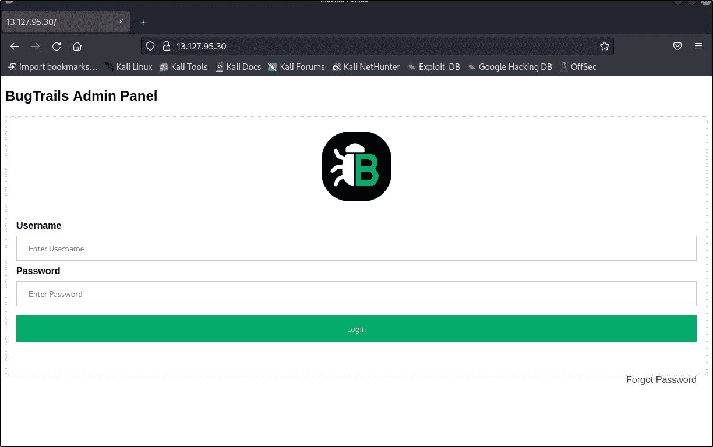

分析网站以了解网站上使用的技术。PHP 用于后端，这可以通过查看客户端源代码来识别。与此同时，我们可以看到在 ***用户名*** 字段旁边写着一些不寻常的注释。

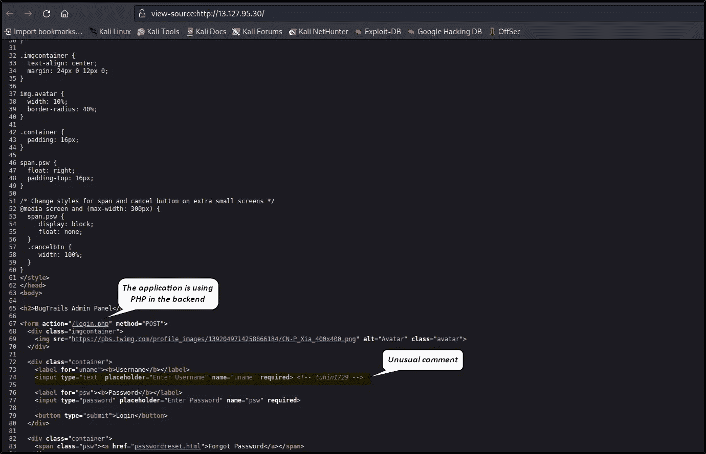

这项挑战的目标是获得应用程序的管理员访问权限。应用程序通过客户端源代码 ***tuhin1729*** 泄露管理员的用户名。尝试此特定用户的默认凭据不起作用。

还有另一个页面用于重置用户密码。

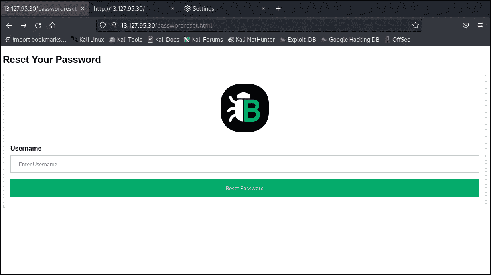

在拦截 Burp Suite 中的密码重置请求时，我们可以在响应中看到一些不寻常的注释。

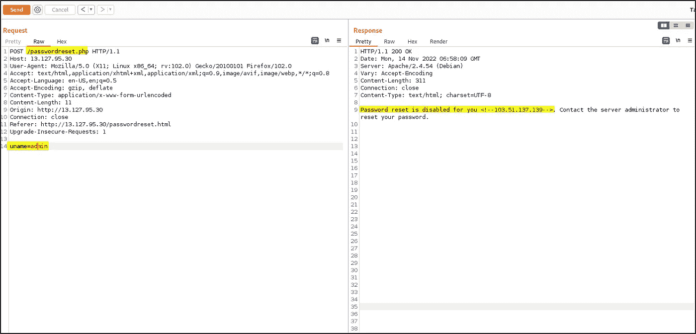

看起来服务器正在根据 IP 地址过滤请求。为了请求密码重置，我们需要用服务器的 IP 地址伪造我们的 IP 地址。(在上面给出的截图中指定)

我们可以尝试使用 HTTP 报头伪造 IP 地址。我们需要使用名为 ***lowercase-headers 的 SecLists 中的一个单词列表来强制生成标题。*** (下面给出的命令)

```
ffuf -w /opt/SecLists/Discovery/Web-Content/BurpSuite-ParamMiner/lowercase-headers -H "FUZZ: 13.127.95.30" -H "Content-Type: application/x-www-form-urlencoded" -u http://13.127.95.30/passwordreset.php -d "uname=admin" -c -fs 311
```

上面给出的命令将给出结果。

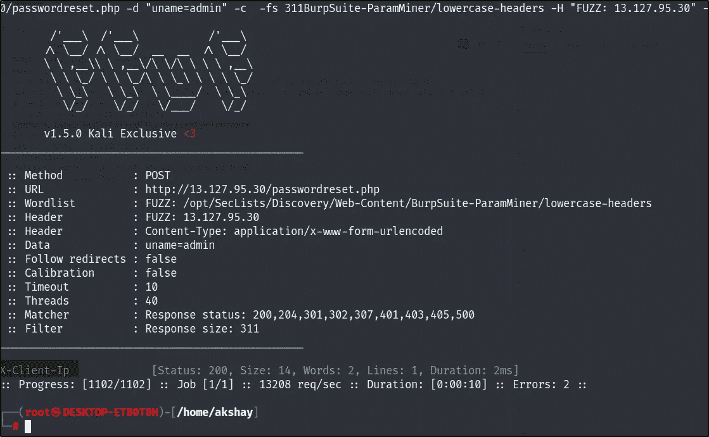

因此，有可能使用 ***X-Client-Ip*** 报头伪造 IP 地址。让我们使用 Burp Suite 的 repeater 选项卡来看看实际情况。


现在这种反应比我们以前得到的有所不同。评论还说，为了重置密码，我们需要向服务器发送 curl 请求。让我们将 ***用户代理*** 值改为*并发送请求。*

*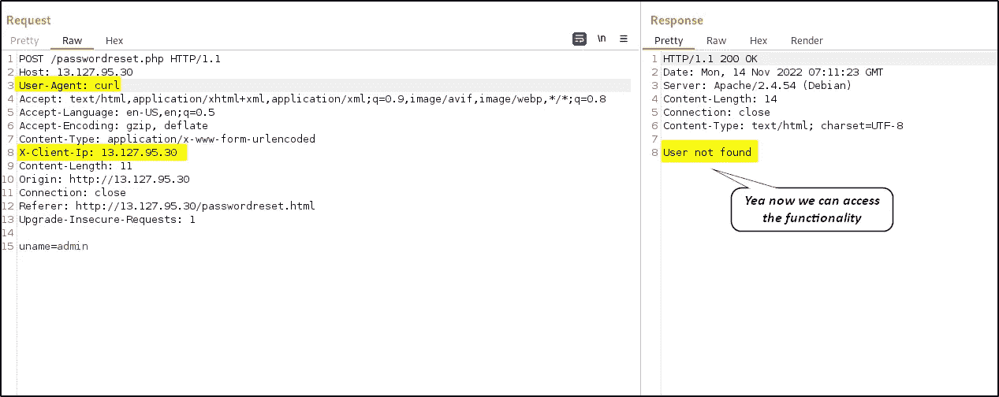*

*还记得客户端源代码中披露的用户名吗，我们输入那个代替 ***admin*** 。*

*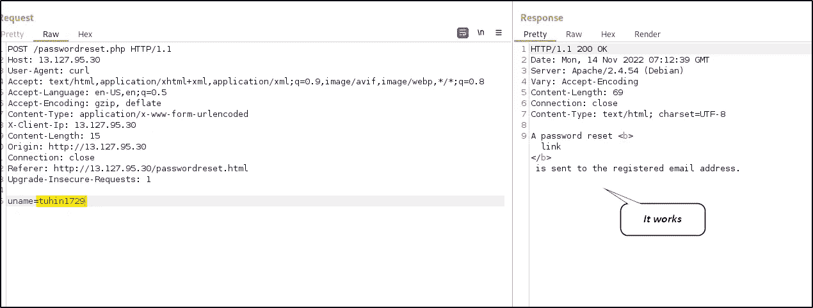*

*密码重置功能运行良好*

*现在我们需要访问那个链接来重置用户的密码。有一种广为人知的攻击叫做 ***密码重置中毒*** 我们可以试试。*

*密码重置中毒是一种技术，攻击者通过这种技术操纵易受攻击的网站生成指向其控制的域的密码重置链接。这种行为可被用来窃取重置任意用户密码所需的秘密令牌，并最终危及其帐户的安全。*

*为了执行此攻击，请确保您有 ngrok 或 VPS 实例来获取链接(使用 linode、DO 或 vultr)。现在要触发这个攻击，我们需要添加一个名为 **X-Fowarded-Host** 的新头，并将其值设置为我们控制的 VPS 实例的 IP 地址。*

*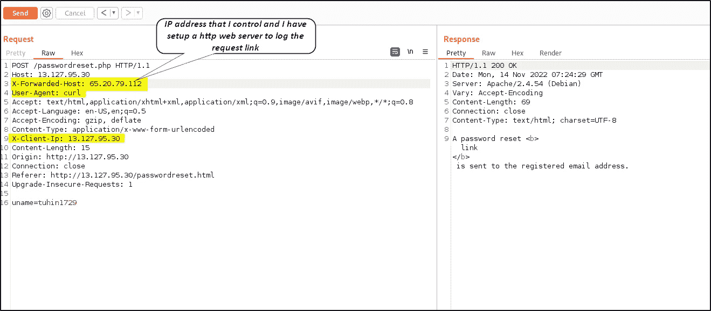***

*收到我的 VPS 实例上的密码重置链接。*

*现在访问添加了密码重置链接的网页，确保添加了 ***X-Client-Ip*** 头，并将 ***User-Agent*** 值更改为 curl。*

*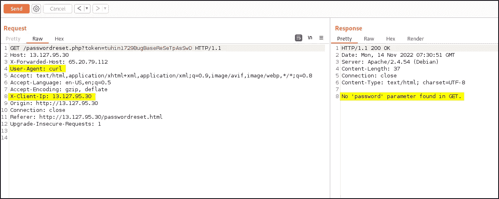***

*在 GET 请求中添加密码参数。*

*让我们尝试使用更新后的密码登录管理员帐户。*

*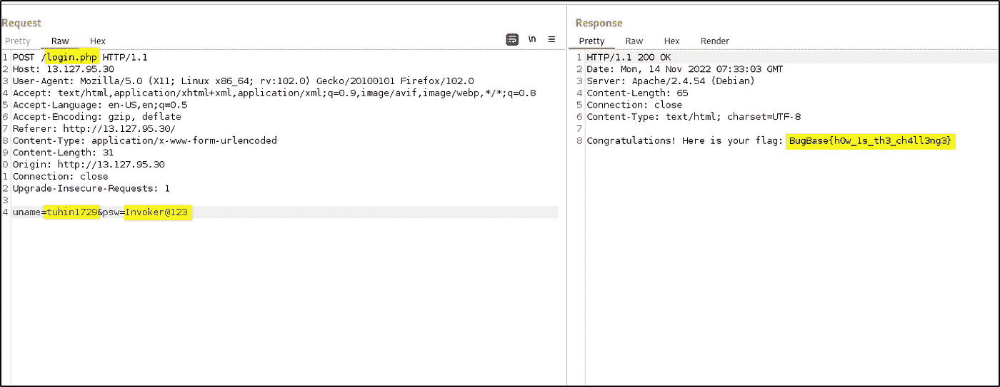*

*已实现管理面板访问*

## *2.挑战名称:错误文件*

*挑战为我们提供了一个网址。相同的截图如下所示。*

*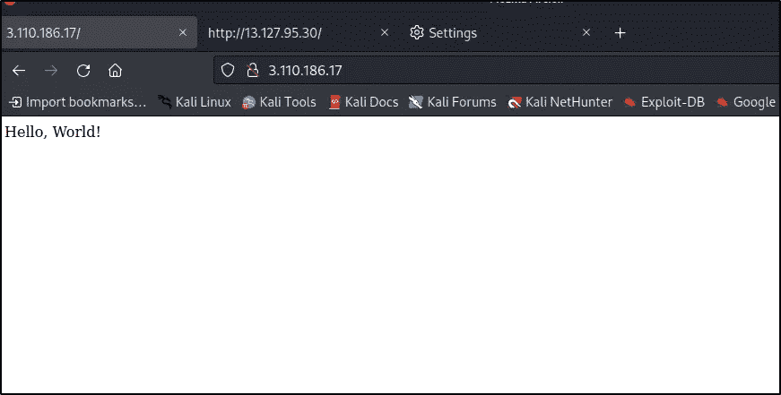*

*网站上什么也看不到。在 Burp 套件中拦截请求以识别响应头。*

**

*后端运行的 Flask web 服务器*

*让我们使用 **ffuf** 为应用程序执行内容发现。*

```
*ffuf -w /opt/SecLists/Discovery/Web-Content/raft-medium-words.txt -u http://3.110.186.17/FUZZ -c -t 10*
```

*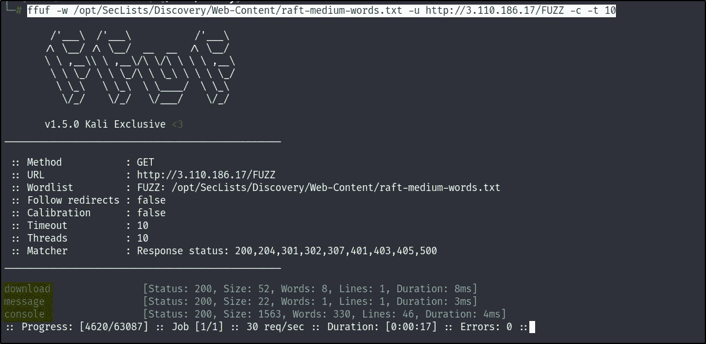*

*我们不要浪费时间在位于*/控制台*端点的 Werkzeug 调试控制台的引脚上。*

*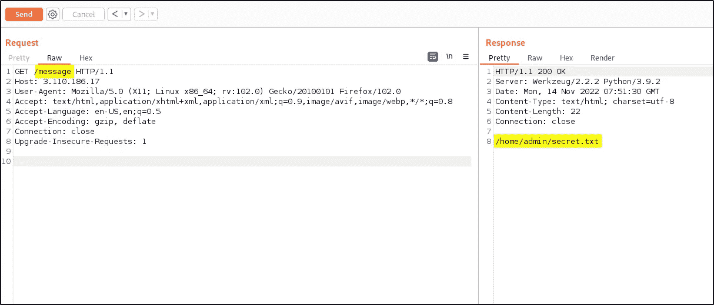*

*消息端点*

*看起来像是有我们旗帜的小路。访问另一个端点。*

*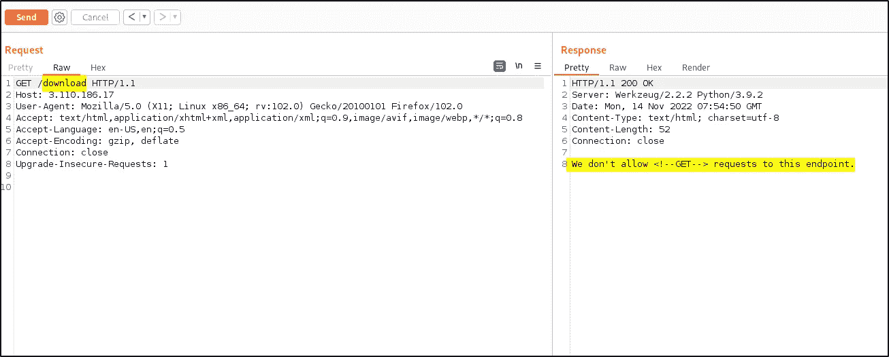*

*下载端点*

*因此，这个端点不允许任何 GET 请求。我们可以尝试将 HTTP 动词改为 POST、PUT 或 PATCH。*

*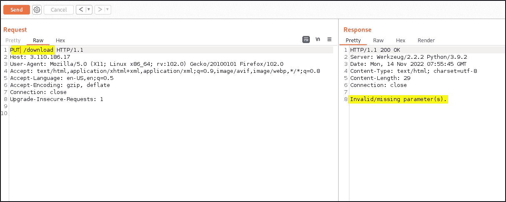*

*PUT 在这里是有效的 HTTP 动词*

*这个端点看起来像是提供了一个有效的路径/文件，它将从系统下载该文件。让我们尝试使用 **ffuf** 强制有效参数。(下面给出的命令)*

```
*ffuf -w /opt/SecLists/Discovery/Web-Content/raft-medium-words.txt -X PUT -H "Content-Type: application/x-www-form-urlencoded" -u http://3.110.186.17/download -d "FUZZ=/etc/passwd" -c -fs 29*
```

*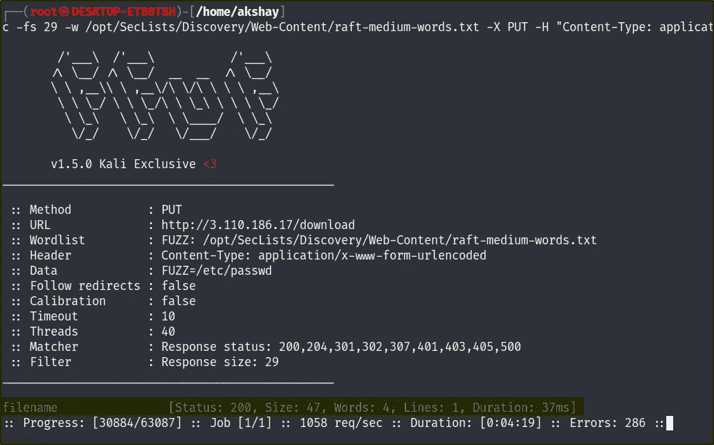*

*已识别下载端点的有效参数*

*在*文件名*参数中输入随机路径，并将请求发送给服务器。*

*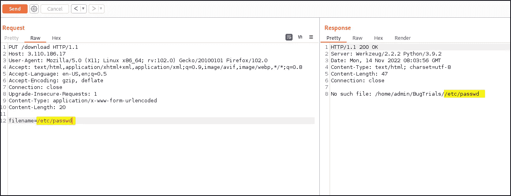*

*directroy 遍历有效负载(../)在这里被过滤。我们可以通过使用另一个类似这样的有效载荷来绕过它，*

```
*..././..././..././..././etc/passwd*
```

***../** 在上面的示例中，有效负载将被过滤器移除，最终的有效负载将看起来像，*

```
*../../../../etc/passwd*
```

*现在我们已经成功绕过了 LFI 过滤器，我们可以尝试访问我们之前发现的那个 ***secret.txt*** 。( ***消息端点*** )*

**

*secret.txt 文件的内容*

*文件上说这个挑战的开发者泄露了 pastebin 的一些信息。访问[pastebin.com](https://pastebin.com)，在上面搜索挑战名称(BugFile)。*

**

*对 Werkzeug 控制台使用此调试器 PIN 来执行系统命令。*

*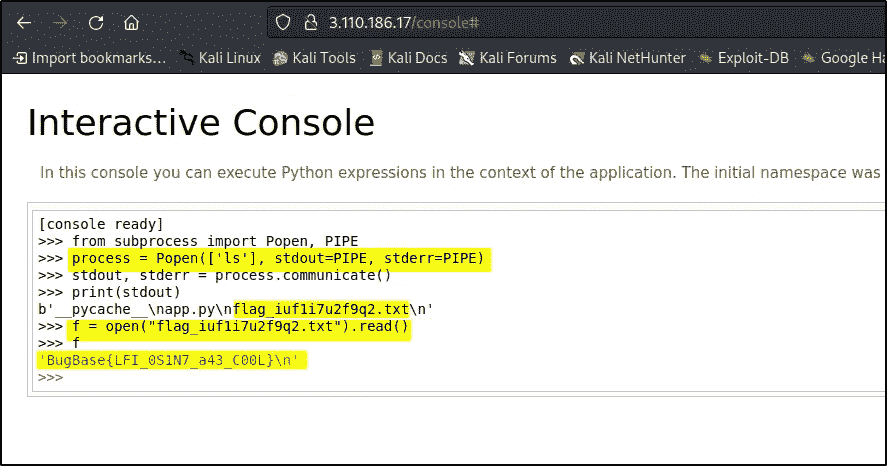*

*已检索挑战的标志*

*非常感谢您花时间阅读我的文章:)*

## *来自 Infosec 的报道:Infosec 每天都有很多内容，很难跟上。[加入我们的每周简讯](https://weekly.infosecwriteups.com/)以 5 篇文章、4 条线索、3 个视频、2 个 GitHub Repos 和工具以及 1 个工作提醒的形式免费获取所有最新的 Infosec 趋势！*