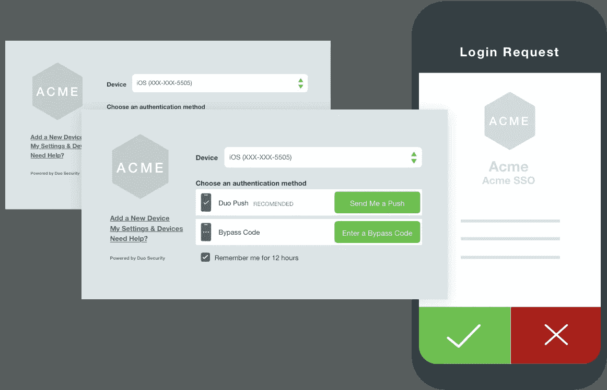
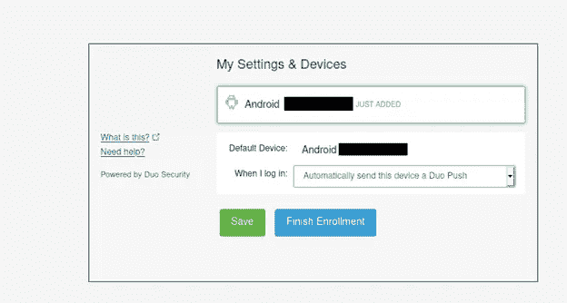
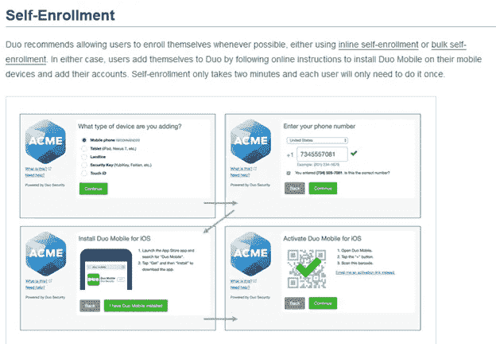

# 通过 Duo 在线自助注册在 Pentest 期间绕过 VPN MFA

> 原文：<https://infosecwriteups.com/bypassing-vpn-mfa-during-a-pentest-via-duo-inline-self-enrollment-78be6e985b24?source=collection_archive---------0----------------------->

Duo MFA 示例

最近，我和我的团队与一个组织进行了一次外部交战，出于隐私，我们称他们为 example.org，主要目标是测试和利用外部边界。该组织托管了几个面向公众的网站，包括一个 Outlook Web App 门户和一个 GlobalProtect VPN 门户，这两个门户后来都变得很重要。对于此项目，我将向您介绍我们采取的步骤以及我们能够利用的一些有趣的配置。一些细节将会调整，并非所有内容都将共享，以保护组织隐私。由于这篇文章的重点是 Duo 部分，我将总结或跳过测试的大部分支持信息，并将重点放在让我们能够访问安全前门的错误配置上。

# Pentest 时间

在项目开始时，我们使用 [linkedin2username](https://github.com/initstring/linkedin2username) 提取了数百名公司用户的潜在用户名列表，通过在线找到的电子邮件地址确定了正确的用户名结构。有了这些，我们建立了 Metasploit 的 OWA 密码暴力模块，并开始了攻击。还需要注意的是，该 OWA 连接到 org 的域，这表明任何受到危害的用户也可能是有权访问 VPN 的域用户。

在确认似乎没有蛮力保护之后，我们放弃了攻击，并检查了外围的其他一些区域。过了一会儿，弹出了一个结果，一个用户(我们称他们为 a user)的密码是 Password1。

使用弱凭据成功的暴力登录

不会吧，真的会这么简单吗？登录 OWA 端点向我们提供了一个线索，一个密码重置提示。似乎这个用户已经有一段时间没有活动了？我们调整了密码，进入了邮箱。

正在为找到的帐户调整密码

对该用户进行彻底的审查后，我们发现该用户是人力资源部门的前主管，最近刚刚离开公司。那么，为什么他们仍然启用电子邮件访问，这是什么密码 1 业务？由于他们的电子邮件中没有立即上报的内容，我们试图在 VPN 登录中使用相同的凭据，但没有成功。

由于社会工程不在此项目的范围内，我们的下一步是利用对组织电子邮件服务器的部分访问，看看我们还能获得什么。我们使用名为 [MailSniper](https://github.com/dafthack/MailSniper) 的工具和这些凭证在邮件服务器上拉出 956 个有效用户的完整列表。

通过 MailSniper 从 OWA 提取的 956 个有效用户的列表

我们将这个新的、改进的用户列表反馈给 OWA 暴力攻击。过了一会儿，我们得到了更多的结果，21 个用户的密码是 1，3 个用户的密码是 2020。看来 Password1 是一个组织问题，而不仅仅是糟糕的个人安全。像 AUser 一样，这些帐户中的大多数似乎都是旧帐户，很可能已经被停用。可能在员工离职流程的某个地方，设置了密码 1？

我们继续审查电子邮件和测试 VPN 访问，运气不太好，直到一个用户给了我们一个不同的二人组响应(让我们称他们为 VPNUser)。这个用户弹出了一个错误消息，并显示了一个在阿朵注册的消息。

Duo 自助注册链接

这个链接导致了一个标准的 Duo MFA 注册过程，在这个过程中，我可以将我的手机作为 MFA 设备连接到这个找到的帐户。我们回到登录屏幕，键入 VPNUser:Password1，放入我们新的闪亮的 MFA 令牌，然后出现了下载 VPN 连接包的选项。真的有那么简单吗？

将个人 MFA 添加到内部帐户

# 安全性还是便利性

让我们花点时间回顾一下这里发生了什么，因为乍一看并不清楚。

这个组织聪明地在他们的 VPN 系统中设置了两个 MFA，以防止刚刚发生的事情:通过被破坏的或弱密码进行访问。这是一个极好的安全选择，也是每个公司都应该实施的。不幸的是，MFA 控制端的一个小的未被注意到的配置使得该控制在特定的场景中被废弃。具体来说， [Duo 内嵌自注册](https://duo.com/docs/enrolling-users#self-enrollment)已启用。不幸的是，Duo 的默认设置是允许任何已经注册的用户(比如说使用自动 Windows AD 集成)能够在首次登录时注册 MFA 令牌。

如下所示，该功能允许任何新用户在首次登录时编辑 MFA 并将其添加到他们的帐户中。虽然很方便，但这显然会带来很大的安全风险，因为它会在帐户首次登录时取消对帐户的 MFA 保护，同时给人一种它仍然存在的错觉。一般来说，设置 MFA 最安全的方法是将其作为新员工欢迎包的一部分发送到他们的工作电子邮件，在确认安装到位之前，不允许其他访问。当然，这也带来了 IT/HR 方面管理增加的代价。

Duo 内嵌自助注册流程

> 注意:项目结束后，客户组织通知我们，VPNUser 实际上已经有了一个帐户，但不知何故，Duo 根据给定用户名的大小写变化创建了另一个帐户。我个人无法找到任何支持这一点的文档，所以我无法确认或否认这是否是 Duo 的工作方式。如果有人能够使用 Microsoft AD 和自助注册在企业 Duo 设置中测试此功能，我将很乐意更新此结果！

# 内部升级

现在获得了内部访问权，我们请求客户允许攻击内部，这得到了批准。我不会详细介绍所有的内部细节，大部分是用 BloodHound、Crackmapexec 等工具进行的标准枚举。最终，我们发现我们的用户可以访问补丁服务器共享，而该共享又有一个存储的 bat 文件，其中包含防病毒安装程序服务帐户的用户名和密码，该帐户…..你猜对了，有域管理员权限。我们仔细检查了访问权限，做了更多的违规后审查，并准备写我们的报告。

# 补救

对于任何担心在阅读本文后会启用自助注册的系统管理员来说，修复这个问题很容易，但不幸的是会带来额外的支持开销。根据此[链接](https://help.duo.com/s/article/5051?language=en_US)，需要采取以下行动:

> 为了防止通过显示 Duo 提示的基于浏览器的应用程序进行[在线自助注册](https://duo.com/docs/enrolling-users#inline-self-enrollment)，将[新用户策略](https://duo.com/docs/policy#new-user-policy)设置为**拒绝访问**。

这确实意味着，对于任何新用户，他们都需要创建自己的帐户，并将 MFA 设备连接到他们的 Duo 帐户，然后才能登录，因此在进行此更改之前，请确保支持流程已准备就绪。一般来说，允许用户完全控制二级保护通常会削弱他们的能力，因此从安全角度来看，强烈建议制定严格的 MFA 注册流程。

但是，值得注意的是，利用漏洞的总体风险是有限的，因为这种攻击媒介仅适用于新的 Duo 用户的首次登录，并且需要已知的用户/通行证。然而，正如我希望本文所展示的，这并不是完全不合理的攻击，应该在威胁建模会议中加以考虑。

这就是为什么一些小的配置和错误的组合:帐户关闭时设置的弱密码、启用的 MFA 自助注册和存储的管理员凭据导致了一家大公司的完全域名接管。我希望你喜欢这个简短的订婚故事，我计划做更多有趣的场景出现在测试中！