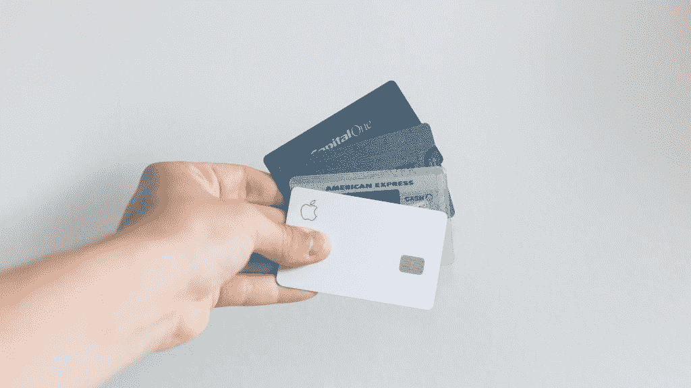

# 破解 API 暴露的加密信用卡号

> 原文：<https://infosecwriteups.com/cracking-encrypted-credit-card-numbers-exposed-by-api-977c6f7b996f?source=collection_archive---------1----------------------->

我发现了一个暴露加密信用卡号码的 API。下面是我如何破解它们来揭示完整的卡片细节。

埃弗里·埃文斯在 [Unsplash](https://unsplash.com/s/photos/credit-card?utm_source=unsplash&utm_medium=referral&utm_content=creditCopyText) 上拍摄的照片

在入侵一个私人 bug bounty 程序时，我发现一个 graphql 端点暴露了比它应该暴露的更多的登录用户信息。通过使用“about me”graph QL API 请求，我能够猜测并检索数据库中所有登录用户的存储值，而不仅仅是 web 应用程序披露的值。

使用这些猜测的参数，我能够检索添加到用户帐户的所有信用卡。这些信息包括:持卡人姓名、注册地址、卡的有效期、卡的最后 4 位数字、卡的类型以及完整信用卡号的加密版本。

该应用程序允许用户在其帐户上存储多达 10 张支付卡，以便在购买产品和服务时更容易结账。为了让公司将来使用它们，我知道它们必须以可解密的格式存储。在提交报告之前，我给自己设定的挑战是破解加密算法并查看原始卡号。

# 信用卡号码解释

信用卡和借记卡号码使用国际公认的标准。支付卡号(PCN)的长度可以是 8 到 19 位，前 6 到 8 位用于识别发卡银行。这被称为发行人识别号(IIN)。所有美国运通卡都以 34 或 37 开头，所有维萨卡都以 4 开头，等等。

还有一系列卡号是为测试目的保留的，永远不会分配给真正的客户。(这是另一个你可以测试的 bug——我可以用测试卡购买吗？).我个人最喜欢的是签证:4111 1111 1111 1111。Stripe 有一个你可以在任何地方使用的测试卡列表，你可以在谷歌上快速搜索“测试支付卡号”找到更多。

最后，大多数信用卡号都包含一个使用 [Luhn 算法](https://en.wikipedia.org/wiki/Luhn_algorithm)的有效性验证号。这样，卡号的最后一位是前面所有数字的校验位。对于“4111 1111 1111 111X ”,校验位值为 1。对于“4111 1111 1111 112X ”,校验位值是 9。你可以自己用工具玩这个，比如[这个](https://simplycalc.com/luhn-calculate.php)。如您所见，只要您知道前缀、长度以及是否使用 Luhn 算法，任何人都可以为任何给定的银行生成所有可能的卡号。这就是为什么你还需要信用卡有效期和 CV2 号码来购物。

现在我们对信用卡号码有了更好的理解，我将继续我的攻击。

# 尝试 1:颠倒算法

我创建了一个新的用户帐户，并添加了我最喜欢的 Visa 信用卡号码，“4111 1111 1111 1111”。当我查询 API 时，我收到了一个 16 位数字的加密版本的卡。我删除了卡，然后又添加了一次。当我再次查询 API 时，我收到了相同的加密值。现在我知道结果是使用固定算法静态生成的。

然后我意识到 API 将允许我在一个请求中提交多达 10 个卡号。我从‘4111 1111 1111 1129’，‘4111 1111 1137’等连续上传了 10 个号码。试图找出一种模式。我可以看到一种模式出现的迹象，但我无法理解。响应的最后 4 位数字始终是原始文本的明文:“1111’、1129’、1137’等。前两个数字总是“54”代表 Visa，“53”代表美国运通，等等。所以看起来卡片的第一个数字 IIN 变成了回答的第二个数字，他们总是以 5 开头。

由于我从 API 响应中知道了卡的类型以及最后 4 个数字，所以我已经有了 16 个数字中的 6 个数字来重建上传到应用服务器的任何卡号。

我又推了几个小时，尝试了越来越多的组合，试图尽可能接近“0000 0000 0000 0000”，但只有 Luhn 验证卡号有效，我仍然无法理解这种模式。我很接近了，但还不够接近。

回到画板上，上床睡觉。

# 尝试 2:彩虹桌

凌晨 3 点，我带着一个想法醒来。如果为提交相同卡号的所有用户生成相同的加密值，我不需要反转算法，我只需要一个彩虹表，其中包含映射到原始卡号的所有可能的加密值。

彩虹表是一个包含加密值及其对应明文的查找表。这些通常是为 MD5 之类的散列创建的，但是在这种情况下，我需要一个用于双向加密字符串的散列——一个可以用定制算法加密和解密的散列。

第二天早上，我创建了第二个用户帐户，并输入了我的 go-to 卡号。当我通过 API 查询时，我得到了一个匹配。两个用户都收到了完全相同的加密 16 位字符串。太神奇了。

这意味着卡号在没有使用加密盐的情况下被加密。在密码学中，salt 是添加到输入中的随机数据，用于防止重复的输入产生重复的加密输出。在不添加 salt 的情况下，如果有人知道给定输出的输入，其他用户的任何匹配输出都可以映射回已知的输入。由于每个用户使用不同的 salt，即使是相同的卡号，输出也总是不同的。

盐 5000 的用户 1:4111 1111 1111 1111+5000-> 5477 2356 1143 1111

盐用户 2 7992:4111 1111 1111 1111+7992-> 5436 4343 8711 1111

# 把所有的放在一起

现在我知道了:

*   该应用程序将信用卡号存储在一个双向加密的 16 位字符串中
*   应用程序对所有用户使用相同的算法
*   该应用程序不会对每个用户使用不同的加密盐，因此具有相同卡号的两个用户帐户将生成相同的加密号
*   我可以一次上传 10 个卡号，然后查询所有加密的卡号

然后，我编写了一个 python 脚本，计算每家银行的所有有效卡号，然后使用应用服务器为每家银行生成加密输出。我把他们的应用服务器变成了我自己的支付卡号加密工具。

一次提交我生成的 10 个信用卡号，然后发出‘about me’graph QL 查询来取回加密的值。该工具将遍历每个银行所有可能的组合，构建一个彩虹表。由于这只是一个概念验证，为了不浪费应用服务器上的资源，我在几百个周期后终止了这个脚本。(运营团队不喜欢你搞砸东西，占满日志空间)。

有了 rainbow table 概念证明，我就能够为任何登录用户解密应用程序数据库中存储的任何信用卡号。由于“关于我”查询还存储了信用卡到期日、注册用户姓名和注册地址，所以真正支付时唯一缺少的就是 CV2 号码。

# 影响

宣布这是一个 P1 或关键漏洞的最大障碍是，它只对登录用户有效。为了利用它，我需要接管受害者的账户。该站点的身份验证保护不完善，在测试时无法进行 MFA。暴力攻击、泄露共享密码攻击或网络钓鱼攻击都有可能获得访问权限，但对于这个 bug bounty 程序来说，这是一步之遥。相反，我们同意了一个较低但仍然不错的严重程度。

# 补救建议

我总是在我的 bug 奖励报告中给出补救建议。这一次，最简单的方法就是停止将加密的卡号作为 API 查询响应的一部分返回。为每个用户添加一个 salt 是一件好事，但是一旦加密的数字不再暴露给最终用户，风险就被有效地降低了。

与我私人电子邮件列表中的其他人一起关注我的最新文章、视频、想法等。

*原载于 2021 年 6 月 22 日*[*【https://craighays.com】*](https://craighays.com/cracking-encrypted-credit-card-numbers-exposed-by-api/)*。*