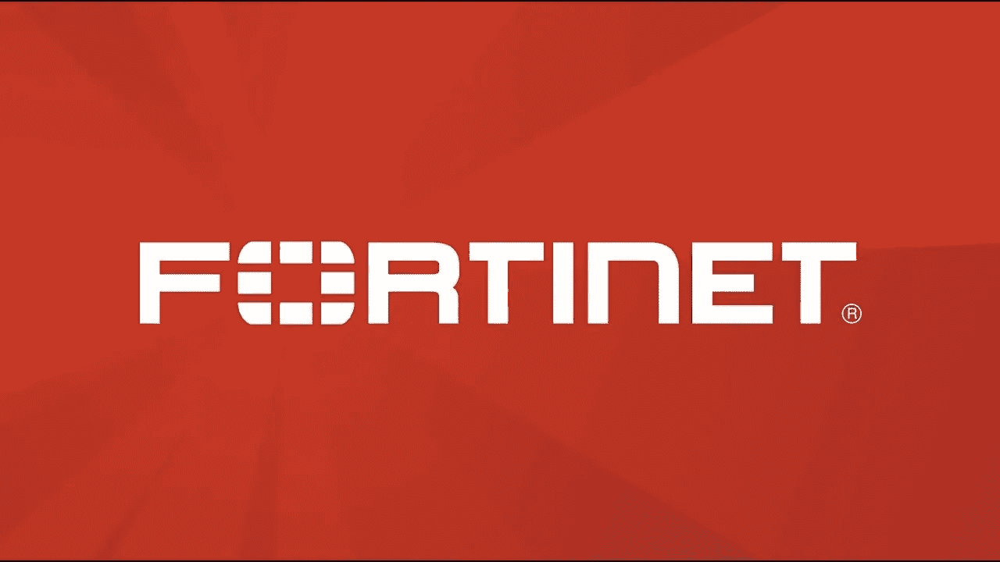

# CVE-2022–40684:影响 FortiGate 和 FortiProxy 的新认证旁路

> 原文：<https://infosecwriteups.com/cve-2022-40684-new-authentication-bypass-affecting-fortigate-and-fortiproxy-c9bd36112949?source=collection_archive---------1----------------------->

作者:[安舒尔·维亚斯](https://www.instagram.com/_ansh_vyas/)

# **发生了什么？**

Fortinet 的 FortiOS(防火墙)和 FortiProxy (web 代理)软件于 2022 年 10 月 3 日更新，并显示 CVE-2022–40684 易受当时最新版本的攻击。通过巧尽心思构建的 HTTP/S 请求，未经身份验证的远程攻击者可以绕过身份验证，无需身份验证即可访问这些产品的管理界面。根据 CISA 的已知被利用的漏洞目录，Fortinet 漏洞在历史上一直被威胁者利用来获得初始访问权并在受害者的环境中横向移动。根据历史先例和通过利用此漏洞获得的特权，北极狼预测威胁参与者可能会开发一个概念利用证明，并在不久的将来利用它。

# 固定版本

2022 年 10 月 6 日星期四，Fortinet 的 7.0.7 和 7.2.2 版本解决了该漏洞。Rapid7 敦促运行受影响软件版本的组织尽快升级到 7.07 或 7.2.2，作为紧急情况，与 Fortinet 一起。对于寻求访问内部网络的攻击者来说，这些产品是高价值和高关注度的目标。尽管 Rapid7 意识到没有人在野外利用该漏洞，但我们预计攻击者会尽快将注意力集中在 CVE-2022–40684(如 CVE-2018–13379)。Rapid7 建议限制公共访问所有高价值边缘设备上的管理界面。

# 分析

能够访问易受攻击目标的管理界面的远程攻击者可以通过 CVE-2022–40684(一个 CVSSv3 评分为 9.6 的关键身份验证绕过漏洞)禁用或覆盖管理员功能。根据目前可用的信息，该漏洞尚未被攻击利用。Fortinet 建议，鉴于威胁参与者倾向于针对 FortiOS 漏洞，应该“以最大的紧迫性”修复该漏洞。

# 结论

当被问及评论时，该公司承认了这一建议，但表示将推迟公开宣布，直到客户应用了修复程序。该公司在一份声明中表示:“为了最好地保护他们的组织，我们必须定期与客户沟通。”在与客户交流时，您通常会找到最新的指导和建议步骤，以保护他们的组织的安全。在某些情况下，客户可以提前收到有关咨询的机密信息，这些信息将在未来几天向更广泛的受众公开，使他们能够加强安全态势。客户安全是我们的首要任务。"

## 来自 Infosec 的报道:Infosec 每天都有很多内容，很难跟上。[加入我们的每周简讯](https://weekly.infosecwriteups.com/)以 5 篇文章、4 条线索、3 个视频、2 个 GitHub Repos 和工具以及 1 个工作提醒的形式免费获取所有最新的 Infosec 趋势！