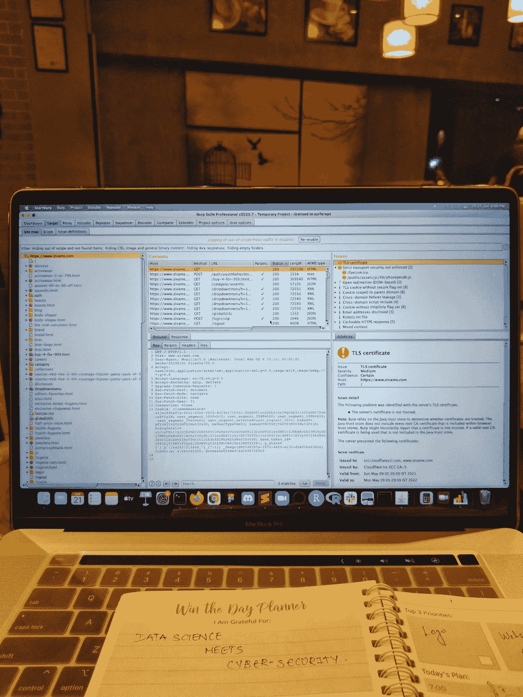
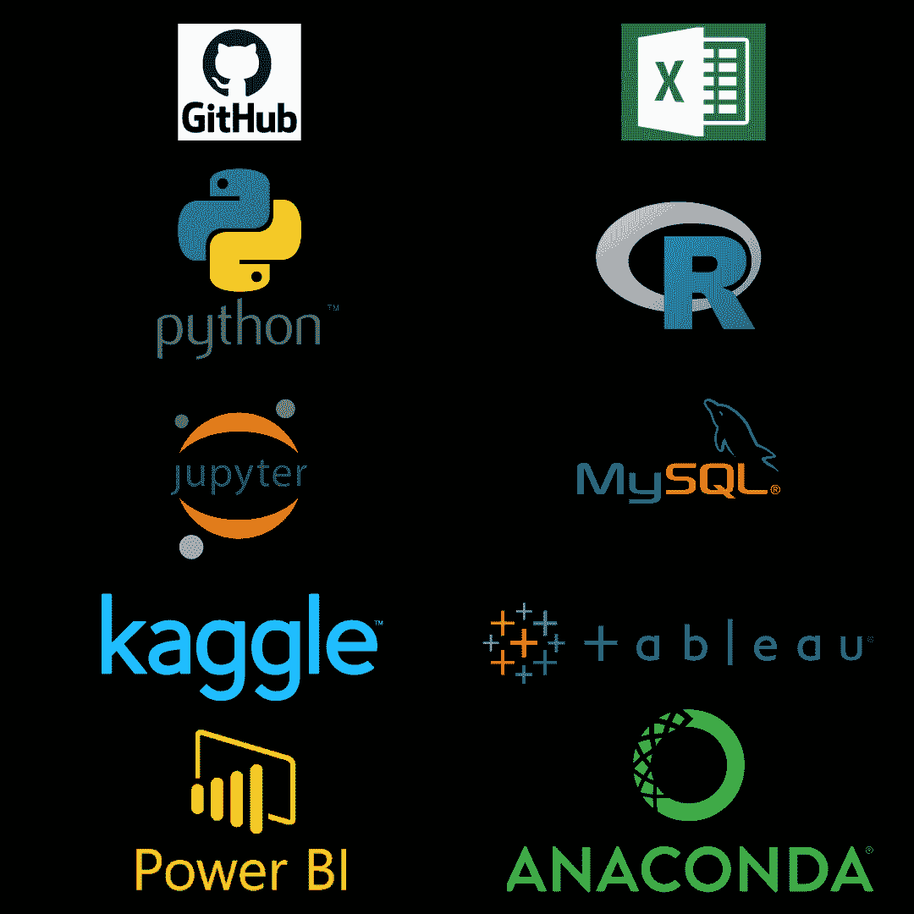

# 数据科学符合网络安全

> 原文：<https://infosecwriteups.com/data-science-meets-cyber-security-41d5f567b163?source=collection_archive---------1----------------------->

什么是数据科学？什么是网络安全？他们为什么要见面？🤔

如果你在互联网上搜索*“热门工作”*或*“最佳工作”*或*“最受欢迎的工作”*和最著名的*“最高收入的工作”*，你肯定会在结果中找到像*“数据科学家”、“道德黑客”、“机器学习/人工智能工程师”*这样的称号。但是所有这些花哨的词语是什么意思呢？让我们用简单的方式给你解释一下！

> **让我们从什么是数据科学开始？**

顾名思义，数据科学。什么样的数据？就说*各种数据*吧。您可以计数和不计数的数据，您可以看到和看不到的数据，结构化和非结构化的数据(有时两者都有)。我们如何处理这些数据？我们清理它，分析它，探索它。但是为什么呢？为什么做预测，学习模式，用最少的努力获得最酷的结果。但是不要担心，你只需要告诉*机器*如何在*数据的帮助下，通过让*人工智能*来完成所有这些任务。*

当你读到或听到“人工智能”或“机器学习”这个词的时候，我们都会想到我们超级可爱的虚拟助手 Alexa、Siri、Ok Google Assistant 等等。如果你想知道它们是如何工作的？这都是因为数据的魔力。数据的美妙之处在于，它会告诉你已经发生了什么，正在发生什么，以及可能会发生什么，从而使我们的决策和生活变得更加简单和高效。

> **一个数据科学爱好者的旅程/学习过程**

所有这些都涉及用于找出概率和进行统计分析的离散数学、用于管理重要数据的数据存储工具、用于讲故事的数据可视化工具以及主要用于编码算法文件的工具，这些工具就像是系统的功能指南。

那么在数据的编码和统计分析方面，需要成为专业人士吗？如果你从你的非离散数学或者非编码背景转向其他领域，你将如何应对？这听起来可能是陈词滥调或哲学，但答案是如果你真的享受这个过程，你可以做任何事情。就是这样。这是在没有先决背景的情况下转换任何职业的关键。

当大多数人知道数据科学涉及统计和离散数学时，他们会非常怀疑数据科学，这种感觉是完全自然的。即使是我们，但是只要你继续保持学习和创造的热情，这是 100%可能的。

在学习过程中，您必须花时间选择第一种编程语言、按照您自己的速度学习的工具、偏好以及您或您的项目将要解决的问题。

乍一看，带有花哨词汇的概念听起来很吓人，比如“概率分布”、“统计学”、“深度学习”或“大数据”，但一旦你坐下来处理它，你就会掌握它的窍门，然后你可能会喜欢它，你会知道这个领域是否适合你。

> **供您入门的热门概念和工具**

*   算法的 ***编码*** 最常见的是用 Python 完成的，更多的基于数据的文件用 r 编写
*   ***编码工具*** — Jupyter、Anaconda、R Studio、Visual Studio 代码
*   ***离散数学*** —线性代数、统计与概率
*   **数据存储&管理工具** —电子表格、MySQL
*   ***数据即。工具*** — Tableau、Looker、PowerBI
*   ***社群*** — Github、Kaggle

请继续关注最有用资源的更多信息！

> **什么是网络安全？**

点击这里，查看我们的博客！👇

[https://www . datasciencemeetscybersecurity . com/2022/02/getting-started-in-cyber-security-pros . html](https://www.datasciencemeetscybersecurity.com/2022/02/getting-started-in-cyber-security-pros.html)

> **数据科学如何满足网络安全？**

有没有想过任何公司每天要处理多少数据？他们如何保护它？当然，他们可能有一些安全计划，但是他们实际上是如何实施和执行的呢？该公司的数据规模庞大，性质复杂。

网络安全的主要目的是始终保护公司的关键信息，防止它们泄露。但是，当我们总是谈论导致大量数据泄露的网络攻击时，当攻击发生时，实际上会发生什么呢？

数据泄露给公司带来了巨大的经济损失。例如:根据 IBM Security 和 Ponemon Institute 的一份新报告，数据泄露给印度公司造成的平均损失约为 100 万₹165。这比₹140 百万在 2020 年发布的上一份报告中增长了 17.85%。

***查看更多最新的数据泄露及其给公司带来的损失:***[*https://www.upguard.com/blog/biggest-data-breaches*](https://www.upguard.com/blog/biggest-data-breaches)

> ***现在的问题是数据科学将如何帮助我们减轻这些攻击？***

当然，人工或手动操作不是一个选项，因为它会导致人为错误以及大量的时间、资源和能源消耗过程。为这些工作雇佣大量的人会带来风险，而且成本高昂。

接下来，您可能会想到一个简单的软件应用程序来提醒您这些攻击。此选项的缺点是它可能没有实时结果，导致对攻击采取行动缓慢甚至太迟。

> ***数据科学可以有效地与网络安全合作，防止或者我们也可以说消除网络攻击的存在！怎么会？***

通常黑客创建恶意软件来攻击系统，并且期望安全专业人员应该在恶意软件破坏公司数据之前检测到该恶意软件，但是通常不可能实时检测到。

但是你猜怎么着？数据科学将帮助我们做同样的事情，因为它的主要焦点是处理数据。因此，它将帮助我们分析过去已经感染系统的恶意软件的数据。通过研究来自几种恶意软件的数据，它将帮助我们检测入侵模式，黑客通常用来窃取私人信息的欺诈技术。

换句话说，数据科学将通过探索和识别黑客的可疑行为以及了解他们如何渗透系统、网络和应用程序，来帮助我们创建所有网络安全问题的实时解决方案。

**我个人最喜欢的是:**

> ***数据科学中的预测分析，帮助公司观察和整理网络流量*。**

一个应用程序通常处理两种类型的流量，即好流量和坏流量。好的流量包括安全的网络流量，而坏的流量包括恶意的流量。这种恶意流量是对危险攻击的公开邀请。不用担心，因为有了最新和先进的技术，这种糟糕的流量可以通过使用机器和深度学习算法来检测。

在预测分析的帮助下，他们使用现有的数据，并应用统计数据和算法来帮助我们更有效、更准确地预测未来的结果，以帮助公司发现未知的网络攻击或类似情况，并做好准备。

-团队数据科学符合网络安全💙❤️