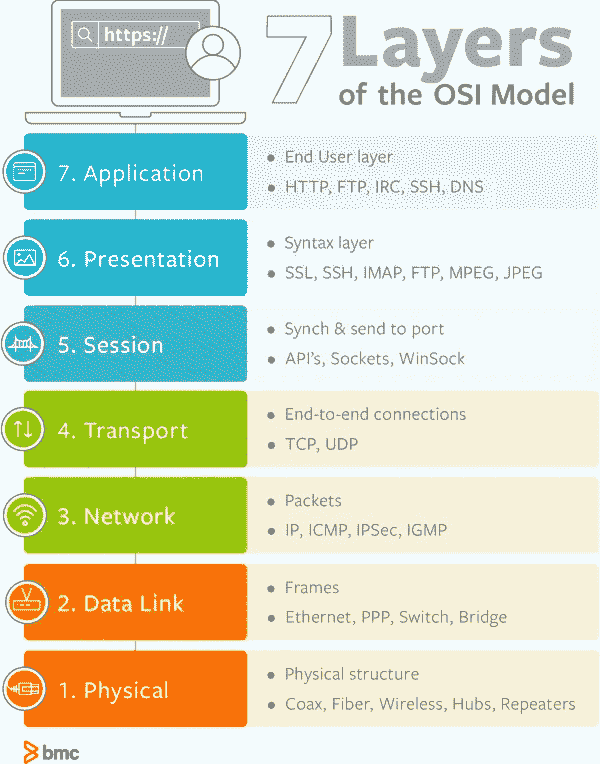
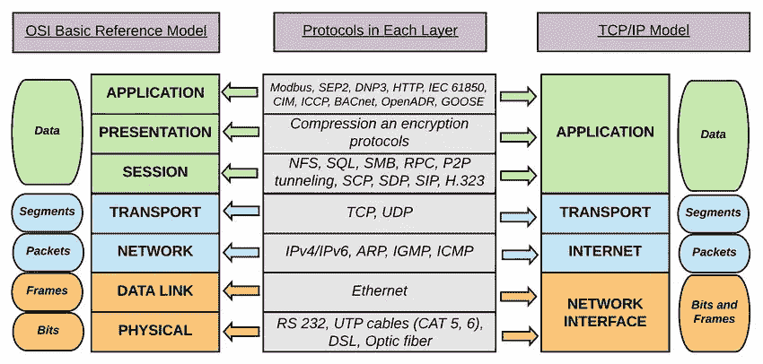

# 第 7 天 CN-OSI 模型#100DaysofHacking

> 原文：<https://infosecwriteups.com/day-7-cn-osi-model-100daysofhacking-925c9e769a7d?source=collection_archive---------2----------------------->

**Day1 :** [安装 Kali Linux](/day-1-installing-kali-linux-100daysofhacking-eeb5954e0837)

**第二天:** [导航 Linux](https://3xabyt3.medium.com/day2-navigating-linux-100daysofhacking-44130f5983bf?source=user_profile---------0-------------------------------)

**第三天:** [电脑联网](/day3-computer-networks-100daysofhacking-1f9734b80313)

**第 4 天:** [网络拓扑](/day-4-cn-network-topologies-100daysofhacking-d01377674623)

**第 5 天:** [子网划分](https://3xabyt3.medium.com/day5-cn-subnetting-100daysofhacking-893346306e0d)

**第 6 天:** [ARP 和 DHCP](https://3xabyt3.medium.com/day6-cn-arp-and-dhcp-protocol-100daysofhacking-2eae786dc97b)

**Github:**[100 天黑客](https://github.com/ayush098-hub/100DaysofHacking)

大家好，我是 Ayush，如果你还没有看过之前的博客，请点击上面的链接来阅读，在上面我们讨论了重要的概念，这是以后的博客所必需的。

到目前为止，我们已经了解了许多有关网络的概念，今天我们将讨论 OSI 模型，这是网络中非常重要的话题，让我们开始吧。

# OSI 模型:

OSI 代表开放系统互连，由 ISO(国际标准化组织)于 1984 年发布。

现在的问题是，为什么这种模型会出现，其背后的原因是在互联网出现的时候，许多供应商/公司正在为网络上的通信设备创建自己的规则，因此每个设备都没有遵循单一的规则，这就是 OSI 模型出现的原因，然后每个设备都开始使用这种模型。

所有设备都遵循这种模型在彼此之间发送和接收数据。

这个模型有 7 层，每层都添加了一些处理和一些信息，所以让我们从第一层开始。

# OSI 的 7 层:

**应用层:**

这一层是 OSI 模型中的第七层，它为最终用户提供界面，或者你可以说无论谁使用该应用程序，假设你想打开一个像 example.com/index.html 这样的网页，那么为此我们使用浏览器来打开它，所以这里我们使用图形用户界面来与特定的网页进行交互。

在这一层产生一些数据，然后将这些数据发送到下一层。

**表示层:**

这是 OSI 模型的倒数第二层，即第 6 层，在这一层中，它接收来自应用层的数据，然后对数据进行加密、格式化和压缩，并在较低层中进一步发送。

换句话说，表示层就像一个翻译器。当从应用层接收数据时，它将数据转换为可以通过网络发送或下层可以理解的格式。

**会话层:**

这是 OSI 模型的第五层，它负责维护源和目的地之间的会话。在这一层，数据的完整性得到维护。

**传输层:**

这是 OSI 模型的第四层，这一层负责将数据从源设备传送到目的设备。

在该层，源端口地址和目的端口地址被维护，并且生成的数据被称为**段。**

端口只不过是我们电脑中的一项服务，用于区分电脑上运行的不同服务/应用程序，例如，在您的电脑中，您同时打开了不同的应用程序，如 chrome、skype、youtube 等，因此您的路由器或任何连接设备将如何区分哪些数据用于哪个服务/应用程序，这就是为什么端口号对于区分不同的应用程序非常重要。有 65535 个端口。

点击此处了解更多关于端口**的信息。**

**网络层:**

这是 OSI 模型的第三层，它接收来自传输层的数据段，然后添加源 IP 和目的 IP 地址，然后生成的数据称为数据包。

添加源和目的 IP 地址也称为 IP 寻址。

**数据链路层:**

这是 OSI 模型的第二层，它从网络层接收数据包，然后在这一层接收源 mac 地址和目的 mac 地址(此处添加了直接路由器的 MAC 地址，表示最近的路由器)。)被添加，然后生成的数据被称为帧，在这一层，帧也被转换为 0 和 1。

添加源和目的 mac 地址称为 MAC 寻址。

**物理层:**

这是 OSI 模型的最后一层，负责通过介质(有线或无线)传输比特。

这都是关于 OSI 模型的，在上图中，你可以看到不同的层使用了不同的协议。

在 OSI 模型之后，还有另外一个模型，即 TCP/IP，除了应用层、数据链路层和物理层之外，所有层都是相同的。

在上图中，您可以看到数据链路和物理链路合并为一个，以上三个合并为一个。

要阅读更多关于 TCP/IP 的信息，请点击[此处](/tcp-ip-networking-model-part-2-efcc9de9ad40?source=user_profile---------7-------------------------------)。

现在我希望你对 OSI 和 TCP/IP 都很清楚。

感谢您花时间阅读本文，如果您有任何疑问，请在本博客上回复，我们将在下一篇中见面！

谢谢你，祝你黑客愉快！