# 探索 ESI 注射的世界

> 原文：<https://infosecwriteups.com/exploring-the-world-of-esi-injection-b86234e66f91?source=collection_archive---------0----------------------->

嘿，大家好，

在这篇文章中，我将分享我和我的朋友 [nytr0gen](https://twitter.com/nytr0gen_) 在一个私人 bug bounty 计划中发现的与 ESI ( ***Edge Side 包括*** )注射相关的发现。我们找到了一堆，所以请确保你一直读到最后，因为你不会错过最有趣的发现:)

如果你不知道/还没有听说过***Edge Side Include Injection，*** 我强烈建议你先阅读下面的文章，因为 Gosecure 已经做了很好的解释，你也可以查看下面的 Alex Birsan tweet，了解如何最后找到它们，但同样重要的是，你也可以观看 DEFCON 演讲:

[](https://www.gosecure.net/blog/2018/04/03/beyond-xss-edge-side-include-injection/) [## 超越 XSS:边缘方包括注射- GoSecure

### 更新:作为这篇文章的后续，一篇新的博客文章已经发表:ESI 第 2 部分:滥用特定…

www.gosecure.net](https://www.gosecure.net/blog/2018/04/03/beyond-xss-edge-side-include-injection/) [](https://www.gosecure.net/blog/2019/05/02/esi-injection-part-2-abusing-specific-implementations/) [## ESI 注入第 2 部分:滥用特定实现

### 这篇文章是对第一次 ESI 发布后发现的项目的跟进。这些发现是攻击媒介…

www.gosecure.net](https://www.gosecure.net/blog/2019/05/02/esi-injection-part-2-abusing-specific-implementations/) 

## 故事开始了

这些发现是在一个私人项目中发现的，所以我将把目标称为**redacted.com**，为了让你对这家公司有所了解，我会让你知道这是一家非常著名的体育组织。

我一直在寻找 xss 错误，很快就找到了一个端点，它允许`<>'"` 字符在响应中反射，但是我不能很容易地在那里得到 xss，因为 *Akamai WAF* 已经就位。

浏览页面源代码时，我注意到一段代码看起来有点可疑:

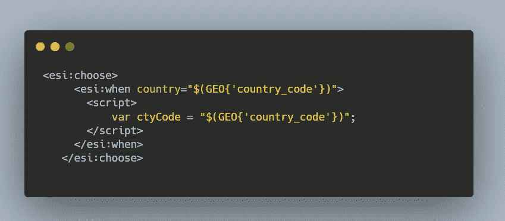

我知道 ***ESI*** 所以我开始检查*缓存服务器*是否会呈现我输入的 ESI 标签，


我使用了上面的有效载荷，它被 waf 阻止了，在进一步测试后，应用程序有了一些更严格的 waf 规则。我意识到 waf 寻找像这样的模式`<esi:placeholderhere>` ，如果它包含任何有效的 *ESI* 标签，如 include 等，就会被阻止。只使用`<esi:>` 返回 500 内部服务器错误，所以我知道缓存服务器实际上是在试图呈现 *ESI* 标签，我尝试了各种字符，如%00、%0A 等，以检查是否有任何字符允许绕过检查，但最终什么也没有。

当时我正在使用 ***打嗝 Pro 试用*** ，所以我用它扫描了这个参数，我收到了这个输出:

```
https://globe.redacted.com/?showFooter=um6k%3c!--esi--%3e8omf%3c!--esx--%3eekdi

Note: This issue was generated by the Burp extension: Active Scan++.
Issue detail
The application appears to support Edge Side Includes:  The following probe was sent: um6k<!--esi-->8omf<!--esx-->ekdi In the response, the ESI comment has been stripped: um6k8omf<!--esx-->ekdi  Refer to https://gosecure.net/2018/04/03/beyond-xss-edge-side-include-injection/ for further information
```

所以我能够使用注释标签来确认 *ESI 注射*，但是仍然不是很有用。由于我没有进一步尝试的想法，我决定继续前进。

然后，我在笔记中保存了这个端点，并继续前进，希望将来能够升级它。

几个月过去了，我收到了该公司 bbp 的一封邮件，他们发起了一个*促销活动，并为所有高/批评性的投稿支付 **2x** 。*

*看到这封邮件，我不能再在我的笔记中留下端点，我需要以某种方式升级它，无论需要什么。*

*我很确定我自己无法升级它，因为我不具备所需的技能，所以为什么不联系其他比我更有经验的人，他们能够提出绕过 waf 的解决方案。*

*该程序允许 ***在报告上与*** 合作，所以我可以直接联系`collaborator` 部门的人。*

*这个节目中有很多人，甚至一些大人物也在那里，所以在我联系了 ***nytr0gen，*** 之后，我很难决定我应该联系谁，因为我一直在玩 ctfs。他来自*沉船线* ctf 团队，相信我，ctf 球员的技能完全在不同的水平上。*

# *合作魔法⭐*

*大约在 30 分钟内，nytr0gen 提出了可用于弹出 xss 警告框的 ESI 有效载荷。*

**

*更多示例可帮助您理解如何使用 ESI 标签绕过 WAF:*

*让我解码有效载荷，让你了解实际发生了什么*

*当我第一次看到这个的时候，我被震惊了，因为我不知道你也可以在 ESI 注释标签中使用变量。*

*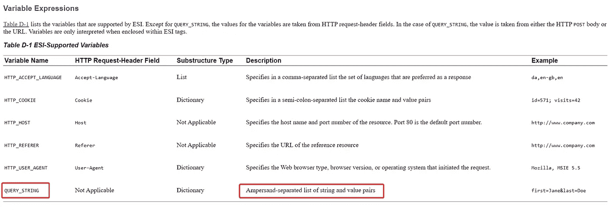*

*[https://docs . Oracle . com/CD/a 97335 _ 02/caching . 102/a 90372/ESI . htm # 633138](https://docs.oracle.com/cd/A97335_02/caching.102/a90372/esi.htm#633138)*

*当缓存服务器呈现上述有效负载时，它将在页面源上仅返回以下内容:*

**

*`$(QUERY_STRING{countryCode})` 返回了`countryCode` 参数值，ESI 标签真的非常强大，你可以用它们做很多事情。*

*另一件有趣的事情是，应用程序会话 cookie 被标记为 ***httponly*** 和 scope to `.redacted.com ,` 因为 cookie 被标记为 ***httponly*** 用普通的纯 xss 不可能窃取会话 cookie，但用 ESI 标签是可能的:)*

*我甚至问他是如何想到在 ESI 注释中使用变量的，他告诉我他只是看了文档*

 *[## 边缘侧包括(ESI)语言标签

### 本章描述了为动态片段的内容组装提供的边缘侧包含(ESI)标签。这个…

docs.oracle.com](https://docs.oracle.com/cd/B14099_19/caching.1012/b14046/esi.htm#i654520)* **

*报告中提供了一个全面的账户接管概念验证，该问题得到了*审判*，并获得了*高严重性*评级(感谢 2x 倍增器):*

**

*故事并没有在这里结束，因为 nytr0gen 发现了另一个子域，在那里他使用 ESI 标签时有 xss，它们也由缓存服务器呈现，这对我们来说是一个很好的信号，因为这可能意味着整个目标上可能仍有更多的 ESI 注入错误。*

*该应用程序对我们的输入进行了一些奇怪的大写/小写转换，因此我们无法使用任何变量，例如`HTTP_COOKIE` ，因为它被转换为大写/小写的 wierdly **http_COOKIE** ，但 nytr0gen 仍然能够再次读取文档并找到另一个有用的 ESI 函数，该函数允许解码 url 编码的字符串:*

*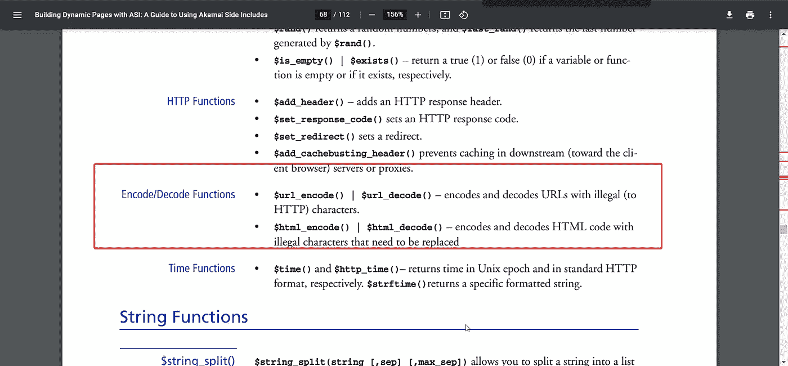*

*[https://www . akamai . com/site/zh/documents/technical-publication/akamai-ESI-developers-guide-technical-publication . pdf](https://www.akamai.com/site/zh/documents/technical-publication/akamai-esi-developers-guide-technical-publication.pdf)*

*url 对有效载荷进行了两次编码以确保 Akamai 不会阻止它，*

**

*继续，现在我通过多次阅读 nytr0gen 慢慢开始掌握这种 ESI 注射。我已经在另一个子域上找到了一个 xss，在页面源代码中没有任何 ESI 标签的迹象，但我仍然决定尝试一下`aaa<!--esi-->bbb<!--esx-->ccc ,` 使用它作为有效载荷，服务器实际上呈现了它，所以我知道 ESI 注入错误在那里使用相同的有效载荷进行帐户接管*

*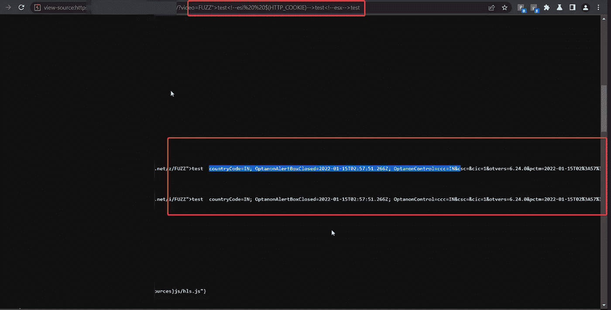*

*如果你对*账户接管概念验证*感兴趣，这里有(js 代码放在散列之后，我只是把它放在下面，使它更易读):*

*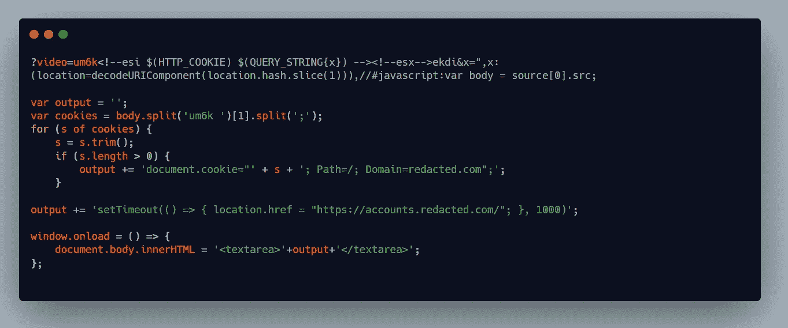*

*nytr0gen 在这里做了一项出色的工作，使得 triager 很容易使用这个概念验证来重现实际的影响。因为你们现在已经知道了`HTTP_COOKIE`和`QUERY_STRING{x}` 变量的作用，所以理解概念验证应该很容易。*

*顺便说一句，nytr0gen 在 10 个月前已经提交了这个 xss 错误，我们仍然决定报告它，因为它比普通的 xss 有更大的影响。*

**

*另一个严重程度很高的 bug，我们做得很好:)*

*让我们继续前进，即将到来的 ESI 注入错误是超级有趣的，所以抓紧你的座位，最好的还在后面。*

*几天后，nytr0gen 再次发现了另一个易受攻击的新端点。*

**

*是的，你没看错，这个端点的响应`Content-Type` 头值是`application/json`，ESI 标签仍然由缓存服务器呈现。*

*虽然可以在这里包含 ESI 标签，但是你如何能够窃取页面响应中的 cookie，因为 xss 不能与`Content-Type: application/json` 一起工作，或者是这样吗`?`*

*任何人都会在这里停下来，认为由于`Content-Type ,`你现在什么也做不了，但是当 nytr0gen 在那里掩护你的时候，你不应该担心:)*

*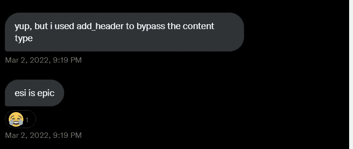*

*下面是答案使用`$add_header()` 方法你可以覆盖任何响应头。*

**

*[https://www . akamai . com/site/zh/documents/technical-publication/akamai-ESI-developers-guide-technical-publication . pdf](https://www.akamai.com/site/zh/documents/technical-publication/akamai-esi-developers-guide-technical-publication.pdf)*

*以下有效载荷会将响应`content-type` 更改为`text/html`*

**

*这是我们用来执行 js 代码的最终有效载荷，我们首先使用了`HTTP_COOKIE`，然后是`add_header`，然后是`url_decode`函数:*

**

*`HTTP_COOKIE` 变量返回响应中的 cookies，`add_header` 函数改变响应的*内容类型*，最后使用`url_decode`函数我们放置 xss 有效载荷(url 编码两次以避免 waf ),使用它我们可以窃取页面响应。*

*一只大虫子值得一大笔赏金:)*

**

*我们以为这一定是结束了，不会再有 ESI 错误了，但是我们错了……..*

# *故事继续*

*我们发现了另一个端点，它看起来像一个代理，接受一个 url 参数作为输入，然后获取该 url 的响应。*

**

*它只把一些域名列入白名单，其中一些在我们的目标 redacted.com，少数在其他第三方网站。*

*由于它的工作方式，我们开始测试 ssrf 在这里是否可行。由于它只允许向一些白名单主机发出请求，我们开始寻找这些主机中的任何开放重定向错误。*

*我们在 redacted.com 找到了一个，但是只有当用户通过认证时才有效，顺便说一句，这个开放重定向有点意思。*

*访问这个网址:[https://www.redacted.com/auth#login?url=http://evil.com](https://www.redacted.com/auth#login?url=http://evil.com)*

*它在 iframe 中加载了另一个 url，然后重定向到我们的 url，我尝试了 xss，但是没有成功，因为重定向是通过`Location`头发生的。*

**

*然后我们转移到第三方网站 xyz.com，也在白名单中，尽管我们在这些第三方网站上发现了一些 xs，但我们仍然没有发现任何对我们有用的开放重定向。*

*Ssrf 在这里看起来如此接近，但我们仍然不能做出任意的请求。*

*在摆弄这个端点时，我在 url 参数中使用了第三方站点 xss 易受攻击的端点，令人惊讶的是 xss 弹出窗口出现在 redacted.com 域的上下文中。*

*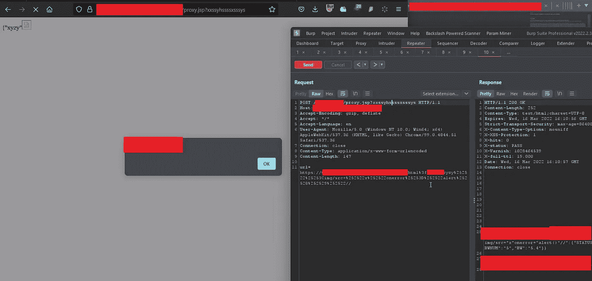*

*我们之前已经报告了该主机上的 ESI 注入，所以我只是尝试使用 ESI 有效负载，它确实有效*

*因此，通过在不同的第三方域上使用 xss，我们能够让 ESI 注入在我们的目标域上工作，我们无法获得 ssrf，因为我们在花了几天时间后没有找到任何打开的重定向，但至少我们使用 ESI 注入成功升级了此问题，因此我们报告了此问题。*

*我们还尝试了另一件事，我想我应该提一下，正如你已经知道的 ESI 的`add_header`功能，我们认为我们可以用这样的有效负载创建我们自己的开放重定向 bug:*

**

*在我们发现易受 ESI 注入攻击的任何先前端点上使用此有效负载，将为我们提供一个简单的开放式重定向。*

*它正常工作，但当我们在 ***代理*** 端点上使用这个打开的重定向 url 时，它由于某种原因无法工作，可能是 Akamai waf 或我们不知道的其他原因。*

*故事的转折来了，这个 bug 被 *h1 三元组标记为重复，*我们俩都觉得这不可能。*

*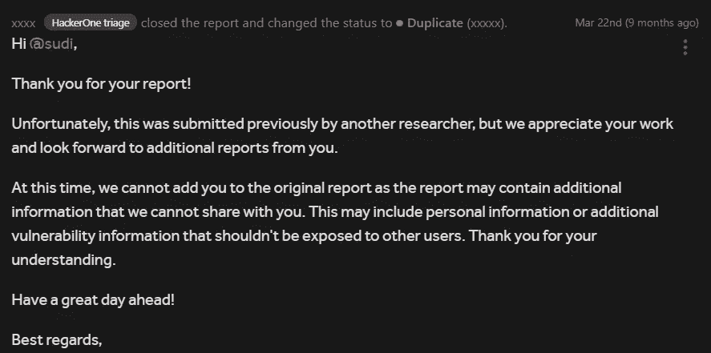*

*如果这实际上是重复的，那将意味着在这个程序中有其他人也知道这个 ESI 魔术或者将要知道？*

*在与 *h1 triager、*进一步反复后，我们了解到最初的报告者实际上能够将其升级以执行 SSRF，但显然没有 ESI 技巧。*

*我们忘记了这份报告，继续前进。很快*促销*就结束了，我们决定现在也停下来，如果将来他们做同样的 2 倍促销，我们会回头看看，我们认为这种可能性很小。*

# *又一次升职*

*4-5 个月后，他们很快再次推出相同的 2 倍乘数促销，我们准备再次搜寻那些 ESI 注入漏洞*

*我测试了一些*回调*参数，因为它们通常在响应中反映输入，并发现一些甚至允许`<>` 字符，但这些主机的缓存服务器配置不同，因此 ESI 标签不起作用。*

*一些旧的报告已经修复，nytr0gen 发现相同的 json api 端点现在可以通过不同的路径访问。为了修复最初的 json api ESI 错误，他们完全删除了端点，但是同一个端点存在于另一个路径上，所以错误仍然存在，使用了与我们能够重现错误之前相同的 poc。*

*提交它作为端点是不同的，虽然它有相同的 api，由程序分类，并再次奖励为高。*

*团队这次甚至问了我们一个关于缓解的问题:)*

**

*我要谈谈我们发现的最后一个 ESI bug，这是我们想出的最好的方法，实际上是想出一个可行的利用方法。*

*如果你在博客上呆了这么久，非常感谢，请做好准备，因为我将告诉你我们发现的最好的 ESI bug。*

*我找到了另一个端点，这个端点的`Content-Type`是`application/json`*

*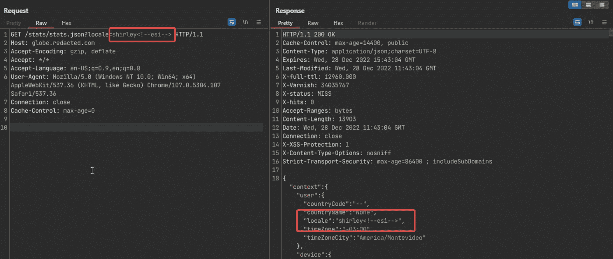*

*在上面的截图中，您可以看到 locale 参数值反映在源代码中，但是 ESI 标记没有被缓存服务器呈现。因为我们之前已经在这里发现了一个 ESI 注入错误，所以这应该是可行的。*

*我把这个网址发给了 nytr0gen，据他所说，这应该是有效的。过了一段时间，他给我发消息说他让它工作了，但是没用。*

****

*在这张屏幕截图中，您可以看到 ESI 标签起作用了，但是您能看出对此请求所做的更改吗？*

*一个训练有素的眼睛应该已经发现了编码在 url `%2e`中的 URL`.`*

**

***后端服务器**解码了 url 中的`%2e` 并返回了相同的响应，**缓存服务器**没有忽略`%2e` ，因此它不再将其视为*静态文件*，因此它允许 ESI 标签工作。*

*这是可行的，但可悲的是这是不可利用的:(*

*如果你把这个网址发给受害者，当他加载这个网址时。浏览器将自动解码`%2e` ，因此请求被发送到原始端点，而不是我们想要的端点，因此 ESI 标签不会被呈现。*

*我们在这上面花了更多的时间，但是无法解决如何让它在浏览器上也能工作。*

*离开了这个端点，转而寻找更多的端点进行测试。*

*整整一个月过去了，我在测试另一个程序，在那里我有一个潜在的客户端路径遍历错误，例如假设在下面的 js 代码中，你可以控制`key` 变量。*

*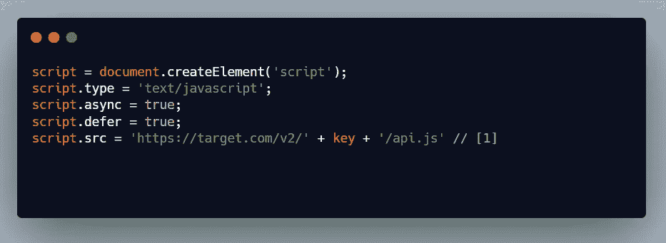*

*在同一个主机上还有一个 jsonp 回调端点，所以我试图加载它而不是`/api.js` 文件，这将允许我弹出一个警告*

**

*我试图做类似的事情，但是`key` 变量值取自查询参数，所以我不能使用`#` 符号。*

*就好像我把这个`#` 放在参数值里，它会被浏览器消耗掉，不会在`key` 变量值里被传递下去。*

*如果我 urlencode %23 它，那么浏览器在获取 js 文件时不会自动解码它，所以我被困在这里。由于这部分代码，我也不能用`?` 来忽略`/api.js`部分。*

**

*在`getAllUrlParams` 方法里面注意到了的第一行`url.split('?')[1] ,` 那么如果我用？在我的 url 参数值中会发生这种情况*

**

*由于 split 方法，`?` 将被完全忽略。*

*当时我想，如果我在 iframe 中加载编码为#的 url，可能会成功。但遗憾的是，这并没有奏效。*

*我也想过在*修订的目标*上使用同样的想法，如果你不是急性子，记得这个端点吗？*

**

*如果我在 iframe 中加载这个 url 会怎样？让我们找出答案*

*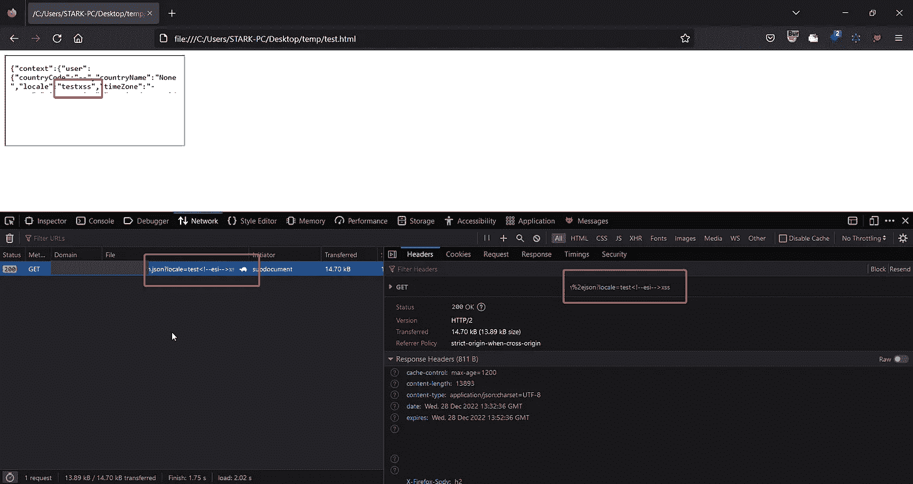***

*它确实起作用了:)*

*当我试图在 Chrome 浏览器中加载相同的代码时，它不起作用:(*

*`%2e` 被 Chrome 自动解码*

*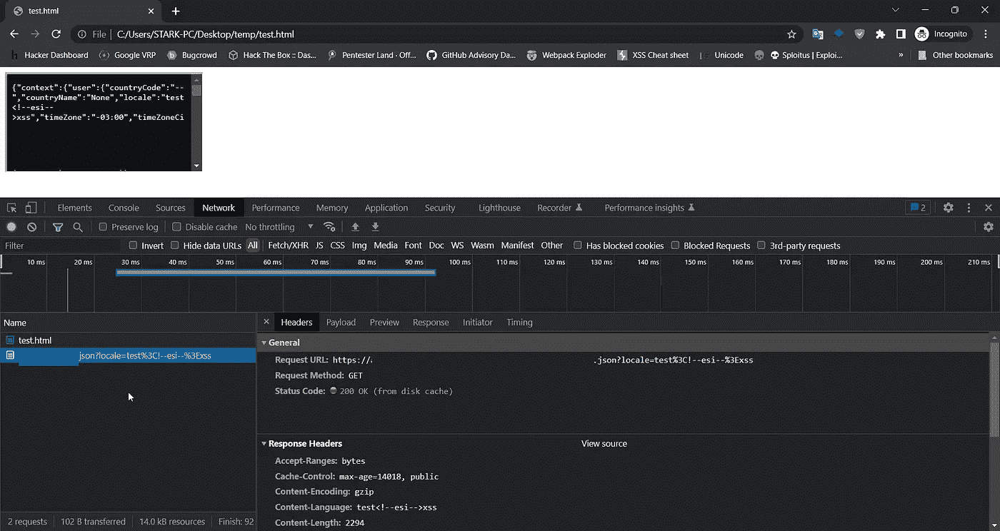*

*奇怪的是，这在 Firefox 中有效，但在 Chrome 中无效，我后来证实它在 Safari 中也和 Firefox 一样有效。*

*我很高兴它终于起作用了，我很快联系了 nytr0gen 告诉他这个好消息*

*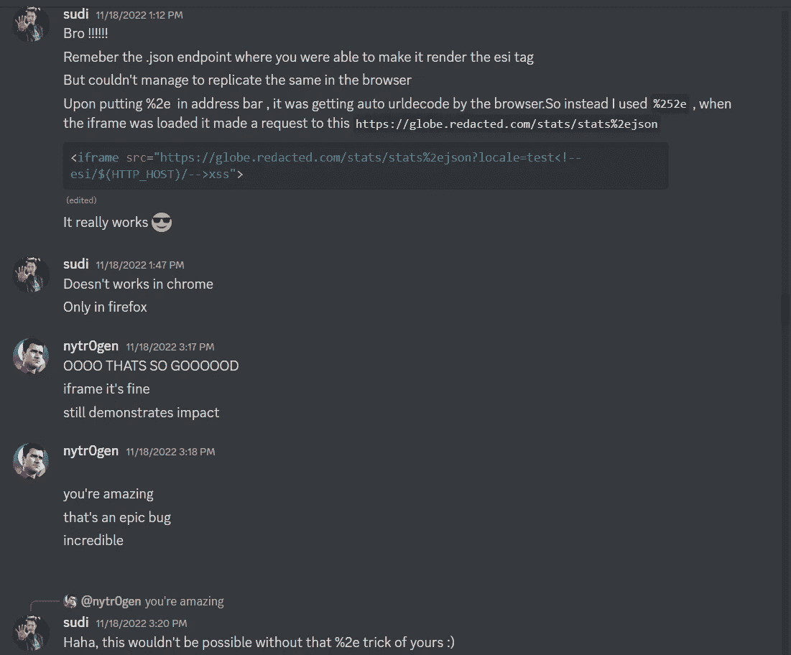*

*现在到了 POC 部分，当我使用`HTTP_COOKIE ,` 时，我注意到所有的 cookies 都不存在，主要是用于会话目的的那个。我询问了 ntr0gen，结果发现这是因为页面被加载到 iframe 中，而父页面来自不同的地方。*

*因此，我们使用了另一个 xss(使用我们的旧 ESI 注入 bug 创建的),并用它来 iframe 这个`.json` url，瞧，这一次 cookie 出现了。*

*当我尝试使用`add_header` 方法将`application/json`内容类型更改为`text/html` 时，waf 阻塞了请求，缩短后我发现 waf 现在阻塞了`text/html`关键字。这个额外的规则可能是从我们之前的报告中设置的，所以我需要创建一个旁路。*

*经过模糊处理，我发现`%09` 标签字符(`\t`)被服务器转换成了`t` 。通过使用下面的有效载荷，可以改变`Content-Type`，然后使用 xss 窃取会话 cookie。*

****

*这并没有得到 2 倍的回报，因为我们发现错误的资产不属于推广的一部分，我们同意它，因为他们仍然支付了高严重性，即使它只在 Firefox 中工作，而不是在 Chrome 中。*

*最后这里发生了另一件事，项目经理要求我们停止进一步测试 ESI 注入错误，因为他们正在微调他们的 WAF。*

**

*我们终于结束了，我希望你没有感到无聊，并喜欢阅读:)这就是全部，非常感谢你一直读到最后。希望你会喜欢它。*

*祝 2023 年好运*

*大家好*