# 从内存中提取打包程序注入的恶意软件[Remcos RAT]

> 原文：<https://infosecwriteups.com/extracting-packer-injected-malware-from-memory-remcos-rat-aa87cb224b70?source=collection_archive---------2----------------------->

从 windows 动态内存中提取注入的恶意 PE(Remcos 恶意软件)

# 背景

通常，恶意软件由一些打包程序打包，这些打包程序会混淆原始代码，并帮助它逃避反病毒软件或一般人类的怀疑。执行打包的二进制文件时，将实际的二进制文件注入内存，并从那里运行它。

# 我们将在这篇文章中讨论什么？

1.  在打包的二进制文件中设置断点以阻止恶意代码注入和执行的方法。
2.  绕过恶意软件的*“调试器绕过技巧”*
3.  从内存中定位并转储注入的代码。
4.  进行必要的修补。

设置环境:

> ***操作系统*** *: Windows 10，企业评测 180914* ***软件 _ 武器库*** *: x32debugger，PE bear，十六进制编辑器 HxD* ***恶意软件 _ 二进制*** *: Remcos*

# 什么是雷姆科斯鼠？

给你—

 [## 木马。雷姆科斯

### 木马。Remcos 通常通过在 Office 文档中嵌入特制的设置文件来感染系统，这…

blog.malwarebytes.com](https://blog.malwarebytes.com/detections/trojan-remcos/) 

## 想跟进这篇文章吗？

这是你的恶意软件，小心处理。

https://malshare.com/sample.php?action=detail&hash = 15 FD C5 c 025 e 9d 1645 df 07110 c 455 aa 09

# 实验室设置和初始检查

我们将使用我们的 Windows 10 虚拟机。我们将网络设置为“仅主机”,通过 Python 的 SimpleHTTPServer 将二进制文件传输到 VM。

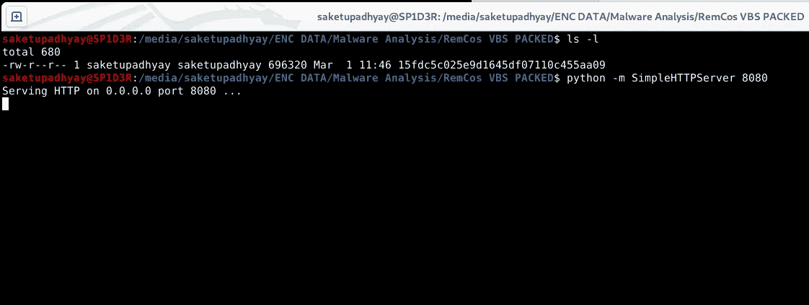

主机中的 python 服务器

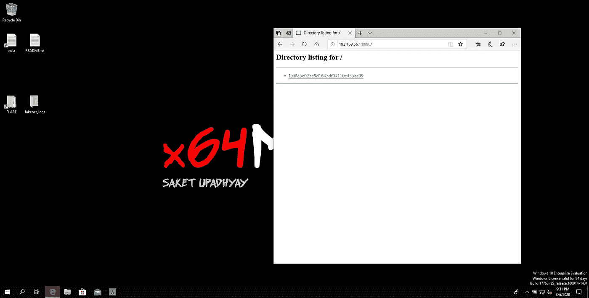

正在虚拟机中下载二进制文件

现在我们有了我们的二进制文件，在开始之前，我们将 ***关闭 VM*** 中的网络和文件夹共享，以防止出现混乱。

将二进制文件重命名为 RemCOS.bin

让我们将我们的二进制文件重命名为 *RemCOS.bin* 并用 PE Bear 开始调查。

MSVBVM60。DLL 指向 VisualBasic6 代码

二进制文件似乎是 VB6 打包程序。让我们启动 x32debugger 并在其中加载我们的二进制文件。

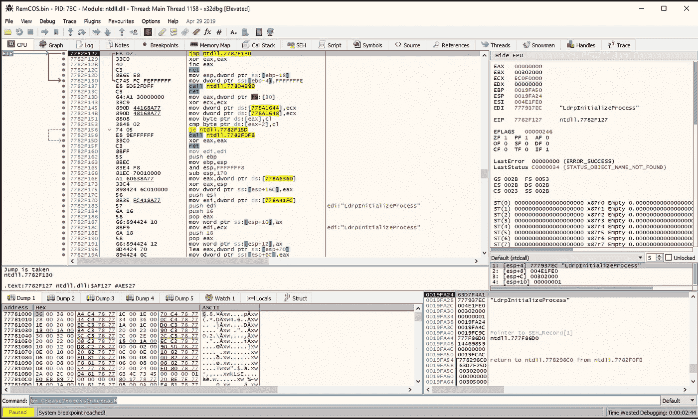

x32 调试器中的 RemCOS.bin

# 在 CreateProcessInternalW 设置断点

什么是 CreateProcessInternalW？给你-

 [## 通过 API 执行

### 对手工具可能直接使用 Windows 应用程序编程接口(API)来执行二进制文件。功能…

attack.mitre.org](https://attack.mitre.org/techniques/T1106/) 

src:[https://www . geoffchappell . com/studies/windows/win32/kernel 32/API/index . htm](https://www.geoffchappell.com/studies/windows/win32/kernel32/api/index.htm)

这个 API 调用允许程序从自身产生一个新的进程，通常打包程序使用这种方法在内存中注入实际的恶意代码，并使用 CreateProcessInternalW 执行它们。

没有更多的延迟，让我们在这里创建一个断点。类型:

***BP CreateProcessInternalW***

在 cmd 中。部分，然后按 enter 键。

# 绕过调试器检测

当我们继续执行二进制文件时，我们偶然发现了一个有趣的异常。这可能是一种反调试器策略，或者只是某个 VB6 APIs 的随机异常。不管怎样，这阻碍了我们达到预期的转折点。

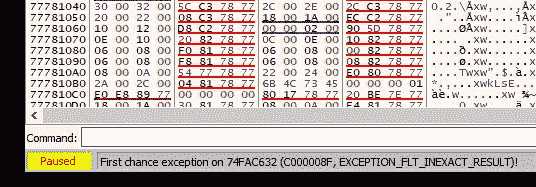

要绕过这一点，请执行 ***调试>高级>运行(通过异常)***

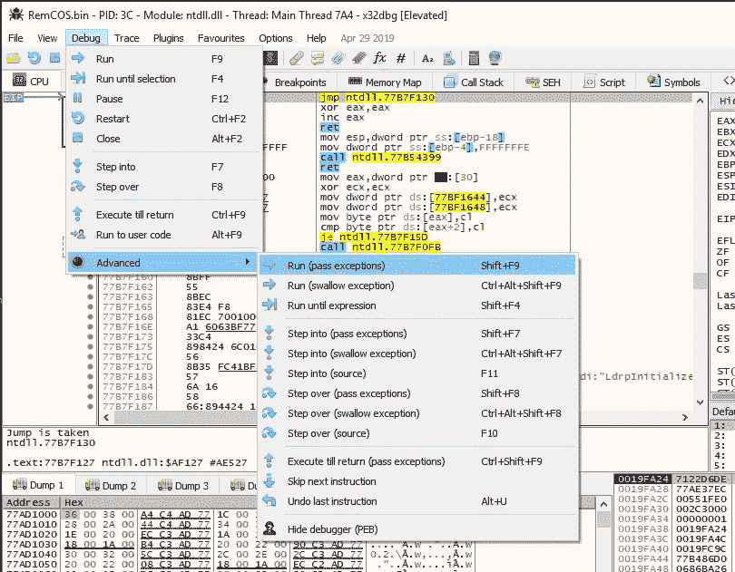

将所有异常传递给二进制文件，这样调试器就不会反击它

这将把所有异常传递给程序，就像在正常执行中一样。现在我们可以打出断点了:

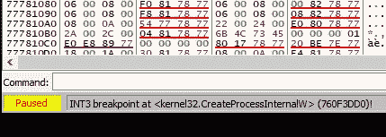

活动断点@ CreateProcessInternalW

# 查找和转储注入的代码

我们现在知道它试图从记忆中运行一些东西，我们需要找到它是什么。

对于 goto ***存储器映射*** 。众所周知，大多数可移植的可执行文件(PE 文件)都有一个 DOS 头文件，上面写着类似*“这个程序不能在 DOS 模式下运行”*之类的内容。我们可以尝试在内存映射中搜索这个字符串，看看会得到什么。

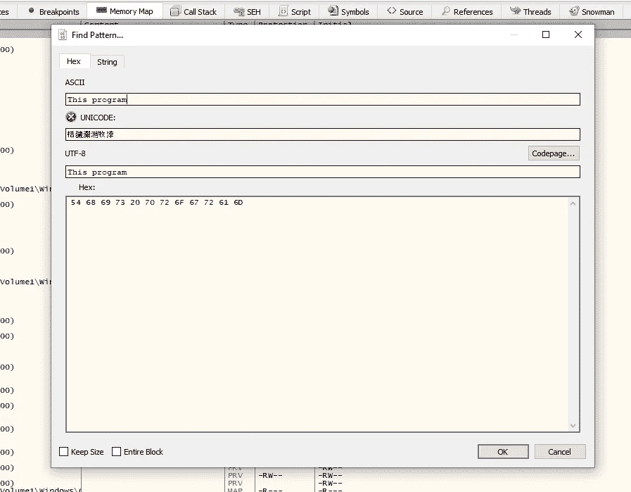

搜索后，我们找到了以下匹配项:

现在我们需要找到我们注入的代码，但是这里有一个障碍:任何包含我们的字符串“This program ..”的文件将被列出，包括大部分微软自己的 dll 和支持库。

# 查找注入的可执行代码

现在，我们必须跟踪每一次点击，以检查它是否是我们正在寻找的代码或其他东西。

从所有列出的条目中选择一个: ***跟随转储>跟随内存映射***

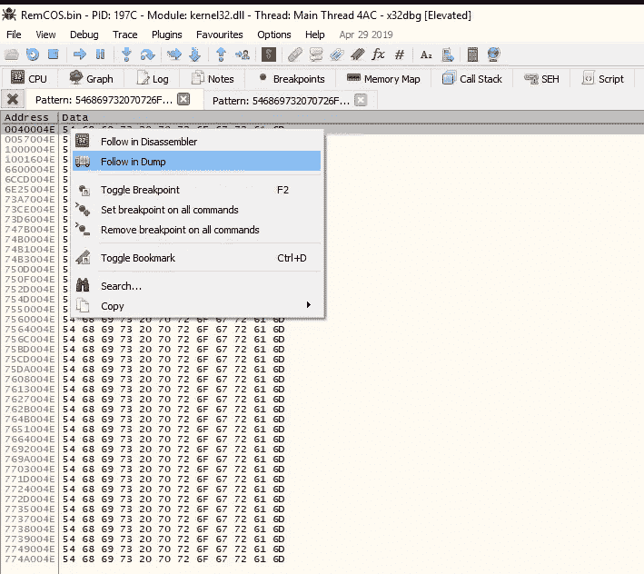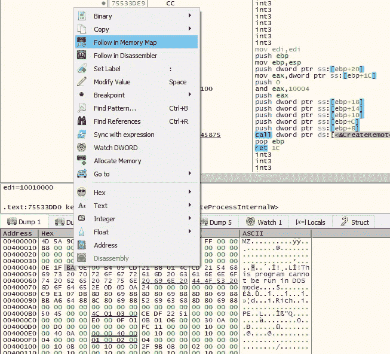

你会知道什么时候你会发现一些不寻常的东西，比如:*内存中的未命名段*带有 **R** ead **W** rite 和**E**x 可执行权限。

可疑的内存注入

选择**和*将内存转储到*文件中**

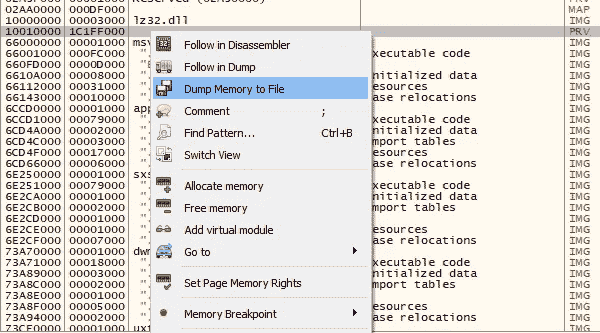

转储到文件以供进一步分析

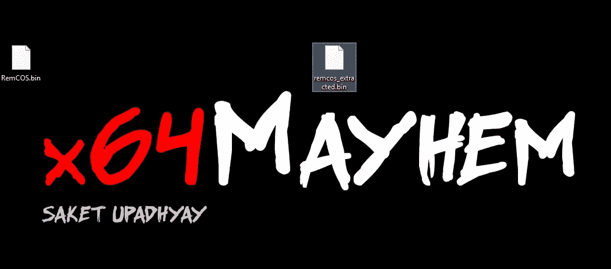

我们将其命名为“ *remcos_extracted.bin* ”，让我们用 PE Bear 测试一下，确保它被注入了可执行文件:

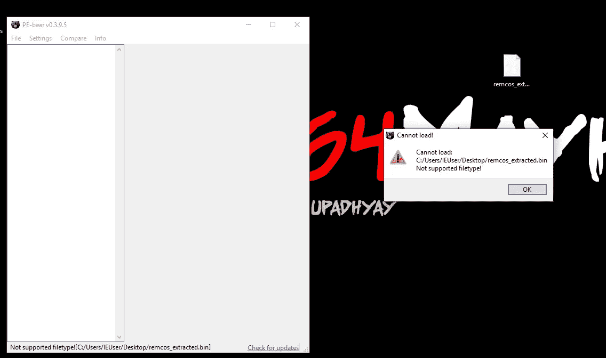

嗯……现在怎么办？但是我们找到了我们的 DOS 头文件，没事吧？

让我们在十六进制编辑器中检查文件

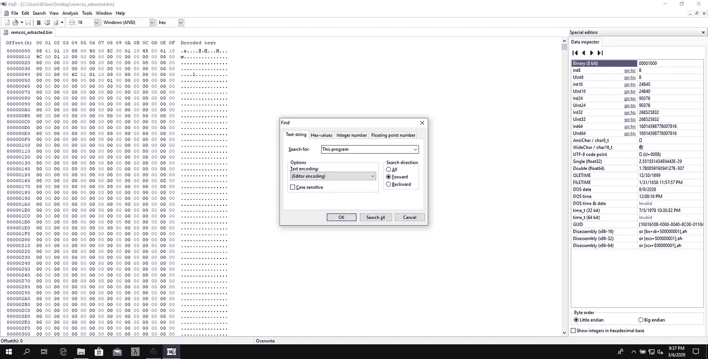

我们有了 DOS 头文件…然后呢？PE 熊为什么不行？

这是因为文件签名或幻数不存在！！记住 PE 文件以 ***MZ 开头。*** “表头？

# 修复提取的二进制文件[标头签名修复]

现在我们知道丢失了什么，让我们通过将丢失的头放在适当的位置来修复二进制文件。但是放在哪里呢？

让我们来检查列表方法:

1.  MZ 标题通常与起始偏移量对齐。
2.  DOS 报头前约 60 字节

[PE 格式:https://i.stack.imgur.com/0DdKh.png](https://i.stack.imgur.com/0DdKh.png)

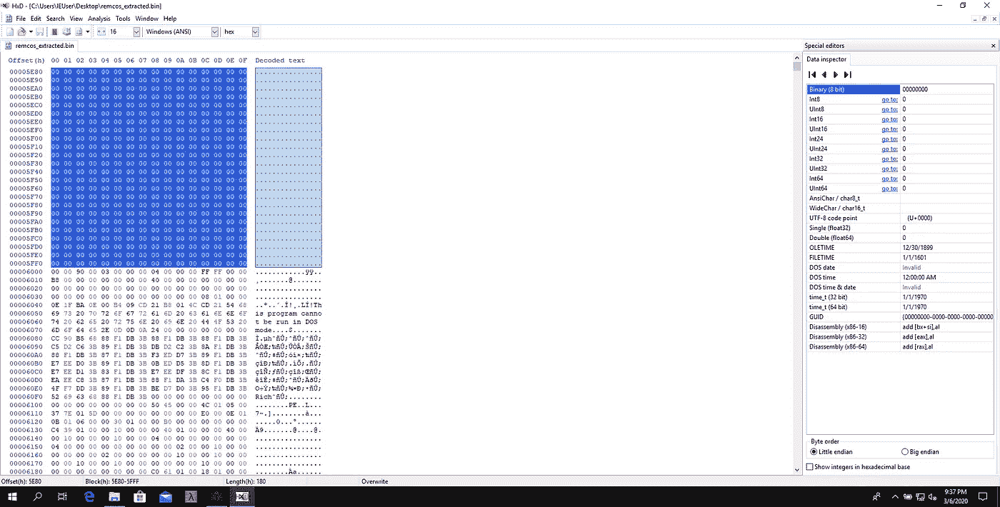

因此，让我们清除 0x000600 之前的所有零填充，因为这似乎是我们签名的好地方，符合我们的清单。

清除上面所有的填充，将前 2 个字节修改为***4D 5A*T3【十六进制】为**T5【MZ】T6**。**

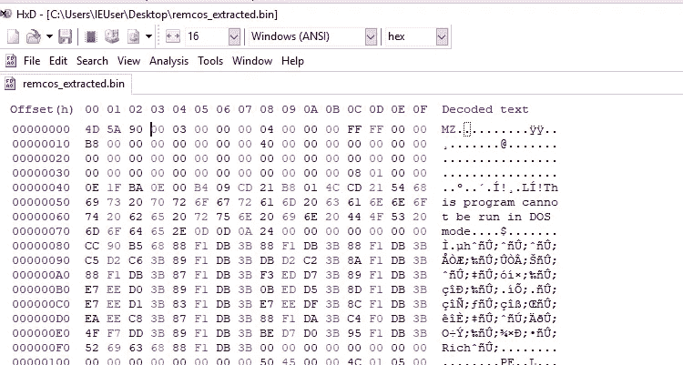

保存文件，然后…现在让我们在 PE BEAR 中检查一下

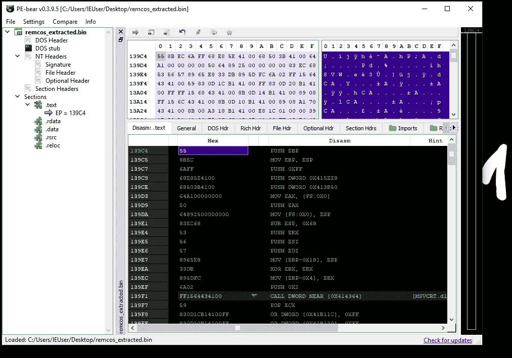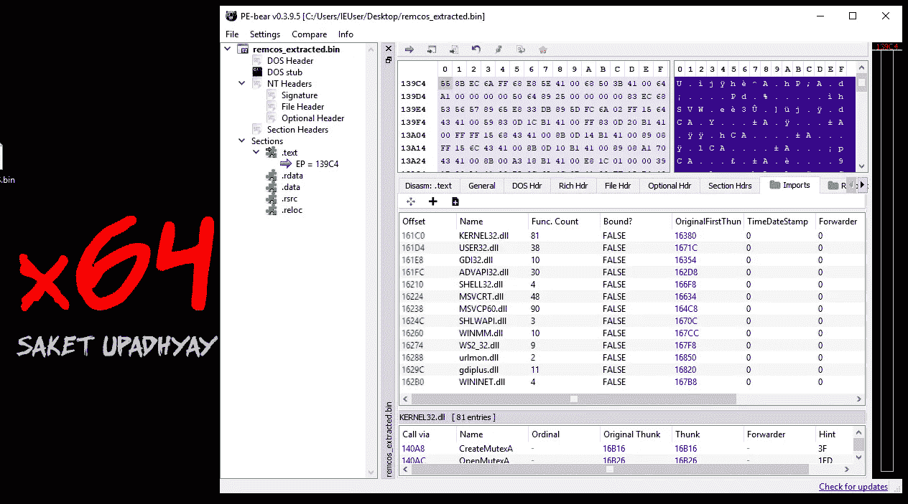

酷！一切都很好。

我们的内存被恶意软件公开注入！

现在，我们可以启动 IDA 或其他什么东西来进一步分析提取的恶意软件。

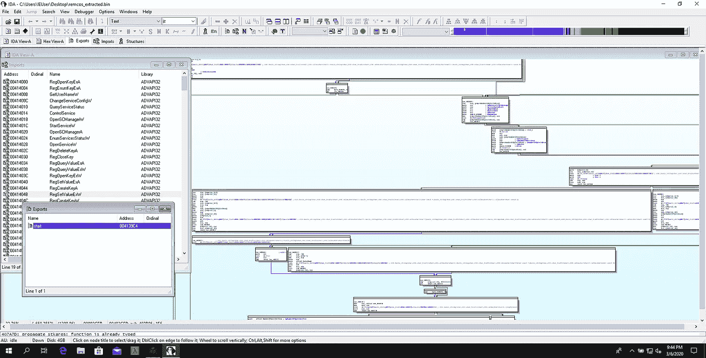

但是我们将在另一篇文章中讨论这个问题，(因为你当然可以看到 IDA 对这只老鼠有多兴奋)清除所有这些疯狂的调用图将需要更多的空间和时间。

# 结论

希望这个能对某个人有用。这对我来说真是太酷了。

我最近在玩 windows 内存，以后会分享更多。在那之前…保持足够的咖啡因含量，继续在 windows 的*记忆通道中漫游。*

# 参考

这是一个来自 OA 实验室的很棒的视频，它激励我写这篇文章。+其他资源，继续撰写本文。

 [## 寻找注入内存的代码——依靠安全性

### 在我们继续动手进行内存取证练习之前，最好先复习一些关于内存如何…

countuponsecurity.com](https://countuponsecurity.com/tag/finding-injected-code-into-memory/)  [## 新的代码注入方法将所有版本的 Windows 暴露在网络攻击之下

### 研究人员披露了一种针对微软视窗操作系统的新攻击，这种攻击可以被用来注入…

www.zdnet.com](https://www.zdnet.com/article/code-injection-exposes-all-versions-of-windows-to-cyberattack/)