# 寻找 CDNs 背后的原创 IP

> 原文：<https://infosecwriteups.com/finding-the-origin-ip-behind-cdns-37cd18d5275?source=collection_archive---------0----------------------->


大家好，我是 [HolyBugx](https://medium.com/u/f885392a99e7) 我在[这条推文](https://twitter.com/HolyBugx/status/1343156549162852352?s=20)之后开始写这个，因为我看到许多感兴趣的人希望我这样做，所以我决定与你们分享我的知识。最初的帖子在 [ZDresearch](https://zdresearch.com/finding-the-origin-ip-behind-cdns/) 上，但我也在这里分享了它。没有进一步的解释，让我们进入正题。

# 什么是 CDN？


内容交付网络

CDN 允许快速传输加载互联网内容所需的资产，包括 HTML 页面、Javascript 文件、样式表、图像和视频。CDN 服务越来越受欢迎，如今大部分网络流量都是通过 CDN 提供的，包括来自脸书、网飞和亚马逊等主要网站的流量。

# 为什么网站需要 CDN？


在使用 CDN 之前

性能很重要，如果网站不使用 CDN，所有用户应该将他们的请求发送到一个服务器，因为这将增加服务器的负载，降低网站的性能。现在大多数网站使用 CDN，因为这将有助于他们有一个更好的加载速度，降低带宽成本，提高安全性等。
cdn 还为不同类型的企业和组织提供了许多具体优势，例如:

*   电子商务
*   政府
*   金融
*   媒体/出版
*   移动应用
*   技术和 SaaS

# 使用 CDN 有什么好处？

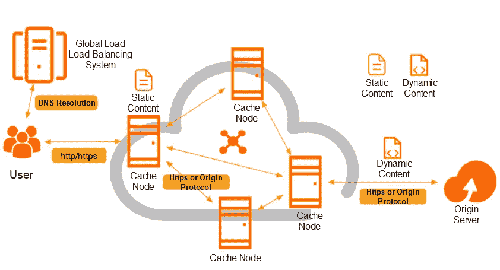

CDNs 工作流

1.  提高网站速度和加载时间。
2.  降低带宽成本。
3.  提高网站安全性。
4.  SEO 优势
5.  流量峰值和可扩展性
6.  更高的转化率
7.  可靠性
8.  等等。

因此，如果你想有一个性能良好的可靠网站，你应该考虑使用 CDN。

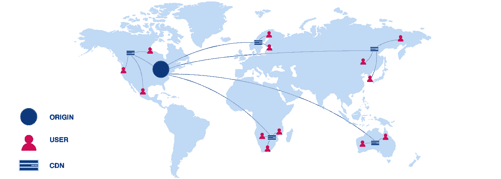

使用 CDN 后

使用 CDN 后，所有请求网站内容的用户都将从最近的 CDN 服务器获得其缓存版本，因此内容加载速度会更快，网站的性能也会提高。

# CDN 反向代理


反向代理

反向代理是一种服务器，它接收客户端请求并将其转发到后端服务器。它是客户端和源服务器之间的中间服务器。CDN 反向代理通过缓存从源服务器返回到客户端的响应，将这一概念向前推进了一步。因此，CDN 的服务器能够更快地将资产交付给附近的访问者。这种方法也是可取的，原因如下:

*   负载平衡和可伸缩性
*   提高网站安全性

# CDN 安全和 WAFs

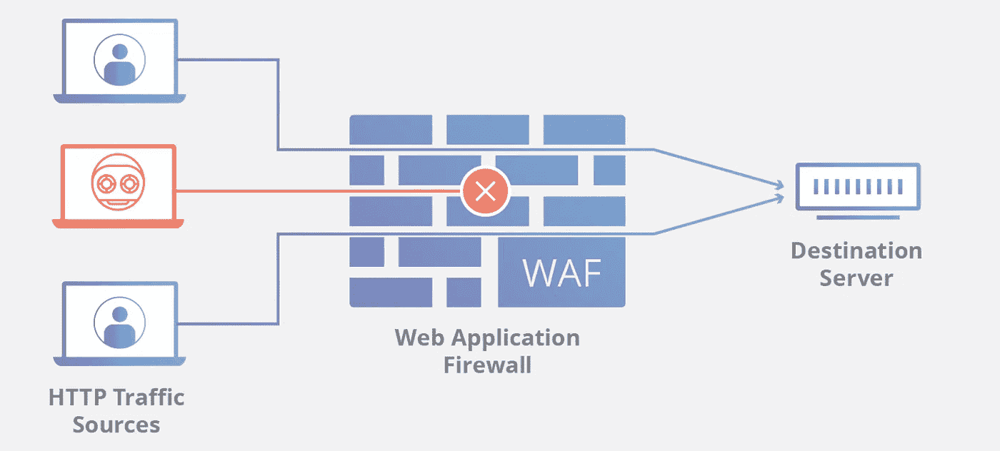

WAFs 解释道

cdn 本身不能阻止坏的僵尸程序感染网站，cdn 本身是脆弱的，这就是为什么你需要使用 WAF。
一个 [WAF](https://www.cloudflare.com/en-gb/learning/ddos/glossary/web-application-firewall-waf/) 或 [web 应用防火墙](https://www.cloudflare.com/en-gb/learning/ddos/glossary/web-application-firewall-waf/)通过过滤和监控 Web 应用与互联网之间的 HTTP 流量来帮助保护 Web 应用。
它通常保护 web 应用程序免受诸如跨站脚本(XSS)、文件包含和 SQL 注入等攻击。

# 网站来源 IP

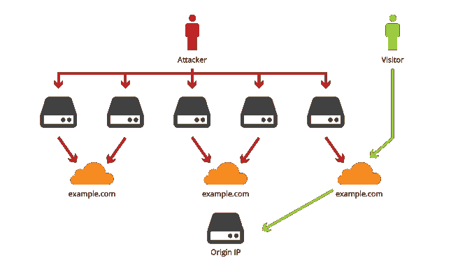

一个使用 CDN 隐藏原始 IP 的安全网站

许多网站使用上述保护措施来隐藏其原始 IP 地址，以防止攻击者进行 DDoS 攻击和其他恶意攻击。这些网站大多使用基于云的安全、代理或基于 DNS 的服务，这使得找到原始 IP 有点棘手。

# 为什么我们需要一个网站的起源 IP？

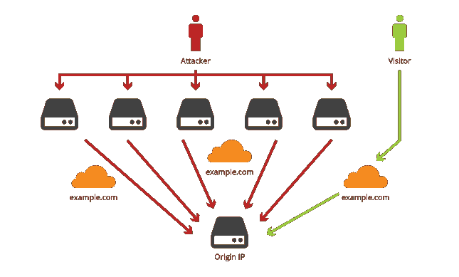

不安全网站泄露了其原始 IP

答案非常简单明了；一旦你有了一个网站的原始 IP，你就可以绕过 CDN 提供的所有保护。

# 如何找到一个网站的 IP 地址？

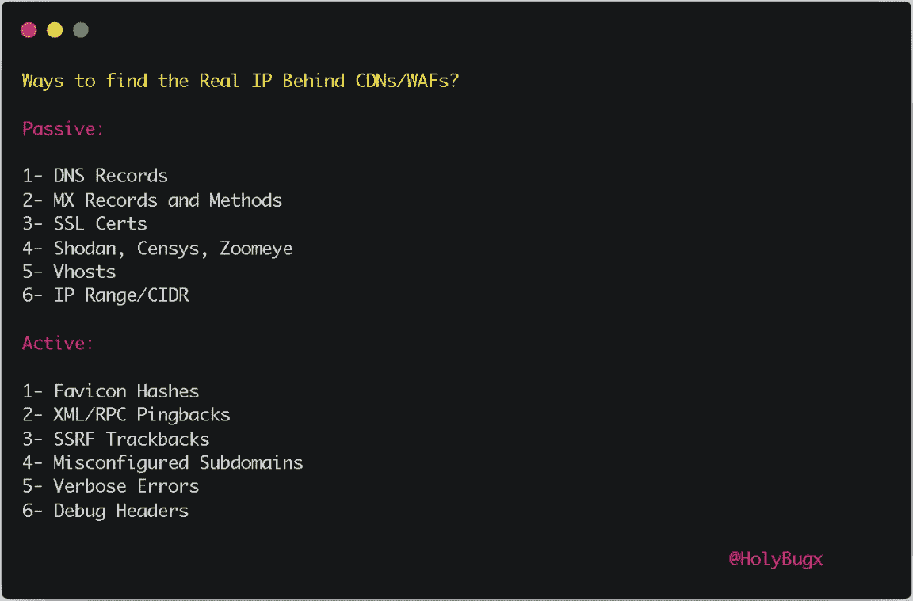

[https://twitter.com/HolyBugx/status/1343156549162852352?s=20](https://twitter.com/HolyBugx/status/1343156549162852352?s=20)

正如我在 Twitter 上提到的，有几种方法可以找到 CDN/WAF 背后的原始 IP。我们将讨论作为攻击者可以使用的各种方法。

# 逆向工程


每当你想绕过一些东西，把自己放在对手的位置，逆向工程你的思维过程，作为一个蓝色的团队思考，并试图找出他们的安全实施！

# 蓝色队员提供的保护


以下是 CDN 提供商/蓝色团队隐藏其网站原始 IP 的常见做法:

*   **保持所有子域在同一个 CDN 上**

与根域相比，使用其他子域，他们有更高的成功机会，因为他们可能提供可能导致信息泄露漏洞的文件，从而泄露原始 IP。

*   **不基于用户动作发起出站连接**

如果我们能让网络服务器连接到一个任意的地址，我们就能发现原始 IP 地址。像“从 URL 上传”这样允许用户从给定 URL 上传照片的功能应该进行配置，以便进行下载的服务器不是网站源服务器。这一点很重要，因为如果攻击者可以选择输入的 URL，他们就可以专门建立一个网站来监控谁连接到该网站，或者使用公共服务来监控与唯一 URL 联系的 IP。

*   **在配置 CDN 时更改其原始 IP**

DNS 记录是许多历史记录存档的地方。这些历史 DNS 记录将包含使用 CDN 的网站原始 IP。

*   **限制使用 IP** **地址**直接访问网站

另一个有趣的选择是，防御者可以限制试图使用 IP 地址访问网站的用户，这样网站只有在提供了域名的情况下才会加载。让我们探索一下如何在 Nginx 上做到这一点

为了禁用/阻止端口 80 对 IP 的直接访问，我们创建了一个新的服务器配置，如下所示:

```
server {
 listen 80 default_server;
 server_name _;
 return 404;
}
```

为了禁用/阻止端口 443 对 IP 的直接访问，我们在一个服务器配置块中使用了以下内容:

```
if ($host != "example.com") {
 return 404;
}
```

示例:

```
server {
 listen 443 ssl;
 server_name example.com

 ssl_certificate /etc/nginx/ssl/example.com.crt;
 ssl_certificate_key /etc/nginx/ssl/example.com.key;

 if ($host != "example.com") {
  return 404;
 }
}
```

这将阻止到 [https://YOUR_IP_ADDRESS](https://your_ip_address/) 的所有流量

我们将讨论使用一种有趣的方法绕过这个限制。

*   **白名单**

仅允许来自 CDN 的请求的一种可能的解决方案是简单地将 CDN 列入白名单，因为这种方法可能看起来很有前途，并且足以让防御者隐藏他们的原始服务器，这在实践中相当具有挑战性，因为他们只有 3 种方法，并且其中只有一种可行:

**选项 A:将 IP 地址列入白名单**

将 IP 地址列入白名单的问题是，它们必须拥有所有可能访问其来源的 CDN 边缘服务器的 IP 地址。
这个有点问题。许多 cdn 不给出它们的 IP 地址列表，并且即使它们给出了，它们也可能添加一个 IP 地址或者甚至改变它而忘记通知它们。这些白名单需要定期更新，以免破坏网站。

**选项 B:将请求中的唯一标识符列入白名单**

这个想法很简单。CDN 将在其请求中向源服务器发送唯一标识符，源服务器可以使用该标识符在源服务器上识别 CDN 并允许其请求。然而，这种方法不是完全万无一失的。攻击者也可以自由设置请求。也就是说，如果我们知道他们使用的 CDN 提供商，并且我们也知道 CDN 提供商如何向原始服务器标识自己。如果攻击者掌握了这些信息，他们可以很容易地欺骗请求。

**选项 C:不可访问的原始主机名**

对于防御者来说，这可能是最可靠的解决方案，因为如果攻击者试图访问 Web 服务器，他们将无法找到它。防御者创建一些随机的、长的字母数字字符集，并将它们用作子域。例如，如果他们的域名是“HolyBugx.com ”,那么他们设置一个类似“2547d0jeid15ma”的子域名。HolyBugx.com”。
那么这个主机名只有他们和他们的 CDN 提供商知道，他们可以将具有这个主机名的请求列入白名单。

# 结论


防御者思维导图

# 回到进攻方


我们只是对试图保护其原始网站的防御方的观点有一个基本的了解，知道了这些信息，我们就有了我们将要做什么的思维导图，在我们的思考过程中，我们试图绕过这些限制，找到网络服务器的原始 IP。

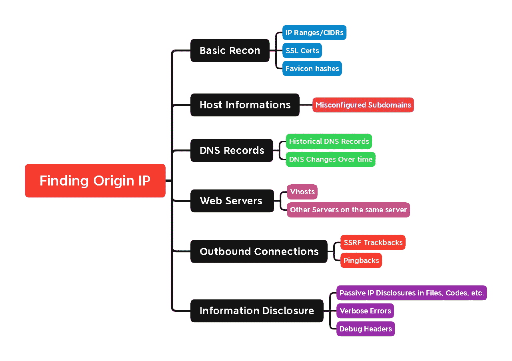

攻击者思维导图

上面是一个简单的思维导图，告诉我们在测试网站的原始 IP 泄漏时应该做些什么，让我们深入研究一下。

# 侦察


最重要的部分是做一些基本的侦察，以获得尽可能多的信息。我们的想法是找到有用的信息，例如:

*   IP 范围/CIDR
*   主机相关信息
*   DNS 记录
*   Web 服务器
*   虚拟主机
*   与 Web 服务器在同一服务器上的托管服务器(如邮件服务器)
*   信息泄露漏洞

# 关于 DNS 记录的所有信息


DNS 记录

DNS 记录是许多历史记录存档的地方。这些历史 DNS 记录可能包含使用 CDN 的网站原始 IP。正如我之前提到的，一些网站可能有错误配置的 DNS 记录，我们可以从中收集有用的信息。

## **1-安全轨道**

[SecurityTrails](https://securitytrails.com/) 使您能够探索任何互联网资产的完整当前和历史数据。IP & DNS 历史、域、SSL 和开放端口智能。

我们将对我们的目标执行一个简单的查询，以查看其历史数据，特别是 DNS 记录，因为它让您可以找到 A、AAAA、MX、NS、SOA 和 TXT 记录的当前和历史数据。
当网站直接在服务器的 IP 上运行，后来转移到 CDN 时，这可以方便地找到真正的服务器 IP。


然后，我们将点击“历史数据”,查看有关我们目标的有用信息。

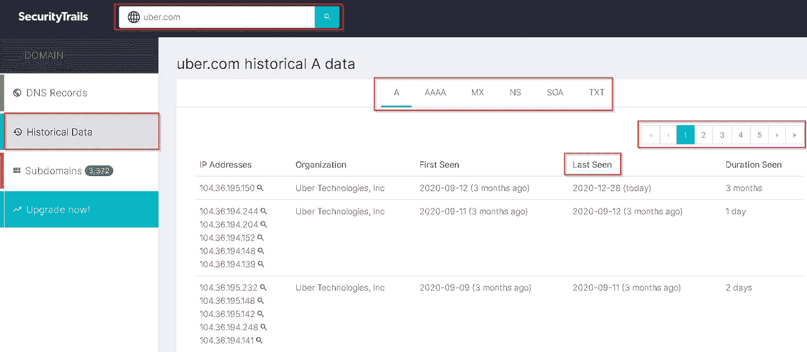

任何 DNS 记录都不应该包含任何原始 IP，仔细查看任何 SPF 和 TXT 记录，以确保它们是否包含任何有关原始 IP 的信息。指向源服务器的简单的 A、AAA、CNAME 或 MX 记录将暴露源 IP。

## 2-挖掘

您可以使用 dig 为您做一些简单的查询，还可以发现目标是否在使用著名的提供商，如 Cloudflare。

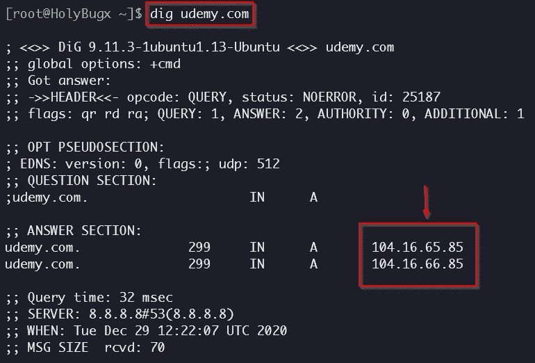

这是 Cloudflare 的 IP 范围，为了确认我们可以在我们找到的记录 IP 地址上使用 *whois* :

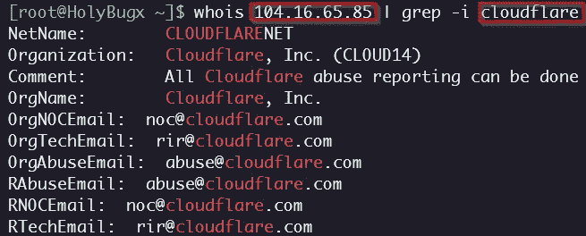

此外，还有另一种方法来确定目标是否在云辉后面，那就是使用 *curl:*


# 关于 MX 唱片的一切

MX 记录是最受欢迎的方法之一，因为有时很容易找到原始 IP。如果邮件服务器由与 Web 服务器相同的 IP 托管，攻击者可以从发出的电子邮件中找到 IP 地址。

## 1-邮件标题和重置密码

如果邮件服务器与 Web 服务器的 IP 地址相同，我们还有一个有趣的选择，就是使用“重置密码”功能，这样我们就可以在目标网站上创建一个帐户，使用重置密码，收到的电子邮件就可能会泄露源服务器的 IP 地址。


“重置密码”和邮件标题的示例

请注意，您应该收集所有您可以在收到的电子邮件中看到的 IP 地址，并手动尝试它们，看看它是否是服务器源 IP。有时“返回路径”的值会变得很方便。

## 2-发送电子邮件

还有一个有趣的方法你可以用，给一个不存在的邮箱发邮件到“non-existent@target.com”会引起反弹；因为用户不存在，传递将会失败，您应该会收到一个通知，其中包含向您发送电子邮件的服务器的原始 IP。

# 虚拟主机发现

找到 Web 服务器后，您就有了 Web 服务器及其 IP 地址的列表，您应该弄清楚您的目标域是否在这些服务器上被配置为[虚拟主机](https://www.webopedia.com/definitions/virtual-host/#:~:text=Often%20abbreviated%20vhost%2C%20a%20virtual,Web%20servers%20and%20Internet%20connections.)。

对于虚拟主机发现，我建议 [Pentest-Tools](https://pentest-tools.com/information-gathering/find-virtual-hosts) 如果你喜欢 GUI，并且像我一样喜欢 CLI 工具，我建议这些工具:

*   [VHostScan](https://github.com/codingo/VHostScan)by[Codingo](https://twitter.com/codingo_)
*   [虚拟主机发现](https://github.com/jobertabma/virtual-host-discovery)由 [Jobertabma](https://twitter.com/jobertabma)
*   [Gobuster](https://github.com/OJ/gobuster) 由 [OJ](https://twitter.com/thecolonial)

使用这些工具，你可以找到虚拟主机，如果你的目标被配置为虚拟主机，那么你有机会找到源 IP。

# 安全错误配置

错误配置很容易被利用，例如，要加载的内容的 URL 指向一个不属于可以连接到您的 CDN 的 IP，就像服务器的实际 IP 一样。

问:但是一个人可以只用一个 CSS 文件建立一个服务器，而不用其他东西(举例来说)，你怎么能说这个 IP 就是我们正在寻找的真正的 IP 呢？

答:实际上，我们并没有寻找 CDN 背后服务器的真实 IP 地址。我们正在寻找可以验证的信息，只有在此之后，我们才能做出结论。

基本上，我们在寻找属于 cdn 的 IP。

# 物联网搜索引擎

当我们想要对我们的目标及其资产进行一些基本的侦察时，物联网搜索引擎是我们最好的朋友。有一些物联网搜索引擎，我们可以查询关于我们目标的有用信息。

## 1- Censys

[Censys](https://censys.io/) 是一个帮助信息安全从业者发现可从互联网访问的设备的平台。在 Censys 的帮助下，您可以找到有价值的信息，例如:

*   IP 地址；网络地址
*   开放端口
*   SSL 证书
*   托管提供商
*   等等。

对我们文章主题的查询非常简单，我们可以简单地查询域名本身，看看是否有任何 IP 泄漏。

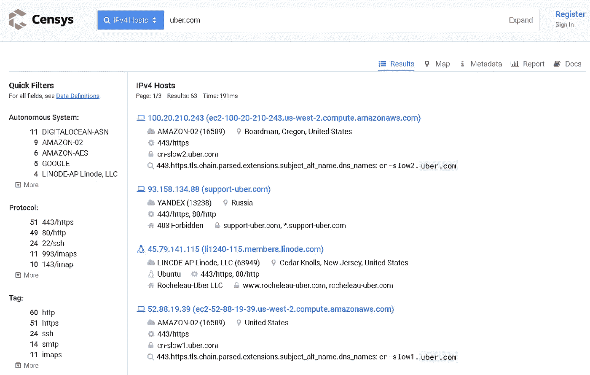

Uber.com 查询

另一种方法是使用证书进行搜索，只需从蓝色栏中选择证书，然后搜索您的目标。

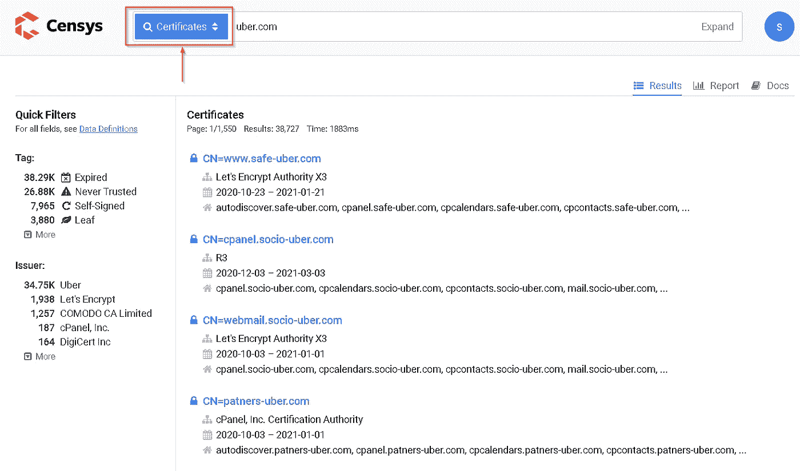

Censys 证书查询

现在打开每个结果以显示详细信息，并从右侧的“Explore”菜单中选择“IPv4 Hosts”:

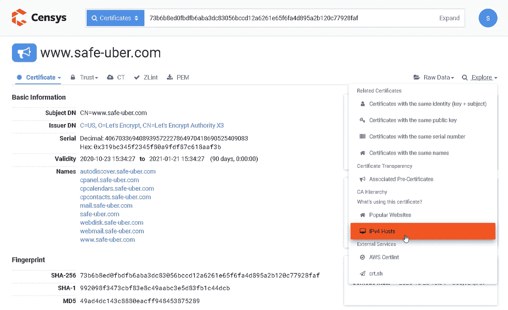

简单地分析你的目标，看看是否有任何 IP 泄漏，并试图达到你的目标使用他们的 IP。

为了向您展示 Censys 有时如何导致目标的完全 IP 泄漏，我现在将向您展示我最近正在处理的一个目标，通过简单的 IPv4 查询，我实现了 CDN 背后的 IP:


这个简单的查询导致了源 IP 泄漏

正如你在上面看到的，有一个 IP 是我探索并意识到它是网站的起源 IP。

## 2- Shodan

[Shodan](https://www.shodan.io/) 是另一个物联网搜索引擎，它可以帮助安全研究人员找到关于他们正在接近的目标的有用信息。在 Shodan 中有很多可以搜索的内容，我强烈推荐你去看看 [Shodan Filters Guideline](https://beta.shodan.io/search/filters) ，为了这篇文章，我们可以简单地查询域名并搜索 IP。

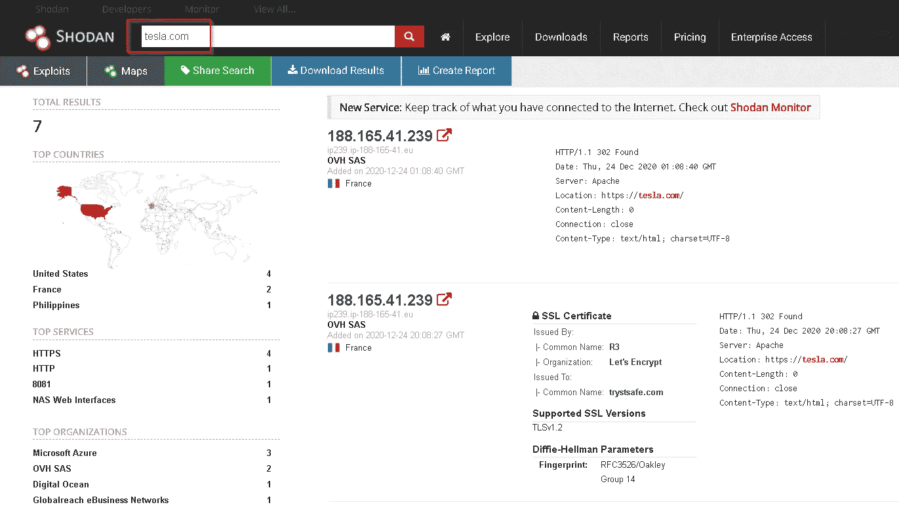

对 Tesla.com 的简单质疑

使用 Shodan，您可以查询其他有趣的过滤器:

*   组织
*   ASNs
*   图标散列
*   SSL 证书
*   等等。

## 3- Zoomeye

[ZoomEye](https://www.zoomeye.org/) 是另一个物联网搜索引擎，可用于发现:

*   网络服务器
*   IP 和端口
*   标题和状态代码
*   脆弱点
*   等等。

# 使用 IP 地址直接访问网站

正如我前面提到的这个方法:

> 另一个有趣的选择是，防御者可以限制试图使用 IP 地址访问网站的用户，这样网站只有在提供了域名的情况下才会加载。
> 我们将讨论使用一种有趣的方法绕过这个限制。

让我们跳出框框思考。如果我们扫描我们的目标 CDN 提供商的 IP 范围，然后做一些神奇的事情会怎么样？
为了找到 IP 范围，我们可以执行 DNS 强制，因此，找到 IP 范围，然后我们可以继续使用下面的命令:


如您所见，我们正在扫描目标的 IP 范围。然后我们使用 [Httpx](https://github.com/projectdiscovery/httpx) 来寻找活的。然后我们使用 *curl* 来提供一个包含目标域的主机头，从而绕过所有的限制。

# 发挥创造力的时候到了:Favicon Hashes

Favicons 有时非常有用，可以找到关于网站使用的某些技术的有趣信息。
Shodan 允许通过`http.favicon.hash`进行 favicon 哈希查找。Hash 指 base64 中 favicons 文件内容的 [MurmurHash3](https://github.com/aappleby/smhasher/wiki/MurmurHash3) 。

[用于生成哈希的 Python3 脚本](https://gist.github.com/yehgdotnet/b9dfc618108d2f05845c4d8e28c5fc6a):

```
import mmh3
import requests
import codecsresponse = requests.get('https://<website>/<favicon path>')
favicon = codecs.encode(response.content, 'base64')
hash = mmh3.hash(favicon)
print(hash)
```

查看下面的博客文章，深入了解: [Asm0d3us — Favicon hashes](https://medium.com/@Asm0d3us/weaponizing-favicon-ico-for-bugbounties-osint-and-what-not-ace3c214e139)

你可以使用的另一个有用的工具是[皮耶科 11](https://twitter.com/noneprivacy) 的[收藏夹](https://github.com/pielco11/fav-up)。使用这个工具，你可以从 favicon 图标和 Shodan 开始查找真正的 IP。


# XML-RPC Pingback


XML-RPC 允许管理员使用 XML 请求远程管理他们的 WordPress 网站。pingback 是对 ping 的响应。当站点 A 链接到站点 B 时，会执行 ping 操作，然后站点 B 会通知站点 A 它已经注意到这一提及。这是乒乓球。

您可以通过调用`https://www.target.com/xmlrpc.php`轻松检查它是否已启用。你应该得到如下:
`XML-RPC server accepts POST requests only.`

您也可以使用 [XML-RPC 验证器](https://orilliadentist.com/xml-rpc-validator/)。

根据[WordPress XML-RPC ping back API](https://codex.wordpress.org/XML-RPC_Pingback_API)，函数有两个参数`sourceUri`和`targetUri`。以下是它在 Burp Suite 中的样子:


信用: [Gwendallecoguic](https://twitter.com/gwendallecoguic)

# 参考

)(我)(们)(都)(不)(知)(道)(,)(我)(们)(还)(不)(知)(道)(,)(我)(们)(还)(不)(能)(还)(有)(什)(么)(情)(感)(呢)(?)(我)(们)(还)(没)(有)(什)(么)(情)(感)(呢)(?)(我)(们)(还)(没)(有)(什)(么)(好)(感)(呢)(?)(我)(们)(就)(没)(有)(什)(么)(好)(感)(,)(我)(们)(还)(没)(有)(什)(么)(感)(觉)(到)(,)(我)(们)(还)(没)(有)(什)(么)(好)(感)(,)(我)(们)(还)(没)(有)(什)(么)(好)(感)(感)(。

# 最后的话

你们值得爱！我尽我所能写了一篇文章，可以帮助你了解 CDN 如何工作的全过程，蓝方队员的 POV，以及攻击者试图找到 web 服务器的源 IP 的选项。如果您有任何相关的问题或反馈，请随时在 [Twitter](https://twitter.com/HolyBugx) 上与我联系。

作者: [HolyBugx](https://twitter.com/HolyBugx)