# 创建 VBS 有效负载以绕过端点安全的乐趣

> 原文：<https://infosecwriteups.com/fun-with-creating-a-vbs-payload-to-bypass-endpoint-security-and-other-layers-44afd724de1b?source=collection_archive---------0----------------------->

## 对 Valak 恶意软件变种的快速分析

# 简介:创造另一个有趣的有效载荷来绕过一些东西

我不会关注从系统触发并绕过终端安全解决方案的新颖的 [LOLBAS](https://lolbas-project.github.io/) 有效负载，我将向您展示一种替代方法，它可以更深入地了解您的控件如何组合在一起:您为什么认为进行真正端到端且真实的“紫色团队”网络钓鱼有效负载模拟如此重要？它不仅仅显示对单个检测或预防技术或过程的绕过。对于端到端，我的意思是让我们模拟一个最终用户有效负载，它不仅可以绕过 SMTP 内容安全扫描等电子邮件控制，还可以绕过 EDR、EPP 和传统防病毒等终端安全解决方案。让我们与 SOC 或 MSSP 携手合作，看看人工分析师能否在 true Purple Team partnership 的日志中检测到这一点，并确保日志得到正确配置和丰富，以提供这种可见性。让我们与企业卫士合作，帮助他们改进流程和技术，实现真实的模拟有效载荷。在这篇文章中，我将介绍如何通过启用 VBA 宏的 Excel 文档来创建一个有趣的 VBS 有效载荷。它将向您展示一个非常简单的例子。

当我写这篇文章的时候，一个小小的安全事件触发了这个讨论，我不得不把它加入进来。在网络钓鱼模拟之后，我添加了一个对 Valak 恶意软件变种的快速分析，该变种攻击了我们的一个客户，并与一个新的隐形小 VBA 宏有关。

# 为什么这很重要？

这很重要，因为这是许多企业每天都要面对的问题。我与一位 CISO 和我们的 MDR 团队讨论了如何展示一个有效载荷，它可以绕过一个 MDR 供应商，而另一个供应商将被阻止。但我收到了一些推回来。这不够现实，因为它需要讲述整个客户故事。是真的。客户总是可以说，我们的校样点或 Mimecast 会阻止电子邮件到达我们用户的收件箱。恶意软件有效负载如何在所有层(包括入站电子邮件流和端点执行)传递和暂存？

# 紫色团队钓鱼负载模拟

让我们创建一个有效负载和一些测试用例场景，在这些场景中，我们可以测试发送一封带有有效负载的电子邮件，该邮件将原封不动地到达目标收件箱。首先，在您的实验室中有一个 GSuite 攻击者/受害者和一个 Office365 攻击者/受害者来测试云内部和云之间的这些网络钓鱼场景是有帮助的。

紫色团队:终极“团队运动”

*   建立一个新的 Gsuite 攻击者域。针对 Office365 托管的客户发送网络钓鱼有效负载。
*   站起来一个新的 Office365 攻击者域。针对 Office365 托管的客户发送网络钓鱼有效负载。
*   验证有效负载是否在默认设置打开的情况下被阻止。
*   验证有效负载是否被 Office ATP 服务阻止。

我用 Office 365 和 GSuite 设置了一些测试帐户，因为我想验证攻击者如何通过可信 CSP 的白名单从一个“云”发送到另一个“云”，以及会产生什么影响。在这个测试中，我观察到当攻击者向 Office365 托管的受害者发送消息时，GSuite 阻止了出站宏 VBA。但 Office 365 允许它在两个不同的客户之间使用默认设置。事实证明，您不仅需要购买并启用 Office ATP 订阅，还需要正确配置检测和隔离恶意 VBS 宏的正确策略。

# VBS 有效负载演示:创建手动有效负载

让我们来看看 VBS 的有效载荷传输系统。微软 Excel 和 Word VBS 宏是失传的艺术，仍然非常有效地携带恶意载荷。研究显示，它们在野外仍然经常被观察到。这是为什么呢？事实证明，办公应用程序仍然非常受欢迎，用于高级计算和复杂工作流程的宏功能也是如此。嵌入到 Microsoft Excel 文档中的 VBA 应用程序对一些公司尤其有用。

这个测试案例深受威尔·奥尔索普的《高级渗透测试:入侵世界上最安全的网络》的影响

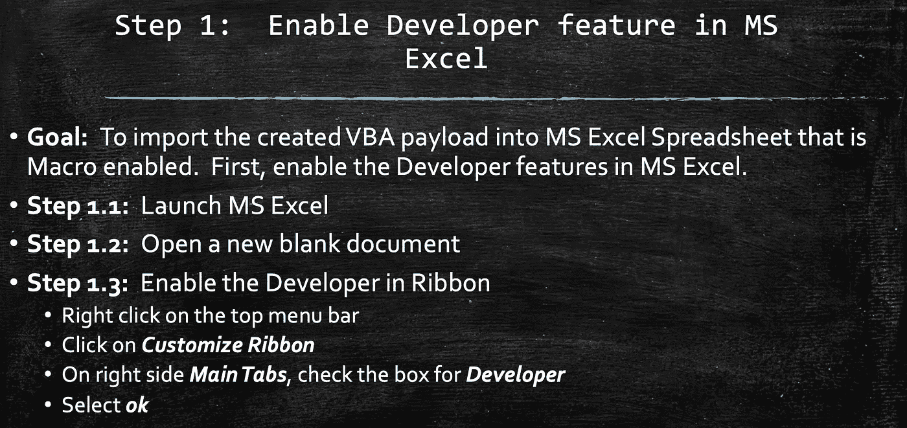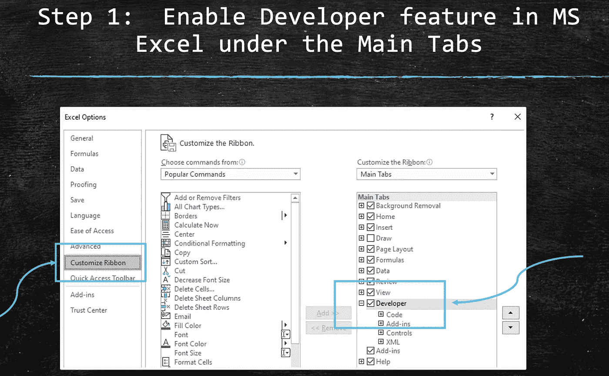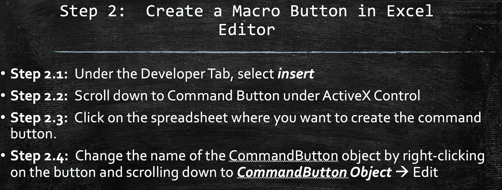

您可以使用 Excel 中的一些默认模板来创建预算，这正是我在本次测试中所做的。

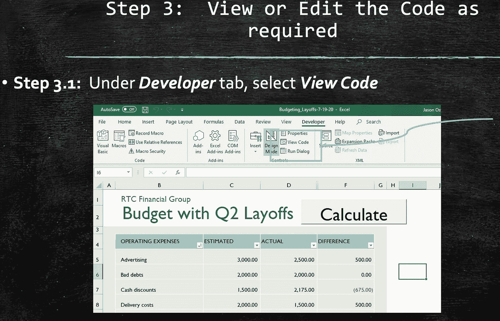

我们上面所做的是避免使用 AutoOpen()函数，因为它更容易被反病毒引擎标记。我们依靠一个借口，让目标点击“计算”宏按钮，这将启动所需的 VBS 函数。

现在，根据需要更改变量，以匹配您模拟的攻击基础设施。VBS 电码就位于这个要点[这里](https://gist.github.com/iknowjason/08d452e059ec43fa4efdb59ddb0da3e7)。

带有 TLS 传输的反向外壳 VBS 有效载荷

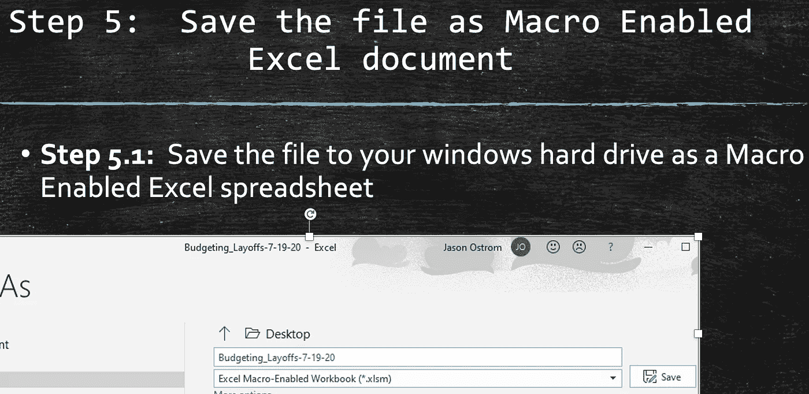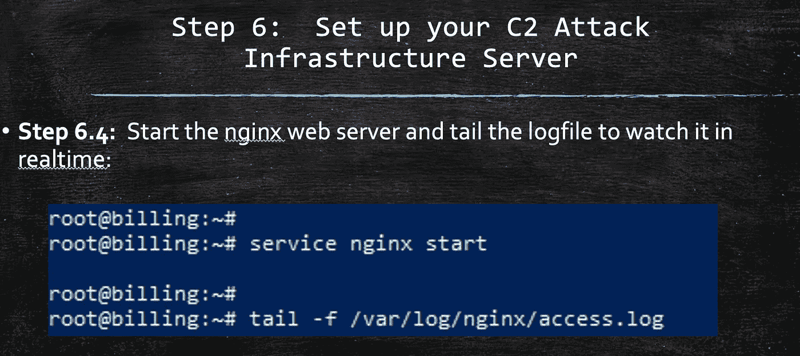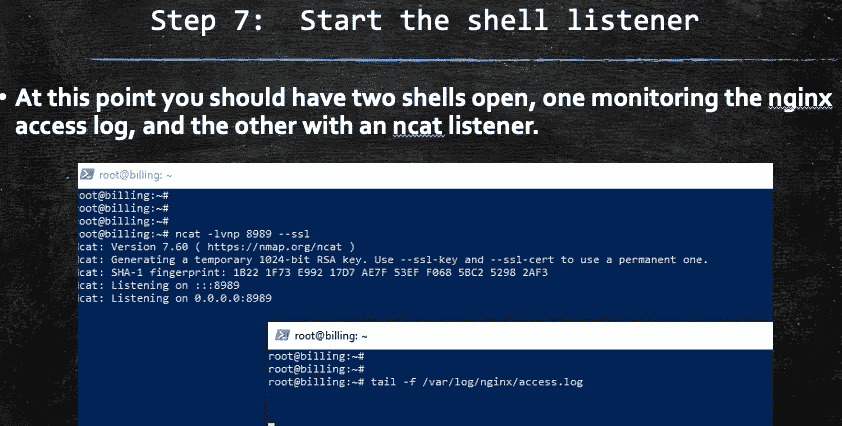

现在，我们已经建立了攻击基础设施。我们编个借口发给受害者。在我们的测试中，这个启用宏的 Excel 电子表格在两个 Office365 客户域之间发送，具有所有默认设置，没有检测到或警告。这封邮件是在受害者的收件箱里收到的。

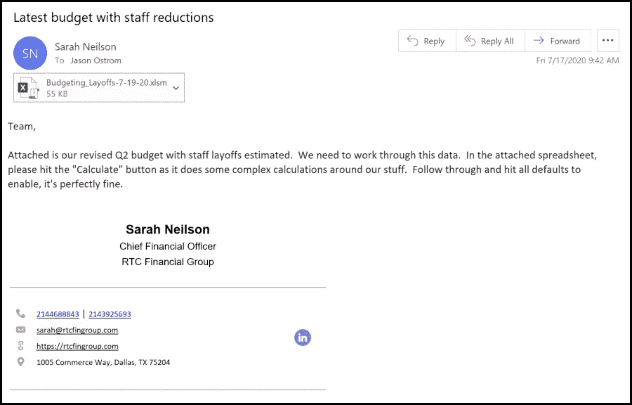

让我们假设托词是可信的，用户下载并打开了 Excel 电子表格，遵循托词中的所有提示。

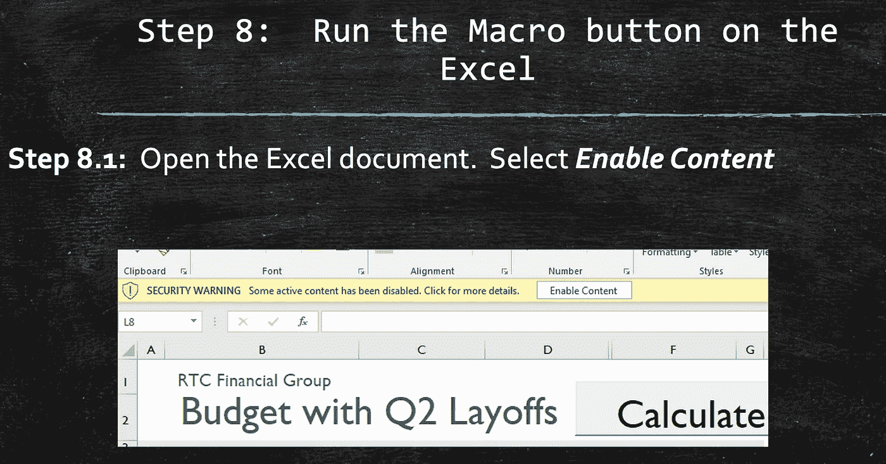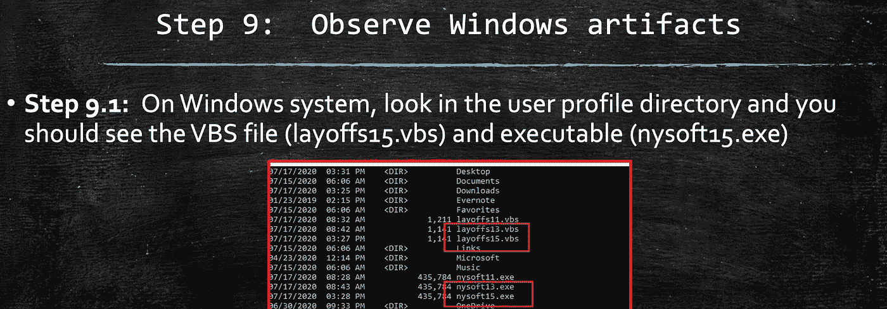

最后，您应该看到反向 shell 负载是由 shell catcher 监听器在云中使用 ncat 和加密的 TLS 会话捕获的！此时您应该会看到一个 Windows CMD 提示符。

## 摘要

*   我们创建了一个 VBA 函数，它依赖于用户点击一个启用宏的按钮。
*   我们没有依赖 ***AutoOpen()*** 函数，这使得这个测试更加隐秘。
*   单击 VBA 函数时，它会在用户配置文件目录中编写一个 VBScript。
*   剧本在 VBA 执行。
*   该脚本从 Nginx web 服务器下载一个可执行文件(ncat.exe)。
*   该脚本运行 ncat.exe，使用 TLS 传输将外壳铲到基于云的 C2 服务器上。
*   我们使用了一个看起来很无辜的 VBA 宏，它携带了一个 VBS 负载，将其写入一个文件，然后执行它！这是一个双阶段 VBS，模拟了一个更复杂的 C2 框架将会使用的内容。

这种技术已经被证实可以绕过至少一个 EDR 供应商。所以享受它的乐趣，但请只把它用在好的方面，更好地理解和捍卫你的网络。注意，这是一个非常基础的例子。下一步将是混淆 VBS，并对传送系统文件使用压缩/加密。借助这个紫色团队网络钓鱼测试案例，我们能够绕过任何电子邮件检测以及端点 EDR 解决方案。这比仅仅测试一个单一的预防或检测层更有价值，因为它模拟了端到端的攻击。

# 进入瓦拉克

在我撰写本文时，我们的一位安全分析师帮助筛选了一份来自客户的可疑 word 文档报告。它最终成为了一个 Valak 恶意软件变种，与之前描述其工作原理的一些[文章](https://www.cybereason.com/blog/valak-more-than-meets-the-eye)有些不同。这是一个受密码保护的 Word 97–2003，记录了 VBA/VBS 的有效载荷。下面是一些快速和肮脏的笔记对这一点的初步分析。不幸的是，在我们有机会收集更多信息之前，登台服务器(看起来第一阶段试图从那里投放更多恶意软件)被关闭了。

*   **2020 年 7 月 31 日星期五:**用户报告可疑 word 文档。
*   **2020 年 7 月 31 日，星期五:**安全分析师通过将 word 文档上传到混合分析来执行分类。
*   **勘验 API 链接** [**此处**](https://labs.inquest.net/dfi/sha256/bf27a7b725ef434d21f6f7aa8af4fbd2398b352eb9b1d74c46a1e4595f7ce39b) **:**
*   **2020 年 8 月 4 日星期二:**开始沙盒动态分析工作。
*   用户收到的电子邮件的图像。它似乎是来自可信第三方的前一个线程中的回复。这显示了对手危及第三方并将其自身插入之前的电子邮件线索的策略，在这种情况下，用户可能会放松警惕并更倾向于“信任”打开附件。

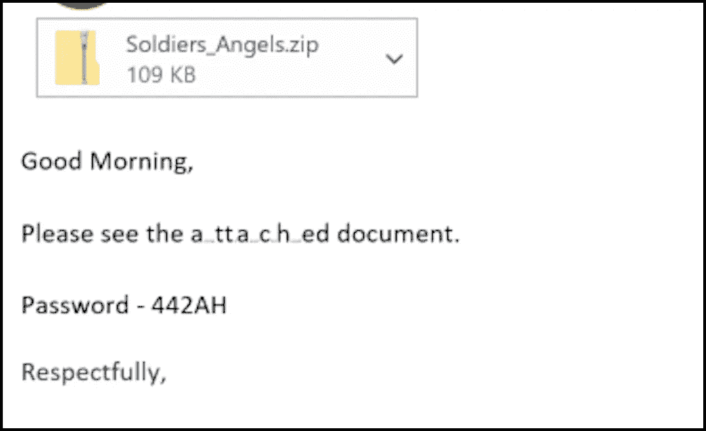

*   解压缩 zip 文件时会显示一个受密码保护的 Word 97–2003 文档。请注意上面显示的电子邮件正文中包含的密码，这可能会降低电子邮件内容扫描引擎解析电子邮件正文中的密码并在沙箱中运行该密码的能力。
*   **文件名:** ordain.07.20.doc
*   **SHA-256:**BF 27 a 7b 725 ef 434d 21 f 6 f 7 aa 8 af 4 FBD 2398 b 352 EB 9 B1 d 74 c 46 a 1e 4595 f 7 ce 39 b

*   通过单击“启用编辑”和“启用内容”这两个默认值来打开 word 97–2003 文档宏

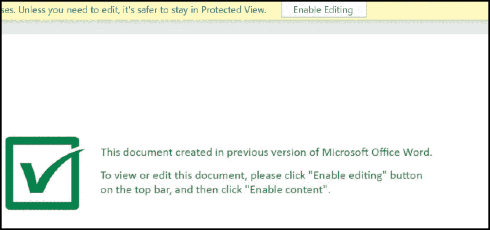

*   用户选择 ***【启用编辑】******启用内容*** (而不是需要功能宏按钮)后，VBA 调用 ***AutoOpen()*** 自动运行代码。

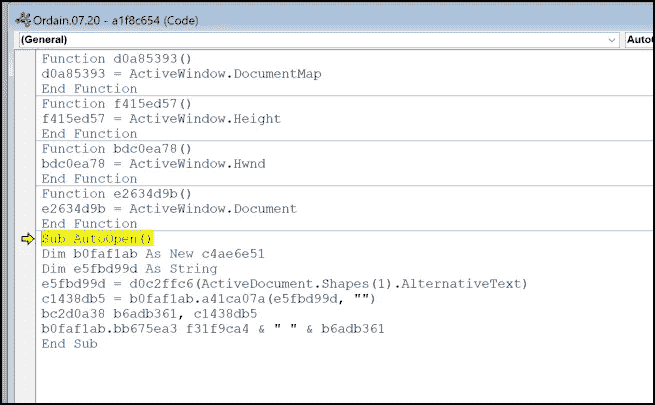

*   数据包跟踪显示在 TCP/80 上有一个 HTTP GET 请求发送到下列域和 IP 地址。图像就在下面，显示了请求的 PHP 页面和 URI。
*   **域:**4xj0nhh.com
*   **IP:**188.127.224.179

*   8 月 4 日星期二晚上:web 服务器超时，一段时间后连接被拒绝。这与运行 VBA 时收到以下 VB 错误的时间相吻合，即临时服务器无法提供阶段 2 所需的文件。

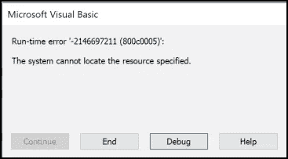

*   在 8 月 5 日星期三，我们开始注意到服务器在端口 80 上对任何 SYN TCP 请求发出 RST。到 8 月 5 日，网络服务器不再允许 3 次握手。
*   下图显示了带有模糊 VBS 字符串的模块和类模块文件(总共三个)的结构。

*   8 月 5 日的运行时测试开始显示 Windows Defender 通过 8 月 5 日发布的新签名阻止了该变体:

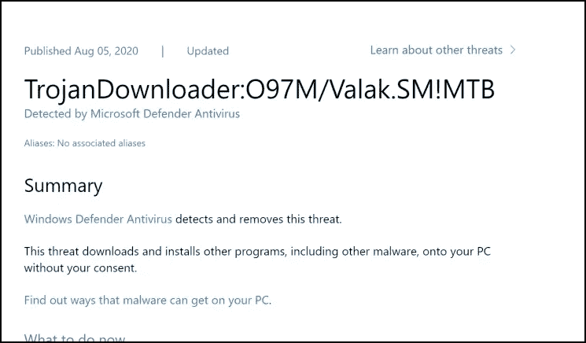

*   Microsoft 威胁情报更改日志显示了 8 月 5 日发布的此 Valak 变体的更新威胁情报签名:

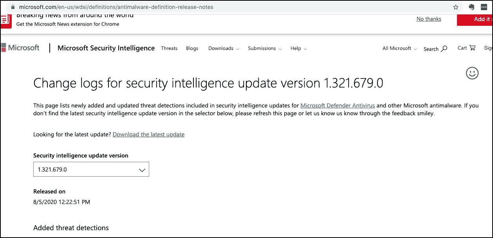

# 名人

*   在收到时(Fri，2020 年 7 月 31 日)，当检测到以前的恶意软件并自动隔离时，此变体绕过了 Office ATP 管理的订阅。
*   VBA 在受密码保护的 Word 97–2003 文档中，密码在电子邮件正文中提供。
*   发件人似乎是可信任的第三方，该电子邮件线程是对受害者和发件人之间的先前电子邮件线程的回复。
*   从这个快速的 Valak 案例研究中，你可以得到更多的想法，使前紫色队与 VBA 测试有效载荷更加隐蔽。