# 黑客盒子(HTB)演练:{ Curling }

> 原文：<https://infosecwriteups.com/hackthebox-htb-walk-through-curling-d2d29753b92d?source=collection_archive---------2----------------------->

一个 **无聊的小故事:**作为一名 IT 安全研究员，我总是努力增长自己在 IT 安全方面的知识。在这次学习之旅中，我发现了一个很棒的平台名字 **HackTheBox。这个平台帮助我提高了我所学的黑客技术，也学习了新的笔测试技巧。**

# 简介——HTB:

HTB 是一个出色的平台，可以托管属于多个操作系统的机器。它还面临着其他一些挑战。个人必须解决这个难题(简单的枚举和笔测试)才能登录到平台，这样你就可以下载 VPN 包来连接到托管在 HTB 平台上的机器。

**注意:**只允许对退役的 HTB 机器进行报道。

# 冰壶漫步:

让我们从这台机器开始。

1.  为个人用户下载 VPN 包，并按照指南登录 HTB VPN。

## **卷发器介绍:**

**卷毛机**是 Linux 操作系统，托管一个 web 应用程序，它是从 IP **10.10.10.150** 访问的。这个挑战让我了解了 CMS 框架的常见错误配置，以及开发人员的一些愚蠢的常见错误是如何导致重大安全问题的。

## 始终努力理解应用程序:

web 应用程序托管在 IP 地址 10.10.10.150 上。因此，让我们尝试从 IP 访问应用程序。在花了一段时间，并根据网站内容的应用程序已经建立了一些 CMS 框架，所以最常见的 CMS 框架是 PHP 应用程序。

## 不要忘记使用 nmap 侦察:

**Nmap** 是收集关于 web 应用程序上启用的开放端口和服务的信息的主要工具。

```
nmap -sC -sA 10.10.10.150
```


HTB 冰壶

从 Nmap 扫描中，我发现了 CMS 框架的信息。这样我就可以确认这个应用程序是建立在 Joomla 框架上的。

> “根据以上信息，我尝试了一些其他测试案例(例如:joomla 扫描，试图利用 joomla 框架的已知漏洞。).但没有一个是不工作的，因为应用程序运行在最新的 joomla 版本上。”

## 永远不要留下任何糟糕的测试案例:

当我在学习笔测试技巧的时候，一些挑战是非常容易的，并且与客户端“**page source”**相关。当时我真的不明白为什么这些测试用例是有用的，我真的不关心这些测试用例。因为这个疏忽，我在冰壶挑战过程中浪费了宝贵的时间。

我在网上找到了下面的提示，然后我意识到了**“页面源”**测试用例的重要性。

> 开发人员经常留下他们评论。有时这些是应用程序易受攻击的载体。”—随机开发

之后我仔细观察了冰壶网页的页面来源，发现了下面的评论。

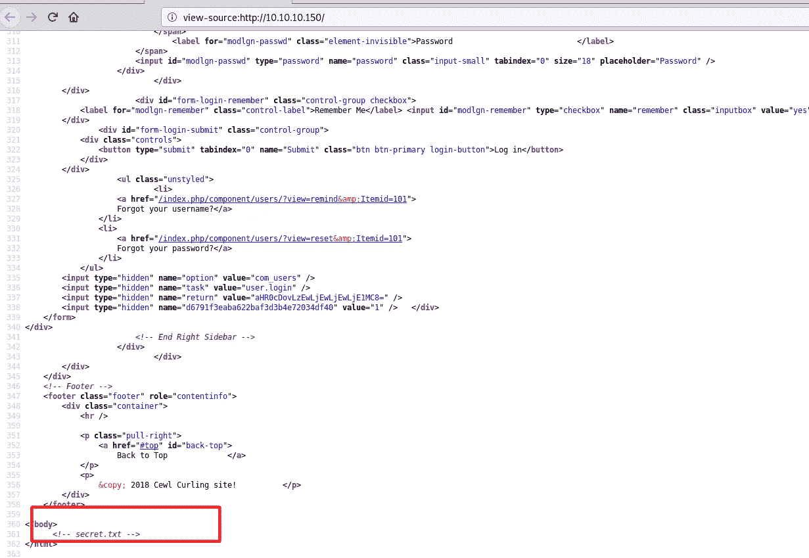

HTB 冰壶

通过上面的评论，我推断 web 应用程序根目录下有一个 **secret.txt** 文件。所以我手动抓取了资源并找到了 ASCII 文本。根据我的经验，我可以明确地说这是 base64 编码的字符串。然后立即解码成明文。

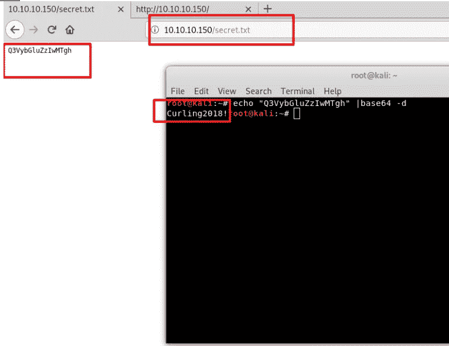

HTB 冰壶

好了，正文是**“curling 2018！”**那么**是什么呢？**。一段时间后，我的黑客意识认为，这是一个密码，我注意到在主页上有一个登录表单，但我不知道用户名。

> 我试着用一些常用的用户名登录，但是最后我受够了。

每个 CMS 框架都有一个管理员帐户作为管理员登录。但是我不知道登录 joomla 管理帐户的资源名称。

> 在做这个挑战的时候，我不知道如何使用工具。所以我用谷歌作为工具。(除了这样做，您还可以使用 Dirb 来获取应用程序的隐藏目录)。

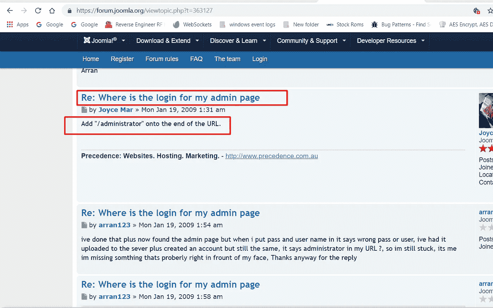

通过访问上述资源，我找到了 joomla 管理登录页面

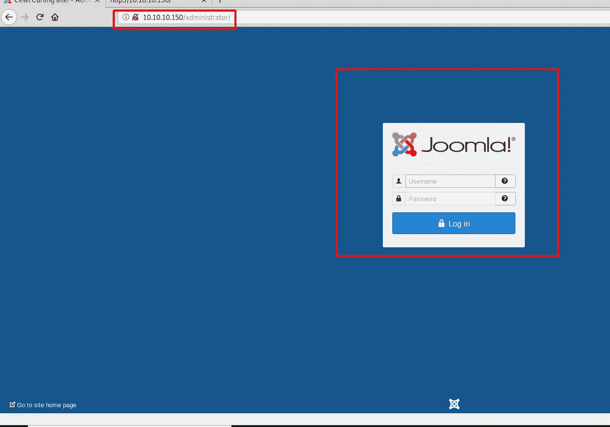

我再次尝试用一些常用用户名登录，但没有成功。

事实上，这是每个 CMS 框架的常见错误配置。博客帖子的末尾有作者的名字。通常，CMS 框架会自动附加管理员用户名作为作者名，除非管理员用户明确更改了用户名。所以我假设**“floris”**是登录的用户名。

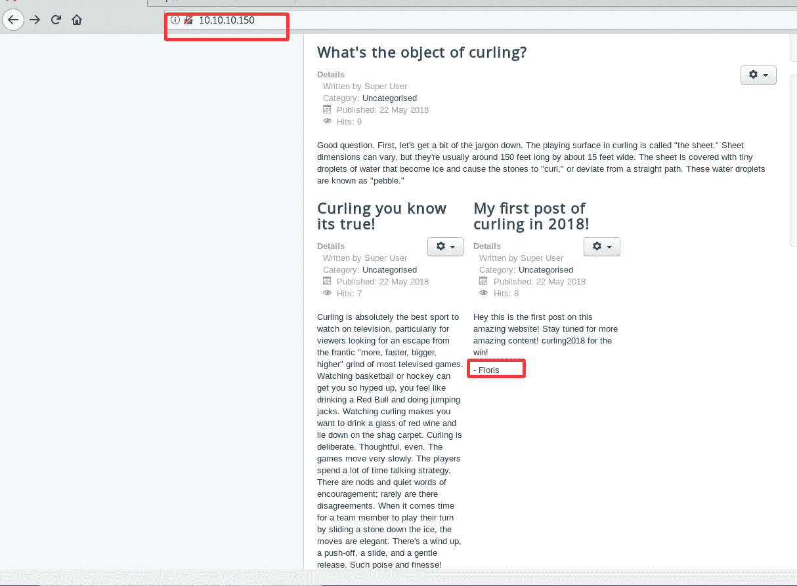

我刚刚试着用“floris”和“Culing2018！”凭证。


最后，我进入 joomla 管理主页，我知道我们可以从模板部分定制网站内容。

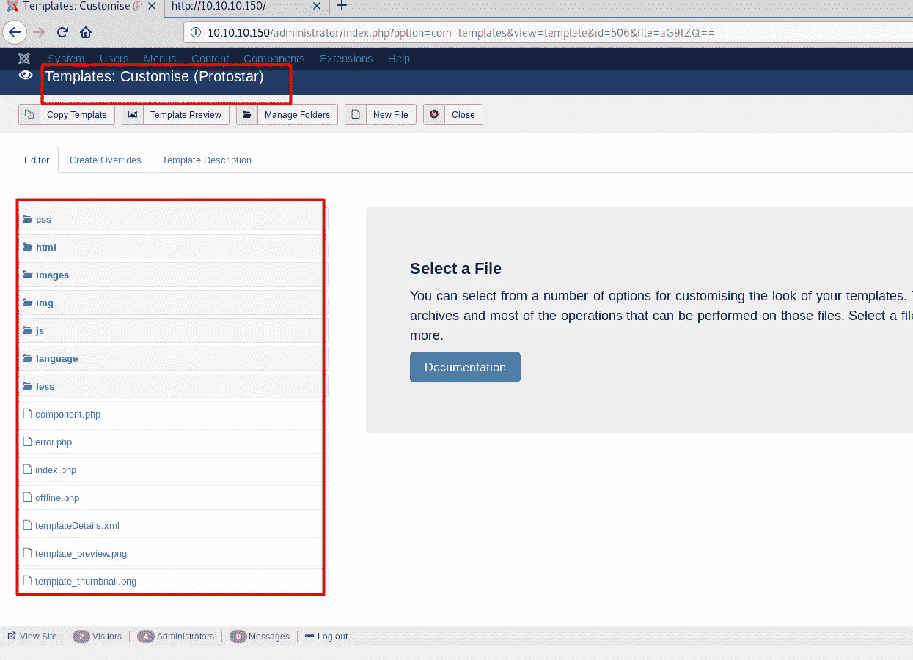

因此，我在模板存档中上传了一个反向外壳 php 代码。这样我就可以通过请求 error.php 文件得到反向外壳。

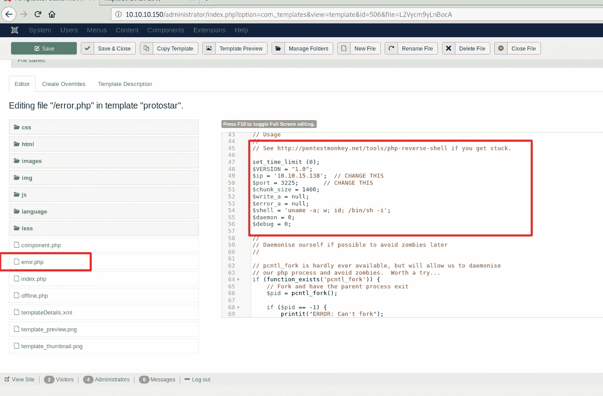

我打开了适当的端口，并使用 **netcat** 命令保持监听模式。

`nc -lvp 3225`


最后我拿到了反壳。但是我需要交互式 shell，所以我枚举了服务器并找到了 python 程序。


使用下面的 python 代码，我们可以得到交互式外壳。

```
python3 -c 'import pty; pty.spawn("/bin/bash")'
```


一旦获得了反向 shell，就需要枚举系统中的用户。因此，我们可以通过读取系统上的 **/etc/passwd** 文件来获取用户，并浏览相应的用户目录。注意，芙罗莉丝是 ssh 用户。所以在主目录中有一个名为 floris 的文件夹。然后我去芙罗莉丝的主目录。在其中我发现了一个有趣的文件**“密码 _ 备份”**。

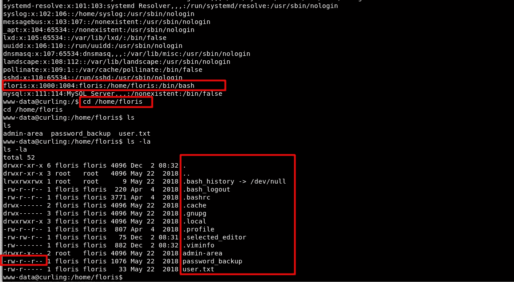

仔细观察， **password_backup** 文件对“其他”用户有读取权限。所以我将文件复制到 **/tmp** 文件夹中，因为我们在 **floris** 目录中没有写权限。然后我使用`file`命令获取文件类型。输出显示“这是 ASCII 文本”。然后我试着用`cat`命令读取文件内容。根据我的经验，我知道这是一个文件的十六进制转储。

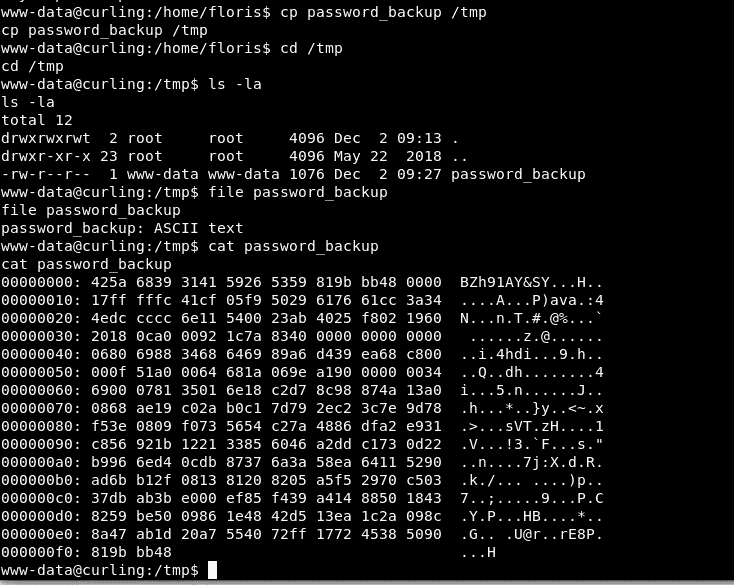

> 根据我过去在 CTF 的经验，我知道如何通过二进制转换技术读取这些文件。感谢 http://overthewire.org。

我们可以使用`xxd`命令轻松地将十六进制转储恢复到原始的二进制形式。要将十六进制转储转换为二进制，需要使用以下命令。

```
xxd -r <file_name> <output_filename>
```

转换成二进制形式后，我们可以使用`file`命令轻松找出文件类型。该文件是" **bzip2** "压缩数据。所以我们需要用**重命名文件名。bz** 然后我们可以使用`bzip2`命令解压文件。

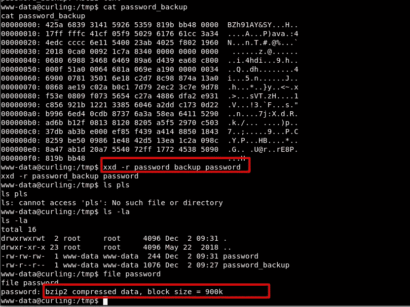

实际上，该文件是用各种压缩类型重复压缩的。以至于我们不得不重复上述过程，直到我们得到“ASCII”文件格式。仔细观察下图。

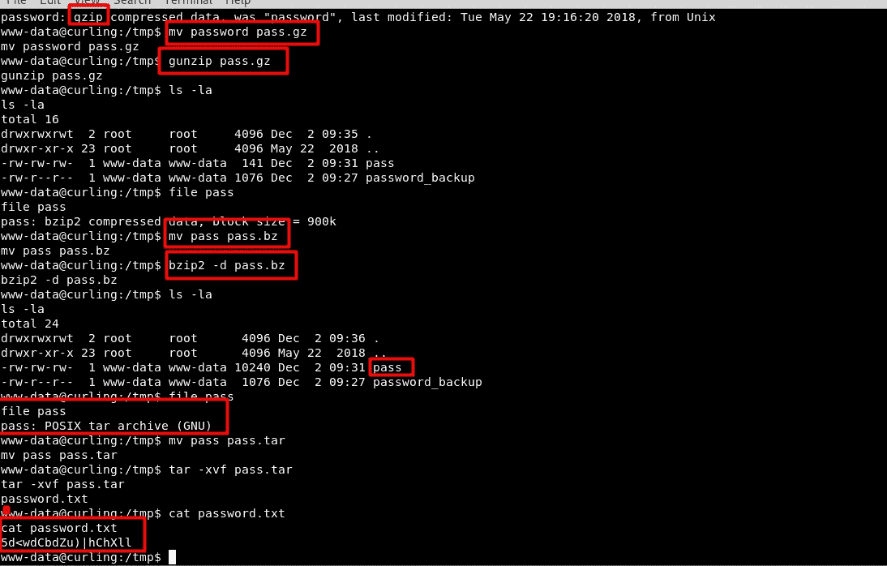

最后我得到了纯文本文件格式的**“密码 _ 备份”**文件。这个文件是在“芙罗莉丝”用户目录下找到的，所以我猜这是 Floris 用户的 **ssh 密码**。我刚刚尝试用上面的密码作为 floris 用户登录。

> 耶！最后，我以 floris 用户的身份登录。这意味着我获得了芙罗莉丝用户访问权限，我只需使用 cat 命令读取 user.txt。

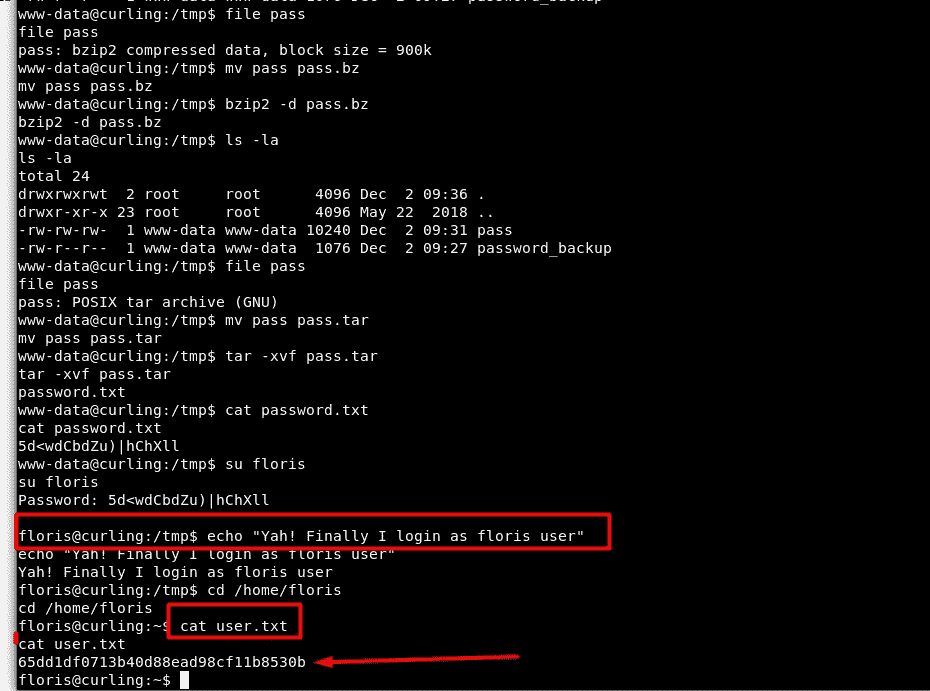

现在我需要找出一个缺陷来读取 root.txt 文件以获得标志。

经过侦察，我在 **admin-area** 目录中找到了两个文件(input，report)。

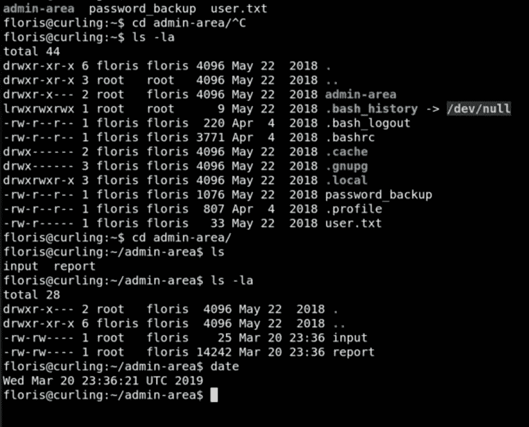

我使用 cat 命令读取了这两个文件的内容。输入文件包含“url”参数，其值为“ [http://127.0.0.1](http://127.0.0.1) ”。报表文件不过是冰壶主页的 html“页面源”而已。

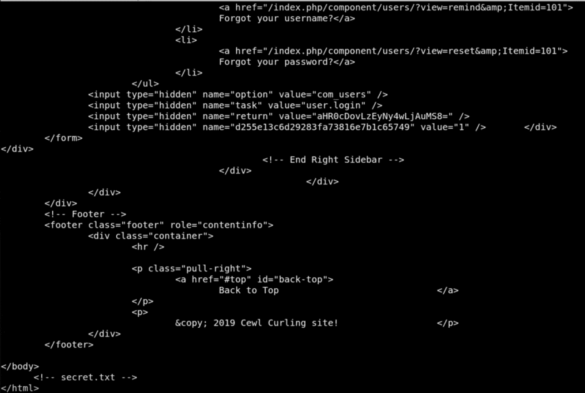

根据上面的结果和我观察到的一些测试，服务器有一个 cron-job，它读取输入文件“URL”参数，并将内容写入报告文件，并且 cron-job 文件在特定的时间间隔内有 root 访问权限。所以我使用**“file://”**协议来读取 root.txt 文件。


> 这是我的冰壶挑战之旅。对我来说，挑战是适度的，它帮助我重温了我学到的技能，也学到了一些新技能，特别是在我获得了反向外壳访问之后。

**感谢阅读我的博客**