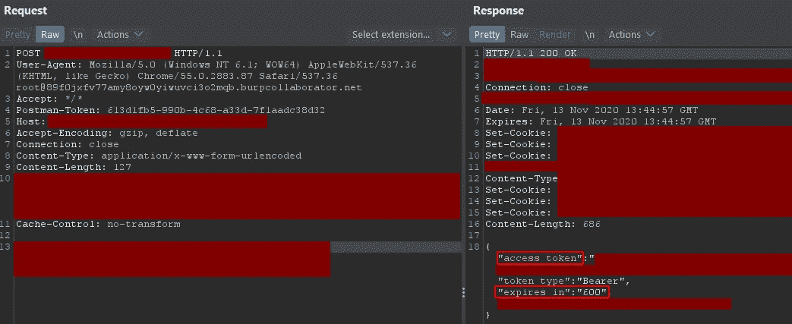
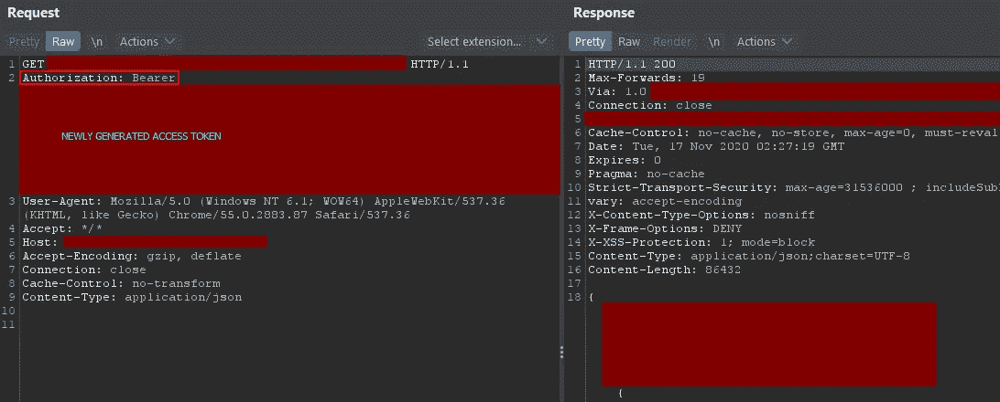
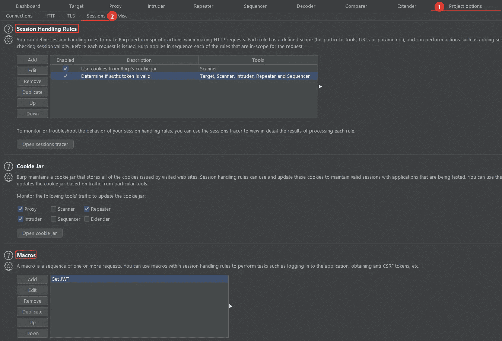
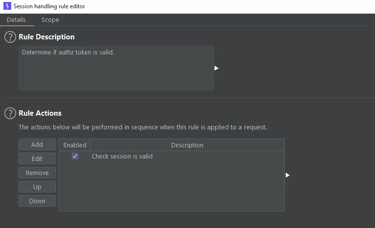
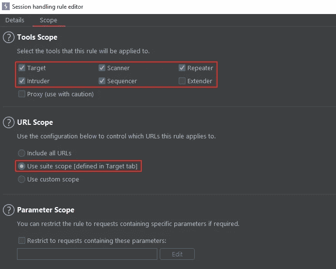
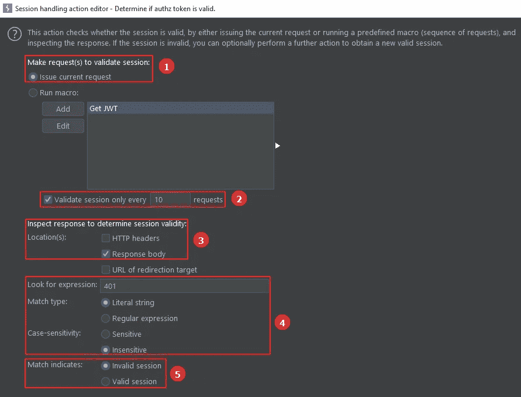
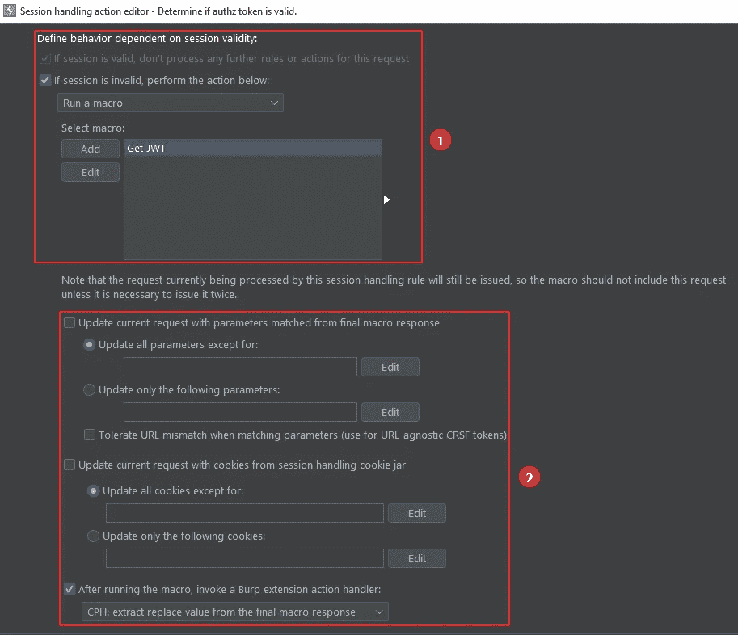
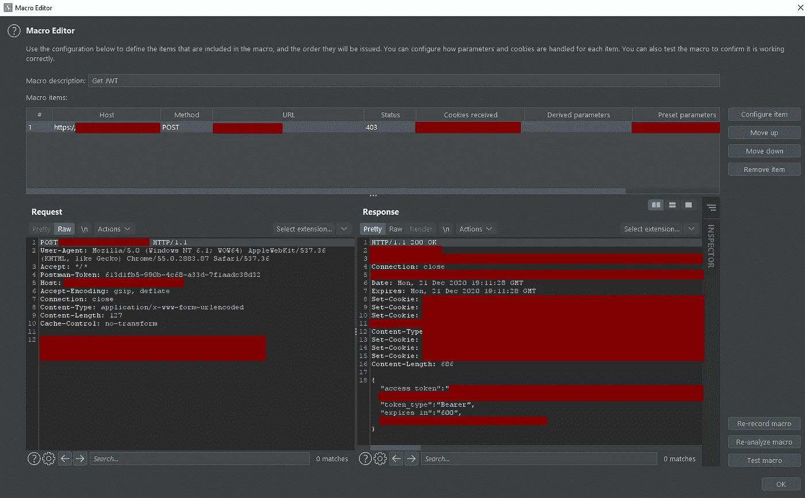
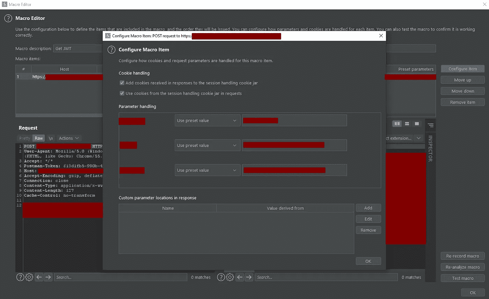
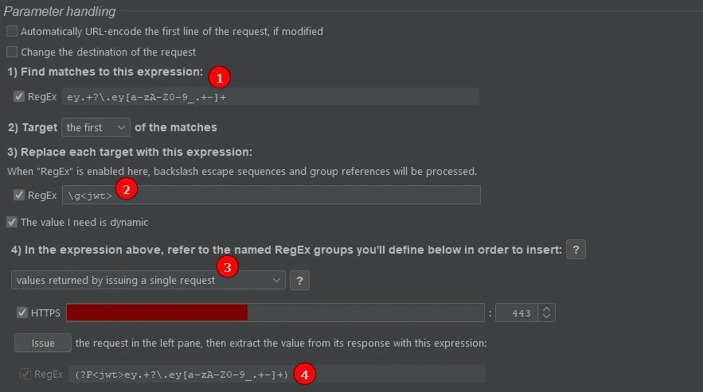

# 处理授权令牌的短到期时间

> 原文：<https://infosecwriteups.com/handling-short-expiring-time-of-authorization-tokens-4e7552bdaf1a?source=collection_archive---------2----------------------->

## 如何在使用 Burp 套件测试 web 应用程序或 API 时不浪费宝贵的时间

# 介绍

在我从事 web/API pentesting 的几年中，这是我第一次不得不考虑如何在使用 Burp 的入侵者进行暴力攻击的过程中以及在使用 Burp 的中继器时自动更新授权令牌，这样我就不必每隔十分钟手动更新一次，而在这种情况下，这是令牌的过期时间。

嗯，因为我还没有看到任何关于这个特定场景的博客帖子，所以我决定自己写一篇。也许它能帮助像我最近一样挣扎的人们。

我实际上在一个 API 上做了一个 pentest，它有两个主要端点:一个用于获取新的授权令牌，另一个用于使用这个令牌请求一些数据。下面您可以看到对这些端点的两个请求:

对负责为 API 生成新访问令牌的端点的请求

对使用访问令牌的端点的请求

# 问题是

正如您在上面的第一幅图中看到的，由于响应体中的属性“expires_in ”,在我们需要另一个令牌之前，我们有一个非常小的窗口用于与 API 进行交互。事实上，当我试图运行入侵者超过十分钟时，我开始得到状态代码 401(未授权)。不幸的是，当我测试 API 时，我并没有打算就此写一篇博文，所以一旦我发现了这一点，我就简单地再次运行攻击，所有导致 401 的请求都会重新发出。这里没有指纹，抱歉…

# 解决方案的第一部分

继续前进，一旦我意识到我必须在请求新令牌之前处理这个短暂的时间框架，我就开始做每一个优秀的渗透测试人员都会做的事情:[跪求 google 给我带来一个解决方案](https://miro.medium.com/max/455/1*snTXFElFuQLSFDnvZKJ6IA.png)。玩笑归玩笑，我知道 Burp 有处理会话的功能，但我以前从未使用过，也不知道这些选项在哪里。即便如此，找到它们并不困难:

“会话处理规则”和“宏”在 Burp 套件中的位置

正如我们所看到的，描述是不言自明的:会话处理规则定义了规则。每次发出该规则范围内的请求时，都会应用它们。让我们更详细地介绍一下这个领域:

**会话处理规则**

此会话允许您创建具有预定义范围的规则，这些规则将在同一范围内的每个请求之前执行。它可以用来检查会话的有效性，向请求添加 cookies，执行登录。重要的是要注意，所有规则都是按照它们列出的顺序应用的，考虑到它们的作用域，也就是说，如果一个规则不在某个请求的作用域内，它就不会被应用到那个特定的请求。

**宏**

引用一个非常恰当的描述:

> 宏是一个或多个(HTTP)请求的序列。您可以在会话处理规则中使用宏来执行诸如登录应用程序、获取反 CSRF 令牌等任务。

**建立会话处理规则**

知道了这两个资源是如何工作的，我们现在可以开始构建一个会话规则和宏来更新我们的访问令牌。首先让我们添加一个新规则:

添加新的会话处理规则

在上图中，我们可以看到一个区域的简短描述，以及它被调用后将执行的动作。这也是“范围”选项卡，如下所示:

新会话规则的范围定义

此选项卡允许您选择将在 Burp Suite 的哪些部分使用此规则，它们可以应用到哪些 URL，以及将规则限制为仅包含自定义参数的请求。

**添加规则动作**

定义了规则范围后，让我们添加一个在执行该规则时要执行的操作。我们将该操作命名为“检查会话是否有效”,这是事情开始变得真实的地方:

会话处理规则的操作编辑器的第一部分

让我们把动作编辑器分成两部分:

**规则动作编辑器:第一部分**

1.  首先，操作需要发出一个 HTTP 请求，作为验证会话的第一步。在这里，我说我想要发出正在被验证的相同请求，但是如果是这样的话，我也可以运行一个宏(让我们稍后再看宏)来做同样的事情。
2.  根据请求，Burp 执行会话验证的频率。在图中，我们可以看到每 10 个请求，这在这个场景中是不必要的，但是让我们保持这种方式。
3.  在哪里检查响应以检查会话是否有效。这里我们可以看到“HTTP 头”、“响应体”(我们的例子)和“重定向目标的 URL”。
4.  检查响应时要看什么。在我的例子中，我必须在响应体中查找字符串“401 ”,因为这是我在令牌过期时得到的行为。注意，我们也可以查找 [regex](https://www.pinterest.com/pin/270708627573628298/) ，并使搜索区分大小写。
5.  最后，对于第一部分，我们必须指出匹配意味着会话仍然有效还是无效。在我的例子中，字符串“401”意味着会话无效。

**规则动作编辑器:第二部分**

会话处理规则的操作编辑器的第二部分

第二部分分为两部分:

1.  如果会话有效/无效会发生什么:如果它是**有效的**，则不会为该请求处理任何其他规则或操作。如果是**无效**，我选择运行宏，我们接下来会看到。
2.  对于最后一部分，我们可以用最终宏响应中匹配的参数更新请求，和/或用会话处理 cookie jar 中的 cookie 更新请求。

# 解决方案的第二部分

现在，注意上图中的最后一个复选框。在运行宏之后，我可以调用一个 Burp 扩展操作处理程序。id 所做的是将宏的请求传递给扩展，它将对它们做一些事情。

现在，你能告诉我，如果我有一个完整的系统来处理会话，为什么我首先需要一个分机？如果仔细观察，没有一个请求实际上有会话，因为它们不使用会话 cookies 来处理授权。我们所拥有的只是标题 *Authorization: Bearer* 后面有一个大 base64，这是实际的令牌。

因此，经过这次旅行之后，我们可以看到 Burp 没有(至少现在还没有)一个内置的处理这类需求的过程:**我需要用宏响应的部分内容替换请求头的内容。**好消息是，Burp 拥有整合扩展以填补这些空白的惊人能力。

因此，针对这一特定需求，有一个名为“[自定义参数处理程序](https://github.com/PortSwigger/custom-parameter-handler)”或 CPH 的打嗝扩展。它所做的是“以外科手术般的精度修改 HTTP 消息，即使是在使用宏的时候”。更确切地说，在我的场景中，它允许[搜索和替换内部请求和响应](https://github.com/elespike/burp-cph/wiki/03.-Find-and-replace)。

但是在我们深入扩展的配置之前，我们必须看看这个宏到底是做什么的，因为我们很快就会需要这些知识。

**配置宏**

在 Burp 套件中录制宏

在上图中，我们可以看到记录和配置宏的主窗口。如前所述，宏是一组按顺序发出的请求。此外，我们可以将一个请求的部分响应传递给下一个请求，直到得到一个最终的 HTTP 响应。在我的例子中，这里列出的所有请求都将被传递给 CPH 扩展。

首先，我们必须记录这个宏，也就是说，从 proxy HTTP history 选项卡中选择我们希望成为宏的一部分的所有请求。在我的例子中，只有它生成一个新的访问令牌:

在 Burp 套件中录制宏

如果我们愿意，我们可以配置每个宏请求，从响应中获取所有需要的参数，并将它们传递给下一个请求:

配置宏请求以处理参数和 cookies

虽然在这一部分我不会讲得太深，但是这个窗口允许您添加和使用来自会话处理 cookie jar 的每个响应的 cookie，以便它们可以在下一个请求中使用。此外，我们可以非常精确地指定参数。Burp 将获得这里配置的参数，并将它们传递给宏的下一个请求。

因此，现在您可以看到，我们没有任何选项来将头值从宏的响应替换到我们的实际请求中。这就是为什么我们需要使用 CPH 扩展。让我们终于看到了神奇之处:

**配置 CPH 扩展**

让我们把这个解释分成三个部分。这首先将处理 CPH 选项:

CPH 期权

1.  安装扩展后，将出现 CPH 选项卡。
2.  在其中我们可以看到选项选项卡。在这里，我们可以保存/加载或导入/导出配置，还可以设置扩展将使用的 Burp 工具。

第二部分处理选项卡的创建:

配置新的 CPH 选项卡

一旦您在会话处理动作编辑器的最后部分选择了“运行宏后，调用 Burp 扩展动作处理程序”复选框，就会自动创建一个 CPH 选项卡来处理宏的请求。选项卡的第一部分让我来命名它，并设置 Burp 范围内的 URL 的使用范围。

第三部分是魔术:

从响应中提取一个字符串，并用它替换原始请求的字符串

1.  这里我们设置了一个正则表达式来搜索原始请求中要替换的字符串。请注意，正则表达式以“ey”开头。它将与过期的访问令牌(T2 JWT T3)完全匹配。
2.  正则表达式在(1)中找到的第一个字符串将被第二个正则表达式的内容替换。在这种情况下，“\g <jwt>指的是一个名为“jwt”的正则表达式组，我们将在(4)中看到。</jwt>
3.  如果我选中“我需要的值是动态的”框，选项四将变为可用。我们希望使用它，因为每次我们发出请求时，都会生成一个新的令牌。
4.  最后，当发出宏请求时，执行这个正则表达式搜索来提取新收到的访问令牌。注意，我用*(？P < jwt >*

因此，通过 regex (4)搜索从响应中提取的值用于替换旧的访问令牌(选项 2)。这样，我甚至可以用一个无效的 JWT 向 API 的主端点发出一个请求，这个请求仍然可以工作，因为这个扩展将在后台发挥它的魔力。

# 结论

这里的结论是，打嗝套件比你我想象的要强大得多。我甚至没有使用它的全部能量。澄清一下，这篇文章不是由 PortSwigger 赞助的。我只是在陈述一个事实。他们用这个工具做得非常好。