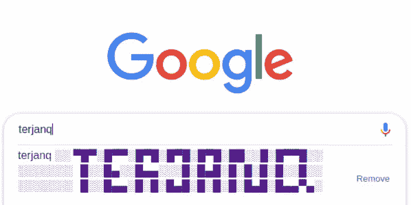

# 我怎么能劫持你。

> 原文：<https://infosecwriteups.com/how-i-am-able-to-hijack-you-1cab793a01d1?source=collection_archive---------0----------------------->

## 或者更确切地说:我如何能够在谷歌搜索中劫持你的自我暗示。

谷歌搜索最近经历了很多，因为杰出的 [XSS 发现](https://youtu.be/lG7U3fuNw3A)是由[木川正人](https://twitter.com/kinugawamasato)完成的。在这篇简短的文章中，我想与你分享，也许没有上面提到的发现那么令人兴奋，但肯定是我最近在谷歌搜索中发现的一个非常酷的错误。

旁边有介绍图片的标题应该已经揭示了我发现的漏洞是关于什么的。当人们使用谷歌搜索网站搜索短语时，会弹出一个自我暗示列表。

我发现，将一个精确的短语添加到提到的列表中所需的唯一步骤就是访问 URL `[https://www.google.com/search?q=phrase](https://www.google.com/search?q=phrase)`。就这么简单。攻击者只需在后台发出几个请求，就可以在你毫无察觉的情况下向你的自动建议中输入任何内容。

> *攻击者为什么想要实现这一目标？*

这个问题的答案并不简单。然而，我发现一些情况可能会以某种方式影响用户。这些案例如下。

**为产品做广告。**该公司可以尝试通过淹没访问者的自动建议列表来为他们的产品做广告，因此当他们搜索特定商品时，该公司的品牌会在用户点击输入之前显示出来。

**网络钓鱼。**攻击者可能会尝试将网络钓鱼网站放在列表的顶部，例如`facebook⠀⠀⠀⠀⠀⠀⠀⠀⠀⠀⠀⠀⠀⠀⠀site:facehook.tk`，这些网站会在尝试登录时窃取他们的凭据。

`facebook⠀⠀⠀⠀⠀⠀⠀⠀⠀⠀⠀⠀⠀⠀⠀site:facehook.tk`

**烦恼。**泛滥背后的原因不一定会造成任何安全影响而造成损害。例如，攻击者可能想到的唯一目标是用成千上万的短语淹没某人的自我暗示列表。就是为了气气。如果你碰巧不知道一次清除所有搜索历史的方法，点击一千次“删除”可能真的会令人沮丧。

**尴尬。**另一个可能的目标是让受害者感到尴尬。想象一下，有人在听众面前演讲，当他试图搜索某样东西时，非常不合适的结果出现了。我无法想象演讲过程中更大的尴尬:)

> 有没有安全问题？

在我看来，这一发现是一个安全问题，可能会影响很多用户。然而，谷歌团队并不同意我完全尊重的观点，这个问题就此结束。

> 泛滥的自我暗示对攻击者来说似乎没有很大的激励因素，他们会从中获得什么呢？
> 
> 我们认为这个问题可能不够严重，不足以让我们将其作为一个安全漏洞来跟踪。

我可能还应该提到，这个漏洞是一个更大的[报告](https://terjanq.github.io/Bug-Bounty/Google/clickjacking-reCAPTCHA-qgyb26mecsbb/)的一部分，与点击劫持谷歌 reCAPTCHA 有关，这是通往许多其他攻击的桥梁，也将很快出现在我的 Twitter 上。在推特上关注我，了解最新消息 [@terjanq](https://twitter.com/terjanq) 。

如果你大老远来到这里，并且**现在登录了你的谷歌账户**，我已经在那里为你准备了一个复活节彩蛋！在一个新标签页中打开[google.com](https://google.com)网站，并开始在那里的搜索栏中键入`terjanq`。如果你解决了这个谜题，或者你有任何关于这个漏洞可能被滥用的其他建议，请在评论中告诉我！:)