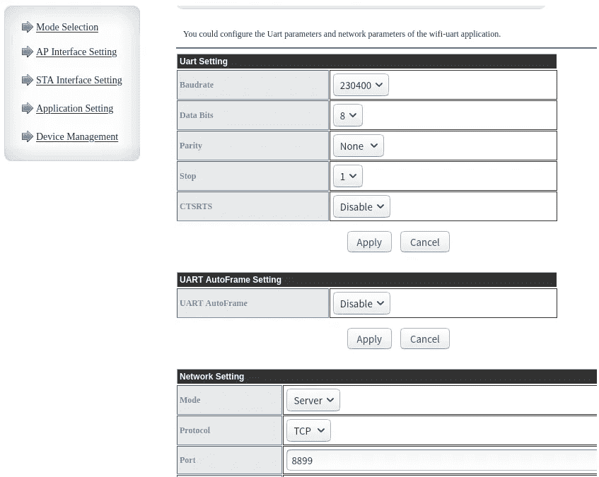

# 光伏系统数据最终如何在线

> 原文：<https://infosecwriteups.com/how-photovoltaic-system-data-ends-up-online-7dab3e7bb2ad?source=collection_archive---------2----------------------->


美国公共电力协会在 [Unsplash](https://unsplash.com?utm_source=medium&utm_medium=referral) 上拍摄的照片

## 另一个物联网故事

我的父母买了一个光伏系统，用来生产和使用他们自己的能源。当然，与当今的每一个物联网设备一样，人们可以使用一个应用程序来监控产生的数据。然而，当我回家过圣诞节时，我的父母告诉我用应用程序监控是愚蠢的，他们想在他们的个人电脑上存储和查看数据。经过一些研究，我发现没有 PC 界面可用于该系统，并决定深入挖掘。

# 回动的

为了开始我的研究，我查找了系统的 IP 地址并用 *nmap* 扫描了开放的端口。当分析系统时，这通常是很好的第一步，因为它有助于发现隐藏的服务。 *Nmap* 发现端口 23 (telnet)、80 (HTTP)和 8899 (lite-ospf)是打开的。

我通过 *netcat* 连接到端口 23，被要求输入凭证。我父母用来设置系统的标准凭证工作得很好。在终端上，我可以修改配置并查看状态，比如 bootcfg、ifconfig 等等。然而，我没有找到一个数据库，甚至是我正在寻找的数据的提示。

接下来，我测试了端口 80，同样需要凭证。使用与之前相同的凭据，我进入了页面，并再次能够配置设置。浏览网页，我发现没有相关的数据给我，不久后就放弃了这条路。



配置网页截图。

最后，我检查了 ospf-lite，这是网络路由协议 ospf 的高级版本。我们不需要深入了解更多细节，因为我们只需要知道，ospf-lite 只是简单地路由网络流量——另一个协议可以位于其上。了解到这一点，我再次尝试连接 *netcat* 。虽然连接保持开放，我可以发送数据，但没有回答回来。希望这个应用能给我一点提示，我打开了它——然后**嘣**！—我在打开的 *netcat* 连接上接收到数据。然而，当我关闭应用程序时，数据流停止了；当我再次打开它，水流继续。

现在有趣的事情开始了，是时候了解一些比特和字节了。我在应用程序中记录了更多各种事件的数据，并试图在数据中检测出一种模式。过了一会儿，我认出了序列 *0x2b05* 有规律的出现。其后通常会跟随有 *0x05* 或 *0x08* ，并继续跟随多个关键字中的一个，例如 *0xb55ba2ce* 。

```
**2b05**081ac87aa043cf855b0f0a2b0104db2d2d69ae000000009c36**2b05**0891617c5843cfb00411873e0508db11855b000000044b8e**2b05**080cb5d21b000000041707**2b05**055f33284e06490b**2b05**05dc667958036817**2b05**08**b55ba2ce**4082c5ec2030**2b05**08a7fa5c5d435e2b0104bd**2b05**08bd55905f440104b1ef67ce63ec10970e9d4737c7e4787a**2b05**08c0cc81b6498a52c19762**2b05**08b1ef67ce498a52c1cfbb**2b05**08959930b42b0104701a0482796f8b9ff0083f7851ec2ce0**2b05**05701a048201abb5**2b05**05fed51bd2000bc1**2b05**0599ee89cb008a8c**2b05**0837f9d5ca0000
```

当我发现仅仅盯着字节看并不能找到任何解决方案时，我决定是时候逆转 APK 了。我简单地使用了一个在线反编译器，它实际上显示了相当好的结果。在我浏览代码的时候，我发现了类 *ClientThread* 和 *HEXParser* ，它们展示了如何 *send_read* 、 *send_write* 、 *calc_crc* 以及如何解析数据。此外，我发现了用于请求特定信息的协议关键字。例如，我前面提到的 *0xb55ba2ce* 代表太阳能电池板 a 的电压。我发现了这一点，因为在反编译代码中，我注意到负数-1252285746，这与 0xb55ba2ce 的二进制补码解释相同。

为了理解逆向工程的过程，下面的代码是一个适当的例子。

从 ClientThread 类反编译代码

该函数的名称详细说明了它可以用于请求/读取数据。我们看到，如果某个协议是 1，应用程序将发送 *43* ，它等于*0x2b*——一个我们以前见过很多次的字节。在下一行，这些消息的 crc 被初始化。在第 6 行和第 7 行，发送字节 *0x0104* ，在 if 语句之后，发送一个四字节长的关键字。查看发送字节，我们会发现每次调用都会计算一个新的 crc。最后，在第 15 行，crc
计算完成，crc 被发送。结果是 *0x2b0104* + *关键字* + *crc* 。

在重新实现一个函数之前，我总是首先通过在动态分析中找到证据来验证我的直觉。在之前记录的数据中我们可以看到 0x*2b 0104 db 2d 69 AE*，我测试重发。片刻之后，我收到了一个答案，并为我的静态分析提供了证据。这意味着我们只需要重新实现这个函数加上 crc 计算，然后我们就可以请求任何我们想要的数据。

最后，我找到了发送请求和接收数据所需的所有相关信息。然而，我没有解释所有的关键字，只是解释了我感兴趣的几个。

# 协议

据我所知，这个协议非常简单。然而，还有更多功能我没有深入研究。

首先客户端发送 *0x2b0104 +关键字+ crc* 请求数据。结果接收到 *0x2b05 +长度+关键字+数据+ crc* 。数据是十六进制编码的，可以是整数、浮点数、字符串或布尔值。


# 互联网

在阅读光伏系统的手册时，我惊讶地发现了“基于互联网远程访问逆变器”的章节。在这一部分，该公司提供了如何在路由器上转发端口 8899 的分步说明，目的是用户可以在本地网络之外的任何地方使用该应用程序。我能找到的唯一警告是“使用互联网连接远程访问连接到家庭网络的设备总是会带来潜在的安全风险”。

这样做的问题是，它只是端口转发，没有进一步的安全性。这意味着没有加密。在本地网络中不是大问题的东西在野外互联网中可能是个问题，因为每个知道该协议的人都可以很容易地访问数据。这包括能源消耗、太阳能电池板生产等等。

为了证明这种说法，我首先按照自己的路由器一步一步地说明。之后，我使用本地网络之外的外部服务器提取我自己的数据。正如所料，它没有任何问题。其次，我感兴趣的是是否有人利用了这个命名的特性。因此，我用 *zmap* 扫描了德国提供商的 IP 范围，因为我知道这家公司是德国的，并搜索了开放端口 8899。随后，我发送了请求电池状态的关键字。从所有开放端口 8899 的公共 IP 地址中，我收到了 14 个肯定的回答。这意味着，任何人都可以在没有任何通知的情况下从他们的系统中读取任意数据。我没有进一步要求任何数据，因为我只想证明我的声明。

# 反应

我在 2020 年 1 月 4 日通过他们的服务邮件联系了光伏供应商，并向他们解释了我的发现。第二天，他们回复了我，告诉我他们非常重视这个问题，并计划在 2020 年夏天通过 TLS 开发一个云解决方案。此外，他们向我保证，他们让每个客户都知道与港口转运相关的风险。他们回答了我的一些进一步的问题，并且总是很友好。在他们的要求下，我从文章中删除了公司的名字。

# 结论

一般来说，即使一个设备主要是为本地网络使用而开发的，我相信这个系统也是，使用加密也是很重要的。无需太多努力就可以在网上找到私人光伏数据。现在开发任何协议的人都应该考虑和实现加密。他们不应开发新的加密方法，而应依赖现有的标准，即经过验证的行业标准。

我相信我已经给出了一个关于逆转日常设备的有趣见解，并希望鼓励人们质疑他们自己的设备。