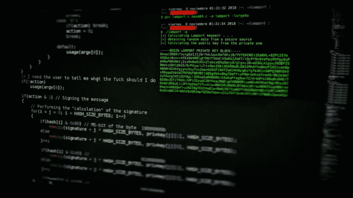
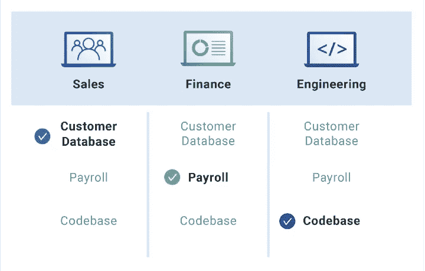
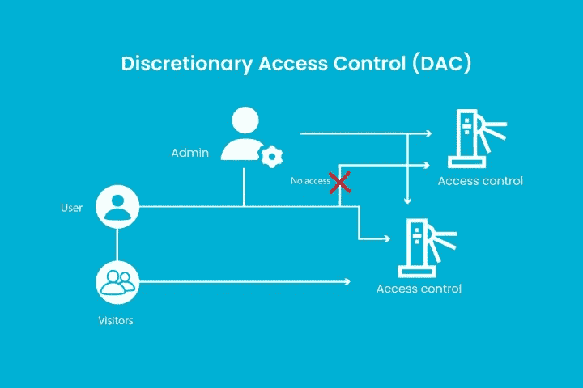

# 如何正确实施授权

> 原文：<https://infosecwriteups.com/how-to-properly-enforce-authorization-65dc62d21745?source=collection_archive---------3----------------------->

[阿吉特](https://unsplash.com/@arget?utm_source=unsplash&utm_medium=referral&utm_content=creditCopyText)在 [Unsplash](https://unsplash.com/@arget?utm_source=unsplash&utm_medium=referral&utm_content=creditCopyText) 上拍摄的照片

# 介绍

为了满足成长中的组织的期望，新的框架被投放到市场中，增加了当前 web 应用程序的复杂性。尽管这些框架能够在一定程度上缓解诸如 XSS 之类的攻击，但仍然存在设计、管理和错误配置问题，攻击者可以利用这些问题来访问隐藏在身份验证页面后面的帐户，甚至在成功后提升他们的权限。

作为这些问题的结果，出现了认证和授权困难，这带来了一类全新的缺陷和漏洞，从信息泄露到权限提升等等。

# 什么是授权？

[来源](https://dev.to/caffiendkitten/authentication-vs-authorization-25lc)

在当今基于 Web 的应用程序世界中，web 应用程序管理和设计是一个复杂的话题。解决了一个问题并认为它已经解决了，这是可能的，但这可能会打开一个全新问题的大门。

授权是验证用户是否可以访问资源的过程。它有时也指根据用户的个人资料或角色，对谁可以访问什么资源以及用户可以采取什么行动进行限制。

考虑一个托管在军事基地的文件服务器。根据不同的因素，可能会有不同的角色。为了便于讨论，我们假设有 3 个角色，即 guest、admin 和 super admin，并且有文件被分组为 public、confidential 和 top secret 组。

可以理解，访客用户应该只能访问公共文档，而管理员和超级管理员应该分别访问机密和绝密文档。

当这些条件没有被正确实施时，它被称为破坏访问控制或破坏授权。

# 正确实施授权

由于它可能带来可怕的后果，正确地实施授权变得极其重要。

1.  **执行最小特权原则**

它指的是仅向用户提供完成其日常工作所需的权限。这样做是为了确保机密性。你永远不知道一个人在任何时候心里会想些什么。因此，他/她应该只能访问完成工作所需的信息。

一些组织维护用户角色。如果用户需要额外的权限，则必须向用户提供临时访问权限，以便他可以访问受限功能。一旦他完成了他的工作，他的特权可以被修改为正常的特权。

**2。默认拒绝**

换句话说，除非你明确地授予访问权限，否则你将永远被拒绝访问。可以认为它与将资源列入白名单的过程同义。这种方法确保了默认情况下没有人被授予访问某个资源的权限。只有那些被管理员授权访问的人才能看到该资源。

**3。记录一切**

确定您的系统在攻击的最早期阶段或之后是否已经受损的唯一方法是检查日志。日志是了解公司历史的一个窗口。它们为您提供了关于发生了什么以及何时发生的准确信息。

经常建议企业维护一个不允许创建新日志文件的独立日志服务器。这将确保即使攻击者已经获得了对网络的访问，他也不能为了保持他或她的身份而删除日志。所有-应该记录对文件的访问，并且应该定期检查日志，以确保没有人滥用定期访问文件的特权。

**4。确保没有备份或。git 文件在服务器上。**

Web 开发人员经常将他们的应用程序发布到 GitHub，或者在他们的计算机上保存应用程序的离线副本。他们经常在部署过程中忘记从目录中删除这些文件。任何能够访问目录暴力工具(如 gobuster)的用户都可以找到并复制有问题的文件。下载完所有文件后，他们将能够检查每一次提交。这些提交可能包括敏感信息，如关键应用程序的凭据。

不同类型的访问控制概念

1.  强制访问控制

在信息安全中，强制访问控制是指根据资源内信息的敏感性和用户访问该敏感级别信息的权限来限制对资源的访问。例如，如果某人只有公共级别的许可，则该用户只能看到与该许可级别相关联的文档。

2.自主访问控制

[来源](https://doswljnolqe2s.cloudfront.net/discreationary-access-control.png)

自主访问控制(DAC)是一种安全访问控制，它根据对象的所有者组和/或主体设置的访问策略来授予或限制对象访问权限。它用于保护敏感信息。DAC 机制的控制由具有在认证期间提交的凭证(例如用户名和密码)的用户的标识来确定。从主体(所有者)能够根据自己的选择将经过身份验证的对象或信息访问权转移给其他用户的意义上来说，DAC 是自主的。换句话说，对象访问权限由对象的所有者决定。

# 结论

破坏访问控制的问题非常普遍，从 2017 年 OWASP 十大漏洞中的第四位上升到 2018 年的第一位。

在一个应用程序或一个公司或企业级网络中，给定不同的职责和用户特权，很容易在物联网中变得困惑和纠结。因此，建议根据功能组织项目，并维护适当的网络或应用程序架构。这也将确保无论谁接任行政官，在履行其职责时都会遇到较少的困难。

## 来自 Infosec 的报道:Infosec 每天都有很多内容，很难跟上。[加入我们的每周简讯](https://weekly.infosecwriteups.com/)以 5 篇文章、4 条线索、3 个视频、2 个 GitHub Repos 和工具以及 1 个工作提醒的形式免费获取所有最新的 Infosec 趋势！