# 如何设置高级 Nessus 网络扫描？

> 原文：<https://infosecwriteups.com/how-to-setup-advance-nessus-network-scan-c7fcf89e417b?source=collection_archive---------3----------------------->

> 这是一个非官方的 Nessus 博客，处理高级扫描以获得更好的结果和合规性。Nessus 中也会有认证部分。

在这里，我们将创建一个更深入的扫描，我们将尝试执行高级 Nessus 扫描。这将为我们提供更好的结果和扫描效率。我们还将使用 HTTP 表单插件设置身份验证。

这些设置总是可以根据自己的需要进行调整，没有正确的方法来设置预扫描。因此，某些应用程序可能需要某些设置，而其他设置可能不适合我们的情况。

我们将使用内部 IP，即 [http://192.168.1.125/](http://192.168.1.125/) 来执行扫描

## 先决条件:

1.  Nessus 已安装，此处使用的当前运行版本是 8.14.0。

2.演示域启动并运行。

3.关于 Nessus 和扫描的基本概念

## 设置:

1.  通过`service nessusd start`启动 ubuntu 上的 Nessus 服务。

2.然后通过`service nessusd status`检查 Nessus 守护进程的状态。

3.Nessus 门户可以在 [https://localhost:8834](https://localhost:8834) 上访问，或者通过主机的私有 IP 访问。在这里，我们通过系统的内部 IP 访问它。
**您可以通过** `**ifconfig**` 查看。

> 它可以配置，现在，我们有默认的管理员/管理员凭据。

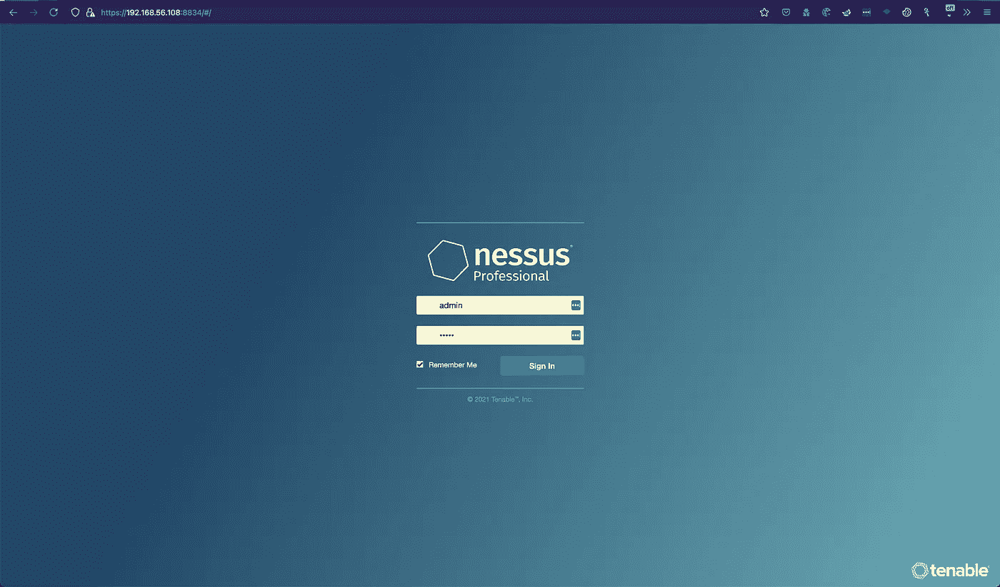

4.登录 Nessus 门户网站，然后登陆[https://192 . 168 . 56 . 108:8834/#/scans/folders/my-scans](https://192.168.56.108:8834/#/scans/folders/my-scans)

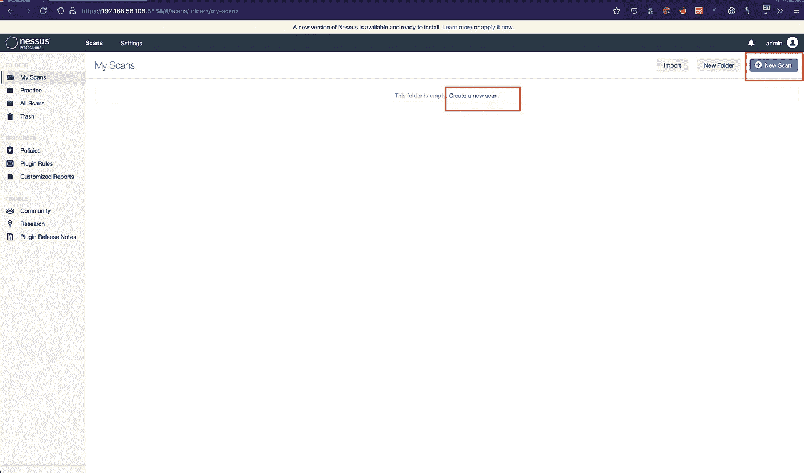

5.点击创建一个`New Scan`并选择`Advanced Scan`。

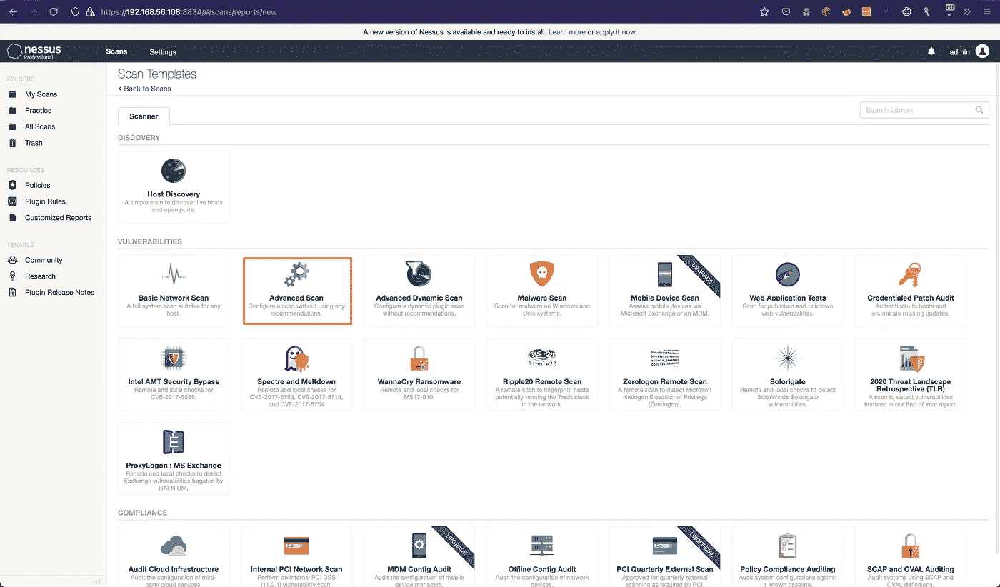

6.根据需要填写`General`中的详细信息。在`Targets`中，输入 *192.168.1.125* 。同样在多个地址的情况下，我们可以使用逗号(，)。示例 *192.168.1.126，192.168.2.126* 。同样，对于范围，我们可以使用*192.10.0.1/24*。

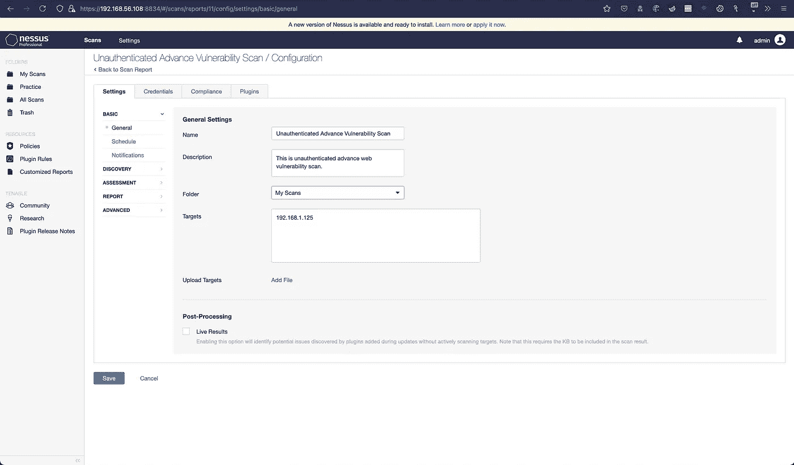

7.然后选择`Schedule`，将开关切换到`ON`。然后选择开始时间和时区。

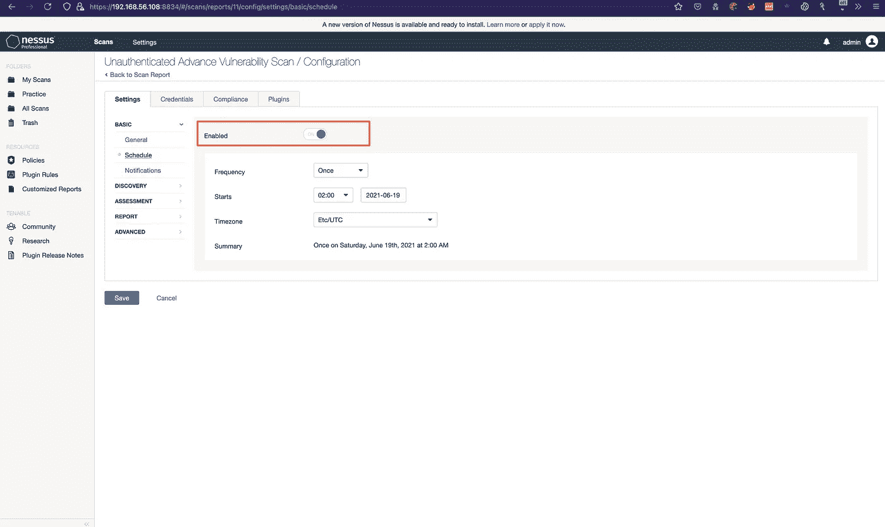

8.然后切换到`Notifications`，如果配置了 SMTP，我们可以在每次扫描完成时发送附有报告的直接邮件。暂时让它默认。

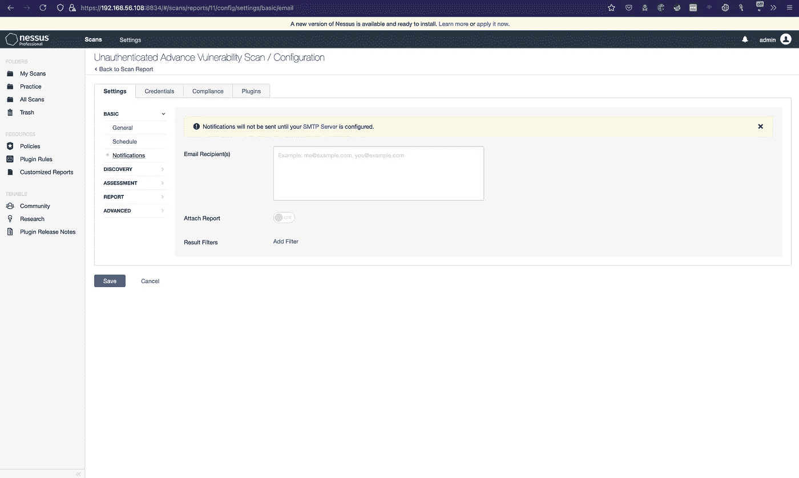

9.然后点击`Discovery`切换到`Host Discovery`并启用`Remote Host Ping`。在`General Settings`中，选择图像中提供的值。
对于`Ping Methods > TCP`，将`Destination Ports`改为 1–65535。
如果扫描的是整个网络范围，检查`Scan Network Printers`和`Scan Operational Technology Devices`。

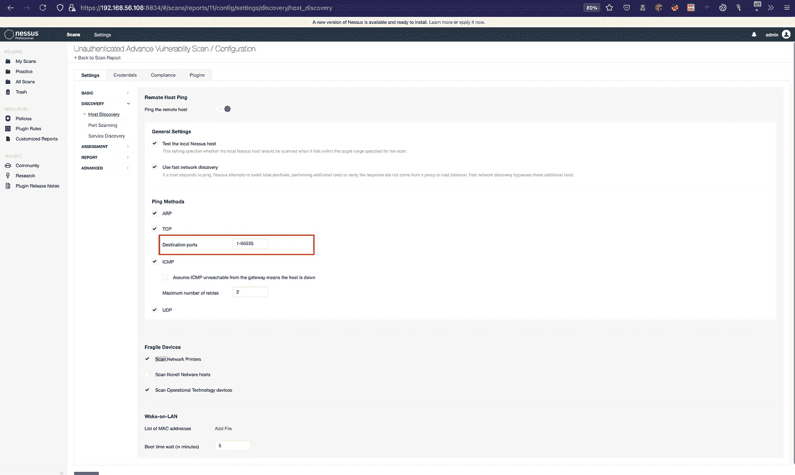

10.转到

取消勾选`Consider unscanned port as closed`。

> [将未扫描的端口视为关闭禁用端口](https://docs.tenable.com/nessus/Content/DiscoverySettings.htm#PSLocalPortEnumerators)
> 
> 启用后，如果某个端口未被选定的端口扫描器扫描(例如，该端口不在指定范围内)，扫描器会将其视为关闭。
> 也将`Local Port Enumerators`保留为默认值，因为如果 Nessus 可以通过 ssh 运行`[system commands](https://docs.tenable.com/nessus/Content/DiscoverySettings.htm)` [它就可以工作(启用时，扫描器使用 netstat 检查本地机器的开放端口。它依赖于通过 SSH 连接到目标的 netstat 命令。该扫描适用于基于 Linux 的系统，需要身份验证凭据。)或 WMI 或 SNMP(如果在`Credentials`中配置的话)。](https://docs.tenable.com/nessus/Content/DiscoverySettings.htm)

然后对于`Network Port Scanners`，选择`TCP`、`SYN`、`UDP`然后选择**超越自动防火墙检测** > **使用主动检测**。

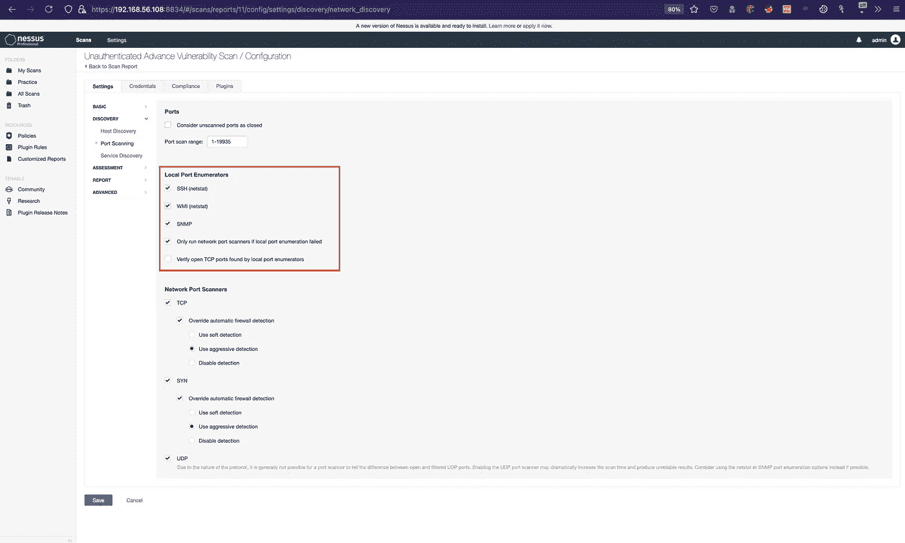

11.然后切换到`[Service Discovery](https://127.0.0.1:8834/#/scans/reports/11/config/settings/discovery/service_discovery)`，在`General Settings`中选择`Probe all ports to find the service`并启用`Search for SSL/TLS/DTLS`服务，选择如下图所示的值。同时选择`Enumerate all SSL/TLS ciphers`和`Enable CRL Checking`(证书撤销检查)。

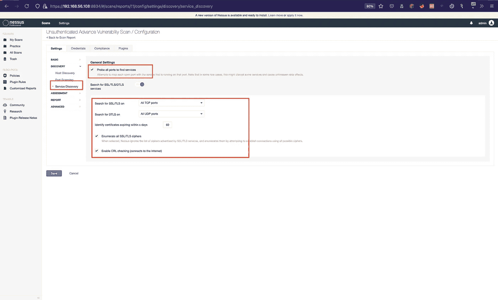

12.然后切换到`ASSESSMENT`，然后在`General`的`Accuracy`中选择`Override normal accuracy`并选择`show pontential false alarms`，同时选择`Perform thorough tests`。将其余部分保留为默认值。

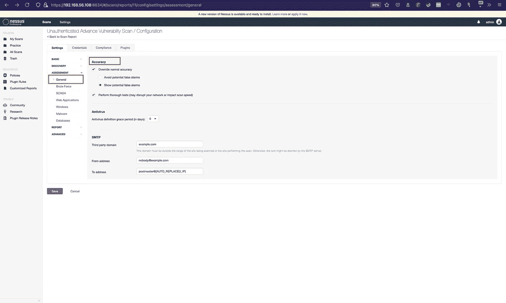

13.然后切换到`Brute Force`，在`General Settings`中取消勾选`Only use credentials provided by the user`。然后根据类型选择值并扫描。如果在扫描过程中提供了其他凭据，请填写详细信息或保留默认值。

> 启用`Hydra`将会减慢扫描速度。

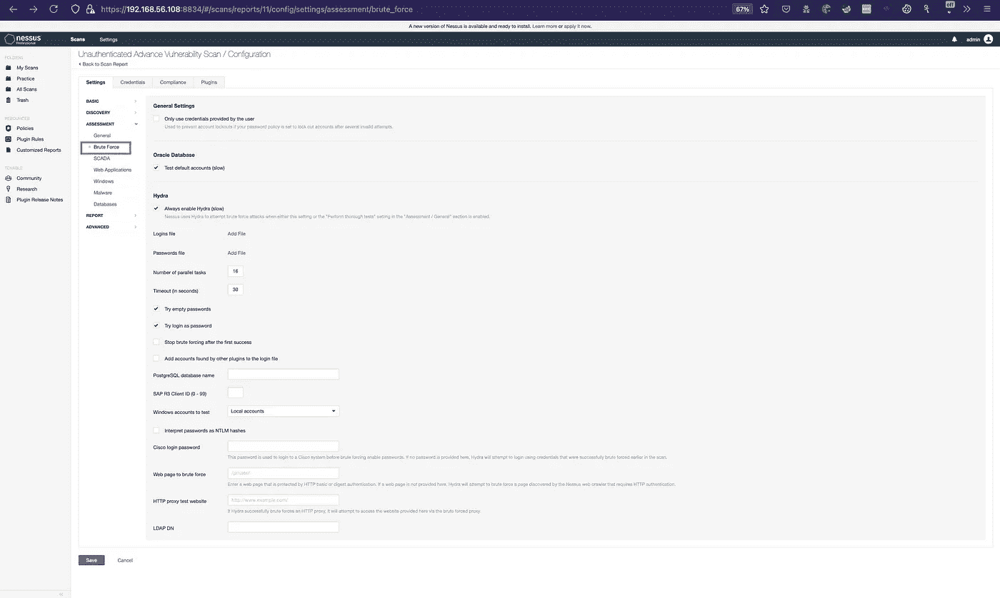

14.然后切换到`Web Applications`并启用`Scan web applications`。然后更新`Maximum depth to crawl` : 30(最大爬行，根据需要更改)。
选择`Follow dynamically generated pages`。然后`Application Test Settings`填写下面快照中提到的详细信息。

> 仔细检查并根据需要选择，或者使用提到的值。
> 进行更改时请小心，因为这会降低扫描速度。

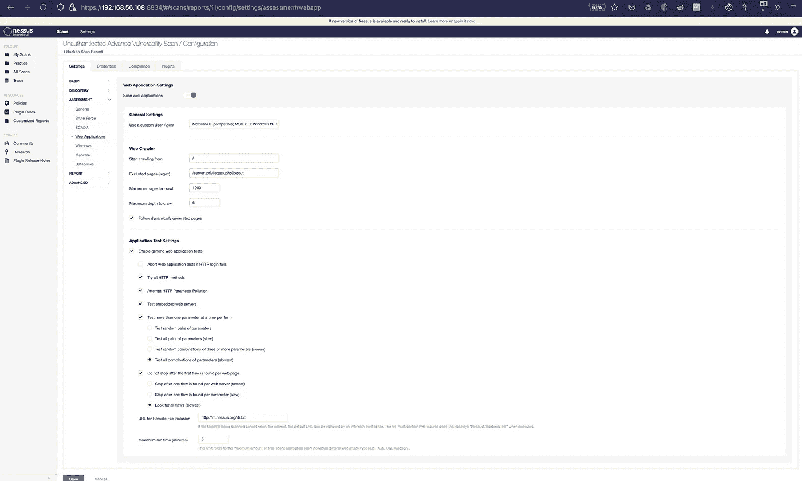

15.然后切换到`Windows`并启用`General Settings`。

> 这可以在禁用 windows 操作系统 else 标记的情况下使用。

16.然后切换到`Malware`并启用/禁用`Malware Settings`。因为我们不通过`SSH`登录，我们可以保持禁用，否则只需启用它。这将启用额外的插件，并增加扫描时间。

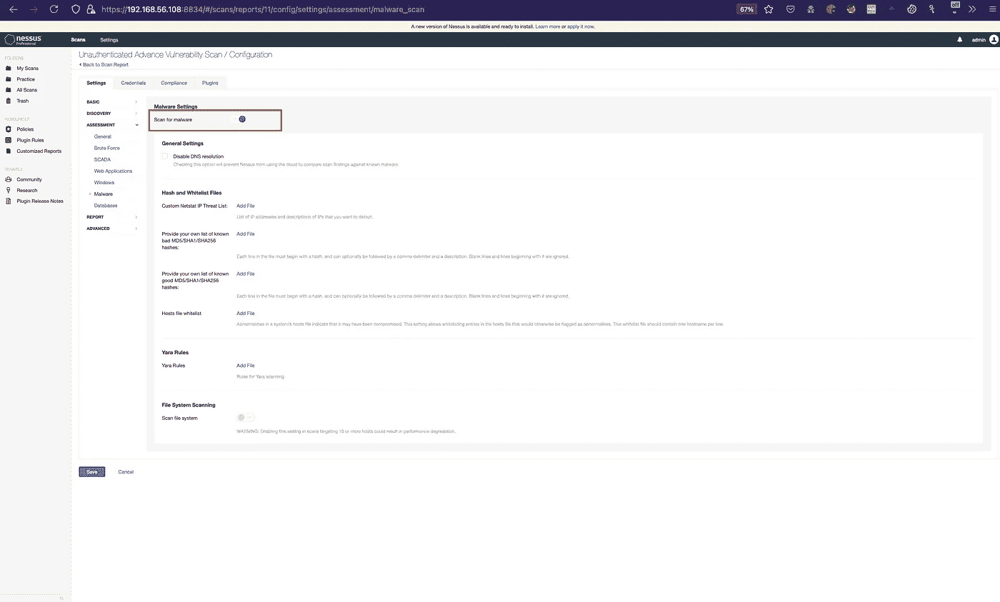

17.然后让`Databases`保持默认，因为我们不处理它。

18.切换到`REPORT`启用`Processing`，选择`Override normal verbosity` > `Report as much information as possible`。
同时选择`Output`，如下图所示。

> 确保启用`Display unreachable hosts`,因为这将出现在报告中，否则如果有任何主机不可达且未扫描，将不会有任何信息。

19.切换到`ADVANCED`并启用快照中的`General Settings`。

确保启用`Debug Settings`。

20.然后保存扫描并离开`Credentials, Compliance and Plugins`。

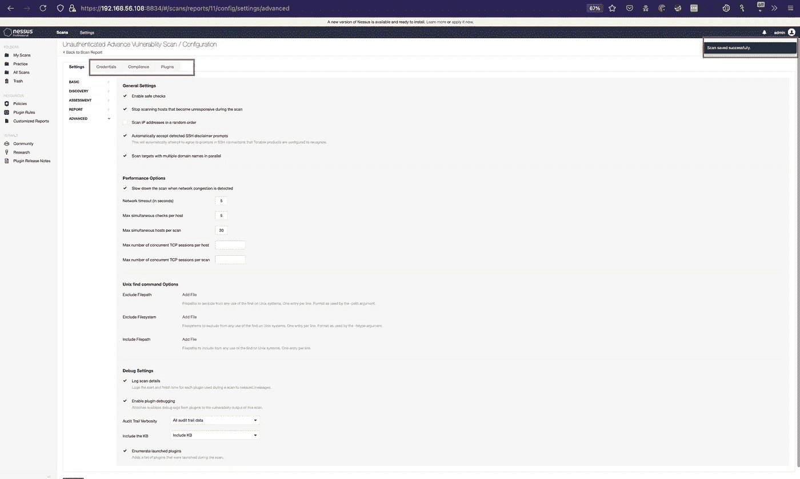

21 切换回`All Scans`并启动扫描。

> 瞧啊。！扫描已经开始。

***注:*** 这不是官方博客，提到的这些设置可能会改变。根据安装的插件和运行的应用程序，结果可能会有所不同。**这不是最佳做法，可以作为执行高级扫描的参考。请访问网站阅读** [**文档**](https://docs.tenable.com/nessus/Content/Scans.htm) **。**

> ***免责声明:*未经所有者事先同意，请勿对生产环境执行 Nessus 扫描。所有提供的信息仅用于教育目的。本页面上与道德黑客和信息安全相关的信息无意被恶意/非法使用，作者对所提供信息的任何误用概不负责。**

