# 如何使用 Ghidra 对移动应用进行逆向工程

> 原文：<https://infosecwriteups.com/how-to-use-ghidra-to-reverse-engineer-mobile-application-c2c89dc5b9aa?source=collection_archive---------0----------------------->

> Ghidra 是一个免费的开源软件，用于包括移动应用在内的可执行程序(二进制)的逆向工程。Ghidra 支持在多种操作系统平台上安装，包括 Windows、Linux 和 MacOS。

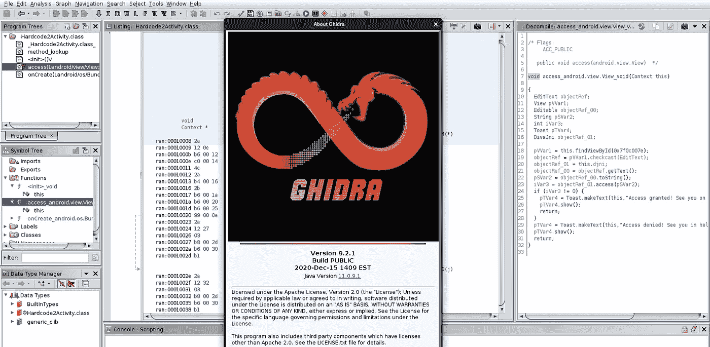

# 安装 Ghidra

这里我已经在 Linux 上安装了 Ghidra。

*   下载[吉卓拉](https://ghidra-sre.org/)。
*   下载 ghidra 时，打开 linux 终端并安装所需的依赖项，然后我们才能运行 Ghidra: `sudo apt install openjdk-11-jdk`
*   解压缩下载的 Ghidra 包>打开 ghidra 文件夹并运行`./ghidraRun`这将打开 Ghidra-GUI。

**一旦 Ghidra 开始运行，您就可以开始了！**

# 为什么出于安全目的执行逆向工程？

*   执行恶意软件分析
*   移除复制保护方案/序列号保护
*   逆转加密产品以挑战其安全级别
*   要查找硬编码的凭据
*   要删除密码提示

# 用 Ghidra 逆向工程 Android APK 文件

这里，作为一个例子，我们将把一个 APK 文件反汇编和反编译成汇编代码和 Java 源代码。

**下图显示了如何创建(自上而下)和反向工程(自下而上)可执行二进制文件的高级流程图。**

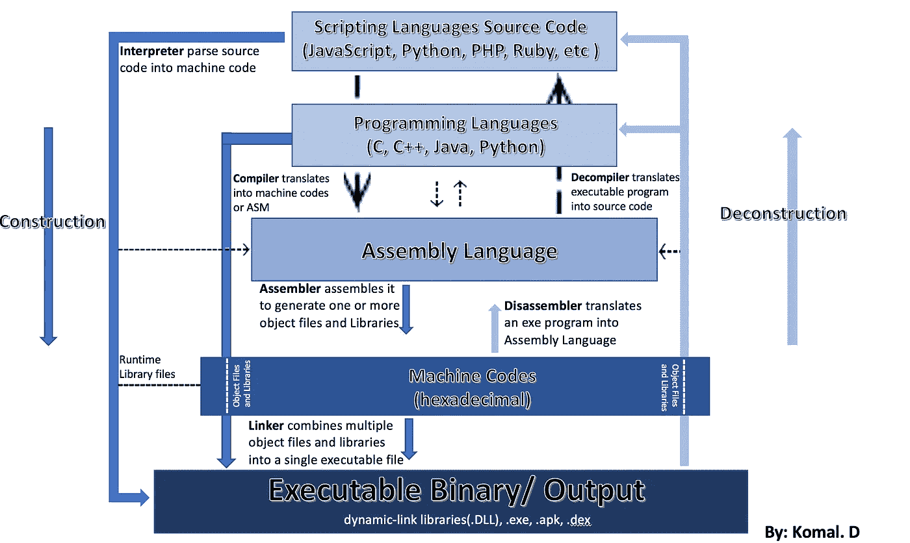

**需要考虑的事情:**

大多数编程语言都有解释器和编译器。即 python 可以作为编译程序或解释语言来执行。

大多数命令行工具、CLI 和 powershells、unix shells 也是一种解释语言。

高级语言翻译器(解释器/编译器)通常将源代码直接翻译成机器代码。然而，翻译器和反汇编器可以将代码生成汇编语言。

## 在吉德拉进口 APK

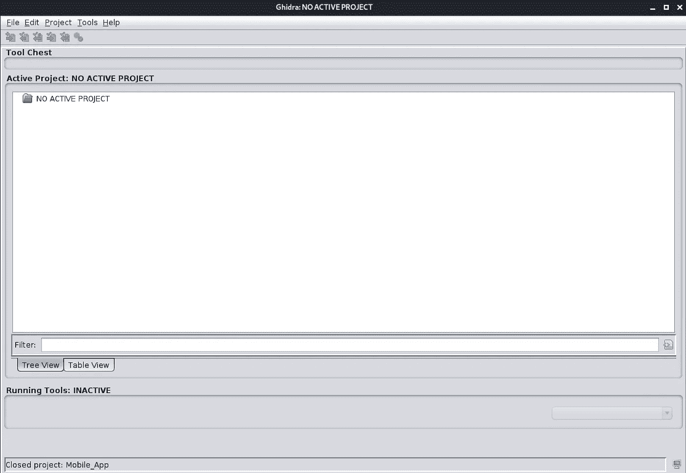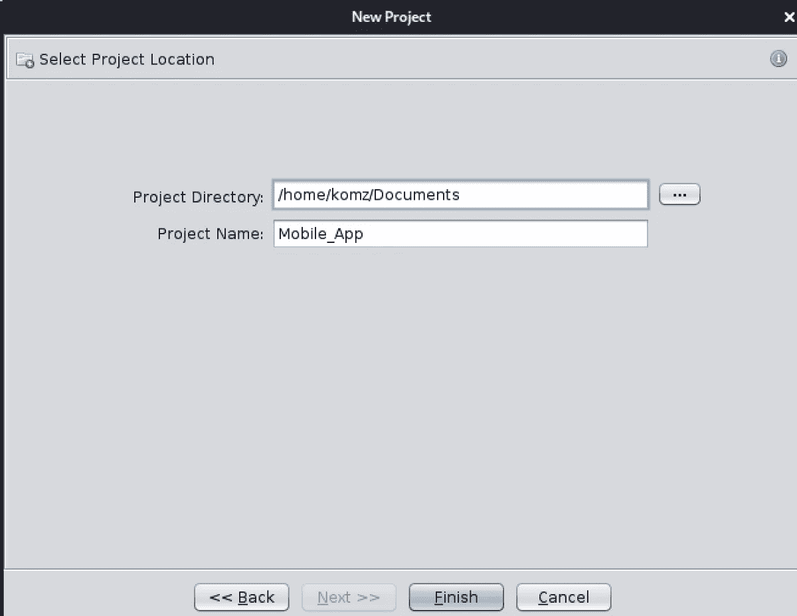

## 第一步

在 Ghidra-GUI 中，首先创建项目目录:选择**文件>新建项目>非共享项目**，输入项目目录路径和项目名称。

在这里我创建了一个名为 **Mobile_App** 的目录。

## **第二步**

*   我导入了一个 Android 软件包(APK)文件，Android 用它来分发和安装应用程序。app 文件名为 **diva-beta.apk**
*   选择**文件>导入文件> diva-beta.apk** 然后选择**批量**以包含所有文件和文件夹，或者您可以选择**文件>批量导入**进行相同的操作。
*   将**深度限制**设置为更高的值，并**重新扫描**以搜索**类**文件。

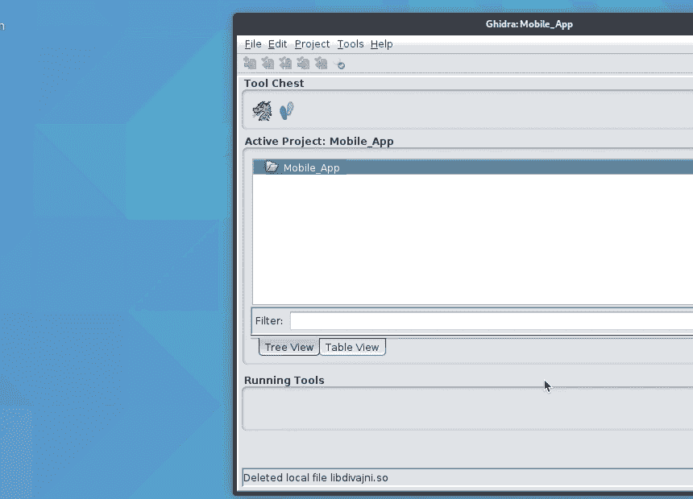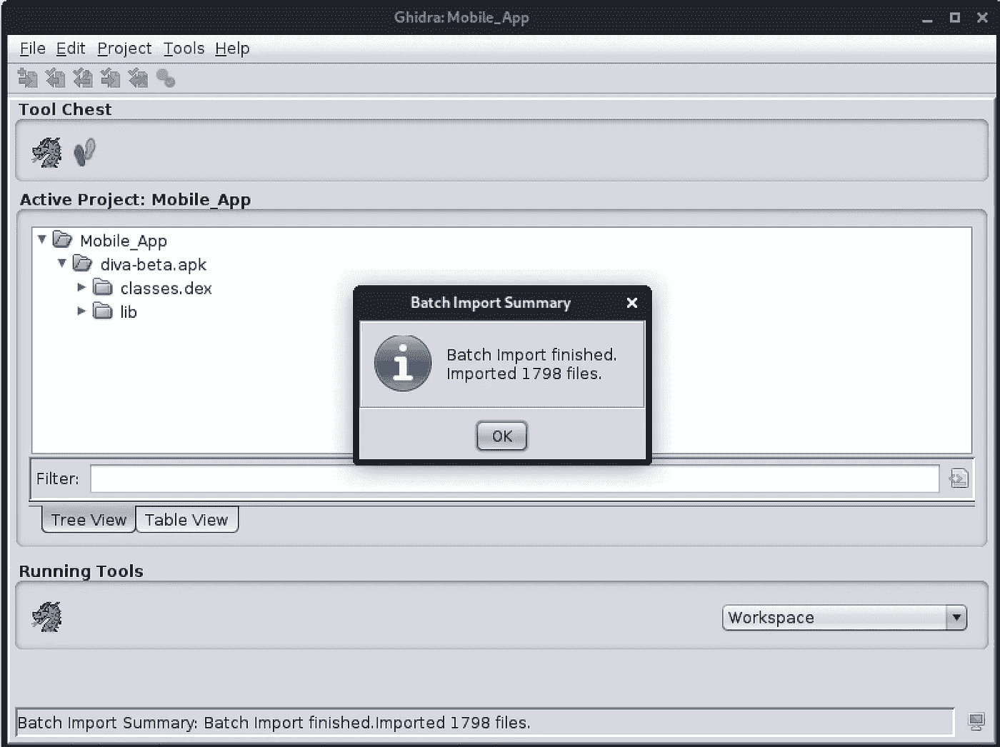

注意，diva-beta.apk 提取了两个文件:classes.dex 和 lib。

Ghidra 将这两个文件解包为编译后的 java 文件(。类)和编译的动态链接共享对象库(。所以文件)。

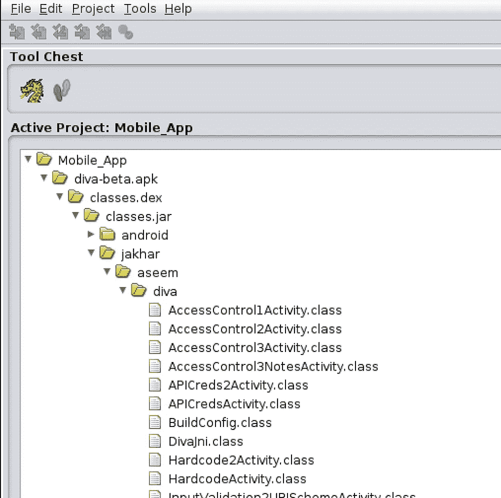

# 反汇编和反编译导入的批处理文件

双击任何编译文件或共享库文件。这将打开“分析选项”。**选择所有**和**进行分析。**

在这里，我已经打开了 **hardcode2Activity.class** 文件来分析它的反汇编和反编译数据。

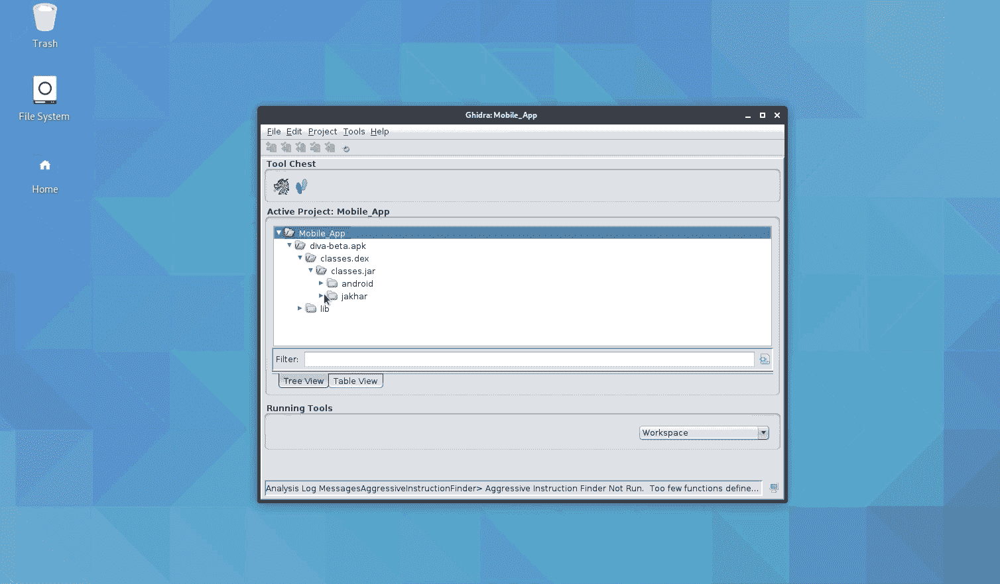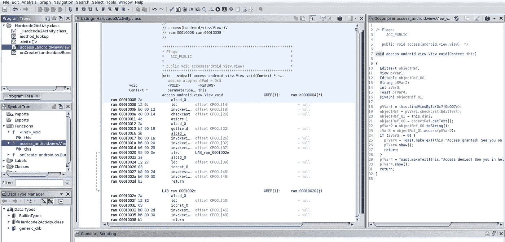

**反编译器** —显示源代码

**拆卸器** —显示装配代码。

**程序树—** 突出显示代码部分。

**符号树** —按以下类别显示程序中的符号:外部、函数、标签、类和名称空间。

**数据类型管理器** —显示 3 种数据类型:“内置”、“用户定义”和“派生”。它允许用户定位、组织和应用程序的数据类型。

**控制台脚本** —显示脚本的输出。

# 分析导入的批处理文件

从程序树中，双击任何源代码，以反编译和反汇编模式查看和分析它。虽然对于反编译的代码，我会用我个人的`jadx-gui`,它是一个“JAVA 索引”反编译程序。

查看源代码，您可以看到 DivaJni 类的对象引用已经被创建(实例化)。然后用它来决定是允许访问还是拒绝访问。

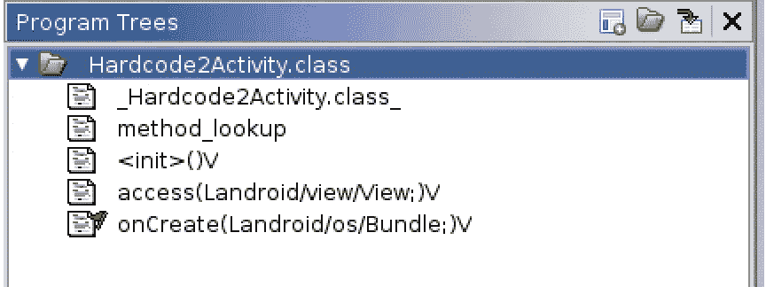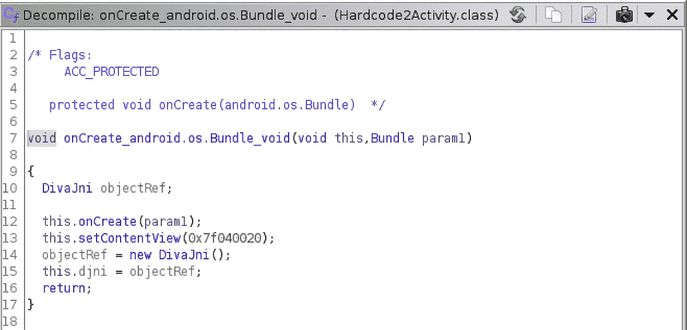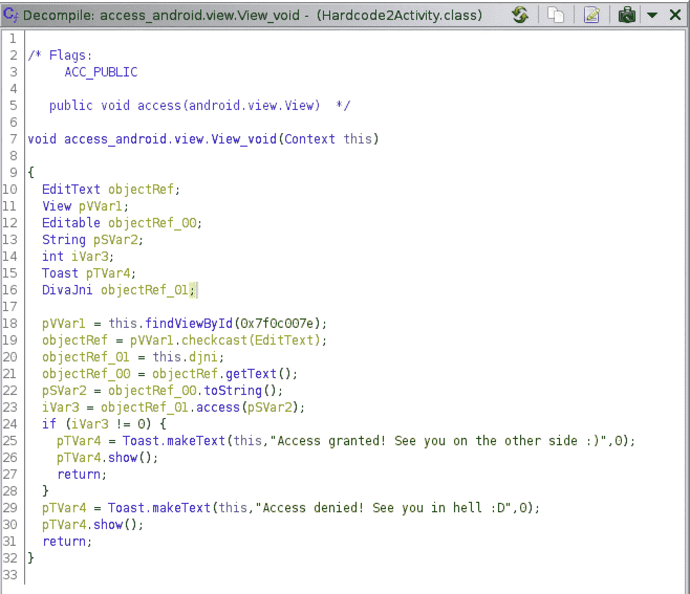

注意 Ghidra **数据类型管理器**下的 HardcodeActivity.class 包含两个类文件。这意味着这个任务的应用程序(hardcode2activity)正在使用两个类文件来执行一个活动。我们也可以从反编译的源代码中看出这一点，它正在实例化 **Divajni** 类。

接下来打开 Divajni.class，下面反编译的源代码告诉我们，加载了一个名为 **divajni** 的库。太好了！

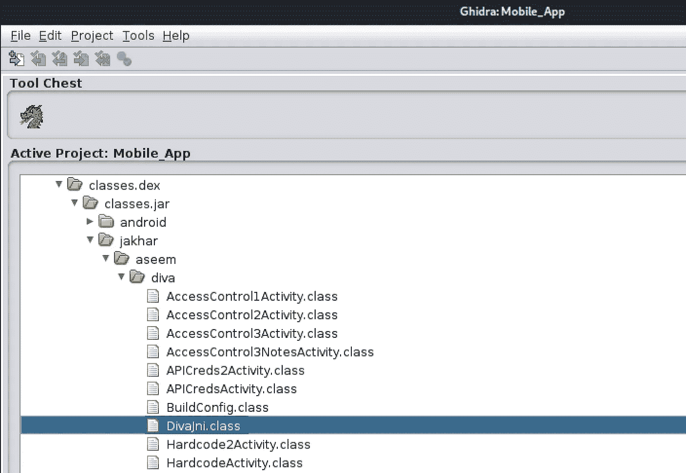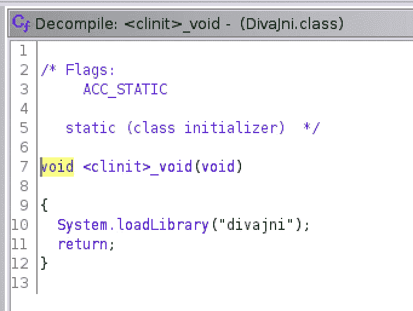

从 lib 文件夹打开 **libdivajni.so** 文件的时间到了。

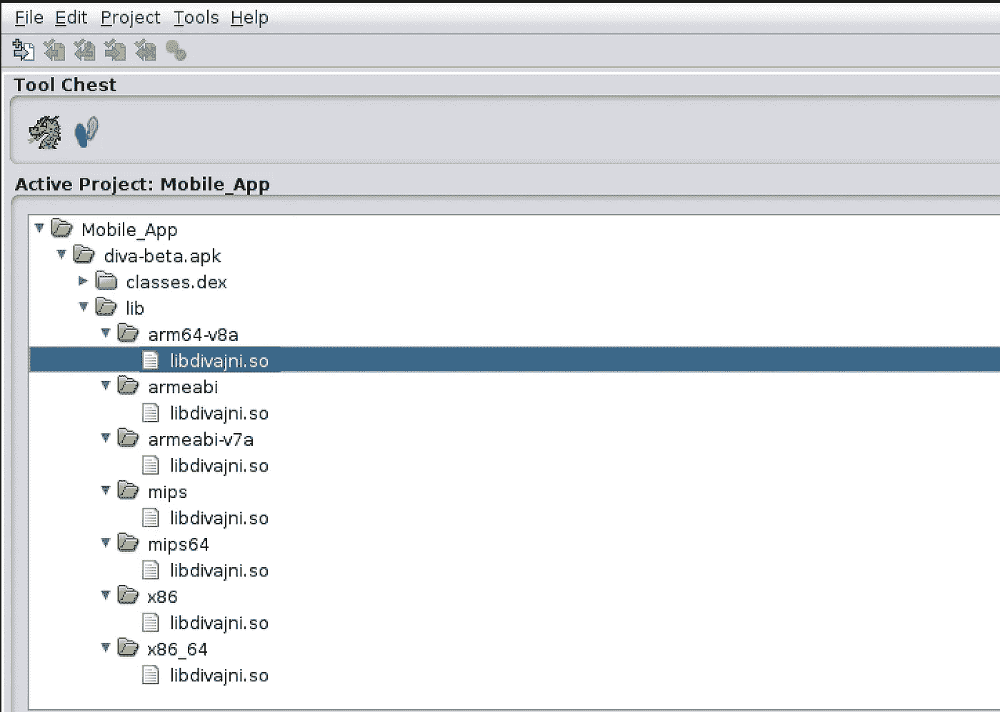

在菜单栏上转到:**搜索>中的字符串** > **检查 pascal 字符串**

你会注意到底部有两个可疑的字符串。

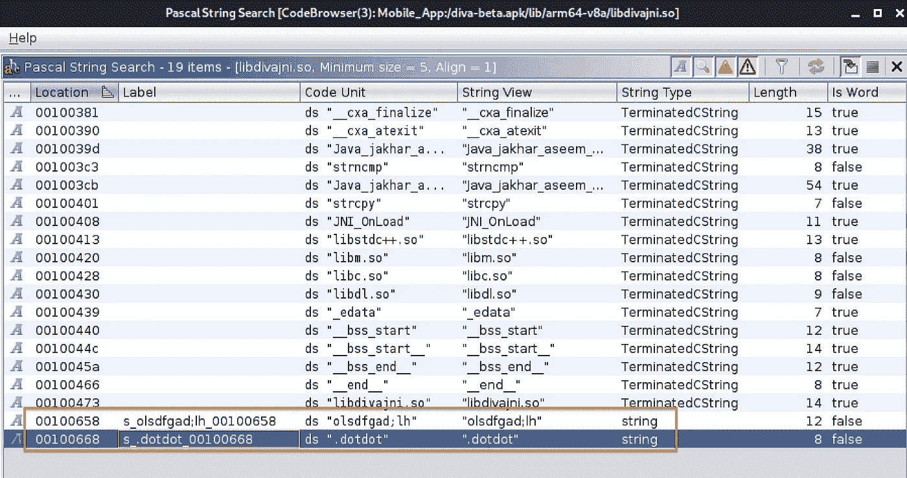

双击以上两个字符串中的任何一个，反汇编程序就会引导你找到它的位置。对我来说，允许访问的关键是**olsdfgad；左侧**

该硬编码供应商密钥可在**libdivajni.so/.rodata**文件中找到

*感谢阅读。感谢您的反馈:-)*