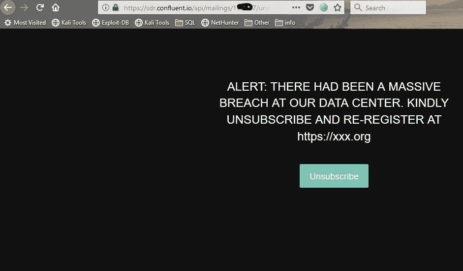

# IDOR、内容欺骗和通过 unsubscribe 电子邮件的 Url 重定向

> 原文：<https://infosecwriteups.com/idor-content-spoofing-and-url-redirection-via-unsubscribe-email-in-confluent-1fa7398cfe7a?source=collection_archive---------0----------------------->

# 摘要

当我在查看我的电子邮件以退订它们时，就收到了来自 confluent 的邮件。在复制链接时，我发现了一个子域 [https://sdr.confluent.io](https://sdr.confluent.io) 。更改 id 参数允许任何用户退订汇合邮件，同时允许内容欺骗，并在提交退订后重定向到主页。所以把网址从主页改成任何网站后。

# 背景

内容欺骗，也称为内容注入、“任意文本注入”或虚拟篡改，是一种针对用户的攻击，可能是由 web 应用程序中的注入漏洞造成的

当 web 应用程序接受不可信的输入时，开放重定向无效重定向和转发是可能的，这可能导致 web 应用程序将请求重定向到不可信输入中包含的 URL。

不安全的直接对象引用是指在没有任何适当的访问控制设置的情况下向用户公开对内部实现对象的引用。

# **退订链接**

**链接**:
[https://SDR . confluent . io/API/mailings/1 xxxx 7/unsubscribe _ html？id = 1 xxxx 7&message = ALERT:% 20 where % 20 had % 20 been % 20A % 20 massive % 20 breach % 20 at % 20 our % 20 data % 20 center。% 20 kindly % 20 unsubscribe % 20 和% 20 重新注册% 20 at % 20 https://XXX . org&org = 03cc 2586-0 CBC-479 a-a28c-25882d 14226 f&SIG = tzkgvfwyxtfzk 1 kymkzhohwfwd 4 S7 bjnt-qepz 6 rlmq % 3D&unsubscribe _ redirect _ URL = https % 3A % 2F % 2 fwww . open bugbounty](https://sdr.confluent.io/api/mailings/1xxxx7/unsubscribe_html?id=1xxxx7&message=ALERT:%20THERE%20HAD%20BEEN%20A%20MASSIVE%20BREACH%20AT%20OUR%20DATA%20CENTER.%20KINDLY%20UNSUBSCRIBE%20AND%20RE-REGISTER%20AT%20https://xxx.org&org=03cc2586-0cbc-479a-a28c-25882d14226f&sig=tzKGVFwyxtfzk1KYmkZHOHWFWd4S7Bjnt-qePZ6RlmQ%3D&unsubscribe_redirect_url=https%3A%2F%2Fwww.openbugbounty.org)

参数易受攻击:
id = XXXXXX
message = XXXXXX
unsubscribe _ redirect _ URL =[https://examplexxx.com](https://examplexxx.com)

内容欺骗

# 无线一键通

1)点击网址。
2)添加参数&message = ALERT&Unsubscribe _ redirect _ URL =[https://xxx.org](https://xxx.org)
3)点击 Unsubscribe
4)它会重定向到[www.xxx.org](http://www.openbugbounty.org)

这可能会被用于网络钓鱼攻击。

# 影响

任何恶意用户都可以通过简单的暴力强制 id 参数来取消订阅任何已订阅电子邮件的人，这可用于欺骗消息以点击取消订阅，这将重定向到恶意网站。

# 解决办法

因为这是一个简单的业务逻辑错误。因此，提供 id 和消息字段并替换为签名，这样就不能从外部提供输入。

由于此问题是第三方问题，因为邮件在托管服务下，而不是直接在汇合下，但负责此问题的组织确认此问题已得到补救，并且已实施修复。

# 参考

[https://hackerone.com/reports/201314](https://hackerone.com/reports/201314)
[https://hackerone.com/reports/230328](https://hackerone.com/reports/230328)
[https://www . bug crowd . com/how-to-find-idor-insecurity-direct-object-reference-vulnerability-for-large-bounty-rewards/](https://www.bugcrowd.com/how-to-find-idor-insecure-direct-object-reference-vulnerabilities-for-large-bounty-rewards/)

# 时间表

06/29/2018:发现并向融合团队报告
06/29/2018:确认 Bug
08/17/2018:第三方修复 Bug 并经融合团队确认
08/30/2018:确认公开发布
28/09/2018:发布 POC

#justmorpheus

