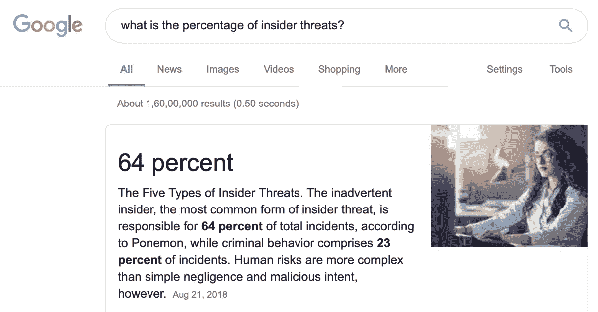
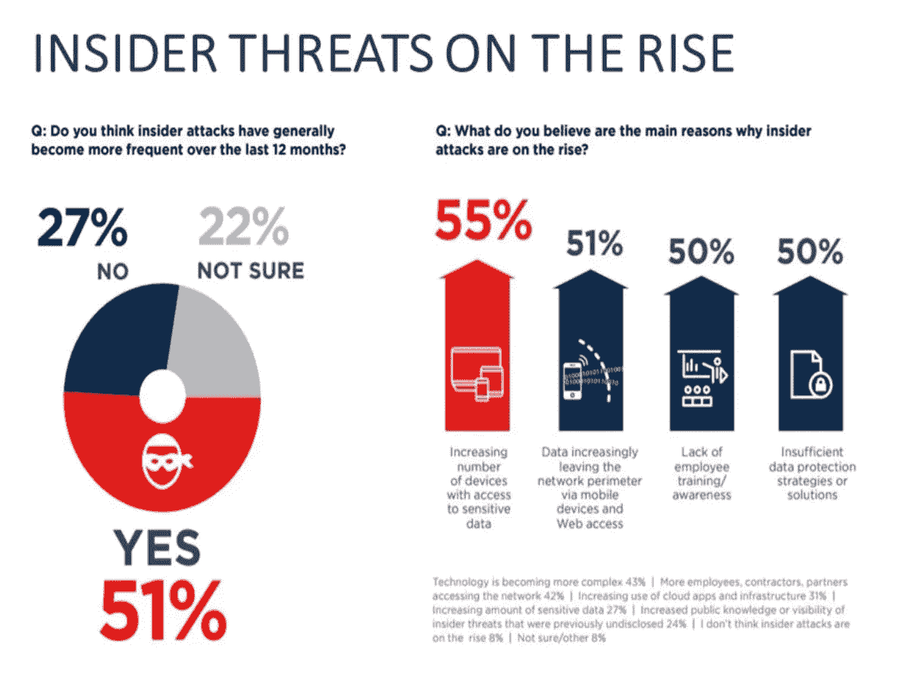
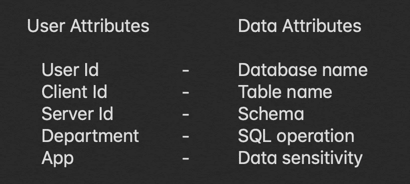

# 内部威胁-重要性和预防

> 原文：<https://infosecwriteups.com/insider-threats-importance-prevention-2a5b6a55264b?source=collection_archive---------0----------------------->

我即将完成大学学业，一直忙于参加和申请工作面试。我会说，我在红队中相当不错，与防御相比，我更关注网络安全的攻击方面。在进行这些工作面试时，我意识到公司正在为他们的蓝队寻找更多的人员，并努力提高他们的安全性。这些公司中的大多数都有一些关于他们将如何保护他们的网络免受外部恶意黑客攻击的请求和计划，但有一件事对我来说是独一无二的，这是我从未关注过的，事实上我以前从未想过的，那就是“内部威胁”。

在过去的几个星期里，我一直在认真研究，试图了解在你们公司工作的人面临的威胁有多严重，我发现这是一个相当大的威胁。大多数网络安全专家，或者至少是那些刚刚起步的人，从来没有关注过这个方面。在研究恶意内部人员可能导致的危害时，我发现了一些令人难以置信的统计数据，这让我意识到这是一个多么大的威胁，但通常被那些刚开始参与红队活动的人忽视了，因为红队活动似乎非常可笑，人们将大部分时间花在了红队活动上。

对抗内部威胁是蓝色团队和信息安全防御团队最重要的部分之一。因此，我决定将此作为任何保护其基础架构的人都应该关注的要点，以及如何保护他们的组织免受那些试图从内部损害它的人的攻击。

# 让我们开始吧！

因此，我们需要采取的第一步是了解什么是内部威胁，我们需要非常清楚地确定这些人是谁，并对他们进行分类，以便我们能够正确地关注他们，并在以后处理他们。我将它们分为三大类，即妥协、粗心和恶意。受到损害的是那些可能点击了网络钓鱼链接、执行了恶意软件或做了损害其系统的事情的员工。粗心的员工是那些完成工作却不遵守规则、程序和政策的人。这些员工可能会记下他们的登录凭据并随意放置，或者可能会通过公共 wifi 访问重要数据。这些员工是未来最有可能受到威胁的人。接下来是最邪恶的员工，他们怀有恶意，想要伤害或损害他们工作的公司或组织。

既然我们已经关注了需要应对的人员类型，我们还需要了解为什么检测这些内部威胁是一项如此困难的任务。最普遍的原因是，这些员工拥有访问系统和数据的合法权限。接下来的问题是区分好的和坏的，在对数据库进行数百万次查询的情况下，分析哪个特定查询是坏的，哪个不是变得极其困难。他们面临的另一个问题是警报过载，如果策略编写不当，系统日志会生成大量警报，这些警报会发送到 SOC(安全运营中心),但这些警报从未得到真正正确的评估。最后一个问题是缺乏背景，因为通常一家公司可能有几十个不同的部门，网络安全团队必须处理所有这些部门，而他们对问题的来源知之甚少，因此不清楚如何解决问题。

# 了解违规行为

为了应对内部威胁，我们需要开始识别它们，这只能通过了解威胁媒介来实现，以便我们可以从一开始就抓住它们。我们需要将用户属性与数据属性关联起来，这样我们才能清楚地理解，某些用户参数的泄漏意味着某些数据属性的泄漏。

用户和数据属性之间的相互关系

为了了解何时可能发生违规，我们需要了解违规的行为/早期迹象，当我们记录违规的迹象时，违规就会发生。这些问题主要包括滥用服务帐户、可疑的应用程序数据访问、来自数据库的过多查询或大量失败的登录尝试。这些行为可以让我们知道有问题正在发生，需要调查。

# 如何阻止内部威胁？

在内部威胁的情况下，有几个问题我们需要知道答案，这样我们就可以找出谁是肇事者。

> -谁在连接数据库？
> 
> -他们用什么方法连接数据库？
> 
> -他们在访问什么数据？
> 
> -他们的同行访问的是同一组数据吗？
> 
> -他们查询了多少数据？

一旦我们对这些问题有了明确的答案，我们就可以将这些不同问题的结果结合起来，缩小范围，找出谁可能是内部攻击背后的原因，或者谁最有可能实施这种攻击，这可以帮助我们了解组织内部的趋势，并帮助您监视您的员工。你还可以记住其他几点来转移内部攻击。

1.  记录、监控和审计员工在线行动
2.  监控并快速应对可疑或破坏性行为
3.  记录员工活动并监控他们访问的内容
4.  防止卸载/下载大量数据
5.  实施端点数据泄漏保护，并妥善保护它们
6.  密切关注账户活动并定期进行权限检查
7.  宣传你的安全政策，让你的员工意识到这一点

您可以在您的组织中实施更多类似的步骤，完成这些主要步骤后，您可以在很大程度上降低内部威胁的可能性。

# 道德的

内部威胁对您的组织来说是极其危险和有害的，因为实施攻击的人确切知道您公司最重要的数据和文件在哪里，他们知道您有什么安全策略，也知道规避这些策略的方法。因此，为了控制内部威胁，请遵循上述政策并添加更多特定于您组织的规则，这将有助于您的组织免受内部威胁，并使外部恶意实体更难访问您的系统。

如果你喜欢，请鼓掌让我们合作吧。获取、设置、破解！

网址:【aditya12anand.com】T2|捐赠:【paypal.me/aditya12anand】T4

电报:[https://t.me/aditya12anand](https://t.me/aditya12anand)

推特:[twitter.com/aditya12anand](https://twitter.com/aditya12anand?source=post_page---------------------------)

领英:[linkedin.com/in/aditya12anand/](https://www.linkedin.com/in/aditya12anand/?source=post_page---------------------------)

电子邮件:aditya12anand@protonmail.com