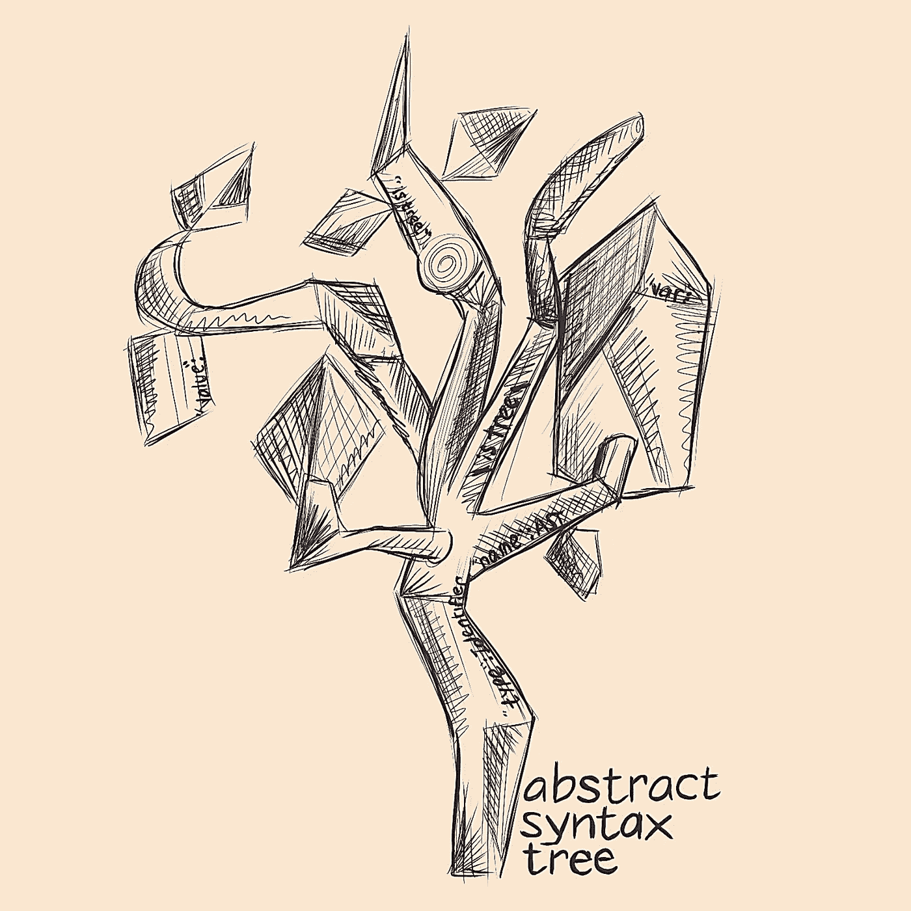

# 创建抽象语法树(AST)的 JavaScript 解析器:Acorn

> 原文：<https://infosecwriteups.com/javascript-parser-to-create-abstract-syntax-tree-ast-acorn-be9bbfe91bed?source=collection_archive---------5----------------------->



# 0.前言

JavaScript 解析器——Acorn 和 AST 是很有用的东西。它们帮助我们自动高效地编辑源代码。这篇文章向你展示了如何构建和编辑 JavaScript 代码的 AST。

这个帖子的出处是: [JavaScript 解析器创建抽象语法树(AST): Acorn — Pwn 作者 Kenny](https://pwnbykenny.com/2020/07/21/javascript-parser-to-create-abstract-syntax-treeast-acorn/) 。更多类似内容，可以访问这里:[博士&自动开发 JIT 编译器— Pwn 作者肯尼](https://pwnbykenny.com/)。这是我的个人网站。欢迎光临！

# 1.内容

*   [安装 JavaScript 解析器— Acorn](https://pwnbykenny.com/2020/07/21/javascript-parser-to-create-abstract-syntax-treeast-acorn/#install)
*   [使用 Acorn 创建抽象语法树](https://pwnbykenny.com/2020/07/21/javascript-parser-to-create-abstract-syntax-treeast-acorn/#create)
*   [理解抽象语法树的结构](https://pwnbykenny.com/2020/07/21/javascript-parser-to-create-abstract-syntax-treeast-acorn/#structure)
*   [使用 Node.js 遍历抽象语法树](https://pwnbykenny.com/2020/07/21/javascript-parser-to-create-abstract-syntax-treeast-acorn/#traverse)
*   [总结](https://pwnbykenny.com/2020/07/21/javascript-parser-to-create-abstract-syntax-treeast-acorn/#summary)

# 2.安装 JavaScript 解析器— Acorn

引用 github [库](https://github.com/acornjs/acorn)的话，Acorn 是一个小型快速的 JavaScript 解析器，完全用 JavaScript 编写，在 MIT 许可下发布。Acorn 可以为 JavaScript 代码生成抽象语法树。它有 3 个模块:名为“acorn”的主 JavaScript 解析器，名为“acorn-loose”的容错解析器，名为“acorn-walk”的语法树遍历器。这篇文章主要关注主解析器。在本节中，我们将介绍它的安装。

安装很容易。你只需要在 Linux 终端运行这个命令:“npm install acorn”。然后，您将看到在当前目录中创建了一个名为“node_modules”的文件夹。并且你会在这个目录下看到可执行的 acorn 文件:“node_modules/acorn/bin/”。下一节将介绍如何使用它。

# 3.使用 Acorn 创建 AST

我们将在这个目录下创建一个名为“hello.js”的 JavaScript 文件:“node_modules/acorn/bin/”。这个文件的内容是" var str = ' hello"。接下来，我们在终端中运行这个命令:“acorn hello.js”。然后，您将在终端中看到一个输出。输出是 hello.js 中 JavaScript 代码的 AST。

```
{
  "type": "Program",
  "start": 0,
  "end": 19,
  "body": [
    {
      "type": "VariableDeclaration",
      "start": 0,
      "end": 18,
      "declarations": [
        {
          "type": "VariableDeclarator",
          "start": 4,
          "end": 17,
          "id": {
            "type": "Identifier",
            "start": 4,
            "end": 7,
            "name": "str"
          },
          "init": {
            "type": "Literal",
            "start": 10,
            "end": 17,
            "value": "hello",
            "raw": "'hello'"
          }
        }
      ],
      "kind": "var"
    }
  ],
  "sourceType": "script"
}
```

# 4.理解 AST 的结构

本节使用第 3 节中的 AST 作为示例。AST 最重要的是它的节点。毕竟，树是由节点组成的。在上面的 AST 中，每个节点都以“{”开头，以“}”结尾。根据节点类型的不同，每个节点的结构也略有不同。

但是所有节点的共同点是它们都有三个属性:类型、开始和结束。“类型”属性指示节点的类型。例如，它可以是“标识符”,这意味着节点保存了一个变量名或函数名等。“开始”和“结束”属性指示节点在源代码中的开始和结束位置。例如，“标识符”节点保存名称“str”。在源代码中，该名称从第 4 个(闭)字符开始，到第 7 个(开)字符结束:

```
v a r   s t r   =   '  h  e  l  l  o  '  ;
0 1 2 3 4 5 6 7 8 9 10 11 12 13 14 15 16 17
```

除了这 3 个属性之外，其他属性取决于节点类型。例如,“标识符”节点有一个属性“名称”,因为它记录了一个名称。“Literal”节点有两个附加属性“value”和“raw ”,因为它记录字符串、数字等文字。节点类型太多，无法在此列出。但是您总是可以通过使用 acorn 解析一些 JavaScript 代码来找出节点类型的结构，就像 hello.js 示例一样。你会在 AST 中找到这个结构。

理解了节点的结构之后，您可以通过访问每个节点的属性来遍历 AST。每个节点通过其属性连接到其子节点。下一节给出了一个如何遍历 AST 的例子。

# 5.使用 Node.js 来遍历 AST

万一你不知道 Node.js，我给你简单描述一下。Node.js 是一个 JavaScript 解释器。它建立在 v8 之上。Node.js 和 v8 的区别在于，v8 运行在浏览器(前端)，而 Node.js 运行在服务器(后端)。安装 Node.js 后，可以用它来执行 JavaScript 代码，像这样:node hello.js。

在这一节中，我将给出一些代码来遍历第 3 节中的 AST。这只是一个简单的例子，让你知道遍历是如何工作的。代码保存在“node_modules/acorn/bin/”目录下名为“ast.js”的文件中，由 Node.js 使用以下命令执行:node ast.js。

```
class Visitor {
  /* Deal with nodes in an array */
  visitNodes(nodes) { for (const node of nodes) this.visitNode(node); }
  /* Dispatch each type of node to a function */
  visitNode(node) {
    switch (node.type) {
      case 'Program': return this.visitProgram(node);
      case 'VariableDeclaration': return this.visitVariableDeclaration(node);
      case 'VariableDeclarator': return this.visitVariableDeclarator(node);
      case 'Identifier': return this.visitIdentifier(node);
      case 'Literal': return this.visitLiteral(node);
    }
  }
  /* Functions to deal with each type of node */
    visitProgram(node) { return this.visitNodes(node.body); }
    visitVariableDeclaration(node) { return this.visitNodes(node.declarations); }
    visitVariableDeclarator(node) {
      this.visitNode(node.id);
      return this.visitNode(node.init);
    }
    visitIdentifier(node) { return node.name; }
    visitLiteral(node) { return node.value; }
}/* Import necessary modules */
var acorn = require('acorn');
var fs = require('fs');
/* Read the hello.js file */
var hello = fs.readFileSync('hello.js').toString();
/* Use acorn to generate the AST of hello.js */
var ast = acorn.parse(hello);
/* Create a Visitor object and use it to traverse the AST */
var visitor = new Visitor();
visitor.visitNode(ast);
```

代码中的注释很清楚。如果您将代码与第 3 节中的 AST 进行比较，您会发现它很容易理解。

# 6.摘要

这篇文章介绍了如何使用 JavaScript 解析器 acorn 创建 JavaScript 程序的抽象语法树，以及如何使用 Node.js 遍历抽象语法树。请把所有文件放在这个帖子指定的目录下。否则，系统可能找不到路径。如果你喜欢这个帖子或者觉得有用，请帮我分享到你的社交媒体上~谢谢！

这篇帖子来自这里: [JavaScript 解析器创建抽象语法树(AST): Acorn — Pwn 作者 Kenny](https://pwnbykenny.com/2020/07/21/javascript-parser-to-create-abstract-syntax-treeast-acorn/) 。更多类似内容，可以访问这里:[博士&自动开发 JIT 编译器— Pwn 作者肯尼](https://pwnbykenny.com/)。这是我的个人网站。欢迎光临！