# 实验室设置— ModSecurity || Apache 作为反向代理||生成并安装自签名 SSL 证书| | AltoroJ | |[demo.testfire.net]

> 原文：<https://infosecwriteups.com/lab-setup-modsecurity-apache-as-reverse-proxy-generate-install-self-signed-ssl-a588cee61d4a?source=collection_archive---------0----------------------->

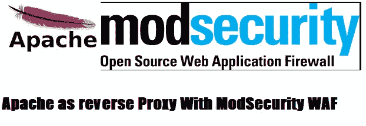

# 答:将 Apache 配置为反向代理，应用程序[demo.testfire.net]应该可以通过配置的 Apache 经由本地主机条目访问。

互联网(Web 客户端)— ->带 Modsecurity 服务的 Apache 反向代理— -> Web 服务器

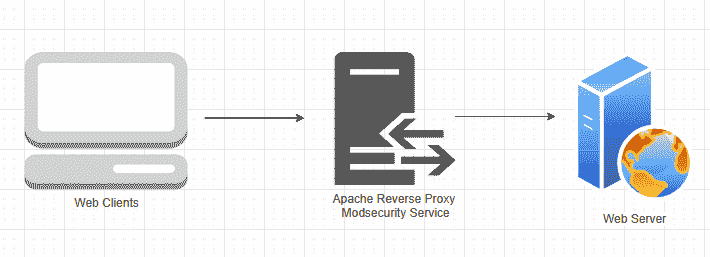

A-1.1 —安装 Apache 并将其配置为反向代理

反向代理:反向代理接受来自客户机的请求，将其转发给能够完成该请求的服务器，并将服务器的响应返回给客户机。

反向代理可以通过消除对后端服务器的直接互联网访问来隐藏后端服务器的拓扑和特征。

A-1.2 安装和配置的应用程序—demo.testfire.net

安装步骤如下:

1.为应用程序下载 AltoroJ(demo.testfire.net)

【https://github.com/HCL-TECH-SOFTWARE/AltoroJ】设置 Github 链接:

**先决条件:**

AltoroJ 是使用 Eclipse 开发的，设计为在 Tomcat 7 上运行，但由于它是一个相对简单的 J2EE 应用程序，将其移植到不同的 J2EE IDE 或另一个 J2EE web 应用服务器应该很容易。以下是现成的要求:

*   推荐 Eclipse 4.6 或更新版本(需要 Java 8)
*   Tomcat 7.x — Tomcat 提供了一个“纯 Java”HTTP web 服务器环境，Java 代码可以在其中运行。
*   Gradle 的 Buildship Eclipse 插件可以自动下载所需的第三方库，并在 Eclipse 中运行 AltoroJ 安装 Buildship 的最简单方法是从 Eclipse Marketplace(在 Eclipse 中，进入 Help -> Eclipse Marketplace)

安装 Altotoj 应用程序

1.  安装 Java JDK 8-sudo apt-get 安装 openjdk-8-jdk
2.  下载并安装 Apache Tomcat 7
3.  面向企业 Java 和 Web 开发人员的 Eclipse IDE
4.  我的 eclipse 版本的默认 JRE 是 15——为了在 AltoroJ 中使用它，我们需要更改它，并将其指向我们刚刚安装的 JDK 1.8。

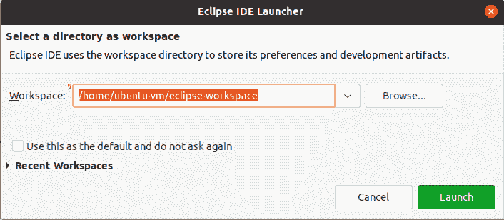

5.转到窗口->首选项

6.在右侧，单击添加按钮>选择以添加标准虚拟机

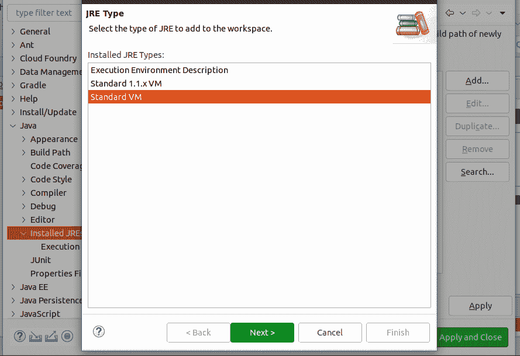

7.单击目录并指向先前安装 Open JDK 1.8 的 usr 目录。Eclipse 应该会自动找到 JVM 并添加所需的 jar，如下所示

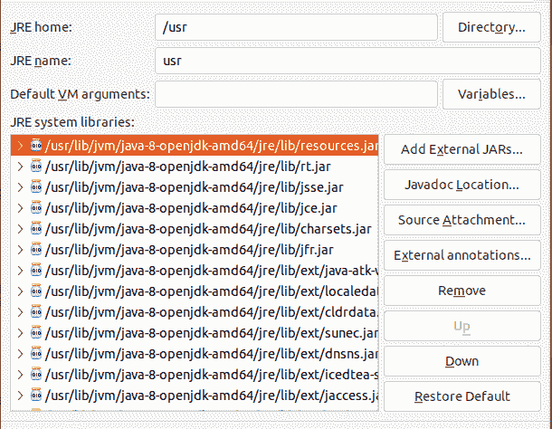

8.选中它 usr，使其默认，如下所示

9.配置 Apache Tomcat 7

转到窗口->首选项->服务器->运行时环境

单击添加>选择 Apache Tomcat 7.0

10.指向安装目录(我们为 Tomcat 提取 tar.gz 的位置)

11.从 GitHub 导入 AltoroJ 项目

从 Git 进入文件->导入-> Git ->项目

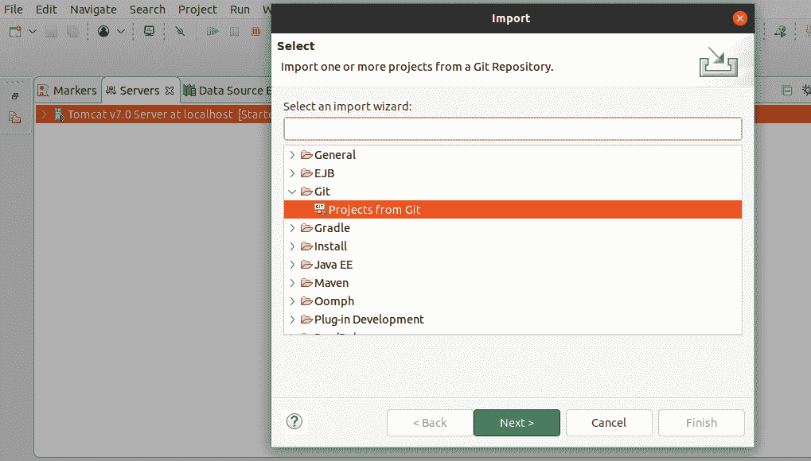

选择“克隆 URI”并在下一个屏幕上使用以下 URI:

继续执行向导，不做任何更改，直到进入项目导入向导。此时，选择“导入现有的 Eclipse 项目”,然后继续完成向导

**运行 AltoroJ —应用程序—demo.testfire.net**

*   在 Eclipse 的项目浏览器中右键单击您的 AltoroJ 项目
*   选择运行方式->在服务器上运行

*   选择 Apache Tomcat v7.0 服务器实例，然后单击 Finish
*   AltoroJ 现在应该出现在一个内置的网络浏览器中

*   使用以下凭据登录，确认 AltoroJ 已正确初始化:用户名:jsmith 密码:demo1234

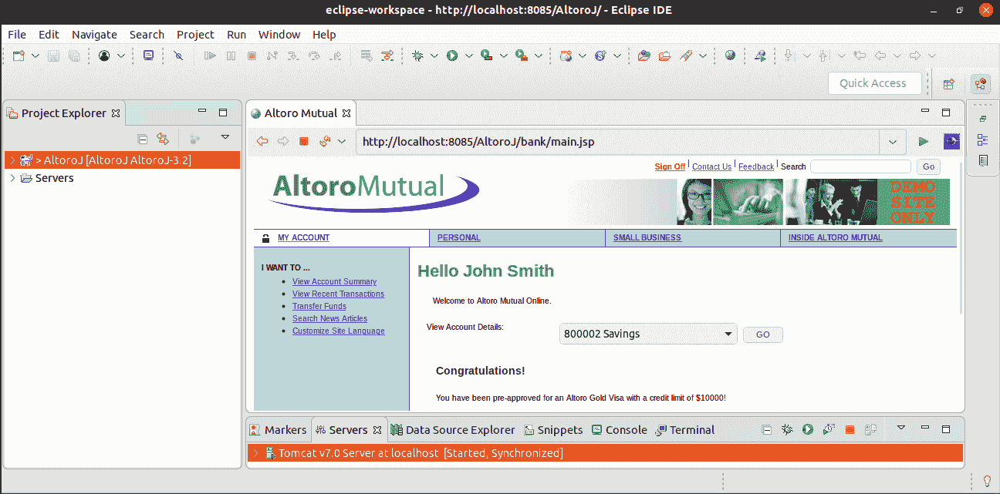

# b .配置一个本地网页，当通过本地主机入口向【demo.testfire.net】发出访问请求时，指示 Apache 显示该页面。

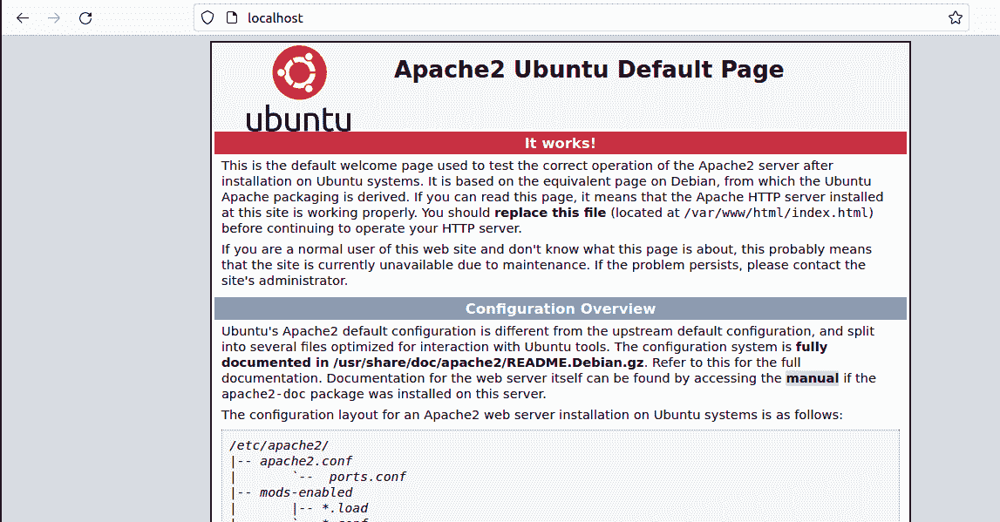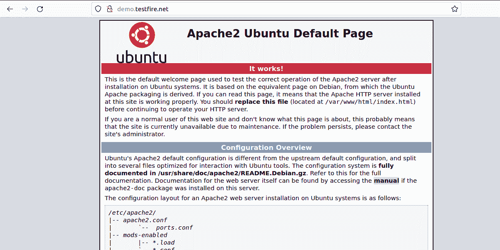

# c .在 Apache 上配置自签名 SSL 证书，并使应用程序[demo.testfire.net]在通过本地主机条目访问时监听 https。

1.  创建自签名证书

sudo OpenSSL req-x509-nodes-days 365-new key RSA:2048-keyut/etc/SSL/private/bhavin . key-out/etc/SSL/certs/bhavin . CRT

2.运行以上命令后，它会提示您回答几个关于您正在生成的证书的问题…回答这些问题并完成整个过程。

国家名称(2 个字母的代码)[AU]:IN

州或省名(全名)[某些州]:州名

地点名称(例如，城市)[]:城市名称

组织名称(如公司)[互联网 Widgits 私人有限公司]:公司

组织单位名称(如部门)[]:IT

常用名(如服务器 FQDN 或您的名字)[]:demo.testfire.net

电子邮件地址[]:abc@email.com

3.生成的自签名 SSL 证书— bhavin.crt

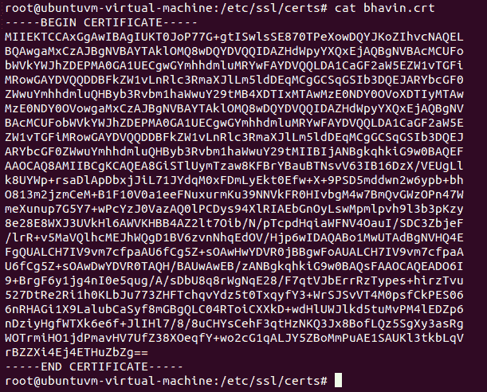

## **D .在 apache 中安装并配置 Mod 安全服务，演示一个在本地访问 demo.testfire.net 时被 mod_security 配置的规则拦截的攻击。**

ModSecurity 是一个开源的基于 web 的防火墙应用程序(或 WAF ),由不同的 web 服务器支持:Apache、Nginx 和 IIS。

保护 web 应用程序免受各种攻击。ModSecurity 支持灵活的规则引擎来执行简单和复杂的操作。它附带了一个核心规则集(CRS)。

[https://owasp.org/www-project-modsecurity-core-rule-set/](https://owasp.org/www-project-modsecurity-core-rule-set/)

当在反向代理部署中启用 ModSecurity 时，将启用以下防火墙体系结构:

*   Apache 服务器变成了一个 HTTP 路由器，它被设计成站在 Web/App 服务器和它的客户机之间。
*   客户端只连接到 Apache 服务器。
*   Apache 为客户端转发并获取来自 Tomcat 的请求。
*   客户端对 Tomcat 服务器的访问被禁用。

# **例如类似**的设置

1.  在 apache 中安装和配置 Mod 安全服务
2.  安装 ModSecurity

Ubuntu-VM @ ubuntuvm-virtual-machine:~ $ sudo 安装 libapache2-mod-security2

3.Apache 服务已重新启动

Ubuntu-VM @ ubuntuvm-virtual-machine:~ $ sudo system CTL restart Apache 2

4.检查 mod 安全版本:Ubuntu-VM @ ubuntuvm-virtual-machine:~ $ apt-cache show libapache 2-mod-security 2

**配置 ModSecurity**

1.  ModSecurity 被设置为根据默认规则记录事件。我已经编辑了配置文件，以调整规则来检测和阻止流量。
2.  **默认配置文件:**/etc/modsecurity/modsecurity . conf-推荐。
3.  **复制并重命名文件:**sudo CP/etc/modsecurity/modsecurity . conf-推荐/etc/modsecurity/modsecurity . conf
4.  Ubuntu-VM @ ubuntuvm-virtual-machine:~ $ sudo CP/etc/modsecurity/modsecurity . conf-推荐/etc/modsecurity/modsecurity . conf
5.  **更改了 ModSecurity 检测模式。首先，移动到/etc/modsecurity 文件夹**

root @ ubuntuvm-virtual-machine:/home/Ubuntu-VM # CD/etc/modsecurity/

root @ ubuntuvm-virtual-machine:/etc/modsecurity # sudo nano modsecurity . conf

root @ ubuntuvm-virtual-machine:/etc/modsecurity # CD

root @ ubuntuvm-virtual-machine:~ # system CTL 重新启动 apache2

**下载最新的 OWASP ModSecurity 规则**

最新的 ModSecurity 核心规则集(CRS)保存在 GitHub 上。如果您的系统中没有 Git，请安装它。

root @ ubuntuvm-virtual-machine:~ # sudo 安装 git

root @ ubuntuvm-virtual-machine:~ # git clone[https://github.com/SpiderLabs/owasp-modsecurity-crs.git](https://github.com/SpiderLabs/owasp-modsecurity-crs.git)

目录的副本，作为当前工作位置的子目录。

打开一个新目录:cd owasp-modsecurity-crs 并移动 crs-setup 文件

root @ ubuntuvm-virtual-machine:~ # CD owasp-modsecurity-CRS

root @ ubuntuvm-virtual-machine:~/owasp-modsecurity-CRS # sudo mv CRS-setup . conf . example/etc/modsecurity/CRS-setup . conf

root @ ubuntuvm-virtual-machine:~/owasp-modsecurity-CRS # sudo mv rules//etc/modsecurity

root @ ubuntuvm-virtual-machine:~/owasp-modsecurity-CRS # sudo nano/etc/Apache 2/MODS-enabled/security 2 . conf

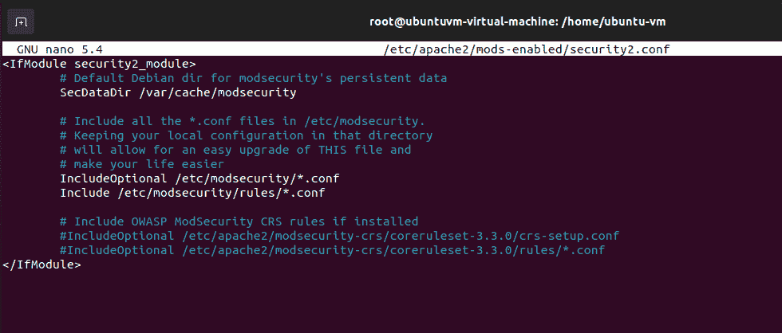

Apache 服务已重新启动

Ubuntu-VM @ ubuntuvm-virtual-machine:~ $ sudo system CTL restart Apache 2

现在通过在默认的 Apache 配置文件中添加一个检测规则来测试 Apache 配置。

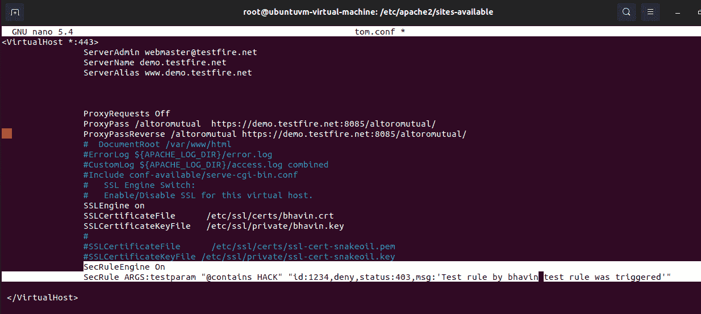

Apache 服务已重新启动

Ubuntu-VM @ ubuntuvm-virtual-machine:~ $ sudo system CTL restart Apache 2

===================================

# **晶圆安全测试**

Modsecurity 规则测试—[https://demo.testfire.net/AltoroJ/](https://demo.testfire.net/AltoroJ/)

Modsecurity 日志:tail-f/var/log/Apache 2/error . log

对于 LFI:[https://github . com/xmendez/wfuzz/blob/master/word list/Injections/traversal . txt](https://github.com/xmendez/wfuzz/blob/master/wordlist/Injections/Traversal.txt)

1.  已检查 robot.txt

机器人文件有时会暴露有趣的信息。

因此，文件中的信息可能会帮助攻击者绘制出站点的内容，特别是如果某些已识别的位置没有从站点的其他位置链接。如果应用程序依赖 robots.txt 来保护对这些区域的访问，并且没有对它们实施适当的访问控制，那么这就存在严重的漏洞。

日志:触发了 ModSecurity 规则

2.跨站点脚本:

跨站脚本(XSS)攻击是一种注入，其中恶意脚本被注入到良性和可信的网站中。当攻击者使用 web 应用程序向不同的最终用户发送恶意代码(通常以浏览器端脚本的形式)时，就会发生 XSS 攻击。允许这些攻击成功的缺陷非常普遍，并且出现在 web 应用程序在其生成的输出中使用来自用户的输入而没有对其进行验证或编码的任何地方。

[https://owasp.org/www-community/attacks/xss/](https://owasp.org/www-community/attacks/xss/)

有效载荷:

日志:触发了 ModSecurity 规则。

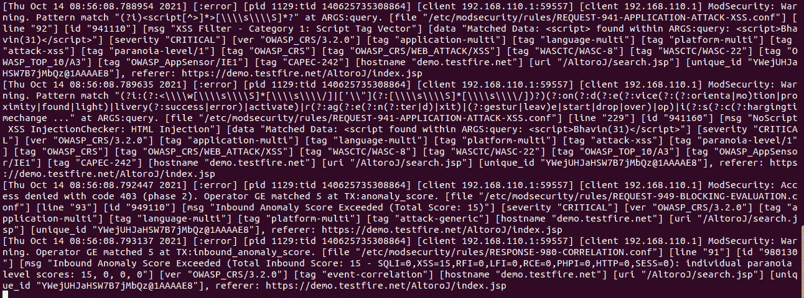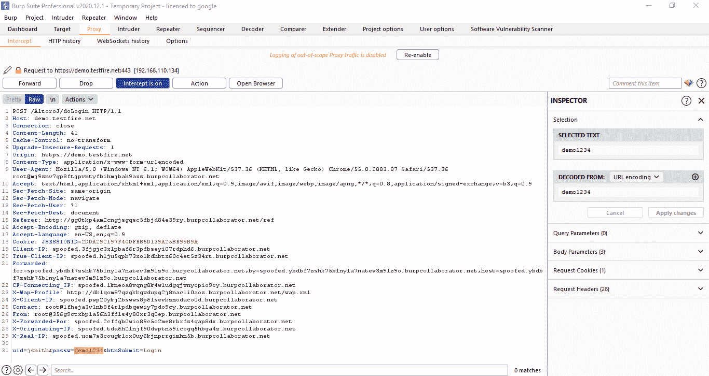

3.LFI 攻击:本地文件包括

Web 服务器通过配置设置控制对特权文件和资源的访问。特权文件包括只应由系统管理员访问的文件。例如，类 UNIX 平台上的/etc/passwd 文件或 Windows 系统上的 boot.ini 文件。

LFI 攻击是指试图使用目录遍历攻击来访问特权文件。LFI 攻击包括不同的风格，包括点-点-斜线攻击(../)、目录暴力、目录攀爬或回溯。

 [## 使用 Burp 测试路径遍历漏洞

### web 应用程序中常见的许多类型的功能都涉及到将用户提供的输入作为文件或…

portswigger.net](https://portswigger.net/support/using-burp-to-test-for-path-traversal-vulnerabilities) 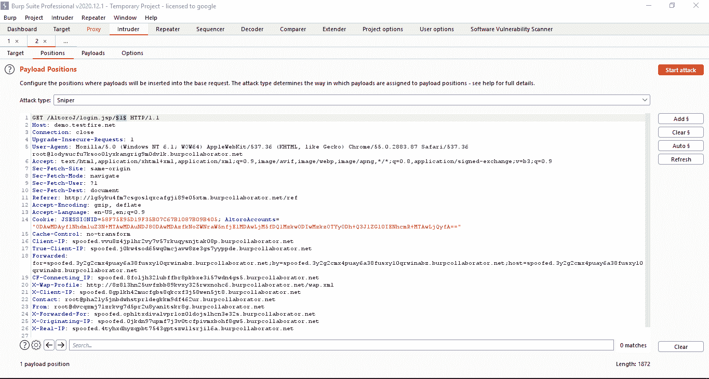

有效载荷:[https://raw . githubusercontent . com/xmendez/wfuzz/master/word list/Injections/traversal . txt](https://raw.githubusercontent.com/xmendez/wfuzz/master/wordlist/Injections/Traversal.txt)

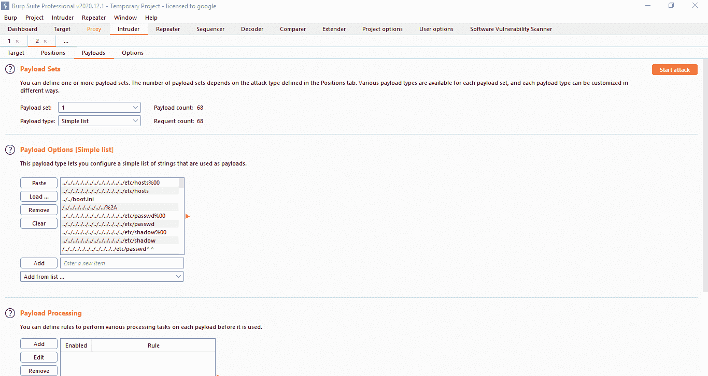

日志:触发了 ModSecurity 规则

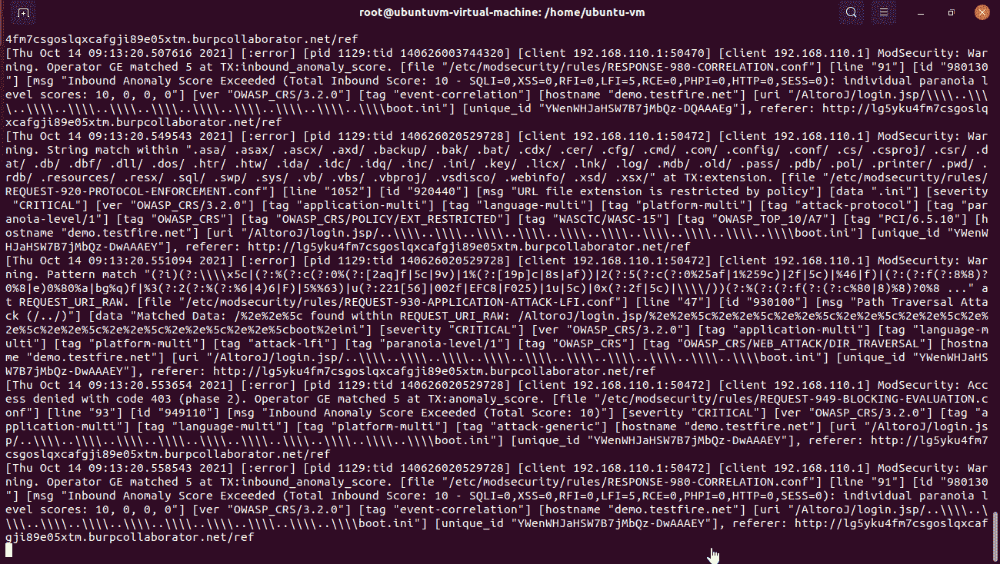

4.在浏览器上执行恶意脚本

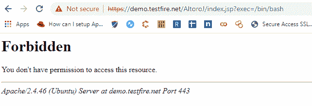

日志:触发了 ModSecurity 规则。

**SQL 注入:**

SQL 注入是一个 web 安全漏洞，使得攻击者能够干扰应用程序对其数据库的查询。它通常允许攻击者查看他们通常无法检索的数据。这可能包括属于其他用户的数据，或者应用程序本身能够访问的任何其他数据。在许多情况下，攻击者可以修改或删除这些数据，从而导致应用程序的内容或行为发生持久变化。

在某些情况下，攻击者可以升级 SQL 注入攻击来危害底层服务器或其他后端基础设施，或者执行拒绝服务攻击。

**有效载荷:**和 1 in(从 sysobjects 中选择 min(name)，其中 xtype =‘U’和 name>’。') —

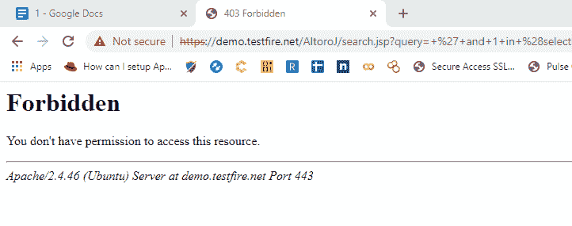

日志:触发了 ModSecurity 规则。

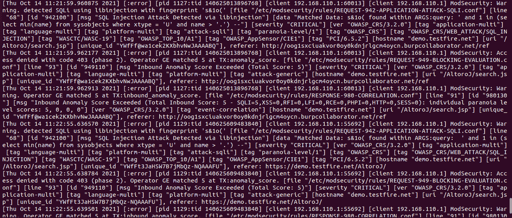

SSRF:服务器端请求伪造(也称为 SSRF)是一个 web 安全漏洞，允许攻击者诱导服务器端应用程序向攻击者选择的任意域发出 HTTP 请求。

在典型的 SSRF 攻击中，攻击者可能会使服务器连接到组织基础架构中仅供内部使用的服务。

有效载荷:？转发= [http://127.0.0.1](http://127.0.0.1)

[网络应用渗透测试——家庭实验室](https://www.youtube.com/playlist?list=PL8PnAf11sThVqeqptNmF9vSZ9tRvaeQtX)

[评估认证方案// bugbounty](https://www.youtube.com/playlist?list=PL8PnAf11sThWGlRpZsMPdNsrfoDoRsY9b)

=====================

关注:

[YouTube 订阅链接](https://www.youtube.com/CyberBruhArmy?sub_confirmation=1)

[推特](https://twitter.com/cyberbruharmy)

[Instagram](https://www.instagram.com/cyberbruharmy/)

[不和谐](https://discord.com/invite/8Uz7ArN)

🔈 🔈Infosec Writeups 正在组织其首次虚拟会议和网络活动。如果你对信息安全感兴趣，这是最酷的地方，有 16 个令人难以置信的演讲者和 10 多个小时充满力量的讨论会议。 [**查看更多详情，在此注册。**](https://iwcon.live/)

 [## IWCon2022 - Infosec 书面报告虚拟会议

### 与世界上最优秀的信息安全专家建立联系。了解网络安全专家如何取得成功。将新技能添加到您的…

iwcon.live](https://iwcon.live/)