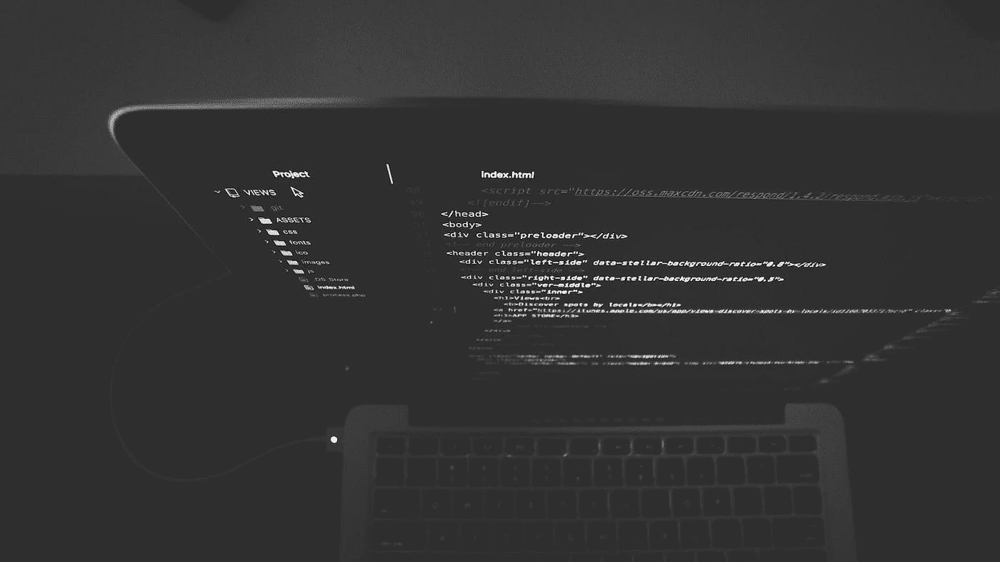
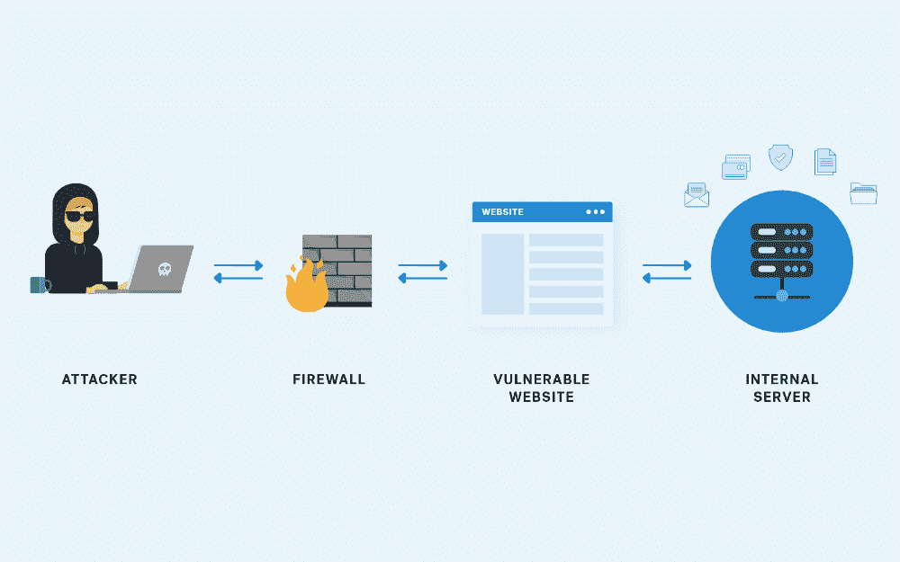

# 让我们理解 SSRF 的脆弱性

> 原文：<https://infosecwriteups.com/lets-understand-ssrf-vulnerability-6f1d28b228f9?source=collection_archive---------0----------------------->

**照片由** [**张瀚授**](https://unsplash.com/@nateggrant?utm_source=unsplash&utm_medium=referral&utm_content=creditCopyText) **上** [**下**](https://unsplash.com/s/photos/coding?utm_source=unsplash&utm_medium=referral&utm_content=creditCopyText)

**简介**

在大多数情况下，OWASP Top 10 会发布一个漏洞列表。这些是包含各种类型漏洞的宽泛类别。开放 Web 应用程序安全项目(OWASP)提供了许多不同方面的定义，包括它调查的许多类型的漏洞以及对这些缺陷的补救措施。该列表是根据漏洞被发现的频率以及缺陷的严重性和发生率生成的。SSRF 是一个严重程度很高的漏洞，是 OWASP 十大漏洞之一，也是最常检测到的漏洞之一。SSRF 攻击通常具有很高的严重性，因为它允许攻击者从服务器检索大量敏感信息，例如当前使用的协议版本，还允许攻击者访问服务器上可能包含敏感信息的一些文件。如果凭据被泄露，这些文件也可以被用来控制服务器，并随意使用它。利用 SSRF 的方式有很多种，但攻击者的主要目标是绕过防火墙限制，以访问内部系统和网络。

**什么是 SSRF/服务器端请求伪造攻击？**

[**来源**](https://www.cobalt.io/blog/a-pentesters-guide-to-server-side-request-forgery-ssrf)

如果没有输入验证并且没有维护 URL 的白名单，攻击者就能够强迫易受攻击的服务器在第三方服务器或作为组织内部基础架构一部分的任何内部服务器上执行恶意请求。如果网站的公共服务器向内部服务器发出任何请求以获取诸如文件、股票等信息。，那么这次攻击正在进行。在这种攻击中，如果网站的公共服务器向内部服务器发出任何请求，如果攻击者通过组织的内部服务器重定向请求，那么它可能绕过内部服务器限制，并可能对组织的敏感信息构成威胁。有时，攻击者对服务器的控制很少或只有部分控制，因为许多内部服务没有向外部用户公开。如果攻击者通过组织的内部服务器重定向请求，则可能会对组织的敏感信息造成威胁。此请求可能会导致额外的攻击，如跨站点攻击，包括枚举服务器上的端口和服务，这可能会对易受攻击的服务器造成损害；远程代码执行；未经授权访问内部应用程序和服务；能够读取存储在内部服务器上的信息；扫描内部和外部网络。

**让我们来理解简单剥削**

因为这些内部服务器位于防火墙后面，所以不属于内部网络的用户无法使用它们。这意味着普通用户将无法访问它们；相反，只有内部系统和服务能够做到这一点。在攻击的这一阶段，攻击者执行端口扫描，搜索内部应用程序，并检查任何被认为是敏感的和可能被利用的信息。

在公共服务器与内部服务器交互之前，这种攻击永远不会发生。通过他们系统的公众形象。大多数情况下，这个问题的出现是因为相关的应用程序缺少任何类型的 URL 白名单。如果没有这一点，对手可以欺骗服务器发送恶意请求，以便与网络的内部服务进行通信。

**它们为什么会发生？**

当应用程序没有足够的可访问资源的白名单时，或者当请求没有输入验证时，这些类型的攻击就可能发生。这可能会导致攻击者访问一些不打算让他们访问的服务。

[来源](https://hdivsecurity.com/bornsecure/ssrf-what-is-server-side-request-forgery/)

让我们来看一个例子，看看它是否对我们有所帮助。当提供一个 URL 时，我们有一个应用程序将使用该 URL 获取图像。这意味着它导航到所提供的 URL，并在 URL 上查找图像。如果图像被发现，它将被呈现在网页上，以便可以显示。该应用程序正在使用下面句子中描述的这段代码。

> if (isset($_GET[‘url’])){
> 
> $url = $_GET[‘url’];
> 
> # Open file in read mode to fetch the image from the user supplied URL
> 
> $file = fopen($url, ‘rb’);
> 
> # Set the image header
> 
> header(“Content-Type: image/png”);
> 
> # Dump the file
> 
> fpassthru($file);
> 
> }
> 
> echo ‘Please enter image url’
> 
> ?>

As soon as a URL is provided, it will look for the image on that URL and will fetch the image from the webpage. This process occurs immediately once the URL is submitted, as described above.

**假设你有这样的图片网址**[**【http://example.com/image.jpg】**](http://example.com/image.jpg)

[http://vulnerable-website.com/fetchimagebyurl.php?](http://localhost/fetchimage.php?img)网址=**http://example.com/image.jpg**

如果没有输入验证和 URL 白名单，那么攻击者就有可能使用这些端点从服务器访问敏感文件。诸如

[http://vulnerable-website.com/fetchimagebyurl.php?](http://localhost/fetchimage.php?img)网址=**http://example.com/image.jpg**

由于没有验证，这个 URL 将被处理，应用程序将获取并呈现包含所有用户信息的/etc/passwd 文件的内容。

它还可以通过提供元数据 URL 来获取 AWS 实例的信息，如密钥或秘密，例如

[***http://169 . 254 . 169 . 254/最新/元数据/主机名***](http://169.254.169.254/latest/meta-data/hostname)

**例子**

[http://vulnerable-website.com/fetchimagebyurl.php?](http://localhost/fetchimage.php?img)网址=[http://169 . 254 . 169 . 254/最新/元数据/主机名](http://169.254.169.254/latest/meta-data/hostname)

攻击者可以执行端口扫描，因为他会尝试使用 url 连接到不同的服务。例如 127.0.0.1:21。如果服务器返回任何响应，则端口打开，如果没有，则端口关闭。

**补救:**

*   禁用未使用的 URL 模式，如 ftp://。ftp://，或 file://。会减少攻击面。
*   对用户输入执行 URL 白名单和适当的验证。

**结论**

随着威胁级别上升到危急或更高，SSRF 攻击会对组织造成更大的损害。因此，管理员应该始终确保提供适当的数据验证，这样攻击者就不能轻易绕过它们。如果成功利用 SSRF 漏洞，攻击者可以检索非常敏感的数据。有时，攻击者需要做一点小小的改动，才能成功执行。然而，这样做的结果是，需要对正在处理的每一个输入进行输入验证。如果不这样做，可能会导致严重的漏洞。