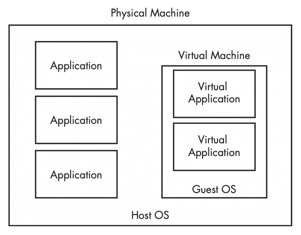
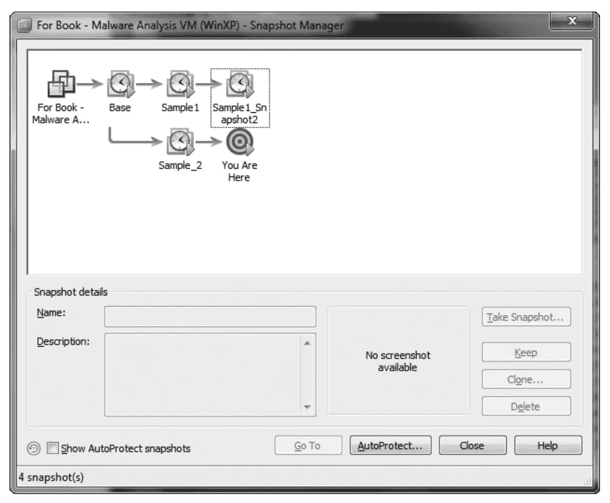
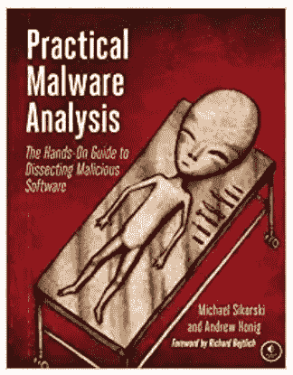

# 恶意软件分析 101 -沙盒

> 原文：<https://infosecwriteups.com/malware-analysis-101-sandboxing-746a06432334?source=collection_archive---------0----------------------->

> 这篇文章是我上一篇文章“[恶意软件分析 101-基本静态分析](https://medium.com/bugbountywriteup/malware-analysis-101-basic-static-analysis-db59119bc00a)”的续篇，请在继续这篇文章之前阅读一下，以便更好地理解我将在这里解释的东西。

我写了上一篇关于恶意软件的基本静态分析的文章，我想到的下一篇文章是恶意软件的基本动态分析。在我开始恶意软件的动态分析之前，我需要解释恶意软件动态分析的利与弊，以及如何最好地保护自己免受其害。

# 我们开始吧！

恶意软件分析大致分为两组静态分析和动态分析。我们可以将静态分析描述为对恶意软件的所有检查，其中我们并不实际执行恶意软件，而是试图找出恶意软件试图做什么以及它试图执行的命令。另一方面，动态分析是当您实际执行恶意软件(最好是在沙盒环境中)时进行的所有这些检查，然后尝试找出恶意软件的功能。

## 沙箱

现在，我们知道，在对恶意软件进行动态分析时，我们需要执行它，我们可以肯定的一件事是，我们绝不能让任何恶意软件进入我们的系统，更不用说执行它了。这两条线是矛盾的，那么我们将如何进行动态分析，这就产生了沙盒的想法。

这项技术帮助我们保护我们的系统免受恶意软件的攻击，同时它允许我们进行动态分析，以更好地了解恶意软件的工作原理。

说实话，我在高中时就理解了这个理论解释，但很长一段时间都没有真正理解它实际上是什么，所以让我们深入了解一下建立自己的沙盒环境意味着什么。

有各种工具，包括 GFI 沙盒，诺曼沙盒，阿努比斯乔沙盒，ThreatExpert，BitBlaze 和 Comodo 即时恶意软件分析，用于建立一个沙盒环境，但我将重点放在配置自己的系统上的沙盒。

沙箱是什么的一个过度简化，它是一个虚拟机。因此，要了解虚拟机如何充当沙箱，您需要看一下这张图片。

这描述了即使虚拟机驻留在您的系统上，它仍然独立于它的主机，因此“无论在您的虚拟机上发生了什么，它都会保留在您的虚拟机上”。

## 使用虚拟机的优点

使用虚拟机作为沙箱环境来测试恶意软件而不是使用实际系统有各种原因。一个明显的原因是，与使用虚拟机相比，使用真实的机器成本太高。

在裸机上使用虚拟机的另一个最明显的原因是，当恶意软件感染虚拟机并失去控制时，我们可以删除该恶意软件并重新开始，但裸机则不是这样，因为恶意软件仍然会在执行它们的机器上逗留，从系统中 100%删除该恶意软件可能有点困难。

虚拟机为我们提供了“快照”功能，这是一个巨大的优势，我怎么强调都不为过。

快照选项的功能是保存虚拟机在某个时间点的状态，以便每当恶意软件搞乱东西时，他总是可以返回到他们拍摄的最后一个快照，并从那里继续。为了用更外行的术语来理解这一点，考虑一下在玩一个超长游戏时，这可以节省你的进度。

## 使用虚拟机的缺点

虽然这一切都很好，但有一个障碍，那就是每当您在虚拟机中运行恶意软件时，恶意软件都有可能检测到它正在虚拟机中执行，并且不会执行它在实际系统中会执行的一系列步骤。

恶意软件可以通过许多不同的方法检测到这一点，无论它是在虚拟机环境中执行还是在实际系统中执行

**问题 1:** 其中一个是硬盘上的空间量。例如，一台正常的机器在 SSD 中至少有 256 GB 的存储空间，如果是 HDD，则大约有 512GB，但是如果恶意软件检测到硬盘存储空间只有 20GB 左右，那么它将认为它是在虚拟环境中执行的，并且有可能正在被恶意软件分析师检查。

**解决方案:**为了解决这个问题，我们必须给这台机器分配至少 50GB 以上的硬盘空间，这样恶意软件就不会直接拒绝这台机器。

**问题 2:** 另一个例子是互联网连接测试。一般来说，我们在其中测试恶意软件的虚拟机保持与互联网断开连接，因为我们不知道恶意软件在发现活跃的互联网连接时可能会尝试做什么。它可能会试图通过互联网传播到其他机器，因此我们不能允许这种情况，因此大多数时候，当我们进行恶意软件分析时，我们将虚拟机放在内部网络中，而不是通过桥接或 NAT。

**解决方法:**这个问题的解决方法就是使用类似 [ApateDNS](https://www.fireeye.com/services/freeware/apatedns.html) 、 [InetSIM](https://techanarchy.net/blog/installing-and-configuring-inetsim) 、 [Netcat](https://nmap.org/ncat/) 等工具。这些工具用于建立虚假的互联网连接，因此如果恶意软件试图确定机器是否有互联网连接，它将实际上成为这些工具的牺牲品，并认为存在连接，即使实际上并没有连接。

**问题 3:** 当恶意软件在网络上搜索另一个设备时，虚拟机上会出现另一个问题，如果它没有找到任何设备，它就像在虚拟机上运行一样，因为任何只有一个设备的网络都被视为虚拟机。

**解决方案:**解决这个问题的最佳方法是设置各种虚拟机，然后使用内部网络将它们加入同一个网络，然后在每台设备上设置假的互联网连接。通过这种方式，恶意软件被骗以为它正在现实生活环境中执行，然后我们可以使用 Wireshark 等工具监控流量，以准确了解恶意软件试图做什么，以及它是否试图联系任何命令和控制服务器，或者它是否试图在网络上传播恶意软件等。

这总是一场猫捉老鼠的游戏，试图找到不同的方法来击败黑客，并试图找到分析他们的恶意软件的方法，而攻击者也在试图做同样的事情。

# 下一步:基本动态分析

既然您已经知道了什么是沙箱，并且设置沙箱类似于配置虚拟箱，那么我将在下一篇文章中提到用于基本动态分析的技术。请记住这一点，在虚拟机中配置沙盒环境时，除了网络和硬盘空间之外，大多数情况下都采用默认配置，除非您有一些特定的要求。

**编辑**:文中提到的东西和截图大多摘自《实用恶意软件分析》一书。你绝对应该考虑买这本书，[链接这里](https://www.amazon.in/Practical-Malware-Analysis-Hands-Dissecting/dp/1593272901)。我在这里总结了我的笔记，有几点是直接从书上摘下来的，因为我认为它们解释得很好，重新措辞或编辑它们没有意义。

如果你喜欢，请鼓掌让我们合作。获取、设置、破解！

网址:[aditya12anand.com](https://www.aditya12anand.com/)|捐赠:[paypal.me/aditya12anand](https://paypal.me/aditya12anand)

电报:【https://t.me/aditya12anand 

推特:[twitter.com/aditya12anand](https://twitter.com/aditya12anand?source=post_page---------------------------)

领英:[linkedin.com/in/aditya12anand/](https://www.linkedin.com/in/aditya12anand/?source=post_page---------------------------)

电子邮件:aditya12anand@protonmail.com

*关注* [*Infosec 报道*](https://medium.com/bugbountywriteup) *获取更多此类精彩报道。*

 [## 信息安全报道

### 收集了世界上最好的黑客的文章，主题从 bug 奖金和 CTF 到 vulnhub…

medium.com](https://medium.com/bugbountywriteup)