# [恶意软件分析#5] —永恒项目—永恒蠕虫

> 原文：<https://infosecwriteups.com/malware-analysis-5-eternity-project-eternity-worm-abd7803fcab?source=collection_archive---------0----------------------->

在这篇文章中，我们将继续分析永恒项目，这一次我们将看看永恒蠕虫，所以让我们开始…

## 工件:

**永恒之虫第一阶段:**

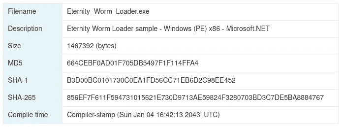

856 ef 7 f 611 f 594731015621 e 730d 9713 AE 59824 f 3280703 BD 3c 7 de 5ba 8884767

**永恒之虫第二阶段:**

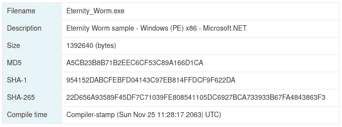

## **静态分析:**

## **永恒之虫第一阶段:**

这个永恒蠕虫的示例有一个图像图标来欺骗天真的用户，特别是在文件扩展名被隐藏的情况下，这是一个很好的技巧，因为进一步分析我们会发现，在运行假定为图像(恶意软件)的后，它会从其资源中运行一个图像来隐藏其执行:

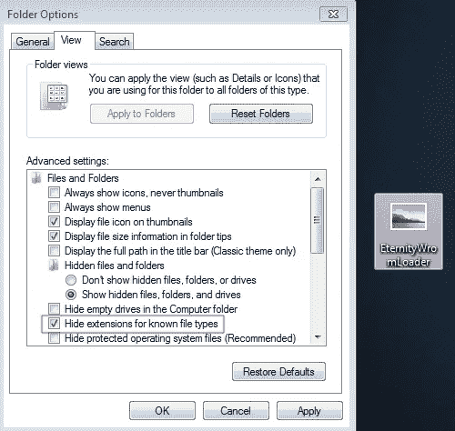

延伸技巧

把样本扔在“简单检测”上，我们发现它是。NET 混淆样本，因为它出现在从"**。正文**章节:

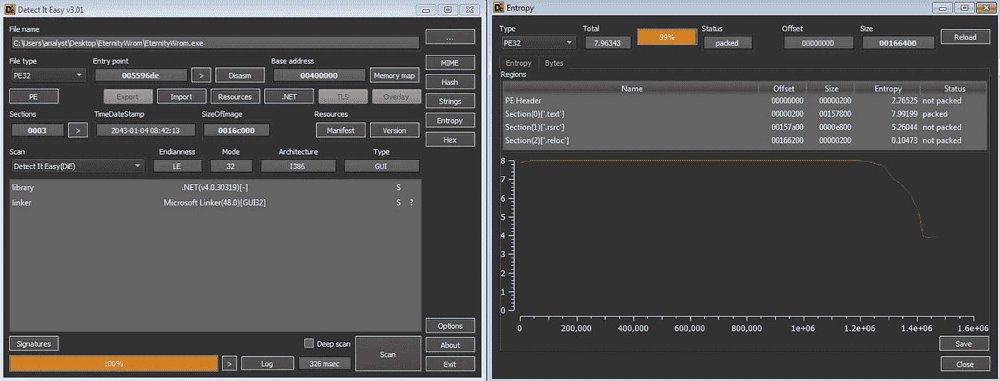

很容易发现它

## **解包恶意软件:**

在“ **dnspy** 中运行该示例，我们可以看到它被严重混淆，与“ [**永恒窃取者**](https://0xm3h51n.medium.com/malware-analysis-4-eternity-project-eternity-stealer-682df3f0dafd) ”恶意软件非常相似。所以我用“ **de4dote** ”对样品进行去泡沫和清洁:

混淆的主方法

用于去除样品气泡的 de4dote 命令

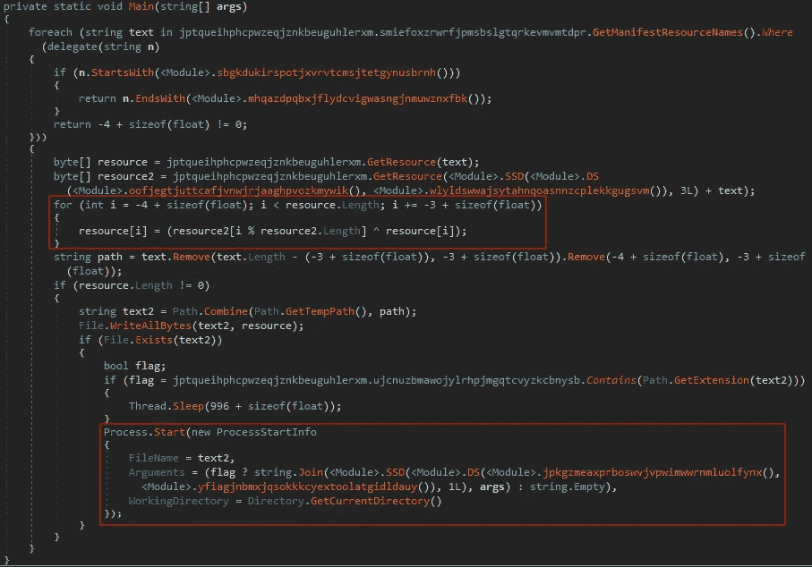

除氧后的主要方法

从上面清理后的版本映像中，我们可以看到加载程序将获得它的资源，它将从加载加密的映像及其密钥开始，然后用一个简单的解密例程解密并运行它。此外，对 worm 可执行文件执行同样的操作，并在执行后退出:

装载机资源

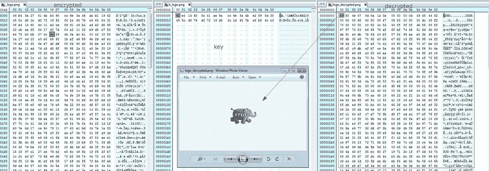

图像解密过程的十六进制编辑器视图

为了获得解密的恶意软件样本，我们在解密例程后设置一个断点，然后用正确的扩展名保存保存恶意软件的缓冲区，我们将获得一个工作样本:

解密后保存

十六进制编辑器查看 wrom 的解密过程

或者使用 python，我们可以在保存后解密资源文件:

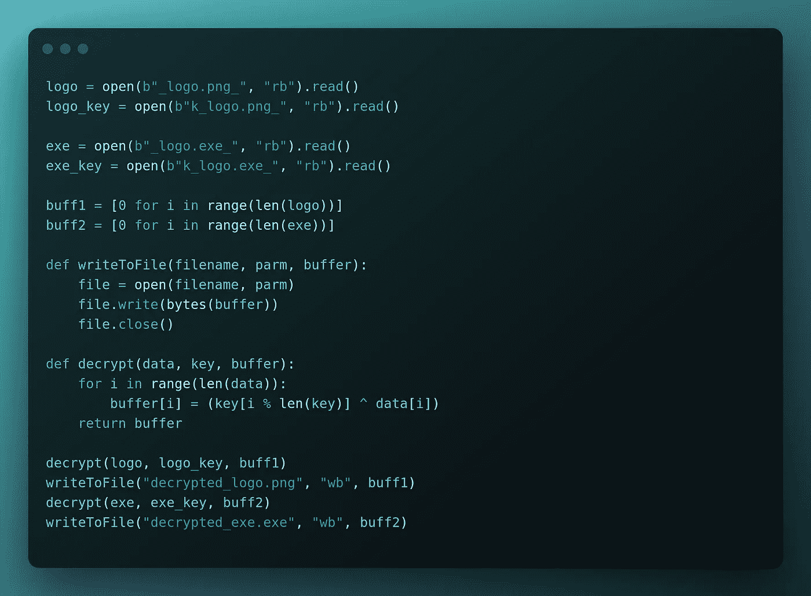

解密资源文件的 Python 脚本

执行完蠕虫后退出

## **永恒之虫第二阶段:**

**地理围栏:**

永恒蠕虫通过枚举机器上的语言开始，如果它发现机器有乌克兰语言，它将打印消息“**荣耀乌克兰**”并退出，否则它将继续执行:

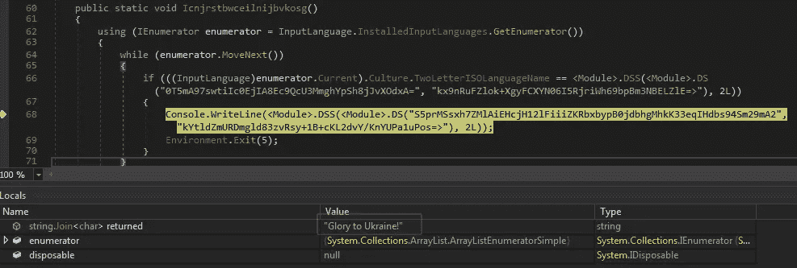

地理围栏法

**防重复:**

这个功能不是恶意软件的核心功能，它是根据买家的选择添加的。恶意软件将检查命令行参数中是否有“- -debug”字符串，如果没有发现，它将创建一个名为“nwwqwdpozq”的命名对象/互斥体。未能创建互斥体将导致进程退出，否则执行将继续:

反重复方法

## **文件抓取& C2 通讯:**

**下载的文件:**

*   " **hxxp[://]soapbeginshops[。]com/kingz[。]exe** "
*   " **hxxp[://]soapbeginshops[。]com/ItsMe[。]zip**
*   "**hxxp[://]light nogu 5 owjjllyo 4 T2 sfos 6 fchnmcidlgo 6 c 7 e 6 f z2 hgryhfhoyd[。]洋葱。宠物/共享/电报。]exe** "

我们还可以用 Wireshark 和 Fakenet 捕获请求:

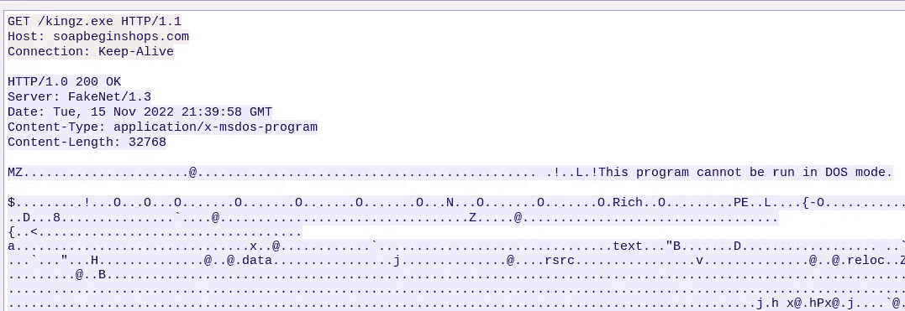

获取“kingz.exe”的请求

下载“ItsMe.zip”

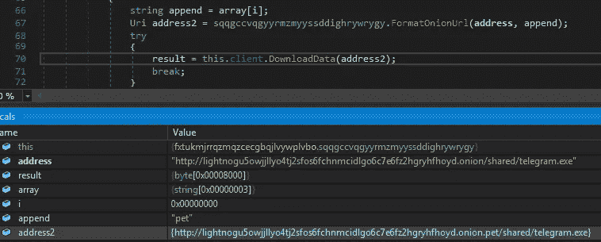

正在下载“telegram.exe”

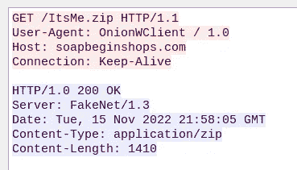

获取“ItsMe.zip”的请求

获取“telegram.exe”的请求

## **展开技术:**

**1 -垃圾电报:**

*   下载假的“telegram.exe”并以参数“哈哈哈哈哈，你看到这个了吗？?"。论点可以这样用"**哈哈哈哈哈，你看到这个了吗？？【有效负载 _ 网址】**”。

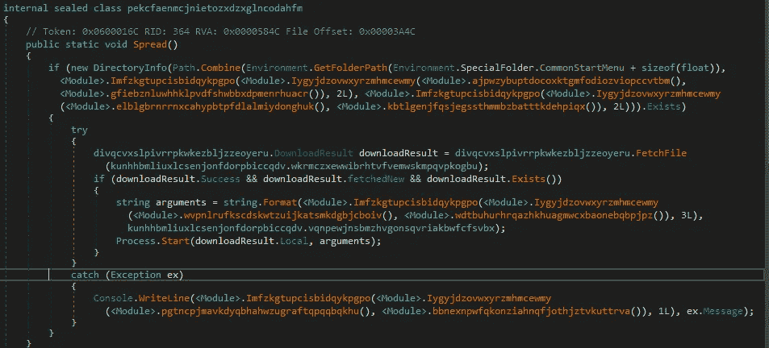

电报垃圾邮件方法

**2 -感染文件:**

*   枚举目录(桌面-图片-文档)并从中获取文件列表。

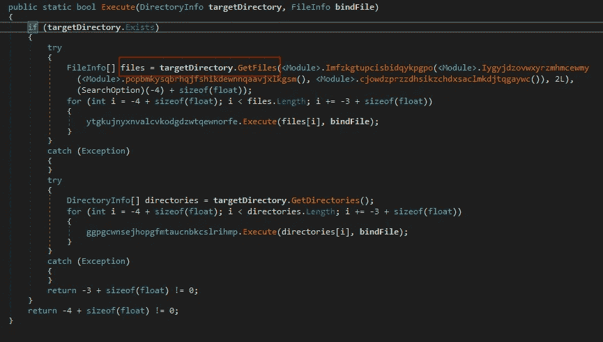

文件感染方法

*   对于每个文件，它通过哈希检查其扩展名，如果符合以下任何扩展名，它将被感染:

(png-exe-txt-zip-xlsx-bat-MP3-MP4-py-pyw-docx-jar-pdf-pptx)

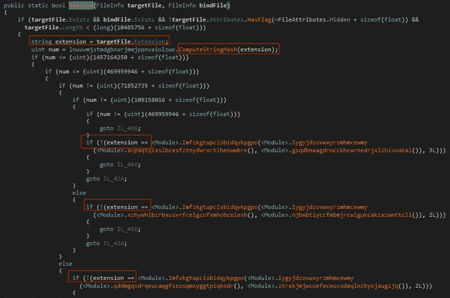

扩展比较

*   在临时目录中创建一个加载程序可执行文件，其中包含:

—将解密和执行资源文件的存根。

—原始文件的加密代码。

—“kingz . exe”的加密代码及其解密密钥。

*   改变文件的图标来模拟原始文件图标。
*   将原始文件(创建、修改、访问)的时间和日期复制到伪造文件中。
*   将伪造文件复制到原始文件位置，并使用 RTLO(从右到左覆盖)技术伪造扩展名。这将使文件出现与原始文件扩展名，而它使用“scr”扩展名，这是一个屏幕保护程序，将执行代码。

*   结果将是一个类似于 stage 1 loader 的可执行文件，它将执行原始文件和“kingz.exe”可执行文件。

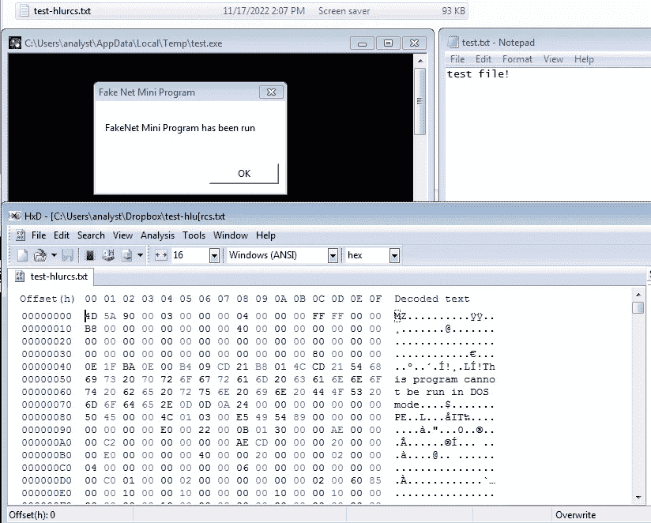

**3 -感染驱动器文件:**

*   仅感染可移动驱动器，感染文件的方式与前面提到的相同。

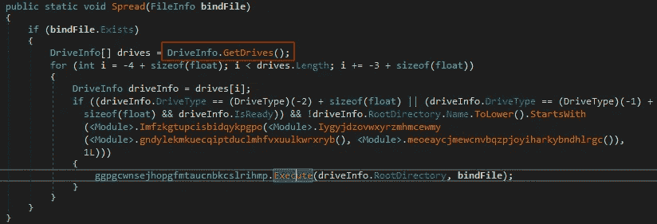

驱动感染方法

**4 -感染 Python 解释器:**

*   通过在文件开头或结尾添加 base64 代码感染 Python OS 模块，会下载“kingz.exe”文件。

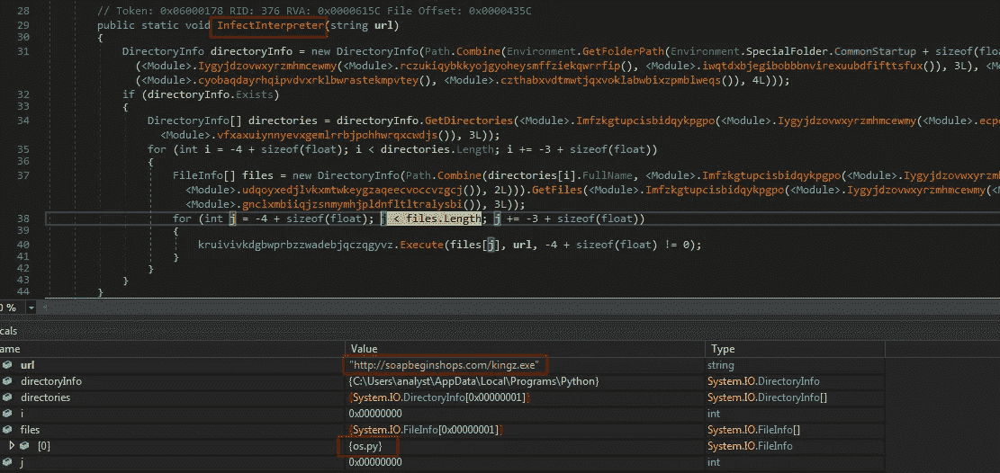

Python 感染解释器

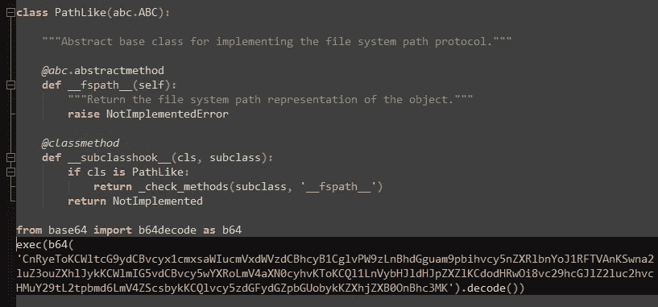

“os.py”末尾的 Base64 代码

解码 base64

**5 -感染云目录:**

*   从目录中获取文件(Dropbox - OneDrive)并以前面提到的相同方式感染它们。

云感染方法

**6 -制造不和谐的垃圾邮件**

用 GET 请求检索用户名到" **hxxps[://]discord[。]com/api/users/@me** ，它返回一个 JSON，然后从字段“username#”中检索值和字段“discriminator”的值，通过请求“**hx XPS[://]discord]来检索通道。]com/api/users/@me/channels** "。然后遍历 id 列表，对于每个 id，它将向"**hx XPS[://]discord[]发出 POST 请求。]com/API/v 9/channels/{ 0 }/messages**”，使用 ID 和消息的内容是:“**哈哈哈哈哈，你看到这个了吗？？【有效载荷 _ 网址】**”。

通道枚举法

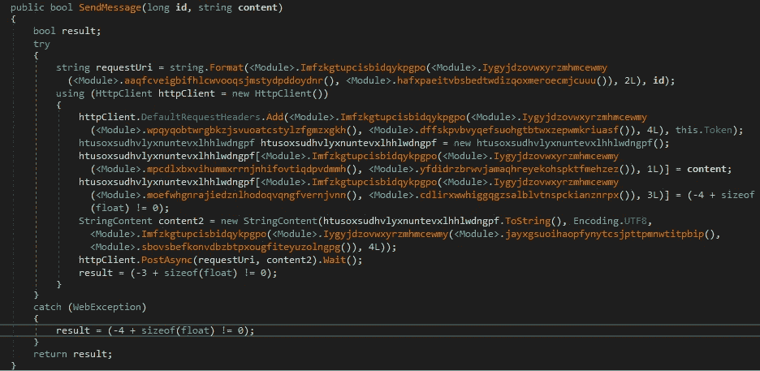

发送恶意消息的方法

## 特点:

*   地理围栏。
*   反反复复。
*   混淆视听。
*   反 VM。
*   反任务经理。
*   反调试。
*   设置关键流程。
*   提升特权。
*   自毁。
*   扩展欺骗
*   图标恶搞。
*   不和谐垃圾邮件。
*   滥发电报。
*   Python 解释器感染。
*   用户目录感染。
*   云目录感染。
*   可移动驱动器感染。

## 亚拉法则:

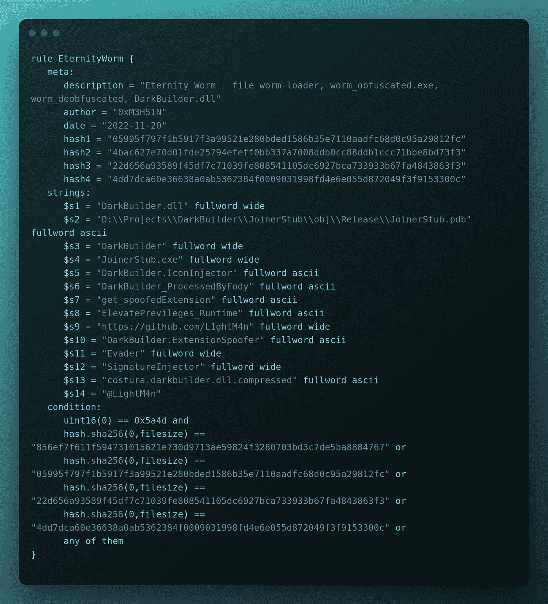

## 来自 Infosec 的报道:Infosec 每天都有很多内容，很难跟上。[加入我们的每周简讯](https://weekly.infosecwriteups.com/)以 5 篇文章、4 个线程、3 个视频、2 个 GitHub Repos 和工具以及 1 个工作提醒的形式免费获取所有最新的 Infosec 趋势！