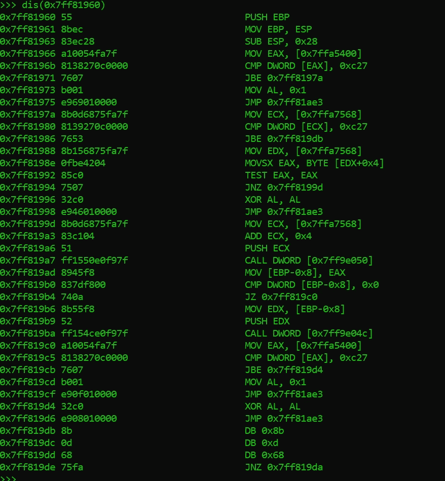
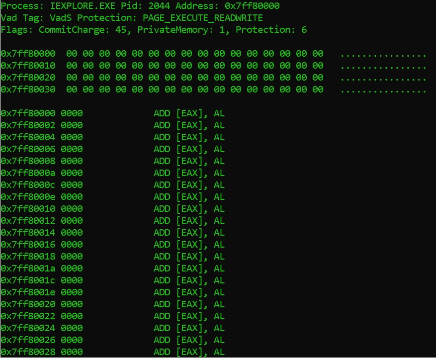
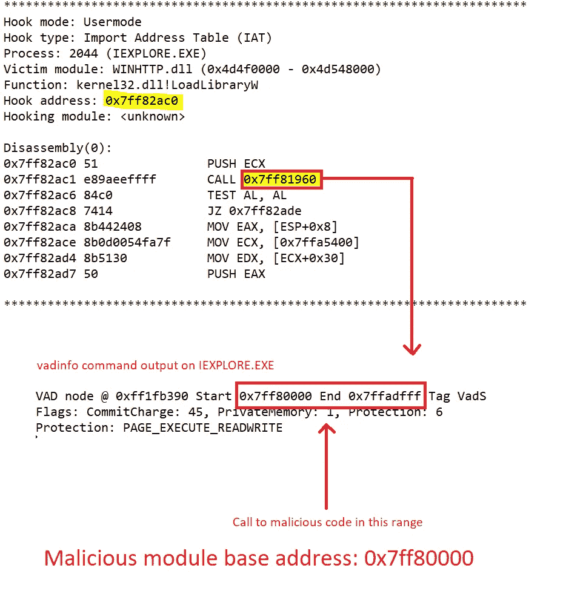
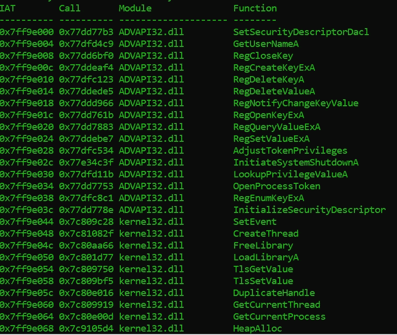
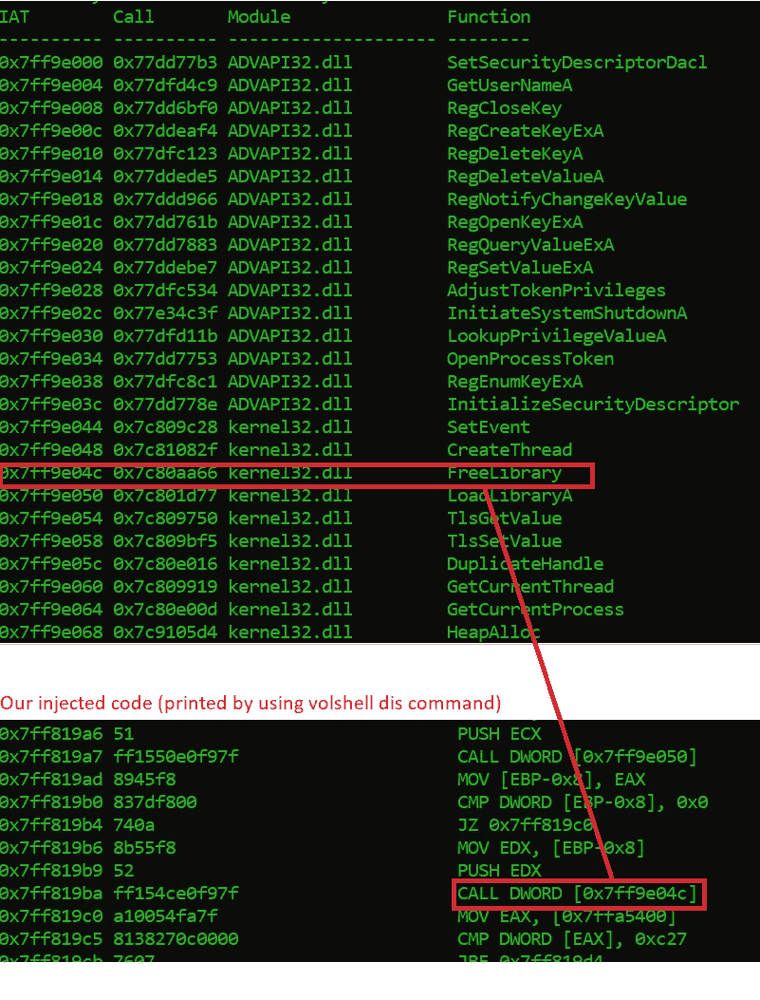
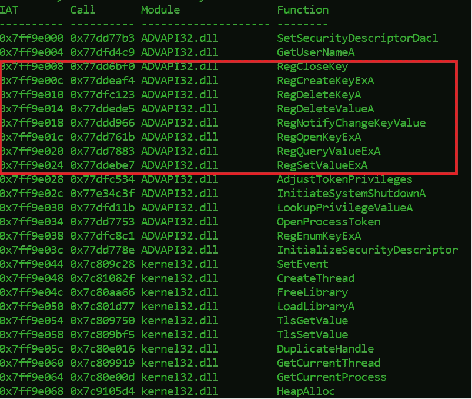

# 易变初学者的记忆分析

> 原文：<https://infosecwriteups.com/memory-analysis-for-beginners-with-volatility-coreflood-trojan-part-2-42bdb46683f2?source=collection_archive---------1----------------------->

## Coreflood 特洛伊木马:第 2 部分

大家好，欢迎回到我的内存分析系列。如果您没有阅读该系列的第一部分，请回到这里阅读:

[易变新手内存分析——core flood 木马:第一部分](https://medium.com/@davidschiff_35251/memory-analysis-for-beginners-with-volatility-coreflood-trojan-part-1-89981433eeb6)

简单回顾一下:(如果你不想回顾跳到下一节)上次我们停下来看看注入 IEXPLORE.EXE 进程的恶意代码在做什么。我们使用了 **apihooks** 命令来列出我们的主机中所有的挂钩实例。提醒你一下，这是我们的发现:

一个经典的 IAT 钩子的例子。(上一篇帖子解释过)

正如我们在上面看到的，这是我们被钩住的一段代码。被钩住的模块是 kernel32.dll。**调用**指令调用注入内存的不同函数，而不是 LoadLibraryW。它执行这段漂亮的恶意代码(你可以自己看——如果你不记得怎么做，回到上一篇文章):

为了弄清楚这段代码做了什么，我的第一反应是使用 **vaddump** 命令。这个命令使我能够转储一部分内存。我可以用它将模块从内存中转储出来，并使用 IDA(或其他反汇编程序)反汇编它

不过有一个小问题:在上一篇文章中，我使用了 **malfind** 命令，该命令应该可以找到注入内存的模块。不幸的是，我们最终没有在内存中看到任何实际的模块。我们看到的是这样的:

malfind 命令的输出，正如我们在这里看到的，没有 MZ 报头

通常，当一个模块被注入到内存中时，它应该有 MZ 头，这对我们来说是一个好的信号，表明被注入的模块在内存中没有被篡改，或者头没有被分页。可能是因为混淆的原因，模块的头被从内存中清除了。这是一个很好的举措，使它很难调查这个恶意软件，因为它将需要更长的时间来重建一切，以便我们能够拆卸模块。

幸运的是，我们可以使用 **impscan** 命令，该命令允许我们检索关于代码对其他模块进行的 API 调用的信息，以便理解注入代码的功能。

**impscan** 的工作原理是扫描进程内存中对 JMP [ <地址> ]或 CALL [ <地址> ]等函数的调用，这基本上告诉我们**函数地址**存储在内存中的<地址>(一个指向地址的指针)中。这类调用有时用于**从 IAT** 中检索函数地址，该是一个包含导入函数地址的数组。volatility 可以做的就是跟踪这些调用，看看 IAT 存储了什么，以及它指向内存中加载的其他模块中的哪些函数。

现在我们知道了 **impscan** 是如何工作的，让我们继续使用它，我们将指定**IEXPLORE.EXE**进程 id 作为命令参数，因为**中加载了我们的恶意代码**，我们想知道它做了什么。此外，我们需要为加载到内存中的恶意模块提供**基址，这样 volatility 将知道在哪里扫描导入。**

我们如何获得恶意模块的基址？

我们将结合一个来自 **apihooks** 的钩子示例和一个在 **vadinfo** 命令输出中的快速搜索(关于 vad 的解释，参见上一篇文章)来获取恶意代码的基地址。

现在我们已经拥有了所需的一切，让我们运行 impscan 命令

impscan 命令

impscan 命令输出

我们现在可以看到漂亮的导入函数列表。我们还可以看到 IAT 列，它显示了 IAT 数组中元素的地址，在它的右边是该数组元素中包含的导入函数的地址。impscan 也显示了导入函数的名字，这可以帮助我们通过函数的名字来理解我们的代码做了什么。

以下是如何使用 **impscan** 命令的示例:

IAT 与反汇编代码的比较，我们代码的调用将我们引向 IAT 中包含的地址。

正如我们所看到的，我们可以查看 impscan 命令的输出，并将其与注入的代码进行比较，以找出每个函数调用在做什么。例如，在上面的展示中，注入的代码调用 FreeLibrary。FreeLibrary 释放已加载的动态链接库(DLL)模块，并在必要时减少其引用计数。当引用计数达到零时，模块从调用进程的地址空间卸载，句柄不再有效。

我们现在有能力检查注入的代码并理解其功能。这种方法的一个问题是，为了获得更全面的了解，需要花一些时间来浏览所有这些汇编代码。所以我们可以使用 **impscan** 的另一种方式就是查看导入并理解模块使用什么函数。仅仅通过看到**函数名**和**而不一定是**通过读取汇编代码来遍历代码逻辑，我们就可以知道这个恶意软件想要做什么。

让我们强调一下 **impscan** 给我们的一些可疑函数，并使用其他易失性命令跟踪恶意软件可能在做什么。

我们的恶意模块使用了许多有趣的函数。对于那些已经有波动性和取证经验的人来说，不要担心，我会尝试涵盖所有内容。但是首先我想从一些简单的东西开始。登记处。

我们可以看到恶意软件导入了一些 API 来使用注册表。大家可能都知道，注册表包含敏感信息和设置。一些恶意软件菌株通过编辑 autorun 键来添加可执行文件以在启动时运行，从而使用注册表来实现持久性。在这种情况下，恶意软件可能试图通过检查注册表中存储的某些文件来窃取敏感信息。

波动性给了我们一个很好的命令，叫做**句柄。**该命令使我们能够查看进程使用的句柄。对于那些不知道的人来说，Windows 使用对象来表示和访问系统资源，包括文件、设备、密钥等等。本质上，通过使用内核中的**每进程句柄表来访问对象。打开一个对象会导致在句柄表中添加一个指向该对象的指针。Volatility 利用这一事实，扫描内存寻找句柄。**

我们将使用带有管道的 **handles** 命令，并过滤出仅包含注册表项的输出。

如果你在家里尝试这样做，你可能会看到一个更长的打开的键列表，我只是删除了列表中看起来有趣的一小部分。

所以，我可以不假思索地说说我们在这里看到的一些有趣的东西。首先，我们可以看到一个以 TYPEDURLS 结尾的键。这个密钥可能只是由 Internet Explorer 定期使用(正如它应该的那样)，但它也可能被特洛伊木马程序滥用来获取受害者使用的网站的信息。这是一种很好的间谍技术，尤其是因为代码是注入到 Internet Explorer 中的。另一个类似的关键字是 RUNMRU，它列出了最近运行的程序，想要深入了解用户活动的黑客可能想要检查它并泄漏这些信息。

另一件有趣的事情是 DRIVERS32 注册表项以某种方式被使用。这可能暗示了一个事实，这个恶意软件可能有一个驱动程序安装在我们的主机上，并可能以某种方式使用它。我还看到一些与 IE 安全设置相关的注册表项正在使用，这可能是攻击者降低主机计算机安全措施的另一种方法，使其更容易受到其他攻击。

只是为了结束这一部分，我想指出，我们没有看到注册表中恶意活动的有力证据，没有使用自定义注册表项(至少我们没有看到)。我们只能推测这个恶意软件在注册表里做什么。在本系列的下一部分，我想使用 volatility 提供给我们的更多工具，以便我们能够准确理解恶意软件试图达到的目标。

感谢阅读我的内存分析系列的第二部分！