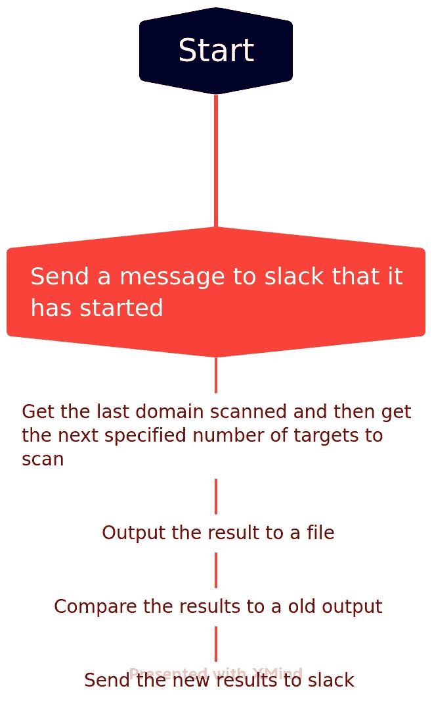

# 监控你的目标是否有虫子奖励

> 原文：<https://infosecwriteups.com/monitoring-your-targets-for-bug-bounties-36f6be3e69c9?source=collection_archive---------2----------------------->

## (专业提示:使用 medium 的文本到语音转换功能，体验非凡的体验)

你好，

这将是我写过的最喜欢的文章之一。自动化，这是一个非常熟悉的词。也许你已经听到人们说他们仅仅使用一些简单的自动化就获得了一些奖金。所以在这篇文章中，我将讨论关于 bug 赏金自动化。


由 [Ibrahim Boran](https://unsplash.com/@ibrahimboran?utm_source=medium&utm_medium=referral) 在 [Unsplash](https://unsplash.com?utm_source=medium&utm_medium=referral) 上拍摄

要求

1.  VPS 服务器或 Raspberry Pi(我使用 Raspberry Pi，因为人们也可以将它用于其他目的)
2.  了解一些编程语言(当然，最好是 python)
3.  LINUX 作为其强大的
4.  还有 *CRON* (crontab)，中坚力量

所以从主干开始，CRON。因此，如果您不知道 crontab，这里有一个简短的描述:-

Cron 是一个命令行实用程序，它调度任务并根据指定自动运行它们。

在 linux 机器上访问它的方法是使用`sudo crontab -e`。如果您是第一次运行它，它会询问您选择的文本编辑器。你可以根据需要使用任何人。


我的树莓派上的巧克力

因此，我选择了 nano，如果你看到我的时间表工作，你会发现很多事情(我知道你可能想知道*加密挖掘*，但这不是本文的一部分，但我仍然会在最后谈到这一点。

因此，您可以看到，我已经从用户目录中的“bots”文件夹部署了许多脚本。您可以指定在特定时间运行多个命令。所以让我们从 CRON 的语法开始

# Crontab

所以，如果你第一次打开 crontab，你会找到基本的语法，请不要删除讨论语法的部分，这对你将来会有帮助，我在下面给你做了参考

```
# Edit this file to introduce tasks to be run by cron.
# 
# Each task to run has to be defined through a single line
# indicating with different fields when the task will be run
# and what command to run for the task
# 
# To define the time you can provide concrete values for
# minute (m), hour (h), day of month (dom), month (mon),
# and day of week (dow) or use '*' in these fields (for 'any').
# 
# Notice that tasks will be started based on the cron's system
# daemon's notion of time and timezones.
# 
# Output of the crontab jobs (including errors) is sent through
# email to the user the crontab file belongs to (unless redirected).
# 
# For example, you can run a backup of all your user accounts
# at 5 a.m every week with:
# 0 5 * * 1 tar -zcf /var/backups/home.tgz /home/
# 
# For more information see the manual pages of crontab(5) and cron(8)
# 
# m h  dom mon dow   command
```

所以基本语法是

```
m h dom mon dow command
```

其中“m”是分钟

h 是小时

“dom”是星期几

“星期一”是月份和月份

“dow”是星期几

所以现在让我们做一些练习:-

> 使用'-as '(自动扫描标志)在目标[https://www.example.com](http://www.example.com)的`/home/user/nuclei-scans/`目录中运行核扫描，并在每天上午 12:00 将结果输出到' nucleus-scan . txt '

所以，我们一步一步来。首先，您必须转到指定的目录，所以命令应该是`cd /home/user/nuclei-scans/`。现在，一旦我们切换到目录，我们需要为 nuclei 构建命令。假设 nuclei 二进制设置为 path(或者在/usr/bin 目录下)，命令会是`nuclei -t [https://www.example.com](https://www.example.com) -as -o nuclei-scan.txt`。现在，一旦我们构建了两个命令，让我们将它们组合起来，这样最终的命令将是:-

`cd /home/user/nuclei-scans/ && nuclei -t [https://www.example.com](https://www.example.com) -as -o nuclei-scan.txt`

现在，一旦我们构建了命令，让我们将它添加到 crontab。

所以 crontab 语法中的第一件事是 minute。因此，这里的分钟是“00”(12:00 AM)，下一件事是小时，因此，由于这里是 12:00am，我们将把它转换为 24 小时格式，所以它将成为“00”。接下来是 dom、mon 和 dow，所以因为我们每天都在运行它，所以它将是' * '(星号代表通配符)。所以最后，我们要添加到 crontab 的代码行应该是:-

`00 00 * * * cd /home/user/nuclei-scans/ && nuclei -t [https://www.example.com](https://www.example.com) -as -o nuclei-scan.txt`

将这一行添加到 crontab 将在每天上午 12 点自动运行 nuclei scan

# 向其发送消息的渠道

为此，只需前往 slack [(发送信息到电子邮件更容易，但不适合这项任务](https://www.geeksforgeeks.org/send-mail-gmail-account-using-python/)，因为你可能会弄乱你的收件箱)，为不同的任务创建一个工作空间和渠道。你可以使用这里的指南[来设置一个应用程序，以及如何使用它向空闲频道发送消息。](https://slack.com/intl/en-in/help/articles/115005265063-Incoming-webhooks-for-Slack)

# python/bash 脚本

因此，您可以根据自己的选择使用任何脚本，但我在这方面使用 python，因为它功能强大且简单(bash 也很简单，但我觉得用 python 编写脚本更舒服，所以我们将讨论 python)。

所以假设你有一点 python 编程的经验，并且已经创建了一个 slack webhook

您可以使用以下代码向 slack 发送消息(很抱歉使用这种糟糕的方法😅)

```
import osslack_webhook = "<slack_webhook_URL>"def sendMsg(msg):
    if slack_send_msg == True:
        os.system("curl -X POST -H 'Content-type: application/json' --data '{\"text\":\"" + msg + "\"}' " + slack_webhook)
    else:
        print(msg)
```

所以，我已经部署了三个机器人，首先是寻找新的子域，其次是检查子域接管和一个运行核心。

因此，由于我使用的是计量连接，所以我只扫描几个目标(5-7 个域)

您可以在下面的文件中看到算法:-



监控系统算法

您可以将该算法用于您使用的任何工具。

# 如果我不想购买/租用 raspberry-pi/VPS 服务器怎么办？

你可以用你的笔记本电脑做同样的事情。就在这个时间点，你可以使用`@reboot`，这样它会在你的机器每次重启时运行扫描。下面的示例命令将在每次笔记本电脑重启时运行 nucleus:-

`@reboot cd /home/user/nuclei-scans/ && nuclei -t [https://www.example.com](https://www.example.com) -as -o nuclei-scan.txt`

# 自动化的另一个原因

有时候，自动化的原因可能是消耗掉你剩下的互联网数据，但是是以一种高效的方式(这也是我的原因)。要将你的剩余数据用于一些卓有成效的工作，你可以使用*。它是一个在线服务，帮助你从你剩余的互联网数据中赚一些钱。你可以和你的手机、电脑或者任何你想要的设备分享你剩下的数据。如果你在这里使用我的[推荐链接](https://bit.ly/honeygain-ss)注册，你将获得**额外的 5 美元信用**。所以去吧，现在就[报名](https://bit.ly/honeygain-ss)！*

# *以及加密挖掘(与本主题无关，只是为了好玩)*

*由于任务不会一直运行，我们应该利用它做点什么。所以，我做加密挖掘。有多种硬币可供选择，但最适合 raspberry-pi/VPS 的硬币是 [Duino-Coin](https://duinocoin.com/) 。你可以探索它的[网站](https://duinocoin.com/)并开始挖掘(你不会通过这种挖掘致富，但它会给你一些加密挖掘的经验，这可能是一个不错的投资)。*

****重要提示:确保不要使用您正在工作的机器，因为这会消耗您机器的大量处理能力。****

*我希望这篇文章能帮助你设置你的监控机器。请随意为这篇文章鼓掌，并关注我的更多内容*

****小贴士:你可以为一篇文章鼓掌 50 次****

*:)*

## *来自 Infosec 的报道:Infosec 每天都有很多内容，很难跟上。[加入我们的每周简讯](https://weekly.infosecwriteups.com/)以 5 篇文章、4 个线程、3 个视频、2 个 GitHub Repos 和工具以及 1 个工作提醒的形式免费获取所有最新的 Infosec 趋势！*