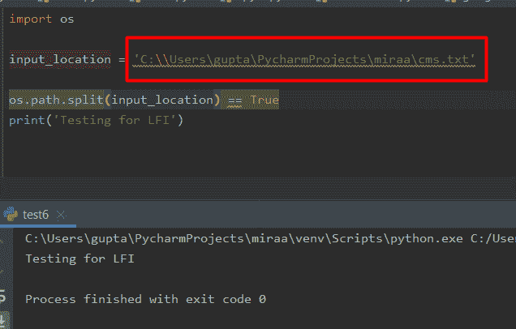
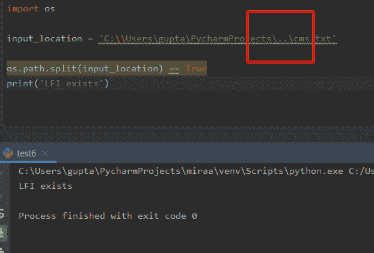

# 最常见的 Python 漏洞以及如何避免它们

> 原文：<https://infosecwriteups.com/most-common-python-vulnerabilities-and-how-to-avoid-them-5bbd22e2c360?source=collection_archive---------0----------------------->

每个人都知道 Python。它现在是全球第二流行的编程语言，已经超过了 Java。它不仅被广泛用于机器学习和数据科学，而且对于初学者来说也很容易学习，因为它简单的代码语法模仿了英语。

当然，随着这种广泛使用，攻击和威胁也随之增加；恶意攻击者更有可能找出 Python 漏洞，他们可以利用这些漏洞为许多应用程序服务。如果您使用许多第三方模块，如 dnspython 或 pip，或者其他开源库，您可能会给应用程序带来安全风险。在本文中，我们将首先讨论开发人员通常忽略的一些问题，然后研究过时的第三方模块带来的威胁。

# 常见的 Python 漏洞

开发应用程序或编写代码时，可能会出现错误或漏洞。这些错误导致缺陷，这些缺陷被称为 [**漏洞**](https://www.rapid7.com/fundamentals/vulnerabilities-exploits-threats/) 。这些缺陷对企业来说可能是危险的，因为当它们被滥用时，会危及系统中数据的安全性和可用性。漏洞的严重程度取决于代码中存在的错误。

例如，假设开发者直接将用户输入传递到系统命令中。在这种情况下，这可能会导致远程代码执行，从而攻击者可以控制整个服务器。因此，了解这些漏洞是如何发生的并避免犯那些可能导致漏洞被利用的错误是至关重要的。

大多数 Python 错误是由用户输入验证不充分引起的，这允许用户插入任意输入来利用系统中的缺陷。让我们来看看一些最常见的 Python 漏洞。

# 1.注入/任意命令执行

[注入缺陷](https://portswigger.net/kb/issues/00100f10_python-code-injection)允许攻击者通过应用程序将恶意代码传递到后端系统或内部系统。注入漏洞在 python 中是最常见的，并且以多种类型出现，如命令注入、SQL 注入等。

用户输入直接在负责在系统上执行命令的标准 python 函数(system，popen)中传递。这使得攻击者能够在目标系统上执行命令。

# 它们为什么存在？

当开发人员没有正确地清理用户输入，而是将它们直接传递给系统命令、SQL 查询等时，通常会出现这种情况。让我们讨论不同类型的注入漏洞。

# 例子

在下面的屏幕截图中，您可以看到用户输入正在被执行它们的操作系统传递。因此，如果应用程序没有正确处理用户输入，攻击者就可以在系统上执行恶意命令。

# 修补

*   我们可以使用“shlex”模块来清理用户输入，因为“shlex”会正确地对用户输入进行转义。
*   在将用户输入传递给系统命令之前，总是先对其进行整理。
*   甚至有时最佳实践会被忽略。为了更加确定，我们可以使用 [WhiteSource Bolt](https://www.whitesourcesoftware.com/free-developer-tools/bolt/) ，这是一个免费的应用程序，你可以安装在 Github 上，也可以使用 Azure 扩展。它实时监控漏洞，并提供有关漏洞的详细信息和可用于修补漏洞的快速修复。

# 2.目录遍历

这个[众所周知的漏洞](https://www.geeksforgeeks.org/directory-traversal-tools-in-python/)也是由于访问文件时对用户输入的不正确过滤造成的。利用这一点，攻击者可以通过浏览器在服务器上包含文件。这可能导致敏感文件泄露，有时还会导致远程代码执行。当应用程序正在访问文件但没有正确验证路径时，就会出现 LFI；因此，用户可以操纵路径来访问服务器上的敏感文件，如/etc/passwd。

# 例子

在下图中，我们可以看到“input_location”的值被直接提供给 os.path.split，使其容易受到本地文件包含漏洞的攻击；因此，攻击者可以从系统中获取敏感文件。

攻击者可以使用目录遍历序列(../)从服务器获取敏感文件。

# 修补

*   使用“shlex”清理用户输入
*   维护用户可以访问的文件的白名单。
*   除非没有特定的业务需求，否则尽量避免使用直接路径。

# 3.过时的依赖项/模块

简单地说，[依赖关系](https://medium.com/knerd/the-nine-circles-of-python-dependency-hell-481d53e3e025)定义了函数、类和变量。有时，在创建模块时，可能会无意中出现一些漏洞。因此，为了修补这些漏洞，开发人员经常更新这些依赖项/模块。如果一个开发人员使用了一个有漏洞的过时的依赖项，就会对组织构成威胁。

# 例子

当我创建一个使用名为“dnspython”的模块或依赖项的脚本时，它的版本是 1.16.0，但该版本中存在一些漏洞，因此开发人员发送了一个更新，现在它的最新版本是 2.1.0。

查看 1.7.0 版本中的漏洞，它具有一些高严重性的漏洞。因此，如果我仍然使用过时的版本，这可能会对我的组织构成威胁。

CVE 数据库包含供应商发布或承认的每一个安全建议或错误，表明 dnspython 有一些[高严重性](https://www.cvedetails.com/cve/CVE-2008-4126/)漏洞，如果开发人员继续使用易受攻击的版本，这些漏洞就可能被利用

# 修补

*   通过更新所有有可用更新的软件包，可以修复此漏洞。
*   您还可以使用 WhiteSource Bolt 扫描公共和私有存储库来查找漏洞，并通过详细的漏洞描述和快速补丁提供实时更新。

# 4.Assert 语句中的逻辑不足

Python 内置了[断言功能](https://www.programiz.com/python-programming/assert-statement)。断言用于评估条件，例如布尔表达式。如果条件为真，执行移到下一行。否则，它将显示一个错误。

# 例子

在下面的截图中，我们可以看到我正在使用 assert 函数向用户显示一个错误。

*   **当条件为真时:**因为我们在第一条语句中给它提供了值，所以它对它求值并继续前进。
*   **当条件不为真:**由于 marks1 中未提供值，它会生成“AssertionError”并提供消息。

因此，默认情况下，python 会以“**_ debug _**”“true”的形式执行自身。因此，在生产服务器中，它可能会跳过验证语句，例如用户是否有权访问资源，或者是否会导致不正确的身份验证控制。

# 修补

*   不要在生产应用程序中使用断言函数。断言函数仅对内部使用有效，以便开发人员可以执行单元和集成测试。
*   我们可以将 if-else 循环概念用于 true 和 false 条件。

# 5.mktemp()函数的不安全用法

所有组织都需要创建[临时文件](https://docs.python.org/3/library/tempfile.html)。在 python 中，我们可以使用 mktemp()函数生成随机文件名。但是这个函数一点也不安全，因为名称是随机生成的，所以有可能会创建另一个同名的文件；这将覆盖先前保存的其他文件，可能会导致信息丢失。

# 修补

建议使用 mkstemp()代替 mktemp 来生成随机文件名。