# MS Azure 基础知识修订说明

> 原文：<https://infosecwriteups.com/ms-azure-fundamentals-revision-notes-ee5ce9fbafd1?source=collection_archive---------0----------------------->

## AZ-900-Azure 云计算基础

这里我整理了我的 Azure 基础复习笔记。这篇文章是写给任何想在云中开始职业生涯或业务的人的；-)

# 我如何计划我的 Azure 基础准备？

*   先预约考试！如果你完全是云计算的新手，那么在考试前至少留出 3 个月的准备时间。
*   每天复习至少 1 小时。
*   在此期间，我通过免费和付费的在线选择题来测试我对这个教学大纲的理解。

## 免费学习资源

*   [微软 Azure 基础知识](https://docs.microsoft.com/en-gb/learn/paths/az-900-describe-cloud-concepts/) —涵盖 6 个领域的免费在线课程。还包括测验。
*   itexams.com[—包含部分自由练习题](https://www.itexams.com/info/AZ-900)
*   [testpreptraining.com](https://www.testpreptraining.com/microsoft-azure-fundamentals-az-900-free-practice-test)—包含部分自由练习题
*   [az-900 问题](https://www.exam-answer.com/microsoft/az-900) —包含 130 道选择题

## 付费学习资源

*   [Whizlabs](https://www.whizlabs.com/microsoft-azure-certification-az-900/) -购买了包含 13 个模拟测试和 300 多个问题的模拟试卷。

# **********我的复习笔记**********

## 什么是云计算？

> 简单来说，**云计算**基本上是一家数据中心公司，为组织提供各种租赁服务。

## 组织内部数据中心的典型要求

内部基础架构是组织的私有云，他们可以完全控制其基础架构和应用程序。以下是一个组织最初必须投资建设数据中心设施的要求(资本支出/前期成本)列表。这些包括:

*   物理服务器
*   存储服务器
*   网络设施
*   投资冷却
*   投资于安全
*   持续维护(运营支出(OpEx))

## 为什么组织要转向云计算？

一个组织可以通过将其所有应用程序和数据迁移到在全球拥有冗余数据中心的云服务提供商，来降低维护其内部物理数据中心的成本。使用 CSP 的服务降低了公司在 IT 方面的总体计算成本。

**以下是迁移到云服务提供商的一些好处:**

*   组织不需要在上述所有方面进行初始投资。因此消除了资本支出成本。
*   只为您使用的东西付费(运营支出)
*   几个有益的虚拟功能。例如:在互联网上创建虚拟服务器的能力。

# Azure 基础知识的 6 个领域

## [第 1 部分:描述核心 Azure 概念](https://docs.microsoft.com/en-gb/learn/paths/az-900-describe-cloud-concepts/)

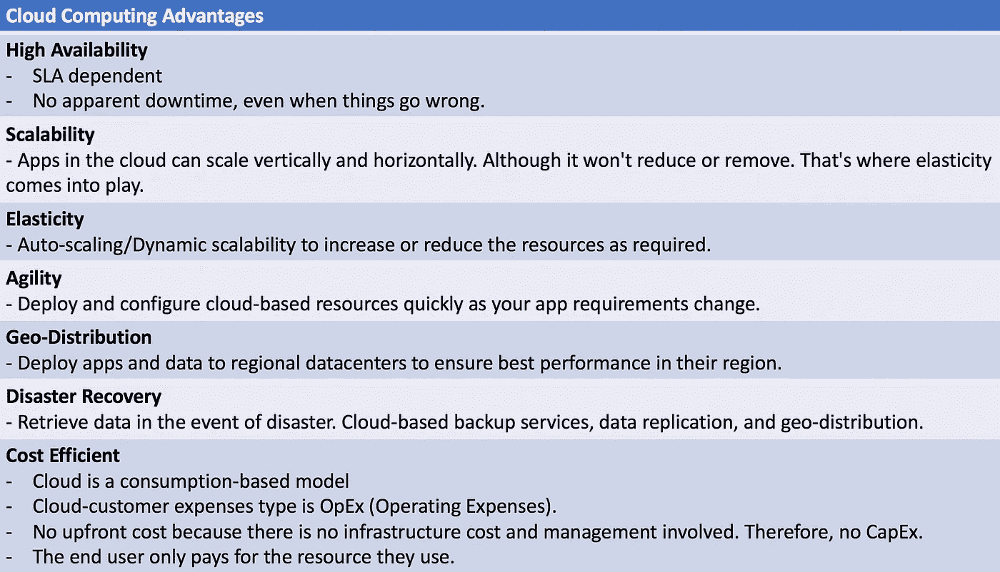

有 3 种类型的**云计算部署模式。这些是:**

*   **私有云。**内部/公司管理。
*   **公有云。**异地/云服务提供商管理。
*   **混合云。**私有云+公有云的组合。

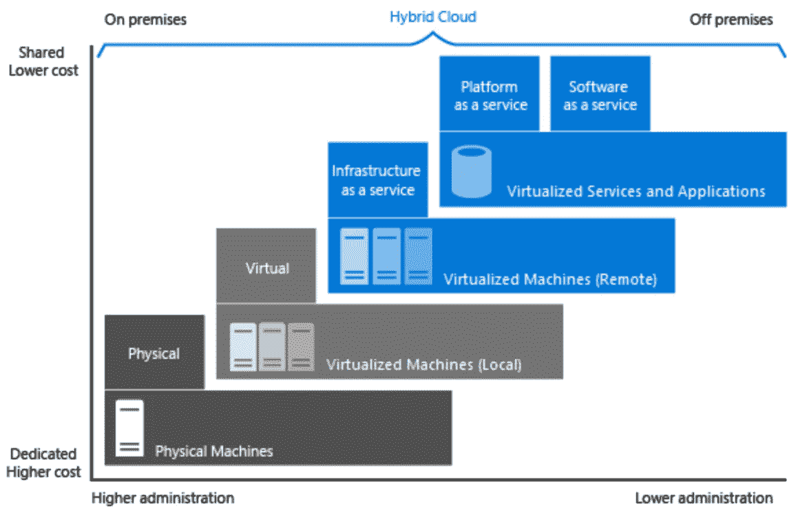

[https://docs . Microsoft . com/en-GB/learn/modules/intro-to-azure-fundamentals/什么是云计算](https://docs.microsoft.com/en-gb/learn/modules/intro-to-azure-fundamentals/what-is-cloud-computing)

**云服务模式**

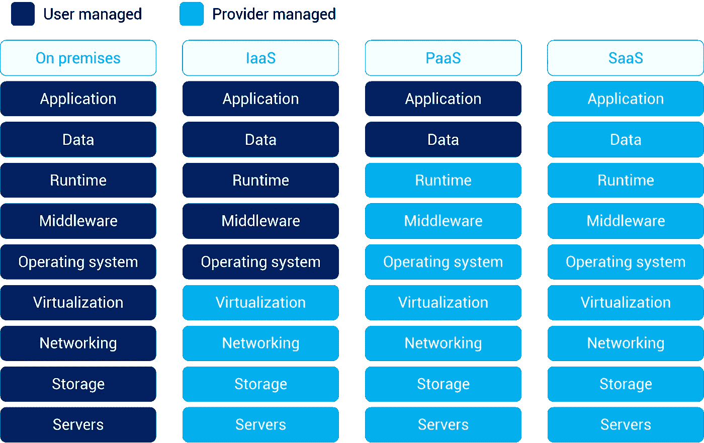

[https://www.alibabacloud.com/knowledge/what-is-paas](https://www.alibabacloud.com/knowledge/what-is-paas)

**其他云服务模式有:** { *未包含在教学大纲中}*

*   **DaaS**——桌面即服务
*   **MBA as**-**-移动后端即服务**
*   **-**-**功能为服务。**

****以下是您可以在这些云服务模式下创建的一些示例服务/应用。****

****

****Azure 十大最常用类别。****

****

**[https://docs . Microsoft . com/en-GB/learn/modules/intro-to-azure-fundamentals/tour-of-azure-services](https://docs.microsoft.com/en-gb/learn/modules/intro-to-azure-fundamentals/tour-of-azure-services)**

****

****两者都是 IaaS 型号****

**[**Azure 数据中心的本地、区域和地理位置**](https://docs.microsoft.com/en-gb/learn/modules/azure-architecture-fundamentals/regions-availability-zones)**

****Azure Scale sets** —让您部署和管理一组相同的虚拟机。**

****Azure avail ability sets**—物理上分离的设备，并针对同一数据中心内的故障提供保护。**

****Azure 可用性区域** —由一个或多个数据中心组成。物理分离。**

**蓝色区域 —至少有 3 个可用区域。**

****Azure Region Pair** —同一地理区域内的两个地区(即美国、欧洲或亚洲)总是成对出现。这允许跨地理位置复制资源。**

**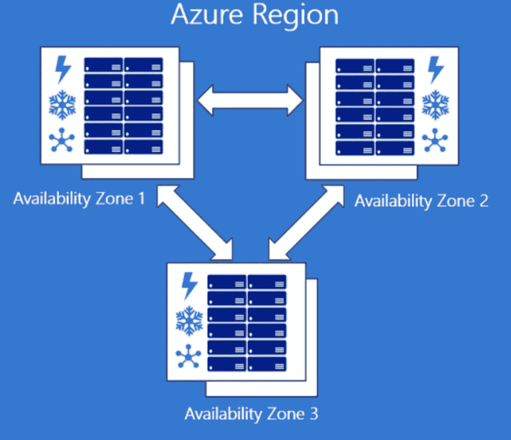**

****Azure 门户& Azure Marketplace****

*   ****Azure market place**——一个托管应用程序的在线商店，这些应用程序已经过认证和优化，可以在 Azure 上运行。**
*   **[**Azure 门户**](https://docs.microsoft.com/en-us/azure/azure-portal/) - 一个基于网络的用户界面，在这里你可以访问 Azure 的几乎所有功能。它还用于从单个统一控制台部署、管理和监控从简单的 web 应用程序到复杂的云应用程序。[https://portal.azure.com](https://portal.azure.com)**

****了解 Azure 的资源组织结构。****

****这分为 4 个级别:(1。)管理组(2。)订阅(3。)资源组(4。)资源。****

**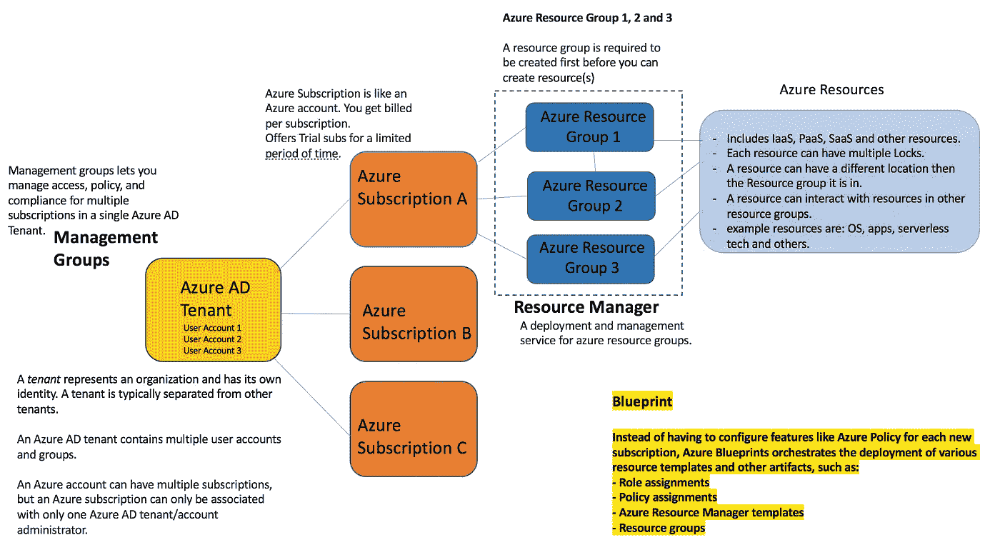****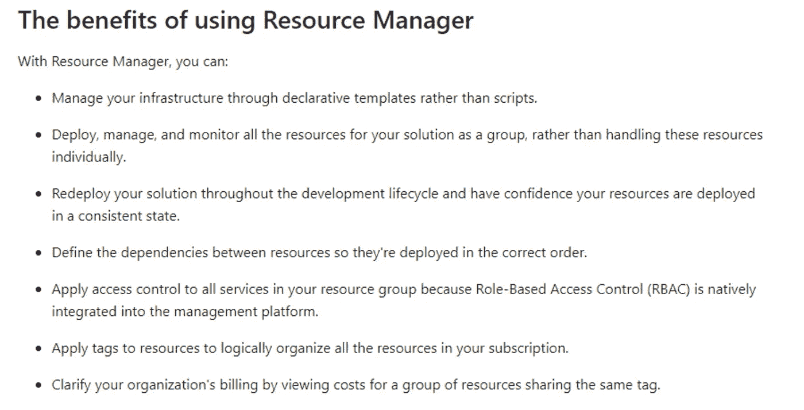**

****使用资源管理器的好处****

> **azure 中的资源只能是单个资源组的一部分。**
> 
> **-将标记分配给资源组不会被其中的资源继承。**
> 
> **-不能将资源组嵌套在一起**
> 
> **-向资源组分配权限由其中的资源继承。**
> 
> **-资源组中的资源没有继承分配给其资源组的相同标记。**
> 
> **- Azure 资源还可以访问来自另一个资源组和多个 Azure 区域的资源。**
> 
> **-删除 Azure 资源组会删除该组中的所有资源。**
> 
> **-资源组没有相关的成本。**
> 
> **-虚拟机的可用性区域(一个区域内多个 DC 中的相同虚拟机)和可用性集(同一 DC 内的相同虚拟机)。这两个你可以任选一个。**
> 
> **-可用性区域目前并非在所有地区都可用。**

## **第二部分:描述核心 Azure 服务**

**以下是核心 Azure 产品列表。如需完整列表，请点击[此处](https://docs.microsoft.com/en-us/azure/?product=all)。**

***注:有些服务属于多个类别。即 Azure Functions 服务属于计算、物联网和容器类别。***

******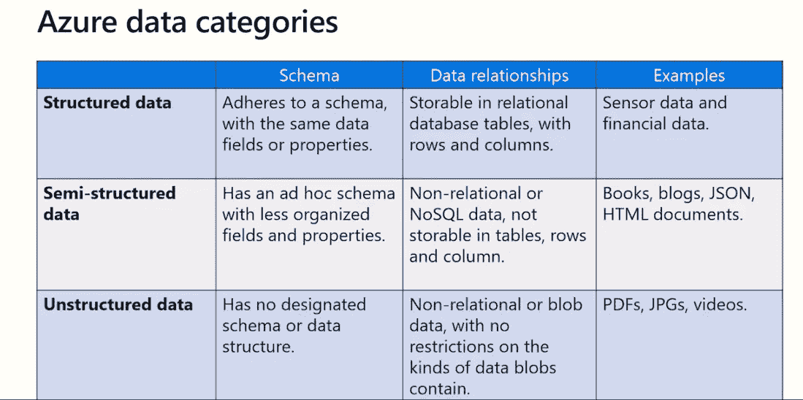**

**[**Azure 计算服务**](https://docs.microsoft.com/en-us/learn/modules/azure-compute-fundamentals/overview) **。**以下是 Azure 提供的一些计算服务:**

*   **Azure 虚拟机和 Azure 虚拟机规模集**
*   **Azure 应用服务**
*   **Azure Function App(或*无服务器计算***
*   **Windows 虚拟桌面**
*   **Azure 容器实例和 Azure Kubernetes 服务**

****在 Azure 中管理 Docker 和基于微软的容器****

**两种方式是:Azure 容器实例和 Azure Kubernetes 服务(AKS)。**

**Docker 是一个用于管理容器的开源平台。**

**容器提供了无需操作系统启动和初始化即可运行的应用程序。一个应用程序及其依赖项被打包到一个**容器**中。这为所有应用程序提供了独立的执行。**

**无服务—这是自动化任务的理想选择。例如，当用户完成在线购买交易时，会发送一封确认电子邮件。**

****

**[https://www . cloud flare . com/en-GB/learning/server less/server less-vs-containers/](https://www.cloudflare.com/en-gb/learning/serverless/serverless-vs-containers/)**

> **-要调配超过默认限制的更多虚拟机，您需要向 Microsoft 申请支持。**

**[**Azure 数据库服务**](https://docs.microsoft.com/en-us/learn/modules/azure-database-fundamentals/)**

********

****Azure 大数据和分析服务****

**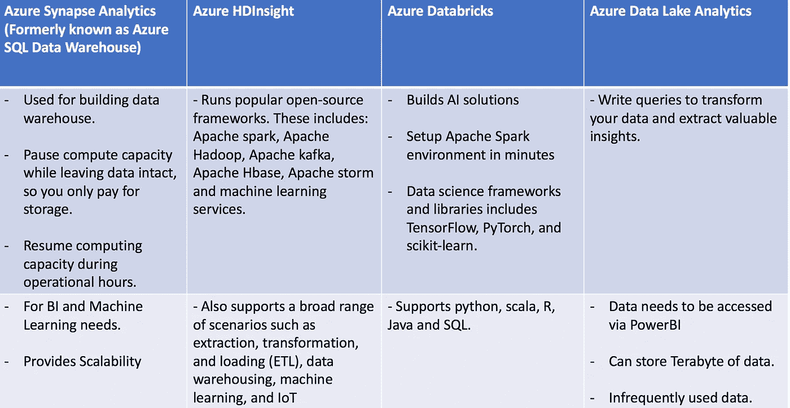**

****Azure 大数据和分析服务****

> **- Azure Application Insights 用于监控基于生产的环境中托管的 web 应用。**

**[**Azure 存储账户类型&服务**](https://docs.microsoft.com/en-us/learn/modules/azure-storage-fundamentals/)**

****

****存储账户类型:**[https://docs . Microsoft . com/en-us/azure/Storage/common/Storage-Account-overview？TOC =/azure/storage/blobs/TOC . JSON](https://docs.microsoft.com/en-us/azure/storage/common/storage-account-overview?toc=/azure/storage/blobs/toc.json)**

****

> **-您需要先创建 Azure 存储帐户，然后才能使用任何 Azure 存储功能。**
> 
> **- Blob 恢复是指在可以访问数据之前，对归档文件进行恢复。**

**[**Azure 网络服务**](https://docs.microsoft.com/en-gb/learn/modules/azure-networking-fundamentals/)**

**下面是在使用提供的连接选项部署 VPN 网关之前，Azure 和内部部署的要求。**

**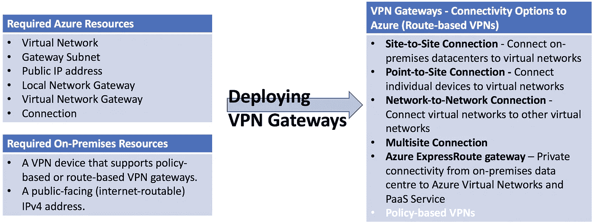**

****Azure VPN 网关基础知识**:[https://docs . Microsoft . com/en-us/learn/modules/Azure-networking-Fundamentals/Azure-VPN-Gateway-Fundamentals](https://docs.microsoft.com/en-us/learn/modules/azure-networking-fundamentals/azure-vpn-gateway-fundamentals)**Azure Express-route 基础知识:**[https://docs . Microsoft . com/en-us/learn/modules/Azure-networking-Fundamentals/Express-route-Fundamentals](https://docs.microsoft.com/en-us/learn/modules/azure-networking-fundamentals/express-route-fundamentals)**

****ExpressRoute 车型有:****

*   **任何对任何连接**
*   **点对点以太网连接**
*   **云交换托管**

**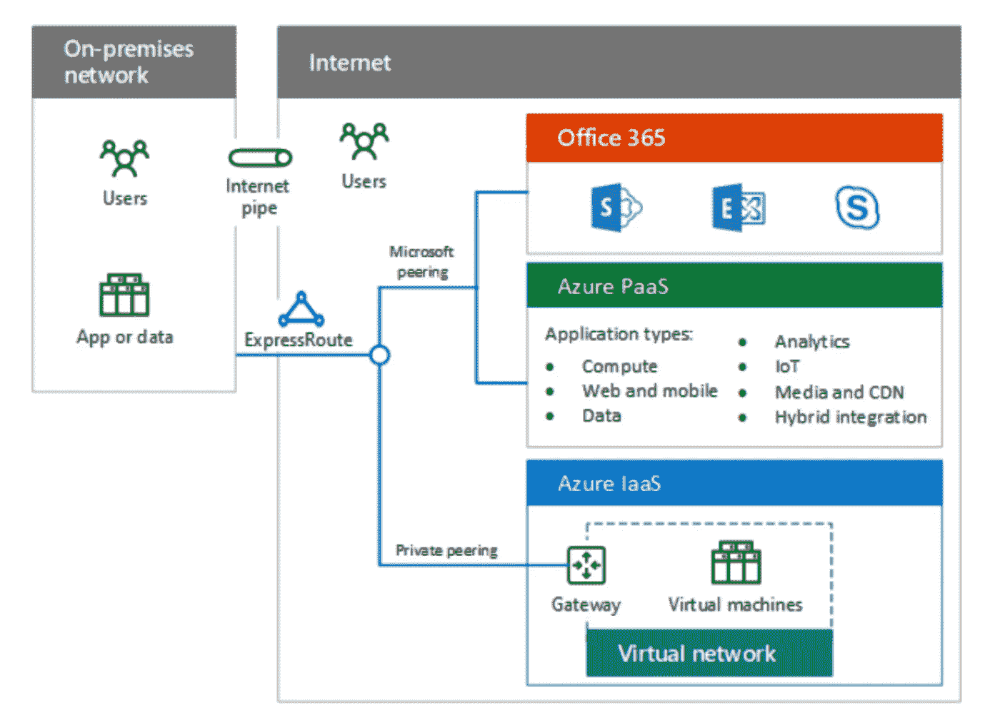****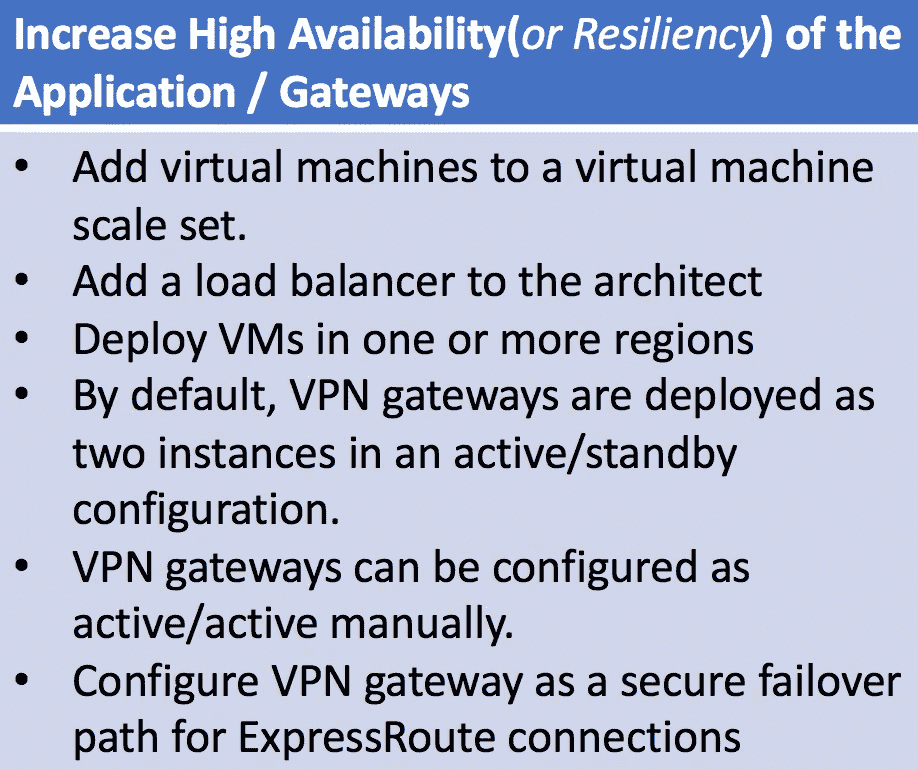**

> **-虚拟网络对等可用于链接虚拟网络。**
> 
> **- ExpressRoute 提供专用连接，它不加密。**
> 
> **-网络安全组(NSG)可以与网络接口或虚拟网络子网相关联。**

## **[第 3 部分:描述 Azure 核心解决方案和管理工具](https://docs.microsoft.com/en-us/learn/paths/az-900-describe-core-solutions-management-tools-azure/)**

**[**最佳人工智能服务**](https://docs.microsoft.com/en-us/learn/modules/ai-machine-learning-fundamentals/2-identify-product-options)**

*   **[Azure 机器学习服务](https://docs.microsoft.com/en-us/azure/machine-learning/overview-what-is-azure-ml)——做预测的平台。ML 根据用户行为、用户历史销售数据、趋势销售数据、库存等提供个性化推荐。**
*   **[Azure 认知服务](https://azure.microsoft.com/en-us/services/cognitive-services/)——提供预构建的机器和学习模型，使应用程序能够看、听、说、理解，甚至开始推理。**
*   **Azure BOT 服务 -创建虚拟代理的平台，这些代理像人类一样理解和回答问题。**

**[**最佳开发者工具，打造更好的解决方案**](https://docs.microsoft.com/en-us/learn/modules/azure-devops-devtest-labs/1-introduction)**

*   **Azure DevOps 服务管道、Git 仓库、看板、负载测试。**
*   **[GitHub 和 GitHub 动作](https://docs.microsoft.com/en-us/azure/developer/github/github-actions)**
*   **[Azure DevTest Labs](https://docs.microsoft.com/en-us/azure/lab-services/) -快速创建环境，控制成本。It 高效地自我管理虚拟机(VM)和 PaaS 资源，无需等待批准。**

****

**[**最佳监控服务的可见性、洞察力和中断**](https://docs.microsoft.com/en-us/learn/modules/monitoring-fundamentals/2-identify-product-options)**

*   **[Azure Advisor](https://docs.microsoft.com/en-us/azure/advisor/) -提供关于高可靠性、成本、安全性、卓越运营和性能的建议。**
*   **[Azure Monitor](https://docs.microsoft.com/en-us/azure/azure-monitor/)——从 Azure 租户、订阅、资源、操作系统和应用程序中提取指标和日志数据，并采取措施分析、可视化、响应、集成和提供洞察信息。**
*   **[Azure 服务运行状况](https://docs.microsoft.com/en-us/azure/service-health/) -提供 Azure 服务、区域和资源运行状况的个性化视图。事件包括:服务问题、计划维护事件和健康咨询。**

> **- Azure Advisor 还提供支持备份的建议。**

**[**最佳管理工具&配置您的 Azure 环境**](https://docs.microsoft.com/en-us/learn/modules/management-fundamentals/2-identify-product-options)**

*   **Azure 门户——一个基于网络的用户界面，在这里你可以访问 Azure 的几乎所有功能。**
*   **Azure 移动应用——提供 iOS 和 Android 对 Azure 资源的访问，以便:(1。)监控您的 Azure 资源的运行状况和状态。(2.)检查警报，快速诊断和修复问题，并重启 web 应用或虚拟机。(3.)运行 Azure CLI 或 Azure PowerShell 命令来管理您的 Azure 资源。**
*   **Azure PowerShell-Azure PowerShell 是一个可以执行 cmdlets 命令的 Shell。Azure PowerShell 运行在 Windows、Linux 和 Mac 上，可以通过云壳在 web 浏览器中访问。**
*   **Azure 命令行界面(CLI)-Azure CLI 命令行界面是一个可执行程序，它在 bash 中执行命令。Azure CLI 运行在 Windows、Linux 和 Mac 上，可以通过云外壳在 web 浏览器中访问。**
*   **[ARM 模板](https://docs.microsoft.com/en-us/azure/azure-resource-manager/templates/)——允许你以声明性的 JSON 格式描述你想要使用的资源。在执行任何代码之前，都要验证整个 ARM 模板，以确保正确创建和连接资源。**

**[**最佳 Azure 无服务器技术**](https://docs.microsoft.com/en-us/learn/modules/serverless-fundamentals/2-identify-product-options)**

*   **Azure Functions -基于事件创建基础设施。**
*   **[Azure Logic Apps](https://docs.microsoft.com/en-us/azure/logic-apps/)——一种云服务，当你需要集成应用、数据、系统和服务时，它可以创建工作流。**
*   **Azure 事件网格——一个完全托管的智能事件路由服务。**

**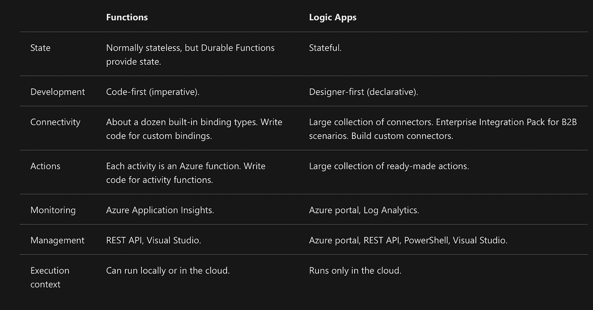**

**[**最佳 Azure 物联网服务**](https://docs.microsoft.com/en-us/learn/modules/iot-fundamentals/2-identify-product-options)**

*   **[Azure 物联网中心](https://docs.microsoft.com/en-us/azure/iot-hub/about-iot-hub) -通过发送和接收消息，在物联网设备和物联网应用程序之间进行通信。**
*   **[Azure IoT Central](https://docs.microsoft.com/en-us/azure/iot-central/) -创建基于 web 的管理门户，以支持与物联网设备的报告和通信。**
*   **蓝色球体 -提供最高程度的安全。**

## **[第 4 部分:描述一般安全和网络安全特性](https://docs.microsoft.com/en-gb/learn/modules/protect-against-security-threats-azure/2-protect-threats-security-center)**

**[**蔚蓝安全中心**](https://docs.microsoft.com/en-us/azure/security-center/)**

**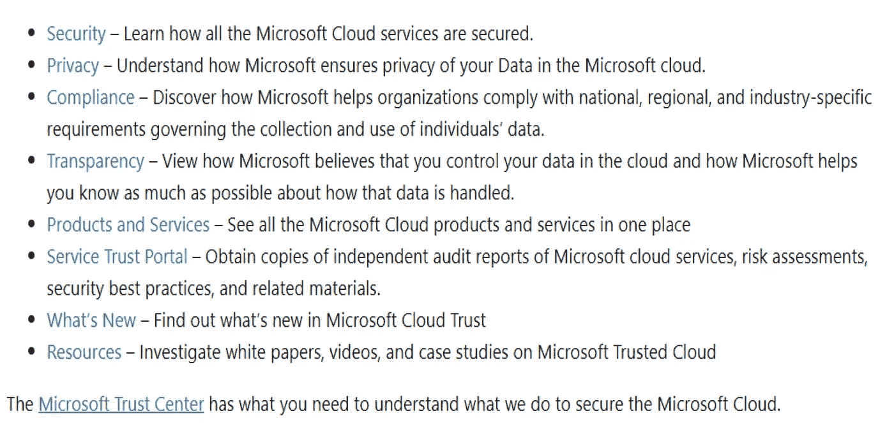**

> **- Azure Security Center 提供跨所有 yout 云和内部工作负载的免费服务。**

****威胁防护****

*   **即时虚拟机访问**
*   **适应性应用控制**
*   **适应性网络强化**
*   **文件完整性监控**

**[**Azure Sentinel**](https://docs.microsoft.com/en-gb/learn/modules/protect-against-security-threats-azure/3-detect-respond-threats-sentinel)**-**微软基于云的 SIEM 系统。它使用智能安全分析和威胁分析。**

**[**Azure Key Vault**](https://docs.microsoft.com/en-gb/learn/modules/protect-against-security-threats-azure/4-manage-secrets-key-vault)**——使用 Azure Key Vault 存储和管理秘密。****

*   ******管理秘密。**即令牌、密码、证书、API 密钥等秘密。****
*   ******管理加密密钥******
*   ******管理 SSL/TLS 证书******
*   ******存储由硬件安全模块(HSM)支持的秘密******

******使用 Azure Key Vault 的好处******

*   ****集中式应用程序机密****
*   ****安全地存储机密和密钥****
*   ****访问监控和访问控制****
*   ****简化应用程序机密的管理****
*   ****与其他 azure 服务的集成。****

****[**天蓝色专用主机**](https://docs.microsoft.com/en-gb/learn/modules/protect-against-security-threats-azure/6-host-virtual-machines-dedicated-hosts)****

*   ****在专用物理服务器上托管虚拟机。****
*   ****让您能够看到并控制运行 Azure 虚拟机的服务器基础架构。****
*   ****通过在独立的服务器上部署工作负载，帮助满足合规性要求。****
*   ****允许您选择同一主机内的处理器数量、服务器功能、虚拟机系列和虚拟机大小。****

********

******Azure 专用主机:**[https://docs . Microsoft . com/en-GB/learn/modules/protect-from-security-threats-Azure/6-host-virtual-machines-Dedicated-hosts](https://docs.microsoft.com/en-gb/learn/modules/protect-against-security-threats-azure/6-host-virtual-machines-dedicated-hosts)****

********

******DDOS******

## ****[第 5 部分:描述身份、治理、隐私和合规性特征](https://docs.microsoft.com/en-us/learn/paths/az-900-describe-identity-governance-privacy-compliance-features/)****

******Azure Active Directory 提供以下服务:******

*   ****安全认证- MFA(用户知道的东西、用户拥有的东西和用户是什么东西)和有条件访问(要求用户只能从批准或管理的设备访问您的应用程序)****
*   ****单点登录(SSO)****
*   ****应用管理****
*   ****设备管理****

********

> ****[- Azure 广告计划](https://azure.microsoft.com/en-us/pricing/details/active-directory/)包括免费的 Office 365 应用程序、高级 P1 和高级 P2****
> 
> ****[-Azure AD](https://azure.microsoft.com/en-us/support/legal/sla/active-directory/v1_0/)基本和高级服务的 SLA 为 99.9%****

****[**云采用 Azure 框架**](https://docs.microsoft.com/en-gb/learn/modules/build-cloud-governance-strategy-azure/2-accelerate-cloud-adoption-framework) **。阶段包括:******

1.  ****定义你的策略****
2.  ****想办法****
3.  ****准备好您的组织****
4.  ****采用云****
5.  ****治理和管理您的云环境****

****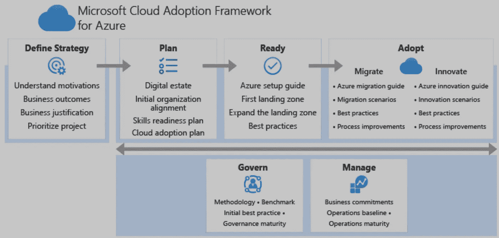****

****[https://docs . Microsoft . com/en-us/learn/modules/build-cloud-governance-strategy-azure/2-accelerate-cloud-adoption-framework](https://docs.microsoft.com/en-us/learn/modules/build-cloud-governance-strategy-azure/2-accelerate-cloud-adoption-framework)****

****[**创建和管理订阅**](https://docs.microsoft.com/en-us/learn/modules/build-cloud-governance-strategy-azure/3-create-subscription-governance-strategy)****

****Azure 治理策略通常从订阅级别开始。****

1.  ****演员表****
2.  ****访问控制****
3.  ****认购限额****

****[**Azure 基于角色的访问控制**](https://docs.microsoft.com/en-us/learn/modules/build-cloud-governance-strategy-azure/4-control-access-azure-rbac) **-** 控制对云资源的访问。****

****[**资源锁**](https://docs.microsoft.com/en-us/learn/modules/build-cloud-governance-strategy-azure/5-prevent-changes-resource-locks)**——防止对资源的意外更改。******

******[**标签**](https://docs.microsoft.com/en-us/learn/modules/build-cloud-governance-strategy-azure/7-organize-resource-tags)——整理 Azure 资源。******

****[**Azure 策略**](https://docs.microsoft.com/en-us/learn/modules/build-cloud-governance-strategy-azure/8-control-audit-resources-azure-policy) -控制和审计您的资源****

****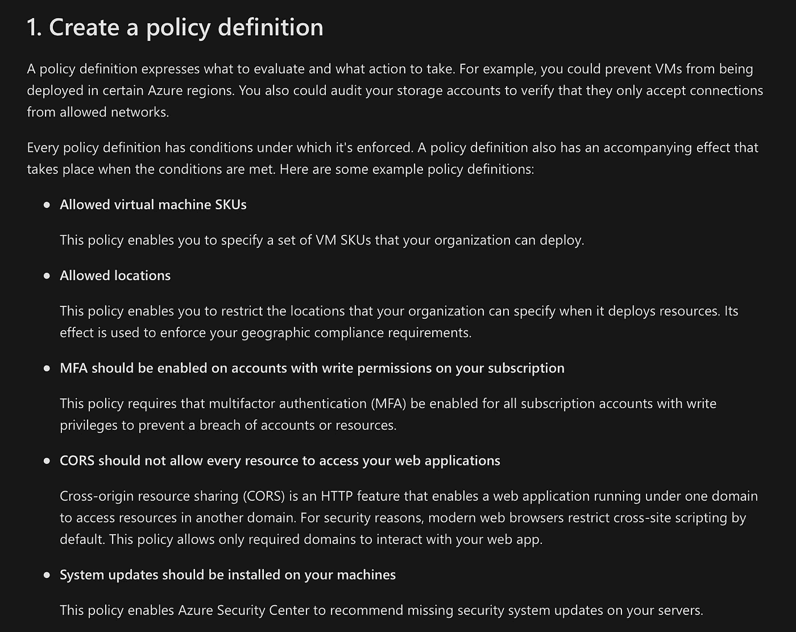************

****[**Azure 蓝图**](https://docs.microsoft.com/en-us/learn/modules/build-cloud-governance-strategy-azure/10-govern-subscriptions-azure-blueprints)——治理多个订阅。提供一种声明性的方式来协调各种资源的部署。****

****[**监管合规**](https://docs.microsoft.com/en-gb/compliance/)****

> ****[- Azure 企业对企业(B2B)](https://docs.microsoft.com/en-us/azure/active-directory/external-identities/what-is-b2b) 将允许与没有 Azure 广告帐户的合作伙伴进行协作。****

## ****[第 6 部分:描述 Azure 成本管理和服务水平协议](https://docs.microsoft.com/en-us/learn/paths/az-900-describe-azure-cost-management-service-level-agreements/)****

********

****比较支持计划:[https://azure.microsoft.com/en-us/support/plans/](https://azure.microsoft.com/en-us/support/plans/)****

****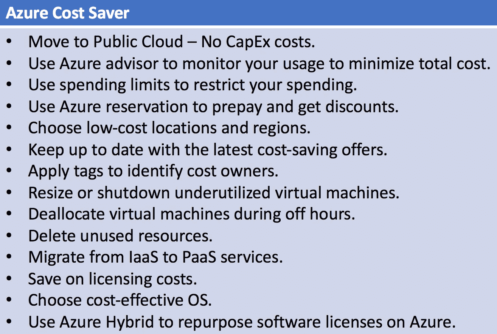****

****Azure 成本节约:[https://docs . Microsoft . com/en-us/learn/modules/plan-manage-azure-costs/6-manage-minimize-total-Cost](https://docs.microsoft.com/en-us/learn/modules/plan-manage-azure-costs/6-manage-minimize-total-cost)****

> ****- Azure 保留虚拟机实例是资本支出模型的一部分，因为您需要为一段时间(1 至 3 年)内虚拟机的使用支付前期成本。它降低了虚拟机使用的总体成本。****

********

****[Azure 成本管理](https://azure.microsoft.com/en-us/pricing/details/cost-management/) | [Azure TCO 计算器](https://azure.microsoft.com/en-us/pricing/tco/calculator/) | [定价计算器](https://azure.microsoft.com/en-us/pricing/calculator/)****

****[**天蓝色认购类型**](https://docs.microsoft.com/en-us/learn/modules/plan-manage-azure-costs/4-purchase-azure-services)****

*   ****Azure 免费帐号允许你托管基于产品的资源。虽然，你可能需要使用免费量以外的资源。这将产生额外的费用。Azuree 免费帐户可以有多个套餐。然而，只有一个订阅将有 12 个月免费使用 azure 产品和每个新客户 200 美元的信用点数。****
*   ****Azure 现收现付****
*   ****会员优惠。****

****[**购买 Azure 服务**](https://docs.microsoft.com/en-us/learn/modules/plan-manage-azure-costs/4-purchase-azure-services)****

*   ****通过企业协议****
*   ****直接从网上下载****
*   ****通过云解决方案提供商(CSP)****

****[**蔚蓝定价**](https://azure.microsoft.com/en-us/pricing/)****

****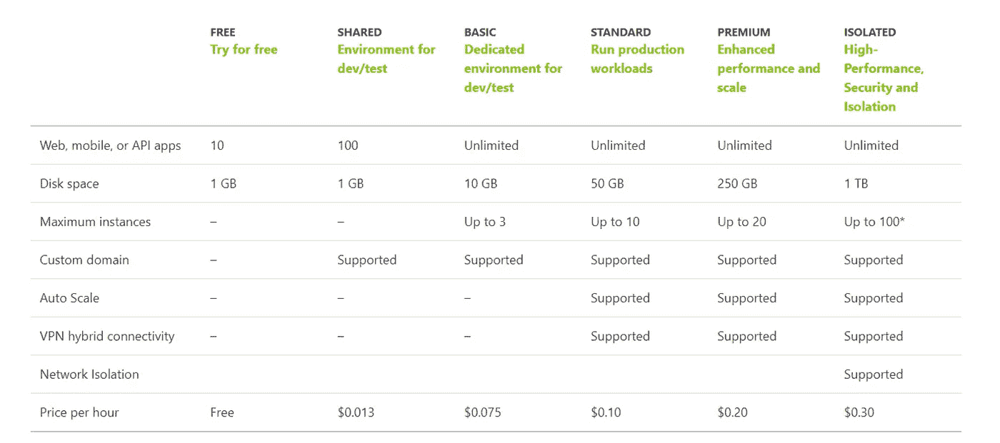****

****[**影响成本的因素**](https://docs.microsoft.com/en-us/learn/modules/plan-manage-azure-costs/4-purchase-azure-services)****

*   ****资源类型和用途****
*   ****使用量表****
*   ****Azure 订阅类型****
*   ****Azure 市场****
*   ****位置****
*   ****网络流量(一些入站数据传输是免费的。出站数据传输不是。)****

****[**SLA**](https://docs.microsoft.com/en-us/learn/modules/choose-azure-services-sla-lifecycle/2-what-are-service-level-agreements)****

****[SLA 排除](https://azure.microsoft.com/en-us/support/legal/preview-supplemental-terms/)包括:公开预览中的服务。****

****[**访问预览服务和预览功能**](https://docs.microsoft.com/en-us/learn/modules/choose-azure-services-sla-lifecycle/5-access-preview-services)****

*****见下面提到一些安全基线检查的文章(与 Azure 基础课程大纲不太相关)*****

**** [## 基线安全检查 II

### 云安全战略

infosecwriteups.com](/baseline-security-check-ii-a9da4f7634ae)****