# PWN101 演练| TryHackMe

> 原文：<https://infosecwriteups.com/pwn101-walkthrough-tryhackme-d34b4236b2a0?source=collection_archive---------1----------------------->

你好，信息安全👋

短暂休息后，我又带着另一个回来了。我跳出框框去结交新的朋友、社交关系，并照顾好自己的心理健康。但是今天，我计划解决一些二进制开发挑战&我写了这个来自***pwn 101-TryHackMe 的 3 个挑战*** *的**演练。***

***【pwn 101】是 TryHackMe 上***[***Jopraveen***](https://twitter.com/jopraveen18)***创建的一个免费房间，意思是任何人都可以在房间里部署虚拟机(无需订阅)！***

> 你可以看到这是二进制开发的挑战。我被触发了！

那么我们开始吧，好吗…？

## **挑战 1:** 缓冲区溢出

*   滥用对易受攻击的函数(gets)的调用来实现缓冲区溢出并覆盖存储在堆栈中的变量值。通过覆盖，我们可以生成一个外壳

我下载了附件并分析了文件。结果显示在下面。

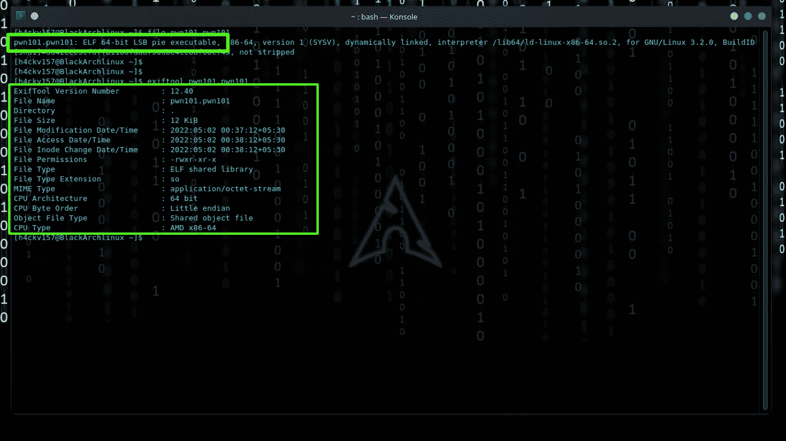

我们开始吧

运行二进制文件后，我发现它查询客户机输入作为配料。嗯……酷！:)

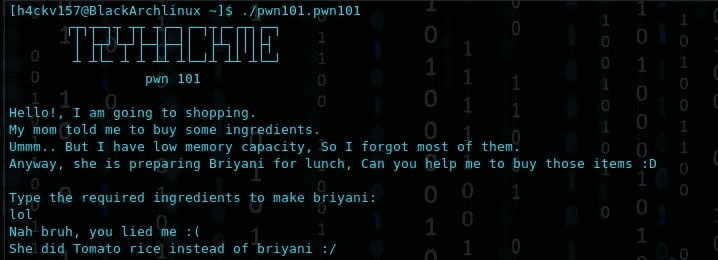

> 奇怪的是，当我提供一些批量输入时，我得到了外壳

现在是分析二进制文件的时候了，此时此刻，我能够理解这个缺陷了。

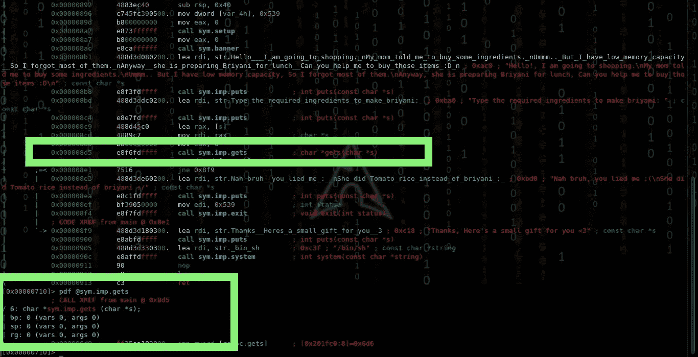

获取()函数

现在的问题只是找出偏移和公平地确认分段故障。检查“A”* 80(80 A)返回分段故障。此外，在所有情况下都相同> 72 A。通过逐步检查这个过程，我发现合适的偏移量是 60！

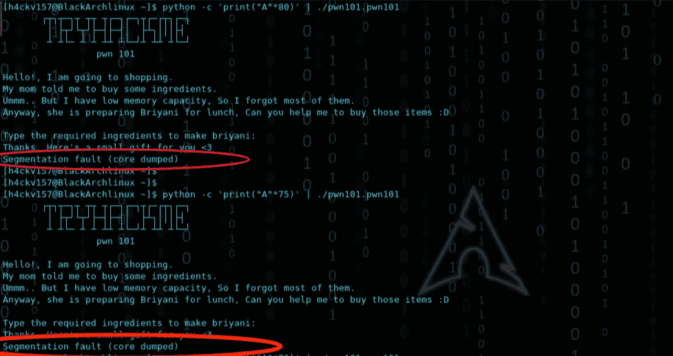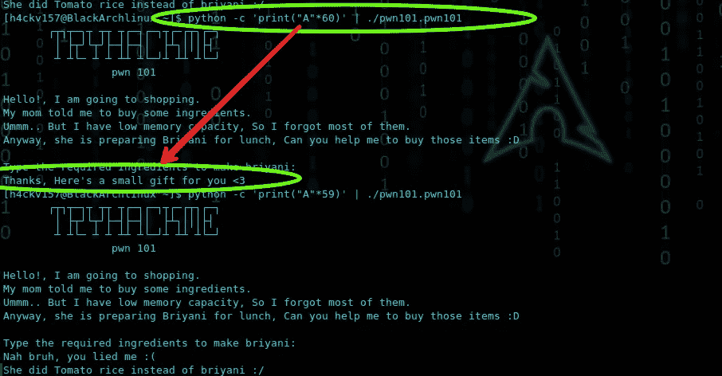

小于 60:无变化，如果输入大于 60，则提供 gift (shell)

## 剥削

滥用是直接的。我们应该将批量值发送到给定的服务器&分配的端口。这样，来自服务器的外壳将返回给我们。我创建了一个简单的 python 脚本来完成这项任务&它的功能与预期一致；)

利用. py

*说对了！成功破解挑战 1*

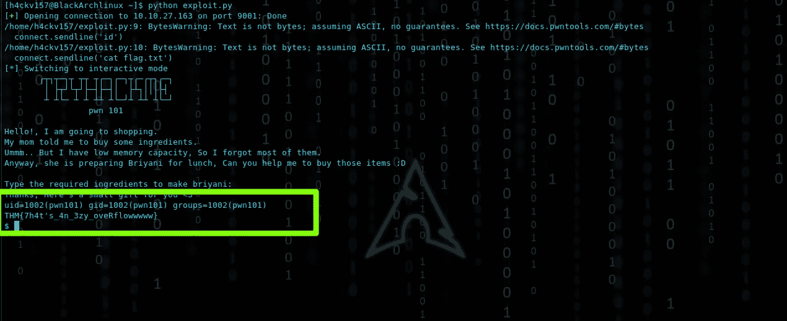

;)

## 挑战 2:修改变量值

*   为了解决第二个挑战，我颠倒了二进制&确定它打算如何解决！在这里，我们将在典型的地址上改变特定的值&此时，我们可以生成 shell:)

> 0x 0000000000000091 a:mov DWORD PTR[RBP-0x 4]，0x badf 00d
> 0x 00000000000921<+35>:mov DWORD PTR[RBP-0x 8]，0xfee1dead

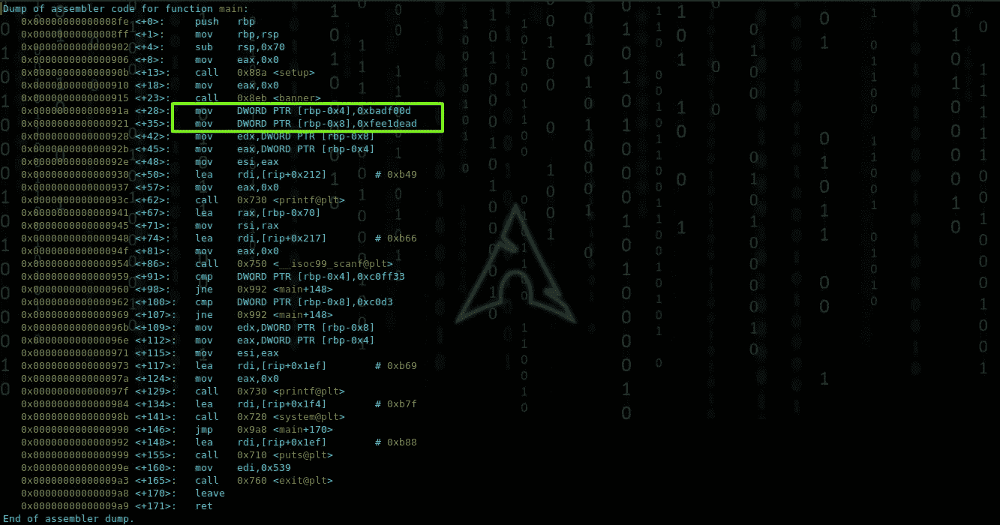

我们知道当前的价值

*   [rbp-0x4]是 0xbadf00d
*   [rbp-0x8]是 0xfee1dead

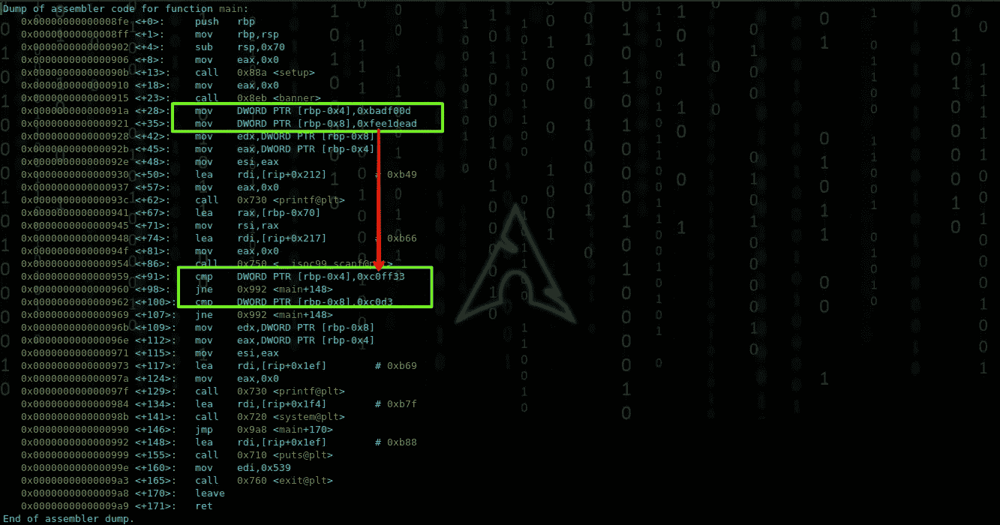

> 0x 00000000000000959:CMP 双字指针[rbp-0x4]，0x c0ff 33
> 0x 000000000000960<+98>:jne 0x 992<main+148>
> 0x 0000000000000962<+100>:CMP 双字指针[rbp

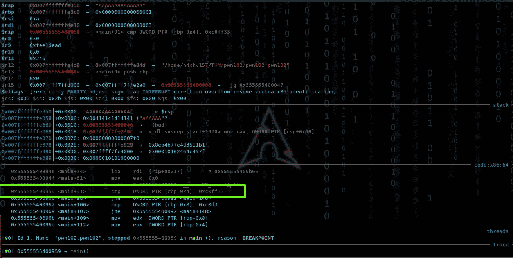

*   在地址“0x0000000000000959”处，它检查[rbp-0x4]是否为 0xc0ff33
*   在“0x0000000000000962”时，它检查[rbp-0x8]是否为 0xc0d3
*   如果条件满足，它将继续在→0x 00000000000096 b 执行
*   否则它会跳到

    <main>不返回外壳。</main>

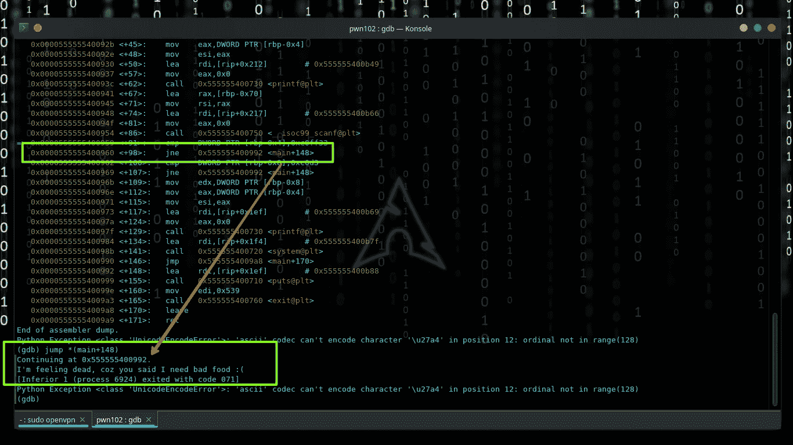

原因:我已经提到，价值观仍然是

*   [rbp-0x4]: 0xbadf00d
*   [rbp-0x8]: 0xfee1dead

## 解决办法

*   我们必须改变执行方向来解决这个挑战。一旦需求得到满足，我们就可以弹出外壳了。我们只需要在地址“0x 5555540096 b

    <main>”进行可能的执行</main>

*   我通过倒车破解了它。但是在二进制开发方面，我们需要做更多的辅助工作。

**证明:**

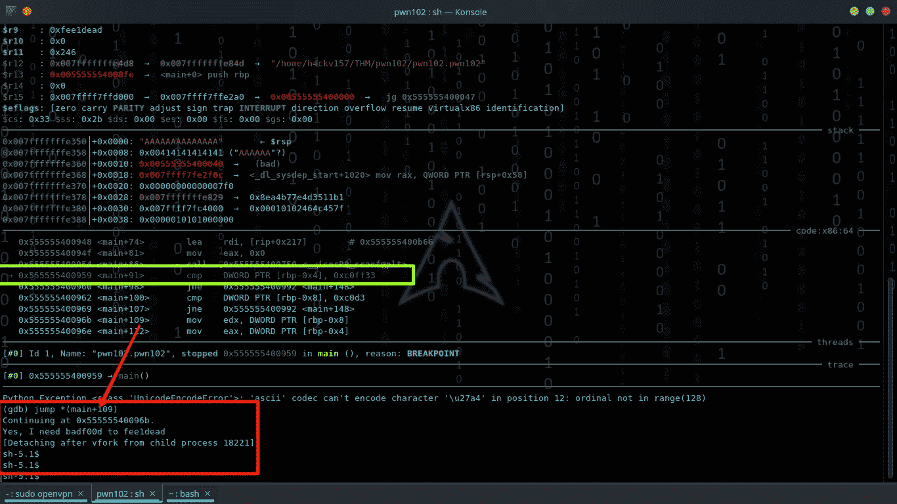

弹壳；)

因此，我为这个挑战编造了一个简单的漏洞，因为我们知道服务运行在端口:9002 上

反向过程中计算的偏移量。这很简单！

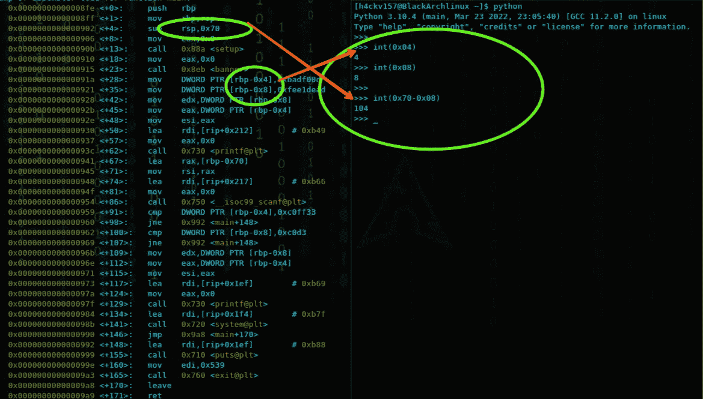

*   以这种方式溢出缓冲区并覆盖内存，我们可以修改弹出 shell 的值。

剥削

*搞定了！成功破解挑战 2*

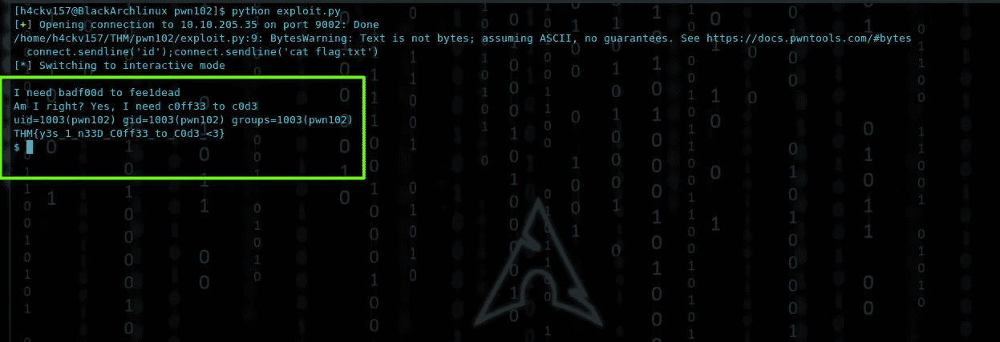

;)

## 挑战三:回归胜利

*   为了解决第三个挑战，我执行了二进制代码并理解了它的功能。我颠倒了思维导图的二进制(我同样的方法)。这里我们将指针返回到弹出外壳的一个不同的地址。

第一，我执行程序，理解流程。

遵守用户输入

我检查了每个选项，有趣的是第三个

*   常规:

它承载着用户输入，同时也有一丝脆弱。我检查了大量输入，我是正确的！

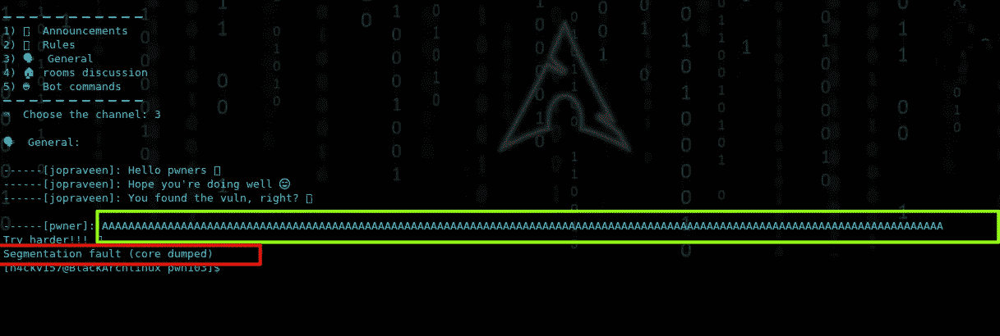

分段故障(核心转储)

## **逆向工程**

对于这个目标，我不得不去理解和深入检查。因此，我颠倒了二进制来理解预谋的解决方案。我在澄清我注意到的步骤！

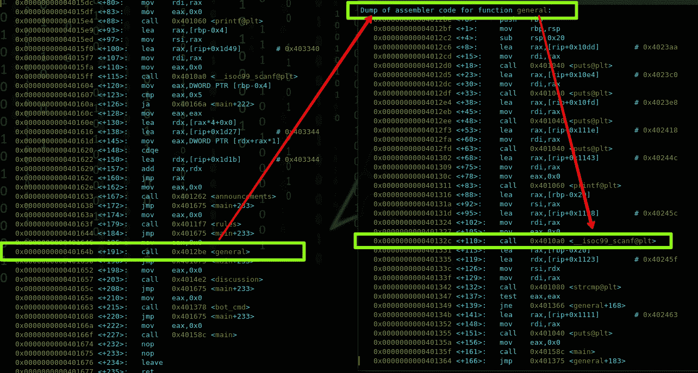

<general></general>

溢出确认，我们可以看到“_isoc99_scanf”，这可能是我们的 scanf 调用。

_isoc99_scanf

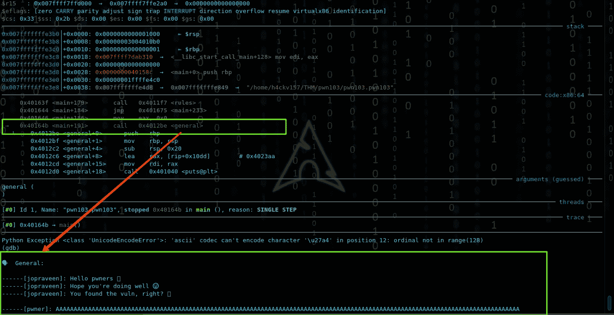

泛滥

## **解决方案**

*   覆盖内存并将执行转换到一个不同的位置。因此，下面的目标是指定返回执行的不同位置。
*   通过逆转自身，我们可以发现我们的终点。

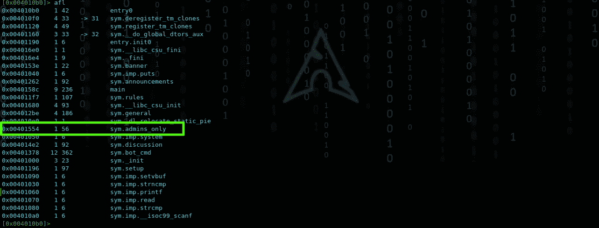

仅限管理员

> 一旦我们执行了这个函数，shell 就会弹出。我用 gdb 证明了这个场景

*   我放置了断点&重定向流程以确保案例。我的决定是对的。弹壳弹出；)

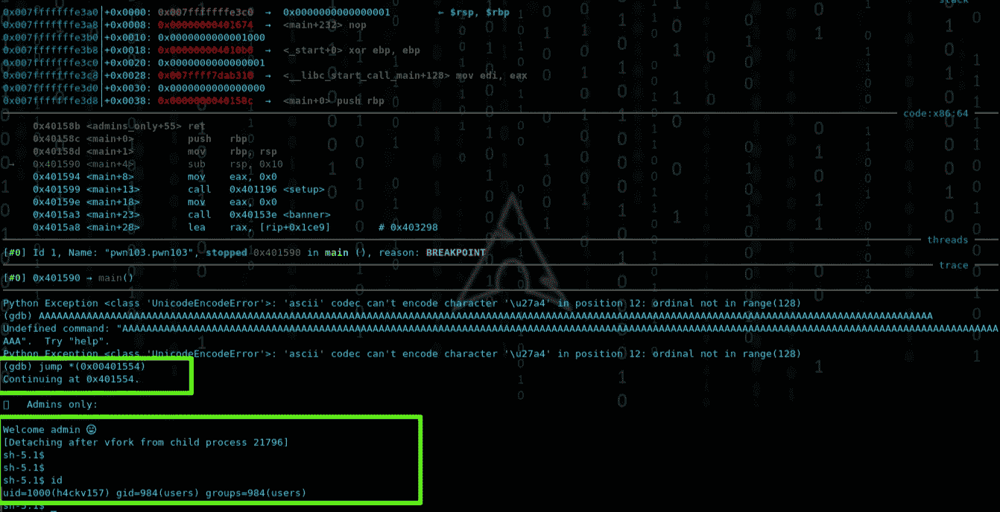

耶！我们拿到壳了

## 剥削

所有积累的信息都得到了很好的处理(在倒车时)。我在本地机器上实现了这个漏洞&它正在蓬勃发展。

成功转移了执行流…！

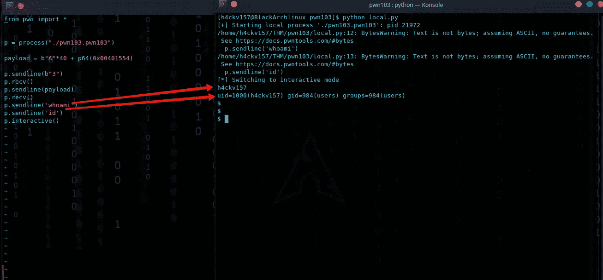

local.py

## 最终利用

*   开发过程中存在一些困难，但我找到了解决办法。为了建立稳定的 shell，我多次插入了返回地址。因此，在触发“ **admins_only** ”函数后，执行 strike & Shell。

> 这个策略同样成功！
> 成功破解挑战 3

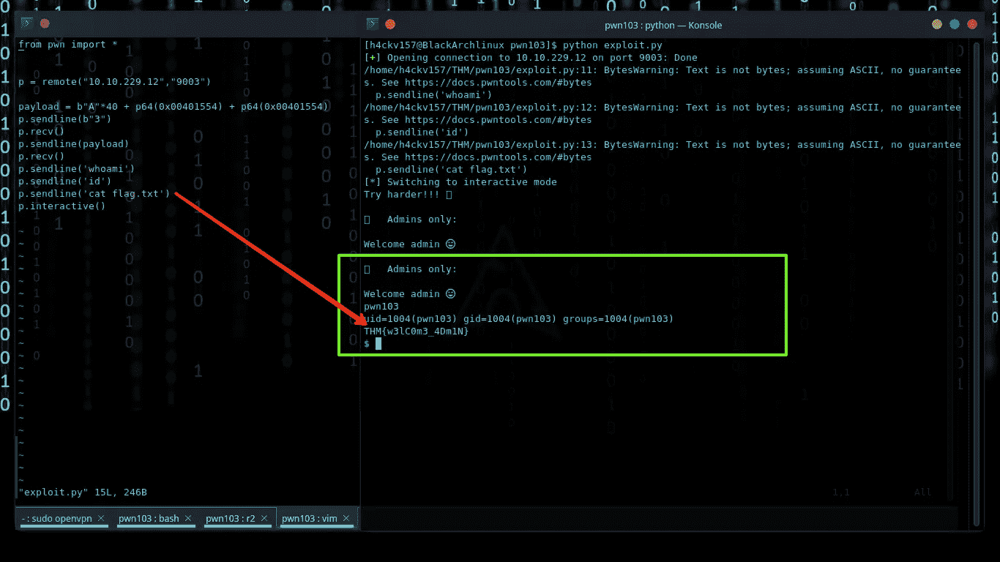

工作完成:)

## 最后的想法

*   还有很多挑战要做。但很遗憾，我坚持不下去了。我的大学内部评估正在进行&这学期很忙。而且，我在户外还有很多可以探索的地方。
*   我很高兴知道休息一段时间后我就可以迎接挑战了。我将很快访问 infosec &继续我的开发系列。

 [## GitHub-7h 3 H4 ckv 157/Binary-Exploitation-series:关于“二进制剥削”的系列写作。

### 一系列关于“二进制剥削”的写作。。通过…为 7h 3 H4 ckv 157/二进制开发系列开发做出贡献

github.com](https://github.com/7h3h4ckv157/Binary-exploitation-series) 

> 我希望你喜欢我的文章。请随时与我联系并分享您的观点。你可以在这里找到我@[7h 3 H4 ckv 157](https://twitter.com/7h3h4ckv157)

再见！