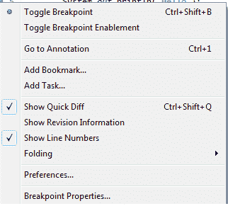
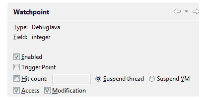
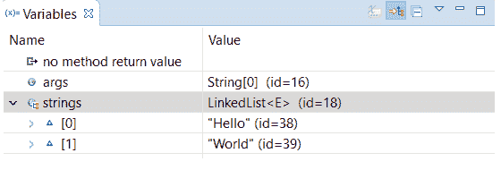
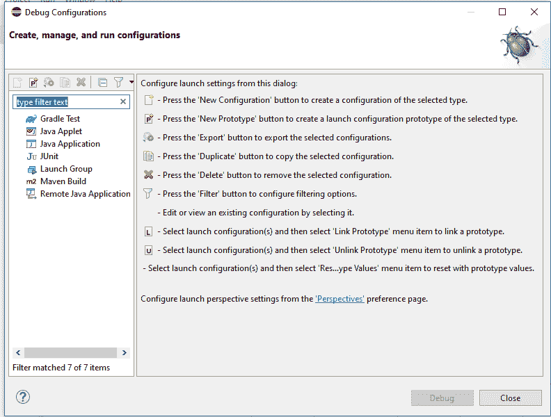

# 快速部署 Java 的顶级调试方法

> 原文：<https://infosecwriteups.com/top-debugging-methods-for-quicker-deployment-in-java-2ae4448c1733?source=collection_archive---------3----------------------->

穆罕默德·拉赫马尼在 [Unsplash](https://unsplash.com/s/photos/coding?utm_source=unsplash&utm_medium=referral&utm_content=creditCopyText) 上的照片

# 介绍

对于开发人员来说，编写代码并使其无错误是一项艰巨的任务。此外，如果开发人员需要调试 Java 代码，这使得任务更加困难。调试 Java 代码不仅可以消除错误，还可以提高代码的质量。此外，它有助于开发人员更好地理解代码。

# 什么是调试？

调试是一个开发人员必须检测和解决代码、项目和其他软件问题的过程。它有助于检测代码错误和确定问题的根本原因。

开发人员可能需要投入额外的时间来解决 bug。一些调试技术是基本的，可以在任何框架中使用；但是，有些调试过程是特定于框架的。不同的 ide(Eclipse、Intellij)对 Java 代码的调试有不同的处理方式。让我们来看看其中的几个。

# 1.使用异常断点

顾名思义，断点中断或暂停已被配置为在特定行进行调试的代码的执行。异常处理程序触发一个断点，该断点在 CPU 级别中断程序执行。

NullPointerException 错误是每个 Java 开发人员都认识到的错误。当应用程序试图使用空属性时，就会发生这种情况。例如，当应用程序更新或访问空对象的字段或调用空对象的实例时，就会发生这种情况。

Eclipse IDE 允许开发人员设置异常断点，以便在不确定错误来源时调试空指针异常错误。在 IDE 中，我们可以在空点异常和 ArrayIndexOutofBoundException 断点之间进行选择。从 GUI 中选择很简单。当我们从断点窗口中选择“J”时，IDE 将在代码中的该点插入异常，如果出现给定的错误，执行将会停止。

public class 例如{
public static void main(String[]args){
//for 循环的 Java 代码
for(int I = 1；I<= 10；i++){
system . out . println(I)；
}
}
}

# 2.观察点

此选项可供希望将调试重点放在特定字段或变量上的开发人员使用。结果，如果一个变量被改变，程序将会停止，开发者将会在那时调试应用程序。

当我们点击登录 Eclipse IDE 的左边空白区域时，我们会看到一条消息。您可以更改观察点的属性。因此，只要指定的变量发生变化，该属性的执行就会停止。

**注意**:在断点视图中，可以很容易地看到一个观察点的成功实现。

# 3.显示逻辑结构

就像我们在 Java 中声明变量的值一样，值可以用一个映射或一个列表来表示。表示取决于用户的需求以及他们希望如何定义用户输入。在声明 Java 集合类的内容时，使用了术语“HashMap”和“ [ArrayList](https://www.javatpoint.com/java-arraylist) ”。因此，该声明不会显示大量信息，但逻辑结构会显示必要的内容，如关键信息和值。

[来源](https://stackoverflow.com/questions/48038169/disable-logical-structure-display-in-variables-view)

# 4.挂起和恢复线程

众所周知，Java 支持[多线程](https://www.javatpoint.com/multithreading-in-java)。因此，每当用户调试时，他们可以根据需要暂停和恢复线程。

为此，他只需要选择他想要处理的线程，右键单击它，然后根据需要选择暂停或恢复线程。调试多线程程序时，这个选项很方便。

# 顶级调试方法

现在我们已经讨论了一些调试方法，让我们来讨论一些可以用于调试的*方法*。在本文中，我们将专门讨论远程调试和重放调试。

# 1.远程调试

当开发人员/调试器和程序不在确切的服务器/位置上时，或者当应用程序具有许多组件时，每个组件都使用第三方服务(如微服务)与服务器通信，[远程调试](https://lightrun.com/debugging/remote-debugging/)变得必要。

尽管调试的基本原则保持不变，但实现目标的方法却有所不同。它可以修复运行时问题、逻辑问题、语法问题和线程问题。

Eclipse IDE、NetBeans 和 Visual Studio 只是可以帮助远程调试的几个 Java IDEs。然而，在继续之前，开发人员必须首先选择一个与调试技术兼容的 JVM。

# 2.重放调试

术语“重放”是指重复一个动作的行为，而在“重放调试”的情况下，开发人员从调试器希望跟踪问题的地方以相反的顺序重放步骤。逆向工程证实了这个想法。

首先，开发人员必须记录整个运行过程。这包括事件开始的位置、内存处理以及在所有这些操作运行时对存储所做的修改。现在记录已经完成，开发人员可以在整个记录过程中跟踪各种类型的事件。因此，当进程结束时，任何进程都可能崩溃或正常完成，但该记录包含重播调试所需的所有信息。

因此，开发人员可以使用这些记录来验证或识别执行路径和过程。

# 结论

成为一名 Java 开发人员并不是一件容易的事情。最重要的是，让代码没有错误并且质量好也是一项艰巨的任务。调试不是一天就能学会的，它是靠经验和知识来的。对于调试，开发人员不使用标准工具，他们使用所有的技术来使他们的调试更快和无错误。所以你能深入到什么程度，你就能更好地理解这个问题。根据方便程度使用上面定义的任何方法，所有方法都是标准的好方法。开发人员也使用一些标准技术，如远程调试和重放调试。