# 试试看机器人先生。

> 原文：<https://infosecwriteups.com/tryhackme-mr-robot-machine-c33476f12c48?source=collection_archive---------0----------------------->

从 tryhackme.com 取回

为了利用机器人先生机器，我们需要一些关于目标的信息，所以让我们进行一些基本的扫描，这将揭示潜在的攻击媒介。我通常从几次 Nmap 扫描开始:

**nmap -sC -sV -O < ip 地址>-在 basic_scan.nmap 上**

**nmap-script = vuln<IP 地址>-在 vuln_scan.nmap 上**

下面的屏幕截图显示了基本扫描的输出。

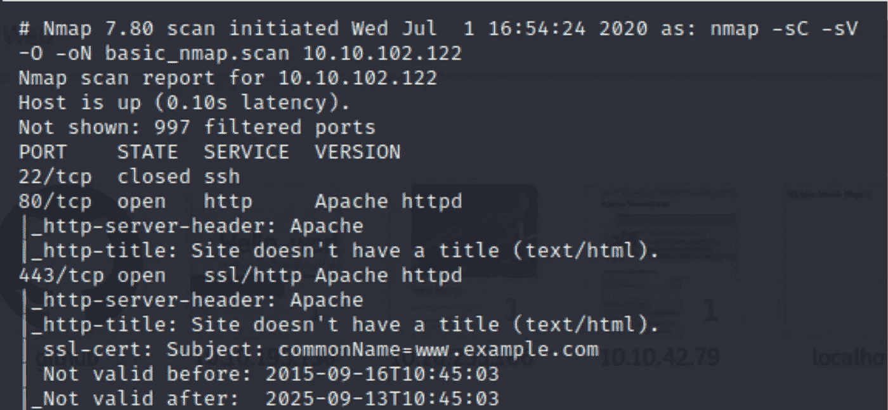

我们可以清楚地看到端口 80 是打开的，因此我们可以继续检查目标服务器上运行的 web 站点的内容。

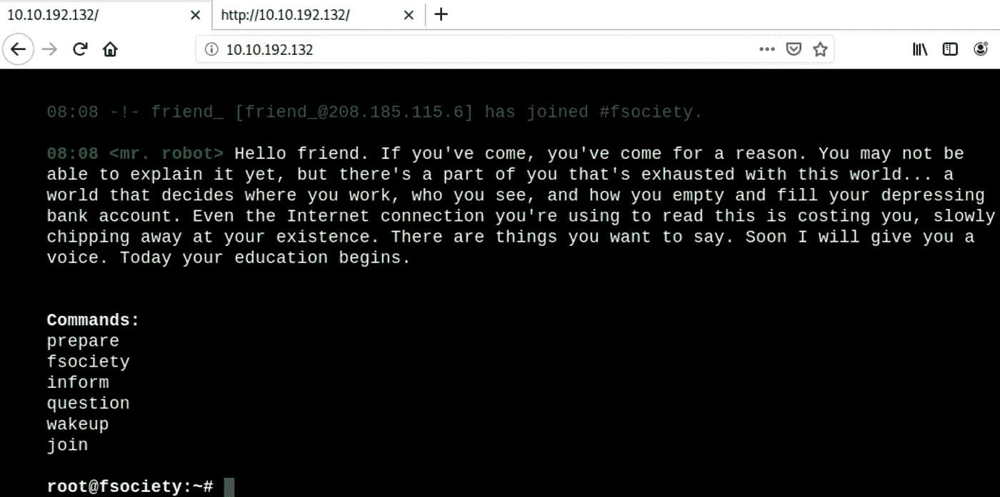

有一个动态网页，它有一些作为终端的功能。在继续之前，您可以探索 web 应用程序的不同领域，根据我的经验，检查网页的源代码通常可以揭示一些提示或开发说明。

现在，随着我们熟悉服务器的网站，我们可以继续进行一些额外的扫描，如 Nikto 和 GoBuster。

**nikto -h < ip 地址>**

**gobuster dir-u**[**http://<IP-address>**](/<ip-address>)**-w/usr/share/word lists/dirb/common . txt-o directory . txt**

当 Nikto 还在运行的时候，GoBuster 得出了一些有趣的结果，其中之一就是 robots.txt:

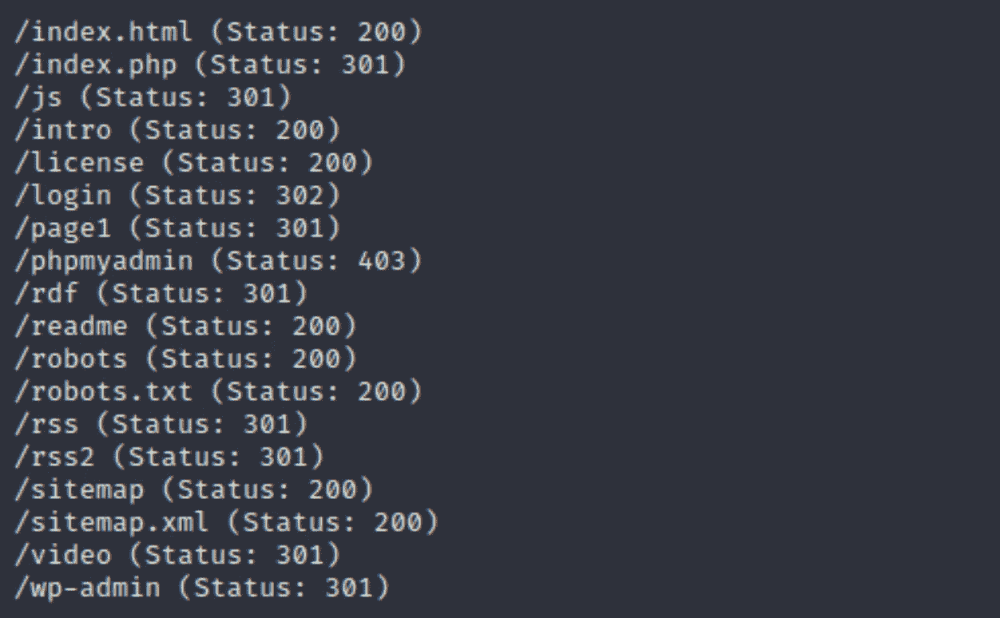

Robots.txt 是一个文件，它可以防止网络爬虫(蜘蛛)在互联网上映射网站，查看指定文件/目录的内容。在这种特殊情况下，无论是谷歌还是脸书，每个机器人都被限制映射 fsocity.dic 和 key-1-of-3.txt。我们很幸运，管理员没有仔细保护它们。

事不宜迟，让我们检查一下目录:

第一把钥匙在我们手里！此外，我们有一本字典。让我们检查一下它的内容:

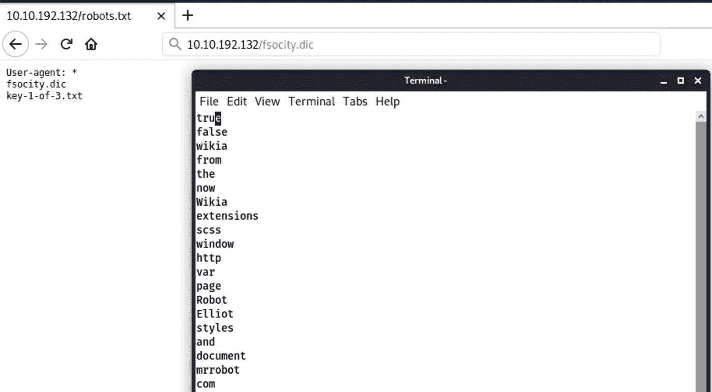

字典由 858160(**WC-l fsocity . DIC**)行看起来像用户名和密码的单词组成。所以，现在的目标是找到认证页面。幸运的是，我们有 GoBuster 已经解决了这个问题。

根据输出，服务器上正在运行一个 WordPress 应用程序。登录页面是 wp-login。

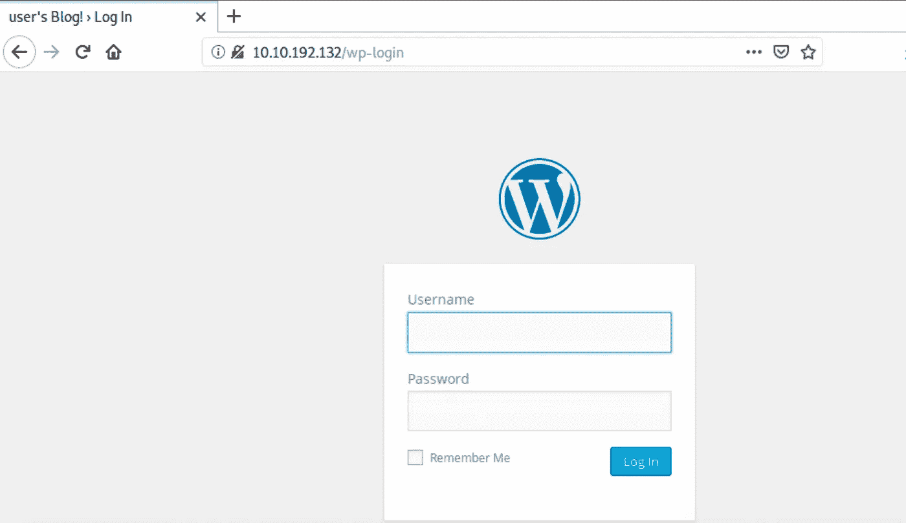

最初，我尝试了不同的用户名和密码组合:admin:admin、admin:password 等。而且没有成功。然而，在字典的最开始，有些单词可能是用户名(mrrobot，robot，Elliot)。所以我试了试，瞧！

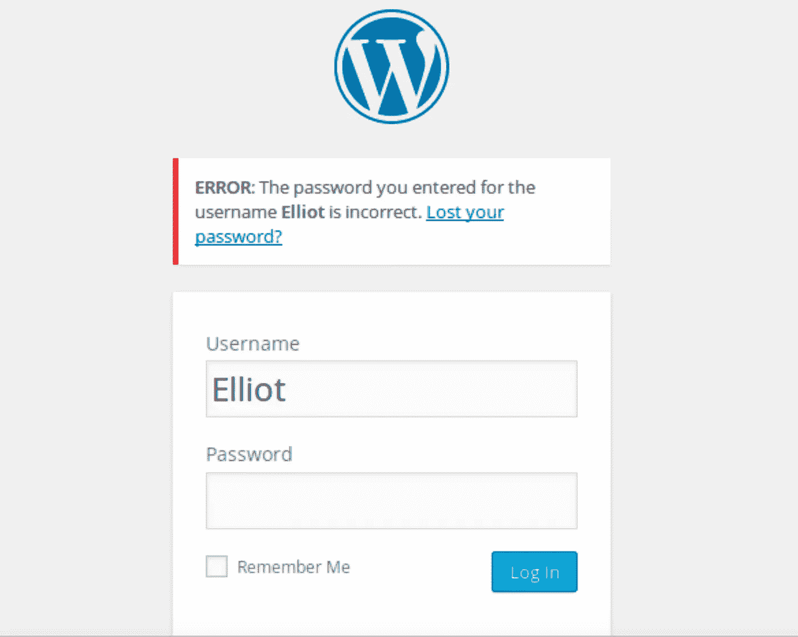

这个版本的 WordPress 的一个问题是，即使密码不正确，它也会提供用户名反馈。我们知道用户名是埃利奥特。然而，让我们假装我们仍然不知道用户名。为了找到它，我们将使用 Hydra 进行用户名枚举，使用 Wpscan 获取用户的密码。

首先，我们需要理解登录页面如何处理身份验证请求。打嗝套件将帮助我们做到这一点。

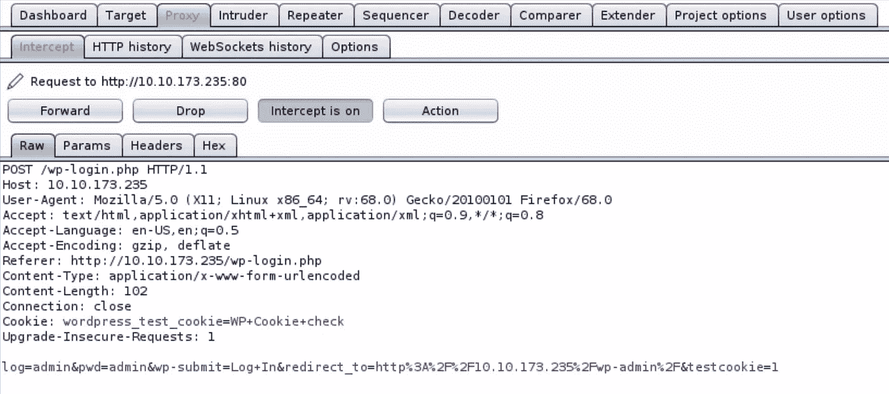

下面是截获的 HTTP post 请求。可以清楚地看到，登录页面使用的身份验证模式是基于表单的。但是服务器如何对假凭证做出反应呢？

服务器将“无效用户名”发送回我们的机器。在构建用于用户名枚举的 hydra 命令时，我们将需要这些信息。

该命令本身将如下所示:

细目分类:

**-V** 将显示每个用户名:密码的组合

**-L** 是用户名列表

**-p** 指定密码(在这种情况下，我们将使用什么密码并不重要，因为我们的主要目标是用户名)

**http-post-form** 是 web-form 之后的一种攻击方法

**^USER^** 是用户名(/root/Desktop/fsocity.dic)的占位符

**^PASS^** 是密码的占位符(随机)

没有**无效用户名**将告诉 hydra 停止暴力破解过程，因为组合是正确的。但是，当用户名和密码都匹配时，就会发生这种情况。在这种特殊情况下，它不会停止，因为我们的随机密码很可能是不正确的。

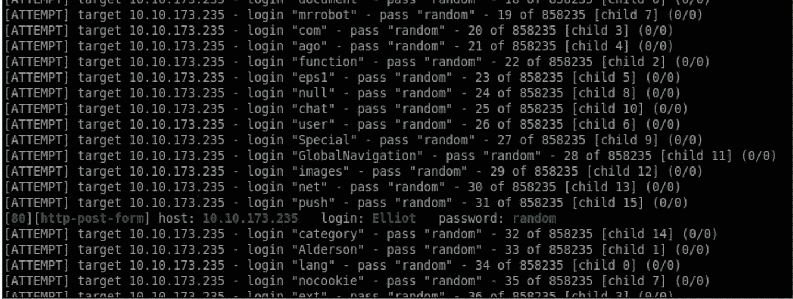

九头蛇没花多少时间就找到了用户名。

除了 Hydra，Wpscan 将用于密码暴力破解。但是之前我们需要对 fsocity.dic 进行排序，因为相同的单词出现不止一次。**排序**命令适合此目的。

uniq**将清除所有重复的单词。最终，我们将字典的大小缩小了 80 多倍！**

以下屏幕截图显示了 wpscan 密码暴力破解命令:

在我的 Wpscan 版本中，我只能使用用户列表，所以我创建了一个 user.txt 文件，其中包含一个用户——Elliot。

扫描的结果:

埃利奥特的密码是 ER28–0652。

成功了！此外，我们这里有一个管理员用户。

从这一点来说，我们可以使用管理员帐户的全部能力，上传 php-reverse-shell 作为 WordPress 的主题。

导航到外观选项卡并选择编辑器选项。

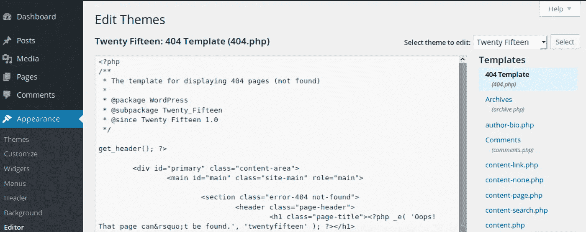

选择 404 模板并插入 php-reverse-shell，而不是默认的 php 代码。([http://pentest monkey . net/cheat-sheet/shell/reverse-shell-cheat-sheet](http://pentestmonkey.net/cheat-sheet/shells/reverse-shell-cheat-sheet))

在下面突出显示的字段中使用本地主机的 IP 地址，并选择随机端口(可选)。

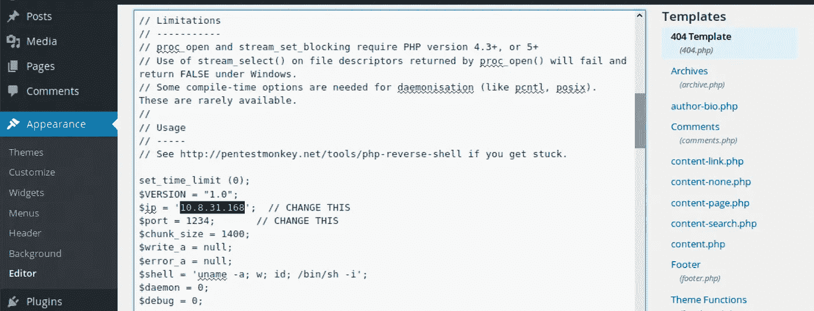

更新模板，启动 NetCat，并在 URL 中输入 404 模板的路径。

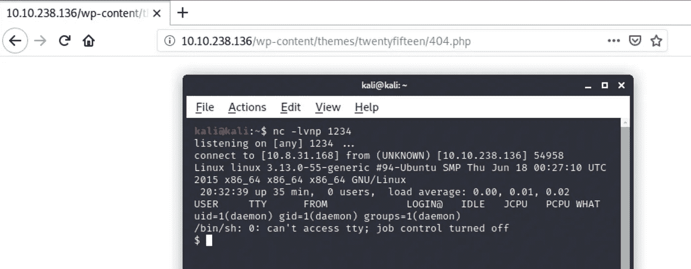

沿着 404 模板的路径，我们激活 php-reverse-shell 代码，使目标服务器连接回我们的本地主机。

通过使用 Python 的 Pty 模块，有机会使当前的 shell 更加稳定:

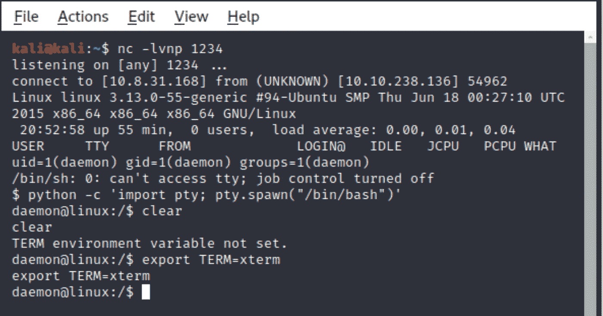

现在，我们可以毫无困难地使用常见的 Linux 命令。

此时，在目标服务器上做一些探索是有意义的。

机器人目录中有两个文件。第一个是机器人所需的密钥#2，第二个是以 MD5 格式存储的密码。由于设置了 everyone read 权限，我们可以读取它，并使用像 John the Ripper 这样的工具来破解它。

在继续处理开膛手约翰之前，需要将文件传输到本地机器上。你可以用 Linux **rsync** 工具来完成。

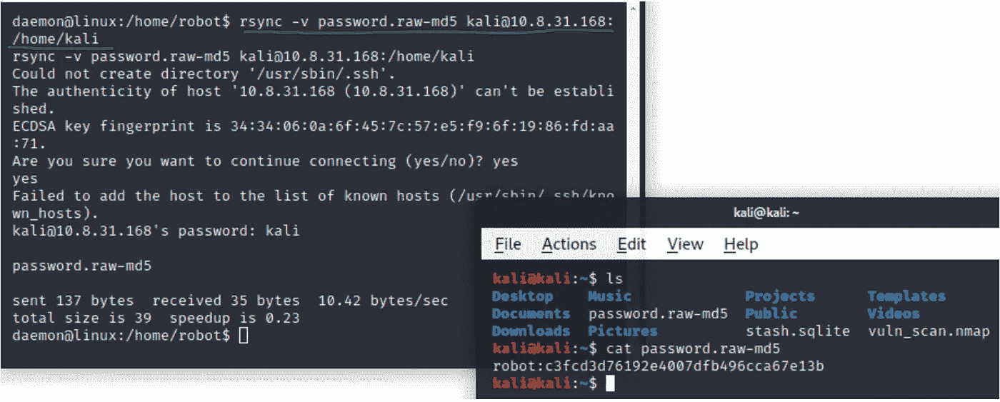

以下 John The Ripper 命令将用于破解哈希:

**约翰—format = raw-MD5 password . raw-MD5**

密码长度为 26 个字符，包含英文字母。

开膛手约翰的替代品是一个名为 CrackStation 的在线工具。

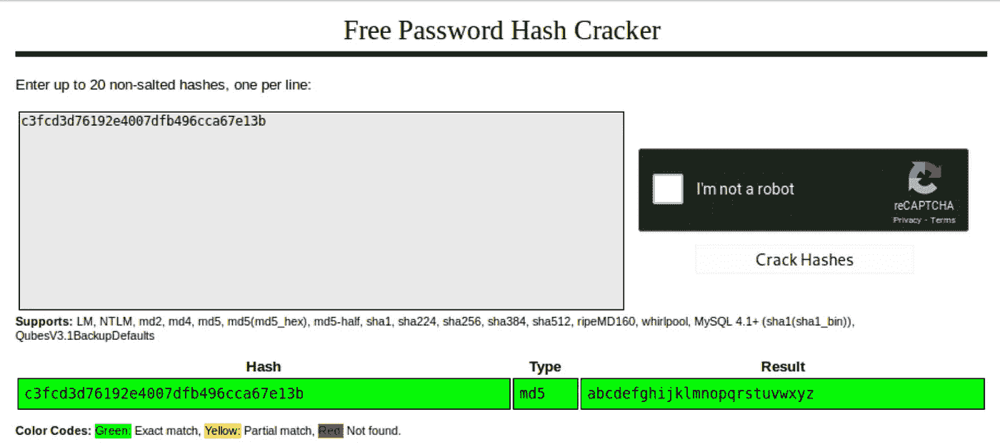

以机器人用户身份登录并检索标志#2。

为了进一步提升权限，您可以使用 LinPEAS 或 LinEnum 工具，它们将识别目标服务器中 PE 的潜在向量。为了扫描系统，我们需要将其中一个脚本传输到受害机器上。为此，我们可以使用 SimpleHTTPServer Python 模块。

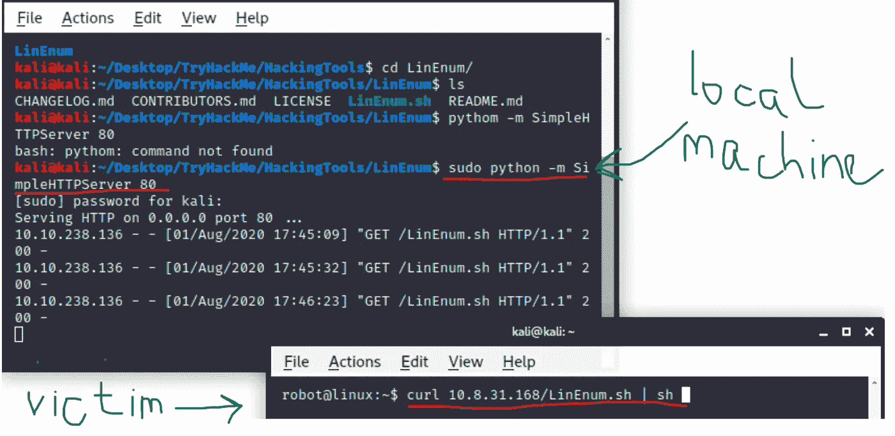

LinEnum 发现了一些有趣的文件:

安装了 Nmap 的 Ubuntu 网络服务器很不寻常。让我们仔细看看。

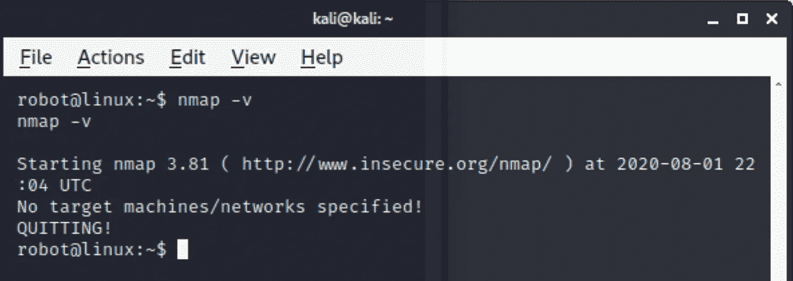

Nmap 版本是 3.81。此版本的 nmap 支持交互模式，该模式允许使用 shell 命令。

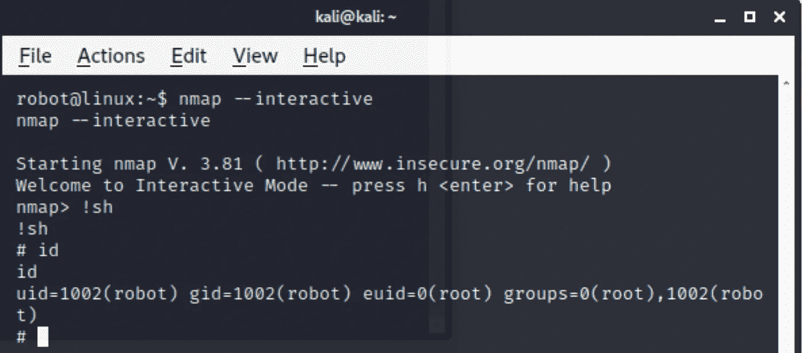

简单！sh 为我们提供了根壳。现在，我们可以拿到最后一面旗子了。

