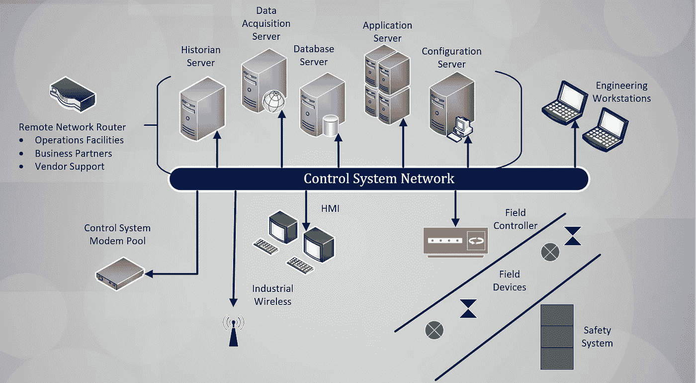

# 我们从现代网络战和国家支持的威胁(SCADA 和 ICS)中学到了什么

> 原文：<https://infosecwriteups.com/what-do-we-learn-from-the-modern-cyber-warfare-state-sponsored-threats-scada-ics-32d224288934?source=collection_archive---------4----------------------->

攻击监视和数据采集系统

# 这篇博客强调了现代网络战时代国家支持的组织最常用的攻击技术。

## 一旦我们了解了每种独特技术所遵循的攻击类型。为了了解攻击风险和影响，我们将每种攻击类型进一步细分为两个风险类别:

> **复杂程度** —了解在我们的环境中，剥削的难易程度。
> 
> **后果等级**——了解涉及哪些潜在风险，并据此制定防御策略。

(请注意，在本文中,“我们的”是指您的适用环境)

> 网络攻击是国家和技术面临的最新形式的风险。
> 
> 了解最常见的攻击？
> 
> 它们是如何工作的？
> 
> 剥削的可能性有哪些？
> 
> 对我们的环境会有什么影响？

ICS / SCADA 基础设施的网络架构图

# 内部威胁—技术人员

一名失望的技术人员通过“[肩膀冲浪](https://en.wikipedia.org/wiki/Shoulder_surfing_(computer_security))其他技术人员窃取凭证，并使用窃取的凭证将凭证重新用于控制物理过程的设备，并向连接到物理过程的节点发出重启或关闭指令，自动触发工厂部分停工。

*   复杂程度:这是一次中等复杂程度的攻击。ICS 技术人员往往对如何操作控制系统组件以实现特定目标(如关机)有很好的了解，但对基本工程概念或工业过程中设计的安全系统了解较少。
*   **后果等级:**这类事故通常会导致部分或全部工厂停工。根据内部威胁和工业过程的细节，更严重的物理后果是可能的。

# 一般恶意软件威胁—勒索软件攻击

一名工程师从 ICS 联网工程工作站搜索技术信息时意外下载了恶意软件。该恶意软件利用工业网络上尚未打补丁的已知漏洞对工程工作站进行加密，并传播到工业控制系统上的大多数 Windows 主机。工业网络中的大多数 Windows 主机都是加密的，关闭控制系统。受损的控制系统无法实现有序关闭。在几分钟内，工厂操作员触发了紧急安全关闭。紧急关闭程序损坏了工厂的重要设备，影响了数月的生产，甚至在勒索软件从控制系统中清除并重新启动工厂后也是如此。这种攻击的一种变体:勒索病毒感染 IT 工作站，并在触发加密之前，通过网络共享、USB 驱动器和已知网络漏洞上的自动运行文件传播数天。IT 和 ICS 网络上的几台机器因此被感染，结果与上述相同。

*   **复杂程度:**自主勒索软件的作者在网络方面可能非常复杂，他们制作的恶意软件可以通过网络快速自动传播，甚至可以逃避常见的防病毒系统和其他安全措施。然而，这些作者往往不了解物理工业过程或工业控制系统。
*   **后果等级:**最常见的情况是，这类事故造成的最小损失是持续数天的计划外关闭，从备份中恢复控制系统，并重新启动工业流程—通常是 5-10 天的生产损失。然而，在最坏的情况下，重要的设备可能会因为不受控制的关闭而受到不可挽回的损害。在这种情况下，需要购买和安装受损设备的替换物，并且在替换物不容易获得的情况下，受损设备的替换物必须自己制造，以便它们可以被安装和激活。在最坏的情况下，这些情况下的工厂停工时间可能长达 12 个月。

# 内部威胁— IT 工程师

一名失望的 IT 工程师偷看了 ICS 支持技术人员访问远程办公室时输入的远程访问凭据。失望的工程师随后使用凭证登录到该技术人员登录的同一远程 ICS 工程工作站。内部人员环顾工作站，最终找到并启动了工厂 HMI 的开发副本。工程师对系统的变通办法了解较少。他或多或少随意调出屏幕，按下任何看起来有害的按钮。这些行动导致工厂部分关闭。

*   复杂程度:这是一种简单的攻击。IT 工程师通常对网络工具、策略、控制系统或物理过程知之甚少，但是经常有社会工程机会，可以产生能够登录控制系统网络的证书。
*   **后果等级:**这类事件可能导致关闭，或者可能造成混乱。在最好的情况下，每次这样的事件都会触发对工厂设置的工程审查，以确保没有物理设备被错误配置并能够在未来导致故障。

# 有针对性的恶意软件威胁—勒索软件

具有良好计算机知识的攻击者利用网络钓鱼攻击和恶意附件瞄准 IT 工程师，通过远程访问工具(RAT)恶意软件在 IT 网络上获得立足之地。攻击者使用 RAT 窃取额外的凭证，最终获得对工业控制系统的远程访问。攻击者在整个 ICS 中植入勒索软件并索要赎金。该网站迅速切断受影响工厂与外部网络之间的所有电子连接，并试图支付赎金。支付机制失败，勒索软件自动激活，没有收到来自攻击者的赎金已支付的信号。勒索软件会擦除所有受感染设备中的硬盘和 BIOS 固件。工厂遭遇紧急关闭，损坏设备。更换和重新编程损坏的控制系统计算机需要一个月的时间，而更换损坏的物理设备需要更多的时间。

*   **复杂程度:**攻击者是网络老手。我们越来越多地看到有组织犯罪组织参与勒索软件。这些组织可以获得专业级恶意软件工具包和开发人员，以及专业级 RAT 操作员。
*   **后果等级:**固件被擦除的计算机、网络和其他设备通常必须更换——用网络攻击的说法，这些设备已经被“砌砖”了。同样，紧急关闭可能会损坏物理设备。

# 复杂的攻击威胁—恶意软件(勒索软件)零日攻击

一家情报机构错误地在基于互联网的命令和控制中心留下了操作系统、应用程序和防火墙沙箱中的零日漏洞列表。一个类似于发现 NSA 零日的“影子经纪人”的攻击组织发现了这份名单，并将其出售给一个有组织的犯罪集团。后一个组织创建了自主勒索软件，通过利用 Windows 操作系统中文件共享软件的零日漏洞进行传播。该恶意软件同时在全球数十个被入侵的网站上发布，并立即开始传播。在能够直接或间接与 IT 网络共享文件的工业站点，恶意软件会跳过防火墙感染并加密工业站点，导致紧急关闭并损坏物理设备。

*   复杂程度:随着时间的推移，网络攻击只会变得更加复杂。安全研究人员和其他人发现了零日漏洞，情报机构已经知道“失去跟踪”他们发现或购买的零日。这种攻击在网络方面非常复杂，在工程方面并不复杂。
*   **后果等级:**同样，此类事件造成的最小损失是持续数天的计划外关闭，从备份中恢复控制系统，并重新启动工业流程—通常是 5-10 天的生产损失。然而，在最坏的情况下，重要的设备可能会受到不可修复的损坏，需要花费昂贵的更换，这需要额外的几周或几个月。

# 网络战威胁——俄罗斯和乌克兰战争

一大群黑客级攻击者通过网络钓鱼攻击窃取 IT 远程访问密码。这些攻击者最终会破坏 IT Windows 域控制器，为自己创建新帐户，并授予新帐户通用管理权限，包括访问 ICS 设备的权限。攻击者登录 ICS 设备并观察 ICS HMI 的操作，直到他们了解了许多屏幕和控件的功能。此时，该小组接管 HMI 并使用它来误操作物理过程。同时，共同攻击者使用管理凭证登录 ICS 设备，擦除硬盘驱动器，并在可行的情况下擦除设备固件。变化:当针对其他类型的行业时，类似的攻击是可能的，擦除控制系统设备，并触发计划外停机。

*   **复杂程度:**这是 2016 年对乌克兰多家配电公司的攻击中使用的攻击技术的总结。攻击者对网络系统非常了解，但对配电流程和控制系统的了解有限。
*   **后果程度:**在袭击乌克兰的事件中，超过 20 万人断电长达 8 小时。只有当技术人员前往每个受影响的变电站，断开控制系统计算机，并再次手动打开电力流时，电力才得以恢复。更一般地说，计划外停机是这类攻击的后果，可能是紧急的、不受控制的停机，以及伴随这种停机的可能的设备损坏。

一群更加老练的攻击者使用了乌克兰攻击的技术，在网络攻击工具和电力系统的工程细节方面也更加老练。除了乌克兰攻击场景中攻击者的行为之外，更复杂的组织使用受损的 IT 域控制器来破解双因素身份认证，连接到保护性继电器，并对其进行重新配置，从而有效地禁用继电器。该组织现在非常迅速地连接和切断受影响的消费者的电力供应，破坏消费者家庭和企业中的冰箱、排水泵和其他电机。攻击者还改变由配电公司管理的少数高压输电变电站的电力流向，通过过载和过热来破坏高压变压器。

*   **复杂程度:**这群攻击者在网络和工程方面都相当复杂。
*   **后果等级:**此次攻击后果更加严重。商店中的许多大型冰箱已经无法使用，水分配系统中的大型水泵也同样损坏，消费者家中的大量小型设备也无法使用。高压变压器必须在紧急情况下更换，这需要一个多星期。这种变压器没有全球库存，因此在制造替换变压器的同时，通过减少电网其他部分的冗余和容量来获得紧急替换。

# 商品价格(石油或天然气)的市场操纵

一个有组织的犯罪集团瞄准互联网暴露服务中的已知漏洞，并在 IT 网络上获得立足点。他们将 RAT 工具植入受损系统，最终获得 Windows 域管理员权限。攻击者进入信任 IT Windows 域的 ICS 计算机，并向这些计算机传播 RAT 技术。因为 ICS 计算机无法将流量路由到互联网，所以攻击者通过对等连接，利用受损的 IT 设备来路由流量。一旦进入 ICS 网络，攻击者就下载并分析控制系统配置文件。然后，他们对单个 PLC 重新编程，使其误操作单个重要的物理设备，同时向工厂 HMI 报告设备运行正常。在对工厂商品输出(如石油或天然气)需求高的季节，设备会过早磨损。工厂关闭进行紧急维修，这是一种随机的设备故障。同样的攻击发生在附近的两家工厂。一旦设备出现故障，犯罪者就会从受影响的工厂的 ICS 网络中抹去所有他们存在的证据。受影响商品的价格在商品市场上飙升。当所有工厂的生产恢复正常时，商品价格也恢复正常。这种攻击在下一个高需求季节重复出现。

*   **复杂程度:**这次攻击和这些攻击者的网络复杂程度适中，没有使用零日，也没有编写代码。这种攻击的工程复杂性很高。攻击者需要能够解释控制系统配置的工程师，选择目标物理设备，识别控制该设备的 PLC，下载该 PLC 的现有程序，并设计和上传能够过早损坏目标物理设备的新程序，同时向 HMI 报告该设备运行正常。
*   **后果等级:**工厂生产损失和紧急设备修复费用。

# 复杂的市场操纵

更多网络老练的攻击者实施市场操纵攻击，但方式更难防范。他们利用面向互联网的系统中的已知漏洞来破坏一家服务公司的 IT 网络，该公司已知向他们的真正目标提供服务。攻击者编写他们的 RAT 恶意软件并仅在服务公司部署它，这样反病毒工具就无法检测到 RAT。攻击者使用 RAT 来破坏经常访问真实目标的人员的笔记本电脑。当他们检测到被入侵的笔记本电脑连接到真实目标的 IT 网络时，攻击者通过远程控制操作 RAT，并将 RAT 传播到目标的 IT 网络中。在目标的 IT 网络内部，攻击者继续操作 RAT。入侵检测系统看不到 RAT 的活动，因为攻击是低量的，使用命令行而不是远程桌面风格的通信，并且 C2 命令和控制通信被编码在与受损网站的看似无害的通信中。攻击最终会传播到 ICS 网络，其后果与市场操纵攻击相同。

*   **复杂程度:**这种攻击和这些攻击者的网络复杂程度很高。没有使用零日，但是攻击者开发了带有本地语言编码通信的定制恶意软件。与市场操纵攻击一样，工程复杂程度很高。
*   **后果等级:**工厂生产损失和紧急设备修复费用。

# 手机 WIFI

以地理位置为目标，对他们出于某种原因不满意的地理位置造成破坏。攻击者创建了一个吸引人的手机应用程序——称之为世界上最花哨的免费应用程序。攻击者使用有针对性的社交媒体攻击，说服违规地理位置的关键基础设施站点的办公室工作人员下载该应用程序，与普通应用程序相比，该应用程序会请求更多权限，但这些员工并不具备网络智能，在批准之前不会考虑太多。该应用程序在手机后台持续运行。在他们的关键基础设施工作场所，该应用程序指示手机定期扫描 WIFI 网络，并向指挥和控制中心报告此类网络。攻击者再次使用社交媒体、社交工程和网络钓鱼攻击来冒充目标组织的内部人员，并获取 WIFI 网络的密码。其中一些密码保护网络是关键基础设施工业控制系统的一部分。攻击者使用受损的手机登录这些网络，并通过远程控制查看网络，直到他们发现计算机组件容易受到简单的拒绝服务攻击，如擦除硬盘驱动器或 SYN 数据包泛滥。攻击者破坏电厂运行，触发计划外关闭，断开 WIFI 网络，并在几天后重复。类似的恶意软件变种也可能被植入在 ICS WIFI 网络范围内工作的办公室工作人员的笔记本电脑中。

*   **复杂程度:**这种攻击目前需要高度的网络复杂性，因为目前开放的互联网上不存在支持这种从手机进行隐藏 WIFI 黑客攻击的工具包，因此攻击者需要自己编写或购买这种恶意软件。一旦这种攻击工具被广泛公开，这类攻击就会落入对工业企业不满的黑客组织的手中。这种攻击只需要非常低的工程复杂度。
*   **后果等级:**工厂因难以识别的原因而反复关闭。工厂人员应最终确定攻击的来源是 WIFI 网络，并关闭工厂的所有 WIFI，或至少更改所有密码。

*来自 Infosec 的报道:Infosec 上每天都有很多事情发生，很难跟上。* [***加入我们的每周简讯***](https://weekly.infosecwriteups.com/) *以 5 篇文章、4 个线程、3 个视频、2 个 Github Repos 和工具以及 1 个工作提醒的形式免费获取所有最新的 Infosec 趋势！*