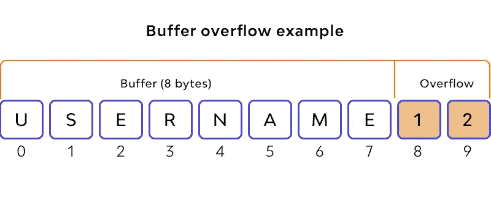
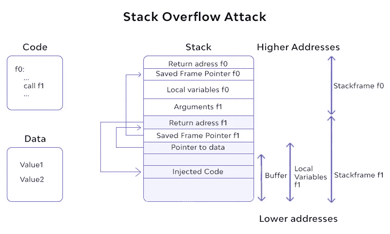
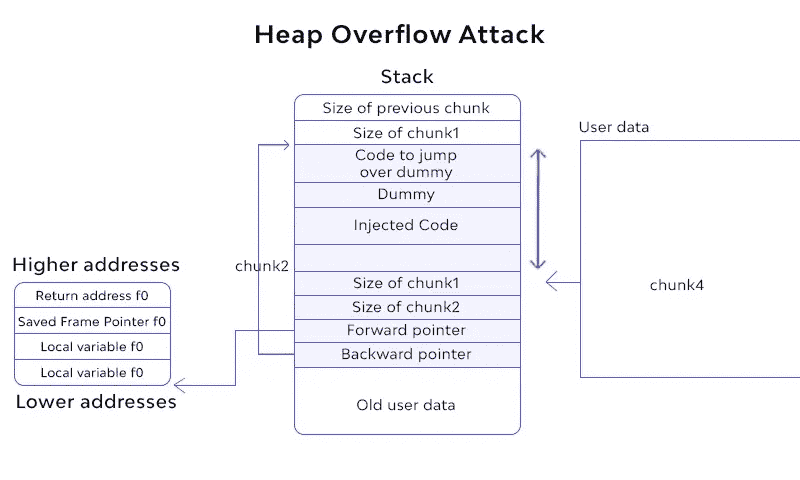

# 什么是缓冲区溢出 Attack❓类型，黑客如何使用它| Wallarm

> 原文：<https://infosecwriteups.com/what-is-a-buffer-overflow-attack-types-how-hackers-use-it-wallarm-ca5e6e255f79?source=collection_archive---------4----------------------->

缓冲区是物理存储内存的一个空间，用于在从一个位置移动到另一个位置时存储临时数据。这些缓冲区通常位于 RAM 中。计算机经常使用缓冲区来提高性能；大多数现代硬盘都利用缓冲的优势来高效地访问数据，许多在线应用服务也使用缓冲。例如，在线视频流传输过程中经常使用缓冲区来防止干扰。当视频被流式传输时，视频播放器同时下载并在缓冲区中存储 20%的视频，然后从该缓冲区流式传输。因此，连接速度的小幅降低或服务的快速中断不会影响视频流的性能。

然而，缓冲区包含一定量的数据，这限制了它在有限的时间内保存有限的数据，因为多个应用程序使用这种缓冲机制。结果，当更多的数据被推入缓冲区时，出现了一种情况，这种情况称为缓冲区溢出。当向缓冲区写入数据的软件超过缓冲区容量时，就会出现这种缺陷，从而导致覆盖相邻的内存位置。也就是说，太多的信息被传输到没有足够空间的存储库，并且这些信息逐渐被相邻的存储库数据所取代。

缓冲区溢出会影响所有类型的软件。这些通常是非正式的输入或者没有为缓冲区分配足够的空间。如果事务违反了可执行代码，程序可能会执行不定，并导致错误的结果、内存访问位置错误或崩溃。

例如，登录数据的缓冲区可以配置为要求输入 8 字节的用户名和密码，因此如果事务包含 10 字节(即比预期多 2 字节)的输入，程序可以写下超过缓冲区限制的多余数据。

# 攻击者如何利用缓冲区溢出？

恶意参与者可以小心地将自定义输入加载到程序中，启动应用程序，试图将输入存储在不够大的缓冲区中，并覆盖内存的相关部分。如果程序的内存缓冲区是确定的，黑客可能故意覆盖被标识为保存可执行代码的空间。然后，攻击者可以用自己的可执行代码段来更改这段代码，这可能会极大地改变程序的工作方式。

例如，如果内存中被重写的部分包含一个指针(指向内存中另一个位置的对象)，攻击者的代码可以替换指向有效负载的代码。这可以将整个程序的控制权转移给攻击者的代码。

缓冲区溢出可能发生在提供静态和动态 web 结构的 web 应用服务器服务中，也可能发生在应用程序本身中。由于对服务器产品中的缓冲区溢出有广泛的了解，这些产品的用户被认为处于高风险中。在各种 web 应用程序(如图形)中使用归档来生成图像增加了缓冲区溢出的潜在风险。

缓冲区溢出可以在单个 web 应用程序的代码中创建，并且由于 web 应用程序扫描不正常，预计会有更多的缓冲区溢出。缓冲区溢出错误在某些 web 应用程序中不太常见，因为在特定的应用程序中很少有恶意行为者试图捕获和利用此类错误。当特定的应用程序检测到它时，利用错误的能力被极大地降低，因为黑客通常无法获得应用程序的源代码及其错误消息。

# 谁容易受到缓冲区溢出攻击？

缓冲区的漏洞在 C 之类的编程语言中被淹没，以安全换取效率，并且不控制内存访问。在诸如 Python、PHP、Perl、Java 或 JavaScript 等经常用于构建 Web 应用程序的高级编程语言中，不应该存在缓冲区溢出攻击疏忽。在这些编程语言中，不能将不必要的数据放在目标缓冲区中。

即使是使用高级语言的程序员也需要意识到缓冲区攻击，并特别注意它们。他们的程序通常运行在用 C 编写的操作系统上，或者使用 C 语言的运行时环境，这种 C 代码可能容易受到这种攻击。

最新的操作系统具有运行时保护，以防止缓冲区溢出攻击。然而，几乎所有已知的 Web 服务器、应用程序服务器和应用程序环境都存在缓冲区溢出的风险，除了那些设计用来解释 Java 或 Python 之类的语言的环境(解释器除外)，它们对这些攻击是免疫的。

有些编码语言比其他语言对缓冲区溢出更敏感。C 和 C ++是两种常见的易受攻击的语言，因为它们不包含防止访问或覆盖内存数据的内置保护。在 Windows、Mac OSX 和 Linux 中，代码是用这些语言中的一种或两种编写的。更现代的语言，如 Java、PERL 和 C#都有内置特性，有助于减少缓冲区溢出的机会，但不能完全防止它。

# 缓冲区溢出攻击的类型:

有许多不同的缓冲区溢出攻击，它们使用不同的策略，针对不同的代码段。以下是最著名的缓冲区溢出攻击:

*   **堆栈溢出攻击** —这是最常见的缓冲区溢出攻击类型，涉及调用堆栈中的缓冲区溢出。
*   **堆溢出攻击** —这种类型的攻击以开放内存池(称为堆)中的数据为目标。
*   **整数溢出攻击** —整数溢出时，算术运算导致整数(Integer)过大，无法存储整数类型；这可能导致缓冲区溢出。
*   **Unicode 溢出** — Unicode 溢出通过将 Unicode 字符插入到预期的 ASCII 字符输入中来创建缓冲区溢出。(允许计算机显示文本的 ASCII 和 unicode 编码标准。例如，ASCII 数字 97 代表字母“a”。虽然 ASCII 码只包括西方语言字符，但 unicode 是可以创建字符的世界。几乎在任何书面语言中。如果 unicode 中有更多的其他字符，许多 unicode 字符会比大多数 ASCII 字符大。

# 堆栈溢出攻击:

堆栈是一种后进先出的数据结构。它支持两种操作:推送和弹出。PUSH 操作用于指定钢的值，POP 操作用于提取钢的值。如果放在堆栈上的数据损坏，它们将覆盖相邻的内存位置，并影响其他程序已经存储的数据或指针。Steel overflow 是一个老漏洞，它使用只在运行时存在的堆栈内存。漏洞通常出现在 C 或 C ++中，因为我们可以在这些语言中自由使用指针。攻击者或黑客可以利用此漏洞，通过操纵数据或创建指针来运行恶意代码，从而利用系统。

# 堆溢出攻击:

当一块内存被分配给堆，并且数据被写入该内存而没有被检查时，发生堆溢出。这可能会导致堆中的一些关键数据结构(如堆头)或任何基于堆的数据(如动态对象指针)会覆盖虚函数表。

# 整数溢出攻击:

整数溢出是一种算术溢出错误，其中整数运算的结果不在分配的内存空间中。它通常会导致意想不到的结果，而不是程序错误。在大多数编程语言中，整数值通常在内存中有一定的位数。

例如，为 32 位整数数据类型保留的空间可以是 0 到 4，294，967，295 之间的无符号整数，或者是 2，147，483，648 到 2，147，483，647 之间的有符号整数。但是，如果您计算 4，294，967，295 + 1，并尝试存储超过整个类型最大值的结果，会发生什么情况呢？因为大多数语言和大多数编译器根本不出错，只执行取模、接受或截断操作，所以它只会崩溃并使您面临被攻击的风险。

大多数整数溢出情况只会导致错误的程序行为，但不会导致任何漏洞。然而，在某些情况下，整数溢出可能会产生严重的后果，如操纵财务计算，导致客户收到借方而不是贷方或类似情况。

# Unicode 溢出:

创建 Unicode 字符串是为了确保任何国家的所有语言都可以使用而不会出现转录问题。例如，阿拉伯字符不同于英语字符。他意识到这样的字符不能根据我们知道的 ASCII 码进行转换。Unicode 字符串可以使用任何字符。Unicode 模式允许用户通过在需要 ASCII 字符的输入中键入 Unicode 字符来利用程序。它只是提供超过最大限制的输入，使缓冲区溢出不确定的 Unicode 字符，而程序需要 ASCII 输入。

‍

续在[第二部分](https://www.wallarm.com/what/buffer-overflow-attack-preventing-and-mitigation-methods-part-2)

*最初发表于*[T5【https://www.wallarm.com】](https://www.wallarm.com/what/buffer-overflow-attack-definition-types-use-by-hackers-part-1)*。*